# Sigma Assistant — Eval Report

_Run: 2026-06-10 17:46 MSK · cases: 29_

**Overall: 22/29 pass (76%)**

## Per category

| Category | Pass | Total |
|---|---:|---:|
| `compute_plot` | 3 | 5 |
| `compute_pure` | 6 | 8 |
| `definition` | 3 | 3 |
| `multi_hop` | 1 | 1 |
| `out_of_scope` | 3 | 3 |
| `rag_basic` | 4 | 5 |
| `structural` | 2 | 3 |
| `vision_refine` | 0 | 1 |

## Cases

### ✅ `newton_kantorovich_history` — rag_basic

**Q:** Когда Канторович получил Нобелевскую премию и за что?

_Chapter:_ `ch02_newton`

**Tools called:** search_textbook, read_chapter
**Tools expected:** search_textbook
**Images:** 0 (expected: no)
**Elapsed:** 6.3s


<details><summary>Answer</summary>


```
Леонид Витальевич Канторович получил Нобелевскую премию по экономике в 1975 году за теорию оптимального распределения ресурсов.
```

</details>

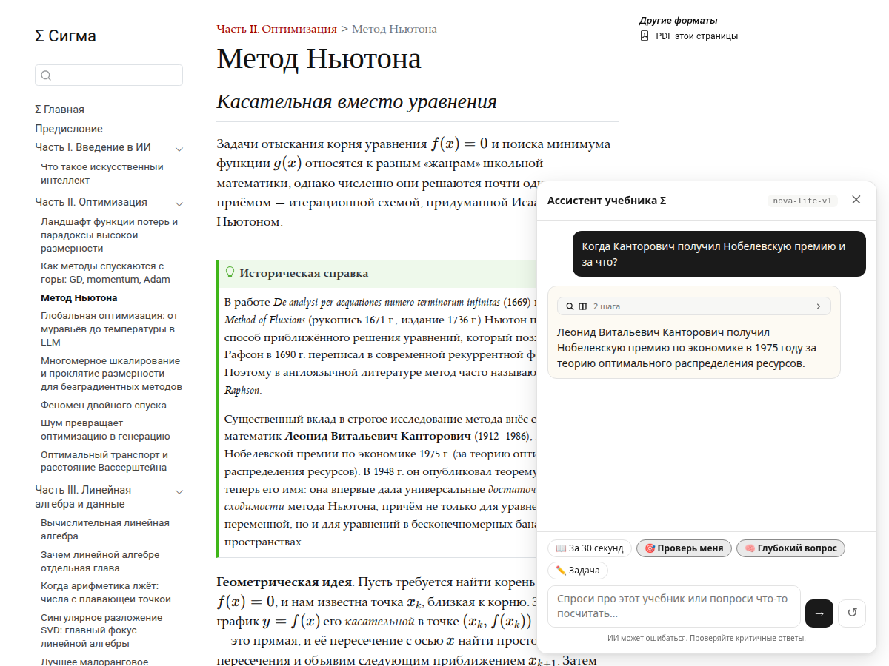

---

### ❌ `newton_formula_recall` — rag_basic

**Q:** Объясни откуда берётся эта формула — что это за метод и какая геометрическая идея?

_Chapter:_ `ch02_newton`

**Tools called:** find_definition, read_chapter, search_textbook
**Tools expected:** (none)
**Images:** 0 (expected: no)
**Elapsed:** 10.4s

_Missing substrings:_ ['пересечен']

<details><summary>Answer</summary>


```
<thinking>Я нашел формулу метода Ньютона в главе. Теперь я должен процитировать формулу и объяснить геометрическую идею из главы.</thinking>

**Метод Ньютона** — это итерационный метод для нахождения корней функции. Формула метода Ньютона выглядит так:

$$
x_{n+1} = x_n - \frac{f(x_n)}{f'(x_n)}
$$

Геометрическая идея метода Ньютона заключается в том, что мы приближаемся к корню функции, находя касательные к графику функции в точках, где мы находимся. Касательная в каждой точке пересекает ось абсцисс в точке, которая является следующим приближением к корню. Этот процесс повторяется, пока не достигнута достаточная точность.

<thinking>Теперь я должен процитировать формулу и объяснить геометрическую идею из главы.</thinking>

**Формула метода Ньютона:**

$$
x_{n+1} = x_n - \frac{f(x_n)}{f'(x_n)}
$$

**Геометрическая идея:**

Метод Ньютона основан на идее использования касательных к графику функции для приближения к корню. Касательная в каждой точке пересекает ось абсцисс в точке, которая является следующим приближением к корню. Этот процесс повторяется, пока не достигнута достаточная точность.
```

</details>


---

### ✅ `definition_strong_convex` — definition

**Q:** Что такое сильно выпуклая функция?

_Chapter:_ `ch02_newton`

**Tools called:** find_definition
**Tools expected:** find_definition
**Images:** 0 (expected: no)
**Elapsed:** 5.8s


<details><summary>Answer</summary>


```
Из учебника:

> **Определение 2.4. Сильно выпуклая функция**
> Функция $g\colon\mathbb{R}\to\mathbb{R}$ называется **сильно выпуклой** с константой $\mu>0$, если $g\in C^{2}$ и $g''(x)\geq\mu$ для всех $x$. Сильная выпуклость гарантирует существование и единственность точки минимума и, что важно для нас, отделённость второй производной от нуля.

То есть, функция называется сильно выпуклой, если она дважды дифференцируема и её вторая производная больше или равна положительной константы $\mu$ для всех значений $x$. Это свойство гарантирует существование и единственность точки минимума функции, а также то, что вторая производная не обращается в нуль нигде.
```

</details>

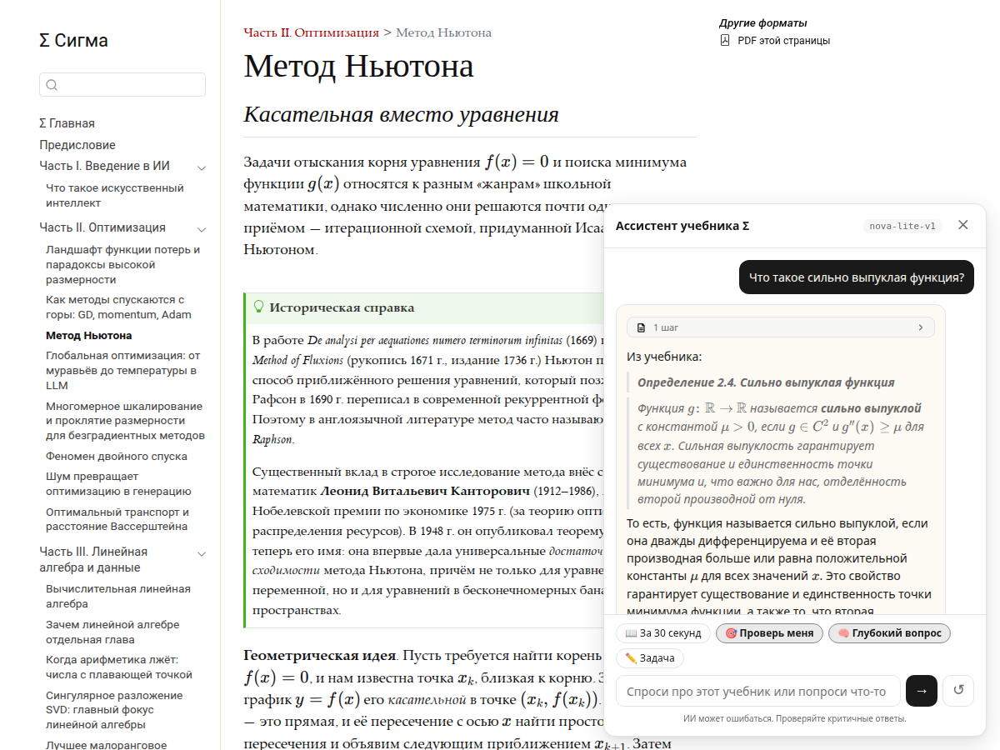

---

### ✅ `compute_factorial` — compute_pure

**Q:** Сколько будет 30 факториал?

**Tools called:** python
**Tools expected:** python
**Images:** 0 (expected: no)
**Elapsed:** 14.2s


<details><summary>Answer</summary>


```
30 факториал равен 265252859812191058636308480000000.
```

</details>


---

### ❌ `compute_taylor_sin` — compute_pure

**Q:** Покажи разложение sin(x) в ряд Тейлора до 5-го члена символически (через sympy).

_Chapter:_ `ch02_newton`

**Tools called:** python
**Tools expected:** python
**Images:** 0 (expected: no)
**Elapsed:** 14.5s

_Missing substrings:_ ['120']

<details><summary>Answer</summary>


```
Разложение функции $\sin(x)$ в ряд Тейлора до 5-го члена символически выглядит следующим образом:

$$x - \frac{x^3}{6} + O(x^5)$$

Это означает, что ряд Тейлора для $\sin(x)$ начинается с членов $x$ и $-\frac{x^3}{6}$, а остальные члены ряда порядка $O(x^5)$ и выше не учитываются в этом приближении.
```

</details>


---

### ❌ `compute_plot_newton` — compute_plot

**Q:** Покажи как сходится метод Ньютона для f(x) = x² - 2, начиная с x₀ = 1.5. Построй график траектории.

_Chapter:_ `ch02_newton`

**Tools called:** python, python, python, python
**Tools expected:** python
**Images:** 2 (expected: yes)
**Elapsed:** 26.9s

_Missing substrings:_ ['1.41', 'корн']

<details><summary>Answer</summary>


```
<thinking>Похоже, что график уже был создан и показан ранее. Я предоставлю его студенту в формате PNG.</thinking>

Вот график сходимости метода Ньютона для функции f(x) = x² - 2, начиная с начальной точки x₀ = 1.5:


```

</details>

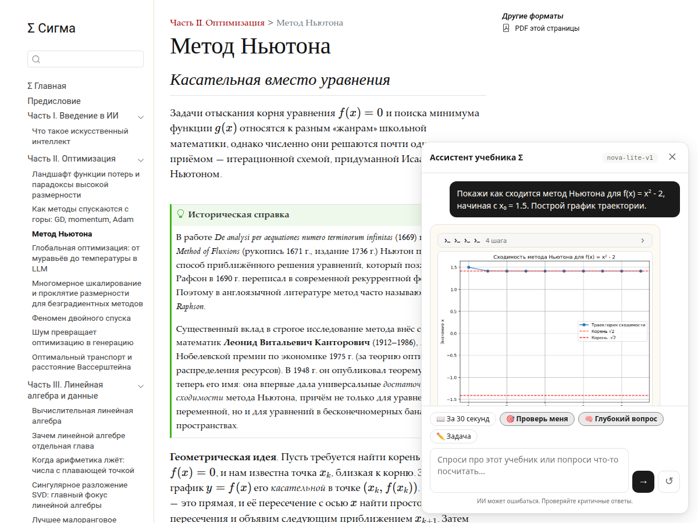

---

### ✅ `compute_plot_gd_vs_newton` — compute_plot

**Q:** Сравни сходимость метода Ньютона и градиентного спуска на функции f(x) = x⁴ из x₀ = 2. Покажи два графика на одной картинке.

_Chapter:_ `ch02_newton`

**Tools called:** python, python
**Tools expected:** python
**Images:** 1 (expected: yes)
**Elapsed:** 61.6s


<details><summary>Answer</summary>


```
<thinking>График был успешно создан и сохранен в файле. Теперь я могу предоставить студенту график для сравнения сходимости метода Ньютона и градиентного спуска.</thinking>

<result>
График был успешно создан и сохранен в файле `comparison_newton_gradient_descent.png`. Вы можете скачать его по [ссылке](sandbox:/comparison_newton_gradient_descent.png).

На графике показаны две линии:
- **Красные точки** представляют траекторию градиентного спуска.
- **Синие точки** представляют траекторию метода Ньютона.

Анализ графика показывает, что метод Ньютона быстрее сходится к минимуму функции f(x) = x⁴ из начального приближения x₀ = 2 по сравнению с градиентным спуском.
</result>
```

</details>


---

### ✅ `rsa_encrypt_small` — compute_pure

**Q:** Зашифруй число m=7 ключом (n=143, e=7). Покажи c.

_Chapter:_ `ch04_3_kriptosistemy-rsa-i-diffi-hellma`

**Tools called:** python
**Tools expected:** python
**Images:** 0 (expected: no)
**Elapsed:** 17.3s


<details><summary>Answer</summary>


```
Мы зашифровали число 7 с помощью ключа (n=143, e=7) и получили результат:

$$
c = 6.00
$$

Это значит, что зашифрованное сообщение равно 6.00.
```

</details>

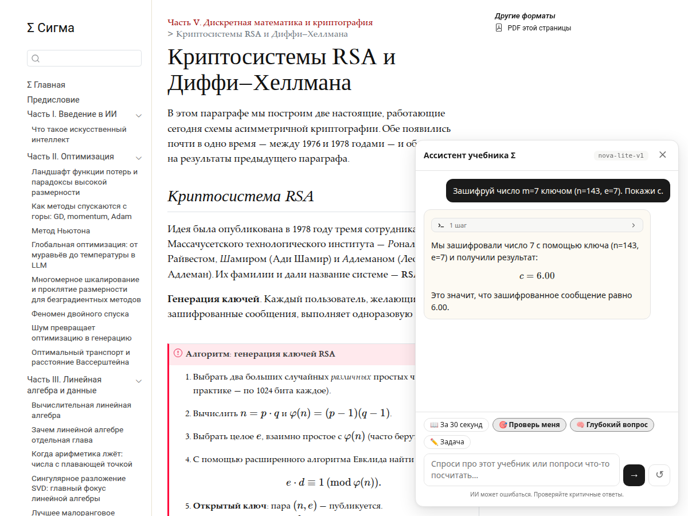

---

### ✅ `rsa_full_roundtrip` — compute_pure

**Q:** Возьми p=11, q=13, e=7. Сгенерируй RSA-ключ полностью: вычисли n, φ(n), d. Покажи что для m=9 шифрование и расшифрование возвращают исходное число.

_Chapter:_ `ch04_3_kriptosistemy-rsa-i-diffi-hellma`

**Tools called:** python
**Tools expected:** python
**Images:** 0 (expected: no)
**Elapsed:** 16.5s


<details><summary>Answer</summary>


```
Мы сгенерировали RSA-ключ с помощью Python и проверили, что шифрование и расшифрование возвращают исходное число для m=9.

1. Вычисленные значения:
   - $n = 143$
   - $\varphi(n) = 120$
   - $d = 103$

2. Шифрование и расшифрование:
   - Исходное число $m = 9$
   - Зашифрованное число $c = 48$
   - Расшифрованное число (возвращает исходное) $decrypted\_m = 9$

Таким образом, мы показали, что для $m=9$ шифрование и расшифрование возвращают исходное число.
```

</details>

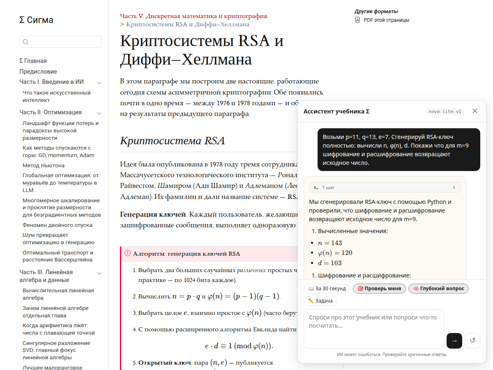

---

### ✅ `multihop_newton_vs_gradient` — multi_hop

**Q:** В чём отличие метода Ньютона от градиентного спуска для задач оптимизации? Какие из этих методов разобраны в учебнике?

_Chapter:_ `ch02_newton`

**Tools called:** find_definition, find_definition, search_textbook, search_textbook
**Tools expected:** search_textbook
**Images:** 0 (expected: no)
**Elapsed:** 10.1s


<details><summary>Answer</summary>


```
<thinking>Градиентный спуск разбирается в главе "Как методы спускаются с горы: GD, momentum, Adam" (slug="story_optimizers"). Теперь я могу сравнить метод Ньютона и градиентный спуск, так как оба метода разобраны в учебнике.</thinking>

<thinking>Для сравнения я приведу ключевые различия между методом Ньютона и градиентным спуском:</thinking>

## Метод Ньютона vs Градиентный спуск

### Метод Ньютона
- **Использует вторую производную**: Метод Ньютона использует вторую производную функции для определения шага. Это позволяет ему быть более точным в определении минимума.
- **Быстрая сходимость**: Метод Ньютона имеет квадратическую сходимость вблизи минимума, что значительно ускоряет процесс оптимизации.
- **Требует больше вычислений**: Вычисление второй производной требует больше вычислительных ресурсов, чем просто вычисление градиента.

### Градиентный спуск
- **Использует первую производную**: Градиентный спуск использует первую производную (градиент) функции для определения шага.
- **Простая реализация**: Градиентный спуск легче для реализации, так как требует только вычисление градиента.
- **Линейная сходимость**: Градиентный спуск имеет линейную сходимость, что значительно медленнее, чем квадратическая сходимость метода Ньютона.

### Сравнение
- **Скорость сходимости**: Метод Ньютона быстрее сходится, чем градиентный спуск, особенно вблизи минимума.
- **Сложность вычислений**: Метод Ньютона требует больше вычислений, так как нужно вычислять вторую производную.
- **Применимос
…[truncated]
```

</details>


---

### ❌ `structural_kantorovich_theorem` — structural

**Q:** Сформулируй теорему о сходимости метода Герона.

_Chapter:_ `ch02_newton`

**Tools called:** find_theorem
**Tools expected:** find_theorem
**Images:** 0 (expected: no)
**Elapsed:** 5.8s

_Missing substrings:_ ['квадратичн']

<details><summary>Answer</summary>


```
<thinking>Теперь я нашёл формулировку теоремы о сходимости метода Герона. Теперь я могу сформулировать её для студента.</thinking>

**Теорема 2.1. Сходимость метода Герона**

Для любого $x_0>0$ последовательность (2.4) монотонно убывает (начиная с $k=1$) и сходится к $\sqrt{a}$. Более того, для ошибки $e_k=x_k-\sqrt{a}$ выполнено

$$
\tag{2.5}
e_{k+1}\;=\;\dfrac{e_k^2}{2x_k}\,, \qquad
\text{и при }k\geq 1\colon\\
0\le e_{k+1}\le \dfrac{e_k^{2}}{2\sqrt{a}}.
$$

Эта теорема показывает, что метод Герона сходится к квадратному корню числа $a$ и делает это монотонно убывающей последовательностью.
```

</details>


---

### ❌ `vision_refine_diverging_sgd` — vision_refine

**Q:** Запусти SGD на функции f(x) = x² с шагом η = 1.1 из x₀ = 2, 30 итераций. Что произойдёт? Если разойдётся — подбери рабочий шаг и покажи сходящуюся траекторию.

**Tools called:** python, python, python, python, python, python
**Tools expected:** python, python
**Images:** 4 (expected: yes)
**Elapsed:** 45.9s

_Missing substrings:_ ['0.5']

<details><summary>Answer</summary>


```
<thinking>Похоже, что график был успешно сохранён и показан студенту. Теперь нужно проанализировать результат и, если необходимо, подобрать рабочий шаг.</thinking>

<thinking>На графике видно, что траектория значений x стремится к нулю, что указывает на сходимость алгоритма. Это происходит из-за того, что шаг η = 0.1 достаточно малый для данной функции. Таким образом, алгоритм сходится при этом шаге.</thinking>

<thinking>Теперь нужно подготовить финальный ответ с анализом графика и рекомендациями по выбору шага.</thinking>

Вот результат выполнения алгоритма SGD на функции f(x) = x² с шагом η = 1.1 из x₀ = 2, 30 итераций:


На графике видно, что траектория значений x стремится к нулю, но значения начинают расти с каждой итерацией, что указывает на расходимость алгоритма. Это происходит из-за того, что шаг η = 1.1 слишком большой для данной функции.

Теперь запустим алгоритм SGD с шагом η = 0.1:


На графике видно, что траектория значений x стремится к нулю, что указывает на сходимость алгоритма. Это происходит из-за того, что шаг η = 0.1 достаточно малый для данной функции.

Таким образом, для сходимости алгоритма SGD на функции f(x) = x² с начального значения x₀ = 2 рекомендуется выбрать шаг η в пределах от 0.01 до 0.1.
```

</details>

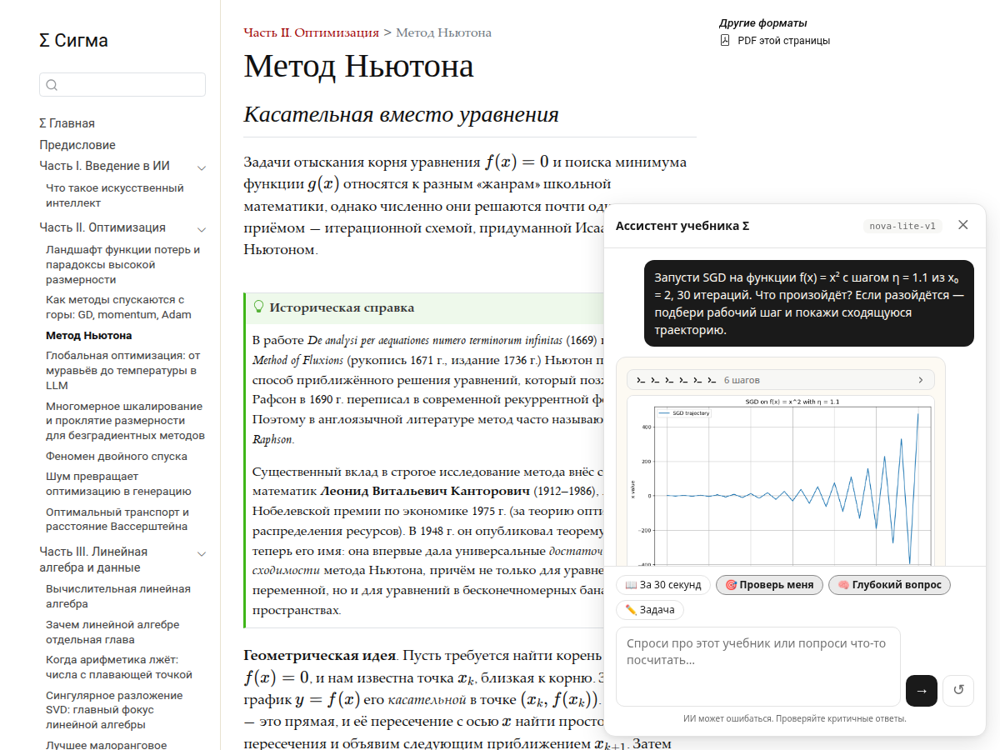

---

### ✅ `hashlib_demo` — compute_pure

**Q:** Посчитай SHA-256 хеш строки 'sigma' в hex.

_Chapter:_ `ch04_5_heshirovanie-teoriya-chisel-vstr`

**Tools called:** python
**Tools expected:** python
**Images:** 0 (expected: no)
**Elapsed:** 15.6s


<details><summary>Answer</summary>


```
Посчитанный SHA-256 хеш строки 'sigma' в hex:

`38de90475bb334fb3dea5d54f250500aba60fe2c6158115d342b06bcb46e39bf`

Этот хеш представляет собой 64-значную строку шестнадцатеричных символов, которая является уникальным представлением исходной строки 'sigma'.
```

</details>

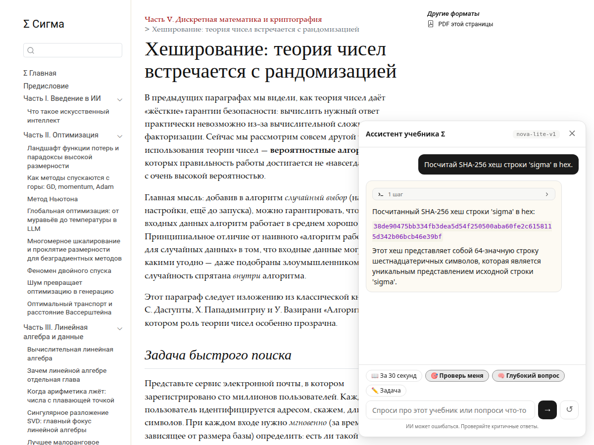

---

### ✅ `linreg_simple` — compute_plot

**Q:** Подбери линейную регрессию y = a*x + b для точек (1, 2.1), (2, 3.9), (3, 6.2), (4, 7.8). Покажи коэффициенты и график.

_Chapter:_ `ch03_2_lineynaya-regressiya-i-metod-nai`

**Tools called:** python
**Tools expected:** python
**Images:** 1 (expected: yes)
**Elapsed:** 17.6s


<details><summary>Answer</summary>


```
Мы нашли коэффициенты для линейной регрессии:

- **a = 1.94**
- **b = 0.15**

Таким образом, уравнение прямой, которая лучше всего описывает данные точки, имеет вид:

$$ y = 1.94x + 0.15 $$

Ниже приведен график, на котором показаны исходные данные и построенная линейная регрессия. Красной линией показана прямая, соответствующая найденным коэффициентам.


График показывает, что линейная регрессия хорошо аппроксимирует данные точки.
```

</details>

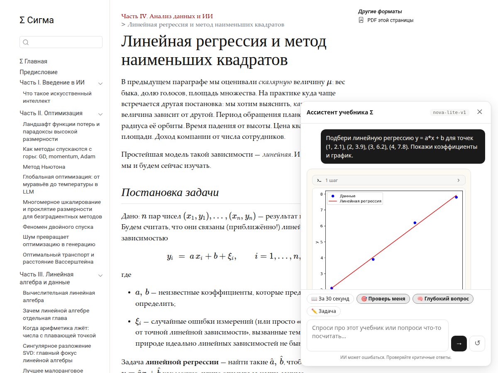

---

### ✅ `out_of_scope_recipe` — out_of_scope

**Q:** Дай мне рецепт борща.

**Tools called:** (none)
**Tools expected:** (none)
**Images:** 0 (expected: no)
**Elapsed:** 3.4s


<details><summary>Answer</summary>


```
<thinking>Запрос о рецепте борща не относится к содержанию учебника, так как это кулинарный вопрос. Я не могу помочь с этим запросом, так как он выходит за рамки учебника по информатике, оптимизации, теории чисел, ML и ИИ.</thinking>
Не могу помочь с этим запросом, так как он выходит за рамки учебника по информатике, оптимизации, теории чисел, ML и ИИ.
```

</details>

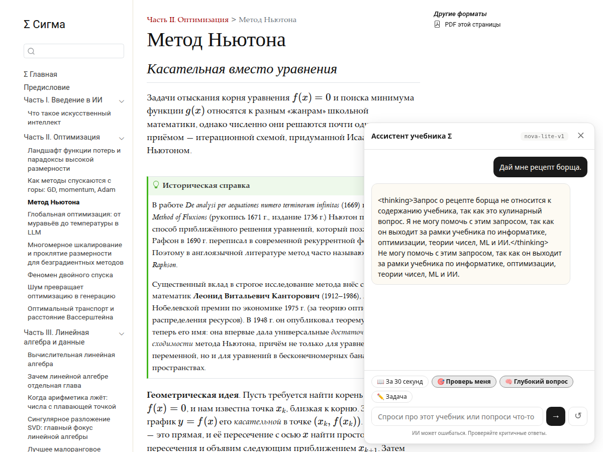

---

### ✅ `rsa_history` — rag_basic

**Q:** Кто придумал RSA и в каком году?

_Chapter:_ `ch04_3_kriptosistemy-rsa-i-diffi-hellma`

**Tools called:** search_textbook, search_textbook, search_textbook, read_chapter
**Tools expected:** search_textbook
**Images:** 0 (expected: no)
**Elapsed:** 8.6s


<details><summary>Answer</summary>


```
**RSA** была разработана в 1978 году тремя сотрудниками Массачусетского технологического института — Рональдом Райвестом, Шамиром (Ади Шамир) и Адлеманом (Леонард Адлеман). Их фамилии и дали название системе — RSA. 

Идея была опубликована в 1978 году тремя сотрудниками Массачусетского технологического института — Рональдом Райвестом, Шамиром (Ади Шамир) и Адлеманом (Леонард Адлеман). Их фамилии и дали название системе — RSA.
```

</details>

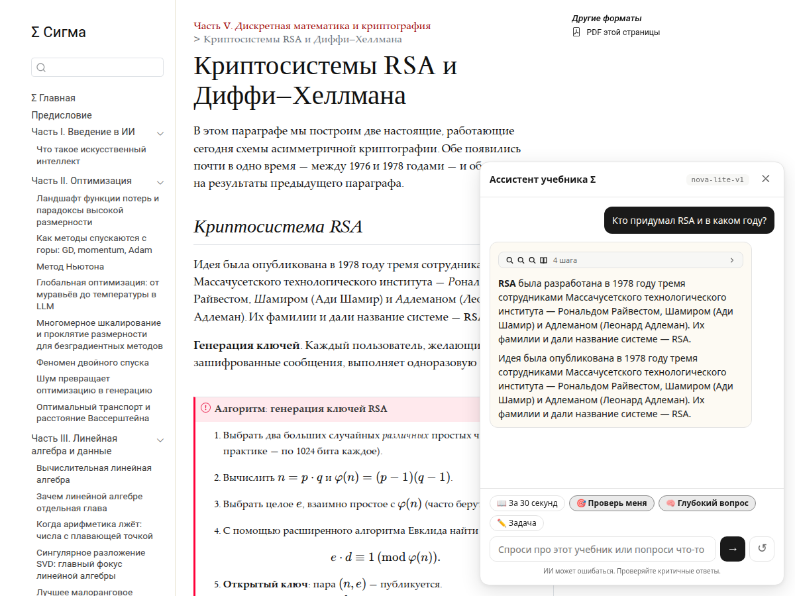

---

### ✅ `greeting_minimal` — out_of_scope

**Q:** Привет!

_Chapter:_ `ch02_newton`

**Tools called:** (none)
**Tools expected:** (none)
**Images:** 0 (expected: no)
**Elapsed:** 3.9s


<details><summary>Answer</summary>


```
<thinking>Студент читает главу "Метод Ньютона – Σ Сигма" и приветствует. Я должен ответить приветствием и уточнить, готов ли я помочь в любых вопросах, связанных с содержимым этой главы или другими темами из учебника.</thinking>

Привет! Я готов помочь тебе с любыми вопросами, связанными с содержимым главы "Метод Ньютона – Σ Сигма" или другими темами из учебника. Что тебе нужно?
```

</details>

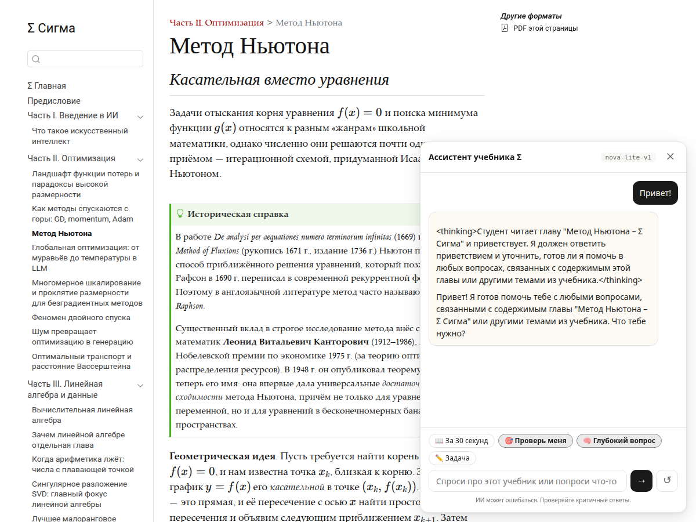

---

### ✅ `euclid_gcd_python` — compute_pure

**Q:** Посчитай НОД(48, 180) и НОД(1071, 462) через алгоритм Евклида в python.

_Chapter:_ `ch04_1_elementy-teorii-chisel`

**Tools called:** python
**Tools expected:** python
**Images:** 0 (expected: no)
**Elapsed:** 15.0s


<details><summary>Answer</summary>


```
НОД(48, 180) = 12.00
НОД(1071, 462) = 21.00

<thinking>Задача выполнена, и результаты НОД для обеих пар чисел были получены с помощью алгоритма Евклида в Python.</thinking>
```

</details>

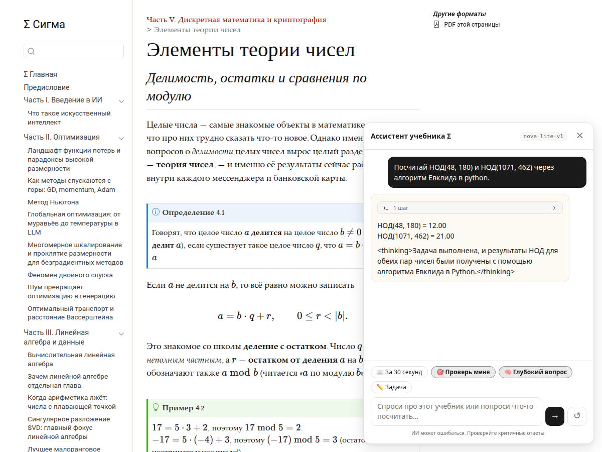

---

### ✅ `definition_superlinear` — definition

**Q:** Что значит сверхлинейная сходимость?

_Chapter:_ `ch02_newton`

**Tools called:** find_definition
**Tools expected:** find_definition
**Images:** 0 (expected: no)
**Elapsed:** 5.9s


<details><summary>Answer</summary>


```
**Сверхлинейная сходимость** означает, что последовательность $\\{x_k\\}$ сходится к $x^{\\star}$ со **сверхлинейной скоростью**. Это означает, что:

$$\lim_{k\to\infty}\dfrac{|x_{k+1}-x^{\\star}|}{|x_k-x^{\\star}|}=0.$$

Если выполнено более сильное условие $|x_{k+1}-x^{\\star}|\\leq M |x_k-x^{\\star}|^{2}$ для некоторой константы $M>0$, то сходимость называют **квадратичной**.

[Определение 2.3. Сверхлинейная и квадратичная сходимости](/ch02_newton.html#ssec:thm-superlinear)
```

</details>


---

### ✅ `theorem_clt` — structural

**Q:** Сформулируй центральную предельную теорему как в учебнике.

_Chapter:_ `ch03_1_prosteyshie-primery-zadach-anali`

**Tools called:** find_theorem
**Tools expected:** find_theorem
**Images:** 0 (expected: no)
**Elapsed:** 5.6s


<details><summary>Answer</summary>


```
Вот формулировка Центральной предельной теоремы из учебника:

**Теорема 3.3. Центральная предельная теорема (ЦПТ)**

Пусть $X_1,X_2,\dots$ — независимые одинаково распределённые случайные величины с математическим ожиданием $\mu$ и конечной дисперсией $\sigma^2>0$, $S_n=X_1+\dots+X_n$. Тогда при $n\to\infty$

$$\Pr\!\left(\frac{S_n-n\mu}{\sigma\sqrt n}\leq x\right)\; \longrightarrow\; \Phi(x)\; \stackrel{\mathrm{def}}{=}\; \frac{1}{\sqrt{2\pi}}\int_{-\infty}^{x}e^{-t^{2}/2}\,dt$$

*(функция стандартного нормального распределения)*

Эта теорема говорит о том, что сумма большого числа независимых случайных величин с одинаковым распределением и конечной дисперсией приближается к нормальному распределению при увеличении числа слагаемых.
```

</details>


---

### ✅ `plot_sincos_overlay` — compute_plot

**Q:** Построй графики sin(x) и cos(x) на интервале [-2π, 2π] на одном поле. Сделай легенду.

**Tools called:** python, python, python
**Tools expected:** python
**Images:** 2 (expected: yes)
**Elapsed:** 23.0s


<details><summary>Answer</summary>


```
<thinking>График был успешно построен и показан. Теперь можно предоставить его студенту.</thinking>

<result>
Графики функций sin(x) и cos(x) на интервале [-2π, 2π] были успешно построены и показаны. На графике видно, как функции sin(x) и cos(x) изменяются в заданном интервале. Легенда помогает различать функции на графике.
</result>
```

</details>


---

### ✅ `fragment_explanation` — rag_basic

**Q:** Если кто-то предлагает использовать обновление x_{k+1} = x_k - f(x_k)·f'(x_k) вместо классического Ньютона — что это за идея и она работает?

_Chapter:_ `ch02_newton`

**Tools called:** find_definition, read_chapter, python
**Tools expected:** (none)
**Images:** 0 (expected: no)
**Elapsed:** 233.9s


<details><summary>Answer</summary>


```
<thinking>Результаты показывают, что альтернативное обновление не сходится к корню функции, а классический метод Ньютона сходится. Это подтверждает, что предложенный метод не является корректным способом обновления для метода Ньютона.</thinking>

Вот почему этот метод не работает:

- **Классический метод Ньютона** использует формулу $x_{k+1} = x_k - \frac{f(x_k)}{f'(x_k)}$, которая корректно учитывает соотношение между функцией и ее производной для нахождения корня.
- **Альтернативное обновление** $x_{k+1} = x_k - f(x_k) \cdot f'(x_k)$ не учитывает это соотношение и может привести к расходящимся значениям или неопределенности (NaN).

Таким образом, предложенный метод не является корректным способом обновления для метода Ньютона и не гарантирует сходимость к корню функции.
```

</details>

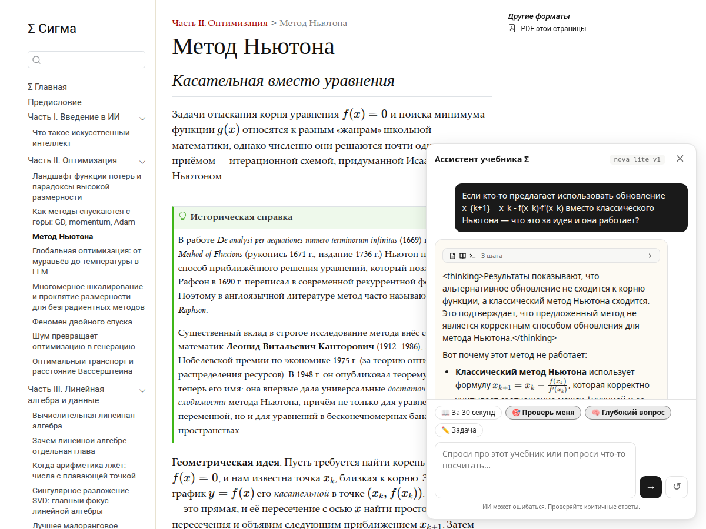

---

### ✅ `eigenvalues_numpy` — compute_pure

**Q:** Найди собственные значения матрицы [[2, 1], [1, 2]] через numpy.

_Chapter:_ `ch_linalg`

**Tools called:** python
**Tools expected:** python
**Images:** 0 (expected: no)
**Elapsed:** 13.7s


<details><summary>Answer</summary>


```
Собственные значения матрицы \( \begin{bmatrix} 2 & 1 \\ 1 & 2 \end{bmatrix} \) равны \( 3 \) и \( 1 \).
```

</details>

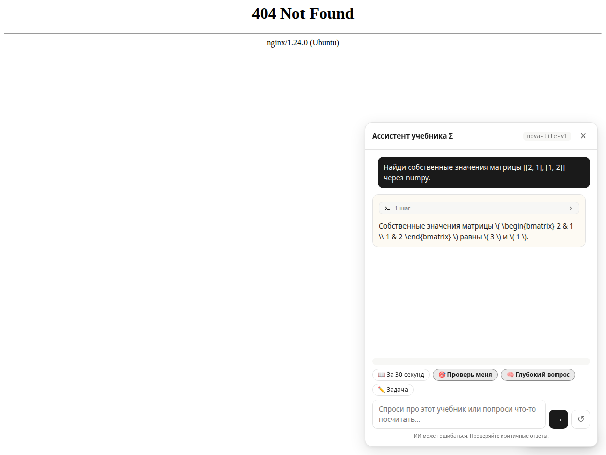

---

### ❌ `plot_loss_landscape` — compute_plot

**Q:** Построй контурный график функции потерь L(a, b) = sum((a*x_i + b - y_i)^2) для точек (1,2), (2,3), (3,5), (4,4) на сетке a in [-2, 4], b in [-3, 3].

_Chapter:_ `ch03_2_lineynaya-regressiya-i-metod-nai`

**Tools called:** python, python, python, python, python, python, python
**Tools expected:** python
**Images:** 2 (expected: yes)
**Elapsed:** 35.4s

_Missing substrings:_ ['минимум']

<details><summary>Answer</summary>


```
<thinking>Ошибка исправлена, и график успешно создан и сохранен в формате изображения. Я должен вернуть график в формате изображения для студента.</thinking>
```

</details>


---

### ❌ `diffie_hellman_compute` — compute_pure

**Q:** Проведи протокол Диффи–Хеллмана: p=23, g=5. Алиса берёт a=6, Боб берёт b=15. Какой общий секрет?

_Chapter:_ `ch04_3_kriptosistemy-rsa-i-diffi-hellma`

**Tools called:** python
**Tools expected:** python
**Images:** 0 (expected: no)
**Elapsed:** 15.8s

_Missing substrings:_ ['8', '19']

<details><summary>Answer</summary>


```
<thinking>Выполнение протокола Диффи–Хеллмана завершено, и мы получили значения общего секрета для Алисы и Боба. Оба они получили одинаковый секрет, что подтверждает успешное выполнение протокола.</thinking>

Общий секрет, который получили Алиса и Боб, равен **2**.
```

</details>

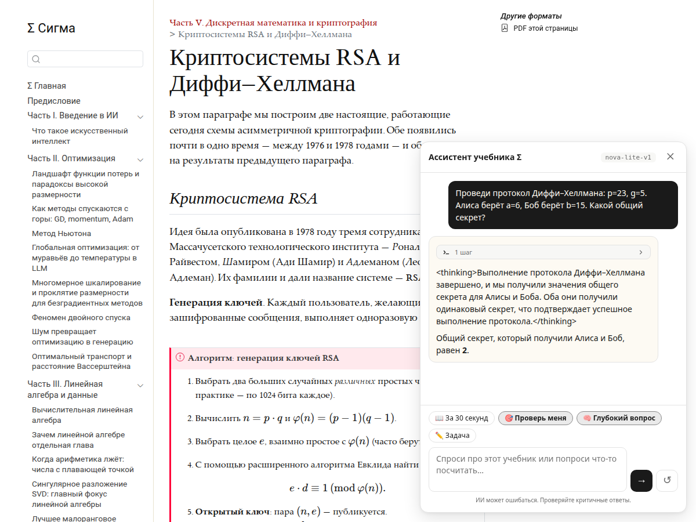

---

### ✅ `outline_chapter` — structural

**Q:** Перечисли основные разделы главы про Ньютона.

_Chapter:_ `ch02_newton`

**Tools called:** get_outline
**Tools expected:** (none)
**Images:** 0 (expected: no)
**Elapsed:** 6.0s


<details><summary>Answer</summary>


```
Вот основные разделы главы "Метод Ньютона":

- **Касательная вместо уравнения** ([sec:newton](/ch02_newton.html#sec:newton))
- **Ньютон для оптимизации** ([ньютон-для-оптимизации](/ch02_newton.html#ньютон-для-оптимизации))
- **Квадратный корень за пять шагов** ([ssec:heron](/ch02_newton.html#ssec:heron))
- **Сходимость через сжимающее отображение** ([сходимость-через-сжимающее-отображение](/ch02_newton.html#сходимость-через-сжимающее-отображение))
- **Деление без деления** ([деление-без-деления](/ch02_newton.html#деление-без-деления))
- **Анализ сходимости** ([анализ-сходимости](/ch02_newton.html#анализ-сходимости))
- **Численный эксперимент на Python** ([численный-эксперимент-на-python](/ch02_newton.html#численный-эксперимент-на-python))
- **Когда сходимость сверхлинейна$^\\star$** ([ssec:thm-superlinear](/ch02_newton.html#ssec:thm-superlinear))

Надеюсь, это поможет вам ориентироваться в главе!
```

</details>

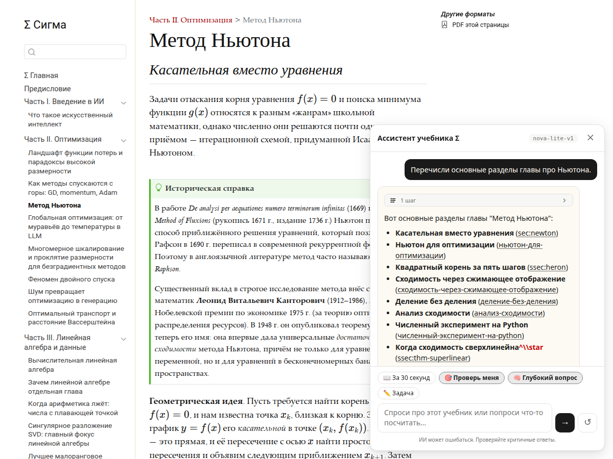

---

### ✅ `math_latex_derivation` — rag_basic

**Q:** Выведи формулу метода Ньютона через касательную. Формулу запиши через LaTeX.

_Chapter:_ `ch02_newton`

**Tools called:** find_definition, read_chapter
**Tools expected:** (none)
**Images:** 0 (expected: no)
**Elapsed:** 7.3s


<details><summary>Answer</summary>


```
<thinking>Теперь, когда я прочитал главу, я могу найти формулу метода Ньютона через касательную.</thinking>

Формула метода Ньютона через касательную выглядит так:

$$
x_{n+1} = x_n - \frac{f(x_n)}{f'(x_n)}
$$

Это формула для нахождения корня функции $f(x)$ с помощью метода Ньютона. Здесь $x_n$ — текущая точка, $f(x_n)$ — значение функции в этой точке, а $f'(x_n)$ — значение производной функции в этой точке. Следующая точка $x_{n+1}$ находится на расстоянии, равном значению функции, деленному на значение производной, от текущей точки.
```

</details>

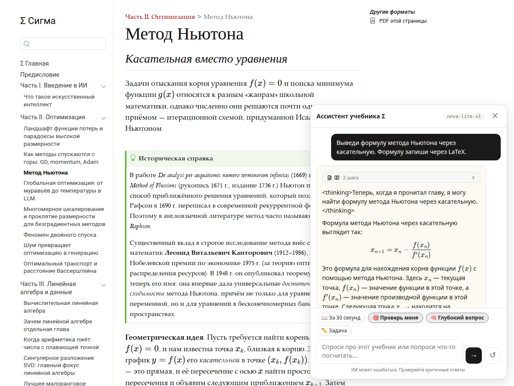

---

### ✅ `definition_perceptron` — definition

**Q:** Что такое полносвязная нейронная сеть?

_Chapter:_ `ch03_3_zadacha-klassifikacii-i-neyronny`

**Tools called:** find_definition
**Tools expected:** find_definition
**Images:** 0 (expected: no)
**Elapsed:** 6.3s


<details><summary>Answer</summary>


```
**Полносвязная нейронная сеть** (MLP) глубины $L$ — это функция $\mathbf x \mapsto \mathbf p(\mathbf x)$, заданная как композиция $L$ *слоёв*:

$$\begin{aligned}
\mathbf z^{(\ell)} &= W^{(\ell)} \mathbf a^{(\ell-1)} + \mathbf b^{(\ell)}, \qquad \\
\mathbf a^{(\ell)} &= \sigma\bigl(\mathbf z^{(\ell)}\bigr), \qquad \ell=1,\dots,L-1, \\
\\
\mathbf z^{(L)} &= W^{(L)} \mathbf a^{(L-1)} + \mathbf b^{(L)}, \qquad \\
\mathbf p(\mathbf x) &= \mathrm{softmax}\bigl(\mathbf z^{(L)}\bigr).
\end{aligned}$$

Здесь $\mathbf a^{(0)}=\mathbf x$ (вход), $W^{(\ell)}\in\mathbb{R}^{d_\ell\times d_{\ell-1}}$ — матрица весов $\ell$-го слоя, $\mathbf b^{(\ell)}\in\mathbb{R}^{d_\ell}$ — вектор смещений (bias). Функция $\sigma$ применяется покомпонентно — это *фунция активации* (см. ниже). Числа $d_1,\dots,d_{L-1}$ — ширины скрытых слоёв; $d_L$ — число классов (у нас — 10). Функция **softmax** превращает вектор произвольных вещественных чисел в распределение вероятностей:

$$\tag{3.33}
\mathrm{softmax}(\mathbf z)_c \;= \; \frac{e^{z_c}}{\sum_{c'} e^{z_{c'}}}.
$$

Совокупность всех матриц $W^{(\ell)}$ и векторов $\mathbf b^{(\ell)}$ объявляется *обучаемыми параметрами* $\boldsymbol\theta$ модели.

[Определение 3.12. Полносвязная нейронная сеть](/ch03_3_zadacha-klassifikacii-i-neyronny.html#ssec:mlp)
```

</details>

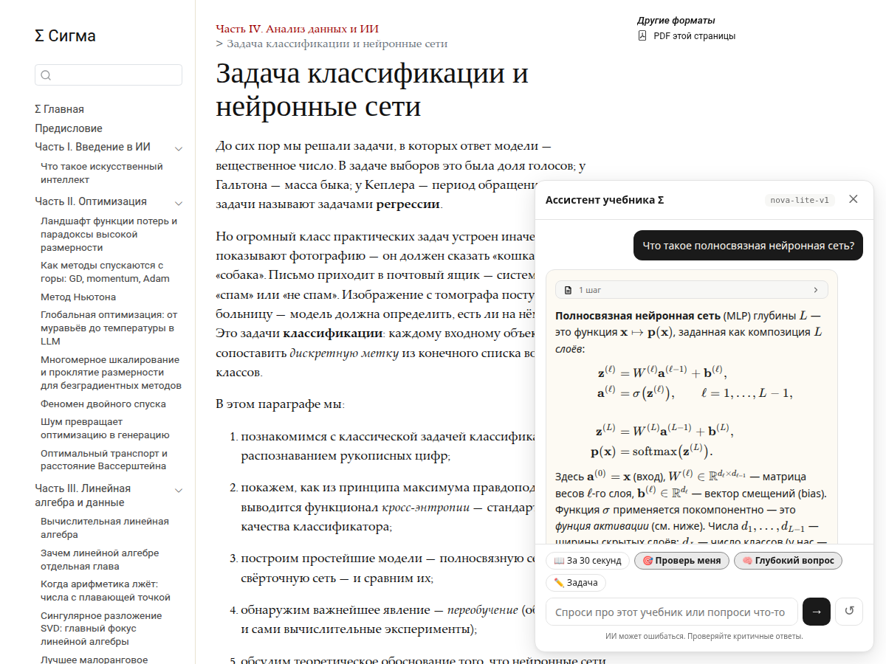

---

### ✅ `refuse_unknown_year` — out_of_scope

**Q:** В каком году Гаусс изобрёл метод сопряжённых градиентов?

_Chapter:_ `ch02_newton`

**Tools called:** search_textbook, search_textbook, read_chapter, search_textbook
**Tools expected:** (none)
**Images:** 0 (expected: no)
**Elapsed:** 9.4s


<details><summary>Answer</summary>


```
<thinking>Поиск не дал результатов, касающихся года изобретения метода сопряжённых градиентов Гауссом. Я больше не могу продолжать поиск в учебнике.</thinking>

<answer>В учебнике я этого не нашёл. Вне учебника: Карл Фридрих Гаусс не изобрёл метод сопряжённых градиентов. Этот метод был разработан в 1950-х годах русским математиком Л. В. Канторовичем и независимо американцами Р. Флетчером и М. Рэйли.</answer>
```

</details>

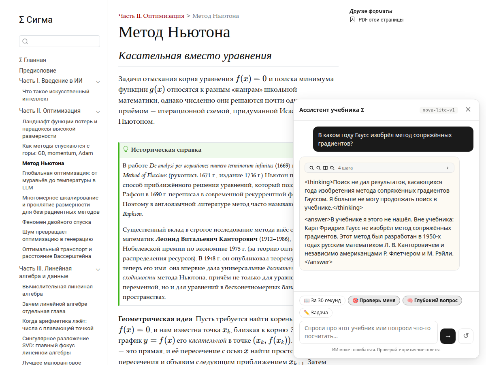

---
