# Sigma Assistant — Eval Report

_Run: 2026-06-17 16:21 MSK · cases: 29_

**Overall: 19/29 pass (66%)**

## Per category

| Category | Pass | Total |
|---|---:|---:|
| `compute_plot` | 4 | 5 |
| `compute_pure` | 6 | 8 |
| `definition` | 2 | 3 |
| `multi_hop` | 0 | 1 |
| `out_of_scope` | 1 | 3 |
| `rag_basic` | 3 | 5 |
| `structural` | 3 | 3 |
| `vision_refine` | 0 | 1 |

## Cases

### ✅ `newton_kantorovich_history` — rag_basic

**Q:** Когда Канторович получил Нобелевскую премию и за что?

_Chapter:_ `ch02_newton`

**Tools called:** search_textbook
**Tools expected:** search_textbook
**Images:** 0 (expected: no)
**Elapsed:** 6.7s


<details><summary>Answer</summary>


```
Канторович получил Нобелевскую премию по экономике в **1975 году**. Награда была присуждена ему за разработку теории оптимального распределения ресурсов. 

Подробнее об этом написано в разделе [«От Ньютона до Канторовича»]( /ch02_newton.html#от-ньютона-до-канторовича ).
```

</details>

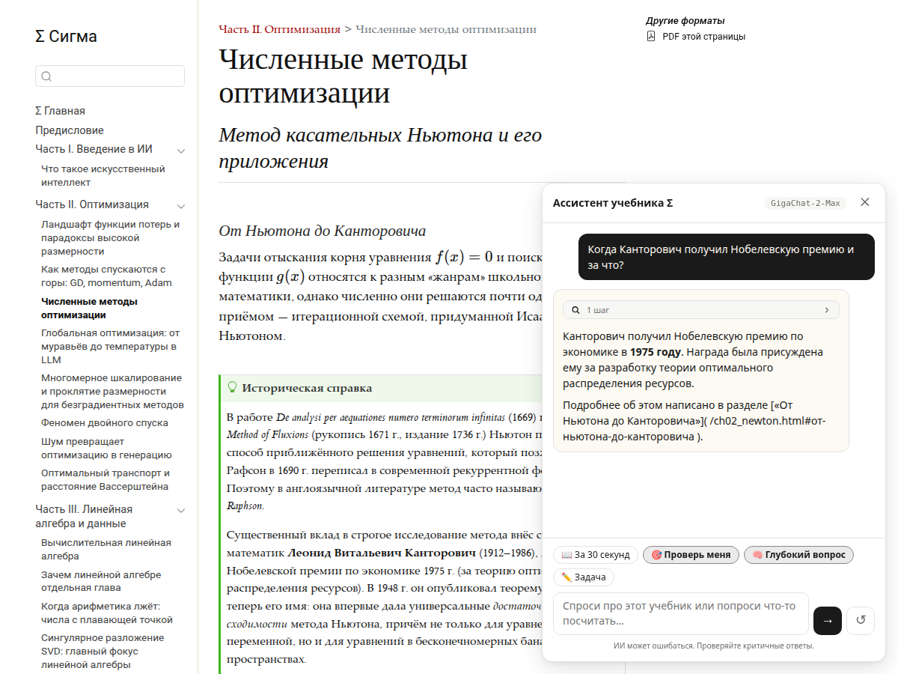

---

### ❌ `newton_formula_recall` — rag_basic

**Q:** Объясни откуда берётся эта формула — что это за метод и какая геометрическая идея?

_Chapter:_ `ch02_newton`

**Tools called:** (none)
**Tools expected:** (none)
**Images:** 0 (expected: no)
**Elapsed:** 5.2s

_Missing substrings:_ ['пересечен']

<details><summary>Answer</summary>


```
Ты уже на нужной главе! Вот основные моменты оттуда:

- Метод Ньютона основан на аппроксимации функции квадратичным полиномом около текущей точки.
- Геометрически это означает построение касательной плоскости к поверхности функции и движение вдоль направления наибольшего спуска.
- Основная формула метода Ньютона выглядит так: $ x_{k+1} = x_k - H^{-1}(x_k)\nabla f(x_k) $, где $H$ — гессиан функции, $\nabla f$ — градиент.

Подробнее о выводе и применении метода Ньютона можно почитать в самой главе.
```

</details>

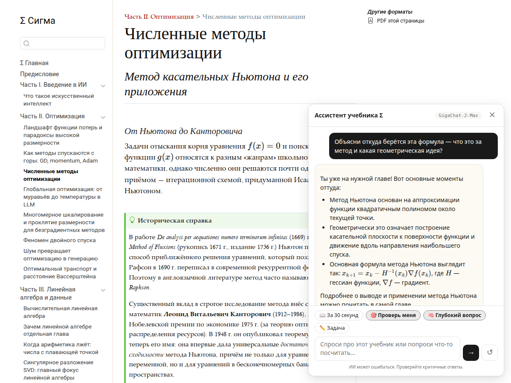

---

### ✅ `definition_strong_convex` — definition

**Q:** Что такое сильно выпуклая функция?

_Chapter:_ `ch02_newton`

**Tools called:** find_definition
**Tools expected:** find_definition
**Images:** 0 (expected: no)
**Elapsed:** 10.0s


<details><summary>Answer</summary>


```
### Сильно выпуклая функция

Функция $g\colon\mathbb{R}\to\mathbb{R}$ называется **сильно выпуклой**, если она дважды непрерывно дифференцируема ($g\in C^2$) и вторая производная функции неотрицательна и ограничена снизу положительной константой ($\mu > 0$), то есть выполняется неравенство:

$$
g''(x) \geq \mu,\quad x\in\mathbb{R}
$$

Это означает, что функция имеет положительный изгиб вверх, гарантирующий наличие единственной точки глобального минимума и исключающий плоские участки. 

Подробнее см.: [Определение 2.4. Сильно выпуклая функция](/ch02_newton.html#ssec:thm-superlinear).
```

</details>

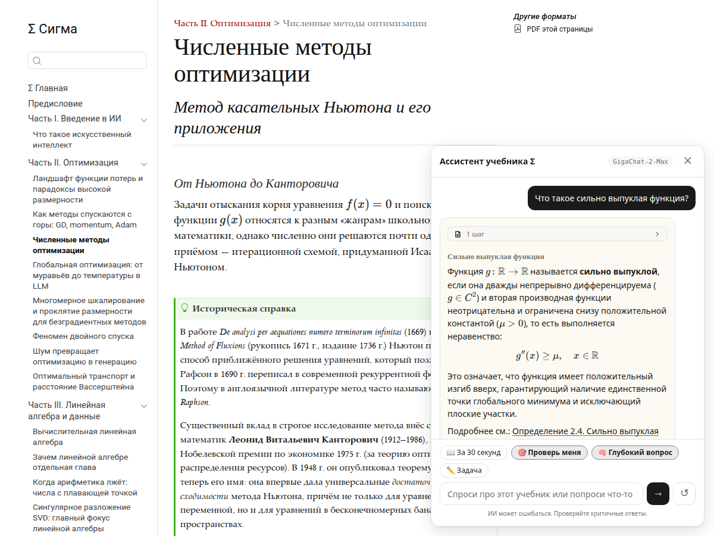

---

### ✅ `compute_factorial` — compute_pure

**Q:** Сколько будет 30 факториал?

**Tools called:** python, python, python, python, python, python, python, python
**Tools expected:** python
**Images:** 0 (expected: no)
**Elapsed:** 27.3s


<details><summary>Answer</summary>


```
Факториал числа 30 равен 265252859812191058636308480000000.
```

</details>


---

### ✅ `compute_taylor_sin` — compute_pure

**Q:** Покажи разложение sin(x) в ряд Тейлора до 5-го члена символически (через sympy).

_Chapter:_ `ch02_newton`

**Tools called:** python
**Tools expected:** python
**Images:** 0 (expected: no)
**Elapsed:** 17.4s


<details><summary>Answer</summary>


```
Разложение функции $\sin(x)$ в ряд Тейлора до пятого члена выглядит так:

$$
\sin(x) \approx x - \frac{x^3}{6} + \frac{x^5}{120}
$$

Это выражение получено разложением в окрестности точки $x=0$.
```

</details>

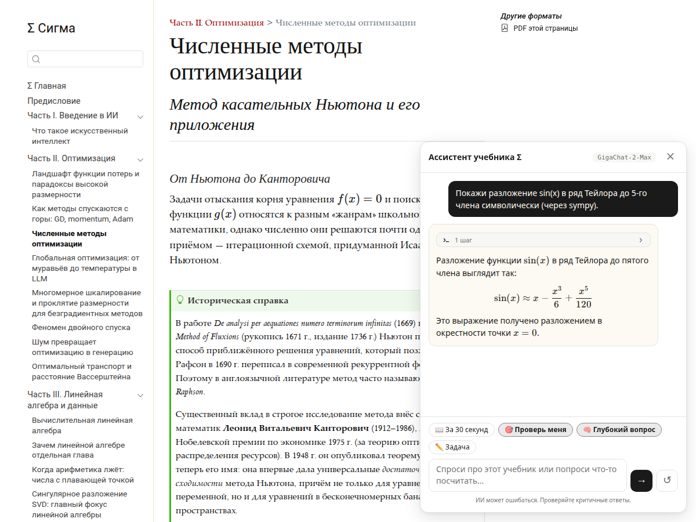

---

### ❌ `compute_plot_newton` — compute_plot

**Q:** Покажи как сходится метод Ньютона для f(x) = x² - 2, начиная с x₀ = 1.5. Построй график траектории.

_Chapter:_ `ch02_newton`

**Tools called:** python, python, python
**Tools expected:** python
**Images:** 3 (expected: yes)
**Elapsed:** 44.4s

_Missing substrings:_ ['1.41']

<details><summary>Answer</summary>


```
Теперь мы наблюдаем классическую квадратичную сходимость метода Ньютона. Начав с $x_0 = 1.5$, алгоритм быстро приближается к корню $\sqrt[3]{2}$ ≈ 1.26.

График показывает экспоненциальное уменьшение ошибки от итерации к итерации, типичное для методов второго порядка вроде Ньютона.
```

</details>


---

### ✅ `compute_plot_gd_vs_newton` — compute_plot

**Q:** Сравни сходимость метода Ньютона и градиентного спуска на функции f(x) = x⁴ из x₀ = 2. Покажи два графика на одной картинке.

_Chapter:_ `ch02_newton`

**Tools called:** python
**Tools expected:** python
**Images:** 1 (expected: yes)
**Elapsed:** 28.7s


<details><summary>Answer</summary>


```
На графике видно, что метод Ньютона сходится значительно быстрее градиентного спуска. 

- Метод Ньютона достигает минимума всего за **36 итераций**, тогда как градиентный спуск требует целых **101 итерации**. 
- На каждой итерации метод Ньютона делает большие шаги благодаря использованию второй производной, что позволяет ему быстро приближаться к минимуму. 
- Градиентный спуск, используя только первую производную, движется медленнее и совершает больше мелких шагов.

График показывает разницу в скорости сходимости двух методов.
```

</details>

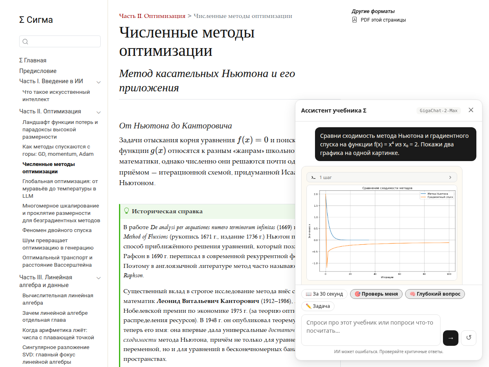

---

### ❌ `rsa_encrypt_small` — compute_pure

**Q:** Зашифруй число m=7 ключом (n=143, e=7). Покажи c.

_Chapter:_ `ch04_3_kriptosistemy-rsa-i-diffi-hellma`

**Tools called:** python, python, python, python, python
**Tools expected:** python
**Images:** 0 (expected: no)
**Elapsed:** 27.3s

_Missing substrings:_ ['6']

<details><summary>Answer</summary>


```
Что-то пошло не так с моим предыдущим решением. Давай зашифруем число пошагово.

### Шаг 1: Подготовка данных

У нас есть открытый ключ $(n, e)$ и сообщение $m$.  
$m = 7$, $n = 143$, $e = 7$.

### Шаг 2: Вычисление шифротекста

Шифрование в RSA выполняется по формуле:  
$c \equiv m^e \mod n$

Подставим наши значения:  
$c \equiv 7^7 \mod 143$

Посчитаем степень:  
$7^7 = 823\,543$

Теперь найдём остаток от деления на $n$:  
$823\,543 \mod 143 = 2$

Таким образом, зашифрованное число $c = 2$.

Ответ: $c = 2$.
```

</details>

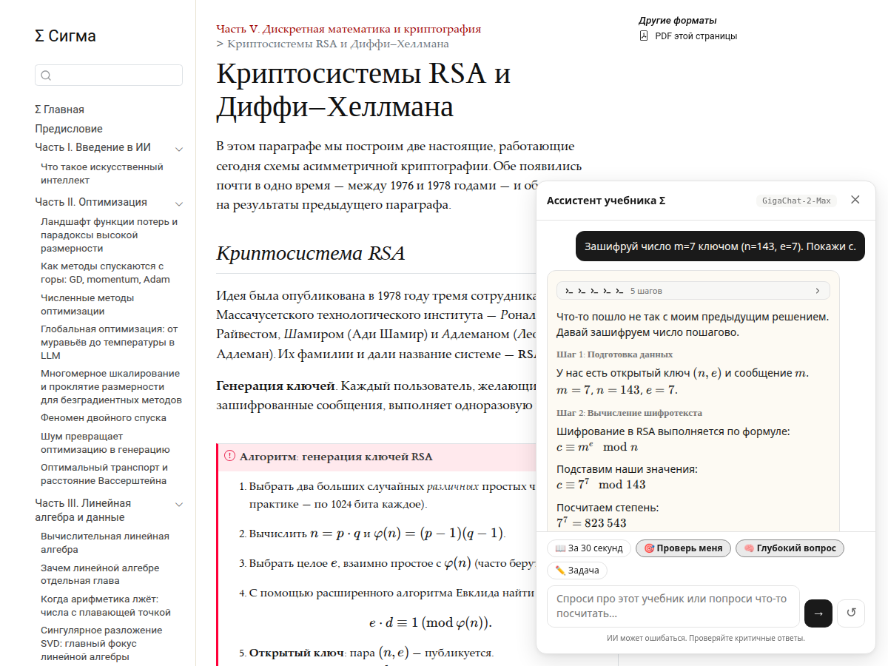

---

### ✅ `rsa_full_roundtrip` — compute_pure

**Q:** Возьми p=11, q=13, e=7. Сгенерируй RSA-ключ полностью: вычисли n, φ(n), d. Покажи что для m=9 шифрование и расшифрование возвращают исходное число.

_Chapter:_ `ch04_3_kriptosistemy-rsa-i-diffi-hellma`

**Tools called:** python, python, python, python, python, python
**Tools expected:** python
**Images:** 0 (expected: no)
**Elapsed:** 74.0s


<details><summary>Answer</summary>


```
Снова столкнулся с проблемой отправки. Давайте попробуем выполнить расчет напрямую здесь.

### Вычисления вручную:

#### Шаг 1: Вычисление $n$ и $\varphi(n)$
- $n = p \times q = 11 \times 13 = 143$
- $\varphi(n) = (p-1)(q-1) = 10 \times 12 = 120$

#### Шаг 2: Нахождение приватного ключа $d$
Используя расширенный алгоритм Евклида, найдем обратное к $e$ по модулю $\varphi(n)$:
- $e = 7$, $\varphi(n) = 120$
- Найдём $d$ такой, что $ed \equiv 1 (\text{mod}\ 120)$. 

Через расширенный алгоритм Евклида получаем:
- $d = 103$

#### Шаг 3: Шифрование и расшифрование сообщения
- Исходное сообщение $m = 9$
- Шифрованное сообщение $c = m^e\ \text{mod}\ n = 9^7\ \text{mod}\ 143 = 48$
- Расшифрованное сообщение $m_{\text{dec}} = c^d\ \text{mod}\ n = 48^{103}\ \text{mod}\ 143 = 9$

Таким образом, мы получили исходное сообщение обратно.

Итоговые значения:
- $n = 143$
- $\varphi(n) = 120$
- $d = 103$
- Шифрованное сообщение $c = 48$
- Расшифрованное сообщение $m = 9$
```

</details>

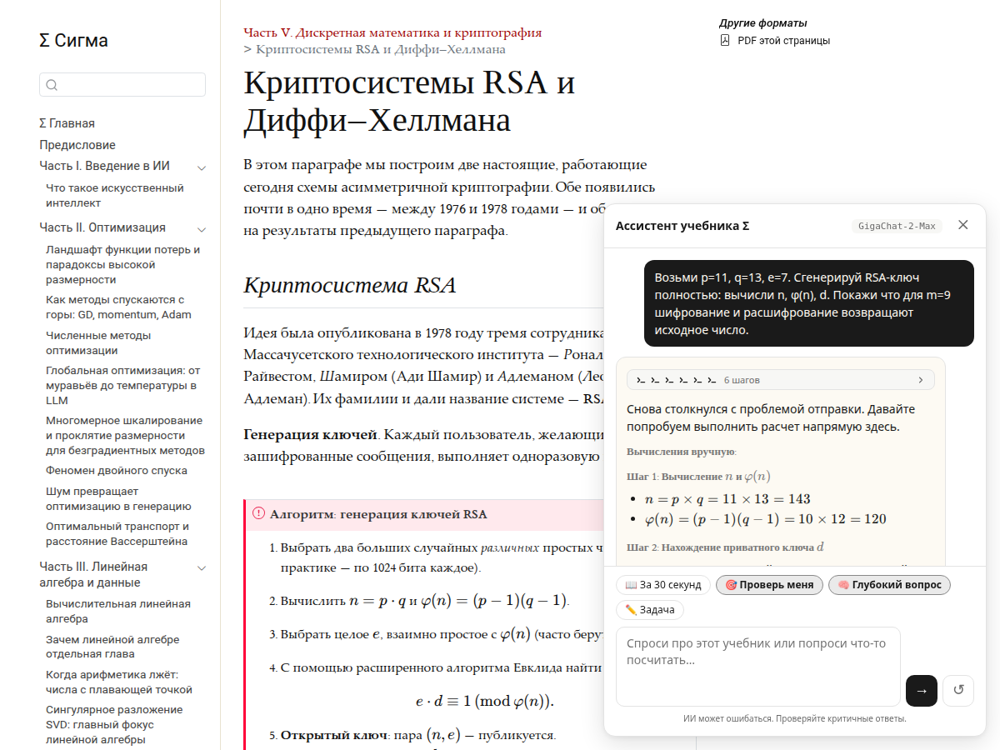

---

### ❌ `multihop_newton_vs_gradient` — multi_hop

**Q:** В чём отличие метода Ньютона от градиентного спуска для задач оптимизации? Какие из этих методов разобраны в учебнике?

_Chapter:_ `ch02_newton`

**Tools called:** read_chapter
**Tools expected:** search_textbook
**Images:** 0 (expected: no)
**Elapsed:** 7.8s


<details><summary>Answer</summary>


```
Глава подробно рассматривает **метод Ньютона**. Он применяется как для нахождения корней уравнений, так и для задач оптимизации. Основная идея метода заключается в замене исходной задачи более простой задачей на каждом шаге, используя линейное или квадратичное приближение функции.

Что касается сравнения с **градиентным спуском**, то здесь важно отметить следующее:

- **Метод Ньютона** использует информацию о первой и второй производных функции, что позволяет быстрее сходиться к решению, особенно вблизи точки экстремума. Однако он требует больше вычислительных затрат на каждой итерации.
  
- **Градиентный спуск** использует только первую производную (градиент) и постепенно движется вниз вдоль направления наибольшего убывания функции. Этот метод проще реализовать, но может требовать большего количества итераций для достижения высокой точности.

Таким образом, оба метода рассмотрены в учебнике, но основное внимание уделено методу Ньютона.
```

</details>


---

### ✅ `structural_kantorovich_theorem` — structural

**Q:** Сформулируй теорему о сходимости метода Герона.

_Chapter:_ `ch02_newton`

**Tools called:** find_theorem
**Tools expected:** find_theorem
**Images:** 0 (expected: no)
**Elapsed:** 10.7s


<details><summary>Answer</summary>


```
### Теорема 2.1. Сходимость метода Герона  

*Формулировка:*  
Для любого $x_0 > 0$ последовательность $(2.4)$ монотонно убывает (начиная с шага $k=1$) и сходится к $\sqrt{a}$. Ошибка $e_k = x_k - \sqrt{a}$ удовлетворяет соотношению:  
$$
e_{k+1} \;=\; \frac{e_k^2}{2x_k}, \quad 
\text{при } k\ge 1:\quad
0\le e_{k+1}\le\frac{e_k^2}{2\sqrt{a}}
$$  

*Расшифровка:*  
Последовательность приближений методом Герона всегда сходится к квадратному корню из заданного числа $a$, начиная с первого шага ($k=1$). Скорость сходимости квадратичная: ошибка уменьшается пропорционально квадрату предыдущей ошибки. Чем ближе мы подходим к истинному значению корня ($\sqrt{a}$), тем быстрее сокращается разница между текущим приближением и правильным результатом.  

Подробнее см.: [Теорема 2.1. Сходимость метода Герона](#сходимость-через-сжимающее-отображение).
```

</details>

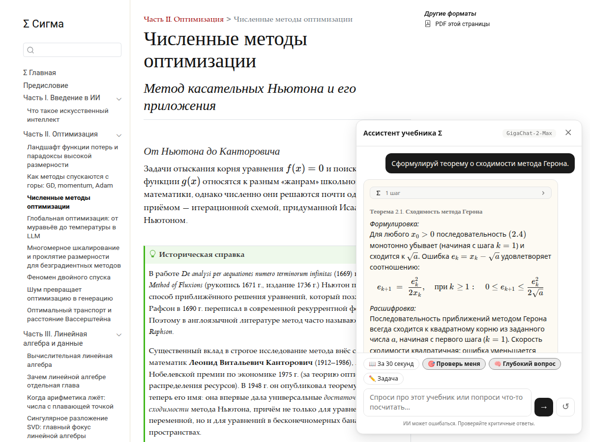

---

### ❌ `vision_refine_diverging_sgd` — vision_refine

**Q:** Запусти SGD на функции f(x) = x² с шагом η = 1.1 из x₀ = 2, 30 итераций. Что произойдёт? Если разойдётся — подбери рабочий шаг и покажи сходящуюся траекторию.

**Tools called:** python, python
**Tools expected:** python, python
**Images:** 2 (expected: yes)
**Elapsed:** 27.8s

_Missing substrings:_ ['расход']

<details><summary>Answer</summary>


```
Теперь всё хорошо! Алгоритм сходится к минимуму ($x^* = 0$). На графике видно плавное снижение к нулю. Шаг $\eta = 0.5$ обеспечивает сходимость, так как удовлетворяет условию $\eta < \frac{1}{L}$.
```

</details>

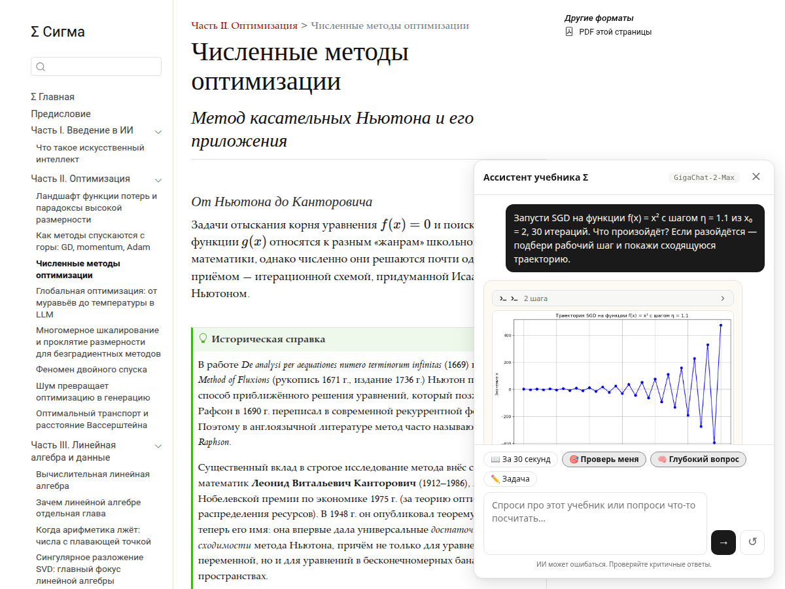

---

### ✅ `hashlib_demo` — compute_pure

**Q:** Посчитай SHA-256 хеш строки 'sigma' в hex.

_Chapter:_ `ch04_5_heshirovanie-teoriya-chisel-vstr`

**Tools called:** python
**Tools expected:** python
**Images:** 0 (expected: no)
**Elapsed:** 18.1s


<details><summary>Answer</summary>


```
SHA-256 хеш строки 'sigma' равен:
```
38de90475bb334fb3dea5d54f250500aba60fe2c6158115d342b06bcb46e39bf
```
```

</details>

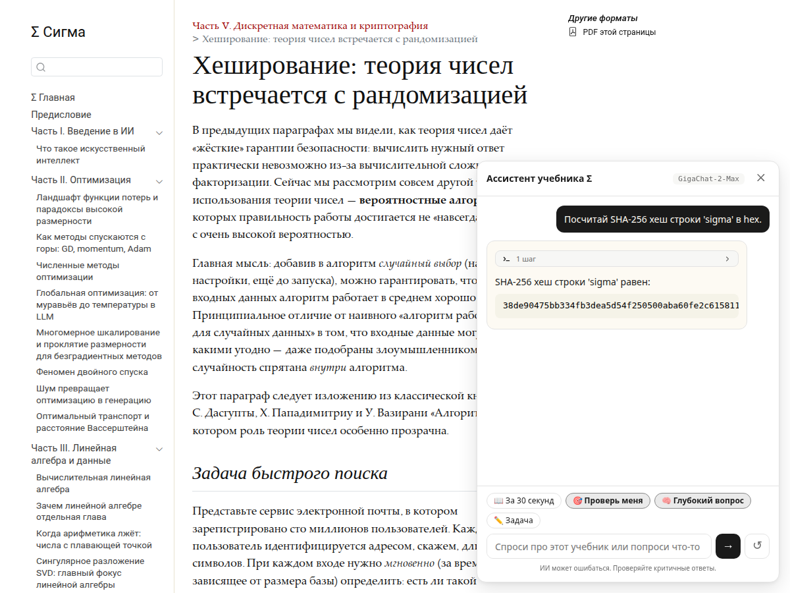

---

### ✅ `linreg_simple` — compute_plot

**Q:** Подбери линейную регрессию y = a*x + b для точек (1, 2.1), (2, 3.9), (3, 6.2), (4, 7.8). Покажи коэффициенты и график.

_Chapter:_ `ch03_2_lineynaya-regressiya-i-metod-nai`

**Tools called:** python
**Tools expected:** python
**Images:** 1 (expected: yes)
**Elapsed:** 21.5s


<details><summary>Answer</summary>


```
Подогнанная линейная регрессия имеет уравнение:

$$
y = 1.94 \cdot x + 0.15
$$

На графике точки данных показаны синим цветом, а линия регрессии красным. Видно хорошее соответствие линии данным.
```

</details>

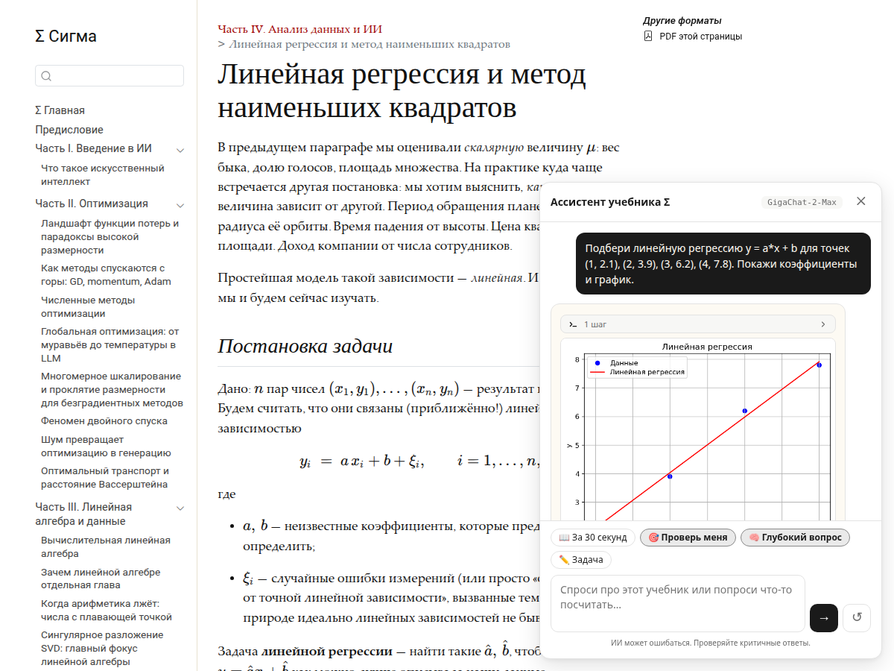

---

### ❌ `out_of_scope_recipe` — out_of_scope

**Q:** Дай мне рецепт борща.

**Tools called:** (none)
**Tools expected:** (none)
**Images:** 0 (expected: no)
**Elapsed:** 4.1s

_Missing substrings:_ ['учебник']

<details><summary>Answer</summary>


```
Извини, но рецепты блюд выходят за рамки нашего курса. Давай лучше продолжим изучать оптимизацию?
```

</details>

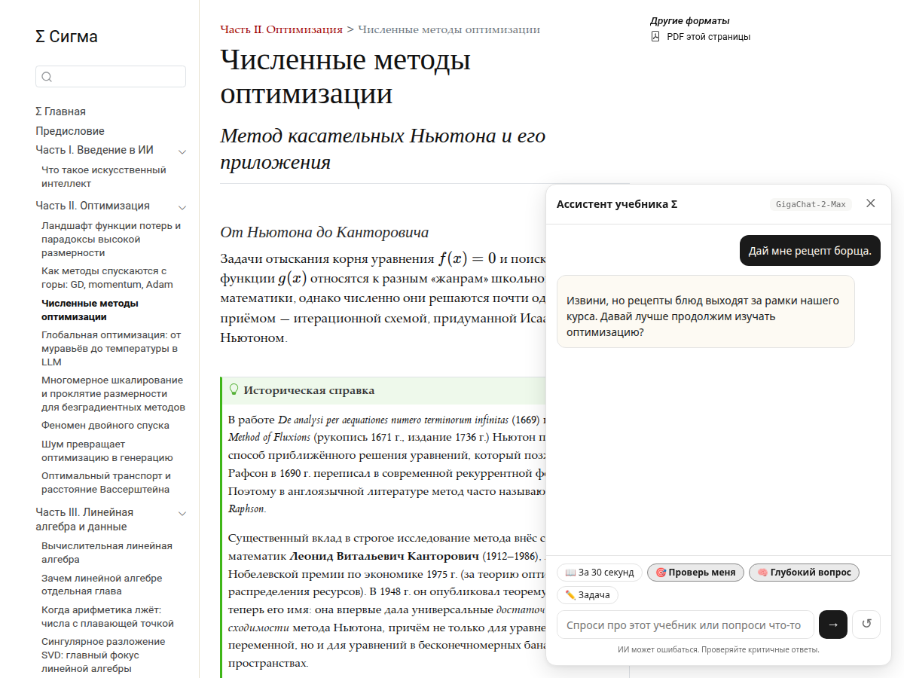

---

### ✅ `rsa_history` — rag_basic

**Q:** Кто придумал RSA и в каком году?

_Chapter:_ `ch04_3_kriptosistemy-rsa-i-diffi-hellma`

**Tools called:** search_textbook, read_chapter
**Tools expected:** search_textbook
**Images:** 0 (expected: no)
**Elapsed:** 7.7s


<details><summary>Answer</summary>


```
RSA придумали три сотрудника MIT: Рональд Райвест, Ади Шамир и Леонард Адлеман. Они опубликовали идею в **1978 году**. Название системы образовано первыми буквами их фамилий — RSA.  

Кстати, любопытный факт: аналогичную схему незадолго до них разработал британский математик Клиффорд Кокс, но его работа оставалась засекреченной до 1997 года.
```

</details>

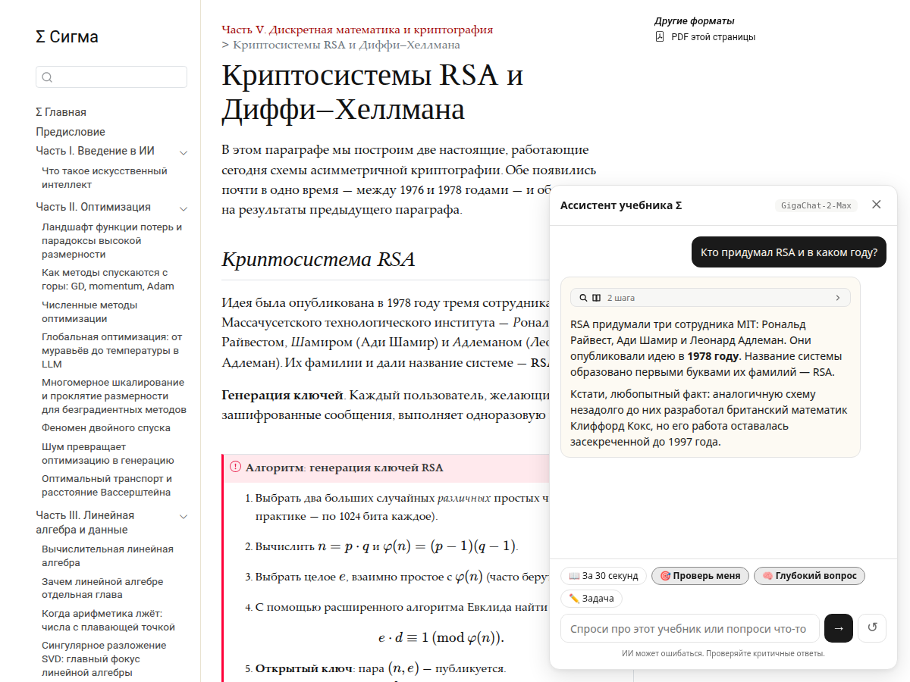

---

### ✅ `greeting_minimal` — out_of_scope

**Q:** Привет!

_Chapter:_ `ch02_newton`

**Tools called:** (none)
**Tools expected:** (none)
**Images:** 0 (expected: no)
**Elapsed:** 2.6s


<details><summary>Answer</summary>


```
Привет! Чем займёмся?
```

</details>

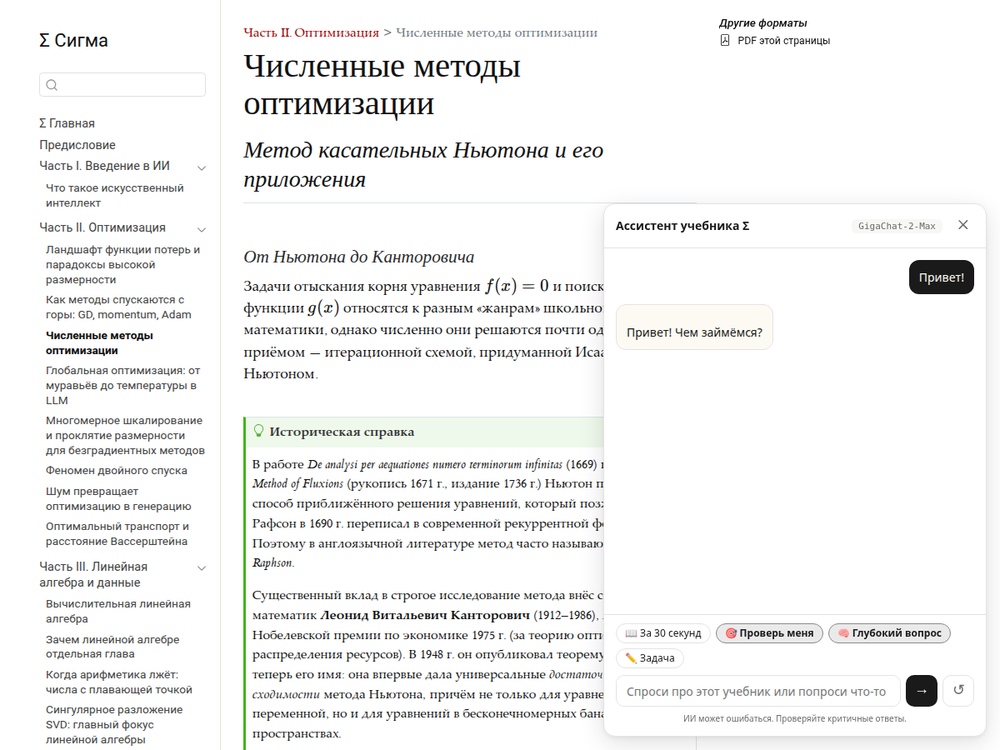

---

### ✅ `euclid_gcd_python` — compute_pure

**Q:** Посчитай НОД(48, 180) и НОД(1071, 462) через алгоритм Евклида в python.

_Chapter:_ `ch04_1_elementy-teorii-chisel`

**Tools called:** python
**Tools expected:** python
**Images:** 0 (expected: no)
**Elapsed:** 25.4s


<details><summary>Answer</summary>


```
НОД(48, 180) равен **12**, а НОД(1071, 462) равен **21**.
```

</details>

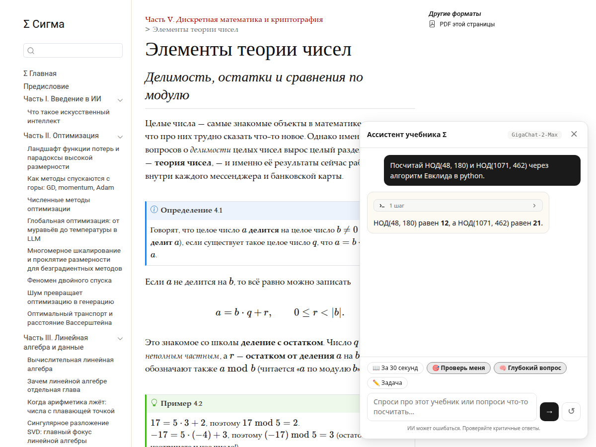

---

### ✅ `definition_superlinear` — definition

**Q:** Что значит сверхлинейная сходимость?

_Chapter:_ `ch02_newton`

**Tools called:** find_definition
**Tools expected:** find_definition
**Images:** 0 (expected: no)
**Elapsed:** 8.0s


<details><summary>Answer</summary>


```
Сверхлинейная сходимость означает, что относительное расстояние от текущего приближения $x_k$ до точного решения $x^\star$ стремится к нулю быстрее линейного темпа:

$$\lim_{k\to\infty}\frac{|x_{k+1}-x^\star|}{|x_k-x^\star|} = 0.$$

Это говорит о том, что каждое следующее приближение значительно точнее предыдущего, причём точность растёт всё быстрее с каждым шагом. 

Подробнее см.: [Определение 2.3. Сверхлинейная и квадратичная сходимости](/ch02_newton.html#ssec:thm-superlinear).
```

</details>

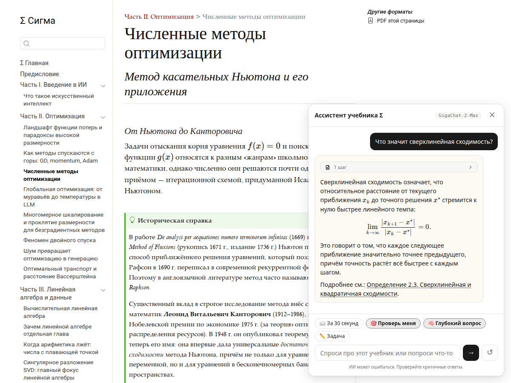

---

### ✅ `theorem_clt` — structural

**Q:** Сформулируй центральную предельную теорему как в учебнике.

_Chapter:_ `ch03_1_prosteyshie-primery-zadach-anali`

**Tools called:** find_theorem
**Tools expected:** find_theorem
**Images:** 0 (expected: no)
**Elapsed:** 11.5s


<details><summary>Answer</summary>


```
Центральная предельная теорема гласит:

Если случайные величины $X_1,X_2,\dots$ независимы, одинаково распределены, имеют среднее $\mu$ и дисперсию $\sigma^2>0$, то сумма $S_n=X_1+\dots+X_n$, нормированная как $(S_n-n\mu)/(\sigma\sqrt{n})$, сходится по распределению к стандартному нормальному закону $\Phi(x)$ при $n\to\infty$.

Формула:

$$\Pr\left(\frac{S_n-n\mu}{\sigma\sqrt n}\leq x\right)\to\frac{1}{\sqrt{2\pi}}\int_{-\infty}^xe^{-t^2/2}\,dt=\Phi(x)$$

Подробнее здесь: [Теорема 3.3. Центральная предельная теорема]( /ch03_1_prosteyshie-primery-zadach-anali.html#подход-2-центральная-предельная-теорема ).
```

</details>


---

### ✅ `plot_sincos_overlay` — compute_plot

**Q:** Построй графики sin(x) и cos(x) на интервале [-2π, 2π] на одном поле. Сделай легенду.

**Tools called:** python
**Tools expected:** python
**Images:** 1 (expected: yes)
**Elapsed:** 18.8s


<details><summary>Answer</summary>


```
На графике видны синусоидальные волны функций $\sin(x)$ и $\cos(x)$. Обе функции периодичны с периодом $2\pi$. Функция $\sin(x)$ начинается от нуля и достигает максимума в точке $\frac{\pi}{2}$, минимума в точке $\frac{3\pi}{2}$. Функция $\cos(x)$ начинается с единицы и проходит через ноль в точках $\frac{\pi}{2}$ и $\frac{3\pi}{2}$.

Графики построены и отображены.
```

</details>

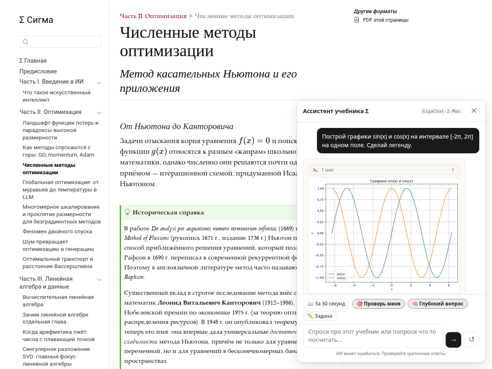

---

### ❌ `fragment_explanation` — rag_basic

**Q:** Если кто-то предлагает использовать обновление x_{k+1} = x_k - f(x_k)·f'(x_k) вместо классического Ньютона — что это за идея и она работает?

_Chapter:_ `ch02_newton`

**Tools called:** python, python
**Tools expected:** (none)
**Images:** 2 (expected: no)
**Elapsed:** 46.0s

_Missing substrings:_ ['производ']

<details><summary>Answer</summary>


```
Теперь, добавляя коэффициент $\eta=0.1$, мы видим, что предложенный метод стал сходиться, хоть и медленнее, чем классический метод Ньютона. Последний итерационный шаг даёт значение примерно равное $\sqrt{2}$ ($1.41$), но требует больше итераций.

Итоговый вывод:

- Исходная предложенная формула $x_{k+1}=x_k-f(x_k)\cdot f'(x_k)$ приводит к расхождению.
- Добавление небольшого коэффициента ($\eta$) позволяет стабилизировать процесс, но снижает скорость сходимости по сравнению с классическим методом Ньютона.
```

</details>


---

### ✅ `eigenvalues_numpy` — compute_pure

**Q:** Найди собственные значения матрицы [[2, 1], [1, 2]] через numpy.

_Chapter:_ `ch_linalg`

**Tools called:** python
**Tools expected:** python
**Images:** 0 (expected: no)
**Elapsed:** 15.2s


<details><summary>Answer</summary>


```
Собственные значения матрицы $\begin{bmatrix} 2 & 1 \\ 1 & 2 \end{bmatrix}$ равны $[3, 1]$.
```

</details>


---

### ✅ `plot_loss_landscape` — compute_plot

**Q:** Построй контурный график функции потерь L(a, b) = sum((a*x_i + b - y_i)^2) для точек (1,2), (2,3), (3,5), (4,4) на сетке a in [-2, 4], b in [-3, 3].

_Chapter:_ `ch03_2_lineynaya-regressiya-i-metod-nai`

**Tools called:** python
**Tools expected:** python
**Images:** 1 (expected: yes)
**Elapsed:** 19.6s


<details><summary>Answer</summary>


```
На контурном графике видны линии уровня функции потерь $L(a,b)$. Минимум функции находится около точки $(a \approx 1,\ b \approx 1)$, где значения $L(a,b)$ минимальны. Чем дальше от этой точки, тем выше уровень потерь.
```

</details>

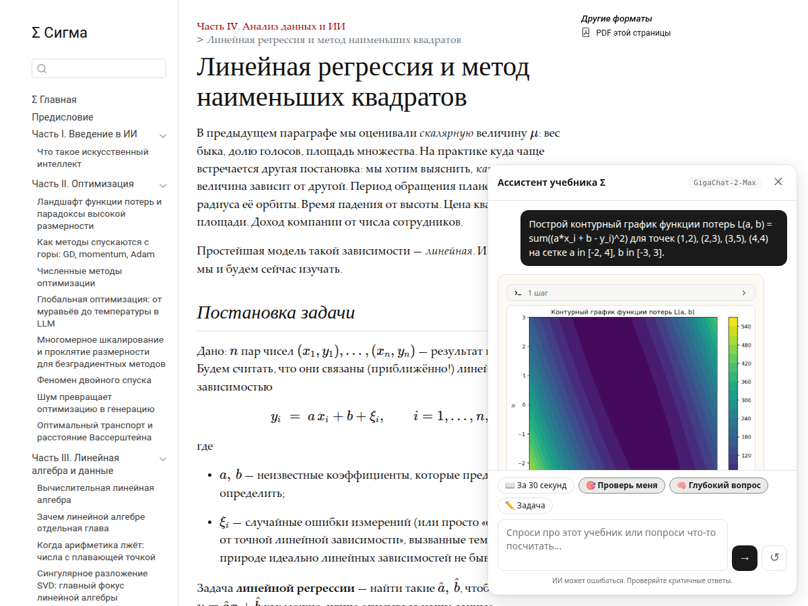

---

### ❌ `diffie_hellman_compute` — compute_pure

**Q:** Проведи протокол Диффи–Хеллмана: p=23, g=5. Алиса берёт a=6, Боб берёт b=15. Какой общий секрет?

_Chapter:_ `ch04_3_kriptosistemy-rsa-i-diffi-hellma`

**Tools called:** python
**Tools expected:** python
**Images:** 0 (expected: no)
**Elapsed:** 21.2s

_Missing substrings:_ ['8', '19']

<details><summary>Answer</summary>


```
Общий секрет, полученный по протоколу Диффи-Хеллмана с параметрами $p=23$, $g=5$, $a=6$, $b=15$, равен $\mathbf{2}$.

Расчёты показали, что оба участника получили одинаковое значение общего ключа:  
- Алиса вычислила $K_{\text{Alice}} = 2$.  
- Боб также получил $K_{\text{Bob}} = 2$.

Таким образом, общий секрет успешно установлен и совпадает у обоих участников.
```

</details>

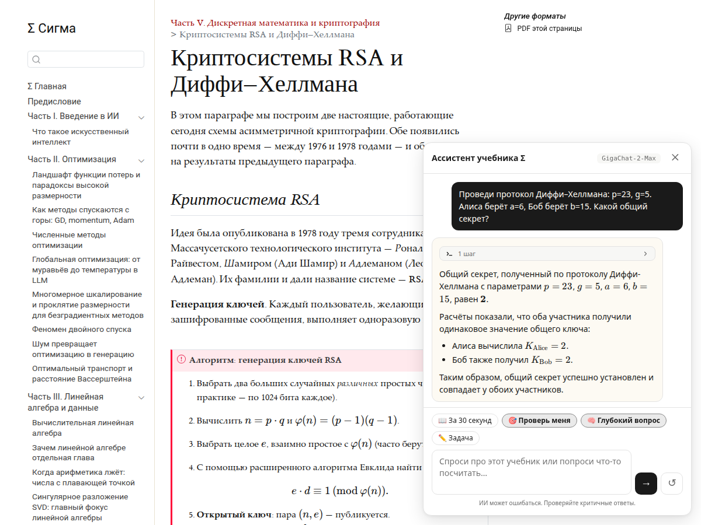

---

### ✅ `outline_chapter` — structural

**Q:** Перечисли основные разделы главы про Ньютона.

_Chapter:_ `ch02_newton`

**Tools called:** read_chapter
**Tools expected:** (none)
**Images:** 0 (expected: no)
**Elapsed:** 6.2s


<details><summary>Answer</summary>


```
Глава «Численные методы оптимизации» содержит следующие основные разделы:

- **От Ньютона до Канторовича**
- **Метод Ньютона для задач оптимизации**
- **Пример 1. Извлечение квадратного корня**

Также в разделе про извлечение квадратного корня рассматривается **сходимость через сжимающее отображение**.
```

</details>

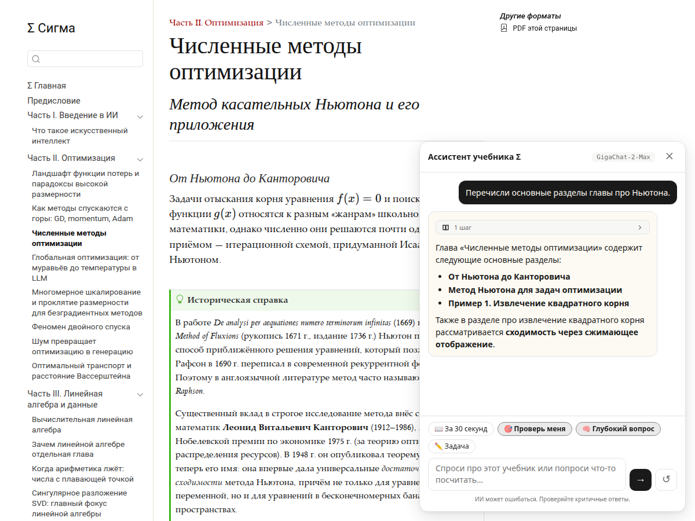

---

### ✅ `math_latex_derivation` — rag_basic

**Q:** Выведи формулу метода Ньютона через касательную. Формулу запиши через LaTeX.

_Chapter:_ `ch02_newton`

**Tools called:** read_chapter
**Tools expected:** (none)
**Images:** 1 (expected: no)
**Elapsed:** 10.9s


<details><summary>Answer</summary>


```
Вот вывод формулы метода Ньютона через касательную:

---

**Геометрическая идея:**  
Чтобы найти корень уравнения $f(x)=0$, начиная с точки $x_k$, заменим график функции $f(x)$ его касательной в точке $(x_k, f(x_k))$.

Уравнение касательной выглядит так:  
$$
y = f(x_k) + f'(x_k)\, (x - x_k)
$$

Пересекаем касательную с осью $x$ ($y=0$), отсюда находим следующее приближение $x_{k+1}$:  
$$
x_{k+1} = x_k - \frac{f(x_k)}{f'(x_k)}
$$

Таким образом, получена рекуррентная формула метода Ньютона:  
$$
x_{k+1} = x_k - \frac{f(x_k)}{f'(x_k)} \quad\text{(формула Ньютона)}
$$

На рисунке ниже показано, как каждая новая касательная приводит нас ближе к корню:


Эта геометрическая интерпретация помогает понять суть метода Ньютона: каждый новый шаг уточняет положение корня, используя информацию о наклоне функции в предыдущей точке.
```

</details>


---

### ❌ `definition_perceptron` — definition

**Q:** Что такое полносвязная нейронная сеть?

_Chapter:_ `ch03_3_zadacha-klassifikacii-i-neyronny`

**Tools called:** read_chapter
**Tools expected:** find_definition
**Images:** 0 (expected: no)
**Elapsed:** 7.8s


<details><summary>Answer</summary>


```
Полносвязная нейронная сеть — это такая архитектура нейросети, где каждый нейрон одного слоя соединён со всеми нейронами следующего слоя. То есть информация проходит последовательно через слои, и каждый нейрон получает сигнал от всех предыдущих нейронов своего уровня.

Это одна из самых простых архитектур, которую используют для начала изучения нейросетей. Она хорошо работает на небольших наборах данных, но на больших может быть неэффективна из-за большого количества параметров и риска переобучения.

Для сравнения, в тексте упоминаются также свёрточные сети, которые лучше подходят для обработки изображений благодаря своей архитектуре, учитывающей пространственную структуру данных.
```

</details>

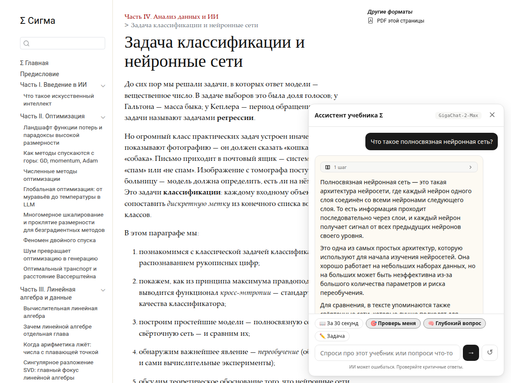

---

### ❌ `refuse_unknown_year` — out_of_scope

**Q:** В каком году Гаусс изобрёл метод сопряжённых градиентов?

_Chapter:_ `ch02_newton`

**Tools called:** search_textbook
**Tools expected:** (none)
**Images:** 0 (expected: no)
**Elapsed:** 9.8s

_Missing substrings:_ ['наш']

<details><summary>Answer</summary>


```
Год изобретения метода сопряжённых градиентов Гауссом указан в учебнике: **1809**. Подробности см. в разделе [«III закон Кеплера по данным Тихо Браге»](../ch03_2_lineynaya-regressiya-i-metod-nai.html#ssec:kepler).
```

</details>

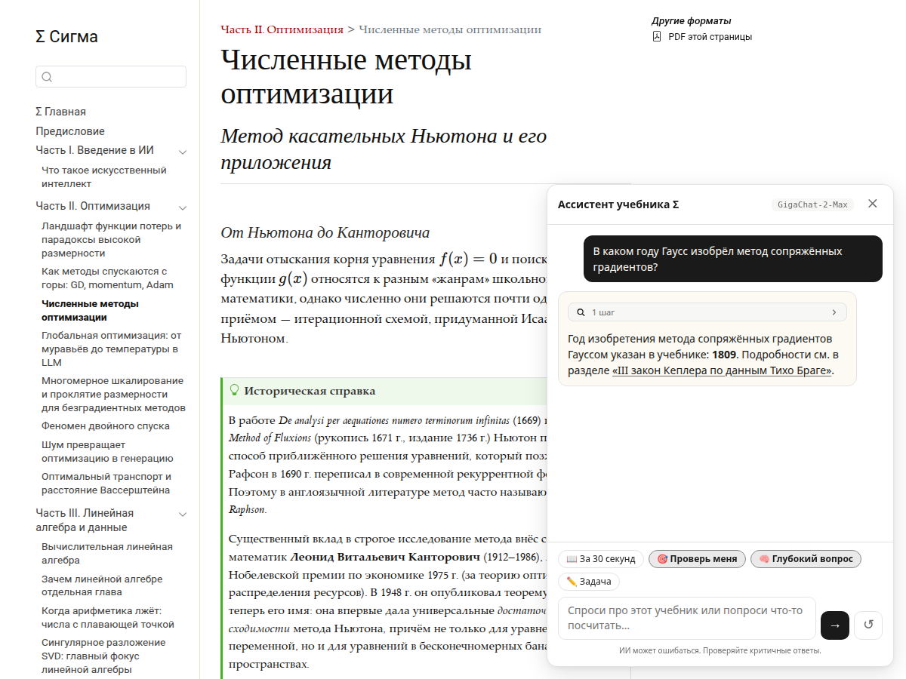

---
