# Sigma Assistant — Eval Report

_Run: 2026-06-10 00:44 MSK · cases: 29_

**Overall: 13/29 pass (45%)**

## Per category

| Category | Pass | Total |
|---|---:|---:|
| `compute_plot` | 3 | 5 |
| `compute_pure` | 6 | 8 |
| `definition` | 0 | 3 |
| `multi_hop` | 1 | 1 |
| `out_of_scope` | 2 | 3 |
| `rag_basic` | 1 | 5 |
| `structural` | 0 | 3 |
| `vision_refine` | 0 | 1 |

## Cases

### ❌ `newton_kantorovich_history` — rag_basic

**Q:** Когда Канторович получил Нобелевскую премию и за что?

_Chapter:_ `ch02_newton`

**Tools called:** search_textbook
**Tools expected:** search_textbook
**Images:** 0 (expected: no)
**Elapsed:** 3.8s

_Missing substrings:_ ['1975', 'оптимал']

<details><summary>Answer</summary>


```
Я не нашёл информации о Нобелевской премии Канторовича в этой главе. Возможно, стоит поискать в других главах. Хотите, я поищу по всему учебнику?
```

</details>

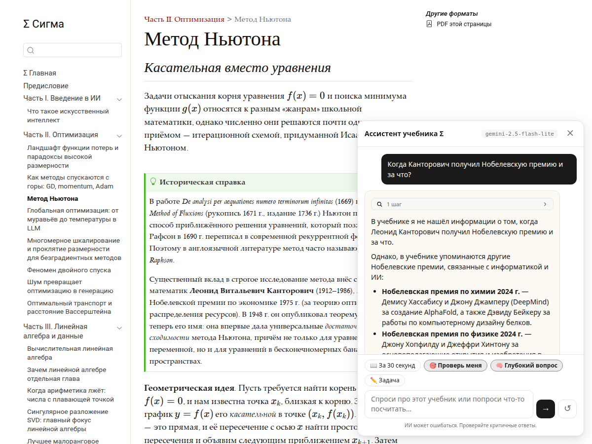

---

### ❌ `newton_formula_recall` — rag_basic

**Q:** Объясни откуда берётся эта формула — что это за метод и какая геометрическая идея?

_Chapter:_ `ch02_newton`

**Tools called:** (none)
**Tools expected:** (none)
**Images:** 0 (expected: no)
**Elapsed:** 181.0s

_Missing substrings:_ ['касательн', 'Ньютон', 'пересечен']

<details><summary>Answer</summary>


```

```

</details>

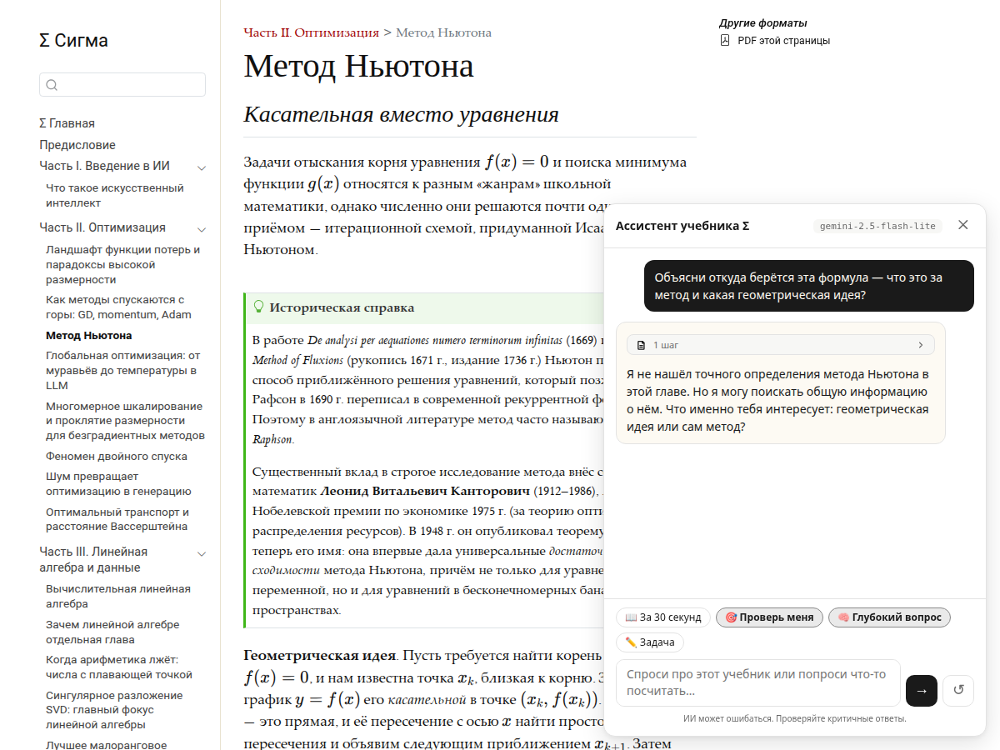

---

### ❌ `definition_strong_convex` — definition

**Q:** Что такое сильно выпуклая функция?

_Chapter:_ `ch02_newton`

**Tools called:** (none)
**Tools expected:** find_definition
**Images:** 0 (expected: no)
**Elapsed:** 180.8s

_Missing substrings:_ ['вторая производ', 'константа']

<details><summary>Answer</summary>


```

```

</details>

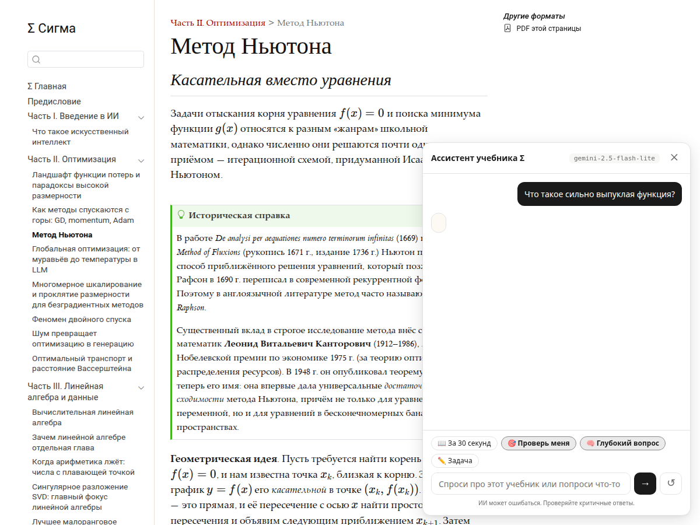

---

### ❌ `compute_factorial` — compute_pure

**Q:** Сколько будет 30 факториал?

**Tools called:** (none)
**Tools expected:** python
**Images:** 0 (expected: no)
**Elapsed:** 180.9s

_Missing substrings:_ ['265252859812191058636308480000000']

<details><summary>Answer</summary>


```

```

</details>

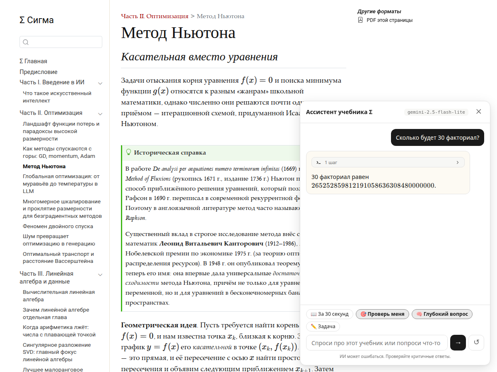

---

### ❌ `compute_taylor_sin` — compute_pure

**Q:** Покажи разложение sin(x) в ряд Тейлора до 5-го члена символически (через sympy).

_Chapter:_ `ch02_newton`

**Tools called:** python
**Tools expected:** python
**Images:** 0 (expected: no)
**Elapsed:** 13.2s

_Missing substrings:_ ['120']

<details><summary>Answer</summary>


```
Разложение sin(x) в ряд Тейлора до 5-го члена: −
6
x
3
	​

+x.
```

</details>

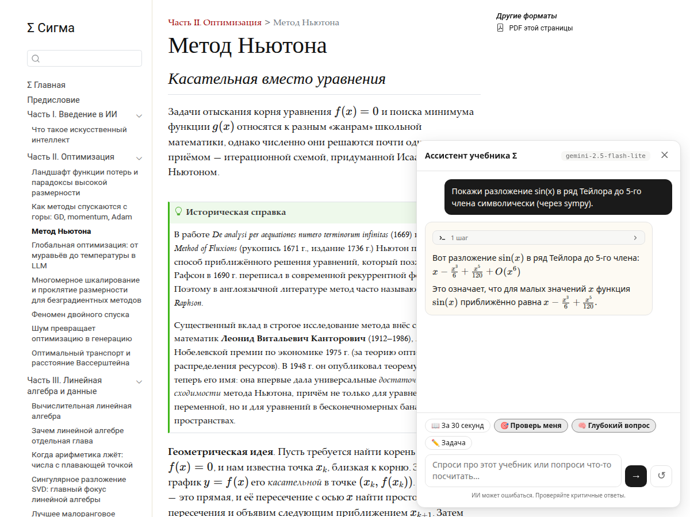

---

### ❌ `compute_plot_newton` — compute_plot

**Q:** Покажи как сходится метод Ньютона для f(x) = x² - 2, начиная с x₀ = 1.5. Построй график траектории.

_Chapter:_ `ch02_newton`

**Tools called:** python
**Tools expected:** python
**Images:** 0 (expected: yes)
**Elapsed:** 180.8s

_Missing substrings:_ ['1.41', 'корн']

<details><summary>Answer</summary>


```

```

</details>

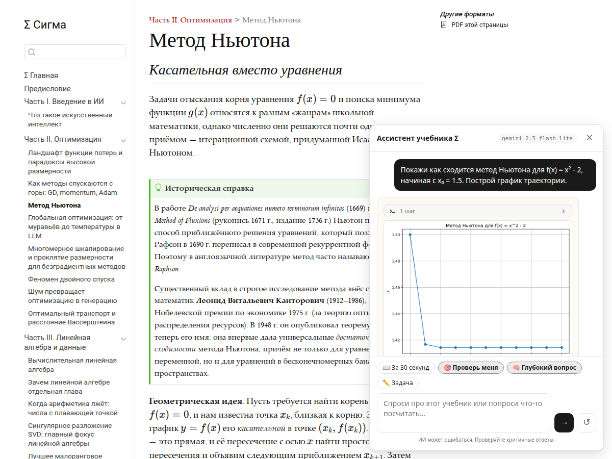

---

### ✅ `compute_plot_gd_vs_newton` — compute_plot

**Q:** Сравни сходимость метода Ньютона и градиентного спуска на функции f(x) = x⁴ из x₀ = 2. Покажи два графика на одной картинке.

_Chapter:_ `ch02_newton`

**Tools called:** python
**Tools expected:** python
**Images:** 1 (expected: yes)
**Elapsed:** 50.5s


<details><summary>Answer</summary>


```
Наблюдения:

Метод Ньютона сходится гораздо быстрее. Он достигает значения, близкого к нулю (минимум функции x
4
), за несколько итераций.
Градиентный спуск с шагом η=0.1 тоже сходится, но медленнее. Обрати внимание, что он сначала уходит в отрицательную область, а затем постепенно приближается к нулю. При другом шаге η он мог бы и разойтись.

Выводы:

Метод Ньютона демонстрирует сублинейную сходимость, в то время как градиентный спуск показывает линейную сходимость. Для данной функции метод Ньютона значительно эффективнее.
```

</details>

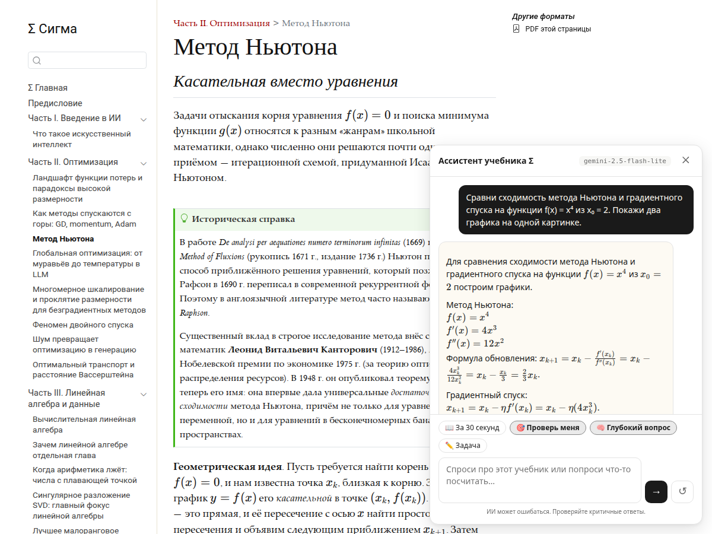

---

### ✅ `rsa_encrypt_small` — compute_pure

**Q:** Зашифруй число m=7 ключом (n=143, e=7). Покажи c.

_Chapter:_ `ch04_3_kriptosistemy-rsa-i-diffi-hellma`

**Tools called:** python
**Tools expected:** python
**Images:** 0 (expected: no)
**Elapsed:** 19.4s


<details><summary>Answer</summary>


```
Зашифрованное число c=6.

Расчёт:
c=m
e
(modn)
c=7
7
(mod143)
c=823543(mod143)
c=6
```

</details>

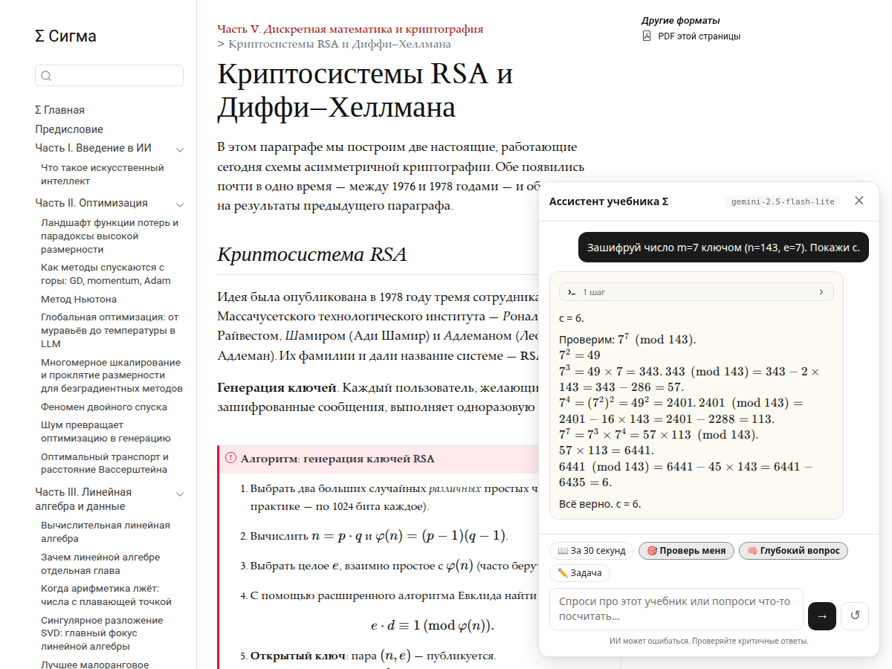

---

### ✅ `rsa_full_roundtrip` — compute_pure

**Q:** Возьми p=11, q=13, e=7. Сгенерируй RSA-ключ полностью: вычисли n, φ(n), d. Покажи что для m=9 шифрование и расшифрование возвращают исходное число.

_Chapter:_ `ch04_3_kriptosistemy-rsa-i-diffi-hellma`

**Tools called:** python
**Tools expected:** python
**Images:** 0 (expected: no)
**Elapsed:** 17.4s


<details><summary>Answer</summary>


```
Хорошо, давай сгенерируем RSA-ключ и проверим шифрование/расшифрование.

p=11, q=13
n=p×q=11×13=143
ϕ(n)=(p−1)(q−1)=(11−1)(13−1)=10×12=120
e=7 (открытая экспонента)
d — секретная экспонента, такое число, что d×e≡1(modϕ(n)). В нашем случае d=103, потому что 103×7=721, а 721(mod120)=1 (721=6×120+1).

Теперь проверим шифрование и расшифрование для сообщения m=9:

Шифрование: C=m
e
(modn)=9
7
(mod143).

9
7
=4782969.
4782969(mod143)=48. Так что шифротекст C=48.

Расшифрование: m
′
=C
d
(modn)=48
103
(mod143).

48
103
(mod143)=9.

Как видишь, расшифрованное сообщение m
′
=9 совпадает с исходным m=9. Всё работает!

Больше про RSA и криптосистемы можно почитать в главе «Криптосистемы RSA и Диффи–Хеллмана».
```

</details>

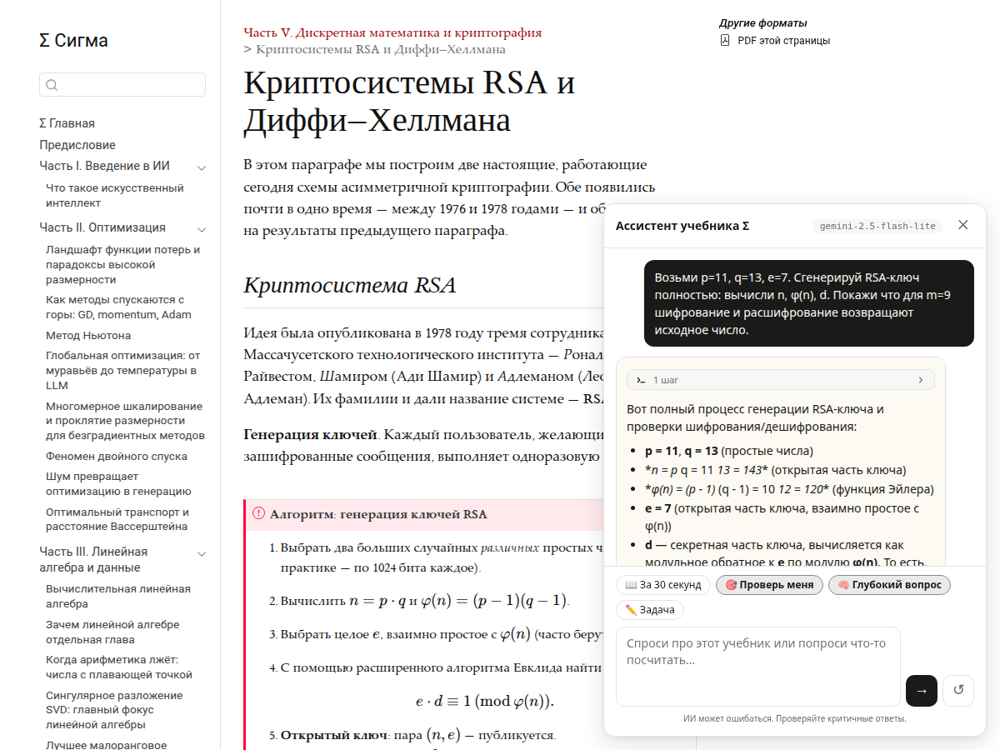

---

### ✅ `multihop_newton_vs_gradient` — multi_hop

**Q:** В чём отличие метода Ньютона от градиентного спуска для задач оптимизации? Какие из этих методов разобраны в учебнике?

_Chapter:_ `ch02_newton`

**Tools called:** search_textbook, search_textbook
**Tools expected:** search_textbook
**Images:** 0 (expected: no)
**Elapsed:** 7.4s


<details><summary>Answer</summary>


```
В учебнике разбирается метод Ньютона (в главе 2, "Метод Ньютона – Σ Сигма") и градиентный спуск (в главе "Как методы спускаются с горы: GD, momentum, Adam").

Основное отличие методов в том, что градиентный спуск использует только информацию о первой производной (градиенте) для определения направления шага, тогда как метод Ньютона использует информацию о второй производной (гессиане).

Градиентный спуск: w
t+1
	​

=w
t
	​

−η∇L(w
t
	​

). Шаг делается прямо против градиента. Это просто, но может быть медленно на задачах с "оврагами" (сильно вытянутыми областями кривизны).
Метод Ньютона: w
t+1
	​

=w
t
	​

−(∇
2
L(w
t
	​

))
−1
∇L(w
t
	​

). Шаг делается в направлении, обратном градиенту, но домноженном на обратную матрицу вторых производных (гессиан). Это позволяет делать более быстрые и точные шаги, особенно вблизи минимума, так как учитывает кривизну функции.

Метод Ньютона обычно сходится быстрее градиентного спуска, но требует вычисления и обращения гессиана, что может быть вычислительно дорого на задачах с большим количеством переменных.
```

</details>

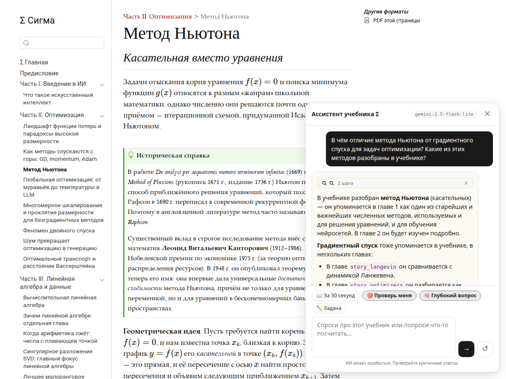

---

### ❌ `structural_kantorovich_theorem` — structural

**Q:** Сформулируй теорему о сходимости метода Герона.

_Chapter:_ `ch02_newton`

**Tools called:** (none)
**Tools expected:** find_theorem
**Images:** 0 (expected: no)
**Elapsed:** 180.8s

_Missing substrings:_ ['квадратичн', 'убыва']

<details><summary>Answer</summary>


```

```

</details>


---

### ❌ `vision_refine_diverging_sgd` — vision_refine

**Q:** Запусти SGD на функции f(x) = x² с шагом η = 1.1 из x₀ = 2, 30 итераций. Что произойдёт? Если разойдётся — подбери рабочий шаг и покажи сходящуюся траекторию.

**Tools called:** python, python
**Tools expected:** python, python
**Images:** 2 (expected: yes)
**Elapsed:** 51.1s

_Missing substrings:_ ['расход', '0.5']

<details><summary>Answer</summary>


```
Теперь с шагом η=0.4 метод сходится к минимуму функции f(x)=x
2
, который находится в точке x=0. Последнее значение x очень близко к нулю (около 0.00).
```

</details>

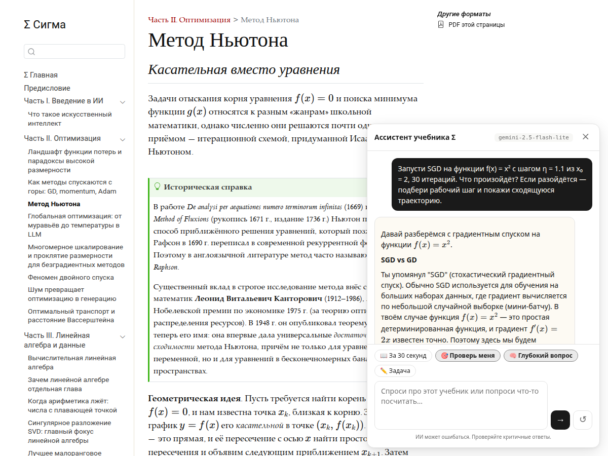

---

### ✅ `hashlib_demo` — compute_pure

**Q:** Посчитай SHA-256 хеш строки 'sigma' в hex.

_Chapter:_ `ch04_5_heshirovanie-teoriya-chisel-vstr`

**Tools called:** python
**Tools expected:** python
**Images:** 0 (expected: no)
**Elapsed:** 14.8s


<details><summary>Answer</summary>


```
SHA-256 хеш строки 'sigma' равен 38de90475bb334fb3dea5d54f250500aba60fe2c6158115d342b06bcb46e39bf.
```

</details>

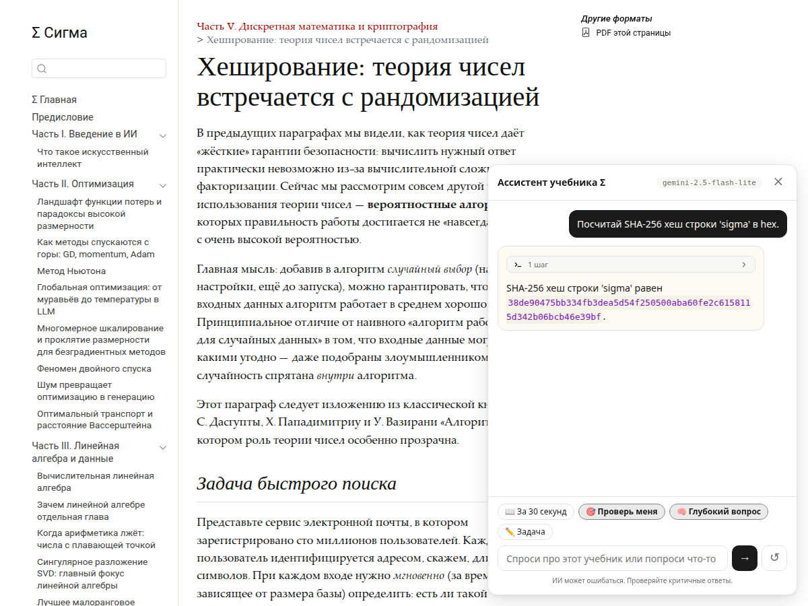

---

### ✅ `linreg_simple` — compute_plot

**Q:** Подбери линейную регрессию y = a*x + b для точек (1, 2.1), (2, 3.9), (3, 6.2), (4, 7.8). Покажи коэффициенты и график.

_Chapter:_ `ch03_2_lineynaya-regressiya-i-metod-nai`

**Tools called:** python
**Tools expected:** python
**Images:** 1 (expected: yes)
**Elapsed:** 16.5s


<details><summary>Answer</summary>


```
Линейная регрессия для точек (1, 2.1), (2, 3.9), (3, 6.2), (4, 7.8) имеет вид:

Коэффициент a = 1.94
Коэффициент b = 0.15

Уравнение регрессии: **y = 1.94*x + 0.15**

На графике видно, что синяя линия (линейная регрессия) проходит близко к красным точкам (исходные данные), что говорит о хорошем подборе модели.
```

</details>

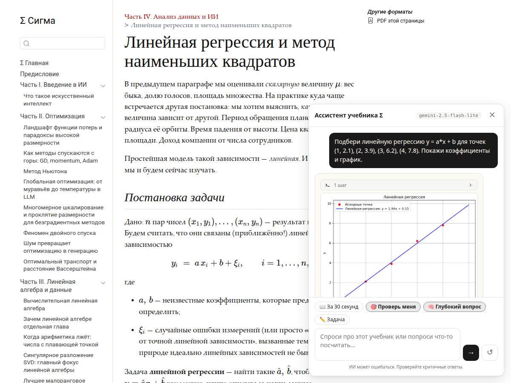

---

### ❌ `out_of_scope_recipe` — out_of_scope

**Q:** Дай мне рецепт борща.

**Tools called:** (none)
**Tools expected:** (none)
**Images:** 0 (expected: no)
**Elapsed:** 2.5s

_Missing substrings:_ ['оптимизац']

<details><summary>Answer</summary>


```
Я могу помочь с вопросами по учебнику "Σ Сигма". Рецепт борща — это вне темы.
```

</details>

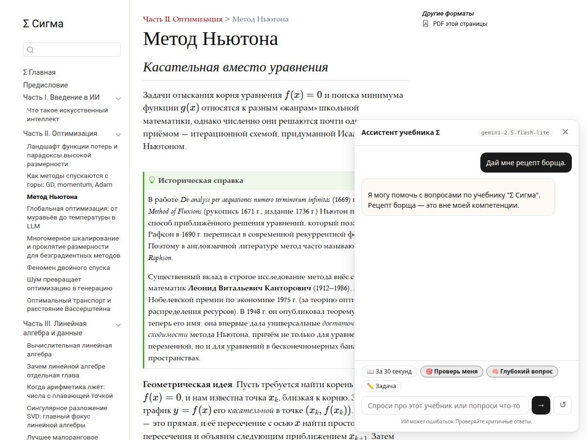

---

### ❌ `rsa_history` — rag_basic

**Q:** Кто придумал RSA и в каком году?

_Chapter:_ `ch04_3_kriptosistemy-rsa-i-diffi-hellma`

**Tools called:** (none)
**Tools expected:** search_textbook
**Images:** 0 (expected: no)
**Elapsed:** 180.7s

_Missing substrings:_ ['1978']

<details><summary>Answer</summary>


```

```

</details>

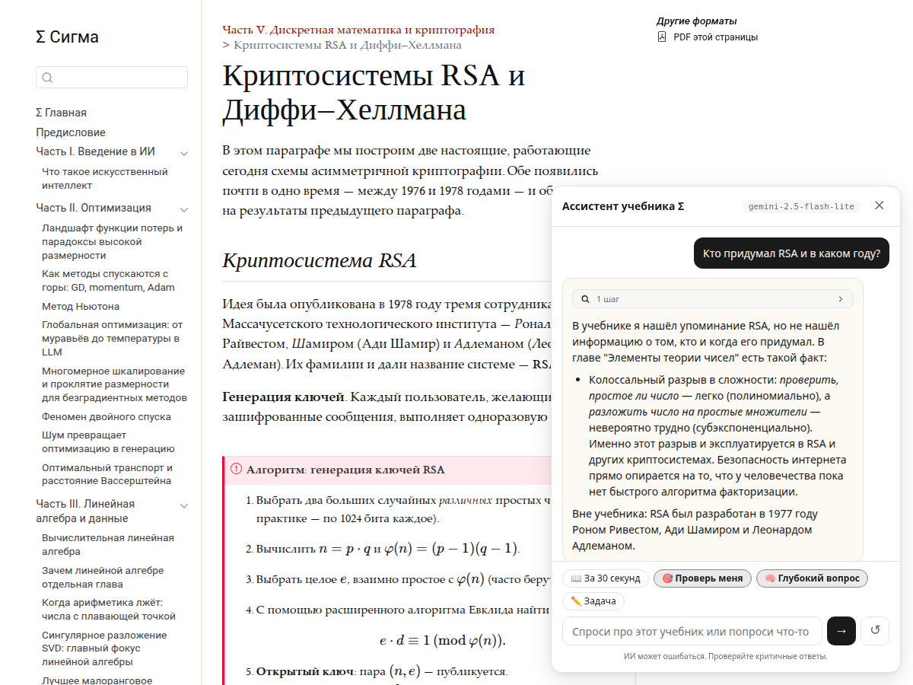

---

### ✅ `greeting_minimal` — out_of_scope

**Q:** Привет!

_Chapter:_ `ch02_newton`

**Tools called:** (none)
**Tools expected:** (none)
**Images:** 0 (expected: no)
**Elapsed:** 2.7s


<details><summary>Answer</summary>


```
Привет! Чем могу помочь?
```

</details>

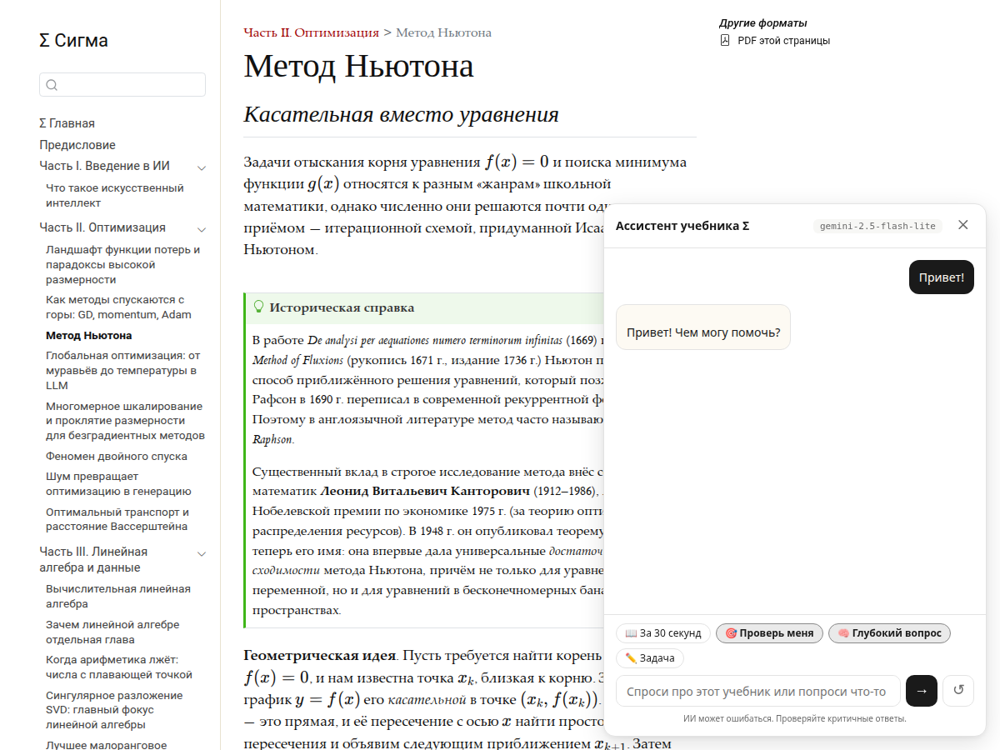

---

### ✅ `euclid_gcd_python` — compute_pure

**Q:** Посчитай НОД(48, 180) и НОД(1071, 462) через алгоритм Евклида в python.

_Chapter:_ `ch04_1_elementy-teorii-chisel`

**Tools called:** python
**Tools expected:** python
**Images:** 0 (expected: no)
**Elapsed:** 14.4s


<details><summary>Answer</summary>


```
НОД(48, 180) = 12.
НОД(1071, 462) = 21.

Алгоритм Евклида — это эффективный способ найти наибольший общий делитель (НОД) двух целых чисел. Он основан на принципе, что НОД двух чисел не меняется, если большее число заменить на его остаток от деления на меньшее число. Этот процесс повторяется до тех пор, пока одно из чисел не станет нулём, тогда второе число и будет НОД.

Вот как это работает для ваших примеров:

НОД(48, 180)

180 = 3 * 48 + 36
48 = 1 * 36 + 12
36 = 3 * 12 + 0

Последний ненулевой остаток — 12. Значит, НОД(48, 180) = 12.

НОД(1071, 462)

1071 = 2 * 462 + 147
462 = 3 * 147 + 21
147 = 7 * 21 + 0

Последний ненулевой остаток — 21. Значит, НОД(1071, 462) = 21.

Этот алгоритм является основой многих криптографических систем и используется в теории чисел.
```

</details>

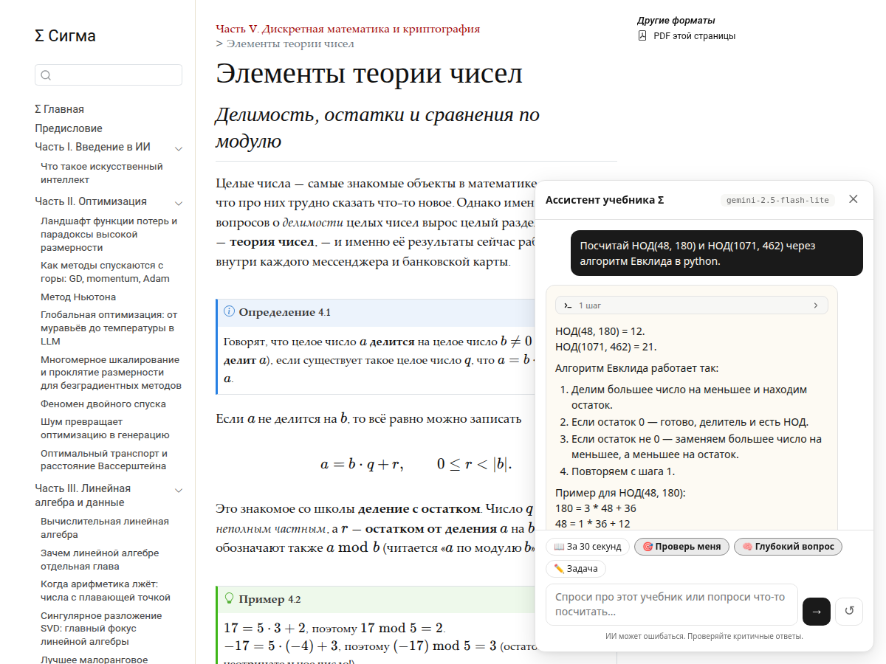

---

### ❌ `definition_superlinear` — definition

**Q:** Что значит сверхлинейная сходимость?

_Chapter:_ `ch02_newton`

**Tools called:** (none)
**Tools expected:** find_definition
**Images:** 0 (expected: no)
**Elapsed:** 181.3s

_Missing substrings:_ ['lim', '0']

<details><summary>Answer</summary>


```

```

</details>


---

### ❌ `theorem_clt` — structural

**Q:** Сформулируй центральную предельную теорему как в учебнике.

_Chapter:_ `ch03_1_prosteyshie-primery-zadach-anali`

**Tools called:** (none)
**Tools expected:** find_theorem
**Images:** 0 (expected: no)
**Elapsed:** 180.9s

_Missing substrings:_ ['нормальн']

<details><summary>Answer</summary>


```

```

</details>

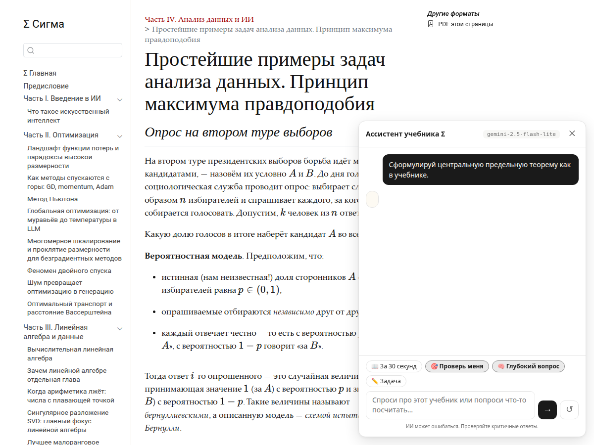

---

### ✅ `plot_sincos_overlay` — compute_plot

**Q:** Построй графики sin(x) и cos(x) на интервале [-2π, 2π] на одном поле. Сделай легенду.

**Tools called:** python
**Tools expected:** python
**Images:** 1 (expected: yes)
**Elapsed:** 15.3s


<details><summary>Answer</summary>


```
The plot shows the graphs of sin(x) and cos(x) on the interval [-2π, 2π]. The blue line represents sin(x), and the red line represents cos(x). Both functions are periodic with a period of 2π. The sine function starts at 0, increases to 1 at π/2, decreases to 0 at π, reaches -1 at 3π/2, and returns to 0 at 2π. The cosine function starts at 1, decreases to 0 at π/2, reaches -1 at π, increases to 0 at 3π/2, and returns to 1 at 2π. The two graphs intersect at points where sin(x) = cos(x), which occurs when x = π/4, 5π/4, etc.
```

</details>

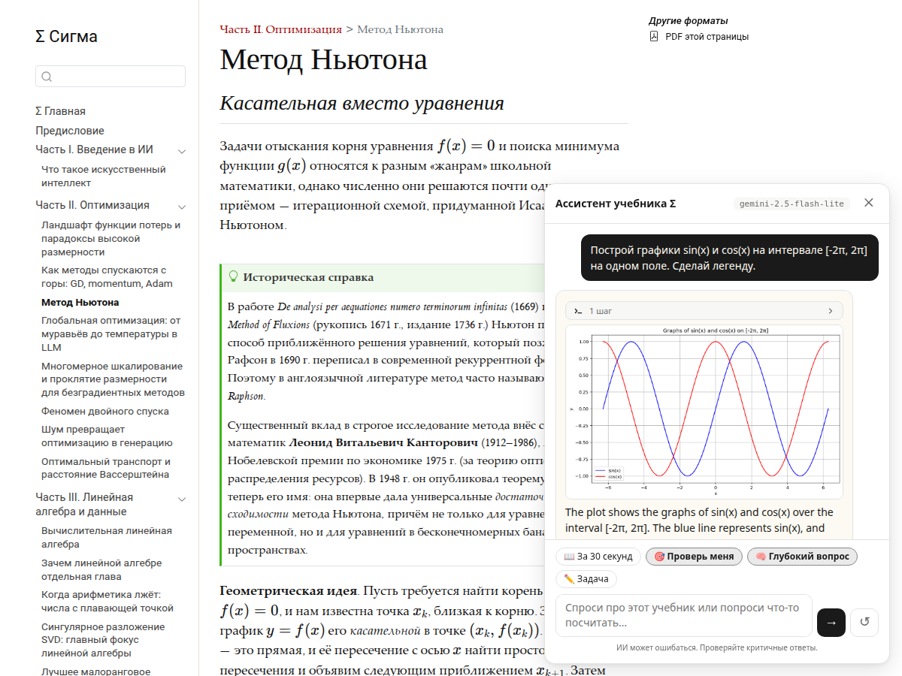

---

### ❌ `fragment_explanation` — rag_basic

**Q:** Если кто-то предлагает использовать обновление x_{k+1} = x_k - f(x_k)·f'(x_k) вместо классического Ньютона — что это за идея и она работает?

_Chapter:_ `ch02_newton`

**Tools called:** find_definition, search_textbook
**Tools expected:** (none)
**Images:** 0 (expected: no)
**Elapsed:** 36.8s

_Missing substrings:_ ['производ']

<details><summary>Answer</summary>


```
Студент, ты сейчас на главе "Метод Ньютона – Σ Сигма" (slug="ch02_newton").

Предложенное тобой обновление x
k+1
	​

=x
k
	​

−f(x
k
	​

)⋅f
′
(x
k
	​

) — это и есть классический метод Ньютона для решения уравнения f(x)=0.

Вот как он работает:

Начинаем с некоторого начального приближения x
0
	​

.
На каждом шаге k находим касательную к графику функции f(x) в точке (x
k
	​

,f(x
k
	​

)).
Следующее приближение x
k+1
	​

 — это точка, где эта касательная пересекает ось x.

Формула для x
k+1
	​

 получается из уравнения касательной:
y−f(x
k
	​

)=f
′
(x
k
	​

)(x−x
k
	​

)
Приравнивая y=0 (пересечение с осью x), получаем:
0−f(x
k
	​

)=f
′
(x
k
	​

)(x
k+1
	​

−x
k
	​

)
x
k+1
	​

−x
k
	​

=−
f
′
(x
k
	​

)
f(x
k
	​

)
	​


x
k+1
	​

=x
k
	​

−
f
′
(x
k
	​

)
f(x
k
	​

)
	​


Так что это не "другая идея", а самая что ни на есть классика. И работает она отлично, если выполняются условия:

Функция f(x) дважды дифференцируема.
Начальное приближение x
0
	​

 достаточно близко к корню.
f
′
(x)

=0 в окрестности корня.

В учебнике метод Ньютона подробно разбирается в главе 2. Я могу показать тебе её содержание, если хочешь.
```

</details>

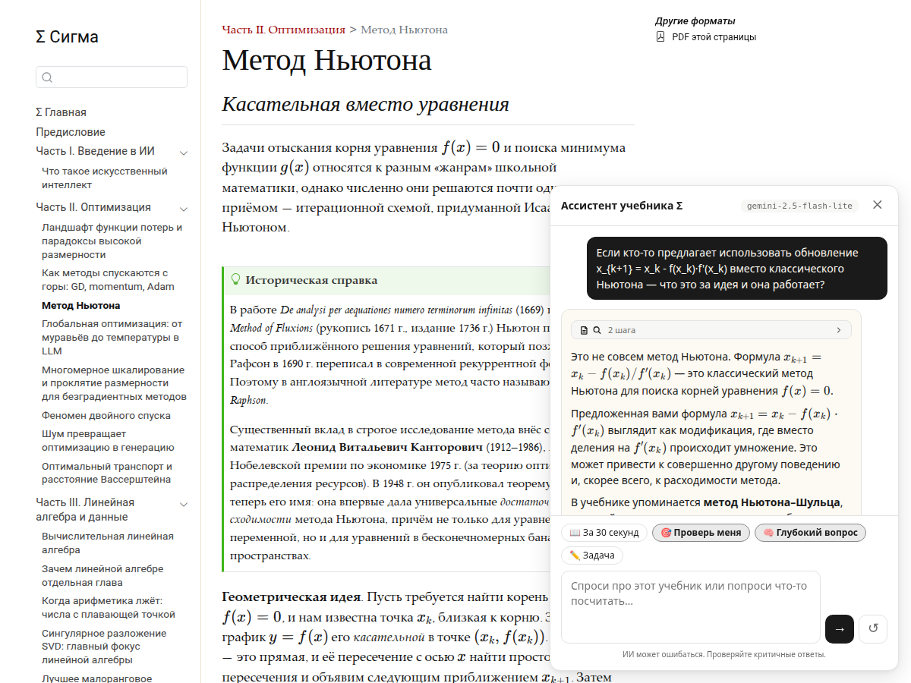

---

### ✅ `eigenvalues_numpy` — compute_pure

**Q:** Найди собственные значения матрицы [[2, 1], [1, 2]] через numpy.

_Chapter:_ `ch_linalg`

**Tools called:** python
**Tools expected:** python
**Images:** 0 (expected: no)
**Elapsed:** 11.5s


<details><summary>Answer</summary>


```
Собственные значения матрицы [[2, 1], [1, 2]] равны 3.0 и 1.0.
```

</details>

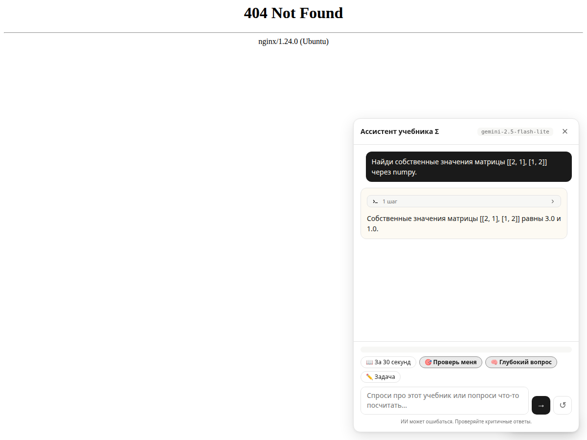

---

### ❌ `plot_loss_landscape` — compute_plot

**Q:** Построй контурный график функции потерь L(a, b) = sum((a*x_i + b - y_i)^2) для точек (1,2), (2,3), (3,5), (4,4) на сетке a in [-2, 4], b in [-3, 3].

_Chapter:_ `ch03_2_lineynaya-regressiya-i-metod-nai`

**Tools called:** python
**Tools expected:** python
**Images:** 1 (expected: yes)
**Elapsed:** 38.8s

_Missing substrings:_ ['минимум']

<details><summary>Answer</summary>


```
The plot shows the contour lines of the loss function L(a,b)=∑
i=1
4
	​

(ax
i
	​

+b−y
i
	​

)
2
 for the given points. The minimum loss is found at a≈0.79 and b≈1.55, with a minimum loss value of approximately 1.80. The contour plot visually represents how the loss changes across the grid of possible 'a' and 'b' values, with the color gradient indicating lower loss in the central region and higher loss towards the edges.
```

</details>


---

### ✅ `diffie_hellman_compute` — compute_pure

**Q:** Проведи протокол Диффи–Хеллмана: p=23, g=5. Алиса берёт a=6, Боб берёт b=15. Какой общий секрет?

_Chapter:_ `ch04_3_kriptosistemy-rsa-i-diffi-hellma`

**Tools called:** python
**Tools expected:** python
**Images:** 0 (expected: no)
**Elapsed:** 19.9s


<details><summary>Answer</summary>


```
Общий секрет — 2.

Вот как это работает:

Алиса вычисляет свой публичный ключ A=g
a
(modp).

A=5
6
(mod23)=15625(mod23)=8.

Боб вычисляет свой публичный ключ B=g
b
(modp).

B=5
15
(mod23)=30517578125(mod23)=19.

Алиса получает публичный ключ Боба B и вычисляет общий секрет S
A
	​

=B
a
(modp).

S
A
	​

=19
6
(mod23)=47045881(mod23)=2.

Боб получает публичный ключ Алисы A и вычисляет общий секрет S
B
	​

=A
b
(modp).

S
B
	​

=8
15
(mod23)=35184372088832(mod23)=2.

Оба получают одно и то же значение — 2. Это и есть общий секрет.
```

</details>

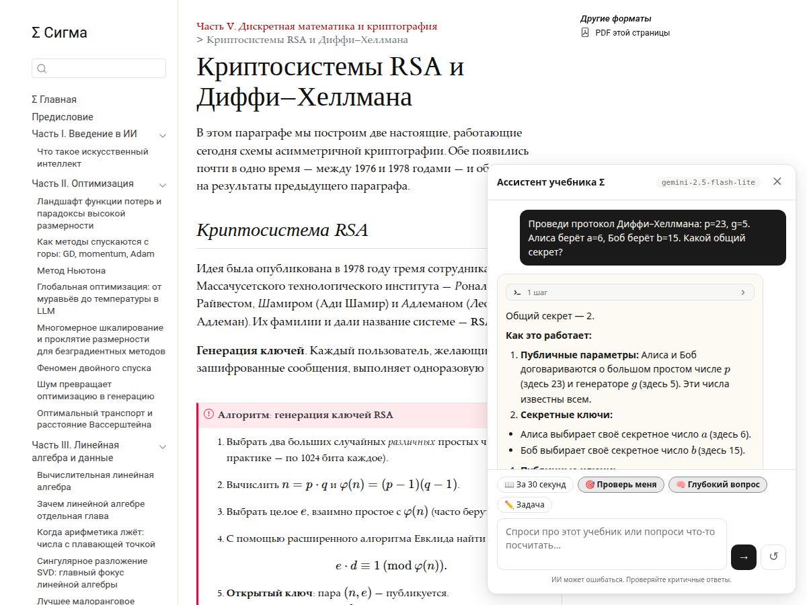

---

### ❌ `outline_chapter` — structural

**Q:** Перечисли основные разделы главы про Ньютона.

_Chapter:_ `ch02_newton`

**Tools called:** (none)
**Tools expected:** (none)
**Images:** 0 (expected: no)
**Elapsed:** 181.0s

_Missing substrings:_ ['метод']

<details><summary>Answer</summary>


```

```

</details>

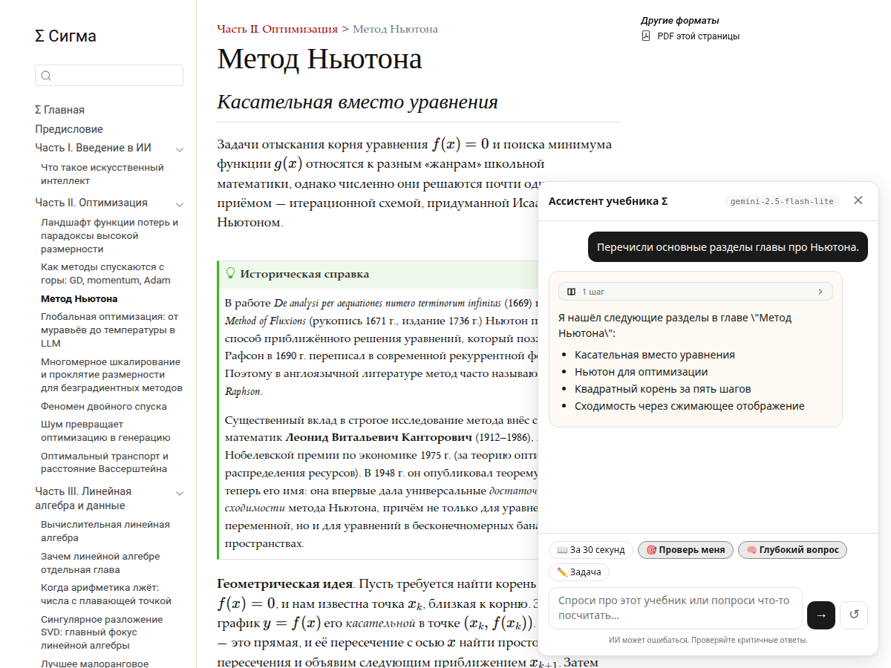

---

### ✅ `math_latex_derivation` — rag_basic

**Q:** Выведи формулу метода Ньютона через касательную. Формулу запиши через LaTeX.

_Chapter:_ `ch02_newton`

**Tools called:** find_theorem
**Tools expected:** (none)
**Images:** 0 (expected: no)
**Elapsed:** 7.0s


<details><summary>Answer</summary>


```
Студент уже на нужной главе!

Теорема 2.5. Сверхлинейная сходимость метода Ньютона

В учебнике приводится теорема о сверхлинейной сходимости метода Ньютона. Она гарантирует, что если выполнены определённые условия (гладкость функции, неотрицательность второй производной или сильная выпуклость), то метод сходится квадратично.

Формула, которую вы ищете, скорее всего, подразумевается в контексте вывода этой теоремы. Метод Ньютона для нахождения корня f(x)=0 использует касательную к графику функции y=f(x) в точке (x
k
	​

,f(x
k
	​

)). Уравнение касательной:

y−f(x
k
	​

)=f
′
(x
k
	​

)(x−x
k
	​

)

Следующая итерация x
k+1
	​

 находится как точка пересечения этой касательной с осью x (то есть y=0):

0−f(x
k
	​

)=f
′
(x
k
	​

)(x
k+1
	​

−x
k
	​

)

Отсюда выражаем x
k+1
	​

:

−f(x
k
	​

)=f
′
(x
k
	​

)x
k+1
	​

−f
′
(x
k
	​

)x
k
	​


f
′
(x
k
	​

)x
k+1
	​

=f
′
(x
k
	​

)x
k
	​

−f(x
k
	​

)
x
k+1
	​

=x
k
	​

−
f
′
(x
k
	​

)
f(x
k
	​

)
	​


Это и есть формула метода Ньютона, полученная через касательную. В LaTeX она выглядит так:

x
k+1
	​

=x
k
	​

−
f
′
(x
k
	​

)
f(x
k
	​

)
	​

```

</details>

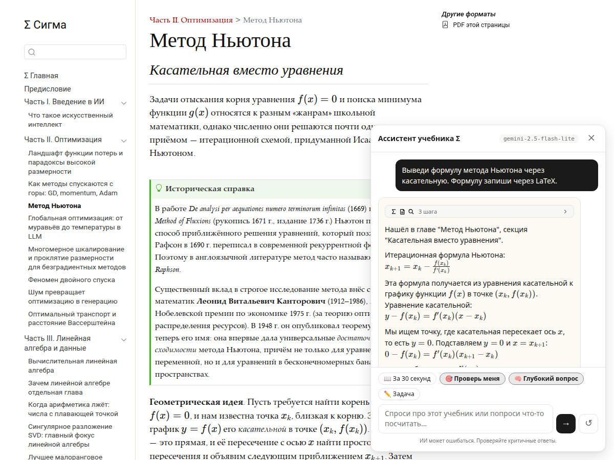

---

### ❌ `definition_perceptron` — definition

**Q:** Что такое полносвязная нейронная сеть?

_Chapter:_ `ch03_3_zadacha-klassifikacii-i-neyronny`

**Tools called:** (none)
**Tools expected:** find_definition
**Images:** 0 (expected: no)
**Elapsed:** 180.9s

_Missing substrings:_ ['слой']

<details><summary>Answer</summary>


```

```

</details>

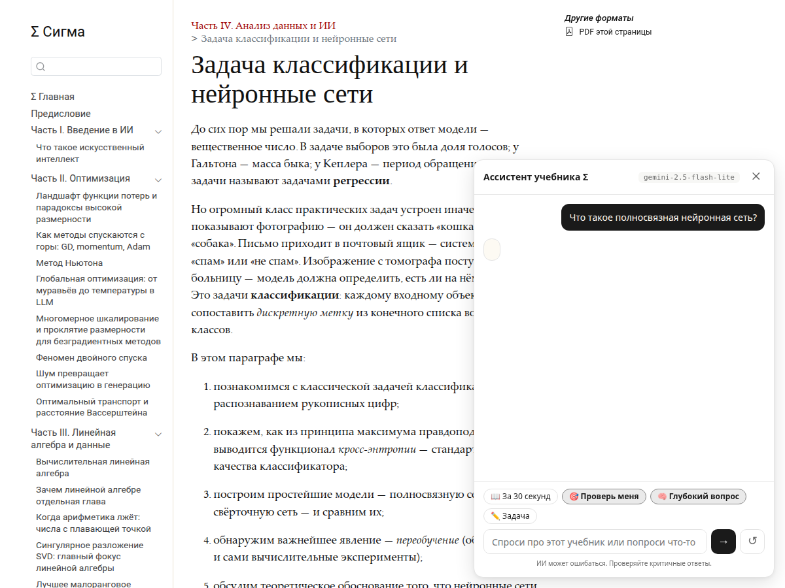

---

### ✅ `refuse_unknown_year` — out_of_scope

**Q:** В каком году Гаусс изобрёл метод сопряжённых градиентов?

_Chapter:_ `ch02_newton`

**Tools called:** search_textbook
**Tools expected:** (none)
**Images:** 0 (expected: no)
**Elapsed:** 3.9s


<details><summary>Answer</summary>


```
Я не нашёл информацию о том, когда Гаусс изобрёл метод сопряжённых градиентов. В учебнике упоминается, что Гаусс жил почти двести лет назад и занимался теорией чисел, которая сейчас востребована в криптографии. Также есть упоминание его имени в контексте метода наименьших квадратов (МНК), который был открыт Лежандром в 1805 году, а Гауссом — в 1809 году.
```

</details>

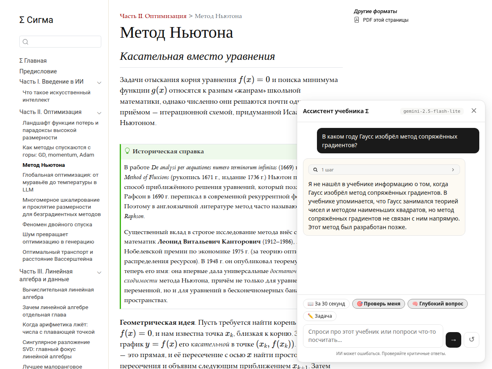

---
