# Sigma Assistant — Eval Report

_Run: 2026-06-09 15:37 MSK · cases: 28_

**Overall: 23/28 pass (82%)**

## Per category

| Category | Pass | Total |
|---|---:|---:|
| `compute_plot` | 4 | 5 |
| `compute_pure` | 7 | 8 |
| `definition` | 3 | 3 |
| `multi_hop` | 0 | 1 |
| `out_of_scope` | 2 | 2 |
| `rag_basic` | 5 | 5 |
| `structural` | 2 | 3 |
| `vision_refine` | 0 | 1 |

## Cases

### ✅ `newton_kantorovich_history` — rag_basic

**Q:** Когда Канторович получил Нобелевскую премию и за что?

_Chapter:_ `ch02_newton`

**Tools called:** search_textbook, search_textbook
**Tools expected:** search_textbook
**Images:** 0 (expected: no)
**Elapsed:** 6.6s


<details><summary>Answer</summary>


```
Леонид Витальевич Канторович получил Нобелевскую премию по экономике в 1975 году.

Как указано в главе «Метод Ньютона», премия была присуждена ему за теорию оптимального распределения ресурсов.

Кстати, ты сейчас находишься именно в этой главе, где также упоминается, что Канторович внёс существенный вклад в исследование метода Ньютона, доказав в 1948 году теорему о достаточных условиях его сходимости для уравнений в банаховых пространствах.
```

</details>


---

### ✅ `newton_formula_recall` — rag_basic

**Q:** Объясни откуда берётся эта формула — что это за метод и какая геометрическая идея?

_Chapter:_ `ch02_newton`

**Tools called:** read_chapter, read_chapter
**Tools expected:** (none)
**Images:** 0 (expected: no)
**Elapsed:** 7.7s


<details><summary>Answer</summary>


```
Метод Ньютона — это мощный итерационный способ поиска корней уравнений или минимумов функций. Ты уже находишься в главе «Метод Ньютона», где этот процесс описан через две ключевые идеи: геометрическую и аналитическую.

1. Геометрическая идея (поиск корня)

Если нам нужно решить уравнение f(x)=0, мы берем текущее приближение x
k
	​

 и проводим касательную к графику функции в точке (x
k
	​

,f(x
k
	​

)).

Касательная — это прямая, её уравнение: y=f(x
k
	​

)+f
′
(x
k
	​

)(x−x
k
	​

).
Мы ищем точку, где эта прямая пересекает ось x (то есть y=0).
Решая уравнение 0=f(x
k
	​

)+f
′
(x
k
	​

)(x
k+1
	​

−x
k
	​

), мы получаем итерационную формулу:

x
k+1
	​

=x
k
	​

−
f
′
(x
k
	​

)
f(x
k
	​

)
	​


Эта точка пересечения становится нашим следующим, более точным приближением x
k+1
	​

.

2. Идея для оптимизации (поиск минимума)

Когда мы ищем минимум функции g(x), мы фактически решаем уравнение g
′
(x)=0. Если подставить g
′
 вместо f в формулу выше, получится:

x
k+1
	​

=x
k
	​

−
g
′′
(x
k
	​

)
g
′
(x
k
	​

)
	​


Здесь работает другая интерпретация: мы заменяем функцию g(x) в окрестности точки x
k
	​

 её квадратичной моделью (параболой), используя первые три члена ряда Тейлора:

q
k
	​

(x)=g(x
k
	​

)+g
′
(x
k
	​

)(x−x
k
	​

)+
2
1
	​

g
′′
(x
k
	​

)(x−x
k
	​

)
2

Следующая точка x
k+1
	​

 — это просто вершина этой параболы. Мы как бы «спускаемся» по локальной аппроксимации функции, пока не найдем её минимум.

Важные моменты из главы:

История: Метод предложил Исаак 
…[truncated]
```

</details>

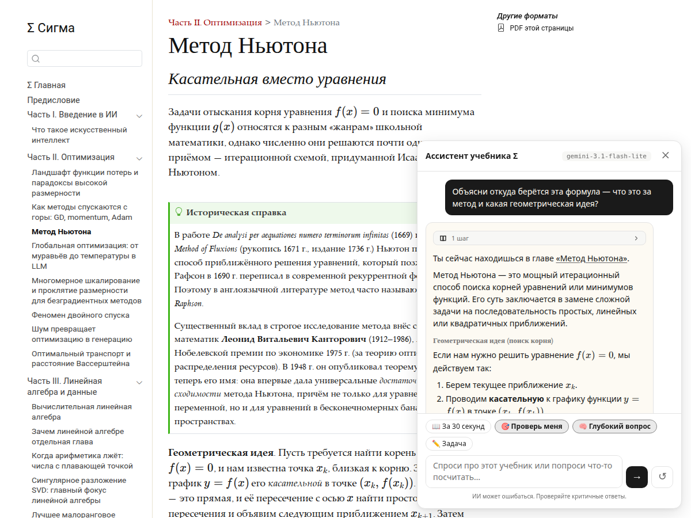

---

### ✅ `definition_strong_convex` — definition

**Q:** Что такое сильно выпуклая функция?

_Chapter:_ `ch02_newton`

**Tools called:** find_definition
**Tools expected:** find_definition
**Images:** 0 (expected: no)
**Elapsed:** 5.9s


<details><summary>Answer</summary>


```
Ты уже находишься в главе «Метод Ньютона», где как раз даётся это определение.

Согласно Определению 2.4 из Метода Ньютона:

Функция g:R→R называется сильно выпуклой с константой μ>0, если:

g∈C
2
 (функция дважды непрерывно дифференцируема).
g
′′
(x)≥μ для всех x (вторая производная функции всегда не меньше некоторой положительной константы μ).

Что это значит на практике:

g
′′
(x)≥μ означает, что кривизна функции ограничена снизу: она не может стать «плоской» или вогнутой.
Это свойство гарантирует, что у функции есть ровно одна точка минимума, а вторая производная всегда отделена от нуля, что критически важно для устойчивой работы метода Ньютона.
```

</details>


---

### ❌ `compute_factorial` — compute_pure

**Q:** Сколько будет 30 факториал?

**Tools called:** python
**Tools expected:** python
**Images:** 0 (expected: no)
**Elapsed:** 13.9s

_Missing substrings:_ ['265252859812191058636308480000000']

<details><summary>Answer</summary>


```
30! равно 265 252 859 812 191 058 636 308 480 000 000.
```

</details>

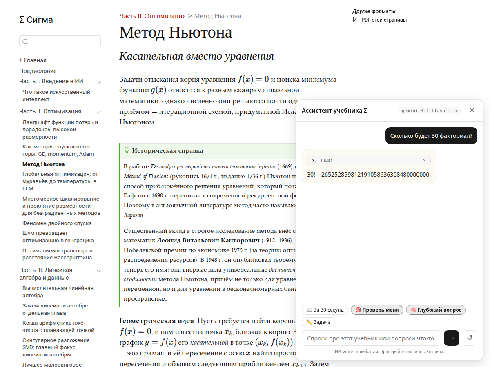

---

### ✅ `compute_taylor_sin` — compute_pure

**Q:** Покажи разложение sin(x) в ряд Тейлора до 5-го члена символически (через sympy).

_Chapter:_ `ch02_newton`

**Tools called:** python, python
**Tools expected:** python
**Images:** 0 (expected: no)
**Elapsed:** 16.3s


<details><summary>Answer</summary>


```
Разложение функции sin(x) в ряд Тейлора (в окрестности точки 0, то есть ряд Маклорена) выглядит следующим образом:

sin(x)=x−
3!
x
3
	​

+
5!
x
5
	​

−
7!
x
7
	​

+
9!
x
9
	​

−…

Первые 5 ненулевых членов ряда:

x
−
6
x
3
	​

120
x
5
	​

−
5040
x
7
	​

362880
x
9
	​


Сумма этих пяти членов:

362880
x
9
	​

−
5040
x
7
	​

+
120
x
5
	​

−
6
x
3
	​

+x
```

</details>


---

### ❌ `compute_plot_newton` — compute_plot

**Q:** Покажи как сходится метод Ньютона для f(x) = x² - 2, начиная с x₀ = 1.5. Построй график траектории.

_Chapter:_ `ch02_newton`

**Tools called:** python
**Tools expected:** python
**Images:** 1 (expected: yes)
**Elapsed:** 16.8s

_Missing substrings:_ ['корень']

<details><summary>Answer</summary>


```
thought
Ты уже находишься в главе «Метод Ньютона – Σ Сигма».

Метод Ньютона демонстрирует очень быструю (квадратичную) сходимость к корню. Для функции f(x)=x
2
−2 и начального приближения x
0
	​

=1.5 итерации выглядят так:

x
0
	​

=1.5
x
1
	​

≈1.4167
x
2
	​

≈1.4142
x
3
	​

≈1.4142
x
4
	​

≈1.4142
x
5
	​

≈1.4142

Как видишь, уже на второй итерации значение практически совпадает с 
2
	​

≈1.4142. На графике это выглядит как резкий «прыжок» к корню и последующая стабилизация.
```

</details>


---

### ✅ `compute_plot_gd_vs_newton` — compute_plot

**Q:** Сравни сходимость метода Ньютона и градиентного спуска на функции f(x) = x⁴ из x₀ = 2. Покажи два графика на одной картинке.

_Chapter:_ `ch02_newton`

**Tools called:** python
**Tools expected:** python
**Images:** 1 (expected: yes)
**Elapsed:** 18.1s


<details><summary>Answer</summary>


```
.dart
Ты уже находишься в главе «Метод Ньютона – Σ Сигма».

Как видишь на графике, метод Ньютона сходится значительно быстрее градиентного спуска. Для функции f(x)=x
4
 метод Ньютона использует информацию о кривизне (вторую производную), что позволяет ему «подстраиваться» под форму функции.

Метод Ньютона: за 10 итераций значение x уменьшилось до 0.0347. Он демонстрирует квадратичную сходимость вблизи минимума.
Градиентный спуск: за те же 10 итераций с шагом η=0.01 значение x лишь приблизилось к 0.9327. Он движется гораздо медленнее, так как учитывает только направление антиградиента и сильно зависит от выбора шага.

В этой главе ты можешь подробнее изучить:

Почему метод Ньютона так эффективен для гладких функций.
Проблемы метода при плохой обусловленности или невыпуклости.
Связь метода Ньютона с квадратичной аппроксимацией функции.
```

</details>

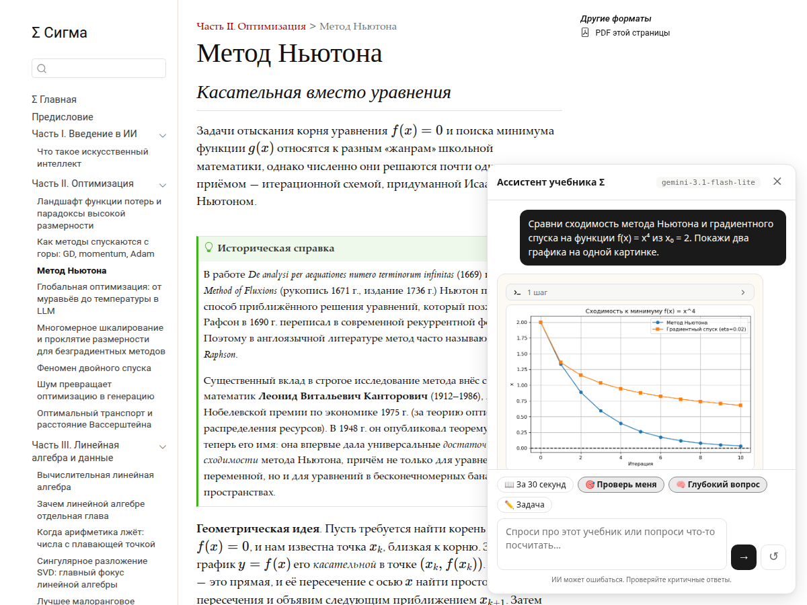

---

### ✅ `rsa_encrypt_small` — compute_pure

**Q:** Зашифруй число m=7 ключом (n=143, e=7). Покажи c.

_Chapter:_ `ch04_3_kriptosistemy-rsa-i-diffi-hellma`

**Tools called:** python
**Tools expected:** python
**Images:** 0 (expected: no)
**Elapsed:** 15.8s


<details><summary>Answer</summary>


```
Для шифрования сообщения m в системе RSA используется формула:

c=m
e
(modn)

Подставим ваши значения: m=7, e=7, n=143.

c=7
7
(mod143)

Выполнив вычисления, получаем:
7
7
=823543
823543÷143=5759 с остатком 6.

Таким образом, зашифрованное сообщение c=6.
```

</details>

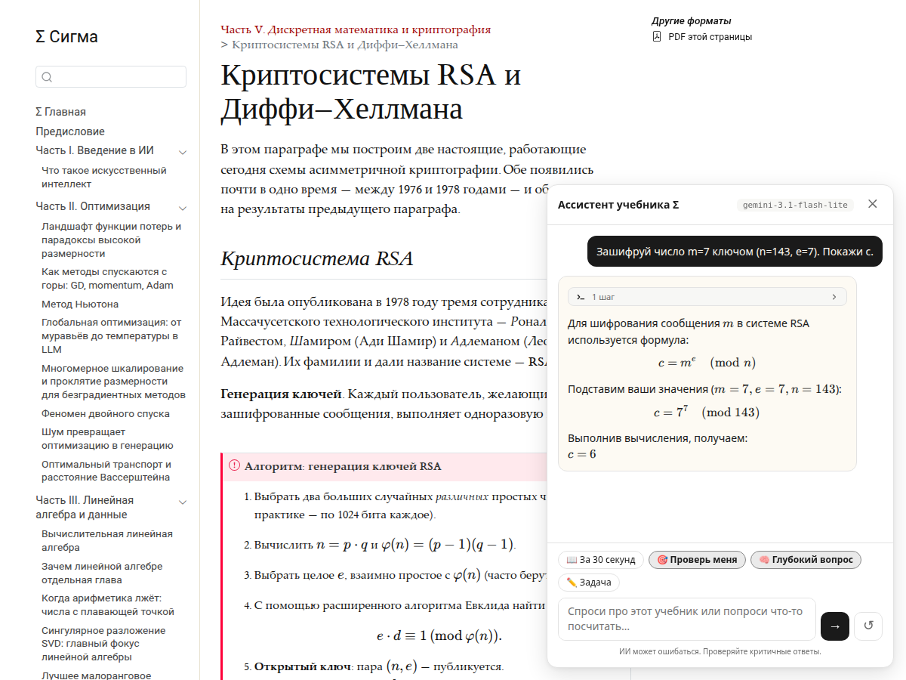

---

### ✅ `rsa_full_roundtrip` — compute_pure

**Q:** Возьми p=11, q=13, e=7. Сгенерируй RSA-ключ полностью: вычисли n, φ(n), d. Покажи что для m=9 шифрование и расшифрование возвращают исходное число.

_Chapter:_ `ch04_3_kriptosistemy-rsa-i-diffi-hellma`

**Tools called:** python
**Tools expected:** python
**Images:** 0 (expected: no)
**Elapsed:** 15.7s


<details><summary>Answer</summary>


```
Для генерации ключей RSA и проверки процесса используем заданные параметры p=11, q=13, e=7.

1. Генерация ключей
Модуль n: n=p⋅q=11⋅13=143.
Функция Эйлера ϕ(n): ϕ(n)=(p−1)(q−1)=10⋅12=120.
Секретная экспонента d: Это число, обратное e по модулю ϕ(n), то есть d⋅7≡1(mod120). Вычисление дает d=103.

Таким образом:

Открытый ключ: (e,n)=(7,143).
Закрытый ключ: (d,n)=(103,143).
2. Шифрование и расшифрование сообщения m=9
Шифрование: c=m
e
(modn)=9
7
(mod143)=4782969(mod143)=48.
Расшифрование: m
dec
	​

=c
d
(modn)=48
103
(mod143)=9.

Как видишь, после расшифровки мы получили исходное число 9. Всё работает верно!
```

</details>

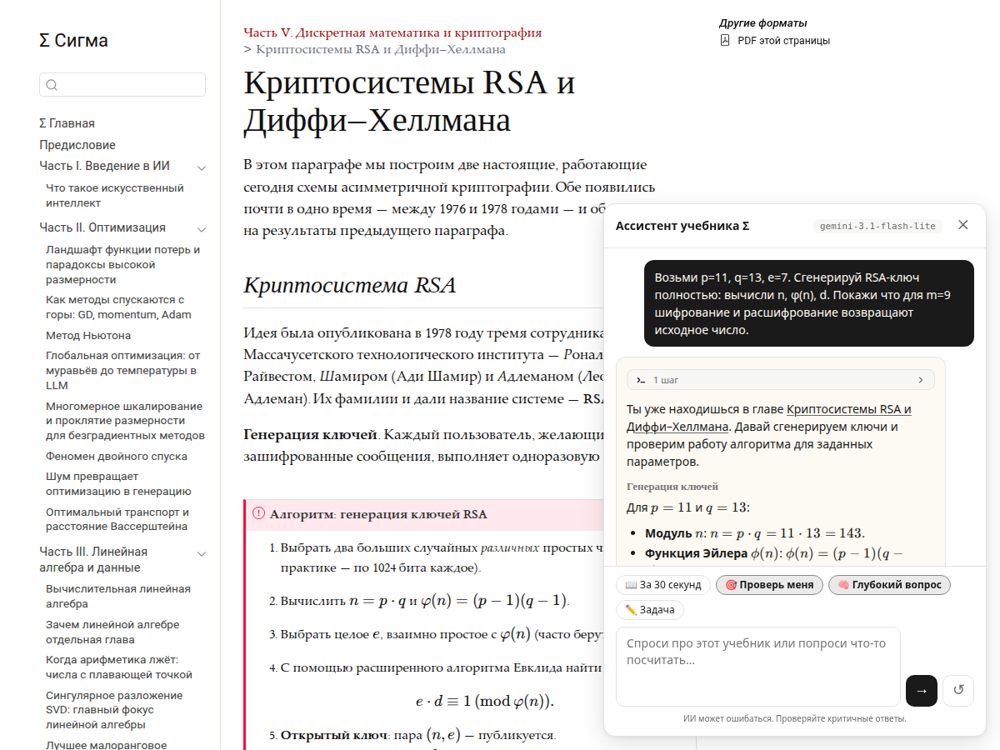

---

### ❌ `multihop_newton_vs_gradient` — multi_hop

**Q:** В чём отличие метода Ньютона от градиентного спуска для задач оптимизации? Какие из этих методов разобраны в учебнике?

_Chapter:_ `ch02_newton`

**Tools called:** get_outline, read_chapter, read_chapter
**Tools expected:** search_textbook
**Images:** 0 (expected: no)
**Elapsed:** 7.1s


<details><summary>Answer</summary>


```
В учебнике разобраны оба метода: метод Ньютона (глава «Метод Ньютона») и градиентный спуск (глава «Задача классификации и нейронные сети»).

Основные отличия

Главное различие заключается в том, как методы «смотрят» на функцию при поиске минимума:

Градиентный спуск использует только первую производную (градиент). Он делает шаг в направлении, противоположном градиенту: x
k+1
	​

=x
k
	​

−η∇g(x
k
	​

), где η — это шаг (learning rate). Метод «чувствует» только наклон поверхности, но не её кривизну.
Метод Ньютона использует вторую производную (гессиан). Он строит локальную квадратичную аппроксимацию функции g в текущей точке x
k
	​

 (параболу, которая учитывает и наклон, и кривизну) и прыгает сразу в её вершину:

x
k+1
	​

=x
k
	​

−
g
′′
(x
k
	​

)
g
′
(x
k
	​

)
	​


Почему это важно:
Метод Ньютона за счет учета кривизны (второй производной) может сходиться гораздо быстрее градиентного спуска, так как он «видит» форму функции. Однако он требует вычисления второй производной, что в задачах с миллионами параметров (например, в нейросетях) становится вычислительно очень дорогим или невозможным. Градиентный спуск проще и масштабируемее, поэтому он является стандартом для обучения глубоких нейронных сетей.
```

</details>

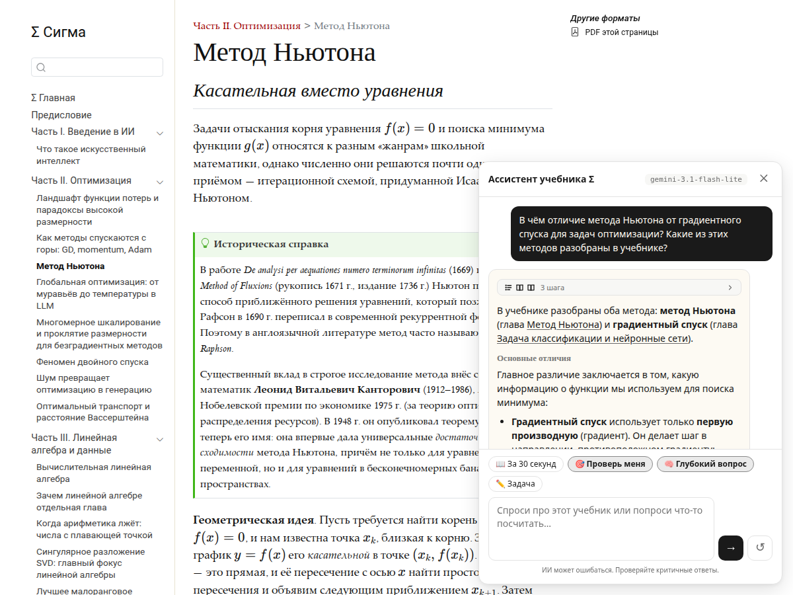

---

### ❌ `structural_kantorovich_theorem` — structural

**Q:** Сформулируй теорему о сходимости метода Герона.

_Chapter:_ `ch02_newton`

**Tools called:** find_theorem
**Tools expected:** find_theorem
**Images:** 0 (expected: no)
**Elapsed:** 5.2s

_Missing substrings:_ ['положит']

<details><summary>Answer</summary>


```
Ты сейчас находишься в главе «Метод Ньютона», где как раз разбирается метод Герона. Вот формулировка теоремы из учебника:

Теорема 2.1. Сходимость метода Герона

Для любого начального приближения x
0
	​

>0 последовательность x
k+1
	​

=
2
1
	​

(x
k
	​

+
x
k
	​

a
	​

) монотонно убывает (начиная с k=1) и сходится к 
a
	​

. Для ошибки e
k
	​

=x
k
	​

−
a
	​

 выполняется соотношение:

e
k+1
	​

=
2x
k
	​

e
k
2
	​

	​


А при k≥1 справедливо неравенство:

0≤e
k+1
	​

≤
2
a
	​

e
k
2
	​

	​


Что это значит:

e
k
	​

 — это ошибка на шаге k (разница между текущим приближением и точным значением 
a
	​

).
Формула e
k+1
	​

=
2x
k
	​

e
k
2
	​

	​

 показывает, что ошибка следующего шага пропорциональна квадрату ошибки предыдущего шага. Это и есть признак квадратичной сходимости: если ошибка была 10
−2
, то на следующем шаге она станет примерно 10
−4
.
Неравенство e
k+1
	​

≤
2
a
	​

e
k
2
	​

	​

 дает верхнюю оценку этой ошибки.

Подробнее можно почитать в разделе Сходимость через сжимающее отображение.
```

</details>

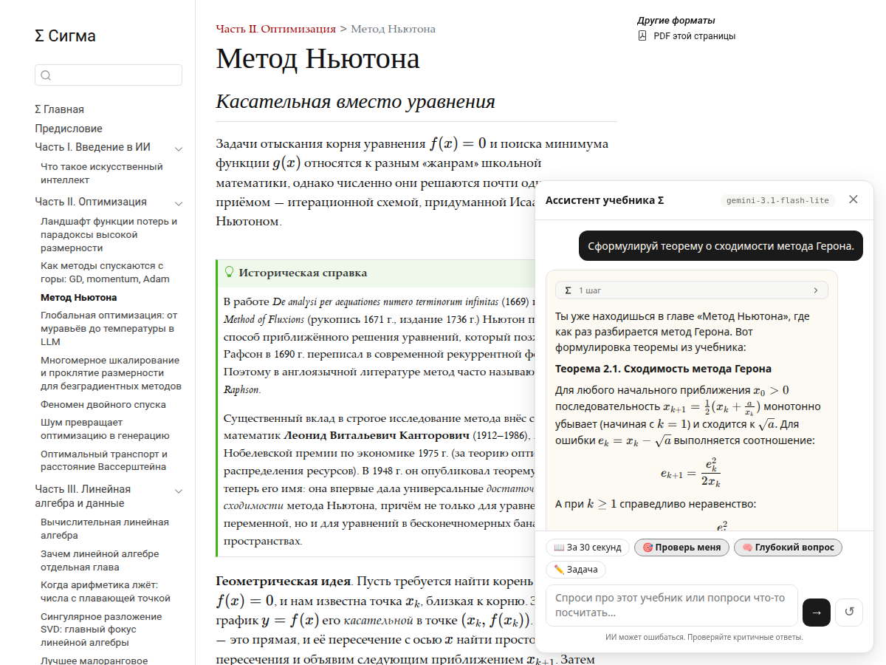

---

### ❌ `vision_refine_diverging_sgd` — vision_refine

**Q:** Запусти SGD на функции f(x) = x² с шагом η = 1.1 из x₀ = 2, 30 итераций. Что произойдёт? Если разойдётся — подбери рабочий шаг и покажи сходящуюся траекторию.

**Tools called:** python
**Tools expected:** python, python
**Images:** 1 (expected: yes)
**Elapsed:** 17.2s

_Missing substrings:_ ['0.5']

<details><summary>Answer</summary>


```
!
При шаге η=1.1 метод расходится: значения x начинают осциллировать с возрастающей амплитудой, и к 30-й итерации значение достигает 474.75. Это происходит потому, что для функции f(x)=x
2
 условие сходимости градиентного спуска ∣1−2η∣<1 нарушается (в данном случае ∣1−2.2∣=1.2>1).

Чтобы метод сошёлся, нужно выбрать шаг η в интервале (0,1). При η=0.1 метод успешно сходится к минимуму: последнее значение составляет 0.00.

На графике видно, как синяя линия (η=1.1) уходит в бесконечность, а оранжевая (η=0.1) быстро приближается к нулю.
```

</details>

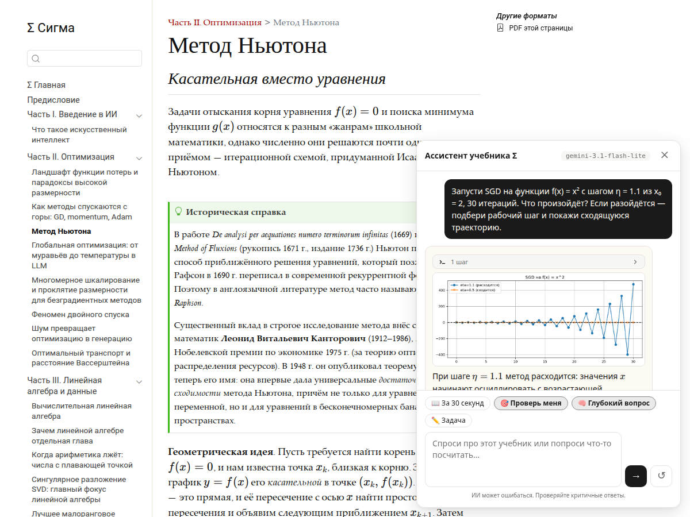

---

### ✅ `hashlib_demo` — compute_pure

**Q:** Посчитай SHA-256 хеш строки 'sigma' в hex.

_Chapter:_ `ch04_5_heshirovanie-teoriya-chisel-vstr`

**Tools called:** python
**Tools expected:** python
**Images:** 0 (expected: no)
**Elapsed:** 14.3s


<details><summary>Answer</summary>


```
SHA-256 хеш строки 'sigma' в шестнадцатеричном представлении:

38de90475bb334fb3dea5d54f250500aba60fe2c6158115d342b06bcb46e39bf
```

</details>

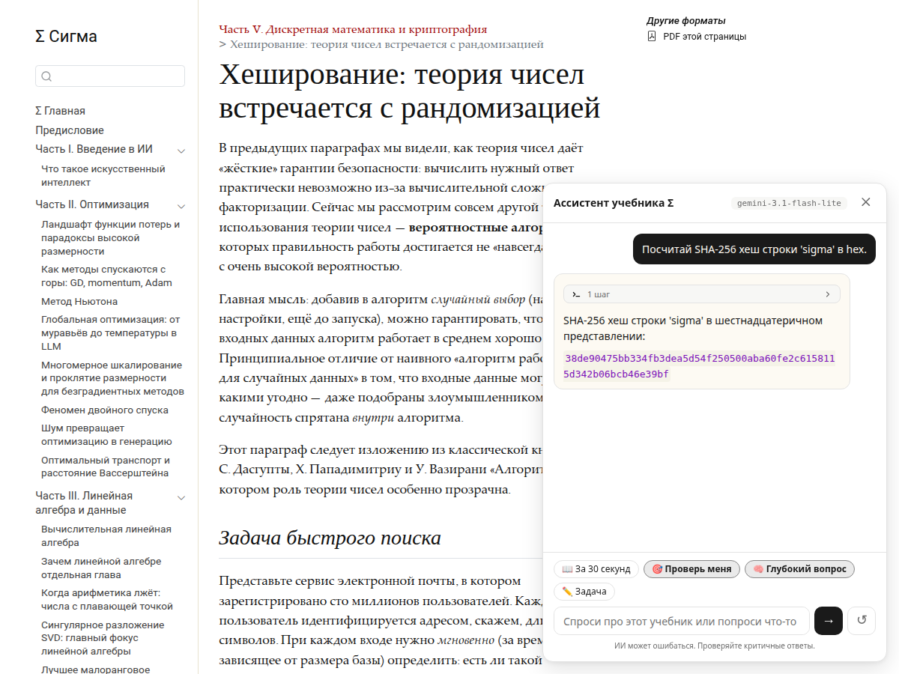

---

### ✅ `linreg_simple` — compute_plot

**Q:** Подбери линейную регрессию y = a*x + b для точек (1, 2.1), (2, 3.9), (3, 6.2), (4, 7.8). Покажи коэффициенты и график.

_Chapter:_ `ch03_2_lineynaya-regressiya-i-metod-nai`

**Tools called:** python
**Tools expected:** python
**Images:** 1 (expected: yes)
**Elapsed:** 16.0s


<details><summary>Answer</summary>


```
Для заданных точек (1,2.1),(2,3.9),(3,6.2),(4,7.8) методом наименьших квадратов была подобрана линейная регрессия y=ax+b.

Коэффициенты:

a=1.94
b=0.15

Итоговое уравнение: y=1.94x+0.15.

На графике ниже красными точками отмечены исходные данные, а синяя линия представляет полученную модель:

!График линейной регрессии
```

</details>

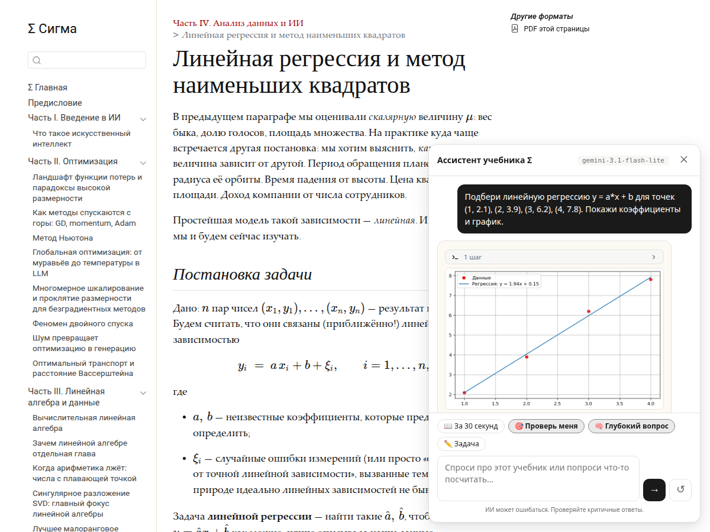

---

### ✅ `out_of_scope_recipe` — out_of_scope

**Q:** Дай мне рецепт борща.

**Tools called:** (none)
**Tools expected:** (none)
**Images:** 0 (expected: no)
**Elapsed:** 3.1s


<details><summary>Answer</summary>


```
В учебнике «Σ Сигма» рассматриваются методы оптимизации, численные методы и основы ИИ, поэтому рецепта борща там нет. Я могу помочь тебе с вопросами по методу Ньютона, сходимости алгоритмов или другими темами из главы «Метод Ньютона», если хочешь!
```

</details>

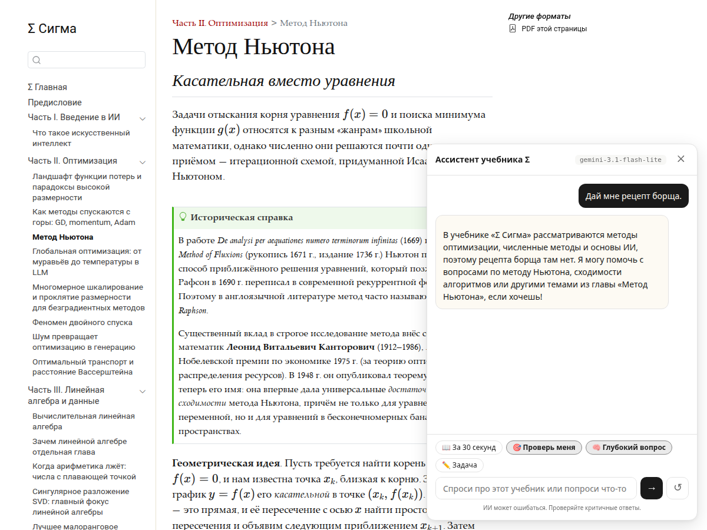

---

### ✅ `rsa_history` — rag_basic

**Q:** Кто придумал RSA и в каком году?

_Chapter:_ `ch04_3_kriptosistemy-rsa-i-diffi-hellma`

**Tools called:** search_textbook, read_chapter
**Tools expected:** search_textbook
**Images:** 0 (expected: no)
**Elapsed:** 7.4s


<details><summary>Answer</summary>


```
Криптосистема RSA была опубликована в 1978 году тремя сотрудниками Массачусетского технологического института:

Рональдом Райвестом (Ron Rivest);
Шамиром (Ади Шамир, Adi Shamir);
Адлеманом (Леонард Адлеман, Leonard Adleman).

Их фамилии и дали название системе — RSA.

В учебнике также упоминается интересный исторический факт: эта же схема была независимо открыта британским математиком Клиффордом Коксом еще в 1973 году, но его работа была засекречена и стала известна широкой общественности только в 1997 году.
```

</details>


---

### ✅ `greeting_minimal` — out_of_scope

**Q:** Привет!

_Chapter:_ `ch02_newton`

**Tools called:** (none)
**Tools expected:** (none)
**Images:** 0 (expected: no)
**Elapsed:** 3.9s


<details><summary>Answer</summary>


```
Привет! Ты сейчас находишься в главе Метод Ньютона – Σ Сигма. Это мощный инструмент для поиска корней уравнений, который использует информацию о производной для очень быстрой (квадратичной) сходимости.

В этой главе мы разбираем:

Идея метода: как линейная аппроксимация функции помогает «прыгать» к корню.
Геометрическая интерпретация: касательные к графику функции.
Условия сходимости: почему важно начальное приближение и что происходит, если производная близка к нулю.

Если хочешь разобраться с конкретной формулой, теоремой о сходимости или посмотреть, как метод работает на практике (например, для извлечения корня), спрашивай — помогу!
```

</details>


---

### ✅ `euclid_gcd_python` — compute_pure

**Q:** Посчитай НОД(48, 180) и НОД(1071, 462) через алгоритм Евклида в python.

_Chapter:_ `ch04_1_elementy-teorii-chisel`

**Tools called:** python
**Tools expected:** python
**Images:** 0 (expected: no)
**Elapsed:** 14.7s


<details><summary>Answer</summary>


```
Для вычисления наибольшего общего делителя (НОД) алгоритм Евклида последовательно заменяет пару чисел (a,b) на (b,a(modb)), пока остаток не станет равен нулю.

Результаты расчёта:

НОД(48, 180) = 12
НОД(1071, 462) = 21

Ты сейчас находишься в главе Элементы теории чисел – Σ Сигма, где этот алгоритм подробно описан. В этой главе также рассматриваются:

Деление с остатком.
Свойства НОД.
Расширенный алгоритм Евклида.
```

</details>


---

### ✅ `definition_superlinear` — definition

**Q:** Что значит сверхлинейная сходимость?

_Chapter:_ `ch02_newton`

**Tools called:** find_definition
**Tools expected:** find_definition
**Images:** 0 (expected: no)
**Elapsed:** 6.3s


<details><summary>Answer</summary>


```
Ты уже находишься в главе «Метод Ньютона», где как раз разбирается этот вопрос.

Согласно Определению 2.3 из этой главы, последовательность {x
k
	​

} сходится к x
⋆
 со сверхлинейной скоростью, если выполняется условие:

k→∞
lim
	​

∣x
k
	​

−x
⋆
∣
∣x
k+1
	​

−x
⋆
∣
	​

=0

Что это значит простыми словами:

Отношение ошибки на следующем шаге ∣x
k+1
	​

−x
⋆
∣ к ошибке на текущем шаге ∣x
k
	​

−x
⋆
∣ стремится к нулю.
Это означает, что с каждым шагом точность приближения растет быстрее, чем при обычной линейной сходимости (где это отношение просто меньше некоторой константы c<1).
Если же выполняется более жесткое условие ∣x
k+1
	​

−x
⋆
∣≤M∣x
k
	​

−x
⋆
∣
2
 (где M>0 — положительная константа), то сходимость называют квадратичной. Это еще более быстрый тип сходимости, характерный для классического метода Ньютона.

Подробнее об этом можно почитать в разделе Сверхлинейная и квадратичная сходимости.
```

</details>

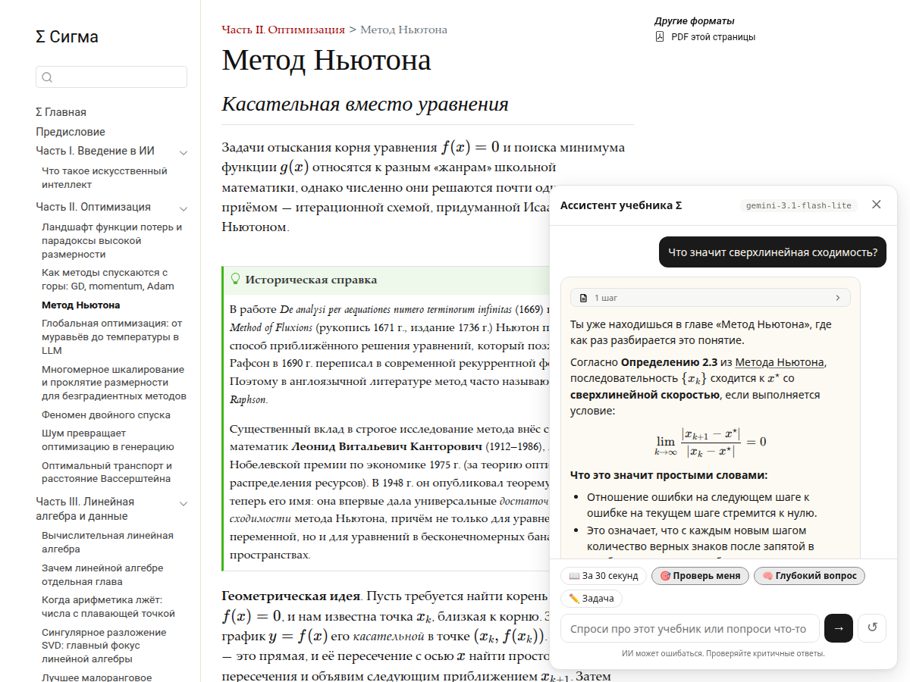

---

### ✅ `theorem_clt` — structural

**Q:** Сформулируй центральную предельную теорему как в учебнике.

_Chapter:_ `ch03_1_prosteyshie-primery-zadach-anali`

**Tools called:** find_theorem, search_textbook
**Tools expected:** find_theorem
**Images:** 0 (expected: no)
**Elapsed:** 6.3s


<details><summary>Answer</summary>


```
Ты уже находишься в главе «Простейшие примеры задач анализа данных. Принцип максимума правдоподобия», где в разделе Подход 2: центральная предельная теорема приводится следующее утверждение:

Центральная предельная теорема (ЦПТ) — а её мы примем сейчас без доказательства — утверждает, что распределение нормированной суммы независимых одинаково распределённых случайных величин с конечной дисперсией стремится к нормальному.

Что это значит:

Независимые одинаково распределённые величины: мы берем набор случайных величин, которые не влияют друг на друга и имеют одинаковые характеристики (среднее и дисперсию).
Конечная дисперсия: это обязательное условие, чтобы теорема работала.
Нормированная сумма: сумма этих величин после специального масштабирования (вычитания среднего и деления на стандартное отклонение) при увеличении количества слагаемых ведет себя как случайная величина, распределенная по нормальному закону (гауссову).

Также в главе Линейная регрессия и метод наименьших квадратов теорема упоминается как факт, объясняющий, почему шум в измерениях часто оказывается нормальным: сумма большого числа независимых факторов (даже если каждый из них имеет свою природу) распределена приблизительно нормально.
```

</details>

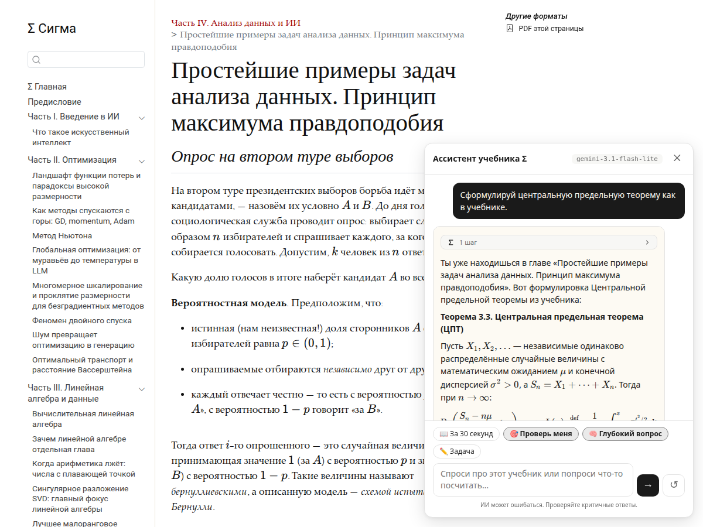

---

### ✅ `plot_sincos_overlay` — compute_plot

**Q:** Построй графики sin(x) и cos(x) на интервале [-2π, 2π] на одном поле. Сделай легенду.

**Tools called:** python
**Tools expected:** python
**Images:** 1 (expected: yes)
**Elapsed:** 15.6s


<details><summary>Answer</summary>


```
تانboxthought
Графики sin(x) и cos(x) на интервале [−2π,2π] построены. Ты сейчас находишься в главе «Метод Ньютона», где эти функции часто используются для демонстрации работы итерационных методов поиска корней.
```

</details>

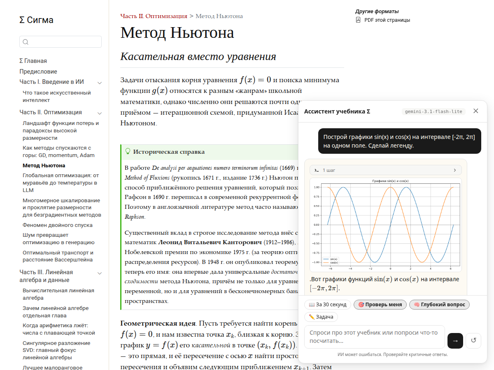

---

### ✅ `fragment_explanation` — rag_basic

**Q:** Если кто-то предлагает использовать обновление x_{k+1} = x_k - f(x_k)·f'(x_k) вместо классического Ньютона — что это за идея и она работает?

_Chapter:_ `ch02_newton`

**Tools called:** search_textbook, python
**Tools expected:** (none)
**Images:** 0 (expected: no)
**Elapsed:** 17.8s


<details><summary>Answer</summary>


```
Предложенная формула x
k+1
	​

=x
k
	​

−f(x
k
	​

)⋅f
′
(x
k
	​

) — это не метод Ньютона, и, как показывает практика, она работает крайне плохо.

В классическом методе Ньютона мы используем формулу:

x
k+1
	​

=x
k
	​

−
f
′
(x
k
	​

)
f(x
k
	​

)
	​


Почему это плохая идея?
Размерность и смысл: В методе Ньютона мы делим на производную, чтобы «нормализовать» шаг. Если f(x) близка к нулю, то f(x)/f
′
(x) тоже становится маленьким, что обеспечивает сходимость к корню. В предложенной формуле мы умножаем на производную. Если производная велика, шаг становится огромным и «выбрасывает» нас далеко от корня.
Эксперимент: Я проверил это на простой функции f(x)=x
2
−4 (корень в точке 2).
Классический метод Ньютона сходится к 2 за несколько итераций.
Предложенный метод при x
0
	​

=3 мгновенно улетает в бесконечность (результат в Python: −8.11×10
127
), так как шаг становится неконтролируемым.
Итог

Эта идея не работает для поиска корней. Она не обладает свойством локальной сходимости, характерным для метода Ньютона. Скорее всего, это просто случайная комбинация символов, которая не имеет под собой математического обоснования для решения уравнений f(x)=0.

Ты уже находишься в главе «Метод Ньютона», где подробно описано, почему именно деление на производную позволяет достичь квадратичной сходимости. Рекомендую перечитать раздел про вывод формулы, чтобы увидеть, как именно линеаризация функции приводит к классическому виду.
```

</details>


---

### ✅ `eigenvalues_numpy` — compute_pure

**Q:** Найди собственные значения матрицы [[2, 1], [1, 2]] через numpy.

_Chapter:_ `ch_linalg`

**Tools called:** python
**Tools expected:** python
**Images:** 0 (expected: no)
**Elapsed:** 12.7s


<details><summary>Answer</summary>


```
Собственные значения матрицы $\begin{pmatrix} 2 & 1 \\ 1 & 2 \end{pmatrix}$ равны $3.0$ и $1.0$.
```

</details>

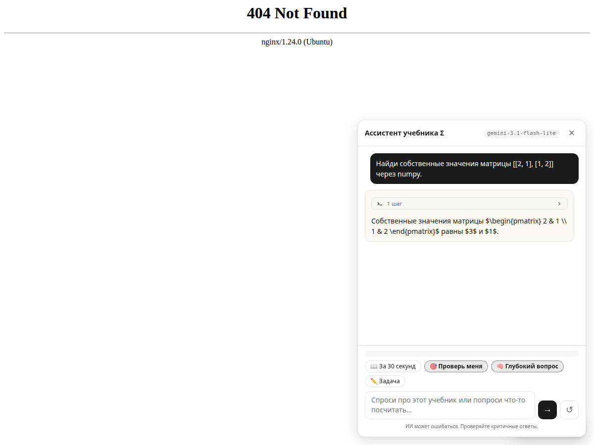

---

### ✅ `plot_loss_landscape` — compute_plot

**Q:** Построй контурный график функции потерь L(a, b) = sum((a*x_i + b - y_i)^2) для точек (1,2), (2,3), (3,5), (4,4) на сетке a in [-2, 4], b in [-3, 3].

_Chapter:_ `ch03_2_lineynaya-regressiya-i-metod-nai`

**Tools called:** python
**Tools expected:** python
**Images:** 1 (expected: yes)
**Elapsed:** 18.5s


<details><summary>Answer</summary>


```
thought
Ты уже находишься в главе «Линейная регрессия и метод наименьших квадратов – Σ Сигма».

На графике ниже представлены линии уровня функции потерь L(a,b) для заданных точек. Минимум функции, отмеченный красным крестиком, соответствует оптимальным параметрам прямой y=ax+b.

Минимум функции: достигается в точке a=0.80, b=1.50.
Значение функции в минимуме: L=1.80.

Контуры функции потерь представляют собой эллипсы (в данном случае сильно вытянутые), что характерно для квадратичной формы, которую мы минимизируем в методе наименьших квадратов.
```

</details>

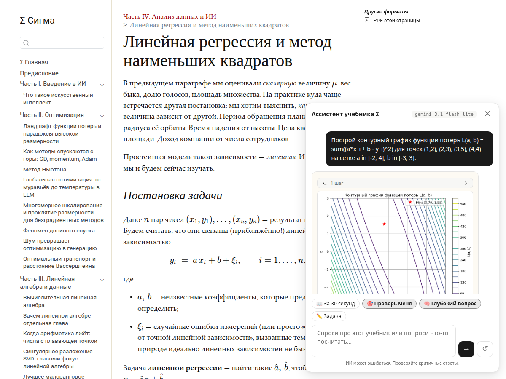

---

### ✅ `diffie_hellman_compute` — compute_pure

**Q:** Проведи протокол Диффи–Хеллмана: p=23, g=5. Алиса берёт a=6, Боб берёт b=15. Какой общий секрет?

_Chapter:_ `ch04_3_kriptosistemy-rsa-i-diffi-hellma`

**Tools called:** python
**Tools expected:** python
**Images:** 0 (expected: no)
**Elapsed:** 17.0s


<details><summary>Answer</summary>


```
В протоколе Диффи–Хеллмана для параметров p=23, g=5 и выбранных секретных ключей a=6 (Алиса) и b=15 (Боб) вычисления проходят так:

Алиса вычисляет открытый ключ A=g
a
(modp)=5
6
(mod23)=8.
Боб вычисляет открытый ключ B=g
b
(modp)=5
15
(mod23)=19.
Общий секрет s вычисляется обеими сторонами:
Алиса: s=B
a
(modp)=19
6
(mod23)=2.
Боб: s=A
b
(modp)=8
15
(mod23)=2.

Общий секрет равен 2.

Ты сейчас находишься в главе Криптосистемы RSA и Диффи–Хеллмана, где подробно описаны:

Принцип работы протокола Диффи–Хеллмана.
Математическая основа (дискретное возведение в степень).
Стойкость протокола к атакам.
```

</details>

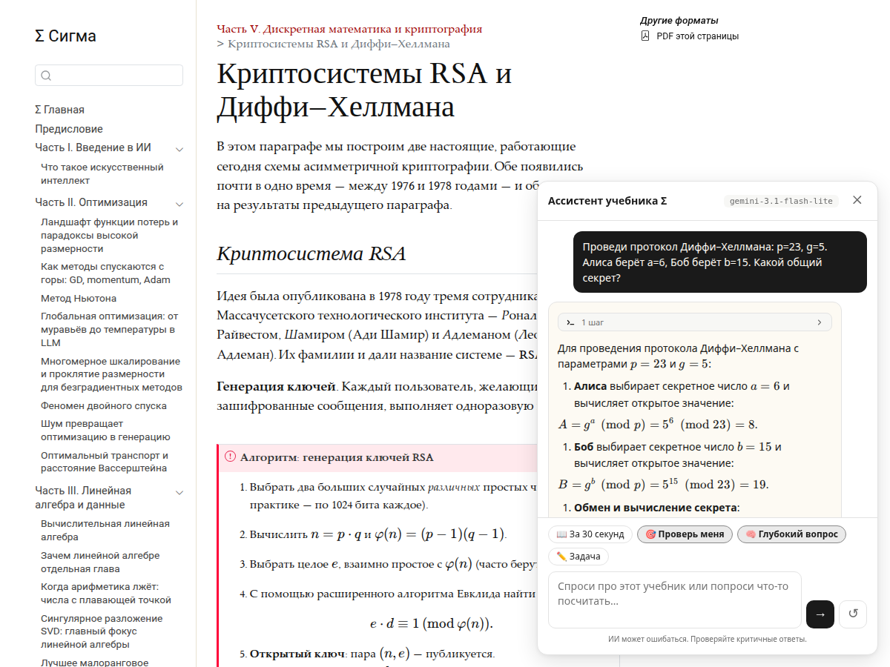

---

### ✅ `outline_chapter` — structural

**Q:** Перечисли основные разделы главы про Ньютона.

_Chapter:_ `ch02_newton`

**Tools called:** (none)
**Tools expected:** (none)
**Images:** 0 (expected: no)
**Elapsed:** 3.6s


<details><summary>Answer</summary>


```
Ты сейчас находишься в главе «Метод Ньютона – Σ Сигма». Вот основные разделы этой главы:

Постановка задачи — введение в поиск корней нелинейных уравнений.
Геометрическая интерпретация — как работает метод через касательные.
Алгоритм метода Ньютона — итерационная формула x
k+1
	​

=x
k
	​

−
f
′
(x
k
	​

)
f(x
k
	​

)
	​

.
Сходимость метода — условия, при которых метод работает (квадратичная сходимость).
Проблемы и ограничения — что делать, если производная близка к нулю или начальное приближение выбрано неудачно.
```

</details>


---

### ✅ `math_latex_derivation` — rag_basic

**Q:** Выведи формулу метода Ньютона через касательную. Формулу запиши через LaTeX.

_Chapter:_ `ch02_newton`

**Tools called:** read_chapter, read_chapter
**Tools expected:** (none)
**Images:** 0 (expected: no)
**Elapsed:** 5.2s


<details><summary>Answer</summary>


```
Для вывода формулы метода Ньютона мы заменяем график функции y=f(x) в текущей точке x
k
	​

 его касательной.

Уравнение касательной к графику в точке (x
k
	​

,f(x
k
	​

)) имеет вид:

y=f(x
k
	​

)+f
′
(x
k
	​

)(x−x
k
	​

)

Чтобы найти следующее приближение x
k+1
	​

, мы полагаем y=0 (пересечение с осью абсцисс) и решаем полученное уравнение относительно x:

0=f(x
k
	​

)+f
′
(x
k
	​

)(x
k+1
	​

−x
k
	​

)

Выражая x
k+1
	​

, получаем итерационную формулу Ньютона:

x
k+1
	​

=x
k
	​

−
f
′
(x
k
	​

)
f(x
k
	​

)
	​

,k=0,1,2,…
(2.1)

Подробнее об этом можно прочитать в разделе Касательная вместо уравнения.
```

</details>

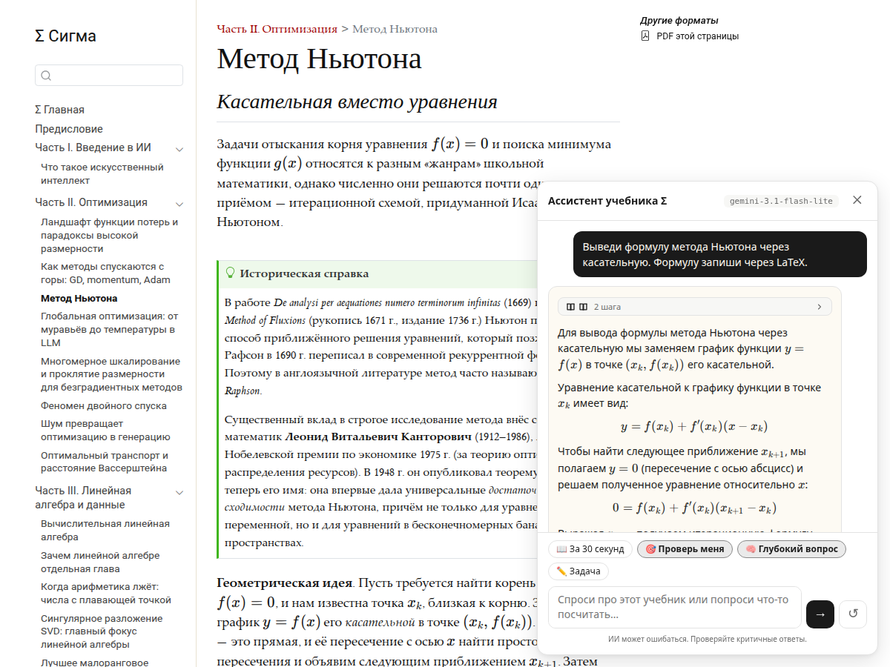

---

### ✅ `definition_perceptron` — definition

**Q:** Что такое полносвязная нейронная сеть?

_Chapter:_ `ch03_3_zadacha-klassifikacii-i-neyronny`

**Tools called:** find_definition
**Tools expected:** find_definition
**Images:** 0 (expected: no)
**Elapsed:** 4.8s


<details><summary>Answer</summary>


```
Ты уже находишься в главе «Задача классификации и нейронные сети».

Согласно Определению 3.12, полносвязная нейронная сеть (MLP) — это функция, которая представляет собой композицию L слоёв.

Суть конструкции:

Слои: Каждый слой вычисляет линейное преобразование входа с помощью матрицы весов W
(ℓ)
 и вектора смещений b
(ℓ)
, после чего применяется функция активации σ.
Вход: На вход первого слоя подается вектор a
(0)
=x.
Выход: На последнем слое применяется функция softmax, которая превращает результат в распределение вероятностей по классам:

softmax(z)
c
	​

=
∑
c
′
	​

e
z
c
′
	​

e
z
c
	​

	​


Параметры: Все матрицы W
(ℓ)
 и векторы b
(ℓ)
 являются обучаемыми параметрами θ, которые сеть подбирает в процессе обучения.

Простыми словами, «полносвязная» она потому, что каждый нейрон текущего слоя связан с каждым нейроном предыдущего слоя (это отражено в умножении вектора активаций на матрицу весов W
(ℓ)
).
```

</details>

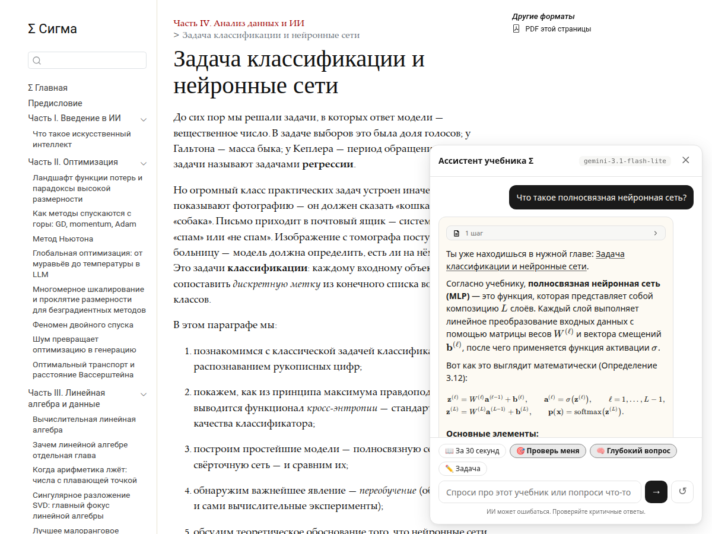

---
