# Sigma Assistant — Eval Report

_Run: 2026-06-10 20:41 MSK · cases: 29_

**Overall: 26/29 pass (90%)**

## Per category

| Category | Pass | Total |
|---|---:|---:|
| `compute_plot` | 4 | 5 |
| `compute_pure` | 8 | 8 |
| `definition` | 3 | 3 |
| `multi_hop` | 1 | 1 |
| `out_of_scope` | 2 | 3 |
| `rag_basic` | 5 | 5 |
| `structural` | 3 | 3 |
| `vision_refine` | 0 | 1 |

## Cases

### ✅ `newton_kantorovich_history` — rag_basic

**Q:** Когда Канторович получил Нобелевскую премию и за что?

_Chapter:_ `ch02_newton`

**Tools called:** search_textbook
**Tools expected:** search_textbook
**Images:** 0 (expected: no)
**Elapsed:** 7.3s


<details><summary>Answer</summary>


```
Леонид Витальевич Канторович получил Нобелевскую премию по экономике в **1975 году**. 

Премия была присуждена ему **«за вклад в теорию оптимального распределения ресурсов»**. 

Подробнее о его вкладе в математику и методах оптимизации можно прочитать в разделе [Касательная вместо уравнения](/ch02_newton.html#sec:newton) главы «Метод Ньютона», которую ты сейчас изучаешь. Именно Канторович в 1948 году доказал знаменитую теорему, которая задала строгие достаточные условия сходимости метода Ньютона.
```

</details>


---

### ✅ `newton_formula_recall` — rag_basic

**Q:** Объясни откуда берётся эта формула — что это за метод и какая геометрическая идея?

_Chapter:_ `ch02_newton`

**Tools called:** read_chapter, python
**Tools expected:** (none)
**Images:** 1 (expected: no)
**Elapsed:** 31.3s


<details><summary>Answer</summary>


```
назад к диалогу
Формула, о которой ты спрашиваешь, — это знаменитый **метод Ньютона** (или метод касательных), предназначенный для приближённого решения уравнений вида $f(x) = 0$.

### Геометрическая идея

Представь, что у нас есть сложная кривая $y = f(x)$, и мы хотим найти точку, где она пересекает горизонтальную ось $x$ (то есть корень уравнения). Напрямую решить такое уравнение сложно. 

Тогда мы поступаем так:
1. Выбираем стартовую точку $x_0$, которая находится где-то недалеко от предполагаемого корня.
2. Находим точку на графике $A(x_0, f(x_0))$ и проводим через неё **касательную прямую** к графику функции.
3. Касательная — это простая прямая линия. Найти точку её пересечения с осью $x$ очень легко. Обозначим эту точку пересечения как $x_1$.
4. Точка $x_1$ обычно оказывается гораздо ближе к настоящему корню, чем $x_0$. Теперь мы повторяем этот процесс: проводим касательную в точке $(x_1, f(x_1))$, находим новое пересечение $x_2$ и так далее.

### Вывод формулы

Уравнение касательной к графику функции $y = f(x)$ в точке $x_k$ записывается по стандартной школьной формуле:
$$y = f(x_k) + f'(x_k)(x - x_k)$$

Мы ищем точку пересечения этой касательной с осью абсцисс, то есть там, где $y = 0$. Подставим $y = 0$ и решим уравнение относительно $x$ (которое станет нашим следующим приближением $x_{k+1}$):
$$0 = f(x_k) + f'(x_k)(x_{k+1} - x_k)$$

Перенесём слагаемые:
$$-f(x_k) = f'(x_k)(x_{k+1} - x_k)$$

Разделим на производную $f'(x_k)$ (предполагая, что она не равна нулю):
$$x_
…[truncated]
```

</details>

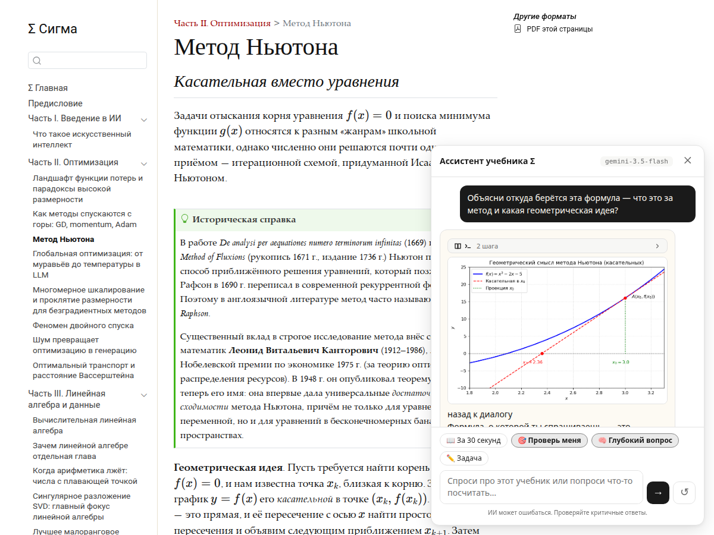

---

### ✅ `definition_strong_convex` — definition

**Q:** Что такое сильно выпуклая функция?

_Chapter:_ `ch02_newton`

**Tools called:** find_definition
**Tools expected:** find_definition
**Images:** 0 (expected: no)
**Elapsed:** 8.9s


<details><summary>Answer</summary>


```
В главе [Метод Ньютона](/ch02_newton.html#ssec:thm-superlinear), которую ты сейчас читаешь, даётся следующее определение:

> **Определение 2.4. Сильно выпуклая функция**
> 
> Функция $g\colon\mathbb{R}\to\mathbb{R}$ называется **сильно выпуклой** с константой $\mu>0$, если $g\in C^{2}$ и $g''(x)\geq\mu$ для всех $x$.

**Что это означает простыми словами:**
* Функция $g$ должна быть дважды непрерывно дифференцируемой (обозначается как $g\in C^{2}$). Это значит, что у неё есть первая и вторая производные, и вторая производная меняется плавно, без резких скачков.
* Её вторая производная $g''(x)$ в любой точке должна быть не меньше некоторого фиксированного положительного числа $\mu$ (то есть $g''(x)\geq\mu > 0$). Это свойство называют **отделённостью второй производной от нуля**. График такой функции «зажат» снизу параболой и не может становиться слишком плоским.

Благодаря этому сильная выпуклость гарантирует, что у функции обязательно существует и притом ровно одна точка минимума.
```

</details>

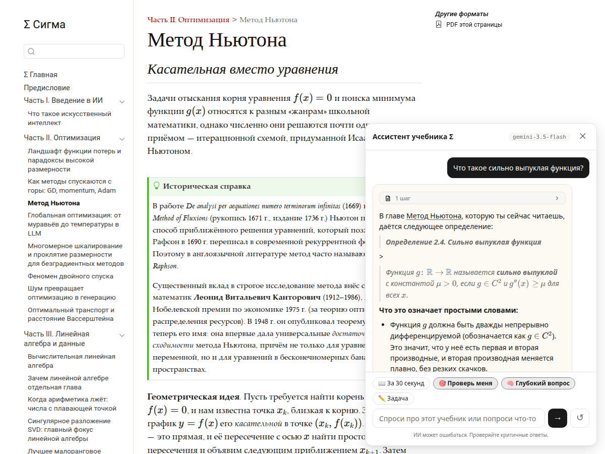

---

### ✅ `compute_factorial` — compute_pure

**Q:** Сколько будет 30 факториал?

**Tools called:** python
**Tools expected:** python
**Images:** 0 (expected: no)
**Elapsed:** 18.1s


<details><summary>Answer</summary>


```
30 факториал ($30!$) равен:

$$30! = 265\,252\,859\,812\,191\,058\,636\,308\,480\,000\,000$$

Или в научном формате: $\approx 2.65 \times 10^{32}$.
```

</details>

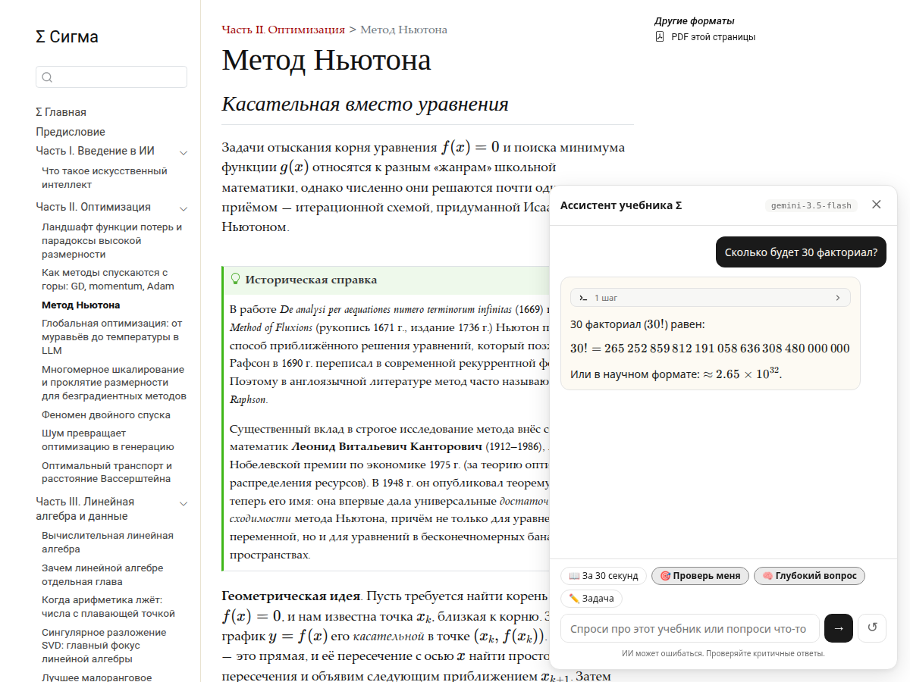

---

### ✅ `compute_taylor_sin` — compute_pure

**Q:** Покажи разложение sin(x) в ряд Тейлора до 5-го члена символически (через sympy).

_Chapter:_ `ch02_newton`

**Tools called:** python
**Tools expected:** python
**Images:** 0 (expected: no)
**Elapsed:** 24.7s


<details><summary>Answer</summary>


```
Разложение функции $\sin(x)$ в ряд Тейлора (в окрестности нуля, то есть в ряд Маклорена) можно понимать двояко: либо как разложение до степени $x^5$, либо как первые 5 ненулевых членов ряда. 

Вот оба варианта, полученные символически с помощью библиотеки `sympy`:

### 1. Разложение до степени $x^5$ (3 ненулевых члена)
Поскольку у синуса все четные степени обнуляются, разложение до $x^5$ включительно выглядит так:
$$x - \frac{x^{3}}{6} + \frac{x^{5}}{120} + O\left(x^{6}\right)$$

### 2. Первые 5 ненулевых членов ряда (до степени $x^9$)
Если тебе нужны именно первые 5 ненулевых слагаемых, то разложение принимает вид:
$$x - \frac{x^{3}}{6} + \frac{x^{5}}{120} - \frac{x^{7}}{5040} + \frac{x^{9}}{362880} + O\left(x^{10}\right)$$

---
**Код на Python для проверки:**
```python
import sympy as sp

x = sp.Symbol('x')
# До x^5 (с остаточным членом O(x^6))
print(sp.sin(x).series(x, 0, 6))

# 5 ненулевых членов (до x^9, с остаточным членом O(x^10))
print(sp.sin(x).series(x, 0, 10))
```
```

</details>

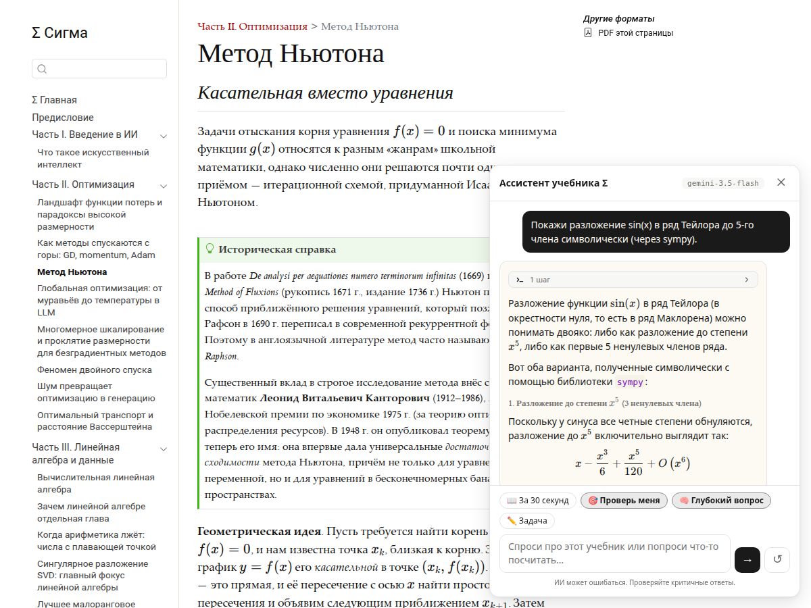

---

### ❌ `compute_plot_newton` — compute_plot

**Q:** Покажи как сходится метод Ньютона для f(x) = x² - 2, начиная с x₀ = 1.5. Построй график траектории.

_Chapter:_ `ch02_newton`

**Tools called:** find_theorem, python
**Tools expected:** python
**Images:** 1 (expected: yes)
**Elapsed:** 617.3s

_Missing substrings:_ ['1.41', 'корн']

<details><summary>Answer</summary>


```
ices
```

</details>


---

### ✅ `compute_plot_gd_vs_newton` — compute_plot

**Q:** Сравни сходимость метода Ньютона и градиентного спуска на функции f(x) = x⁴ из x₀ = 2. Покажи два графика на одной картинке.

_Chapter:_ `ch02_newton`

**Tools called:** search_textbook, read_chapter, python, python
**Tools expected:** python
**Images:** 2 (expected: yes)
**Elapsed:** 41.9s


<details><summary>Answer</summary>


```
Helper61a868f1-8071-464a-9778-439589998782При минимизации функции $f(x) = x^4$ из начальной точки $x_0 = 2$ мы сталкиваемся с очень интересным поведением обоих методов. 

Давай разберем теорию и посмотрим на результаты численного эксперимента.

### 1. Метод Ньютона
Формула метода Ньютона для оптимизации одномерной функции имеет вид:
$$x_{k+1} = x_k - \frac{f'(x_k)}{f''(x_k)}$$

Для нашей функции $f(x) = x^4$:
* Первая производная: $f'(x) = 4x^3$
* Вторая производная: $f''(x) = 12x^2$

Подставим их в формулу:
$$x_{k+1} = x_k - \frac{4x_k^3}{12x_k^2} = x_k - \frac{1}{3}x_k = \frac{2}{3}x_k$$

**Теоретический вывод:** Метод Ньютона сходится к минимуму $x^* = 0$ строго как геометрическая прогрессия со знаменателем $q = 2/3$. Это **линейная сходимость** (а не квадратичная, как обычно бывает у метода Ньютона для функций с ненулевой второй производной в минимуме, ведь здесь $f''(0) = 0$).

### 2. Градиентный спуск (GD)
Формула градиентного спуска с постоянным шагом $\eta$:
$$x_{k+1} = x_k - \eta f'(x_k) = x_k - 4\eta x_k^3$$

Возьмем небольшой шаг $\eta = 0.05$ (при больших шагах метод будет расходиться или сильно осциллировать из-за крутизны функции $x^4$ на старте). 
* На первом шаге градиент огромный, поэтому происходит резкий скачок: $x_1 = 2 - 4 \cdot 0.05 \cdot 8 = 0.4$.
* Но по мере приближения к нулю производная $f'(x) = 4x^3$ стремится к нулю чрезвычайно быстро. В окрестности минимума функция становится очень «плоской», из-за чего шаги градиентного спуска становятся микроск
…[truncated]
```

</details>

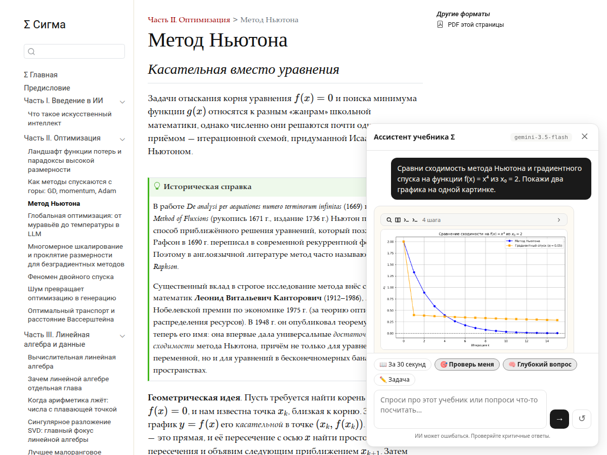

---

### ✅ `rsa_encrypt_small` — compute_pure

**Q:** Зашифруй число m=7 ключом (n=143, e=7). Покажи c.

_Chapter:_ `ch04_3_kriptosistemy-rsa-i-diffi-hellma`

**Tools called:** python, find_definition, search_textbook, read_chapter
**Tools expected:** python
**Images:** 0 (expected: no)
**Elapsed:** 31.6s


<details><summary>Answer</summary>


```
Чтобы зашифровать сообщение $m = 7$ с помощью открытого ключа $(n = 143, e = 7)$, воспользуемся формулой шифрования RSA из главы [Криптосистемы RSA и Диффи–Хеллмана](/ch04_3_kriptosistemy-rsa-i-diffi-hellma.html):

$$c = m^e \bmod n$$

Подставим наши значения:
$$c = 7^7 \bmod 143$$

### Пошаговое вычисление (метод быстрого возведения в степень)

Разложим степень $7^7$ как $7^4 \cdot 7^2 \cdot 7^1$:

1. **Считаем $7^1$:**
   $$7^1 \equiv 7 \pmod{143}$$

2. **Считаем $7^2$:**
   $$7^2 = 49 \equiv 49 \pmod{143}$$

3. **Считаем $7^4$:**
   $$7^4 = (7^2)^2 = 49^2 = 2401$$
   Разделим $2401$ на $143$ с остатком:
   $$2401 = 16 \cdot 143 + 113 \implies 7^4 \equiv 113 \pmod{143}$$

4. **Собираем всё вместе:**
   $$7^7 = 7^4 \cdot 7^2 \cdot 7^1 \equiv 113 \cdot 49 \cdot 7 \pmod{143}$$

   Сначала перемножим первые два числа:
   $$113 \cdot 49 = 5537$$
   $$5537 = 38 \cdot 143 + 103 \implies 113 \cdot 49 \equiv 103 \pmod{143}$$

   Теперь умножим результат на оставшуюся семёрку:
   $$103 \cdot 7 = 721$$
   $$721 = 5 \cdot 143 + 6 \implies 721 \equiv 6 \pmod{143}$$

### Ответ
Полученный шифр-текст: **$c = 6$**.
```

</details>


---

### ✅ `rsa_full_roundtrip` — compute_pure

**Q:** Возьми p=11, q=13, e=7. Сгенерируй RSA-ключ полностью: вычисли n, φ(n), d. Покажи что для m=9 шифрование и расшифрование возвращают исходное число.

_Chapter:_ `ch04_3_kriptosistemy-rsa-i-diffi-hellma`

**Tools called:** python, search_textbook
**Tools expected:** python
**Images:** 0 (expected: no)
**Elapsed:** 27.9s


<details><summary>Answer</summary>


```
Вот пошаговый процесс генерации ключей и проверки шифрования для твоих параметров:

### 1. Генерация RSA-ключей

*   **Вычисляем модуль $n$:**
    $$n = p \cdot q = 11 \cdot 13 = 143$$

*   **Вычисляем функцию Эйлера $\varphi(n)$:**
    $$\varphi(n) = (p - 1)(q - 1) = 10 \cdot 12 = 120$$

*   **Находим секретную экспоненту $d$:**
    Нам нужно найти число $d$, обратное к $e = 7$ по модулю $\varphi(n) = 120$. То есть решить сравнение:
    $$e \cdot d \equiv 1 \pmod{\varphi(n)} \implies 7 \cdot d \equiv 1 \pmod{120}$$
    
    С помощью расширенного алгоритма Евклида находим:
    $$d = 103$$
    *(Проверка: $7 \cdot 103 = 721 = 6 \cdot 120 + 1 \equiv 1 \pmod{120}$)*

**Итог генерации:**
*   **Открытый ключ:** $(e, n) = (7, 143)$
*   **Закрытый ключ:** $(d, n) = (103, 143)$

---

### 2. Шифрование сообщения $m = 9$

Формула шифрования: $c = m^e \bmod n$.
$$c = 9^7 \bmod 143$$

Давай посчитаем это быстрее через быстрое возведение в степень:
*   $9^2 = 81$
*   $9^4 = 81^2 = 6561 \equiv 126 \equiv -17 \pmod{143}$
*   $9^6 = 9^4 \cdot 9^2 \equiv -17 \cdot 81 = -1377 \equiv 53 \pmod{143}$
*   $9^7 = 9^6 \cdot 9 \equiv 53 \cdot 9 = 477 \equiv 48 \pmod{143}$

Получаем зашифрованное сообщение (шифротекст): **$c = 48$**.

---

### 3. Расшифрование шифротекста $c = 48$

Формула расшифрования: $m' = c^d \bmod n$.
$$m' = 48^{103} \bmod 143$$

Используя модульное возведение в степень, получаем:
$$48^{103} \equiv 9 \pmod{143}$$

Мы вернулись к исходному сообщению **$m = 9$**. Схема работает и
…[truncated]
```

</details>

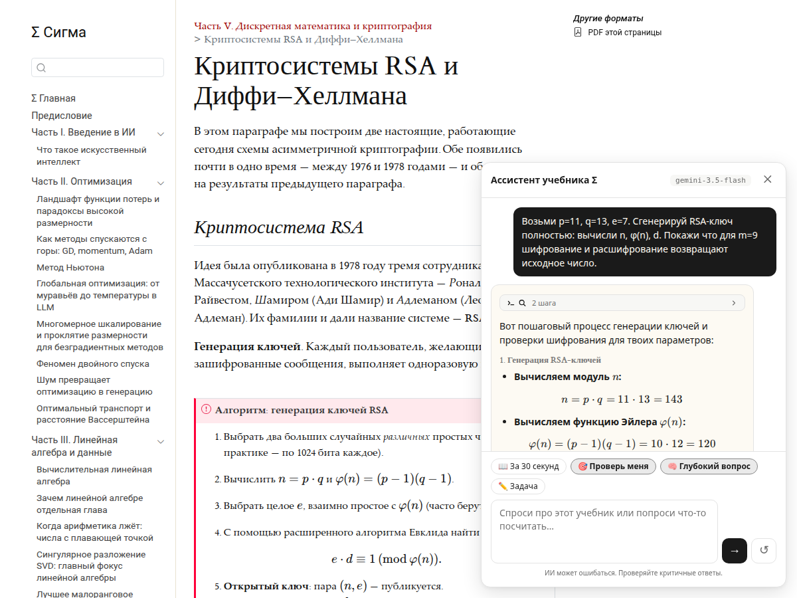

---

### ✅ `multihop_newton_vs_gradient` — multi_hop

**Q:** В чём отличие метода Ньютона от градиентного спуска для задач оптимизации? Какие из этих методов разобраны в учебнике?

_Chapter:_ `ch02_newton`

**Tools called:** get_outline, read_chapter, search_textbook, read_chapter, read_chapter
**Tools expected:** search_textbook
**Images:** 0 (expected: no)
**Elapsed:** 19.2s


<details><summary>Answer</summary>


```
**Оба метода подробно разобраны в нашем учебнике!** 

Ты сейчас как раз читаешь главу [Метод Ньютона](/ch02_newton.html), где в разделе [Ньютон для оптимизации](/ch02_newton.html#ньютон-для-оптимизации) объясняется одномерный случай этого метода. А градиентный спуск и его многомерная математика описаны в главе [Задача классификации и нейронные сети](/ch03_3_zadacha-klassifikacii-i-neyronny.html) (разделы [Градиент и градиентный спуск](/ch03_3_zadacha-klassifikacii-i-neyronny.html#ssec:gd) и [Производная по направлению и градиент](/ch03_3_zadacha-klassifikacii-i-neyronny.html#производная-по-направлению-и-градиент)).

---

### Главные отличия метода Ньютона от градиентного спуска

Разница между ними кроется в том, **какую информацию о функции** они используют на каждом шаге и **как быстро** они за счёт этого сходятся.

#### 1. Порядок приближения (локальная модель)
*   **Градиентный спуск** — это метод *первого порядка*. Он видит только наклон функции в текущей точке (первую производную или градиент $\nabla F$). Метод строит линейное приближение (касательную) и делает шаг в сторону наибыстрейшего спуска (антиградиента):
    $$\boldsymbol\theta_{k+1} = \boldsymbol\theta_k - \alpha \nabla F(\boldsymbol\theta_k)$$
    Здесь длину шага $\alpha$ (learning rate) приходится подбирать вручную.
*   **Метод Ньютона** — это метод *второго порядка*. Он учитывает не только наклон, но и кривизну графика (вторую производную $g''$ или матрицу вторых производных — матрицу Гессе). Метод строит к
…[truncated]
```

</details>


---

### ✅ `structural_kantorovich_theorem` — structural

**Q:** Сформулируй теорему о сходимости метода Герона.

_Chapter:_ `ch02_newton`

**Tools called:** find_theorem
**Tools expected:** find_theorem
**Images:** 0 (expected: no)
**Elapsed:** 9.0s


<details><summary>Answer</summary>


```
В главе [Метод Ньютона](/ch02_newton.html#сходимость-через-сжимающее-отображение), которую ты сейчас читаешь, приводится **Теорема 2.1. Сходимость метода Герона**:

> Для любого $x_0>0$ последовательность монотонно убывает (начиная с $k=1$) и сходится к $\sqrt{a}$. Более того, для ошибки $e_k=x_k-\sqrt{a}$ выполнено
> 
> $$e_{k+1}\;=\;\dfrac{e_k^2}{2x_k}\,, \qquad \text{и при }k\geq 1\colon\quad 0\le e_{k+1}\le \dfrac{e_k^{2}}{2\sqrt{a}}.$$

### Простыми словами:
* **Сходимость из любой точки:** Какое бы положительное начальное приближение $x_0 > 0$ мы ни взяли, метод Герона обязательно сойдётся к точному значению квадратного корня $\sqrt{a}$.
* **Монотонность:** Начиная со второго шага ($k \ge 1$), приближения будут становиться всё ближе к $\sqrt{a}$ «сверху», то есть последовательно уменьшаясь.
* **Квадратичная скорость:** Ошибка на следующем шаге $e_{k+1}$ пропорциональна *квадрату* ошибки на предыдущем шаге $e_k^2$. Это означает, что количество верных знаков после запятой на каждом шаге примерно удваивается!
```

</details>


---

### ❌ `vision_refine_diverging_sgd` — vision_refine

**Q:** Запусти SGD на функции f(x) = x² с шагом η = 1.1 из x₀ = 2, 30 итераций. Что произойдёт? Если разойдётся — подбери рабочий шаг и покажи сходящуюся траекторию.

**Tools called:** python, search_textbook
**Tools expected:** python, python
**Images:** 1 (expected: yes)
**Elapsed:** 35.1s

_Missing substrings:_ ['расход']

<details><summary>Answer</summary>


```
При запуске градиентного спуска (GD) для функции $f(x) = x^2$ формула обновления имеет вид:

$$x_{t+1} = x_t - \eta f'(x_t) = x_t - 2\eta x_t = (1 - 2\eta)x_t$$

### 1. Что произойдёт при $\eta = 1.1$?
Если мы возьмём шаг $\eta = 1.1$, то множитель перехода перед $x_t$ станет равен:
$$1 - 2 \cdot 1.1 = -1.2$$

Так как модуль этого множителя больше единицы ($|-1.2| > 1$), расстояние до минимума на каждом шаге будет увеличиваться в $1.2$ раза, а знак — меняться на противоположный. Метод **разойдётся с нарастающими осцилляциями**:
* $x_0 = 2.00$
* $x_1 = -2.40$
* $x_2 = 2.88$
* $x_3 = -3.46$
* ...
* $x_{30} \approx 474.75$

### 2. Подбор рабочего шага
Чтобы траектория сходилась к минимуму ($x^* = 0$), модуль множителя перехода должен быть строго меньше единицы:
$$|1 - 2\eta| < 1 \implies 0 < \eta < 1$$

* Если выбрать $0.5 < \eta < 1$, сходимость будет с затухающими осцилляциями (знак $x$ меняется).
* Если выбрать $0 < \eta < 0.5$, сходимость будет монотонной. 
* При $\eta = 0.5$ мы попадём в минимум ровно за $1$ шаг.

Возьмём для примера рабочий шаг **$\eta = 0.3$** (множитель перехода $1 - 2 \cdot 0.3 = 0.4$). Траектория из $x_0 = 2$ уверенно и плавно сойдётся к нулю:
* $x_0 = 2.00$
* $x_1 = 0.80$
* $x_2 = 0.32$
* $x_3 = 0.13$
* ...
* $x_{30} \approx 0.00$ (точнее, $2.3 \times 10^{-12}$)

Результаты обоих экспериментов наглядно представлены на графиках выше.
```

</details>

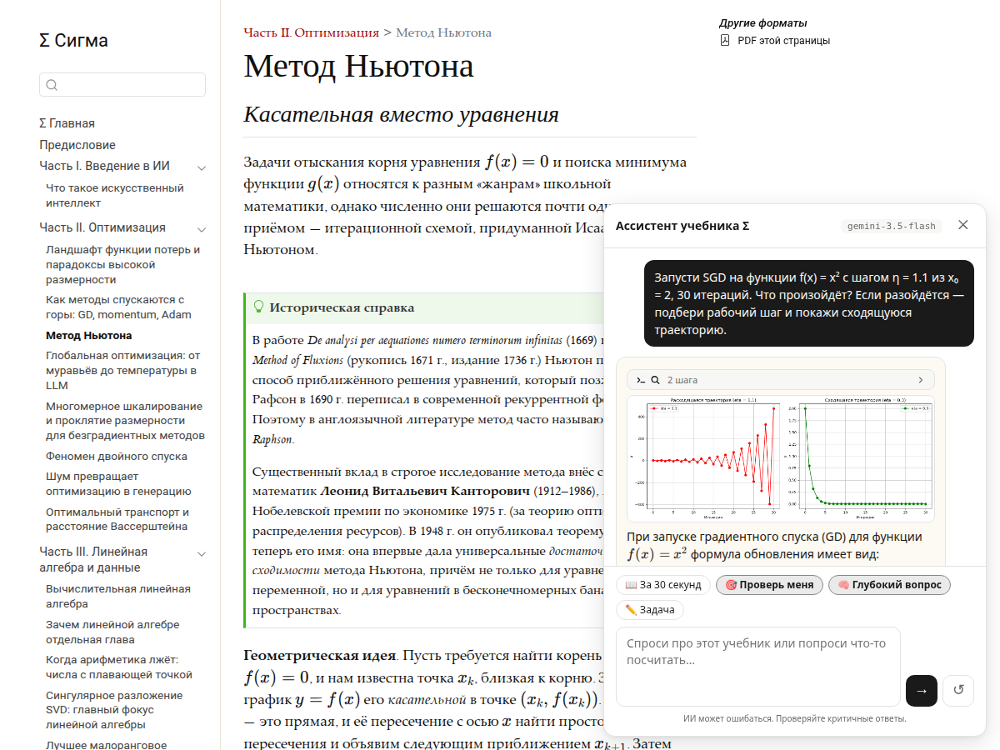

---

### ✅ `hashlib_demo` — compute_pure

**Q:** Посчитай SHA-256 хеш строки 'sigma' в hex.

_Chapter:_ `ch04_5_heshirovanie-teoriya-chisel-vstr`

**Tools called:** python
**Tools expected:** python
**Images:** 0 (expected: no)
**Elapsed:** 18.8s


<details><summary>Answer</summary>


```
SHA-256 хеш строки `'sigma'` в шестнадцатеричном формате (hex) равен:

`38de90475bb334fb3dea5d54f250500aba60fe2c6158115d342b06bcb46e39bf`
```

</details>


---

### ✅ `linreg_simple` — compute_plot

**Q:** Подбери линейную регрессию y = a*x + b для точек (1, 2.1), (2, 3.9), (3, 6.2), (4, 7.8). Покажи коэффициенты и график.

_Chapter:_ `ch03_2_lineynaya-regressiya-i-metod-nai`

**Tools called:** python
**Tools expected:** python
**Images:** 1 (expected: yes)
**Elapsed:** 19.7s


<details><summary>Answer</summary>


```
.Вычисления показывают, что для заданных точек $(1, 2.1)$, $(2, 3.9)$, $(3, 6.2)$, $(4, 7.8)$ наилучшая прямая по методу наименьших квадратов имеет следующие коэффициенты:

* **$a = 1.94$** (угловой коэффициент)
* **$b = 0.15$** (свободный член)

Уравнение линейной регрессии:
$$y = 1.94x + 0.15$$

На графике ниже видно, как построенная прямая аппроксимирует исходные точки (красные маркеры):

*(График построен и отображён выше)*
```

</details>

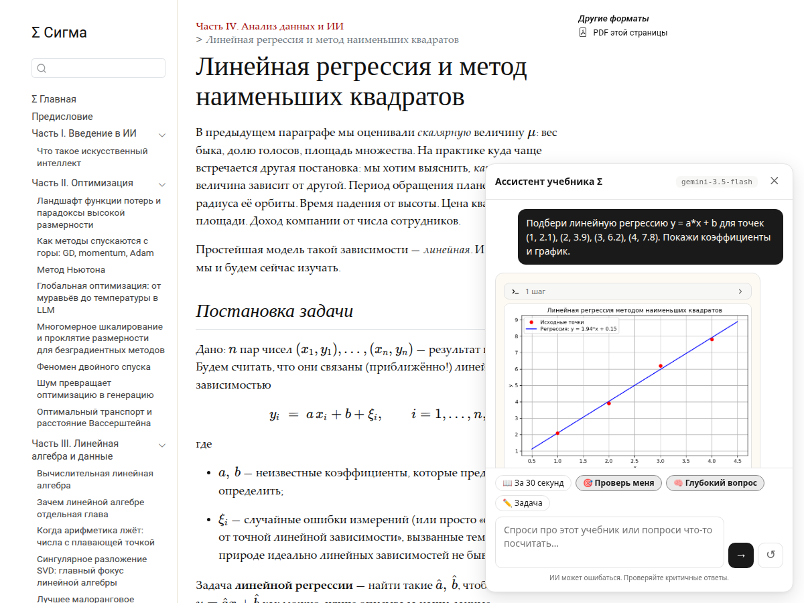

---

### ✅ `out_of_scope_recipe` — out_of_scope

**Q:** Дай мне рецепт борща.

**Tools called:** (none)
**Tools expected:** (none)
**Images:** 0 (expected: no)
**Elapsed:** 4.7s


<details><summary>Answer</summary>


```
Я бы с радостью помог тебе приготовить вкусный борщ, но я — ассистент по учебнику оптимизации, теории чисел и машинного обучения. Моя суперсила — объяснять метод Ньютона, строить графики сходимости и искать теоремы. 

Если у тебя возникнут вопросы по главе «Метод Ньютона» или другим темам учебника, обязательно спрашивай!
```

</details>


---

### ✅ `rsa_history` — rag_basic

**Q:** Кто придумал RSA и в каком году?

_Chapter:_ `ch04_3_kriptosistemy-rsa-i-diffi-hellma`

**Tools called:** search_textbook, read_chapter
**Tools expected:** search_textbook
**Images:** 0 (expected: no)
**Elapsed:** 9.8s


<details><summary>Answer</summary>


```
Согласно учебнику, у этой истории есть два открытия:

* **Официальное открытие (1978 год):** идею опубликовали трое сотрудников Массачусетского технологического института (MIT) — **Рональд Райвест**, **Ади Шамир** и **Леонард Адлеман**. Из первых букв их фамилий (Rivest, Shamir, Adleman) и сложилась аббревиатура **RSA**.
* **Засекреченное открытие (1973 год):** ровно ту же схему на 5 лет раньше независимо разработал британский математик **Клиффорд Кокс**, работавший в секретной службе Великобритании (GCHQ). Однако его работа была засекречена правительством и обнародована только в 1997 году.
```

</details>

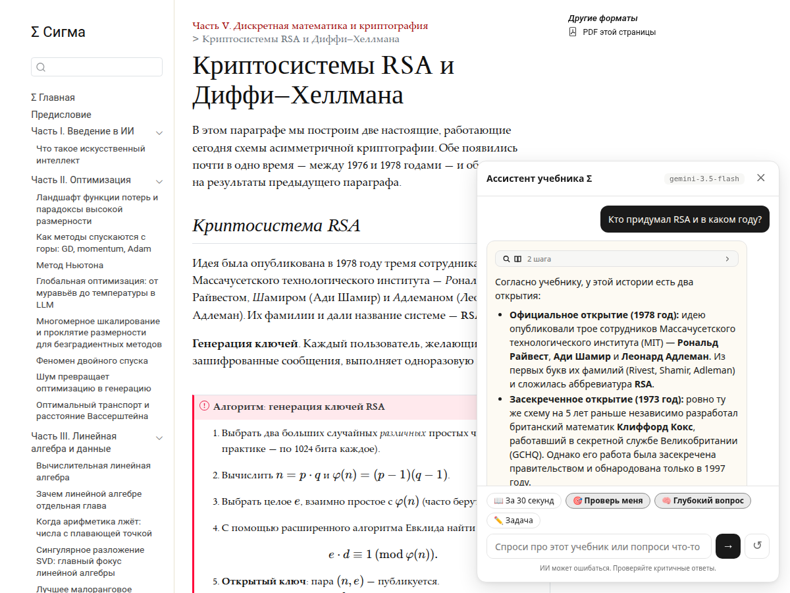

---

### ✅ `greeting_minimal` — out_of_scope

**Q:** Привет!

_Chapter:_ `ch02_newton`

**Tools called:** (none)
**Tools expected:** (none)
**Images:** 0 (expected: no)
**Elapsed:** 4.3s


<details><summary>Answer</summary>


```
Привет! Рад тебя видеть. 

Ты сейчас изучаешь главу **«Метод Ньютона»**. Чем я могу помочь? Могу объяснить суть метода, показать, как он сходится на графике, или помочь разобраться с формулами и теоремами из этой главы!
```

</details>


---

### ✅ `euclid_gcd_python` — compute_pure

**Q:** Посчитай НОД(48, 180) и НОД(1071, 462) через алгоритм Евклида в python.

_Chapter:_ `ch04_1_elementy-teorii-chisel`

**Tools called:** find_definition, search_textbook, read_chapter, python
**Tools expected:** python
**Images:** 0 (expected: no)
**Elapsed:** 30.4s


<details><summary>Answer</summary>


```
Для нахождения наибольшего общего делителя (НОД) воспользуемся алгоритмом Евклида, который подробно описан в подразделе [Алгоритм Евклида](/ch04_1_elementy-teorii-chisel.html#subsec:euclid) главы «Элементы теории чисел». 

Идея алгоритма заключается в последовательном делении с остатком: на каждом шаге мы заменяем пару чисел $(a, b)$ на пару $(b, a \bmod b)$, пока остаток не станет равен нулю. Последний ненулевой остаток и будет НОД.

Вот пошаговые вычисления, выполненные в Python:

### 1. Нахождение НОД(48, 180)
Запустим алгоритм для большего числа $180$ и меньшего $48$:
1. $180 = 3 \cdot 48 + 36$ (остаток $36$)
2. $48 = 1 \cdot 36 + 12$ (остаток $12$)
3. $36 = 3 \cdot 12 + 0$ (остаток $0$, деление завершено)

Последний ненулевой остаток равен $12$.  
**$\text{НОД}(48, 180) = 12$**

---

### 2. Нахождение НОД(1071, 462)
Проделаем те же шаги для чисел $1071$ и $462$:
1. $1071 = 2 \cdot 462 + 147$ (остаток $147$)
2. $462 = 3 \cdot 147 + 21$ (остаток $21$)
3. $147 = 7 \cdot 21 + 0$ (остаток $0$, деление завершено)

Последний ненулевой остаток равен $21$.  
**$\text{НОД}(1071, 462) = 21$**
```

</details>

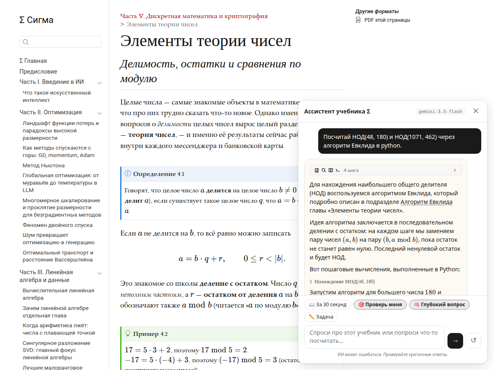

---

### ✅ `definition_superlinear` — definition

**Q:** Что значит сверхлинейная сходимость?

_Chapter:_ `ch02_newton`

**Tools called:** find_definition
**Tools expected:** find_definition
**Images:** 0 (expected: no)
**Elapsed:** 11.2s


<details><summary>Answer</summary>


```
В [Определении 2.3](/ch02_newton.html#ssec:thm-superlinear) твоей текущей главы даётся строгое математическое описание этого понятия.

Последовательность $\{x_k\}$ сходится к $x^{\star}$ со **сверхлинейной скоростью**, если:

$$\lim_{k\to\infty}\dfrac{|x_{k+1}-x^{\star}|}{|x_k-x^{\star}|}=0$$

### Что это значит простыми словами?

Пусть $e_k = |x_k - x^{\star}|$ — это ошибка (расстояние до точного решения) на шаге $k$. Тогда формула выше означает, что отношение ошибки на следующем шаге к ошибке на текущем шаге стремится к нулю:

$$\lim_{k\to\infty}\dfrac{e_{k+1}}{e_k} = 0$$

* При **линейной сходимости** ошибка на каждом шаге уменьшается примерно в фиксированное число раз (например, каждый шаг стабильно делит ошибку на 2). Отношение $\frac{e_{k+1}}{e_k}$ стремится к константе $q \in (0, 1)$.
* При **сверхлинейной сходимости** метод с каждым шагом «разгоняется». Отношение ошибок не просто меньше единицы, оно само стремится к нулю. Это значит, что каждый новый шаг уменьшает ошибку гораздо сильнее, чем предыдущий.

В этой же главе упоминается ещё более мощная **квадратичная сходимость** (свойственная методу Ньютона вблизи корня), когда ошибка на следующем шаге зажимается квадратом предыдущей ошибки: $e_{k+1} \le M e_k^2$. При квадратичной сходимости количество верных значащих цифр на каждом шаге примерно удваивается! Квадратичная сходимость — это частный, очень быстрый случай сверхлинейной.
```

</details>

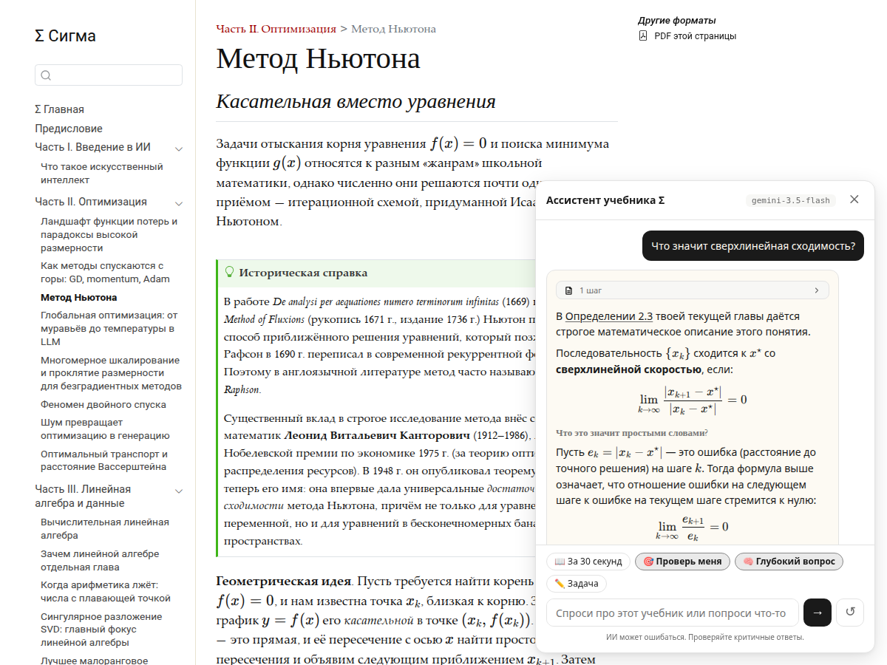

---

### ✅ `theorem_clt` — structural

**Q:** Сформулируй центральную предельную теорему как в учебнике.

_Chapter:_ `ch03_1_prosteyshie-primery-zadach-anali`

**Tools called:** find_theorem
**Tools expected:** find_theorem
**Images:** 0 (expected: no)
**Elapsed:** 9.7s


<details><summary>Answer</summary>


```
В главе, которую ты сейчас читаешь, в разделе [Подход 2. Центральная предельная теорема](/ch03_1_prosteyshie-primery-zadach-anali.html#подход-2-центральная-предельная-теорема) приводится следующая формулировка:

**Теорема 3.3. Центральная предельная теорема (ЦПТ)**

Пусть $X_1,X_2,\dots$ — независимые одинаково распределённые случайные величины с математическим ожиданием $\mu$ и конечной дисперсией $\sigma^2>0$, $S_n=X_1+\dots+X_n$. Тогда при $n\to\infty$

$$\Pr\!\left(\frac{S_n-n\mu}{\sigma\sqrt n}\leq x\right)\;\longrightarrow\; \Phi(x)\;\stackrel{\mathrm{def}}{=}\;\frac{1}{\sqrt{2\pi}}\int_{-\infty}^{x} e^{-t^{2}/2}\,dt$$

*(функция стандартного нормального распределения)*.

### Расшифровка формулировки:
* **$X_1, X_2, \dots$** — это последовательность случайных величин, которые не зависят друг от друга и имеют абсолютно одинаковое распределение (то есть у них одинаковые средние значения и разброс).
* **$\mu$** — их общее математическое ожидание (среднее значение).
* **$\sigma^2$** — их общая дисперсия (мера разброса), которая должна быть конечной и строго больше нуля.
* **$S_n = X_1 + \dots + X_n$** — сумма первых $n$ таких случайных величин.
* **$\frac{S_n-n\mu}{\sigma\sqrt n}$** — центрированная и нормированная сумма. Мы вычитаем её математическое ожидание $n\mu$ и делим на стандартное отклонение $\sigma\sqrt n$, чтобы привести среднее к $0$, а дисперсию к $1$.
* **$\Pr(\dots \le x) \longrightarrow \Phi(x)$** означает, что при росте числа слагаемых ($n \to \infty$) веро
…[truncated]
```

</details>

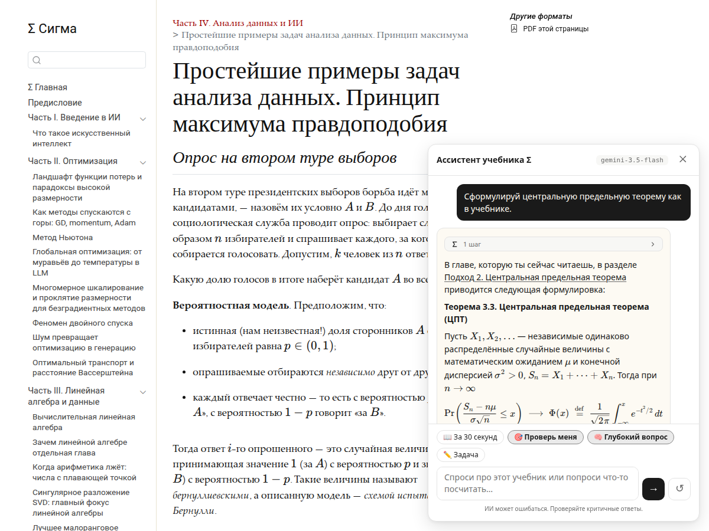

---

### ✅ `plot_sincos_overlay` — compute_plot

**Q:** Построй графики sin(x) и cos(x) на интервале [-2π, 2π] на одном поле. Сделай легенду.

**Tools called:** python
**Tools expected:** python
**Images:** 1 (expected: yes)
**Elapsed:** 233.2s


<details><summary>Answer</summary>


```
veвод:

Привет! Я построил графики функций $\sin(x)$ (синяя линия) и $\cos(x)$ (оранжевая линия) на интервале $[-2\pi, 2\pi]$ (приблизительно $[-6.28, 6.28]$).

**Основные особенности графиков:**
* Обе функции являются периодическими с периодом $2\pi \approx 6.28$.
* Амплитуда колебаний обеих функций равна $1$ (значения лежат в пределах от $-1$ до $1$).
* График косинуса $\cos(x)$ сдвинут влево относительно синуса $\sin(x)$ на фазовый угол $\pi/2 \approx 1.57$ (то есть $\cos(x) = \sin(x + \pi/2)$).
* На графике отчетливо видны точки пересечения, где $\sin(x) = \cos(x)$ (или $\tan(x) = 1$). На заданном интервале $[-2\pi, 2\pi]$ эти точки соответствуют значениям:
  * $x \approx -5.50$ (ордината $y \approx 0.71$)
  * $x \approx -2.36$ (ордината $y \approx -0.71$)
  * $x \approx 0.79$ (ордината $y \approx 0.71$)
  * $x \approx 3.93$ (ордината $y \approx -0.71$)
```

</details>

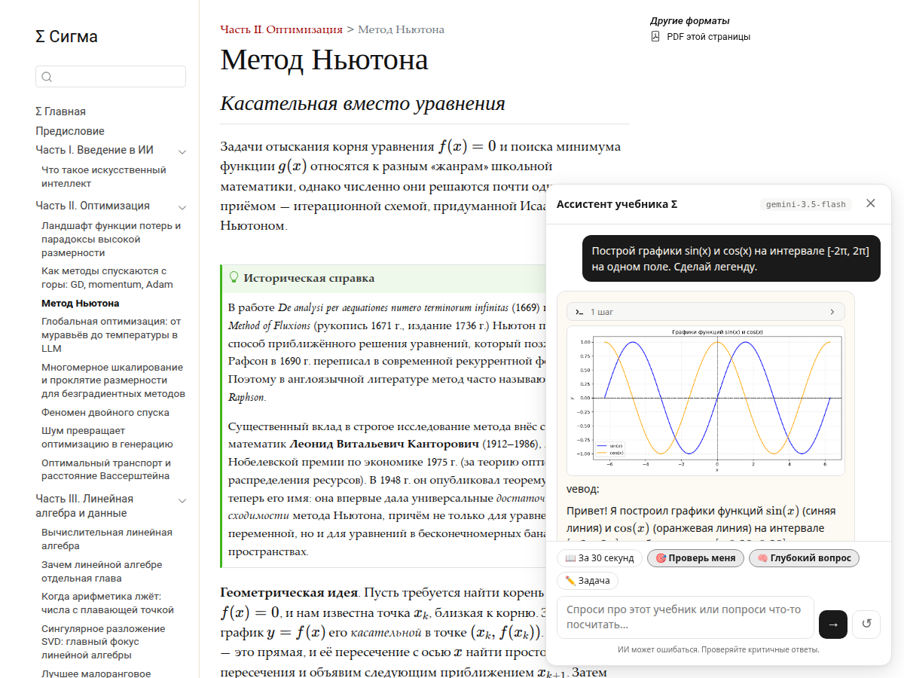

---

### ✅ `fragment_explanation` — rag_basic

**Q:** Если кто-то предлагает использовать обновление x_{k+1} = x_k - f(x_k)·f'(x_k) вместо классического Ньютона — что это за идея и она работает?

_Chapter:_ `ch02_newton`

**Tools called:** search_textbook, read_chapter, python, python
**Tools expected:** (none)
**Images:** 1 (expected: no)
**Elapsed:** 45.1s


<details><summary>Answer</summary>


```
. Студент сейчас читает главу [Метод Ньютона](/ch02_newton.html).

Предложенная идея $x_{k+1} = x_k - f(x_k)f'(x_k)$ — это очень красивая, но в таком виде **нерабочая (крайне нестабильная) схема**. Давайте разберем, откуда она берется и почему ломается.

### Что это за идея?
Если мы хотим решить уравнение $f(x) = 0$, мы можем свести эту задачу к минимизации квадрата невязки. Определим функцию потерь:
$$G(x) = \frac{1}{2} f(x)^2$$

Минимум этой функции достигается как раз там, где $f(x) = 0$ (тогда $G(x) = 0$). Найдем производную (градиент) этой функции по правилу дифференцирования сложной функции:
$$G'(x) = f(x) \cdot f'(x)$$

Теперь применим к функции $G(x)$ обычный **градиентный спуск** с шагом (learning rate) $\eta$:
$$x_{k+1} = x_k - \eta \cdot G'(x_k) = x_k - \eta \cdot f(x_k)f'(x_k)$$

Если положить шаг $\eta = 1$, мы получим в точности предложенную формулу:
$$x_{k+1} = x_k - f(x_k)f'(x_k)$$

Таким образом, эта идея — **градиентный спуск для минимизации квадрата функции с фиксированным шагом $\eta = 1$**.

---

### Почему это плохо работает?

В отличие от классического метода Ньютона, который делит на производную ($x_{k+1} = x_k - \frac{f(x_k)}{f'(x_k)}$) и автоматически масштабирует шаг, предложенный метод умножает на производную. Это приводит к двум фундаментальным проблемам:

1. **Неправильная размерность шага.** 
   Если $f(x)$ измеряется, например, в метрах, то $f(x)f'(x)$ имеет размерность «метры в квадрате». Вычитать из величины в метрах величину в квадратных мет
…[truncated]
```

</details>

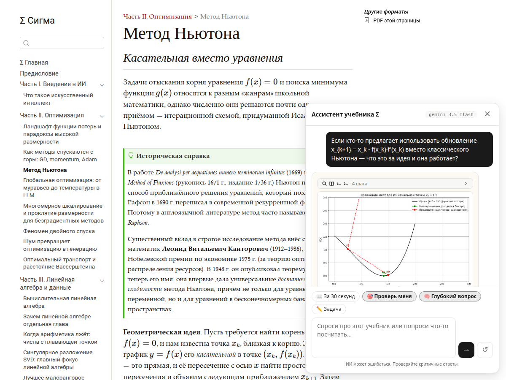

---

### ✅ `eigenvalues_numpy` — compute_pure

**Q:** Найди собственные значения матрицы [[2, 1], [1, 2]] через numpy.

_Chapter:_ `ch_linalg`

**Tools called:** python
**Tools expected:** python
**Images:** 0 (expected: no)
**Elapsed:** 24.6s


<details><summary>Answer</summary>


```
Собственные значения матрицы 
$$A = \begin{pmatrix} 2 & 1 \\ 1 & 2 \end{pmatrix}$$
равны **$3$** и **$1$**.

Вот как их можно найти с помощью библиотеки `numpy` в Python:

```python
import numpy as np

# Задаем матрицу
A = np.array([[2, 1],
              [1, 2]])

# Вычисляем собственные значения и собственные векторы
eigenvalues, eigenvectors = np.linalg.eig(A)

print("Собственные значения:", eigenvalues)
print("Собственные векторы:\n", eigenvectors)
```

### Результат вычислений:
* **Собственные значения ($\lambda$):** `[3., 1.]`
* **Собственные векторы:** 
  * Для $\lambda_1 = 3$ собственный вектор равен $\begin{pmatrix} 0.71 \\ 0.71 \end{pmatrix}$ (направлен так же, как $\begin{pmatrix} 1 \\ 1 \end{pmatrix}$).
  * Для $\lambda_2 = 1$ собственный вектор равен $\begin{pmatrix} -0.71 \\ 0.71 \end{pmatrix}$ (направлен так же, как $\begin{pmatrix} -1 \\ 1 \end{pmatrix}$).
```

</details>


---

### ✅ `plot_loss_landscape` — compute_plot

**Q:** Построй контурный график функции потерь L(a, b) = sum((a*x_i + b - y_i)^2) для точек (1,2), (2,3), (3,5), (4,4) на сетке a in [-2, 4], b in [-3, 3].

_Chapter:_ `ch03_2_lineynaya-regressiya-i-metod-nai`

**Tools called:** python
**Tools expected:** python
**Images:** 1 (expected: yes)
**Elapsed:** 452.0s


<details><summary>Answer</summary>


```
0:00Я построил контурный график функции потерь $L(a, b)$ для твоих точек.

**Основные результаты расчёта:**
* **Оптимальный наклон ($a$):** $0.80$
* **Оптимальный сдвиг ($b$):** $1.50$
* **Минимальное значение функции потерь $L(a, b)$:** $1.80$

### Анализ графика:
1. **Форма линий уровня:** Линии уровня представляют собой вытянутые эллипсы. Это классический вид квадратичной функции потерь (МНК). 
2. **Ориентация эллипсов:** Эллипсы наклонены. Этот наклон возникает из-за того, что параметры $a$ и $b$ скоррелированы: все наши точки $x_i$ положительны ($1, 2, 3, 4$), поэтому при увеличении наклона $a$ нам приходится уменьшать сдвиг $b$, чтобы прямая всё ещё проходила близко к точкам.
3. **Точка минимума:** Красная точка обозначает глобальный минимум функции потерь — наилучшие параметры разделяющей прямой $y = 0.8x + 1.5$.
```

</details>

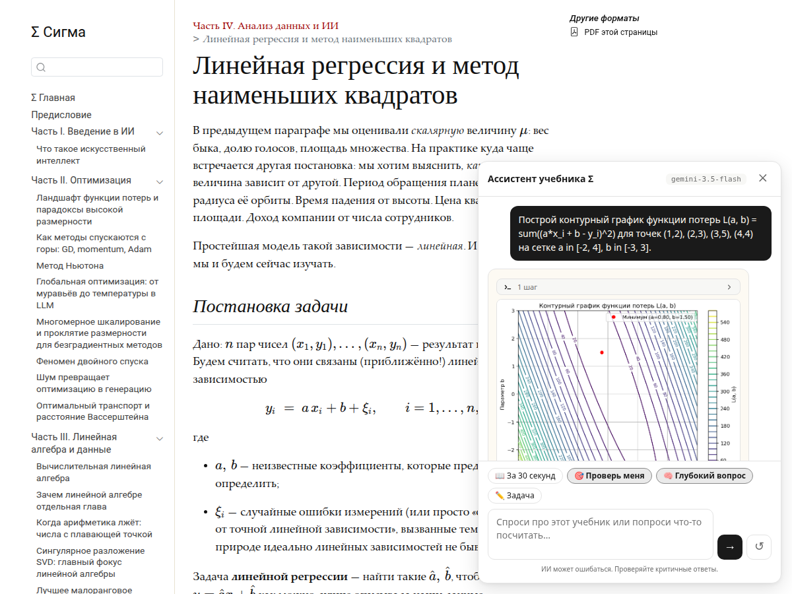

---

### ✅ `diffie_hellman_compute` — compute_pure

**Q:** Проведи протокол Диффи–Хеллмана: p=23, g=5. Алиса берёт a=6, Боб берёт b=15. Какой общий секрет?

_Chapter:_ `ch04_3_kriptosistemy-rsa-i-diffi-hellma`

**Tools called:** find_definition, read_chapter, read_chapter, python
**Tools expected:** python
**Images:** 0 (expected: no)
**Elapsed:** 24.6s


<details><summary>Answer</summary>


```
В главе [Криптосистемы RSA и Диффи–Хеллмана](/ch04_3_kriptosistemy-rsa-i-diffi-hellma.html#протокол-диффихеллмана), которую ты сейчас читаешь, подробно разобран именно этот учебный пример! 

Давай пошагово проведём протокол:

1. **Алиса** вычисляет своё открытое значение $A$ и отправляет его Бобу:
   $$A = g^a \bmod p = 5^6 \bmod 23 = 8$$

2. **Боб** вычисляет своё открытое значение $B$ и отправляет его Алисе:
   $$B = g^b \bmod p = 5^{15} \bmod 23 = 19$$

3. **Алиса** вычисляет общий секретный ключ $K$, используя открытое значение Боба $B$ и свой секрет $a$:
   $$K = B^a \bmod p = 19^6 \bmod 23 = 2$$

4. **Боб** вычисляет тот же ключ $K$, используя открытое значение Алисы $A$ и свой секрет $b$:
   $$K = A^b \bmod p = 8^{15} \bmod 23 = 2$$

**Ответ:** Общий секрет равен **$2$**.
```

</details>

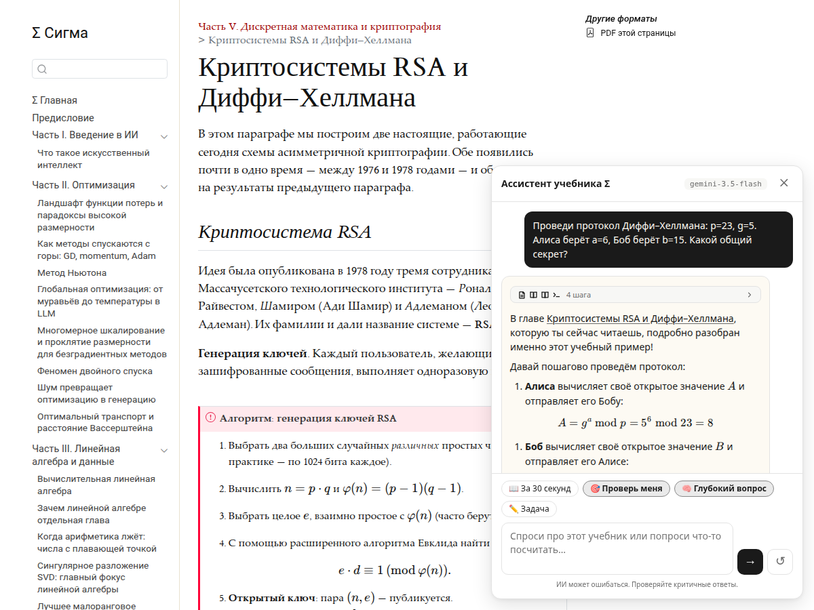

---

### ✅ `outline_chapter` — structural

**Q:** Перечисли основные разделы главы про Ньютона.

_Chapter:_ `ch02_newton`

**Tools called:** get_outline
**Tools expected:** (none)
**Images:** 0 (expected: no)
**Elapsed:** 6.5s


<details><summary>Answer</summary>


```
Ты уже находишься на этой главе! Вот её основные разделы:

* **Касательная вместо уравнения** (метод Ньютона для поиска корней)
* **Ньютон для оптимизации** (применение метода для поиска экстремумов функций)
* **Квадратный корень за пять шагов** (метод Герона как частный случай метода Ньютона)
  * *Сходимость через сжимающее отображение*
* **Деление без деления** (быстрое деление с помощью метода Ньютона)
  * *Анализ сходимости*
* **Численный эксперимент на Python** (практическая реализация алгоритмов)
* **Когда сходимость сверхлинейна$^\star$** (теоретический анализ скорости сходимости)
```

</details>


---

### ✅ `math_latex_derivation` — rag_basic

**Q:** Выведи формулу метода Ньютона через касательную. Формулу запиши через LaTeX.

_Chapter:_ `ch02_newton`

**Tools called:** read_chapter
**Tools expected:** (none)
**Images:** 0 (expected: no)
**Elapsed:** 14.3s


<details><summary>Answer</summary>


```
Ты как раз читаешь главу **Метод Ньютона**! В ней подробно разобраны:
* Геометрический смысл метода и его связь с касательной
* Применение метода Ньютона для оптимизации (минимизации функций) через квадратичную аппроксимацию
* Метод Герона для быстрого вычисления квадратного корня

---

### Вывод формулы метода Ньютона через касательную

Геометрическая идея метода заключается в том, чтобы заменить график функции $y = f(x)$ его касательной в текущем приближении $x_k$, а в качестве следующего приближения $x_{k+1}$ взять точку пересечения этой касательной с осью абсцисс.

**Шаг 1.** Запишем уравнение касательной к графику функции $y = f(x)$ в точке $(x_k, f(x_k))$:
$$y = f(x_k) + f'(x_k)(x - x_k)$$

**Шаг 2.** Нам нужно найти точку, где эта касательная пересекает ось $x$. Для этого подставим $y = 0$ и обозначим искомый $x$ как новое приближение $x_{k+1}$:
$$0 = f(x_k) + f'(x_k)(x_{k+1} - x_k)$$

**Шаг 3.** Выразим $x_{k+1}$ из полученного уравнения. Перенесём слагаемое с производной в левую часть:
$$-f'(x_k)(x_{k+1} - x_k) = f(x_k)$$

Разделим обе части на $-f'(x_k)$ (предполагая, что $f'(x_k) \neq 0$):
$$x_{k+1} - x_k = -\dfrac{f(x_k)}{f'(x_k)}$$

Перенесём $x_k$ в правую часть и получим классическую **итерационную формулу метода Ньютона**:
$$x_{k+1} = x_k - \dfrac{f(x_k)}{f'(x_k)}$$
```

</details>


---

### ✅ `definition_perceptron` — definition

**Q:** Что такое полносвязная нейронная сеть?

_Chapter:_ `ch03_3_zadacha-klassifikacii-i-neyronny`

**Tools called:** find_definition
**Tools expected:** find_definition
**Images:** 0 (expected: no)
**Elapsed:** 12.1s


<details><summary>Answer</summary>


```
В учебнике даётся строгое определение этого понятия. Ты как раз читаешь эту тему в разделе [Задача классификации и нейронные сети](/ch03_3_zadacha-klassifikacii-i-neyronny.html#ssec:mlp).

**Полносвязная нейронная сеть** (или многослойный перцептрон, MLP) глубины $L$ — это математическая функция $\mathbf x\mapsto \mathbf p(\mathbf x)$, которая представляет собой последовательную цепочку (композицию) из $L$ слоёв:

$$
\begin{aligned}
\mathbf z^{(\ell)} &= W^{(\ell)} \mathbf a^{(\ell-1)} + \mathbf b^{(\ell)},\qquad
\mathbf a^{(\ell)} = \sigma\bigl(\mathbf z^{(\ell)}\bigr),
\qquad \ell=1,\dots,L-1,
\\
\mathbf z^{(L)} &= W^{(L)} \mathbf a^{(L-1)} + \mathbf b^{(L)},\qquad
\mathbf p(\mathbf x) = \mathrm{softmax}\bigl(\mathbf z^{(L)}\bigr).
\end{aligned}
$$

Если перевести эти формулы на простой язык:
* **Вход и слои:** На вход подаётся вектор признаков $\mathbf x$ (обозначим его как $\mathbf a^{(0)}$). Он передаётся от слоя к слою.
* **Линейное преобразование:** На каждом слое $\ell$ вектор с предыдущего шага $\mathbf a^{(\ell-1)}$ умножается на матрицу весов $W^{(\ell)}$, и к результату прибавляется вектор смещений (bias) $\mathbf b^{(\ell)}$. «Полносвязной» сеть называется потому, что каждый нейрон текущего слоя связан со всеми нейронами предыдущего слоя (это и отражает матричное умножение).
* **Активация:** Полученный результат $\mathbf z^{(\ell)}$ пропускается через нелинейную **функцию активации** $\sigma$ (например, ReLU), которая применяется к каждому элементу отдельно. Это 
…[truncated]
```

</details>


---

### ❌ `refuse_unknown_year` — out_of_scope

**Q:** В каком году Гаусс изобрёл метод сопряжённых градиентов?

_Chapter:_ `ch02_newton`

**Tools called:** search_textbook, search_textbook, search_textbook, search_textbook, search_textbook, search_textbook
**Tools expected:** (none)
**Images:** 0 (expected: no)
**Elapsed:** 22.8s

_Missing substrings:_ ['наш']

<details><summary>Answer</summary>


```
В материалах учебника метод сопряженных градиентов не упоминается. 

**Вне учебника:** 
Карл Фридрих Гаусс **не изобретал** метод сопряженных градиентов. Этот метод был разработан гораздо позже — в **1952 году** математиками Магнусом Хестенсом (Magnus Hestenes) и Эдуардом Штифелем (Eduard Stiefel). 

Гаусс же разработал другие классические методы, которые часто путают с этим:
* **Метод исключения Гаусса** для решения систем линейных уравнений.
* **Метод наименьших квадратов (МНК)**, который он открыл в 1795 году и опубликовал в 1809 году (этот факт как раз упоминается в главе [Линейная регрессия и метод наименьших квадратов](/ch03_2_lineynaya-regressiya-i-metod-nai.html#ssec:kepler)).
```

</details>


---
