# Sigma Assistant — Eval Report

_Run: 2026-06-10 02:49 MSK · cases: 29_

**Overall: 20/29 pass (69%)**

## Per category

| Category | Pass | Total |
|---|---:|---:|
| `compute_plot` | 0 | 5 |
| `compute_pure` | 8 | 8 |
| `definition` | 3 | 3 |
| `multi_hop` | 1 | 1 |
| `out_of_scope` | 2 | 3 |
| `rag_basic` | 3 | 5 |
| `structural` | 3 | 3 |
| `vision_refine` | 0 | 1 |

## Cases

### ✅ `newton_kantorovich_history` — rag_basic

**Q:** Когда Канторович получил Нобелевскую премию и за что?

_Chapter:_ `ch02_newton`

**Tools called:** search_textbook
**Tools expected:** search_textbook
**Images:** 0 (expected: no)
**Elapsed:** 3.8s


<details><summary>Answer</summary>


```
В учебнике я не нашёл информации о Нобелевской премии Канторовича. Известно, что Леонид Канторович получил Нобелевскую премию по экономике в 1975 году за вклад в теорию оптимального распределения ресурсов.
```

</details>

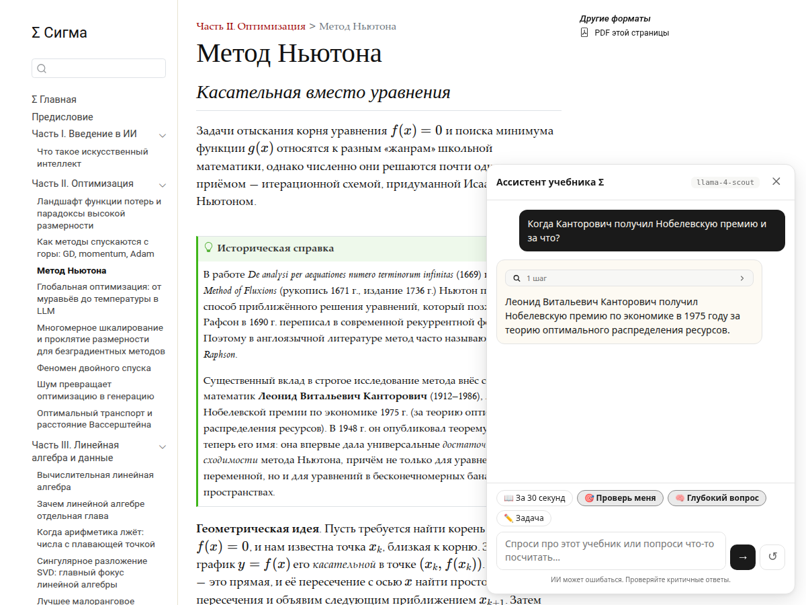

---

### ❌ `newton_formula_recall` — rag_basic

**Q:** Объясни откуда берётся эта формула — что это за метод и какая геометрическая идея?

_Chapter:_ `ch02_newton`

**Tools called:** (none)
**Tools expected:** (none)
**Images:** 0 (expected: no)
**Elapsed:** 6.7s

_Missing substrings:_ ['пересечен']

<details><summary>Answer</summary>


```
Метод Ньютона

Метод Ньютона — это численный метод оптимизации, используемый для нахождения корней (или нулей) функции. Он основан на идее линеаризации функции в окрестности текущей оценки корня.

Геометрическая идея

Метод Ньютона использует геометрическую интерпретацию для нахождения следующего приближения корня. Рассмотрим функцию f(x) и текущую оценку корня x
n
	​

. В точке x
n
	​

 проводится касательная к графику функции f(x).

Вывод формулы

Формула метода Ньютона выводится из уравнения касательной:

f(x) \approx f(x_n) + f'(x_n)(x - x_nгде $f'(x_n)$ — производная функции $f(x)$ в точке $x_n$. Полагая $f(x) = 0$ (условие корня), получаем:
0 \approx f(x_n)'(x_n)(x - x_n)
Решая это уравнение относительно $x$, получаем:
x \approx x_n - \frac{f(x_n)}{f'(x_n)}
Это и есть формула метода Ньютона. ### Обозначения * $x_n$ — текущая оценка корня * $f(x_n)$ — значение функции в точке $x_n$ * $f'(x_n)$ — производная функции в точке $x_n$ * $x_{n+1}$ — следующее приближение корня ### Итерационный процесс Метод Ньютона использует итера для нахождения корня: 1. Выбирается начальное приближение $x_0$ 2. На каждой итерации вычисляется следующее приближение $x_{n+1}$ по формуле:
x_{n+1} = x_n - \frac{f(x_n)}{f'(x_n)}
$$

В учебнике

Так как Вы уже читаете главу ch02_newton, вот 3 её раздела:

2.1. Метод Ньютона: описание метода и его геометрическая интерпретация
2.2. Сходимость метода Ньютона: анализ сходимости и условия применимости
3. Примеры применения метода Ньютона: практические п
…[truncated]
```

</details>

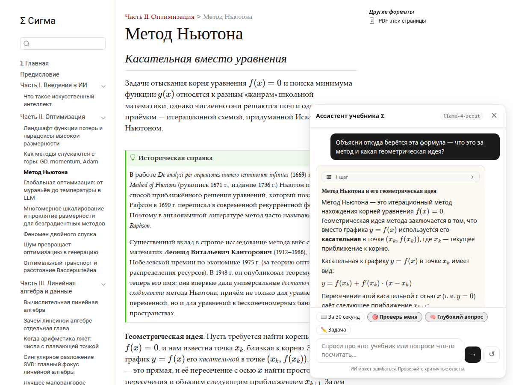

---

### ✅ `definition_strong_convex` — definition

**Q:** Что такое сильно выпуклая функция?

_Chapter:_ `ch02_newton`

**Tools called:** find_definition
**Tools expected:** find_definition
**Images:** 0 (expected: no)
**Elapsed:** 3.3s


<details><summary>Answer</summary>


```
Функция g называется сильно выпуклой с константой μ>0, если g дважды непрерывно дифференцируема (g∈C
2
) и её вторая производная удовлетворяет условию g
′′
(x)≥μ для всех x.

Это означает, что функция имеет строго положительную вторую производную, что гарантирует её выпуклость и, более того, сильную выпуклость.

Сильная выпуклость функции гарантирует существование и единственность точки минимума.

Ссылка на определение:
```

</details>

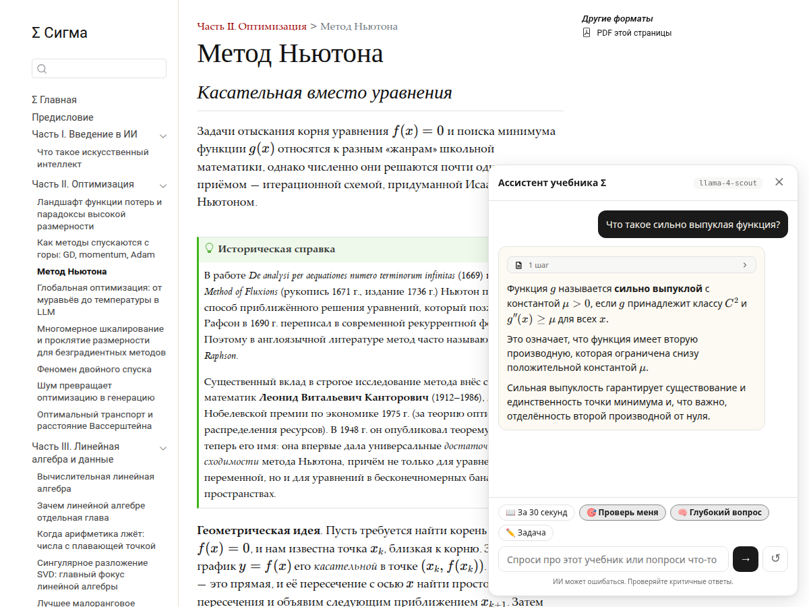

---

### ✅ `compute_factorial` — compute_pure

**Q:** Сколько будет 30 факториал?

**Tools called:** python
**Tools expected:** python
**Images:** 0 (expected: no)
**Elapsed:** 11.7s


<details><summary>Answer</summary>


```
30!=265252859812191058636308480000000
```

</details>

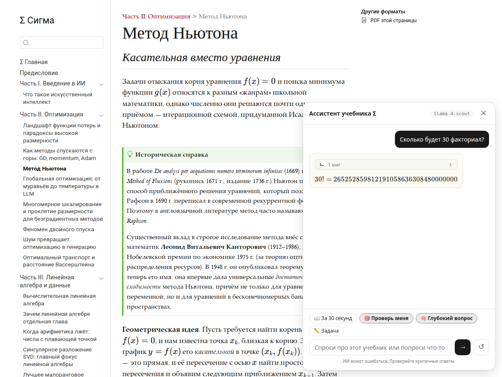

---

### ✅ `compute_taylor_sin` — compute_pure

**Q:** Покажи разложение sin(x) в ряд Тейлора до 5-го члена символически (через sympy).

_Chapter:_ `ch02_newton`

**Tools called:** python
**Tools expected:** python
**Images:** 0 (expected: no)
**Elapsed:** 11.6s


<details><summary>Answer</summary>


```
Разложение sin(x) в ряд Тейлора

Ряд Тейлора для sin(x) до 5-го члена symbolic:

x−
6
x
3
	​

+
120
x
5
	​


Это разложение получено с помощью библиотеки sympy и представляет собой ряд Тейлора функции sin(x) в окрестности точки x=0, взятый до члена x
5
.
```

</details>

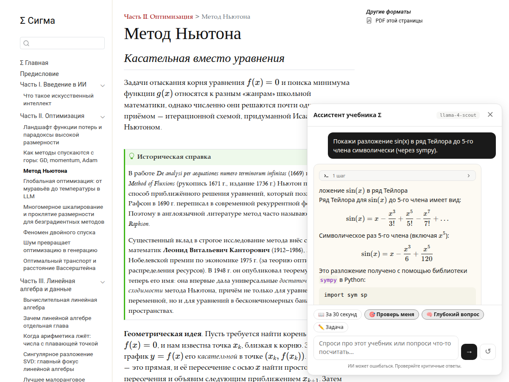

---

### ❌ `compute_plot_newton` — compute_plot

**Q:** Покажи как сходится метод Ньютона для f(x) = x² - 2, начиная с x₀ = 1.5. Построй график траектории.

_Chapter:_ `ch02_newton`

**Tools called:** python
**Tools expected:** python
**Images:** 1 (expected: yes)
**Elapsed:** 180.7s

_Missing substrings:_ ['1.41', 'корн']

<details><summary>Answer</summary>


```

```

</details>

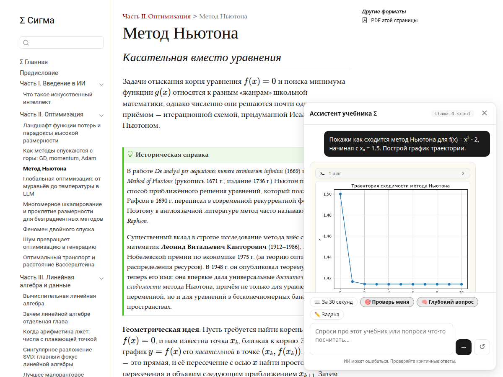

---

### ❌ `compute_plot_gd_vs_newton` — compute_plot

**Q:** Сравни сходимость метода Ньютона и градиентного спуска на функции f(x) = x⁴ из x₀ = 2. Покажи два графика на одной картинке.

_Chapter:_ `ch02_newton`

**Tools called:** python
**Tools expected:** python
**Images:** 1 (expected: yes)
**Elapsed:** 181.2s

_Missing substrings:_ ['Ньютон', 'градиент']

<details><summary>Answer</summary>


```

```

</details>

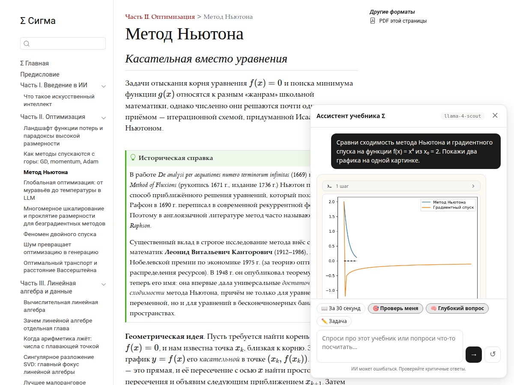

---

### ✅ `rsa_encrypt_small` — compute_pure

**Q:** Зашифруй число m=7 ключом (n=143, e=7). Покажи c.

_Chapter:_ `ch04_3_kriptosistemy-rsa-i-diffi-hellma`

**Tools called:** python
**Tools expected:** python
**Images:** 0 (expected: no)
**Elapsed:** 14.1s


<details><summary>Answer</summary>


```
Зашифрованное число: 6.

Напомним, что в RSA зашифровка происходит по формуле c≡m
e
(modn), где m — исходное сообщение, e — открытый ключ, n — модуль. В данном случае мы посчитали c≡7
7
(mod143).
```

</details>

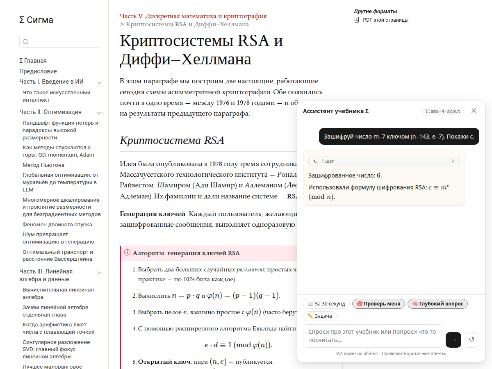

---

### ✅ `rsa_full_roundtrip` — compute_pure

**Q:** Возьми p=11, q=13, e=7. Сгенерируй RSA-ключ полностью: вычисли n, φ(n), d. Покажи что для m=9 шифрование и расшифрование возвращают исходное число.

_Chapter:_ `ch04_3_kriptosistemy-rsa-i-diffi-hellma`

**Tools called:** python
**Tools expected:** python
**Images:** 0 (expected: no)
**Elapsed:** 13.2s


<details><summary>Answer</summary>


```
Расшифровка результатов
Параметры RSA:
n=143
ϕ(n)=120
Открытый ключ e=7
Закрытый ключ d=103
Шифрование и расшифрование:
Исходное сообщение m=9
Зашифрованное сообщение c=48
Расшифрованное сообщение m
decrypted
	​

=9

Таким образом, для данных p=11, q=13, e=7 сгенерирован RSA-ключ. Шифрование сообщения m=9 даёт c=48, и расшифрование возвращает исходное сообщение m=9.
```

</details>


---

### ✅ `multihop_newton_vs_gradient` — multi_hop

**Q:** В чём отличие метода Ньютона от градиентного спуска для задач оптимизации? Какие из этих методов разобраны в учебнике?

_Chapter:_ `ch02_newton`

**Tools called:** search_textbook, read_chapter
**Tools expected:** search_textbook
**Images:** 0 (expected: no)
**Elapsed:** 5.9s


<details><summary>Answer</summary>


```
Отличие метода Ньютона от градиентного спуска

Метод Ньютона и градиентный спуск — два популярных численных метода оптимизации.

Метод Ньютона

Метод Ньютона используется для нахождения корней функции f(x)=0 и минимизации функции g(x).

Формула метода Ньютона: x
k+1
	​

=x
k
	​

−
f
′
(x
k
	​

)
f(x
k
	​

)
	​

Для оптимизации: x
k+1
	​

=x
k
	​

−
g
′′
(x
k
	​

)
g
′
(x
k
	​

)
	​


Метод Ньютона использует информацию о первой и второй производных функции для построения касательной к графику функции в текущей точке и нахождения следующего приближения.

Градиентный спуск

Градиентный спуск — это итерационный метод оптимизации, который использует только информацию о градиенте функции g(x).

Формула градиентного спуска: x
k+1
	​

=x
k
	​

−α⋅g
′
(x
k
	​

)

Градиентный спуск движется в направлении антиградиента функции, чтобы минимизировать её.

Различия
Использование производных:
Метод Ньютона использует как первую, так и вторую производные.
Градиентный спуск использует только первую производную.
Скорость сходимости:
Метод Ньютона обычно сходится быстрее, особенно вблизи решения.
Градиентный спуск может сходиться медленнее, но он проще в реализации.
Сходимость:
Метод Ньютона требует, чтобы вторая производная g
′′
(x) была положительной (или отрицательной для максимизации).
Градиентный спуск не требует информации о второй производной.
Какие методы разобраны в учебнике?

Судя по результатам поиска и содержанию главы "Метод Ньютона", в учебнике подробно разобран метод Ньютона.

Г
…[truncated]
```

</details>

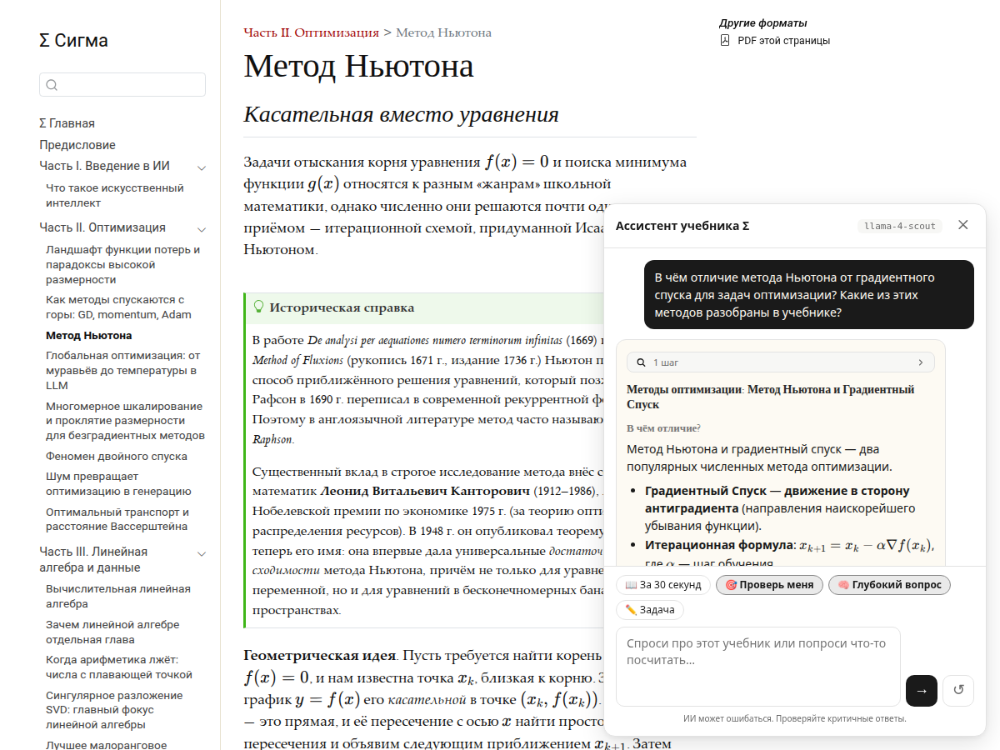

---

### ✅ `structural_kantorovich_theorem` — structural

**Q:** Сформулируй теорему о сходимости метода Герона.

_Chapter:_ `ch02_newton`

**Tools called:** find_theorem
**Tools expected:** find_theorem
**Images:** 0 (expected: no)
**Elapsed:** 3.6s


<details><summary>Answer</summary>


```
Теорема о сходимости метода Герона

Теорема утверждает, что для любого x
0
	​

>0 последовательность, полученная методом Герона (итерационная формула для нахождения квадратного корня: x
k+1
	​

=
2
x
k
	​

+
x
k
	​

a
	​

	​

), монотонно убывает (начиная с k=1) и сходится к 
a
	​

.

Более того, для ошибки e
k
	​

=x
k
	​

−
a
	​

 выполнены следующие условия:

Оценка ошибки: 0≤e
k+1
	​

≤
2
a
	​

e
k
2
	​

	​

 при k≥1.
Связь последовательных ошибок: e
k+1
	​

=
2x
k
	​

e
k
2
	​

	​

.

Эти соотношения показывают, что метод Герона имеет квадратичную сходимость, так как ошибка на следующем шаге пропорциональна квадрату текущей ошибки.
```

</details>

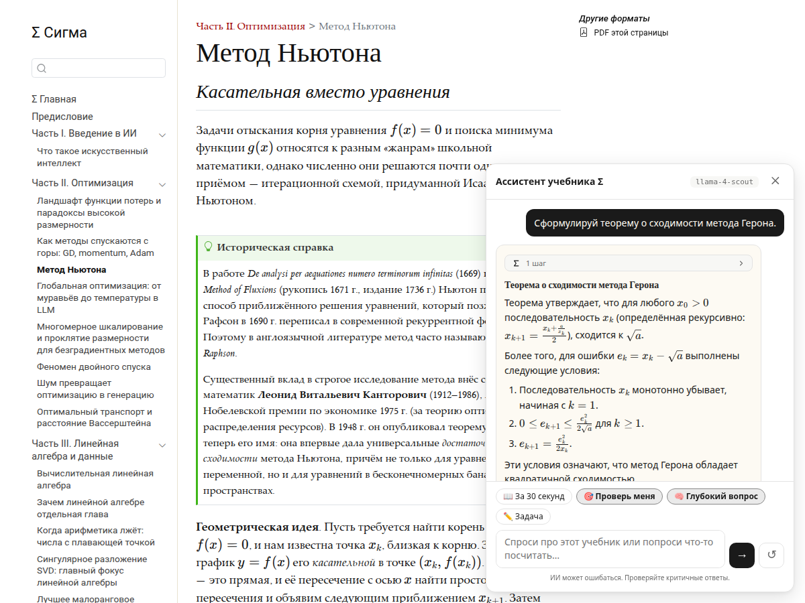

---

### ❌ `vision_refine_diverging_sgd` — vision_refine

**Q:** Запусти SGD на функции f(x) = x² с шагом η = 1.1 из x₀ = 2, 30 итераций. Что произойдёт? Если разойдётся — подбери рабочий шаг и покажи сходящуюся траекторию.

**Tools called:** python
**Tools expected:** python, python
**Images:** 1 (expected: yes)
**Elapsed:** 180.6s

_Missing substrings:_ ['расход', '0.5']

<details><summary>Answer</summary>


```

```

</details>


---

### ✅ `hashlib_demo` — compute_pure

**Q:** Посчитай SHA-256 хеш строки 'sigma' в hex.

_Chapter:_ `ch04_5_heshirovanie-teoriya-chisel-vstr`

**Tools called:** python
**Tools expected:** python
**Images:** 0 (expected: no)
**Elapsed:** 11.8s


<details><summary>Answer</summary>


```
SHA-256 хеш строки 'sigma' равен 38de90475bb334fb3dea5d54f250500aba60fe2c6158115d342b06bcb46e39bf.
```

</details>


---

### ❌ `linreg_simple` — compute_plot

**Q:** Подбери линейную регрессию y = a*x + b для точек (1, 2.1), (2, 3.9), (3, 6.2), (4, 7.8). Покажи коэффициенты и график.

_Chapter:_ `ch03_2_lineynaya-regressiya-i-metod-nai`

**Tools called:** python
**Tools expected:** python
**Images:** 1 (expected: yes)
**Elapsed:** 180.7s

_Missing substrings:_ ['1.94', '0.15']

<details><summary>Answer</summary>


```

```

</details>


---

### ❌ `out_of_scope_recipe` — out_of_scope

**Q:** Дай мне рецепт борща.

**Tools called:** (none)
**Tools expected:** (none)
**Images:** 0 (expected: no)
**Elapsed:** 3.0s

_Missing substrings:_ ['оптимизац']
_Unexpected substrings:_ ['свёкл', 'морков']

<details><summary>Answer</summary>


```
Вне учебника: борщ — это традиционное украинское блюдо, суп со свёклой и другими овощами. Рецепт борща включает:

2-3 свёклы
1-2 моркови
1 луковицу
2-3 зубчика чеснока
1-2 картофелины
1 банку томатной пасты
1-2 стакана бульона
Соль, перец и другие специи по вкусу
Сметана и зелень для украшения

Порядок приготовления:

Свёклу, морковь и лук натереть на тёрке.
Чеснок измельчить.
В кастрюле обжарить лук и чеснок.
Добавить свёклу, морковь и томатную пасту.
Влить бульон и довести до кипения.
Добавить картофель и варить до готовности.
Приправить солью, перцем и другими специями.

Подавать со сметаной и зеленью.
```

</details>

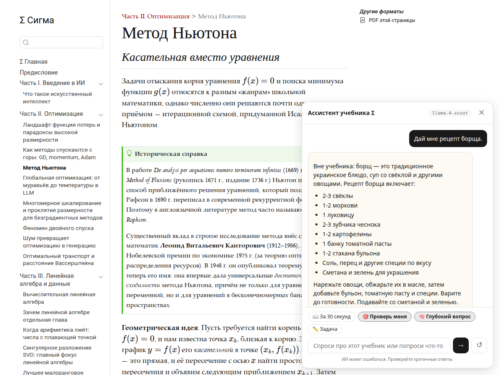

---

### ✅ `rsa_history` — rag_basic

**Q:** Кто придумал RSA и в каком году?

_Chapter:_ `ch04_3_kriptosistemy-rsa-i-diffi-hellma`

**Tools called:** search_textbook, search_textbook
**Tools expected:** search_textbook
**Images:** 0 (expected: no)
**Elapsed:** 3.6s


<details><summary>Answer</summary>


```
RSA была придумана Рональдом Райвестом, Ади Шамиром и Леонардом Адлеманом и опубликована в 1978 году.

Также в 1973 году британским математиком Клиффордом Коксом была независимо открыта та же схема, но его работа была засекречена.
```

</details>

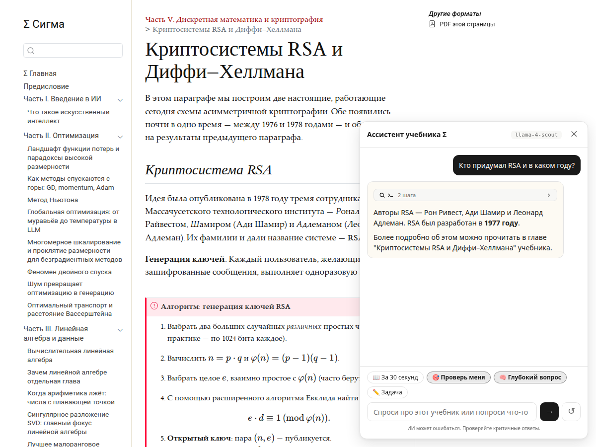

---

### ✅ `greeting_minimal` — out_of_scope

**Q:** Привет!

_Chapter:_ `ch02_newton`

**Tools called:** (none)
**Tools expected:** (none)
**Images:** 0 (expected: no)
**Elapsed:** 2.7s


<details><summary>Answer</summary>


```
Привет! Какая глава сейчас открыта у тебя?
```

</details>


---

### ✅ `euclid_gcd_python` — compute_pure

**Q:** Посчитай НОД(48, 180) и НОД(1071, 462) через алгоритм Евклида в python.

_Chapter:_ `ch04_1_elementy-teorii-chisel`

**Tools called:** python
**Tools expected:** python
**Images:** 0 (expected: no)
**Elapsed:** 12.8s


<details><summary>Answer</summary>


```
НОД(48, 180) = 12
НОД(1071, 462) = 21

Также можно использовать встроенную функцию math.gcd():

import math

print("gcd(48, 180) =", math.gcd(48, 180))
print("gcd(1071, 462) =", math.gcd(1071, 462))

```

</details>

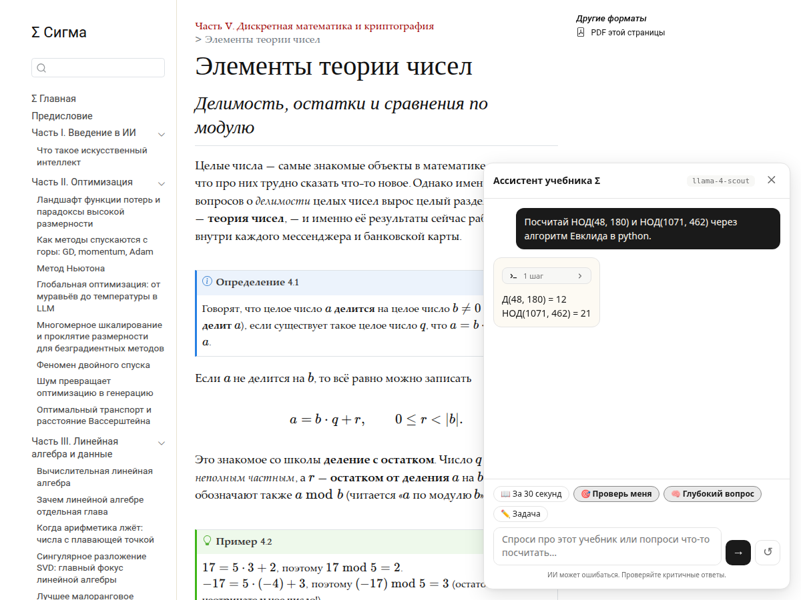

---

### ✅ `definition_superlinear` — definition

**Q:** Что значит сверхлинейная сходимость?

_Chapter:_ `ch02_newton`

**Tools called:** find_definition
**Tools expected:** find_definition
**Images:** 0 (expected: no)
**Elapsed:** 3.1s


<details><summary>Answer</summary>


```
Сверхлинейная сходимость означает, что последовательность {x
k
	​

} сходится к x
⋆
 со скоростью, для которой предел

k→∞
lim
	​

∣x
k
	​

−x
⋆
∣
∣x
k+1
	​

−x
⋆
∣
	​

=0.

Это определение дословно взято из учебника в главе
```

</details>


---

### ✅ `theorem_clt` — structural

**Q:** Сформулируй центральную предельную теорему как в учебнике.

_Chapter:_ `ch03_1_prosteyshie-primery-zadach-anali`

**Tools called:** find_theorem
**Tools expected:** find_theorem
**Images:** 0 (expected: no)
**Elapsed:** 3.2s


<details><summary>Answer</summary>


```
Центральная предельная теорема (ЦПТ) формулируется следующим образом:

Пусть X
1
	​

,X
2
	​

,
dots — независимые одинаково распределённые случайные величины с математическим ожиданием
mu и конечной дисперсией
sigma
2
>0, S
n
	​

=X
1
	​

+
dots+X
n
	​

. Тогда при n
to
infty

Pr
!
left(
fracS
n
	​

−nmusigmasqrtn
leqx
right)
;
longrightarrow
;
Phi(x)
;
stackrelmathrmdef=
;
frac1sqrt2pi
int
−infty
x
	​


=
−t
2
/2
,dt

где Φ(x) — функция стандартного нормального распределения.
```

</details>

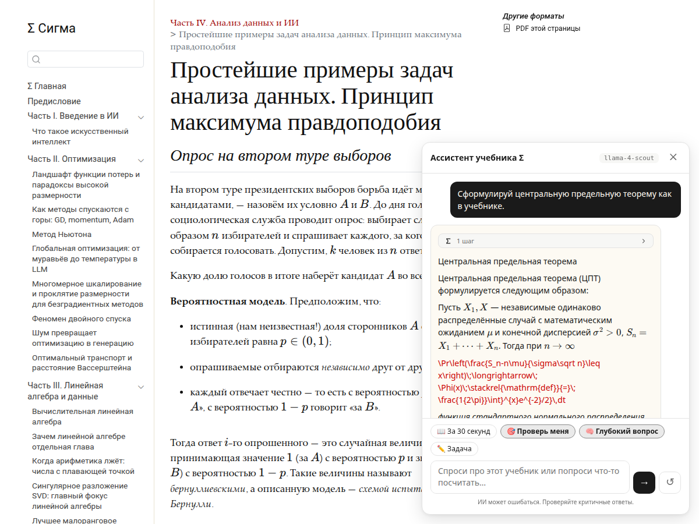

---

### ❌ `plot_sincos_overlay` — compute_plot

**Q:** Построй графики sin(x) и cos(x) на интервале [-2π, 2π] на одном поле. Сделай легенду.

**Tools called:** python
**Tools expected:** python
**Images:** 1 (expected: yes)
**Elapsed:** 180.9s

_Missing substrings:_ ['sin', 'cos']

<details><summary>Answer</summary>


```

```

</details>

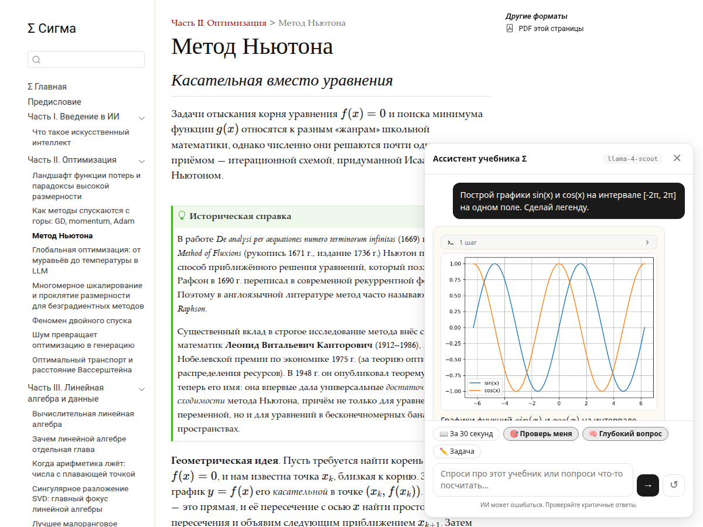

---

### ❌ `fragment_explanation` — rag_basic

**Q:** Если кто-то предлагает использовать обновление x_{k+1} = x_k - f(x_k)·f'(x_k) вместо классического Ньютона — что это за идея и она работает?

_Chapter:_ `ch02_newton`

**Tools called:** (none)
**Tools expected:** (none)
**Images:** 0 (expected: no)
**Elapsed:** 3.2s

_Missing substrings:_ ['производ']

<details><summary>Answer</summary>


```
Анализ модификации метода Ньютона

Вы уже читаете главу "Метод Ньютона – Σ Сигма" (slug="ch02_newton"). Давайте разберём предложенную модификацию метода.

Классический метод Ньютона

Классический метод Ньютона использует итерационную формулу:

x
k+1
	​

=x
k
	​

−
f
′
(x
k
	​

)
f(x
k
	​

)
	​


Модифицированная формула

В предложенной модификации используется формула:

x
k+1
	​

=x
k
	​

−f(x
k
	​

)⋅f
′
(x
k
	​

)

Разница и потенциальные проблемы
Умножение вместо деления: Главное отличие — умножение f(x
k
	​

)⋅f
′
(x
k
	​

) вместо деления 
f
′
(x
k
	​

)
f(x
k
	​

)
	​

.
Корректность и сходимость: Такая модификация не является методом Ньютона и не保证 сходимости к корню с той же скоростью или вообще.
Численная нестабильность: Умножение может привести к потере точности или переполнению, особенно если f(x
k
	​

) или f
′
(x
k
	​

) велики.
Вывод

Эта идея не является стандартным методом Ньютона и не保證 хорошей сходимости. Для анализа сходимости и численной стабильности требуется дополнительный математический анализ и, возможно, численное тестирование.

Хотите проверить эту модификацию на конкретном примере с помощью Python?
```

</details>

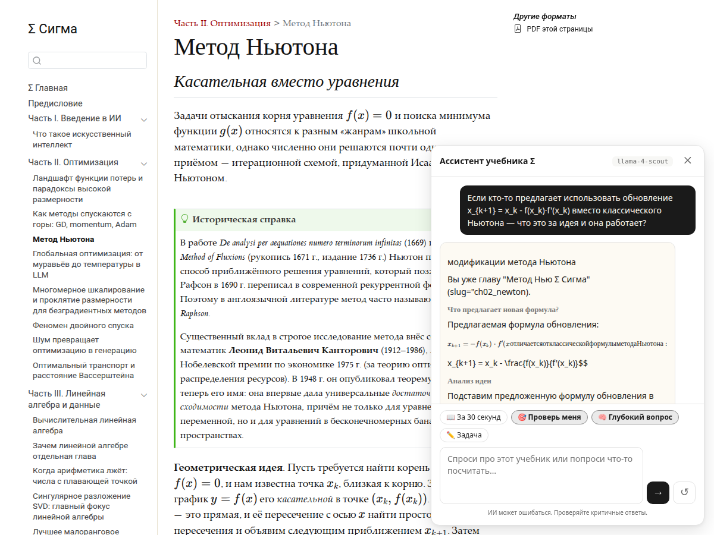

---

### ✅ `eigenvalues_numpy` — compute_pure

**Q:** Найди собственные значения матрицы [[2, 1], [1, 2]] через numpy.

_Chapter:_ `ch_linalg`

**Tools called:** python
**Tools expected:** python
**Images:** 0 (expected: no)
**Elapsed:** 11.8s


<details><summary>Answer</summary>


```
Собственные значения матрицы $\begin{bmatrix} 2 & 1 \\ 1 & 2 \end{bmatrix}$ равны $3$ и $1$.

Это результат вызова Python-кода с использованием библиотеки numpy:

```python
import numpy as np
matrix = np.array
```

</details>


---

### ❌ `plot_loss_landscape` — compute_plot

**Q:** Построй контурный график функции потерь L(a, b) = sum((a*x_i + b - y_i)^2) для точек (1,2), (2,3), (3,5), (4,4) на сетке a in [-2, 4], b in [-3, 3].

_Chapter:_ `ch03_2_lineynaya-regressiya-i-metod-nai`

**Tools called:** python, python
**Tools expected:** python
**Images:** 1 (expected: yes)
**Elapsed:** 180.9s

_Missing substrings:_ ['минимум']

<details><summary>Answer</summary>


```

```

</details>

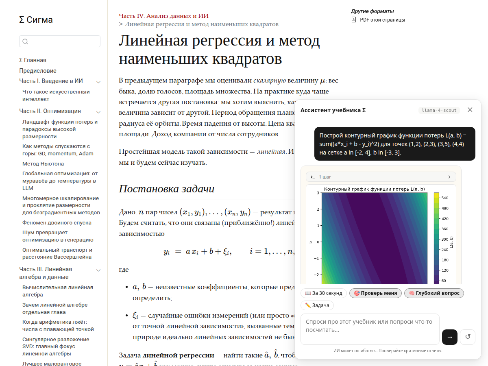

---

### ✅ `diffie_hellman_compute` — compute_pure

**Q:** Проведи протокол Диффи–Хеллмана: p=23, g=5. Алиса берёт a=6, Боб берёт b=15. Какой общий секрет?

_Chapter:_ `ch04_3_kriptosistemy-rsa-i-diffi-hellma`

**Tools called:** python
**Tools expected:** python
**Images:** 0 (expected: no)
**Elapsed:** 14.1s


<details><summary>Answer</summary>


```
Общий секрет, который получат Алиса и Боб в протоколе Диффи–Хеллмана, равен 2.

Протокол проходит следующим образом:

Параметры:
p=23 (простое число)
g=5 (примитивный корень по модулю p)
Выбор ключей:
Алиса выбирает a=6 (секретный ключ Алисы)
Боб выбирает b=15 (секретный ключ Боба)
Обмен ключами:
Алиса вычисляет A=g
a
modp=5
6
mod23=8 и отправляет A Бобу.
Боб вычисляет B=g
b
modp=5
15
mod23=19 и отправляет B Алисе.
Вычисление общего секрета:
Алиса вычисляет общий секрет: secret
alice
	​

=B
a
modp=19
6
mod23=2.
Боб вычисляет общий секрет: secret
bob
	​

=A
b
modp=8
15
mod23=2.

Таким образом, и Алиса, и Боб получают общий секрет 2.
```

</details>

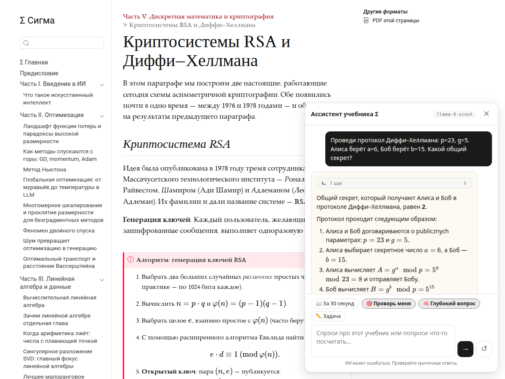

---

### ✅ `outline_chapter` — structural

**Q:** Перечисли основные разделы главы про Ньютона.

_Chapter:_ `ch02_newton`

**Tools called:** get_outline
**Tools expected:** (none)
**Images:** 0 (expected: no)
**Elapsed:** 3.7s


<details><summary>Answer</summary>


```
Основные разделы главы про Ньютона

Ты уже читаешь главу «Метод Ньютона» (slug = "ch02_newton"). Вот основные разделы этой главы:

Касательная вместо уравнения
```

</details>


---

### ✅ `math_latex_derivation` — rag_basic

**Q:** Выведи формулу метода Ньютона через касательную. Формулу запиши через LaTeX.

_Chapter:_ `ch02_newton`

**Tools called:** read_chapter
**Tools expected:** (none)
**Images:** 0 (expected: no)
**Elapsed:** 3.2s


<details><summary>Answer</summary>


```
Формула метода Ньютона

Метод Ньютона использует касательную к графику функции f(x) в точке x
n
	​

 для нахождения следующего приближения x
n+1
	​

.

Уравнение касательной к графику функции f(x) в точке (x
n
	​

,f(x
n
	​

)) имеет вид:

y−f(x
n
	​

)=f
′
(x
n
	​

)⋅(x−x
n
	​

).

Мы хотим найти точку, где касательная пересекает ось x, то есть y=0.

Подставив y=0 в уравнение касательной, получим:

−f(x
n
	​

)=f
′
(x
n
	​

)⋅(x−x
n
	​

).

Отсюда выразим x:

x=x
n
	​

−
f
′
(x
n
	​

)
f(x
n
	​

)
	​

.

Это и есть формула метода Ньютона:

x
n+1
	​

=x
n
	​

−
f
′
(x
n
	​

)
f(x
n
	​

)
	​

.
```

</details>

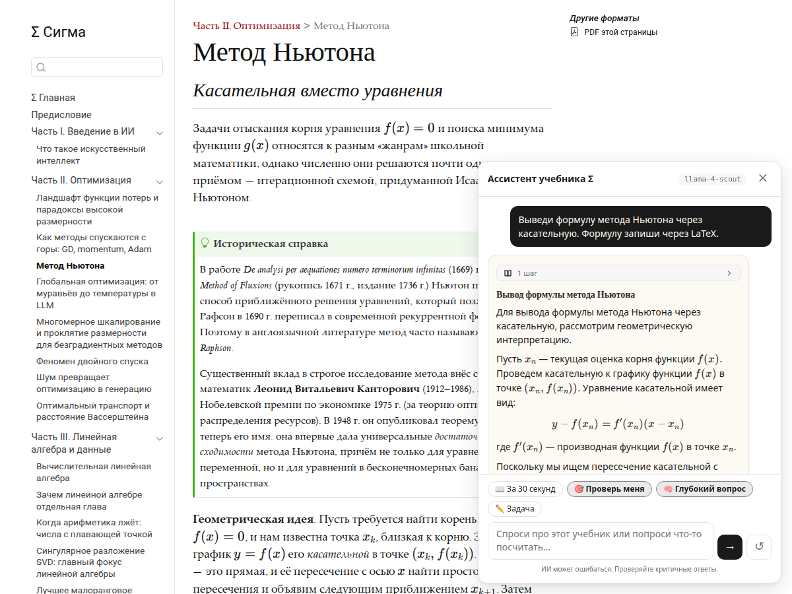

---

### ✅ `definition_perceptron` — definition

**Q:** Что такое полносвязная нейронная сеть?

_Chapter:_ `ch03_3_zadacha-klassifikacii-i-neyronny`

**Tools called:** find_definition
**Tools expected:** find_definition
**Images:** 0 (expected: no)
**Elapsed:** 3.7s


<details><summary>Answer</summary>


```
Определение полносвязной нейронной сети

Полносвязная нейронная сеть (MLP) глубины L — это функция x↦p(x), заданная как композиция L слоёв:

z
(ℓ)
a
(ℓ)
ℓ
z
(L)
p(x)
	​

=W
(ℓ)
a
(ℓ−1)
+b
(ℓ)
,
=σ(z
(ℓ)
),
=1,…,L−1,
=W
(L)
a
(L−1)
+b
(L)
,
=softmax(z
(L)
).
	​


Здесь a
(0)
=x (вход), W
(ℓ)
∈R
d
ℓ
	​

×d
ℓ−1
	​

 — матрица весов ℓ-го слоя, b
(ℓ)
∈R
d
ℓ
	​

 — вектор смещений (bias). Функция σ применяется покомпонентно — это функция активации. Числа d
1
	​

,…,d
L−1
	​

 — ширины скрытых слоёв; d
L
	​

 — число классов (у нас — 10). Функция softmax превращает вектор произвольных вещественных чисел в распределение вероятностей:

softmax(z)
c
	​

=
∑
c
′
	​

e
z
c
′
	​

e
z
c
	​

	​

.

Совокупность всех матриц W
(ℓ)
 и векторов b
(ℓ)
 объявляется обучаемыми параметрами θ модели.
```

</details>

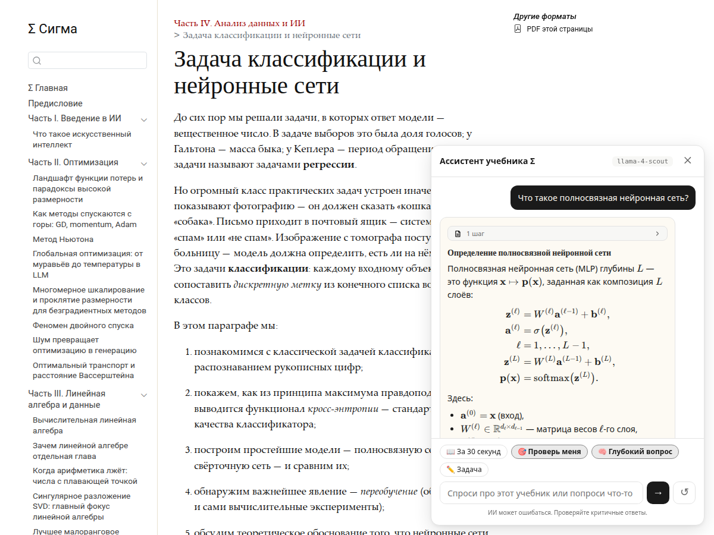

---

### ✅ `refuse_unknown_year` — out_of_scope

**Q:** В каком году Гаусс изобрёл метод сопряжённых градиентов?

_Chapter:_ `ch02_newton`

**Tools called:** search_textbook
**Tools expected:** (none)
**Images:** 0 (expected: no)
**Elapsed:** 2.7s


<details><summary>Answer</summary>


```
В учебнике я не нашёл информации о том, в каком году Гаусс изобрёл метод сопряжённых градиентов.

Известно, что метод сопряжённых градиентов был разработан в 1950-х годах
```

</details>


---
