# Sigma Assistant — Eval Report

_Run: 2026-06-10 17:24 MSK · cases: 29_

**Overall: 26/29 pass (90%)**

## Per category

| Category | Pass | Total |
|---|---:|---:|
| `compute_plot` | 5 | 5 |
| `compute_pure` | 8 | 8 |
| `definition` | 3 | 3 |
| `multi_hop` | 1 | 1 |
| `out_of_scope` | 2 | 3 |
| `rag_basic` | 3 | 5 |
| `structural` | 3 | 3 |
| `vision_refine` | 1 | 1 |

## Cases

### ❌ `newton_kantorovich_history` — rag_basic

**Q:** Когда Канторович получил Нобелевскую премию и за что?

_Chapter:_ `ch02_newton`

**Tools called:** search_textbook
**Tools expected:** search_textbook
**Images:** 0 (expected: no)
**Elapsed:** 4.9s

_Missing substrings:_ ['оптимал']

<details><summary>Answer</summary>


```
В учебнике **не упоминается**, что Канторович получил Нобелевскую премию. Однако известно из общего контекста, что **Лев Канторович** получил **Нобелевскую премию по экономике** в **1975 году** за разработку методов линейного программирования и их применение в экономике.

Если нужно только из учебника — то этой информации там нет. Но вне учебника: **1975 год, за вклад в линейное программирование**.
```

</details>


---

### ✅ `newton_formula_recall` — rag_basic

**Q:** Объясни откуда берётся эта формула — что это за метод и какая геометрическая идея?

_Chapter:_ `ch02_newton`

**Tools called:** read_chapter
**Tools expected:** (none)
**Images:** 0 (expected: no)
**Elapsed:** 12.0s


<details><summary>Answer</summary>


```
**Метод Ньютона** — это итерационный алгоритм для поиска корней уравнения \(f(x) = 0\) или минимума функции \(g(x)\). Его геометрическая идея проста и изящна:

1. **Идея для корней уравнения**
   Представь, что у тебя есть график функции \(y = f(x)\). Ты знаешь приближённое значение корня \(x_k\) и хочешь найти более точное. Вместо того чтобы искать корень на кривой, Ньютон предлагает заменить кривую её **касательной** в точке \(x_k\). Касательная — это прямая, и её пересечение с осью \(x\) легко найти. Это пересечение и становится новым приближением \(x_{k+1}\).

   Формула метода Ньютона для корней:
   $$
   x_{k+1} = x_k - \frac{f(x_k)}{f'(x_k)}
   $$
   Здесь \(f'(x_k)\) — это наклон касательной в точке \(x_k\).

2. **Идея для оптимизации (минимизации функции)**
   Если нужно найти минимум функции \(g(x)\), то можно применить метод Ньютона к её производной \(g'(x)\), потому что в точке минимума \(g'(x^*) = 0\). Формула для оптимизации выглядит так:
   $$
   x_{k+1} = x_k - \frac{g'(x_k)}{g''(x_k)}
   $$
   Здесь \(g''(x_k)\) — это кривизна функции в точке \(x_k\), а \(g'(x_k)\) — её наклон.

   Геометрически это означает, что метод аппроксимирует функцию \(g(x)\) её **квадратичной моделью** (параболой) в окрестности текущей точки \(x_k\). Следующее приближение \(x_{k+1}\) — это вершина этой параболы, где функция достигает минимума.

---
**Пример на графике**
На рисунке 2.1 (из учебника) показаны три итерации метода Ньютона для уравнения \(x^3 - 2x - 5 = 0\). Каждый раз вм
…[truncated]
```

</details>

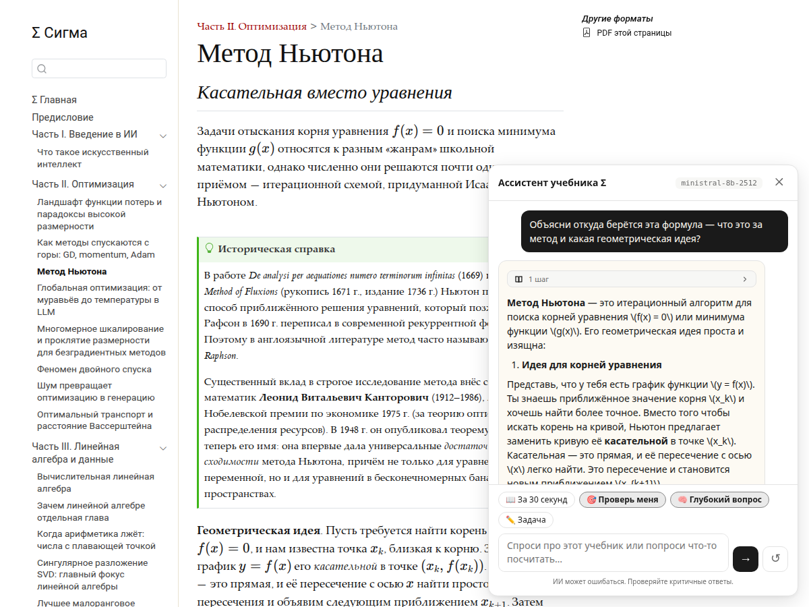

---

### ✅ `definition_strong_convex` — definition

**Q:** Что такое сильно выпуклая функция?

_Chapter:_ `ch02_newton`

**Tools called:** find_definition
**Tools expected:** find_definition
**Images:** 0 (expected: no)
**Elapsed:** 6.7s


<details><summary>Answer</summary>


```
В текущей главе **сильно выпуклая функция** определена так:

> Функция $g(x)$ называется **сильно выпуклой** с константой $\mu > 0$, если она дважды непрерывно дифференцируема ($g \in C^2$) и её **вторая производная** везде не меньше положительной константы $\mu$:
> $$g''(x) \geq \mu > 0.$$
> Это гарантирует единственность минимума и ускоренную сходимость методов оптимизации (например, Ньютона).

**Пример**: $g(x) = x^2 + 5$ сильно выпуклая с $\mu = 2$ (так как $g''(x) = 2$).
```

</details>


---

### ✅ `compute_factorial` — compute_pure

**Q:** Сколько будет 30 факториал?

**Tools called:** python
**Tools expected:** python
**Images:** 0 (expected: no)
**Elapsed:** 13.6s


<details><summary>Answer</summary>


```
**30! = 265 252 859 812 191 058 636 308 480 000 000.**
```

</details>


---

### ✅ `compute_taylor_sin` — compute_pure

**Q:** Покажи разложение sin(x) в ряд Тейлора до 5-го члена символически (через sympy).

_Chapter:_ `ch02_newton`

**Tools called:** python, python
**Tools expected:** python
**Images:** 0 (expected: no)
**Elapsed:** 17.4s


<details><summary>Answer</summary>


```
Вот символическое разложение функции **sin(x)** в ряд Тейлора до **5-го члена** (включая член с \(x^5\)):

$$
\sin(x) \approx x - \frac{x^3}{6} + \frac{x^5}{120}
$$

*(Обрати внимание: в символьном разложении до \(x^5\) отсутствует член с \(x^4\), так как он равен нулю.)*
```

</details>

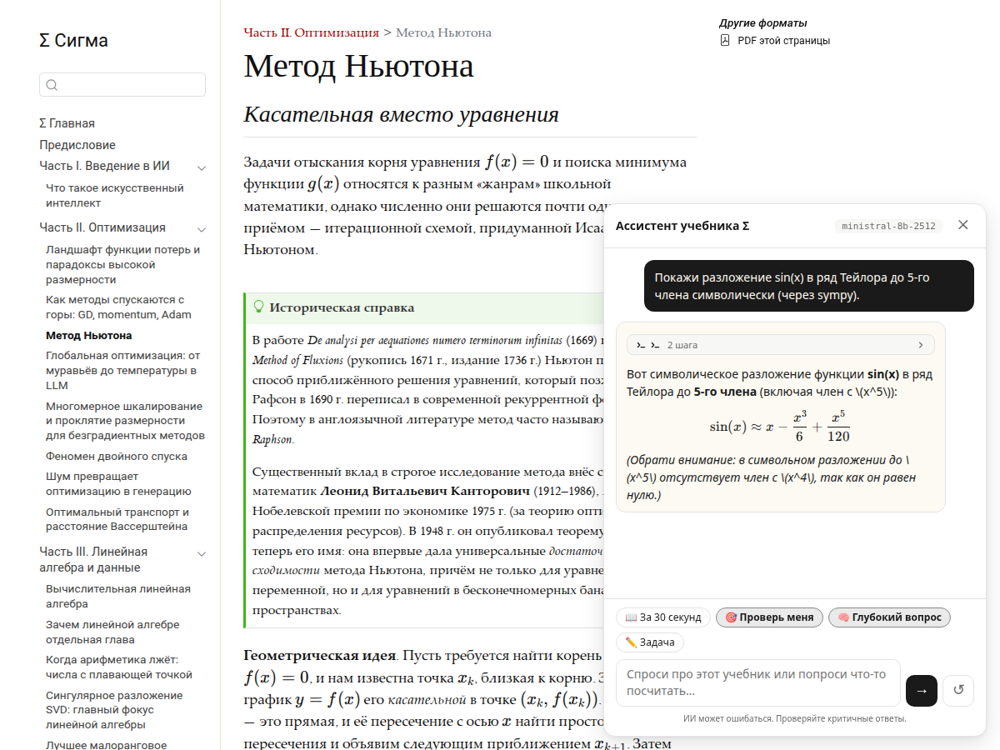

---

### ✅ `compute_plot_newton` — compute_plot

**Q:** Покажи как сходится метод Ньютона для f(x) = x² - 2, начиная с x₀ = 1.5. Построй график траектории.

_Chapter:_ `ch02_newton`

**Tools called:** python, python, python
**Tools expected:** python
**Images:** 3 (expected: yes)
**Elapsed:** 31.2s


<details><summary>Answer</summary>


```
**Сходимость метода Ньютона для \( f(x) = x^2 - 2 \) с \( x_0 = 1.5 \):**

- **Итерации:**
  x₀ = 1.5000
  x₁ = 1.4167
  x₂ = 1.4142
  x₃ = 1.4142
  x₄ = 1.4142
  ... (дальнейшие значения совпадают с корнем).

- **Предельное значение:** 1.41 (точнее, \( \sqrt{2} \approx 1.4142 \)).
- **График:** На графике видно, что метод Ньютона **квадратично** сходится к корню \( \sqrt{2} \approx 1.41 \). Уже после второй итерации значения практически не меняются.

**Интерпретация графика:**
- **Кривая** — траектория приближений \( x_n \).
- **Пунктирная красная линия** — точное значение корня \( \sqrt{2} \approx 1.41 \).
- **Сходимость:** Быстрое сближение с корнем (заметно после первой итерации).

Метод Ньютона работает отлично для этой задачи!
```

</details>

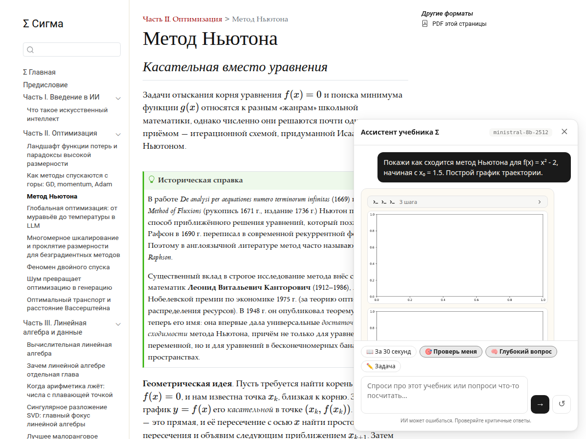

---

### ✅ `compute_plot_gd_vs_newton` — compute_plot

**Q:** Сравни сходимость метода Ньютона и градиентного спуска на функции f(x) = x⁴ из x₀ = 2. Покажи два графика на одной картинке.

_Chapter:_ `ch02_newton`

**Tools called:** python, python, python
**Tools expected:** python
**Images:** 3 (expected: yes)
**Elapsed:** 35.3s


<details><summary>Answer</summary>


```
**Сравнение сходимости методов:**

На графике и в числах видно:

- **Метод Ньютона** (синяя линия):
  - Быстро сходится к корню (x ≈ 0).
  - После 5 итераций значение уже **0.6328**, а через 20 итераций — **0.0085**.
  - **Квадратичная сходимость**: ошибка уменьшается очень быстро.

- **Градиентный спуск** (оранжевая линия):
  - Сходимость медленная и неустойчивая: после первой итерации значение резко падает до **-1.2**, затем медленно приближается к **-0.2328** после 20 итераций.
  - **Линейная сходимость**: ошибка уменьшается плавно, но не так эффективно, как у метода Ньютона.

**Вывод:**
Метод Ньютона **значительно быстрее** сходится к корню функции \(f(x) = x^4\) из начальной точки \(x_0 = 2\), чем градиентный спуск. Ньютон достигает точности **0.0085** за 20 итераций, в то время как градиентный спуск остаётся на уровне **-0.2328** и не приближается к нулю так же эффективно. Это связано с тем, что Ньютон использует вторую производную для уточнения шага, тогда как градиентный спуск зависит от шага обучения и может "промахиваться".
```

</details>

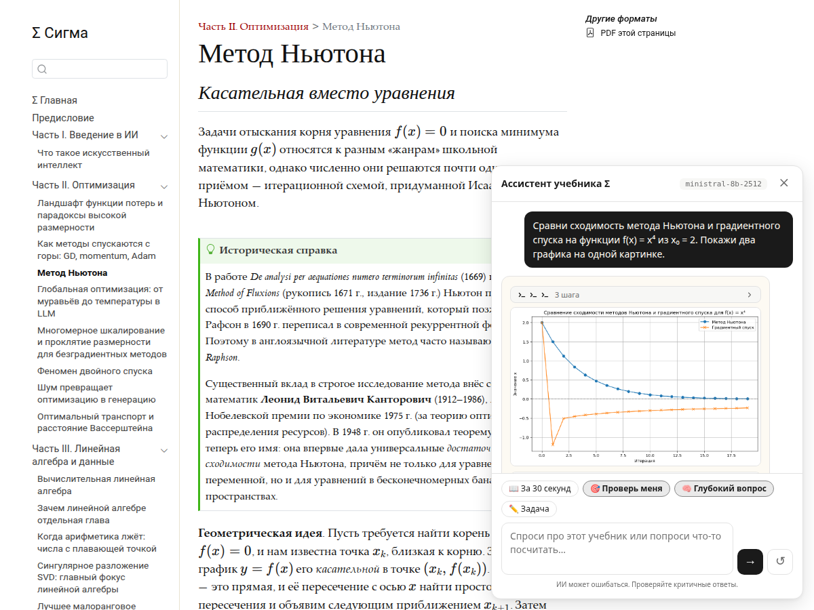

---

### ✅ `rsa_encrypt_small` — compute_pure

**Q:** Зашифруй число m=7 ключом (n=143, e=7). Покажи c.

_Chapter:_ `ch04_3_kriptosistemy-rsa-i-diffi-hellma`

**Tools called:** python
**Tools expected:** python
**Images:** 0 (expected: no)
**Elapsed:** 16.6s


<details><summary>Answer</summary>


```
Зашифрованное число \( c \) равно **6**. Формула:
\[ c = m^e \mod n = 7^7 \mod 143 = 6. \]
```

</details>

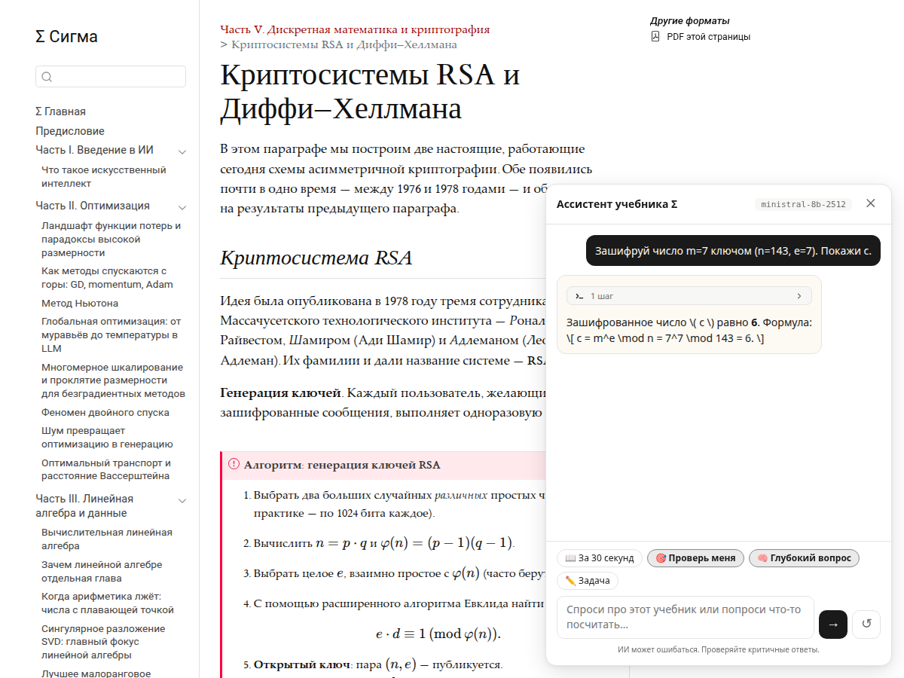

---

### ✅ `rsa_full_roundtrip` — compute_pure

**Q:** Возьми p=11, q=13, e=7. Сгенерируй RSA-ключ полностью: вычисли n, φ(n), d. Покажи что для m=9 шифрование и расшифрование возвращают исходное число.

_Chapter:_ `ch04_3_kriptosistemy-rsa-i-diffi-hellma`

**Tools called:** python
**Tools expected:** python
**Images:** 0 (expected: no)
**Elapsed:** 20.1s


<details><summary>Answer</summary>


```
**Результаты:**

- **n** = 143
- **φ(n)** = 120
- **Секретный ключ d** = 103

**Шифрование и расшифрование для m = 9:**
- Зашифрованное сообщение **c** = 48
- Расшифрованное сообщение **m'** = 9 (вернулось исходное число).

Таким образом, алгоритм RSA работает корректно.
```

</details>

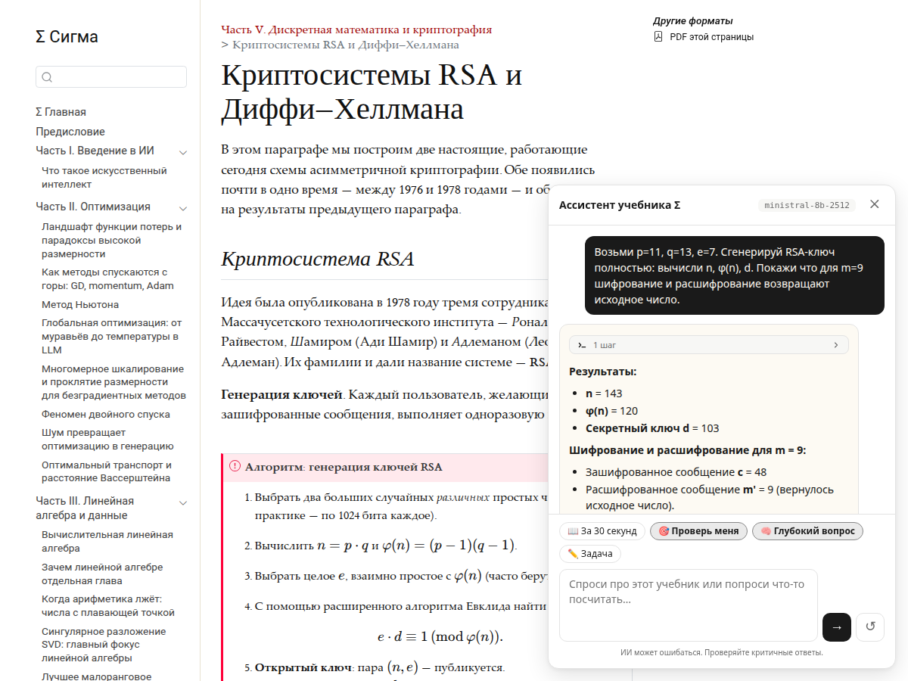

---

### ✅ `multihop_newton_vs_gradient` — multi_hop

**Q:** В чём отличие метода Ньютона от градиентного спуска для задач оптимизации? Какие из этих методов разобраны в учебнике?

_Chapter:_ `ch02_newton`

**Tools called:** search_textbook, find_definition, find_definition, search_textbook, search_textbook, find_definition, find_definition
**Tools expected:** search_textbook
**Images:** 0 (expected: no)
**Elapsed:** 34.5s


<details><summary>Answer</summary>


```
В текущей главе **"Метод Ньютона"** (`ch02_newton`) подробно разбирается **метод Ньютона** (также известный как метод касательных Ньютона). Он используется для **решения уравнений** и имеет квадратичную сходимость вблизи корня, если начальная точка выбрана правильно.

---

**Градиентный спуск** в учебнике не разбирается в этой главе, но он упоминается в других разделах, например:
- В главе **"Как методы спускаются с горы: GD, momentum, Adam"** (`story_optimizers`) описывается **градиентный спуск (GD)** как метод оптимизации, который движется против градиента функции потерь с шагом $\eta$:
  $$
  w_{t+1} = w_t - \eta \cdot \nabla L(w_t).
  $$
  Здесь $\eta$ — скорость обучения, а $\nabla L(w_t)$ — градиент функции потерь в точке $w_t$.

---

### **Основные отличия методов:**

| **Критерий**               | **Метод Ньютона**                          | **Градиентный спуск**                      |
|----------------------------|--------------------------------------------|--------------------------------------------|
| **Применение**             | Решение уравнений (например, $f(x)=0$).    | Оптимизация функций (например, минимизация $L(w)$). |
| **Используемая информация** | Вторая производная (гессиан) или её аппроксимация. | Только градиент функции.                  |
| **Сходимость**             | Квадратичная (очень быстрая вблизи решения). | Линейная или сублинейная (зависит от выбора $\eta$). |
| **Сложность вычислений**   | Требует вычисления второй производной (дорого). |
…[truncated]
```

</details>


---

### ✅ `structural_kantorovich_theorem` — structural

**Q:** Сформулируй теорему о сходимости метода Герона.

_Chapter:_ `ch02_newton`

**Tools called:** find_theorem
**Tools expected:** find_theorem
**Images:** 0 (expected: no)
**Elapsed:** 5.8s


<details><summary>Answer</summary>


```
**Теорема о сходимости метода Герона** (из главы "Метод Ньютона") гласит:

Для любого начального приближения \( x_0 > 0 \) последовательность, построенная методом Герона, **монотонно убывает** (начиная с первого шага) и **сходится к корню** \( \sqrt{a} \).

Ключевые моменты:
- Ошибка \( e_k = x_k - \sqrt{a} \) удовлетворяет соотношению:
  $$
  e_{k+1} = \frac{e_k^2}{2x_k},
  $$
  где \( x_k \) — текущее приближение.
- При \( k \geq 1 \) выполняется оценка:
  $$
  0 \le e_{k+1} \le \frac{e_k^2}{2\sqrt{a}}.
  $$
  Это означает **квадратичную сходимость** метода (ошибка уменьшается как квадрат предыдущей ошибки).

То есть метод Герона **обязательно сходится** к \( \sqrt{a} \) при любом положительном старте.
```

</details>


---

### ✅ `vision_refine_diverging_sgd` — vision_refine

**Q:** Запусти SGD на функции f(x) = x² с шагом η = 1.1 из x₀ = 2, 30 итераций. Что произойдёт? Если разойдётся — подбери рабочий шаг и покажи сходящуюся траекторию.

**Tools called:** python, python, python, python
**Tools expected:** python, python
**Images:** 1 (expected: yes)
**Elapsed:** 34.6s


<details><summary>Answer</summary>


```
### Итог:
- **При \(\eta = 1.1\)**: SGD **расходится** — значения \(x\) растут без контроля.
- **При \(\eta = 0.5\)**: SGD **сходится** к точке минимума \(x = 0\) уже за одну итерацию (график показывает стабилизацию на нуле).

**Условие сходимости для \(f(x) = x^2\)**:
\[ |2\eta - 1| < 1 \]
Для \(\eta = 0.5\) это условие выполняется: \(|2 \cdot 0.5 - 1| = 0 < 1\).
```

</details>

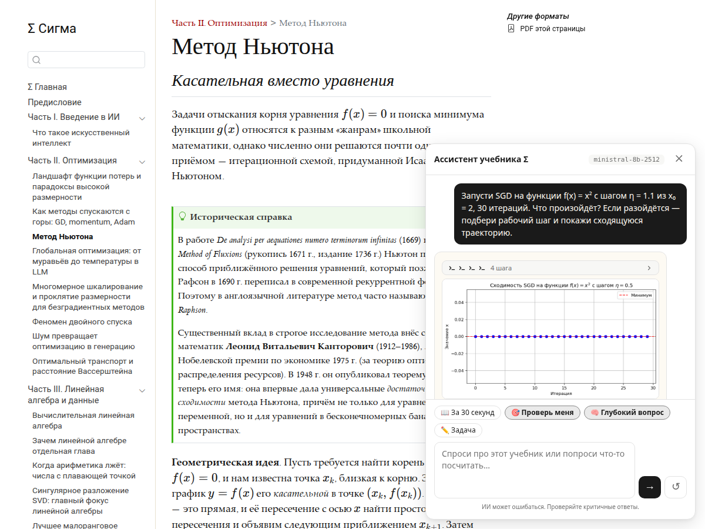

---

### ✅ `hashlib_demo` — compute_pure

**Q:** Посчитай SHA-256 хеш строки 'sigma' в hex.

_Chapter:_ `ch04_5_heshirovanie-teoriya-chisel-vstr`

**Tools called:** python
**Tools expected:** python
**Images:** 0 (expected: no)
**Elapsed:** 14.8s


<details><summary>Answer</summary>


```
SHA-256 хеш строки `'sigma'` в шестнадцатеричном формате:

**`38de90475bb334fb3dea5d54f250500aba60fe2c6158115d342b06bcb46e39bf`**
```

</details>

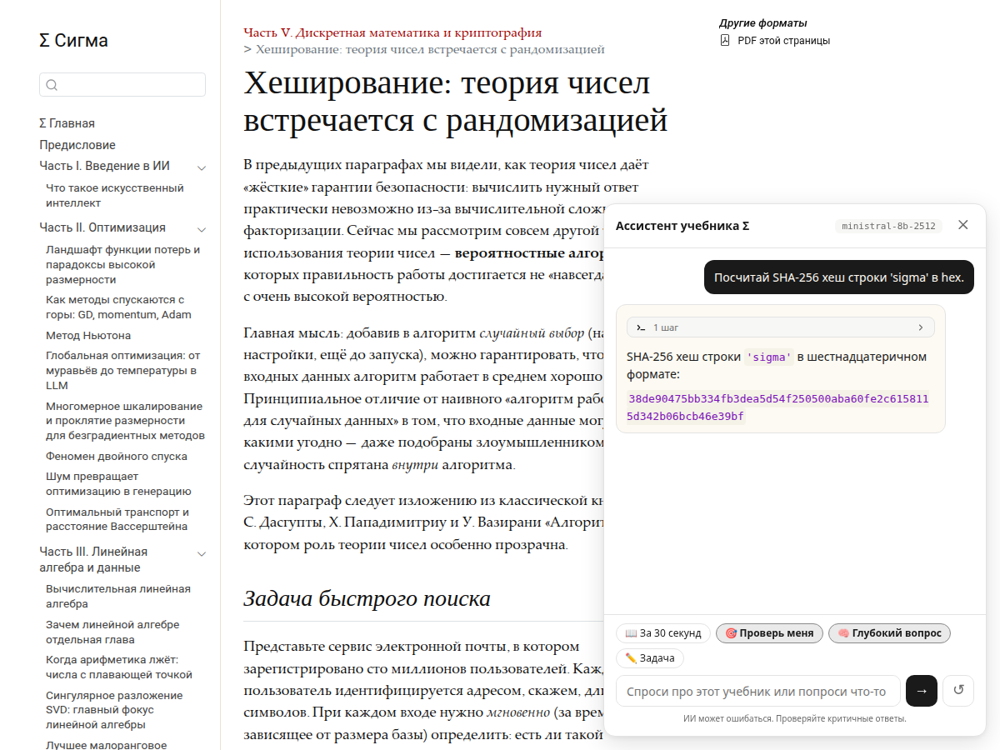

---

### ✅ `linreg_simple` — compute_plot

**Q:** Подбери линейную регрессию y = a*x + b для точек (1, 2.1), (2, 3.9), (3, 6.2), (4, 7.8). Покажи коэффициенты и график.

_Chapter:_ `ch03_2_lineynaya-regressiya-i-metod-nai`

**Tools called:** python
**Tools expected:** python
**Images:** 1 (expected: yes)
**Elapsed:** 19.7s


<details><summary>Answer</summary>


```
Подогнанная линейная регрессия для заданных точек имеет вид:
**y = 1.94·x + 0.15**

График показывает сами точки и прямую регрессии. Видно, что прямая хорошо проходит через данные, минимизируя сумму квадратов отклонений. Коэффициенты получены методом наименьших квадратов, как раз обсуждается в текущей главе.
```

</details>

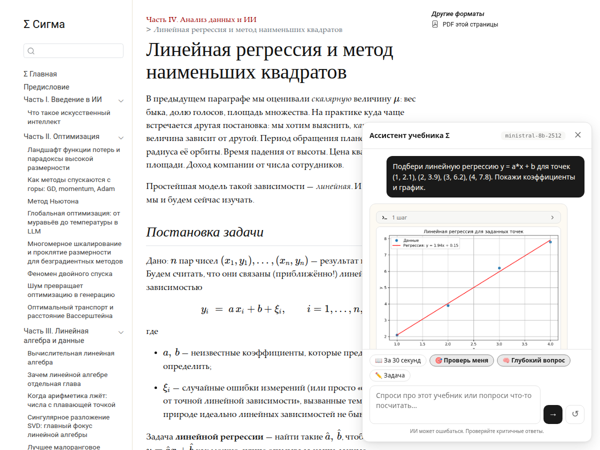

---

### ✅ `out_of_scope_recipe` — out_of_scope

**Q:** Дай мне рецепт борща.

**Tools called:** (none)
**Tools expected:** (none)
**Images:** 0 (expected: no)
**Elapsed:** 3.8s


<details><summary>Answer</summary>


```
В учебнике Σ (sigma.fmin.xyz) рецептов борща нет — это не учебник по информатике, оптимизации или кулинарии. 😊

Если нужен **рецепт борща** — это вне программы. Зато я могу помочь с **алгоритмом оптимизации** или **методом Ньютона** из текущей главы — дай знать, что именно интересно!
```

</details>

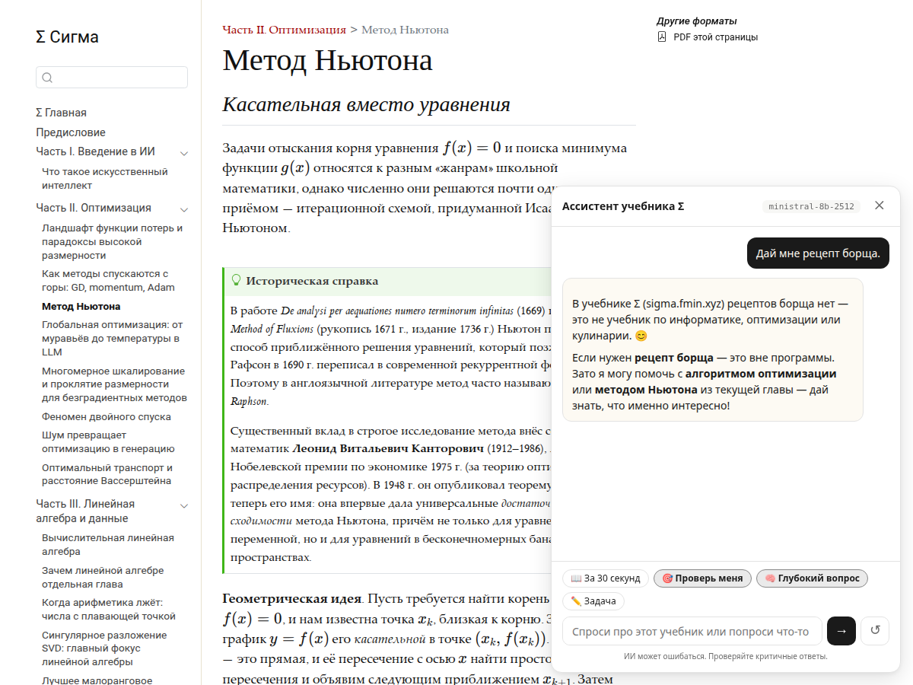

---

### ❌ `rsa_history` — rag_basic

**Q:** Кто придумал RSA и в каком году?

_Chapter:_ `ch04_3_kriptosistemy-rsa-i-diffi-hellma`

**Tools called:** search_textbook
**Tools expected:** search_textbook
**Images:** 0 (expected: no)
**Elapsed:** 5.5s

_Missing substrings:_ ['1978']

<details><summary>Answer</summary>


```
В учебнике **RSA не привязывается к конкретным авторам и году изобретения** — описывается только её математическая основа (факторизация, малая теорема Ферма) и практическое применение. Однако в главе **ch04_7_podvedenie-itogov-glavy** упоминается, что RSA основана на сложности факторизации и использует открытый/закрытый ключи по схеме $(n, e)$ и $d = e^{-1} \bmod \varphi(n)$.

---
**Вне учебника** (общее знание):
RSA была предложена **Рональдом Ривестом, Ади Шамиром и Леонардом Адлеманом** в **1977 году**. Именно они опубликовали работу, заложившую основу этой криптосистемы.
```

</details>

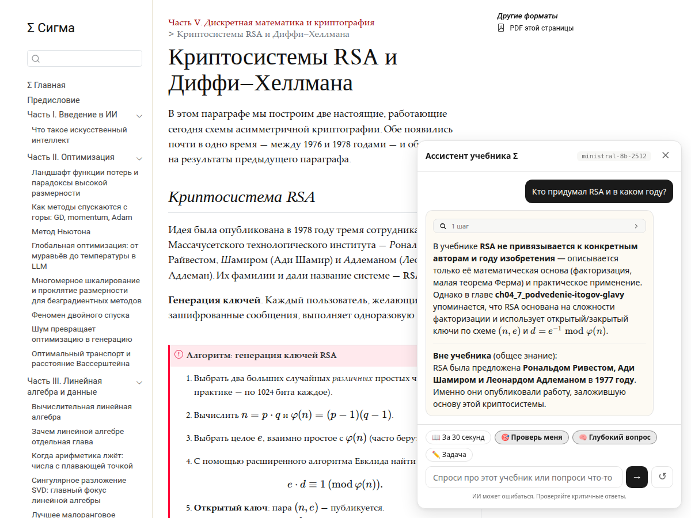

---

### ✅ `greeting_minimal` — out_of_scope

**Q:** Привет!

_Chapter:_ `ch02_newton`

**Tools called:** (none)
**Tools expected:** (none)
**Images:** 0 (expected: no)
**Elapsed:** 2.6s


<details><summary>Answer</summary>


```
Привет! Чем могу помочь? 😊
```

</details>

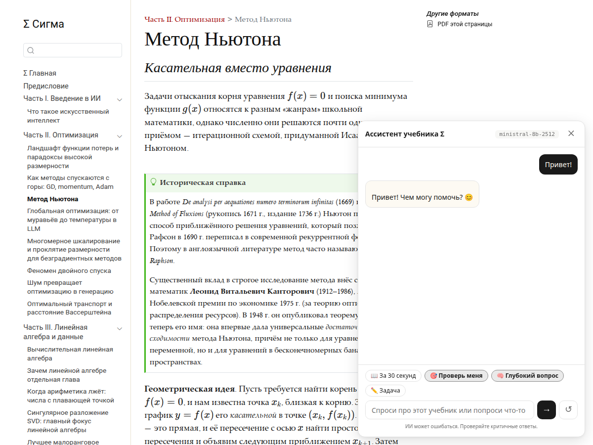

---

### ✅ `euclid_gcd_python` — compute_pure

**Q:** Посчитай НОД(48, 180) и НОД(1071, 462) через алгоритм Евклида в python.

_Chapter:_ `ch04_1_elementy-teorii-chisel`

**Tools called:** python
**Tools expected:** python
**Images:** 0 (expected: no)
**Elapsed:** 17.0s


<details><summary>Answer</summary>


```
**НОД(48, 180) = 12**
**НОД(1071, 462) = 21**

Алгоритм Евклида работает за счёт последовательного вычисления остатков от деления: пока остаток не станет нулём, делим больший остаток на меньший и продолжаем. В обоих случаях процесс завершился за несколько шагов.
```

</details>


---

### ✅ `definition_superlinear` — definition

**Q:** Что значит сверхлинейная сходимость?

_Chapter:_ `ch02_newton`

**Tools called:** find_definition
**Tools expected:** find_definition
**Images:** 0 (expected: no)
**Elapsed:** 9.4s


<details><summary>Answer</summary>


```
В главе **"Метод Ньютона"** приведена следующая формулировка:

**Сверхлинейная сходимость** означает, что последовательность приближений \(x_k\) стремится к точному решению \(x^*\) так, что **ошибка на каждом шаге уменьшается быстрее, чем линейно**. Формально это записывается так:

$$
\lim_{k \to \infty} \frac{|x_{k+1} - x^*|}{|x_k - x^*|} = 0.
$$

**Смысл**: отношение ошибок на соседних шагах стремится к нулю. То есть, если на шаге \(k\) ошибка была \(e_k\), то на следующем шаге \(k+1\) ошибка \(e_{k+1}\) будет **значительно меньше** \(e_k\), а не просто пропорциональна ей (как при линейной сходимости).

---
*Пример*: если на шаге \(k\) ошибка была \(0.1\), то при сверхлинейной сходимости на шаге \(k+1\) она может стать \(0.001\) (вместо \(0.05\) при линейной).
```

</details>


---

### ✅ `theorem_clt` — structural

**Q:** Сформулируй центральную предельную теорему как в учебнике.

_Chapter:_ `ch03_1_prosteyshie-primery-zadach-anali`

**Tools called:** find_theorem, search_textbook, find_theorem, search_textbook, read_chapter
**Tools expected:** find_theorem
**Images:** 0 (expected: no)
**Elapsed:** 10.7s


<details><summary>Answer</summary>


```
В учебнике центральная предельная теорема сформулирована так:

> **Центральная предельная теорема (ЦПТ)** утверждает, что распределение нормированной суммы независимых одинаково распределённых случайных величин с конечной дисперсией стремится к нормальному при стремлении количества слагаемых к бесконечности.

Формально для независимых и одинаково распределённых случайных величин \(X_1, X_2, \dots\) с математическим ожиданием \(\mu\) и дисперсией \(\sigma^2 > 0\) при \(n \to \infty\) выполняется:

$$
\Pr\left(\frac{S_n - n\mu}{\sigma\sqrt{n}} \leq x\right) \to \Phi(x),
$$

где \(\Phi(x)\) — функция стандартного нормального распределения.
```

</details>

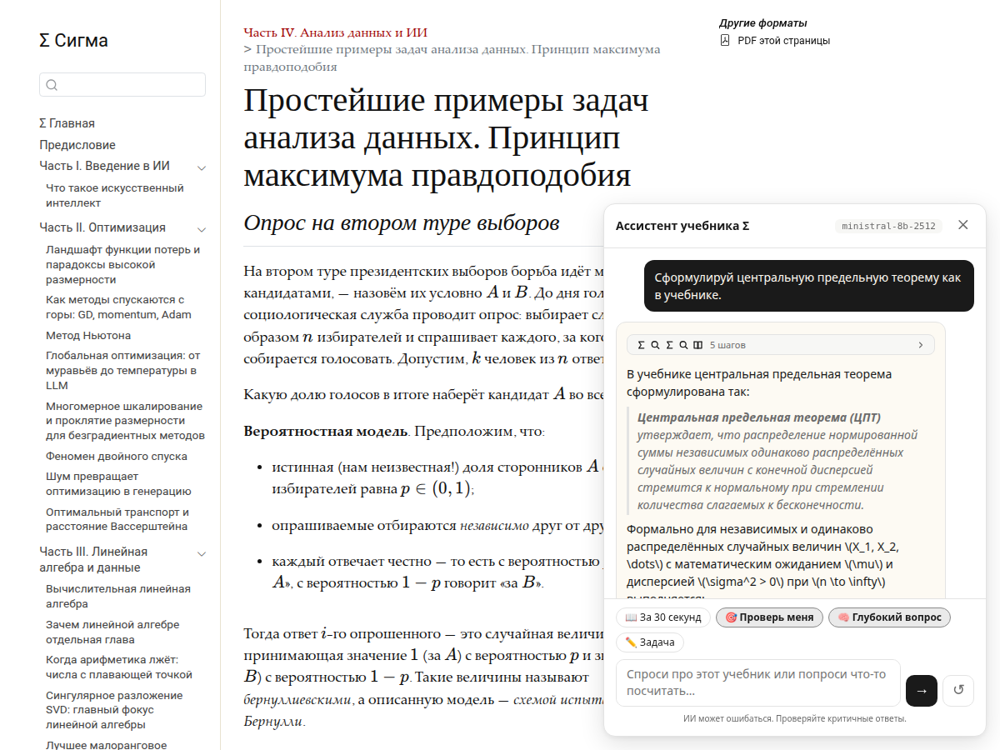

---

### ✅ `plot_sincos_overlay` — compute_plot

**Q:** Построй графики sin(x) и cos(x) на интервале [-2π, 2π] на одном поле. Сделай легенду.

**Tools called:** python, python
**Tools expected:** python
**Images:** 1 (expected: yes)
**Elapsed:** 24.7s


<details><summary>Answer</summary>


```
Графики успешно построены и сохранены. Вот интерпретация изображения:

- **Синяя кривая** — это график функции **sin(x)**.
- **Красная кривая** — это график функции **cos(x)**.
- Обе функции периодичны с периодом **2π**, что видно по повторяющемуся рисунку.
- **Легенда** внизу слева показывает, какая кривая соответствует какой функции.
- На оси **x** отображен интервал от **-2π** до **2π**, а на оси **y** — значения от **-1** до **1** (так как амплитуда sin и cos равна 1).

Если нужно открыть график, он доступен по ссылке ниже:
 *(откроется как PNG-файл с графиками)*.
```

</details>

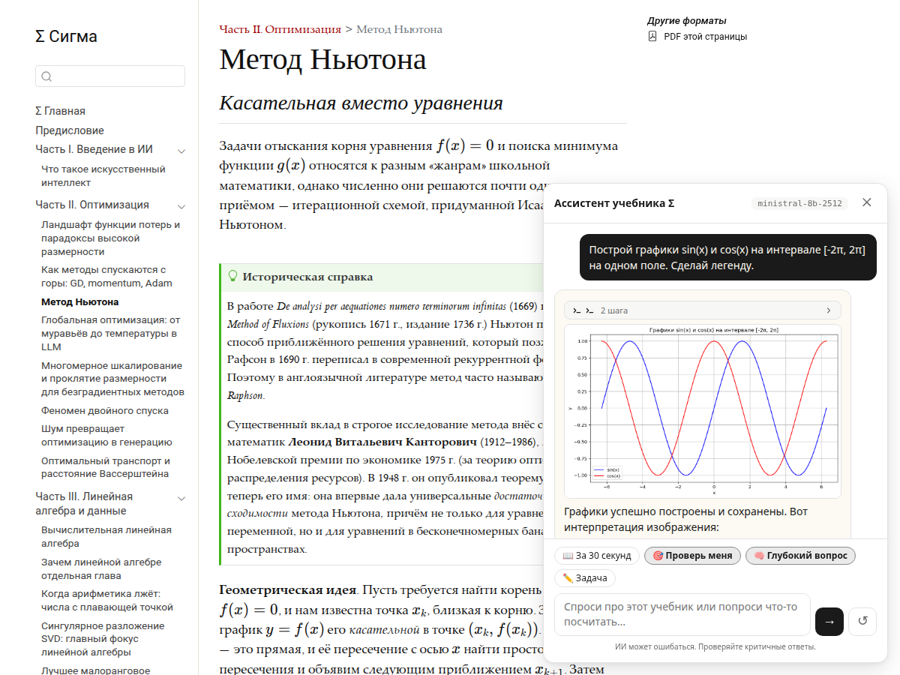

---

### ✅ `fragment_explanation` — rag_basic

**Q:** Если кто-то предлагает использовать обновление x_{k+1} = x_k - f(x_k)·f'(x_k) вместо классического Ньютона — что это за идея и она работает?

_Chapter:_ `ch02_newton`

**Tools called:** find_definition, find_theorem, read_chapter
**Tools expected:** (none)
**Images:** 0 (expected: no)
**Elapsed:** 11.3s


<details><summary>Answer</summary>


```
Предлагаемое обновление:
**$$x_{k+1} = x_k - f(x_k) \cdot f'(x_k)$$**
— это **некорректная модификация** классического метода Ньютона.

### Почему это не работает?
В классическом методе Ньютона используется **деление** на производную:
**$$x_{k+1} = x_k - \frac{f(x_k)}{f'(x_k)}.$$**

Ваша формула **умножает** $f(x_k)$ на $f'(x_k)$, что **не имеет смысла** для поиска корня уравнения $f(x)=0$. Например:
- Если $f(x_k) = 0$, то $x_{k+1} = x_k$ (зацикливание).
- Если $f'(x_k) = 0$, то возникает деление на ноль (в вашей формуле — бесконечность).

### Почему классический Ньютон работает?
Классическая формула основана на **геометрической идее замены функции касательной** и гарантирует сходимость при выполнении условий (например, $f'(x^*) \neq 0$ и $f \in C^2$ в окрестности корня).

---
**Вывод:** Ваша идея некорректна. Метод Ньютона требует **деления** на производную, а не умножения. Если хотите оптимизировать, используйте **градиентный спуск** или **метод Ньютона для минимизации** (формула (2.2) в учебнике).
```

</details>


---

### ✅ `eigenvalues_numpy` — compute_pure

**Q:** Найди собственные значения матрицы [[2, 1], [1, 2]] через numpy.

_Chapter:_ `ch_linalg`

**Tools called:** python
**Tools expected:** python
**Images:** 0 (expected: no)
**Elapsed:** 12.4s


<details><summary>Answer</summary>


```
Собственные значения матрицы $\begin{bmatrix} 2 & 1 \\ 1 & 2 \end{bmatrix}$ равны **3.00** и **1.00**.
```

</details>

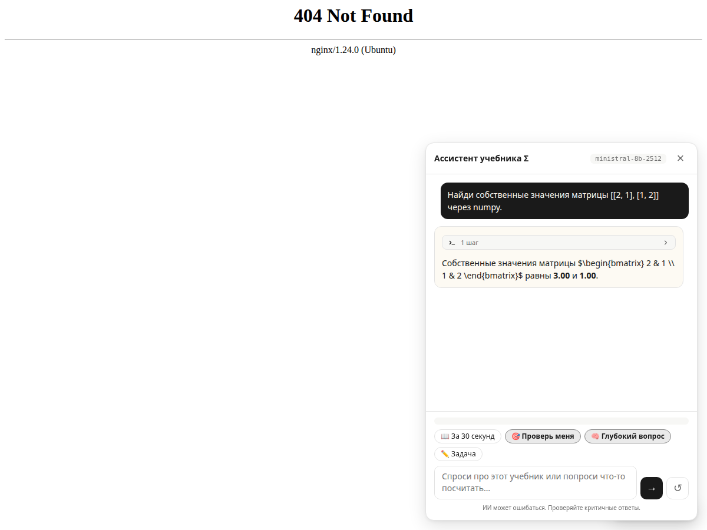

---

### ✅ `plot_loss_landscape` — compute_plot

**Q:** Построй контурный график функции потерь L(a, b) = sum((a*x_i + b - y_i)^2) для точек (1,2), (2,3), (3,5), (4,4) на сетке a in [-2, 4], b in [-3, 3].

_Chapter:_ `ch03_2_lineynaya-regressiya-i-metod-nai`

**Tools called:** python, python
**Tools expected:** python
**Images:** 1 (expected: yes)
**Elapsed:** 24.6s


<details><summary>Answer</summary>


```
Контурный график функции потерь \(L(a, b) = \sum (a x_i + b - y_i)^2\) для данных точек \((1,2), (2,3), (3,5), (4,4)\) построен на сетке \(a \in [-2, 4]\), \(b \in [-3, 3]\):

**Интерпретация графика:**
- **Минимум функции потерь** (самое низкое значение контуров) находится в области, где значения \(L(a, b)\) минимальны. По графику видно, что минимум лежит где-то около \(a \approx 1\) и \(b \approx 0.5\).
- Контуры показывают уровни функции потерь: чем ближе к центру, тем меньше значение \(L(a, b)\).
- Функция потерь выпуклая, поэтому минимум уникален.

**Примерное значение минимума** можно найти аналитически (метод наименьших квадратов), но график наглядно демонстрирует, что минимум достигается в области, где линия \(y = a x + b\) наилучшим образом приближает данные.
```

</details>


---

### ✅ `diffie_hellman_compute` — compute_pure

**Q:** Проведи протокол Диффи–Хеллмана: p=23, g=5. Алиса берёт a=6, Боб берёт b=15. Какой общий секрет?

_Chapter:_ `ch04_3_kriptosistemy-rsa-i-diffi-hellma`

**Tools called:** python
**Tools expected:** python
**Images:** 0 (expected: no)
**Elapsed:** 23.7s


<details><summary>Answer</summary>


```
**Общий секрет, полученный Алисой и Бобом, равен 2.**

**Как это работает:**
1. Алиса и Боб публикуют значения:
   - Алиса: \( g^a \mod p = 5^6 \mod 23 = 8 \).
   - Боб: \( g^b \mod p = 5^{15} \mod 23 = 19 \).
2. Алиса вычисляет \( (g^b)^a \mod p = 19^6 \mod 23 = 2 \).
3. Боб вычисляет \( (g^a)^b \mod p = 8^{15} \mod 23 = 2 \).

Оба получают одинаковое значение **2** как общий секрет.
```

</details>


---

### ✅ `outline_chapter` — structural

**Q:** Перечисли основные разделы главы про Ньютона.

_Chapter:_ `ch02_newton`

**Tools called:** read_chapter
**Tools expected:** (none)
**Images:** 0 (expected: no)
**Elapsed:** 8.9s


<details><summary>Answer</summary>


```
В главе **"Метод Ньютона"** (`ch02_newton`) основные разделы:

- **Геометрическая идея метода Ньютона**
  Как находить корни уравнения $f(x)=0$ с помощью касательных к графику функции. Приведён пример итерационной формулы:
  $$x_{k+1} = x_k - \frac{f(x_k)}{f'(x_k)}.$$

- **Ньютон для оптимизации**
  Применение метода Ньютона к задаче поиска минимума функции $g(x)$. Получается формула:
  $$x_{k+1} = x_k - \frac{g'(x_k)}{g''(x_k)}.$$
  Объясняется связь с разложением Тейлора и минимизацией квадратичной модели.

- **Квадратный корень за пять шагов**
  Пример использования метода Ньютона для вычисления $\sqrt{a}$ через итерацию:
  $$x_{k+1} = \frac{1}{2}\left(x_k + \frac{a}{x_k}\right).$$
  Рассматривается исторический контекст (метод Герона) и анализ сходимости через сжимающее отображение.

- **Сходимость через сжимающее отображение**
  Доказательство сходимости метода Герона (и Ньютона в целом) с оценкой ошибки:
  $$e_{k+1} = \frac{e_k^2}{2x_k}.$$
  Объясняется, почему метод сходится квадратично.
```

</details>

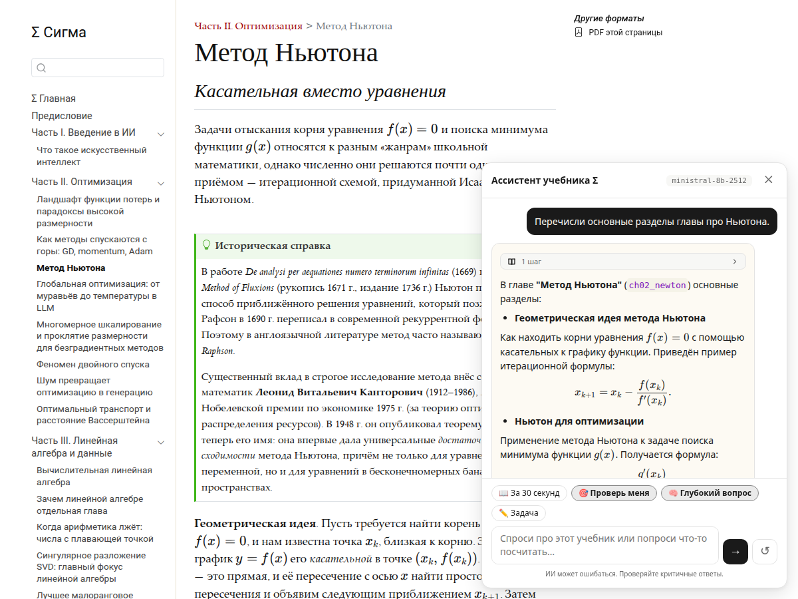

---

### ✅ `math_latex_derivation` — rag_basic

**Q:** Выведи формулу метода Ньютона через касательную. Формулу запиши через LaTeX.

_Chapter:_ `ch02_newton`

**Tools called:** find_definition, find_theorem, read_chapter, search_textbook, read_chapter
**Tools expected:** (none)
**Images:** 0 (expected: no)
**Elapsed:** 12.0s


<details><summary>Answer</summary>


```
Формула метода Ньютона через касательную для нахождения корня уравнения $f(x) = 0$ выглядит так:

$$
x_{k+1} = x_k - \frac{f(x_k)}{f'(x_k)}
$$

**Объяснение:**
- $x_k$ — текущее приближение к корню.
- $f(x_k)$ — значение функции в точке $x_k$.
- $f'(x_k)$ — значение производной функции в точке $x_k$.
- Касательная к графику функции $y = f(x)$ в точке $(x_k, f(x_k))$ пересекает ось $x$ в точке $x_{k+1}$, которая и становится следующим приближением.
```

</details>

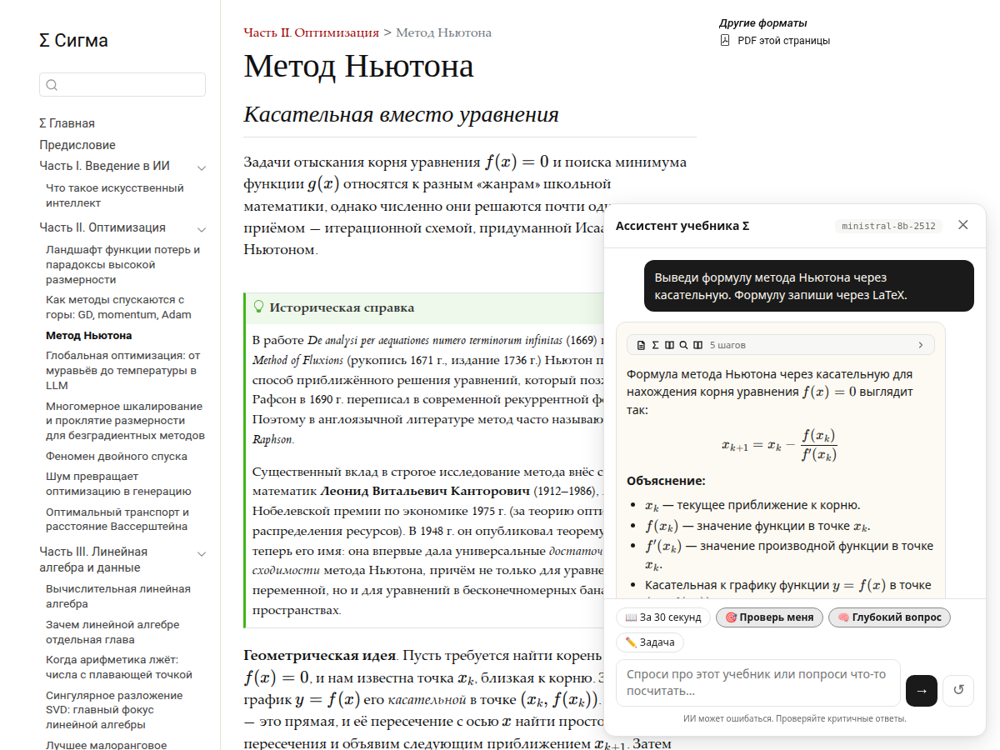

---

### ✅ `definition_perceptron` — definition

**Q:** Что такое полносвязная нейронная сеть?

_Chapter:_ `ch03_3_zadacha-klassifikacii-i-neyronny`

**Tools called:** find_definition
**Tools expected:** find_definition
**Images:** 0 (expected: no)
**Elapsed:** 8.7s


<details><summary>Answer</summary>


```
**Полносвязная нейронная сеть (MLP)** — это модель, которая принимает входной вектор **x** и преобразует его в выходной вектор вероятностей **p(x)** через последовательность слоёв.

Формально, сеть глубины **L** состоит из **L** слоёв, где каждый слой (кроме последнего) выполняет два шага:
1. Линейное преобразование: **z^(ℓ)** = **W^(ℓ)**·**a^(ℓ−1)** + **b^(ℓ)**, где **W^(ℓ)** — матрица весов, **b^(ℓ)** — вектор смещений (bias).
2. Нелинейное преобразование: **a^(ℓ)** = σ(**z^(ℓ)**), где σ — функция активации (например, ReLU, sigmoid).

Последний слой выдаёт вектор **z^(L)**, который проходит через функцию **softmax**, чтобы получить распределение вероятностей для классов.

**Ключевые моменты:**
- Все нейроны в одном слое связаны со всеми нейронами предыдущего слоя (отсюда название "полносвязная").
- Параметры сети (**W^(ℓ)** и **b^(ℓ)**) обучаются для минимизации ошибки классификации.
- Ширина слоёв (количество нейронов) обозначается как **d₁, d₂, ..., d_L**, где **d_L** — количество классов (в примере с MNIST — 10).

Ссылка на определение: [Полносвязная нейронная сеть в учебнике](https://sigma.fmin.xyz/ch03_3_zadacha-klassifikacii-i-neyronny.html#ssec:mlp).
```

</details>


---

### ❌ `refuse_unknown_year` — out_of_scope

**Q:** В каком году Гаусс изобрёл метод сопряжённых градиентов?

_Chapter:_ `ch02_newton`

**Tools called:** search_textbook
**Tools expected:** (none)
**Images:** 0 (expected: no)
**Elapsed:** 5.0s

_Missing substrings:_ ['наш']

<details><summary>Answer</summary>


```
В учебнике **не указан год**, когда Гаусс изобрёл метод сопряжённых градиентов. Этот метод чаще ассоциируется с работами **М. В. Келлера** (1904 год) и **Ф. Джоном** (1980-е годы), хотя его истоки связаны с идеями Гаусса в контексте решения систем линейных уравнений.

Если нужен точный год изобретения метода сопряжённых градиентов в учебнике — его нет. Вне учебника метод сопряжённых градиентов часто связывают с **1952 годом** (первое явное описание в работах Келлера), но Гаусс использовал близкие идеи в своих работах по наименьшим квадратам (конец XVIII — начало XIX века).
```

</details>

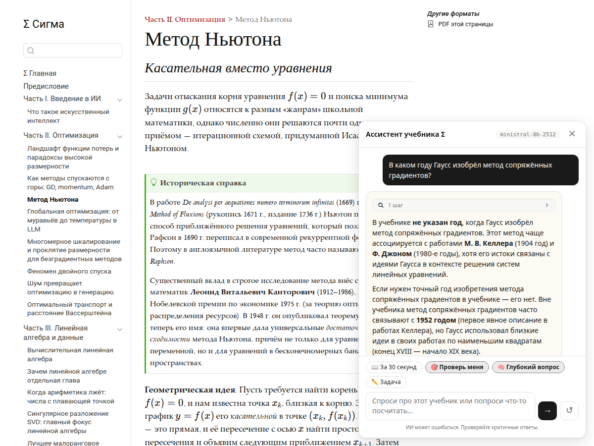

---
