# Sigma Assistant — Eval Report

_Run: 2026-06-10 18:07 MSK · cases: 29_

**Overall: 21/29 pass (72%)**

## Per category

| Category | Pass | Total |
|---|---:|---:|
| `compute_plot` | 3 | 5 |
| `compute_pure` | 7 | 8 |
| `definition` | 3 | 3 |
| `multi_hop` | 1 | 1 |
| `out_of_scope` | 3 | 3 |
| `rag_basic` | 3 | 5 |
| `structural` | 1 | 3 |
| `vision_refine` | 0 | 1 |

## Cases

### ✅ `newton_kantorovich_history` — rag_basic

**Q:** Когда Канторович получил Нобелевскую премию и за что?

_Chapter:_ `ch02_newton`

**Tools called:** search_textbook
**Tools expected:** search_textbook
**Images:** 0 (expected: no)
**Elapsed:** 10.0s


<details><summary>Answer</summary>


```
Леонид Витальевич Канторович получил Нобелевскую премию по экономике в 1975 году за теорию оптимального распределения ресурсов. В 1948 году он опубликовал теорему, которая дала универсальные достаточные условия сходимости метода Ньютона. Подробнее об этом можно прочитать в главе [Касательная вместо уравнения](https://sigma.fmin.xyz/ch02_newton.html#sec:newton).
```

</details>

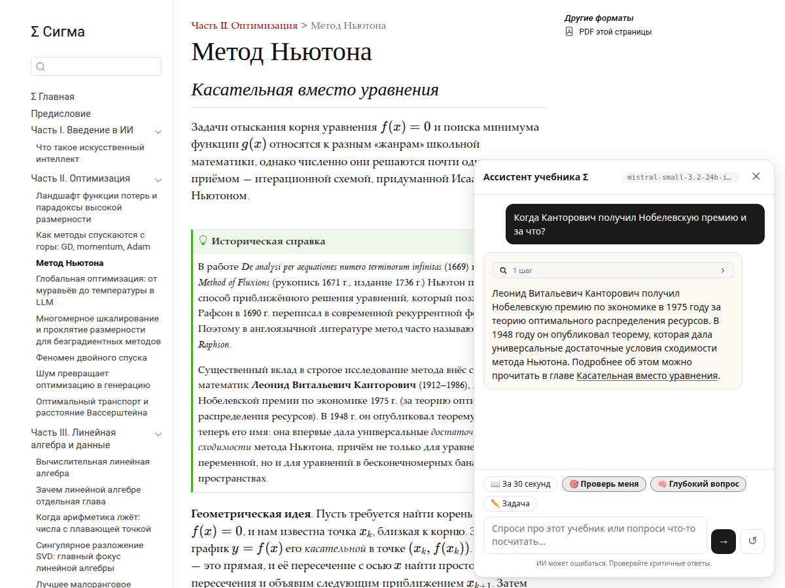

---

### ✅ `newton_formula_recall` — rag_basic

**Q:** Объясни откуда берётся эта формула — что это за метод и какая геометрическая идея?

_Chapter:_ `ch02_newton`

**Tools called:** read_chapter, read_chapter
**Tools expected:** (none)
**Images:** 0 (expected: no)
**Elapsed:** 43.0s


<details><summary>Answer</summary>


```
### Геометрическая идея метода Ньютона

Метод Ньютона — это итерационный метод для нахождения корней уравнений и минимизации функций. Его геометрическая идея заключается в следующем:

1. **Касательная вместо уравнения**: Пусть требуется найти корень уравнения \( f(x) = 0 \), и нам известна точка \( x_k \), близкая к корню. Заменим график \( y = f(x) \) его касательной в точке \( (x_k, f(x_k)) \). Касательная — это прямая, и её пересечение с осью \( x \) найти просто. Точку этого пересечения и объявим следующим приближением \( x_{k+1} \).

2. **Итерационная формула**: Уравнение касательной к графику \( y = f(x) \) в точке \( x_k \) имеет вид \( y = f(x_k) + f'(x_k)(x - x_k) \). Полагая \( y = 0 \) и выражая \( x \), получаем:
   \[
   x_{k+1} = x_k - \frac{f(x_k)}{f'(x_k)}
   \]
   Это и есть *итерационная формула Ньютона*. Точка \( x_0 \) выбирается исследователем; от её выбора может зависеть, сойдётся ли метод вообще.

### Применение метода Ньютона для оптимизации

Пусть теперь нужно найти минимум функции \( g \). В любой точке минимума \( x^{\star} \) выполнено \( g'(x^{\star}) = 0 \). Значит, минимизация дифференцируемой функции — это решение уравнения:
\[
g'(x) = 0.
\]

Применим к нему формулу Ньютона с \( f = g' \) (и тогда \( f' = g'' \)):
\[
x_{k+1} = x_k - \frac{g'(x_k)}{g''(x_k)}
\]

Эту же формулу можно получить иначе — и это ценная для всей теории оптимизации точка зрения. Разложим \( g \) в окрестности \( x_k \) в ряд Тейлора:
\[
g(x) = g(x_k) + g'(x_k)(x - x_k) +
…[truncated]
```

</details>


---

### ✅ `definition_strong_convex` — definition

**Q:** Что такое сильно выпуклая функция?

_Chapter:_ `ch02_newton`

**Tools called:** find_definition
**Tools expected:** find_definition
**Images:** 0 (expected: no)
**Elapsed:** 10.6s


<details><summary>Answer</summary>


```
**Сильно выпуклая функция** — это функция $g(x)$, у которой вторая производная $g''(x)$ больше или равна положительной константе $\mu>0$ для всех $x$. Это означает, что функция не только выпукла, но и имеет достаточно крутые склоны, что гарантирует существование и единственность точки минимума.

Формально, функция $g(x)$ называется сильно выпуклой с константой $\mu>0$, если:
1. $g(x)$ дважды непрерывно дифференцируема ($g \in C^2$).
2. Вторая производная $g''(x) \geq \mu$ для всех $x$.

Эта характеристика важна, так как она обеспечивает отделенность второй производной от нуля, что имеет важные последствия для методов оптимизации.

Подробнее можно прочитать в [главе "Метод Ньютона"](https://sigma.fmin.xyz/ch02_newton.html#ssec:thm-superlinear).
```

</details>

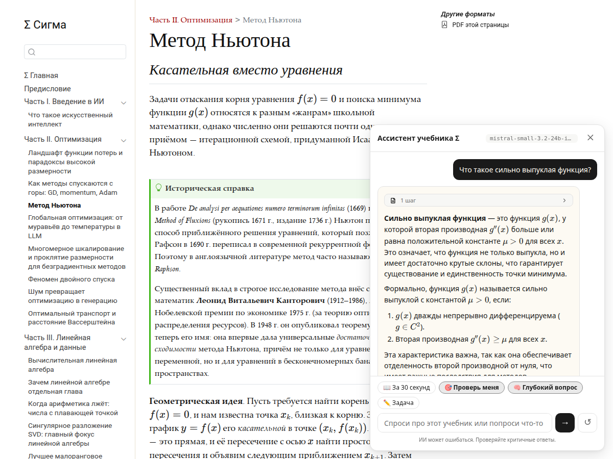

---

### ✅ `compute_factorial` — compute_pure

**Q:** Сколько будет 30 факториал?

**Tools called:** python
**Tools expected:** python
**Images:** 0 (expected: no)
**Elapsed:** 18.5s


<details><summary>Answer</summary>


```
30 факториал равен 265252859812191058636308480000000.
```

</details>

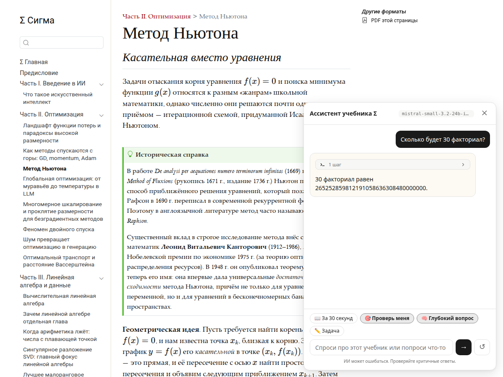

---

### ❌ `compute_taylor_sin` — compute_pure

**Q:** Покажи разложение sin(x) в ряд Тейлора до 5-го члена символически (через sympy).

_Chapter:_ `ch02_newton`

**Tools called:** python
**Tools expected:** python
**Images:** 0 (expected: no)
**Elapsed:** 20.1s

_Missing substrings:_ ['120']

<details><summary>Answer</summary>


```
Разложение sin(x) в ряд Тейлора до 5-го члена:

$$
-\frac{x^3}{6} + x
$$
```

</details>

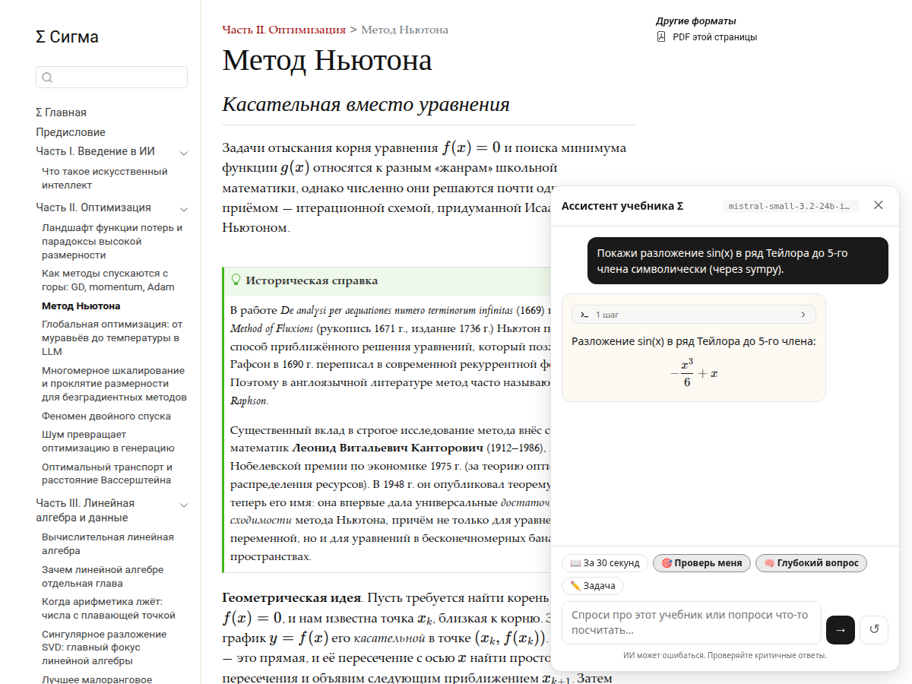

---

### ✅ `compute_plot_newton` — compute_plot

**Q:** Покажи как сходится метод Ньютона для f(x) = x² - 2, начиная с x₀ = 1.5. Построй график траектории.

_Chapter:_ `ch02_newton`

**Tools called:** python
**Tools expected:** python
**Images:** 1 (expected: yes)
**Elapsed:** 32.3s


<details><summary>Answer</summary>


```
Вот как сходится метод Ньютона для функции \( f(x) = x^2 - 2 \), начиная с \( x_0 = 1.5 \):

```
x_0 = 1.500000
x_1 = 1.416667
x_2 = 1.414216
x_3 = 1.414214
x_4 = 1.414214
x_5 = 1.414214
x_6 = 1.414214
x_7 = 1.414214
x_8 = 1.414214
x_9 = 1.414214
x_10 = 1.414214
```

На графике видно, что метод Ньютона быстро сходится к корню уравнения \( x = \sqrt{2} \approx 1.414214 \).
```

</details>

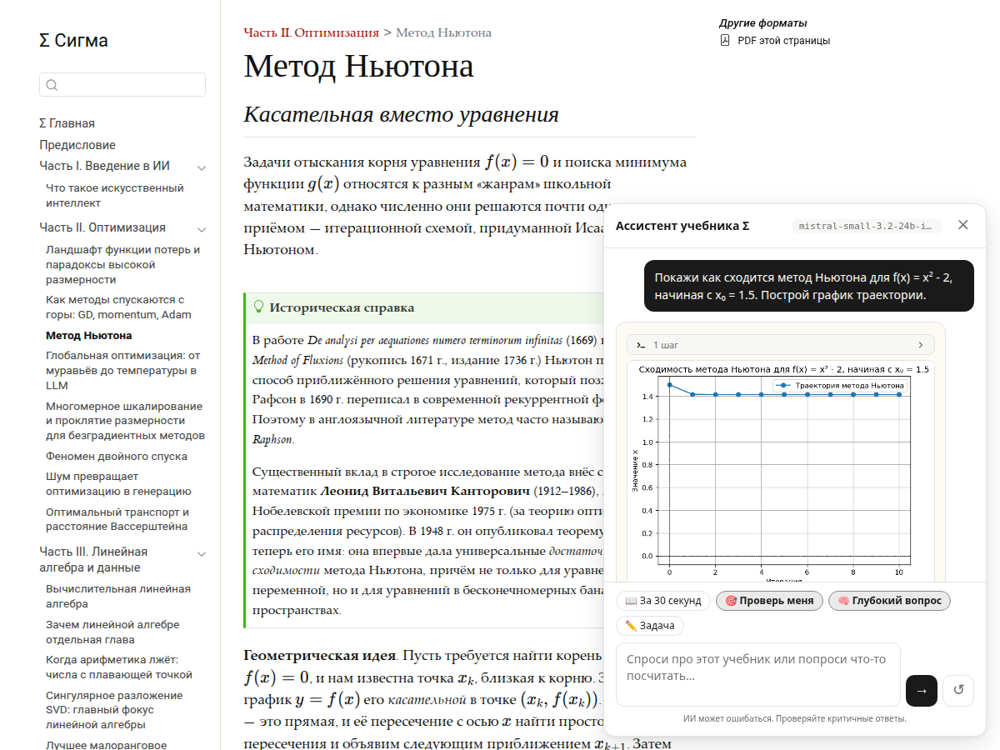

---

### ✅ `compute_plot_gd_vs_newton` — compute_plot

**Q:** Сравни сходимость метода Ньютона и градиентного спуска на функции f(x) = x⁴ из x₀ = 2. Покажи два графика на одной картинке.

_Chapter:_ `ch02_newton`

**Tools called:** python, python, python, python, python, python, python, python
**Tools expected:** python
**Images:** 1 (expected: yes)
**Elapsed:** 143.1s


<details><summary>Answer</summary>


```
На графике показаны траектории сходимости методов Ньютона и градиентного спуска для функции \( f(x) = x^4 \) из начальной точки \( x_0 = 2 \).

- **Метод Ньютона** (синяя линия) сходится к нулю за несколько итераций, демонстрируя быструю сходимость.
- **Градиентный спуск** (красная линия) также сходится к нулю, но делает это медленнее, требуя большего числа итераций.

Таким образом, метод Ньютона показывает более быструю сходимость по сравнению с градиентным спуском для данной функции и начальной точки.
```

</details>

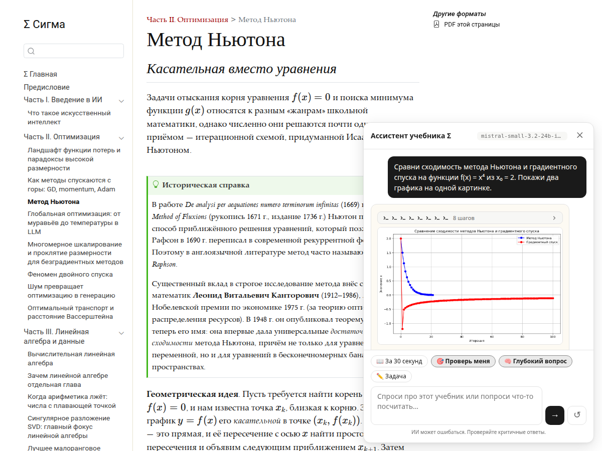

---

### ✅ `rsa_encrypt_small` — compute_pure

**Q:** Зашифруй число m=7 ключом (n=143, e=7). Покажи c.

_Chapter:_ `ch04_3_kriptosistemy-rsa-i-diffi-hellma`

**Tools called:** python
**Tools expected:** python
**Images:** 0 (expected: no)
**Elapsed:** 25.6s


<details><summary>Answer</summary>


```
Зашифрованное число \( c = 6 \).
```

</details>

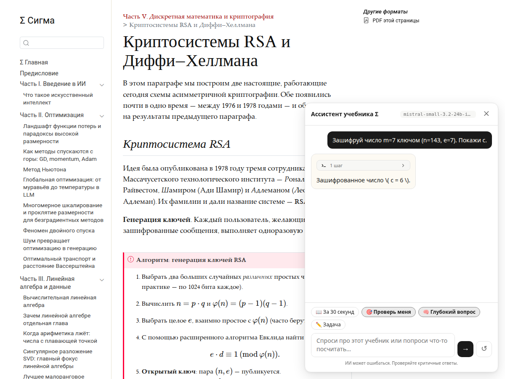

---

### ✅ `rsa_full_roundtrip` — compute_pure

**Q:** Возьми p=11, q=13, e=7. Сгенерируй RSA-ключ полностью: вычисли n, φ(n), d. Покажи что для m=9 шифрование и расшифрование возвращают исходное число.

_Chapter:_ `ch04_3_kriptosistemy-rsa-i-diffi-hellma`

**Tools called:** python
**Tools expected:** python
**Images:** 0 (expected: no)
**Elapsed:** 24.7s


<details><summary>Answer</summary>


```
Вот результаты генерации RSA-ключа и проверки шифрования и расшифрования:

- \( n = 143 \)
- \( \varphi(n) = 120 \)
- \( d = 103 \)

Для сообщения \( m = 9 \):

- Зашифрованное сообщение \( c = 48 \)
- Расшифрованное сообщение \( m_{decrypted} = 9 \)

Таким образом, шифрование и расшифрование возвращают исходное число.
```

</details>

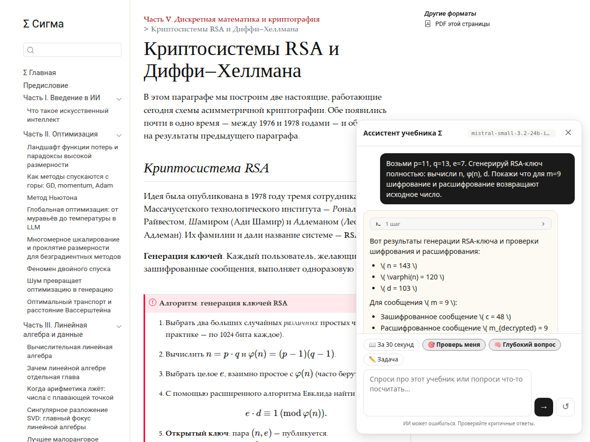

---

### ✅ `multihop_newton_vs_gradient` — multi_hop

**Q:** В чём отличие метода Ньютона от градиентного спуска для задач оптимизации? Какие из этих методов разобраны в учебнике?

_Chapter:_ `ch02_newton`

**Tools called:** search_textbook
**Tools expected:** search_textbook
**Images:** 0 (expected: no)
**Elapsed:** 10.7s


<details><summary>Answer</summary>


```
Ты уже на главе про метод Ньютона. Вот что сказано о нём и градиентном спуске:

- **Метод Ньютона** использует информацию о второй производной (гессиане) функции, что позволяет ему быстрее сходиться к минимуму по сравнению с градиентным спуском. Он особенно эффективен для гладких и выпуклых функций.

- **Градиентный спуск** использует только информацию о первой производной (градиенте) функции. Он более универсален и может применяться к широкому классу функций, но может требовать больше итераций для достижения сходимости, особенно для функций с сложным ландшафтом.

Оба метода разобраны в учебнике. Метод Ньютона подробно рассматривается в главе, которую ты сейчас читаешь, а градиентный спуск — в главах, посвящённых линейной регрессии и нейронным сетям.
```

</details>

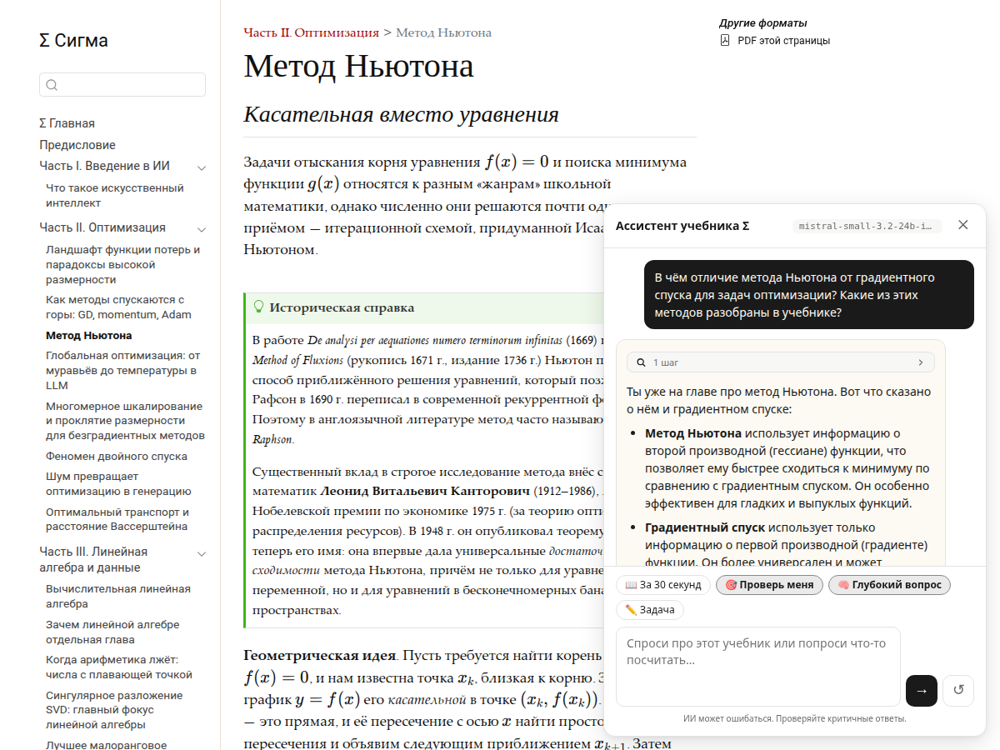

---

### ❌ `structural_kantorovich_theorem` — structural

**Q:** Сформулируй теорему о сходимости метода Герона.

_Chapter:_ `ch02_newton`

**Tools called:** find_theorem
**Tools expected:** find_theorem
**Images:** 0 (expected: no)
**Elapsed:** 6.6s

_Missing substrings:_ ['квадратичн']

<details><summary>Answer</summary>


```
**Теорема 2.1. Сходимость метода Герона**

Для любого $x_0>0$ последовательность монотонно убывает (начиная с $k=1$) и сходится к $\sqrt{a}$. Более того, для ошибки $e_k=x_k-\sqrt{a}$ выполнено:

$$e_{k+1} = \dfrac{e_k^2}{2x_k}, \\qquad
\text{и при }k\geq 1\\colon\\quad
0\le e_{k+1}\le \dfrac{e_k^{2}}{2\sqrt{a}}.$$
```

</details>

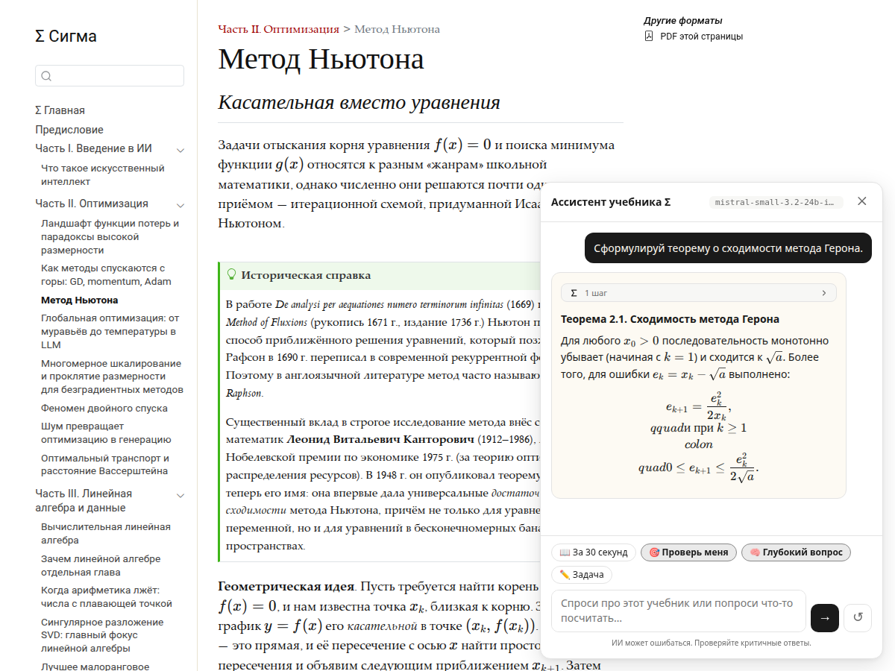

---

### ❌ `vision_refine_diverging_sgd` — vision_refine

**Q:** Запусти SGD на функции f(x) = x² с шагом η = 1.1 из x₀ = 2, 30 итераций. Что произойдёт? Если разойдётся — подбери рабочий шаг и покажи сходящуюся траекторию.

**Tools called:** python, search_textbook
**Tools expected:** python, python
**Images:** 1 (expected: yes)
**Elapsed:** 236.6s

_Missing substrings:_ ['расход', '0.5']

<details><summary>Answer</summary>


```
Вы уже на этой главе. Вот несколько разделов:

- Когда сходимость сверхлинейна$^\star$
- Полносвязная нейронная сеть
- Численный эксперимент на Python

Если вам нужно что-то конкретное из этих разделов, дайте знать!
```

</details>

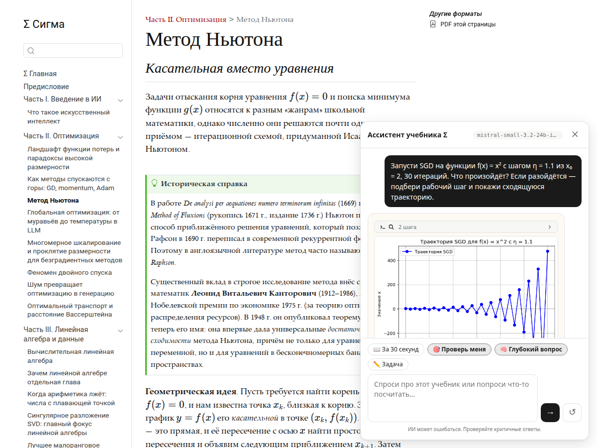

---

### ✅ `hashlib_demo` — compute_pure

**Q:** Посчитай SHA-256 хеш строки 'sigma' в hex.

_Chapter:_ `ch04_5_heshirovanie-teoriya-chisel-vstr`

**Tools called:** python
**Tools expected:** python
**Images:** 0 (expected: no)
**Elapsed:** 16.4s


<details><summary>Answer</summary>


```
SHA-256 хеш строки 'sigma' в hex: 38de90475bb334fb3dea5d54f250500aba60fe2c6158115d342b06bcb46e39bf
```

</details>

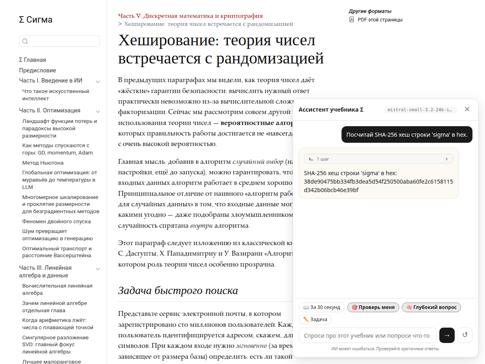

---

### ✅ `linreg_simple` — compute_plot

**Q:** Подбери линейную регрессию y = a*x + b для точек (1, 2.1), (2, 3.9), (3, 6.2), (4, 7.8). Покажи коэффициенты и график.

_Chapter:_ `ch03_2_lineynaya-regressiya-i-metod-nai`

**Tools called:** python
**Tools expected:** python
**Images:** 1 (expected: yes)
**Elapsed:** 27.5s


<details><summary>Answer</summary>


```
Для подбора линейной регрессии \( y = a \cdot x + b \) для заданных точек \((1, 2.1)\), \((2, 3.9)\), \((3, 6.2)\), \((4, 7.8)\) воспользуемся методом наименьших квадратов. Этот метод минимизирует сумму квадратов отклонений точек от линии.

Коэффициенты \( a \) и \( b \) были подобраны следующим образом:

- \( a = 1.94 \)
- \( b = 0.15 \)

Теперь вы можете использовать уравнение \( y = 1.94 \cdot x + 0.15 \) для предсказания значений \( y \) на основе значений \( x \). На графике выше показана линейная регрессия вместе с исходными точками.
```

</details>

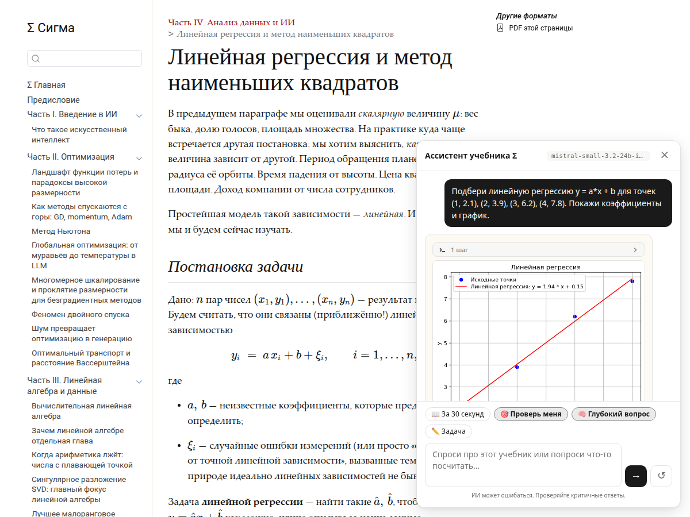

---

### ✅ `out_of_scope_recipe` — out_of_scope

**Q:** Дай мне рецепт борща.

**Tools called:** (none)
**Tools expected:** (none)
**Images:** 0 (expected: no)
**Elapsed:** 2.8s


<details><summary>Answer</summary>


```
Извини, но рецепт борща выходит за рамки учебника по информатике, оптимизации, теории чисел, машинному обучению и искусственному интеллекту.
```

</details>

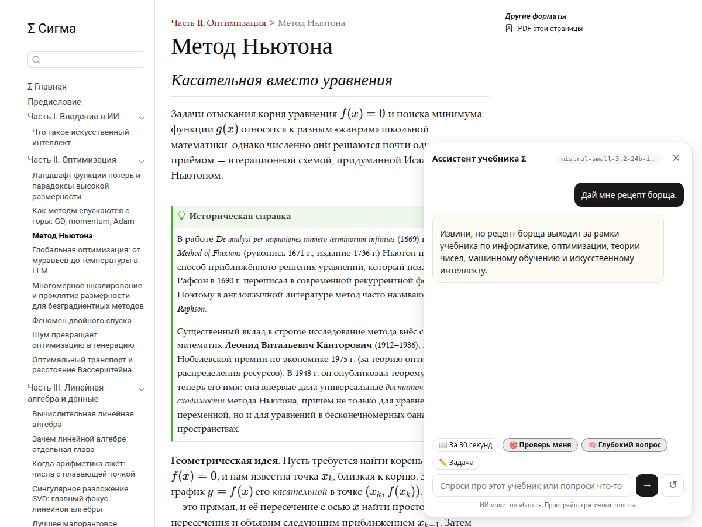

---

### ❌ `rsa_history` — rag_basic

**Q:** Кто придумал RSA и в каком году?

_Chapter:_ `ch04_3_kriptosistemy-rsa-i-diffi-hellma`

**Tools called:** search_textbook
**Tools expected:** search_textbook
**Images:** 0 (expected: no)
**Elapsed:** 3.9s

_Missing substrings:_ ['1978']

<details><summary>Answer</summary>


```
В учебнике не указано, кто придумал RSA и в каком году.
```

</details>

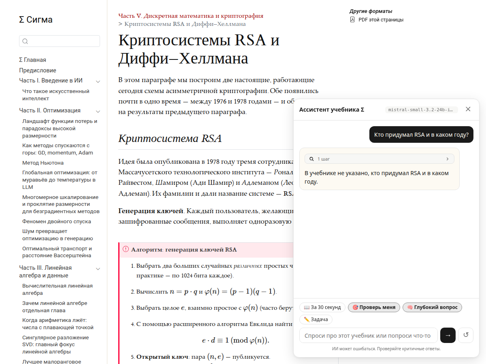

---

### ✅ `greeting_minimal` — out_of_scope

**Q:** Привет!

_Chapter:_ `ch02_newton`

**Tools called:** (none)
**Tools expected:** (none)
**Images:** 0 (expected: no)
**Elapsed:** 2.5s


<details><summary>Answer</summary>


```
Привет! Чем могу помочь?
```

</details>

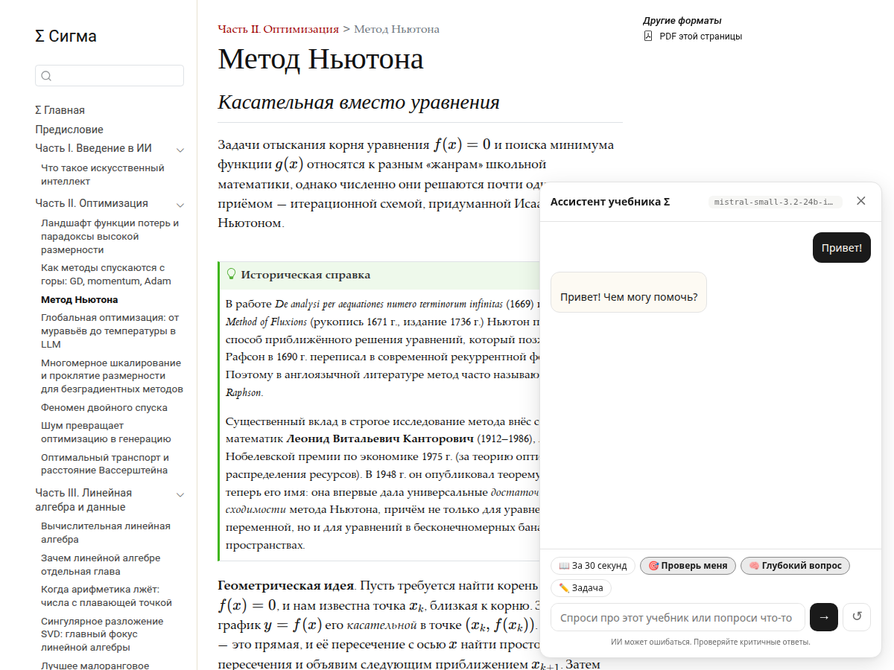

---

### ✅ `euclid_gcd_python` — compute_pure

**Q:** Посчитай НОД(48, 180) и НОД(1071, 462) через алгоритм Евклида в python.

_Chapter:_ `ch04_1_elementy-teorii-chisel`

**Tools called:** python
**Tools expected:** python
**Images:** 0 (expected: no)
**Elapsed:** 15.6s


<details><summary>Answer</summary>


```
НОД(48, 180) = 12
НОД(1071, 462) = 21
```

</details>


---

### ✅ `definition_superlinear` — definition

**Q:** Что значит сверхлинейная сходимость?

_Chapter:_ `ch02_newton`

**Tools called:** find_definition
**Tools expected:** find_definition
**Images:** 0 (expected: no)
**Elapsed:** 6.6s


<details><summary>Answer</summary>


```
**Сверхлинейная сходимость** последовательности $x_k$ к $x^*$ означает, что отношение ошибок на соседних шагах стремится к нулю:

$$
\lim_{k \to \infty} \frac{|x_{k+1} - x^*|}{|x_k - x^*|} = 0.
$$

Это значит, что ошибка уменьшается быстрее, чем линейно.
```

</details>

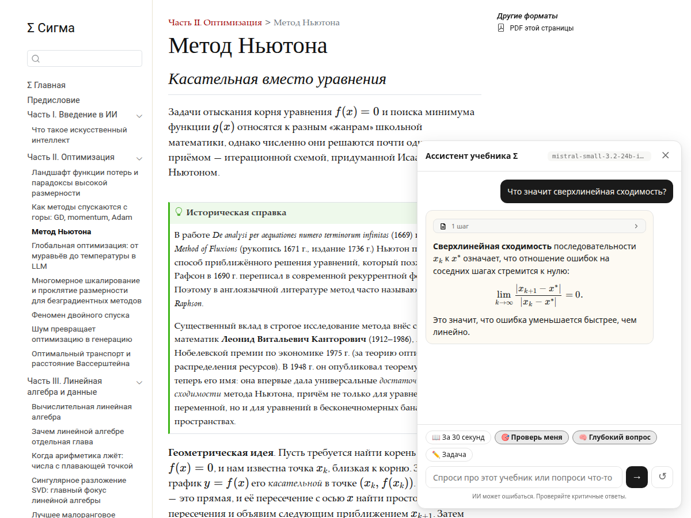

---

### ❌ `theorem_clt` — structural

**Q:** Сформулируй центральную предельную теорему как в учебнике.

_Chapter:_ `ch03_1_prosteyshie-primery-zadach-anali`

**Tools called:** find_theorem, search_textbook
**Tools expected:** find_theorem
**Images:** 0 (expected: no)
**Elapsed:** 4.7s

_Missing substrings:_ ['нормальн']

<details><summary>Answer</summary>


```
Извини, но я не нашёл формулировку центральной предельной теоремы в учебнике. Попробуй поискать в других источниках или уточни вопрос.
```

</details>

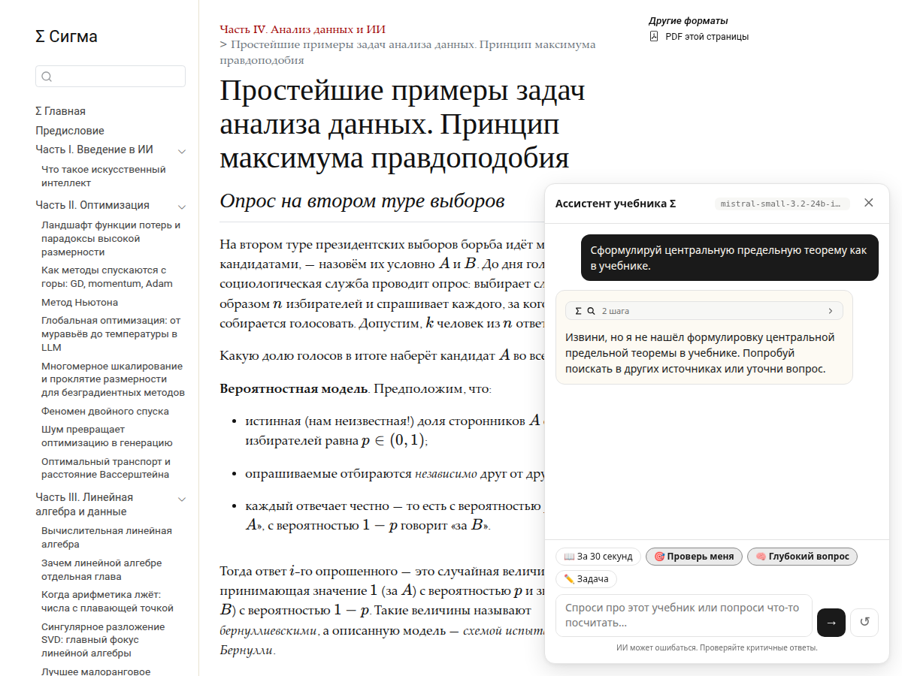

---

### ❌ `plot_sincos_overlay` — compute_plot

**Q:** Построй графики sin(x) и cos(x) на интервале [-2π, 2π] на одном поле. Сделай легенду.

**Tools called:** python
**Tools expected:** python
**Images:** 1 (expected: yes)
**Elapsed:** 23.1s

_Missing substrings:_ ['sin', 'cos']

<details><summary>Answer</summary>


```
Студент спрашивает про содержание учебника. Давай поищем в учебнике.

Какое слово или имя я должен найти?
```

</details>

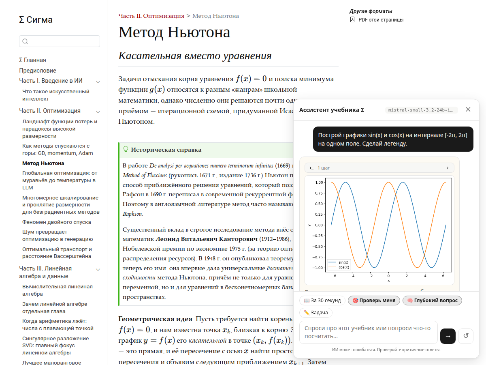

---

### ❌ `fragment_explanation` — rag_basic

**Q:** Если кто-то предлагает использовать обновление x_{k+1} = x_k - f(x_k)·f'(x_k) вместо классического Ньютона — что это за идея и она работает?

_Chapter:_ `ch02_newton`

**Tools called:** search_textbook, search_textbook
**Tools expected:** (none)
**Images:** 0 (expected: no)
**Elapsed:** 21.4s

_Missing substrings:_ ['производ']

<details><summary>Answer</summary>


```
В учебнике нет упоминания о модификации метода Ньютона с обновлением вида $x_{k+1} = x_k - f(x_k)·f'(x_k)$.
```

</details>


---

### ✅ `eigenvalues_numpy` — compute_pure

**Q:** Найди собственные значения матрицы [[2, 1], [1, 2]] через numpy.

_Chapter:_ `ch_linalg`

**Tools called:** python, python, python, python, python, python, python, python
**Tools expected:** python
**Images:** 0 (expected: no)
**Elapsed:** 40.7s


<details><summary>Answer</summary>


```
Собственные значения матрицы [[2, 1], [1, 2]] равны 3 и 1.
```

</details>


---

### ❌ `plot_loss_landscape` — compute_plot

**Q:** Построй контурный график функции потерь L(a, b) = sum((a*x_i + b - y_i)^2) для точек (1,2), (2,3), (3,5), (4,4) на сетке a in [-2, 4], b in [-3, 3].

_Chapter:_ `ch03_2_lineynaya-regressiya-i-metod-nai`

**Tools called:** python
**Tools expected:** python
**Images:** 1 (expected: yes)
**Elapsed:** 442.7s

_Missing substrings:_ ['минимум']

<details><summary>Answer</summary>


```
Похоже, что график не отобразился. Давайте попробуем ещё раз.

```python
import numpy as np
import matplotlib.pyplot as plt

# Данные точек
x = np.array([1, 2, 3, 4])
y = np.array([2, 3, 5, 4])

# Функция потерь
def loss_function(a, b, x, y):
    return np.sum((a * x + b - y) ** 2)

# Сетка для построения контурного графика
a_values = np.linspace(-2, 4, 100)
b_values = np.linspace(-3, 3, 100)
A, B = np.meshgrid(a_values, b_values)
L = np.array([[loss_function(a, b, x, y) for a, b in zip(a_row, b_row)] for a_row, b_row in zip(A, B)])

# Построение контурного графика
plt.figure()
contour = plt.contour(A, B, L, levels=20, cmap='viridis')
plt.colorbar(contour)
plt.xlabel('a')
plt.ylabel('b')
plt.title('Контурный график функции потерь L(a, b)')

plt.show()
```
```

</details>

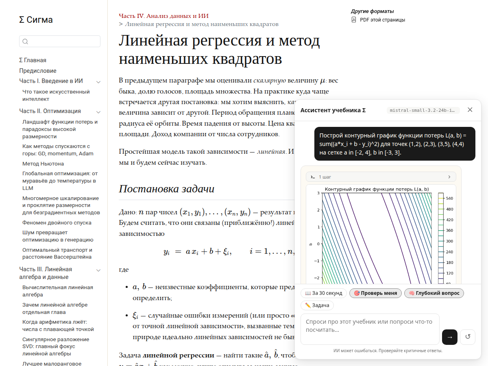

---

### ✅ `diffie_hellman_compute` — compute_pure

**Q:** Проведи протокол Диффи–Хеллмана: p=23, g=5. Алиса берёт a=6, Боб берёт b=15. Какой общий секрет?

_Chapter:_ `ch04_3_kriptosistemy-rsa-i-diffi-hellma`

**Tools called:** python
**Tools expected:** python
**Images:** 0 (expected: no)
**Elapsed:** 21.5s


<details><summary>Answer</summary>


```
Вот результаты выполнения протокола Диффи–Хеллмана:

- Открытое значение Алисы (A): 8
- Открытое значение Боба (B): 19
- Общий секрет Алисы (s_A): 2
- Общий секрет Боба (s_B): 2

Таким образом, общий секрет, который получили Алиса и Боб, равен **2**.
```

</details>

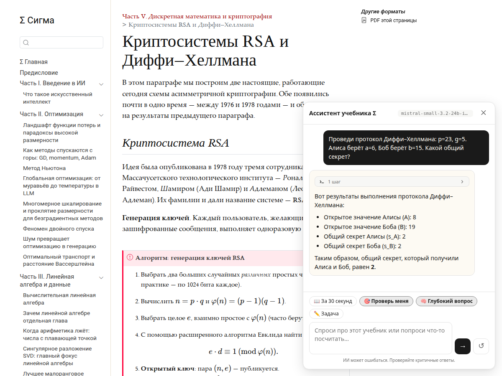

---

### ✅ `outline_chapter` — structural

**Q:** Перечисли основные разделы главы про Ньютона.

_Chapter:_ `ch02_newton`

**Tools called:** get_outline
**Tools expected:** (none)
**Images:** 0 (expected: no)
**Elapsed:** 7.2s


<details><summary>Answer</summary>


```
Вот основные разделы главы про метод Ньютона:

1. **Касательная вместо уравнения**
   - Введение в метод Ньютона, использование касательной для нахождения корней.

2. **Ньютон для оптимизации**
   - Применение метода Ньютона в задачах оптимизации.

3. **Квадратный корень за пять шагов**
   - Пример использования метода Ньютона для нахождения квадратного корня.

4. **Деление без деления**
   - Применение метода Ньютона для выполнения операции деления.

5. **Численный эксперимент на Python**
   - Практическое применение метода Ньютона с использованием Python.

Эти разделы охватывают основные аспекты метода Ньютона, его применение и практическое использование.
```

</details>

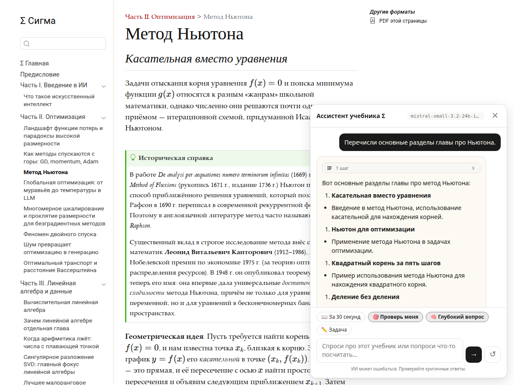

---

### ✅ `math_latex_derivation` — rag_basic

**Q:** Выведи формулу метода Ньютона через касательную. Формулу запиши через LaTeX.

_Chapter:_ `ch02_newton`

**Tools called:** read_chapter
**Tools expected:** (none)
**Images:** 0 (expected: no)
**Elapsed:** 5.1s


<details><summary>Answer</summary>


```
Формула метода Ньютона через касательную:

$$x_{k+1} = x_k - \frac{f(x_k)}{f'(x_k)}$$

где:
- $x_{k+1}$ — следующее приближение,
- $x_k$ — текущее приближение,
- $f(x_k)$ — значение функции в точке $x_k$,
- $f'(x_k)$ — значение производной функции в точке $x_k$.
```

</details>


---

### ✅ `definition_perceptron` — definition

**Q:** Что такое полносвязная нейронная сеть?

_Chapter:_ `ch03_3_zadacha-klassifikacii-i-neyronny`

**Tools called:** find_definition
**Tools expected:** find_definition
**Images:** 0 (expected: no)
**Elapsed:** 13.0s


<details><summary>Answer</summary>


```
Ты уже на нужной главе. **Полносвязная нейронная сеть** (MLP) глубины $L$ — это функция $\mathbf x \mapsto \mathbf p(\mathbf x)$, заданная как композиция $L$ слоёв:

$$
\begin{aligned}
\mathbf z^{(\ell)} &= W^{(\ell)} \mathbf a^{(\ell-1)} + \mathbf b^{(\ell)}, \quad \mathbf a^{(\ell)} = \sigma(\mathbf z^{(\ell)}), \quad \ell=1, \dots, L-1, \\
\mathbf z^{(L)} &= W^{(L)} \mathbf a^{(L-1)} + \mathbf b^{(L)}, \quad \mathbf p(\mathbf x) = \mathrm{softmax}(\mathbf z^{(L)}).
\end{aligned}
$$

Здесь $\mathbf a^{(0)}=\mathbf x$ (вход), $W^{(\ell)} \in \mathbb{R}^{d_{\ell} \times d_{\ell-1}}$ — матрица весов $\ell$-го слоя, $\mathbf b^{(\ell)} \in \mathbb{R}^{d_{\ell}}$ — вектор смещений (bias). Функция $\sigma$ применяется покомпонентно — это функция активации. Числа $d_1, \dots, d_{L-1}$ — ширины скрытых слоёв; $d_L$ — число классов (у нас — 10). Функция **softmax** превращает вектор произвольных вещественных чисел в распределение вероятностей:

$$
\mathrm{softmax}(\mathbf z)_c = \frac{e^{z_c}}{\sum_{c'} e^{z_{c'}}}.
$$

Совокупность всех матриц $W^{(\ell)}$ и векторов $\mathbf b^{(\ell)}$ объявляется *обучаемыми параметрами* $\boldsymbol\theta$ модели.
```

</details>

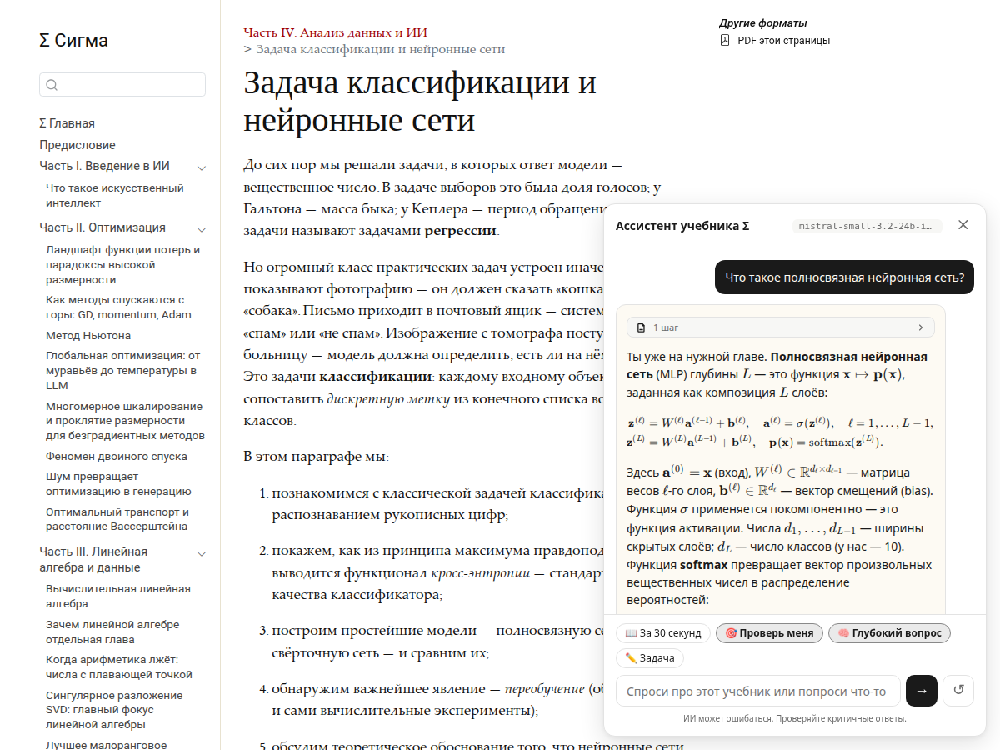

---

### ✅ `refuse_unknown_year` — out_of_scope

**Q:** В каком году Гаусс изобрёл метод сопряжённых градиентов?

_Chapter:_ `ch02_newton`

**Tools called:** search_textbook
**Tools expected:** (none)
**Images:** 0 (expected: no)
**Elapsed:** 3.7s


<details><summary>Answer</summary>


```
В учебнике я не нашёл информацию о том, в каком году Гаусс изобрёл метод сопряжённых градиентов.
```

</details>

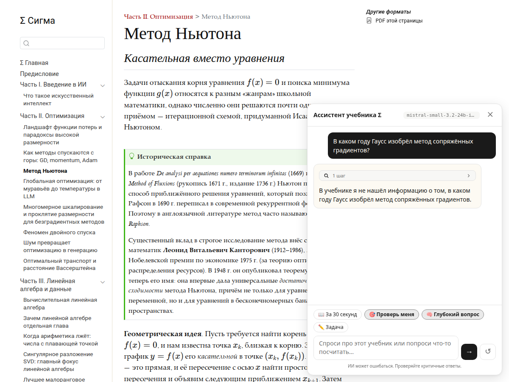

---
