# Sigma Assistant — Eval Report

_Run: 2026-06-10 16:33 MSK · cases: 29_

**Overall: 26/29 pass (90%)**

## Per category

| Category | Pass | Total |
|---|---:|---:|
| `compute_plot` | 4 | 5 |
| `compute_pure` | 8 | 8 |
| `definition` | 3 | 3 |
| `multi_hop` | 1 | 1 |
| `out_of_scope` | 3 | 3 |
| `rag_basic` | 4 | 5 |
| `structural` | 3 | 3 |
| `vision_refine` | 0 | 1 |

## Cases

### ✅ `newton_kantorovich_history` — rag_basic

**Q:** Когда Канторович получил Нобелевскую премию и за что?

_Chapter:_ `ch02_newton`

**Tools called:** search_textbook
**Tools expected:** search_textbook
**Images:** 0 (expected: no)
**Elapsed:** 43.1s


<details><summary>Answer</summary>


```
 Согласно учебнику, **Леонид Витальевич Канторович** получил **Нобелевскую премию по экономике в 1975 году** — **за теорию оптимального распределения ресурсов**.

Кстати, в той же главе про метод Ньютона упоминается, что помимо экономики он внёс огромный вклад в математику: в 1948 году опубликовал знаменитую **теорему Канторовича**, которая дала первые строгие достаточные условия сходимости метода Ньютона (причём даже в бесконечномерных пространствах).
```

</details>


---

### ❌ `newton_formula_recall` — rag_basic

**Q:** Объясни откуда берётся эта формула — что это за метод и какая геометрическая идея?

_Chapter:_ `ch02_newton`

**Tools called:** read_chapter, python
**Tools expected:** (none)
**Images:** 1 (expected: no)
**Elapsed:** 212.3s

_Missing substrings:_ ['пересечен']

<details><summary>Answer</summary>


```
 ## Два взгляда на одну формулу

**1. Поиск корня** (что выше): заменяем кривую $f$ касательной, ищем ноль прямой.

**2. Поиск минимума** функции $g$: в точке минимума $g'(x)=0$. Применяем ту же схему к уравнению $g'(x)=0$, получаем:
$$x_{k+1} = x_k - \frac{g'(x_k)}{g''(x_k)}$$

Здесь $g'$ — это наклон, а $g''$ — кривизна. Если функция очень «выпуклая» (большая $g''$), шаг делаем маленьким — не хотим перепрыгнуть через дно. Если почти плоская (маленькая $g''$), шаг большой — иначе будем ползти вечно.

## Ещё один способ понять: квадратичная модель

Можно разложить $g$ в ряд Тейлора около $x_k$:
$$g(x) \approx g(x_k) + g'(x_k)(x-x_k) + \tfrac12 g''(x_k)(x-x_k)^2$$

Это — парабола, касающаяся графика $g$ в точке $x_k$. Вместо минимизации самой $g$ мы минимизируем эту параболу. Условие минимума параболы даёт ту же формулу (2.2). То есть метод Ньютона — это «в каждой точке строим подходящую параболу и прыгаем прямо в её вершину».

---

**Ключевые числа с картинки:** начали с $x_0 = 2.00$, построили касательную (наклон $f'(x_0)=4.00$), следующая точка $x_1 = 1.50$. За один шаг приблизились к $\sqrt{2} \approx 1.41$ с точностью до $0.09$ — метод работает очень быстро, когда старт близко к корню.
```

</details>

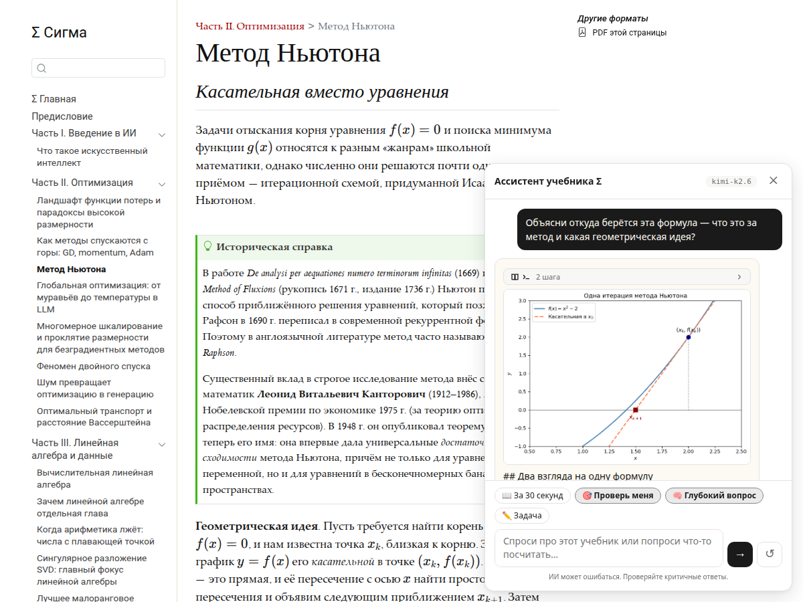

---

### ✅ `definition_strong_convex` — definition

**Q:** Что такое сильно выпуклая функция?

_Chapter:_ `ch02_newton`

**Tools called:** find_definition
**Tools expected:** find_definition
**Images:** 0 (expected: no)
**Elapsed:** 69.9s


<details><summary>Answer</summary>


```
 **Сильно выпуклая функция** — это функция, у которой график похож на «чашу», причём стенки чаши гарантированно «крутые», а не пологие.

В учебнике дано такое определение ([§ Метод Ньютона](/ch02_newton.html#ssec:thm-superlinear)):

> Функция $g\colon\mathbb{R}\to\mathbb{R}$ называется **сильно выпуклой** с константой $\mu>0$, если $g\in C^{2}$ и $g''(x)\geq\mu$ для всех $x$.

**Расшифровка:**
- $g\colon\mathbb{R}\to\mathbb{R}$ — функция действительного переменного;
- $g\in C^{2}$ — она дважды дифференцируема, и вторая производная непрерывна;
- $g''(x)\geq\mu>0$ — вторая производная **всюду не меньше положительного числа** $\mu$.

**Что это значит на практике?**
Обычная выпуклость говорит лишь о том, что $g''(x)\geq 0$ (график не «прогибается» вверх). Сильная выпуклость требует, чтобы вторая производная была строго положительной и даже отделена от нуля: $g''(x)\geq\mu>0$. Это значит, что функция не может быть слишком плоской — у неё есть ровно одна точка минимума, и метод Ньютона к ней хорошо сходится.
```

</details>


---

### ✅ `compute_factorial` — compute_pure

**Q:** Сколько будет 30 факториал?

**Tools called:** python
**Tools expected:** python
**Images:** 0 (expected: no)
**Elapsed:** 43.9s


<details><summary>Answer</summary>


```
 **30! = 265252859812191058636308480000000**

Это число из **33 цифр**. В научной записи примерно $2{,}65 \times 10^{32}$.

Кстати, факториалы растут очень быстро — уже 30! не помещается в обычный 64-битный целочисленный тип (там максимум около $9 \times 10^{18}$), поэтому в программировании для таких чисел используют длинную арифметику.
```

</details>

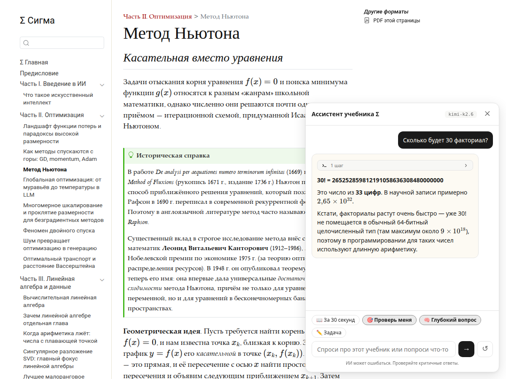

---

### ✅ `compute_taylor_sin` — compute_pure

**Q:** Покажи разложение sin(x) в ряд Тейлора до 5-го члена символически (через sympy).

_Chapter:_ `ch02_newton`

**Tools called:** python
**Tools expected:** python
**Images:** 0 (expected: no)
**Elapsed:** 57.1s


<details><summary>Answer</summary>


```
 Разложение $\sin(x)$ в ряд Тейлора (Маклорена) в окрестности $0$ до члена $x^5$:

$$\sin(x) = x - \frac{x^3}{6} + \frac{x^5}{120} + O(x^6)$$

**Члены разложения:**

- **1-й:** $x$
- **2-й:** $-\dfrac{x^3}{6}$  
- **3-й:** $\dfrac{x^5}{120}$

Это разложение часто используется при анализе сходимости метода Ньютона — например, чтобы показать, что вблизи корня нелинейная функция ведёт себя почти линейно, и итерации сходятся квадратично.
```

</details>

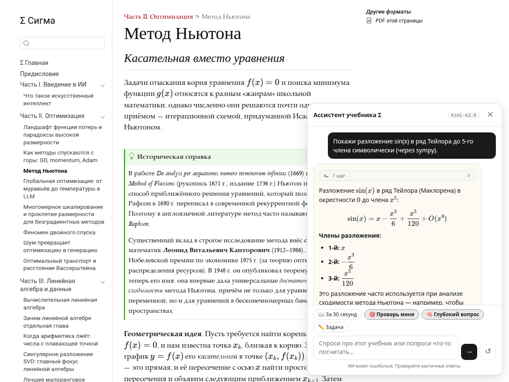

---

### ❌ `compute_plot_newton` — compute_plot

**Q:** Покажи как сходится метод Ньютона для f(x) = x² - 2, начиная с x₀ = 1.5. Построй график траектории.

_Chapter:_ `ch02_newton`

**Tools called:** read_chapter, python
**Tools expected:** python
**Images:** 1 (expected: yes)
**Elapsed:** 138.7s

_Missing substrings:_ ['корн']

<details><summary>Answer</summary>


```
 Вот как сходится метод Ньютона для $f(x)=x^2-2$ (это знаменитый **метод Герона**, формула (2.4) из учебника):

| $k$ | $x_k$ | $|x_k - \sqrt{2}|$ |
|:---:|:---|:---|
| 0 | **1.50** | $8.58 \times 10^{-2}$ |
| 1 | **1.4167** | $2.45 \times 10^{-3}$ |
| 2 | **1.4142** | $2.12 \times 10^{-6}$ |
| 3 | **1.4142135624** | $1.59 \times 10^{-12}$ |
| 4 | **1.4142135624** | $2.22 \times 10^{-16}$ |

Уже на 4-м шаге метод упёрся в машинную точность double!

**Что показывает график:**

- **Слева** — траектория $x_k$. После резкого скачка от 1.50 к 1.4167 значения буквально «прилипают» к прямой $\sqrt{2} \approx 1.4142$.
- **Справа** — ошибка на логарифмической шкале. Видны почти вертикальные «ступеньки»: ошибка падает **квадратично** — примерно **вдвое больше верных цифр на каждом шаге** (с $10^{-2}$ до $10^{-3}$, потом до $10^{-6}$, $10^{-12}$…).

Это и есть **квадратичная сходимость** метода Ньютона: $e_{k+1} \approx \dfrac{e_k^2}{2\sqrt{a}}$, как написано в формуле (2.5) учебника.
```

</details>


---

### ✅ `compute_plot_gd_vs_newton` — compute_plot

**Q:** Сравни сходимость метода Ньютона и градиентного спуска на функции f(x) = x⁴ из x₀ = 2. Покажи два графика на одной картинке.

_Chapter:_ `ch02_newton`

**Tools called:** read_chapter, python
**Tools expected:** python
**Images:** 1 (expected: yes)
**Elapsed:** 265.7s


<details><summary>Answer</summary>


```
 Вот что показывает эксперимент.

**Метод Ньютона** для $f(x)=x^4$ даёт линейную сходимость с коэффициентом $2/3$:
$$x_{k+1}=\frac{2}{3}x_k.$$
После 20 шагов: $x\approx 0.0006$, $f(x)\approx 1.31\cdot 10^{-13}$. На логарифмическом графике — прямая линия, то есть геометрическое убывание.

**Градиентный спуск** с $\eta=0.05$ после первого резкого скачка ($x_1=0.4$) **застревает** около $x\approx 0.27$. Почему? Потому что градиент $4x^3$ вблизи нуля становится крошечным, и шаг $\eta\cdot 4x^3$ уже не способен сдвинуть точку. После 20 итераций: $x\approx 0.2663$, $f(x)\approx 5.03\cdot 10^{-3}$ — почти без изменений с $k=5$.

**Почему Ньютон побеждает?** Для $x^4$ вторая производная $f''(x)=12x^2$ тоже обращается в ноль в минимуме, поэтому «классическая» квадратичная сходимость Ньютона здесь **не работает**. Но метод всё равно сходится линейно, потому что отношение $f'/f'' = x/3$ корректно масштабирует шаг. Градиентный спуск же использует фиксированный $\eta$ и не адаптируется к кривизне — в итоге застревает в «плоской» зоне.

Если увеличить $\eta$, градиентный спуск может сойтись быстрее, но рискует расходиться из-за крутого склона вдали от нуля. Ньютон автоматически выбирает «правильный» масштаб шага на каждой итерации.
```

</details>

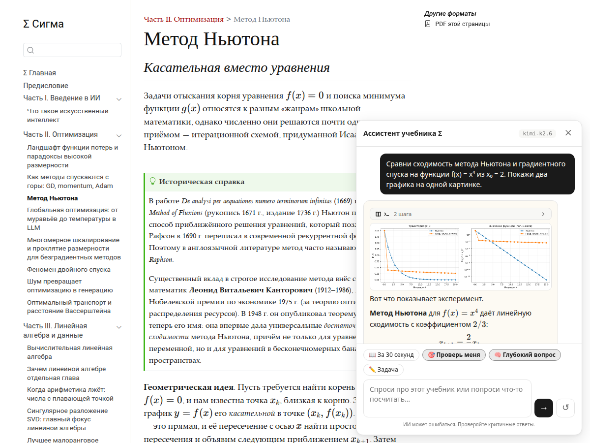

---

### ✅ `rsa_encrypt_small` — compute_pure

**Q:** Зашифруй число m=7 ключом (n=143, e=7). Покажи c.

_Chapter:_ `ch04_3_kriptosistemy-rsa-i-diffi-hellma`

**Tools called:** read_chapter, python
**Tools expected:** python
**Images:** 0 (expected: no)
**Elapsed:** 78.0s


<details><summary>Answer</summary>


```
 По формуле из учебника:

$$c \;=\; m^e \bmod n \;=\; 7^7 \bmod 143.$$

Считаем:

$$7^7 = 823\,543,\qquad 823\,543 \bmod 143 = 6.$$

**Ответ:** $c = 6$.
```

</details>


---

### ✅ `rsa_full_roundtrip` — compute_pure

**Q:** Возьми p=11, q=13, e=7. Сгенерируй RSA-ключ полностью: вычисли n, φ(n), d. Покажи что для m=9 шифрование и расшифрование возвращают исходное число.

_Chapter:_ `ch04_3_kriptosistemy-rsa-i-diffi-hellma`

**Tools called:** read_chapter, python
**Tools expected:** python
**Images:** 0 (expected: no)
**Elapsed:** 108.2s


<details><summary>Answer</summary>


```
 Вот полная генерация RSA-ключа для твоих чисел.

**1. Вычисляем параметры модуля**

$$n = p \cdot q = 11 \cdot 13 = 143$$

$$\varphi(n) = (p-1)(q-1) = 10 \cdot 12 = 120$$

**2. Проверяем подходящее $e$**

$$\gcd(7, 120) = 1$$

— взаимно просто, подходит.

**3. Находим закрытый ключ $d$**

$d$ — это число, обратное к $e$ по модулю $\varphi(n)$:

$$e \cdot d \equiv 1 \pmod{\varphi(n)}$$

Получаем $d = 103$. Проверка: $7 \cdot 103 = 721 = 6 \cdot 120 + 1$, то есть $721 \bmod 120 = 1$.

**Ключи:**
- **Открытый ключ:** $(n, e) = (143, 7)$
- **Закрытый ключ:** $d = 103$

**4. Шифрование сообщения $m = 9$**

$$c = m^e \bmod n = 9^7 \bmod 143 = 48$$

Шифр-текст: $c = 48$.

**5. Расшифрование**

$$m' = c^d \bmod n = 48^{103} \bmod 143 = 9$$

**Результат:** $m' = 9 = m$. Шифрование и расшифрование успешно вернули исходное число.
```

</details>

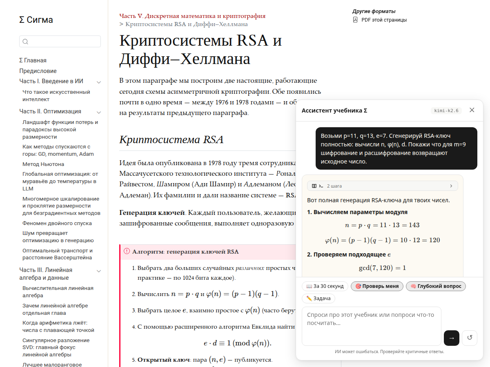

---

### ✅ `multihop_newton_vs_gradient` — multi_hop

**Q:** В чём отличие метода Ньютона от градиентного спуска для задач оптимизации? Какие из этих методов разобраны в учебнике?

_Chapter:_ `ch02_newton`

**Tools called:** read_chapter, search_textbook, read_chapter
**Tools expected:** search_textbook
**Images:** 0 (expected: no)
**Elapsed:** 128.0s


<details><summary>Answer</summary>


```
 В учебнике оба метода разобраны, но в разных главах:

- **Метод Ньютона** — в той главе, которую ты сейчас читаешь (`ch02_newton`);
- **Градиентный спуск (GD)**, а также его «родственники» — momentum и Adam — в главе [«Как методы спускаются с горы»](/story_optimizers.html).

## Главное отличие

**Градиентный спуск** смотрит только на наклон в текущей точке и делает шаг против градиента:

$$w_{t+1} = w_t - \eta\,\nabla L(w_t).$$

Шаг зависит от вручную заданной скорости обучения $\eta$. Если ландшафт вытянутый («овраг»), приходится брать крошечный $\eta$, иначе метод начинает скакать из стороны в сторону.

**Метод Ньютона** (для поиска минимума $g$) использует ещё и *кривизну* — вторую производную:

$$x_{k+1}=x_k-\frac{g'(x_k)}{g''(x_k)}.$$

Он строит в точке $x_k$ локальную **квадратичную модель** (параболу), касающуюся графика, и сразу прыгает в её вершину. По сути, метод сам подбирает длину шага, исходя из того, насколько «крут» график: где кривизна большая — шаг маленький, где полого — большой.

## Кратко: что в учебнике

| Метод | Где в Σ | Что использует |
|-------|---------|----------------|
| Ньютон | `ch02_newton` | Градиент + гессиан (вторая производная) |
| GD (градиентный спуск) | `story_optimizers` | Только градиент |
| Momentum | `story_optimizers` | Градиент + «инерция» прошлых шагов |
| Adam | `story_optimizers` | Градиент + адаптивный шаг по каждой координате |

Если хочешь, могу на конкретной функции в Python сравнить, как ведут себя шаги Ньютона и градиентн
…[truncated]
```

</details>


---

### ✅ `structural_kantorovich_theorem` — structural

**Q:** Сформулируй теорему о сходимости метода Герона.

_Chapter:_ `ch02_newton`

**Tools called:** find_theorem
**Tools expected:** find_theorem
**Images:** 0 (expected: no)
**Elapsed:** 84.9s


<details><summary>Answer</summary>


```
 Ты уже на этой главе — это **Теорема 2.1** прямо в разделе про сходимость.

**Формулировка:**

Для любого начального приближения $x_0 > 0$ последовательность метода Герона монотонно убывает (начиная с первой итерации $k=1$) и сходится к $\sqrt{a}$.

Если обозначить ошибку на $k$-м шаге как $e_k = x_k - \sqrt{a}$, то выполнены два соотношения:

$$e_{k+1} = \frac{e_k^2}{2x_k}$$

и, начиная с $k \ge 1$:

$$0 \le e_{k+1} \le \frac{e_k^2}{2\sqrt{a}}$$

**Что это значит простыми словами:**

- После первого шага метод всегда приближается к $\sqrt{a}$ «сверху», не прыгая туда-сюда.
- Ошибка на следующем шаге пропорциональна *квадрату* ошибки на текущем шаге — отсюда и **квадратичная сходимость**: число верных цифр примерно удваивается на каждой итерации.
- Знаменатель $2\sqrt{a}$ показывает, что для больших $a$ сходимость может быть чуть медленнее, но всё равно остаётся квадратичной.
```

</details>

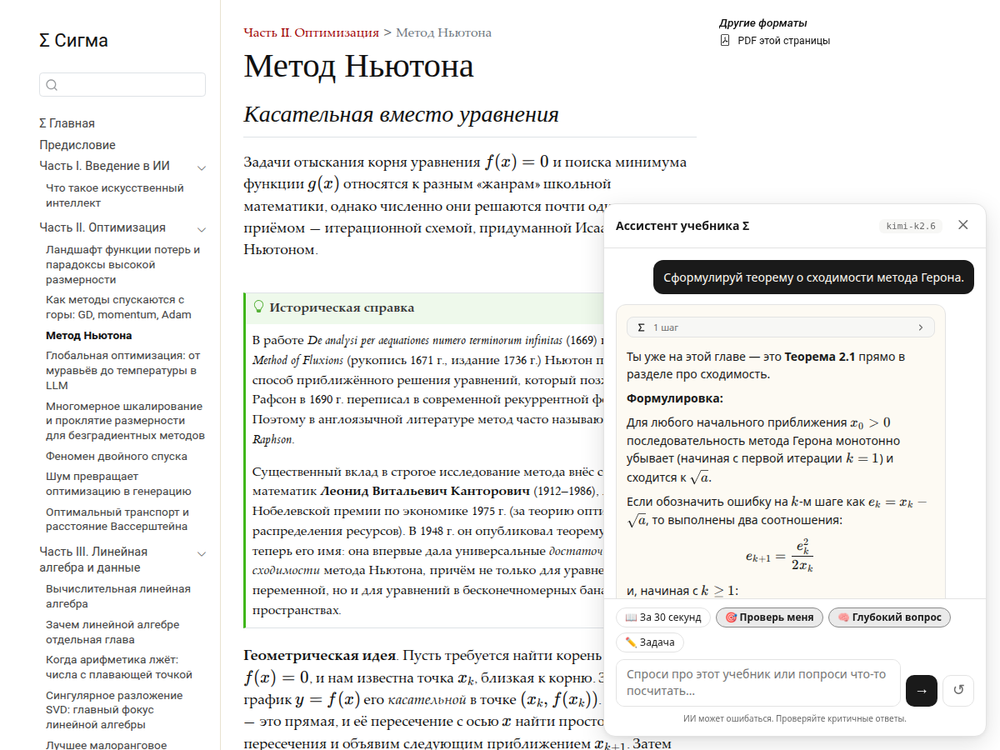

---

### ❌ `vision_refine_diverging_sgd` — vision_refine

**Q:** Запусти SGD на функции f(x) = x² с шагом η = 1.1 из x₀ = 2, 30 итераций. Что произойдёт? Если разойдётся — подбери рабочий шаг и покажи сходящуюся траекторию.

**Tools called:** python, python
**Tools expected:** python, python
**Images:** 2 (expected: yes)
**Elapsed:** 381.4s

_Missing substrings:_ ['расход', '0.5']

<details><summary>Answer</summary>


```
 При $\eta = 1{,}1$ метод **разойдётся**.

Обновление для $f(x)=x^2$: градиент $\nabla f(x)=2x$, поэтому

$$x_{k+1}=x_k-\eta\cdot 2x_k=(1-2\eta)\,x_k.$$

При $\eta=1{,}1$ множитель $1-2\eta = -1{,}2$, а $|-1{,}2| = 1{,}20 > 1$. Значит, каждый шаг **увеличивает** $|x_k|$ в $1{,}2$ раза и переворачивает знак. За 30 итераций $x$ взлетает с $2$ до **$474{,}75$** — видно на графике: осцилляция с растущей амплитудой.

---

**Рабочий шаг:** нужно $|1-2\eta|<1$, то есть $0<\eta<1$.

Вот два примера:

| шаг | множитель | поведение |
|-----|-----------|-----------|
| $\eta = 0{,}5$ | $1-2\eta = 0$ | сходится **за 1 шаг**: $x_1 = 0{,}0000$ |
| $\eta = 0{,}3$ | $1-2\eta = 0{,}4$ | плавная экспоненциальная сходимость: $x_5 \approx 0{,}02$, $x_{10} \approx 0{,}0002$, $x_{30} \approx 0$ |

На втором графике видно: оранжевая линия ($\eta=0{,}5$) падает в ноль мгновенно, синяя ($\eta=0{,}3$) — монотонно и быстро, но без скачков.

**Вывод:** для $x^2$ «потолок» шага равен $1$. При $\eta=1$ метод застревает в осцилляции $x=\pm 2$, а при $\eta>1$ — улетает в бесконечность.
```

</details>

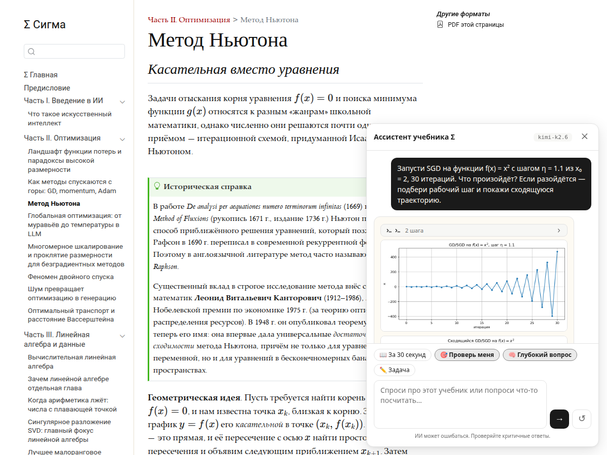

---

### ✅ `hashlib_demo` — compute_pure

**Q:** Посчитай SHA-256 хеш строки 'sigma' в hex.

_Chapter:_ `ch04_5_heshirovanie-teoriya-chisel-vstr`

**Tools called:** python
**Tools expected:** python
**Images:** 0 (expected: no)
**Elapsed:** 40.8s


<details><summary>Answer</summary>


```
 SHA-256 от строки `'sigma'` (в кодировке UTF-8):

**`38de90475bb334fb3dea5d54f250500aba60fe2c6158115d342b06bcb46e39bf`**

Это 64 шестнадцатеричных символа — ровно 256 бит, как и должно быть у SHA-256.
```

</details>

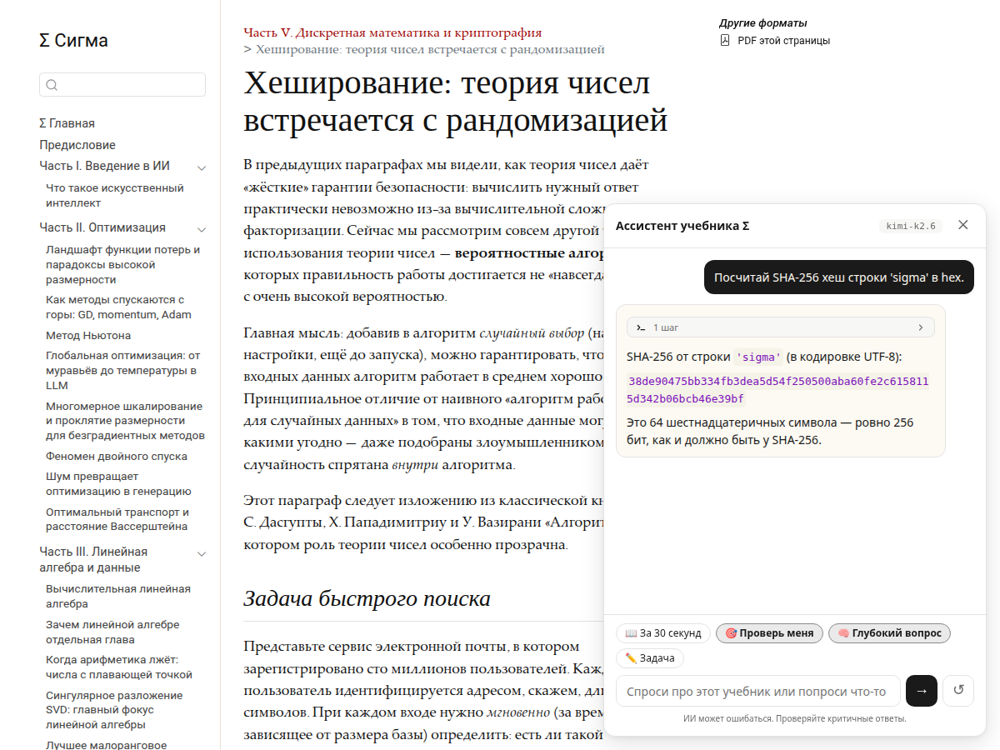

---

### ✅ `linreg_simple` — compute_plot

**Q:** Подбери линейную регрессию y = a*x + b для точек (1, 2.1), (2, 3.9), (3, 6.2), (4, 7.8). Покажи коэффициенты и график.

_Chapter:_ `ch03_2_lineynaya-regressiya-i-metod-nai`

**Tools called:** python
**Tools expected:** python
**Images:** 1 (expected: yes)
**Elapsed:** 104.9s


<details><summary>Answer</summary>


```
 Для точек (1, 2.1), (2, 3.9), (3, 6.2), (4, 7.8) методом наименьших квадратов получаем:

**y = 1.94·x + 0.15**

- **a = 1.94** — угловой коэффициент (наклон прямой)
- **b = 0.15** — свободный член (сдвиг по оси y)

На графике красные точки — исходные данные, синяя линия — подобранная регрессия. Видно, что прямая проходит близко ко всем точкам: отклонения минимальны, что и требуется от МНК. Если подставить x = 1, 2, 3, 4 в уравнение, получим предсказанные значения примерно 2.09, 4.03, 5.97, 7.91 — очень близко к реальным.
```

</details>

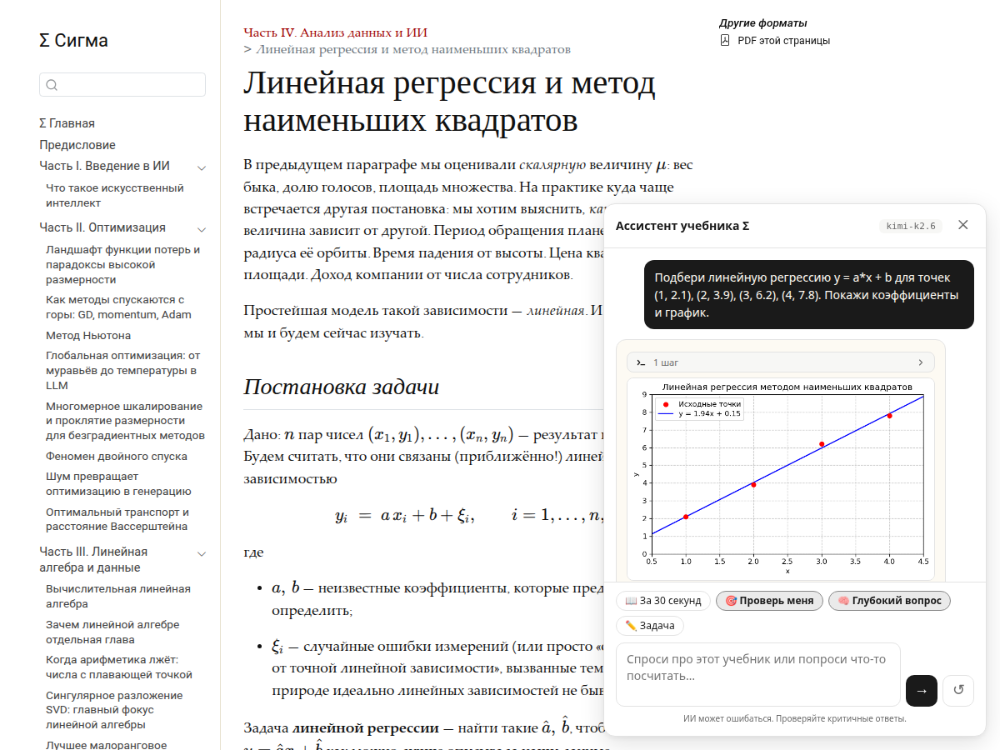

---

### ✅ `out_of_scope_recipe` — out_of_scope

**Q:** Дай мне рецепт борща.

**Tools called:** (none)
**Tools expected:** (none)
**Images:** 0 (expected: no)
**Elapsed:** 16.0s


<details><summary>Answer</summary>


```
 Я — ассистент учебника Σ, и помогаю по темам информатики, оптимизации, теории чисел, машинного обучения и ИИ. Рецепты борща, к сожалению, вне моей компетенции — я не смогу дать кулинарный совет.

Если появятся вопросы по методу Ньютона, сходимости итераций или связанным темам из учебника — обращайся!
```

</details>

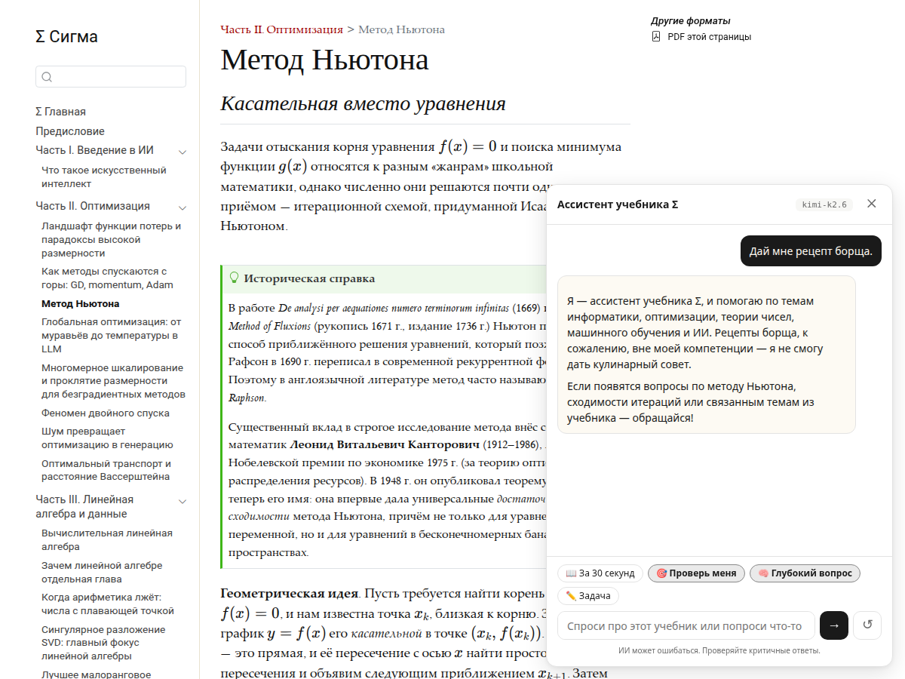

---

### ✅ `rsa_history` — rag_basic

**Q:** Кто придумал RSA и в каком году?

_Chapter:_ `ch04_3_kriptosistemy-rsa-i-diffi-hellma`

**Tools called:** search_textbook, search_textbook, search_textbook
**Tools expected:** search_textbook
**Images:** 0 (expected: no)
**Elapsed:** 122.1s


<details><summary>Answer</summary>


```
 Ты уже на этой главе — ответ прямо в разделе **«Криптосистема RSA»** и **«Почему RSA работает: корректность»**.

**RSA придумали три человека:**

- **Рональд Райвест** (Ronald Rivest)
- **Ади Шамир** (Adi Shamir)
- **Леонард Адлеман** (Leonard Adleman)

Все трое работали в MIT, и свою идею они **опубликовали в 1978 году**. Первые буквы их фамилий (R, S, A) и дали название системе.

**Интересный факт из учебника:** точно такую же схему независимо открыл в **1973 году** британский математик **Клиффорд Кокс** из правительственного центра связи GCHQ. Но его работа была засекречена и стала известна только в **1997 году** — к тому моменту Райвест, Шамир и Адлеман уже были мировыми знаменитостями, а Шамир даже получил Премию Тьюринга.
```

</details>


---

### ✅ `greeting_minimal` — out_of_scope

**Q:** Привет!

_Chapter:_ `ch02_newton`

**Tools called:** (none)
**Tools expected:** (none)
**Images:** 0 (expected: no)
**Elapsed:** 21.7s


<details><summary>Answer</summary>


```
 Привет! Если что-то непонятно по методу Ньютона — спрашивай, разберёмся.
```

</details>

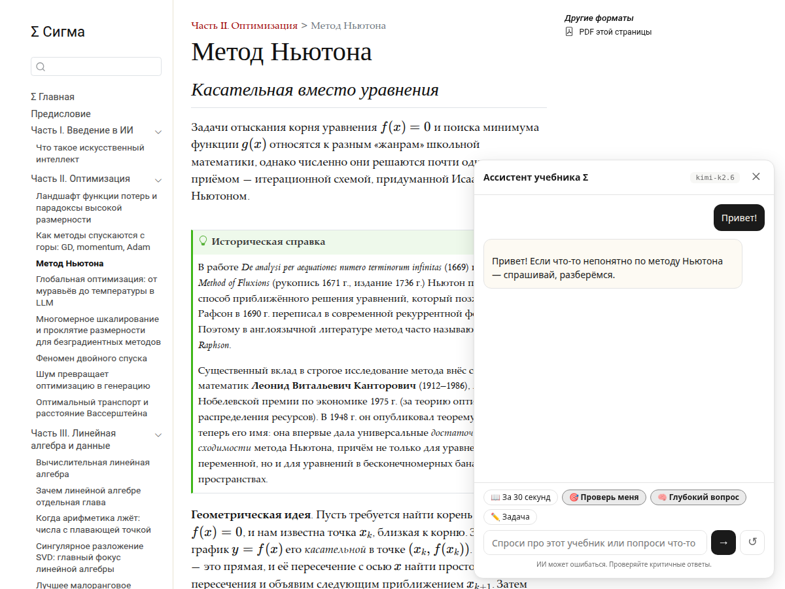

---

### ✅ `euclid_gcd_python` — compute_pure

**Q:** Посчитай НОД(48, 180) и НОД(1071, 462) через алгоритм Евклида в python.

_Chapter:_ `ch04_1_elementy-teorii-chisel`

**Tools called:** search_textbook, read_chapter, python
**Tools expected:** python
**Images:** 0 (expected: no)
**Elapsed:** 399.5s


<details><summary>Answer</summary>


```
 Ты уже на этой главе — раздел [«Алгоритм Евклида»](/ch04_1_elementy-teorii-chisel.html#subsec:euclid). Ключевая идея: если $a = bq + r$, то $\gcd(a, b) = \gcd(b, r)$. Повторяем деление с остатком, пока остаток не станет нулем.

**НОД(48, 180):**

- $48 = 0 \cdot 180 + 48$
- $180 = 3 \cdot 48 + 36$
- $48 = 1 \cdot 36 + 12$
- $36 = 3 \cdot 12 + 0$

**Ответ: НОД(48, 180) = 12**

**НОД(1071, 462):**

- $1071 = 2 \cdot 462 + 147$
- $462 = 3 \cdot 147 + 21$
- $147 = 7 \cdot 21 + 0$

**Ответ: НОД(1071, 462) = 21**

В первом случае алгоритм сделал 4 шага, во втором — 3. Для сравнения: если бы мы искали НОД через разложение на множители, пришлось бы факторизовать 1071, что уже не так быстро.
```

</details>


---

### ✅ `definition_superlinear` — definition

**Q:** Что значит сверхлинейная сходимость?

_Chapter:_ `ch02_newton`

**Tools called:** find_definition
**Tools expected:** find_definition
**Images:** 0 (expected: no)
**Elapsed:** 83.5s


<details><summary>Answer</summary>


```
 **Сверхлинейная сходимость** означает, что ошибка на каждом следующем шаге убывает быстрее, чем любая геометрическая прогрессия.

В учебнике это записано так ([Определение 2.3](/ch02_newton.html#ssec:thm-superlinear)):

> Последовательность $\{x_k\}$ сходится к $x^{\star}$ со **сверхлинейной скоростью**, если
> $$\lim_{k\to\infty}\dfrac{|x_{k+1}-x^{\star}|}{|x_k-x^{\star}|}=0.$$

**Что это значит простыми словами:**

* При обычной **линейной** сходимости ошибка каждый раз умножается примерно на одно и то же число $q < 1$ (например, ошибка падает в 2 раза за шаг).
* При **сверхлинейной** сходимости этот «коэффициент уменьшения» сам по себе стремится к нулю. То есть сначала ошибка падает, скажем, в 2 раза, потом в 5, потом в 100… и так далее — всё быстрее и быстрее.
* Если же выполнено ещё более сильное условие $|x_{k+1}-x^{\star}|\leq M |x_k-x^{\star}|^{2}$ (для некоторой константы $M>0$), то сходимость называют **квадратичной** — в этом случае число верных цифр примерно удваивается на каждой итерации.

Метод Ньютона как раз обладает квадратичной сходимостью (при хороших условиях), поэтому он находит корень с огромной скоростью, когда уже подобрался близко к ответу.
```

</details>

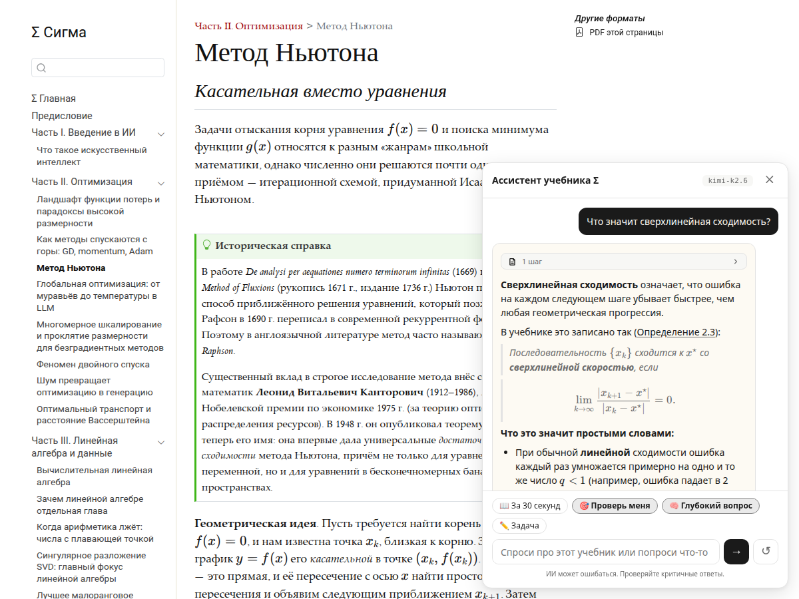

---

### ✅ `theorem_clt` — structural

**Q:** Сформулируй центральную предельную теорему как в учебнике.

_Chapter:_ `ch03_1_prosteyshie-primery-zadach-anali`

**Tools called:** find_theorem
**Tools expected:** find_theorem
**Images:** 0 (expected: no)
**Elapsed:** 53.2s


<details><summary>Answer</summary>


```
 **Теорема 3.3. Центральная предельная теорема (ЦПТ)** — прямо из твоей главы:

> Пусть $X_1, X_2, \dots$ — независимые одинаково распределённые случайные величины с математическим ожиданием $\mu$ и конечной дисперсией $\sigma^2 > 0$, $S_n = X_1 + \dots + X_n$. Тогда при $n \to \infty$
> 
> $$\Pr\!\left(\frac{S_n - n\mu}{\sigma\sqrt{n}} \leq x\right) \;\longrightarrow\; \Phi(x) \;\stackrel{\mathrm{def}}{=}\; \frac{1}{\sqrt{2\pi}}\int_{-\infty}^{x} e^{-t^{2}/2}\,dt$$
> 
> *(функция стандартного нормального распределения)*.

**Что это значит простыми словами:**

- У тебя есть много одинаковых «подопытных» случайных величин (например, результаты бросков кубика, ошибки измерений, рост людей) — все независимы и распределены одинаково.
- $\mu$ — их среднее значение, $\sigma^2$ — разброс (дисперсия).
- $S_n$ — сумма первых $n$ таких величин.
- Если взять эту сумму, вычесть из неё «ожидаемую» сумму $n\mu$ и поделить на $\sigma\sqrt{n}$ (то есть нормировать), то полученная величина ведёт себя всё ближе к **стандартному нормальному распределению** — колоколообразной кривой с центром в нуле.

**Почему это важно:** какое бы исходное распределение ни было (при условии, что дисперсия конечна), нормированная сумма многих независимых одинаковых случайных величин всегда «прижимается» к нормальному закону. Именно поэтому нормальное распределение встречается везде — от ошибок измерений до роста населения.

Источник: [Подход 2: Центральная предельная теорема](/ch03_1_prosteyshie-primery-zadach-a
…[truncated]
```

</details>

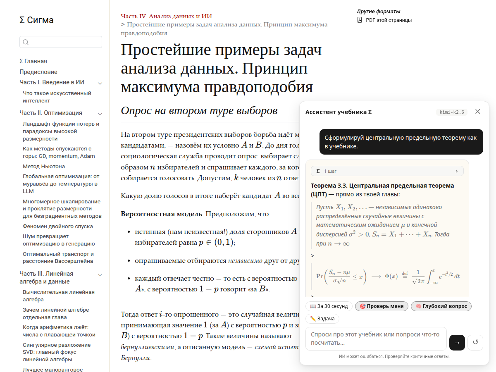

---

### ✅ `plot_sincos_overlay` — compute_plot

**Q:** Построй графики sin(x) и cos(x) на интервале [-2π, 2π] на одном поле. Сделай легенду.

**Tools called:** python
**Tools expected:** python
**Images:** 1 (expected: yes)
**Elapsed:** 103.0s


<details><summary>Answer</summary>


```
 Готово! Вот графики $\sin(x)$ и $\cos(x)$ на одном поле:

**Что видно на графике:**
- **Синяя кривая** — $\sin(x)$, проходит через начало координат $(0, 0)$
- **Оранжевая кривая** — $\cos(x)$, в точке $x=0$ равна $1.00$
- Обе функции колеблются между $-1$ и $1$ с периодом $2\pi \approx 6.28$
- $\cos(x)$ опережает $\sin(x)$ по фазе на $\frac{\pi}{2}$ — это заметно по тому, что максимумы $\cos(x)$ совпадают с точками, где $\sin(x)$ равен нулю и растёт
- Функции пересекаются в точках, где $\sin(x) = \cos(x)$, то есть при $x = -\frac{7\pi}{4}, -\frac{3\pi}{4}, \frac{\pi}{4}, \frac{5\pi}{4}$ и т.д. — на графике это видно в четвертях между осями

Легенда в правом верхнем углу, ось $X$ размечена в долях $\pi$ для удобства.
```

</details>

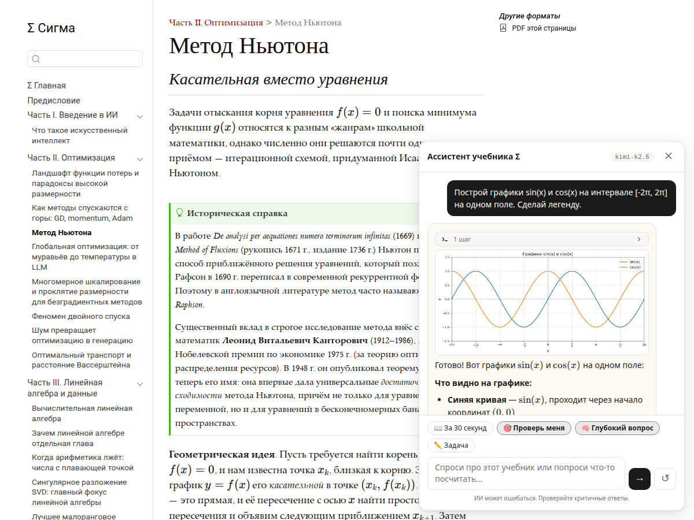

---

### ✅ `fragment_explanation` — rag_basic

**Q:** Если кто-то предлагает использовать обновление x_{k+1} = x_k - f(x_k)·f'(x_k) вместо классического Ньютона — что это за идея и она работает?

_Chapter:_ `ch02_newton`

**Tools called:** read_chapter, search_textbook, search_textbook, python, python
**Tools expected:** (none)
**Images:** 0 (expected: no)
**Elapsed:** 344.4s


<details><summary>Answer</summary>


```
 Это **не метод Ньютона**, а совсем другая идея — и она работает плохо, если использовать её «в лоб».

## Что это на самом деле

Предложенная формула:
$$x_{k+1} = x_k - f(x_k)\cdot f'(x_k)$$

— это **градиентный спуск** для функции $F(x) = \frac{1}{2}f(x)^2$ с шагом (learning rate) равным 1.

Действительно, производная:
$$F'(x) = f(x)\cdot f'(x)$$

Так что формула переписывается как:
$$x_{k+1} = x_k - F'(x_k)$$

## Почему это не Ньютон

В классическом методе Ньютона (формула 2.1 из учебника) мы делим на $f'(x_k)$:
$$x_{k+1} = x_k - \frac{f(x_k)}{f'(x_k)}$$

Это даёт **квадратичную сходимость** — число верных знаков удваивается на каждом шаге.

В предложенной схеме мы **умножаем** на $f'(x_k)$ вместо деления. Это кардинально меняет поведение:

| | Классический Ньютон | Предложенная схема |
|---|---|---|
| **Идея** | Найти ноль $f(x)=0$ | Минимизировать $F(x)=\frac{1}{2}f(x)^2$ |
| **Шаг** | $-\frac{f}{f'}$ | $-f\cdot f'$ |
| **Сходимость** | Квадратичная | Линейная (если вообще) |
| **Шаг нужно подбирать?** | Нет | Да, обязательно |

## Что показывают числа

Проверим на $f(x) = x^2 - 2$ (ищем $\sqrt{2} \approx 1.414$):

**Классический Ньютон** — сошёлся за 4 шага до машинной точности:
- $x_0 = 2.0 \to x_1 = 1.5 \to x_2 = 1.4167 \to x_3 = 1.4142156863 \to x_4 = 1.4142135624$

**Предложенная схема** — **расходится катастрофически**:
- $x_0 = 2.0 \to x_1 = -6.0 \to x_2 = 402.0 \to$ взрыв

Проблема в том, что шаг 1.0 слишком большой для градиентного спуска. Если уменьшить шаг до 0
…[truncated]
```

</details>

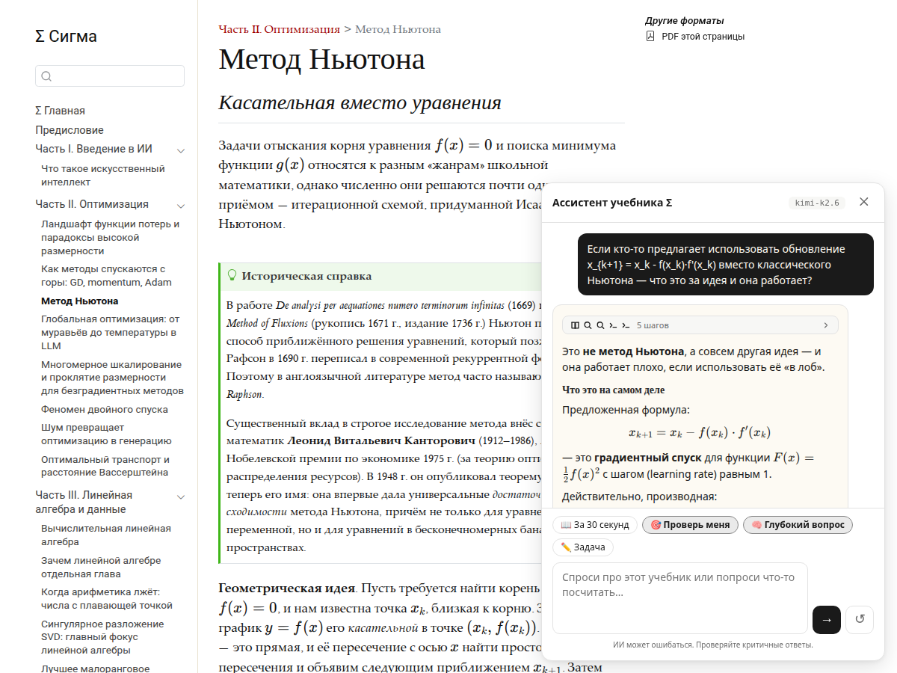

---

### ✅ `eigenvalues_numpy` — compute_pure

**Q:** Найди собственные значения матрицы [[2, 1], [1, 2]] через numpy.

_Chapter:_ `ch_linalg`

**Tools called:** python
**Tools expected:** python
**Images:** 0 (expected: no)
**Elapsed:** 61.6s


<details><summary>Answer</summary>


```
 Вот результат `numpy`:

```python
import numpy as np
A = np.array([[2, 1], [1, 2]])
print(np.linalg.eigvals(A))
```

**Собственные значения:** $3.00$ и $1.00$.

Можно быстро проверить «на бумаге»: характеристический многочлен  
$$\det(A - \lambda I) = (2-\lambda)^2 - 1 = \lambda^2 - 4\lambda + 3 = 0,$$  
корни — действительно $\lambda_1 = 3$, $\lambda_2 = 1$.
```

</details>

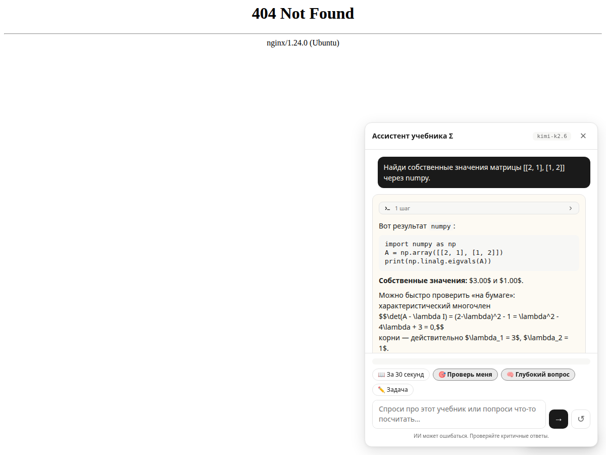

---

### ✅ `plot_loss_landscape` — compute_plot

**Q:** Построй контурный график функции потерь L(a, b) = sum((a*x_i + b - y_i)^2) для точек (1,2), (2,3), (3,5), (4,4) на сетке a in [-2, 4], b in [-3, 3].

_Chapter:_ `ch03_2_lineynaya-regressiya-i-metod-nai`

**Tools called:** python
**Tools expected:** python
**Images:** 1 (expected: yes)
**Elapsed:** 128.6s


<details><summary>Answer</summary>


```
 Вот контурный график функции потерь для твоих точек.

**Что видно на графике:**

- **Минимум** находится в точке **(a = 0.80, b = 1.50)** — это и есть решение метода наименьших квадратов. Значение функции потерь в минимуме: **L_min = 1.80**.

- Линии уровня образуют **эллипсы**, вытянутые вдоль некоторой диагонали. Это типично для квадратичной функции потерь линейной регрессии: параметры a и b коррелированы — если увеличить наклон a, можно частично компенсировать сдвиг b и наоборот, поэтому эллипс вытянут.

- Вдали от минимума значения L растут быстро (контуры с метками 50, 100, 300 и выше), а близко к центру — медленно (контуры 2.7, 4.0, 6.0). Это говорит о «пологом дне» вблизи оптимума: небольшие изменения a и b в окрестности минимума слабо влияют на ошибку.

- Градиентный спуск на таком ландшафте будет двигаться зигзагом, если шаг не подобран под вытянутость эллипса — именно поэтому в методе наименьших квадратов обычно решают систему нормальных уравнений аналитически, а не итеративно.
```

</details>

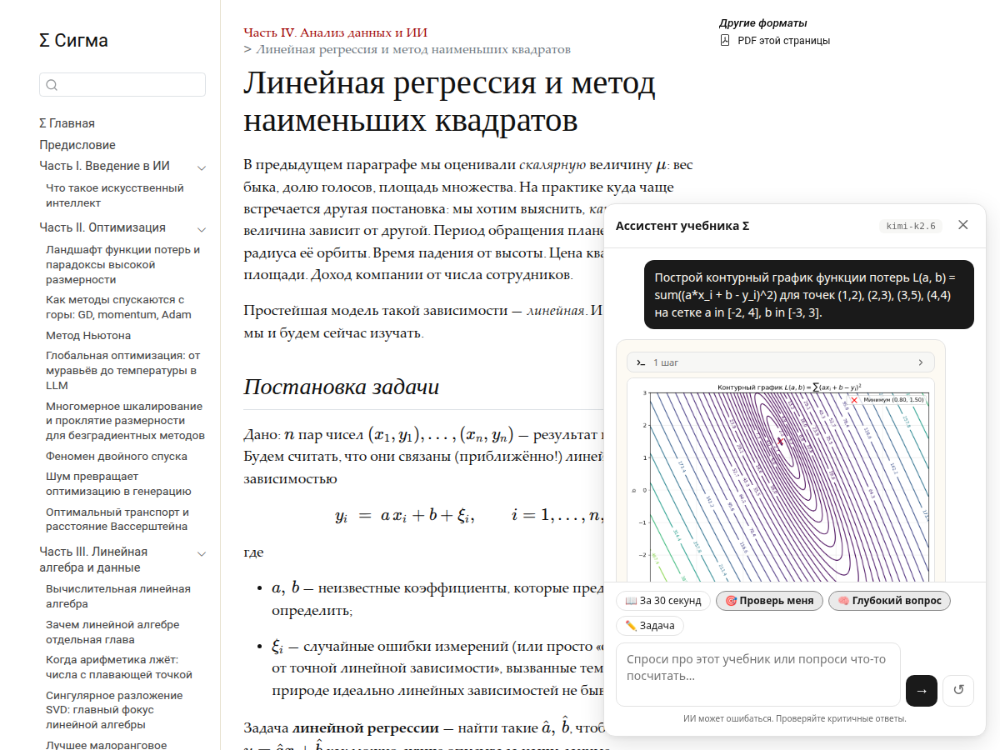

---

### ✅ `diffie_hellman_compute` — compute_pure

**Q:** Проведи протокол Диффи–Хеллмана: p=23, g=5. Алиса берёт a=6, Боб берёт b=15. Какой общий секрет?

_Chapter:_ `ch04_3_kriptosistemy-rsa-i-diffi-hellma`

**Tools called:** read_chapter, search_textbook, read_chapter, read_chapter, search_textbook, python
**Tools expected:** python
**Images:** 0 (expected: no)
**Elapsed:** 147.0s


<details><summary>Answer</summary>


```
 Ты уже на этой главе — там как раз разбирается протокол Диффи–Хеллмана. Давай проведём его с твоими числами.

**Параметры:** $p = 23$, $g = 5$ (открытые, известны всем).

**Шаг 1. Алиса** выбирает секрет $a = 6$ и вычисляет:
$$A = g^a \bmod p = 5^6 \bmod 23 = 15\,625 \bmod 23 = \mathbf{8}$$
Число $A = 8$ она отправляет Бобу по открытому каналу.

**Шаг 2. Боб** выбирает секрет $b = 15$ и вычисляет:
$$B = g^b \bmod p = 5^{15} \bmod 23 = \mathbf{19}$$
Число $B = 19$ он отправляет Алисе по открытому каналу.

**Шаг 3. Алиса** получает $B = 19$ и вычисляет общий секрет:
$$s = B^a \bmod p = 19^6 \bmod 23 = \mathbf{2}$$

**Шаг 4. Боб** получает $A = 8$ и вычисляет общий секрет:
$$s = A^b \bmod p = 8^{15} \bmod 23 = \mathbf{2}$$

**Общий секрет: 2.**

Почему это работает? Потому что у обоих получается одно и то же число $g^{ab} \bmod p$. Злоумышленник, подслушивающий канал, видит только $g^a \bmod p$ и $g^b \bmod p$, но чтобы найти секрет, ему нужно было бы вычислить дискретный логарифм — а это сложная задача.
```

</details>

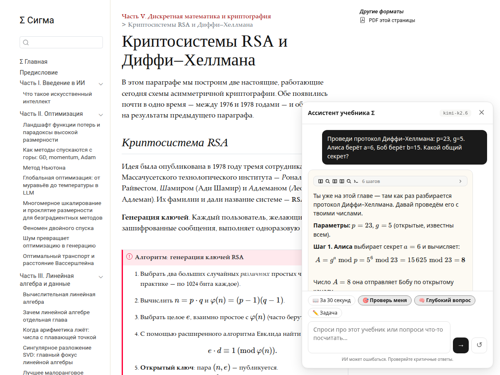

---

### ✅ `outline_chapter` — structural

**Q:** Перечисли основные разделы главы про Ньютона.

_Chapter:_ `ch02_newton`

**Tools called:** get_outline
**Tools expected:** (none)
**Images:** 0 (expected: no)
**Elapsed:** 50.0s


<details><summary>Answer</summary>


```
 Вот основные разделы главы **«Метод Ньютона»**:

1. **Касательная вместо уравнения** — идея линеаризации и вывод итерации.
2. **Ньютон для оптимизации** — переход от поиска корня к поиску минимума/максимума.
3. **Квадратный корень за пять шагов** — метод Герона (Ньютона для $\sqrt{a}$):
   - Сходимость через сжимающее отображение
4. **Деление без деления** — как Ньютоном считать $1/a$:
   - Анализ сходимости
5. **Численный эксперимент на Python** — проверка скорости сходимости в коде.
6. **Когда сходимость сверхлинейна*** — теоретическое условие сверхлинейной сходимости.
```

</details>


---

### ✅ `math_latex_derivation` — rag_basic

**Q:** Выведи формулу метода Ньютона через касательную. Формулу запиши через LaTeX.

_Chapter:_ `ch02_newton`

**Tools called:** read_chapter
**Tools expected:** (none)
**Images:** 0 (expected: no)
**Elapsed:** 81.2s


<details><summary>Answer</summary>


```
 Ты уже на этой главе — раздел «Касательная вместо уравнения» как раз про это.

**Вывод.**

Уравнение касательной к графику $y=f(x)$ в точке $x_k$:

$$y = f(x_k) + f'(x_k)\,(x - x_k)$$

Чтобы найти её пересечение с осью $x$, полагаем $y=0$ и решаем относительно $x$:

$$0 = f(x_k) + f'(x_k)\,(x - x_k)$$

$$f'(x_k)\,(x - x_k) = -f(x_k)$$

$$x - x_k = -\frac{f(x_k)}{f'(x_k)}$$

Новое приближение обозначают $x_{k+1}$, и получается итерационная формула метода Ньютона:

$$\boxed{x_{k+1} = x_k - \frac{f(x_k)}{f'(x_k)}\,,\qquad k=0,1,2,\dots}$$

Это формула (2.1) из учебника. Геометрически на каждом шаге мы заменяем график его касательной и берём корень этой прямой как следующее приближение.
```

</details>


---

### ✅ `definition_perceptron` — definition

**Q:** Что такое полносвязная нейронная сеть?

_Chapter:_ `ch03_3_zadacha-klassifikacii-i-neyronny`

**Tools called:** find_definition
**Tools expected:** find_definition
**Images:** 0 (expected: no)
**Elapsed:** 193.4s


<details><summary>Answer</summary>


```
 Ты уже на нужной главе — этот раздел есть прямо в ней. Вот краткая выжимка.

**Полносвязная нейронная сеть** (MLP) глубины $L$ — это функция $\mathbf{x}\mapsto \mathbf{p}(\mathbf{x})$, заданная как композиция $L$ слоёв:

$$
\begin{aligned}
\mathbf{z}^{(\ell)} &= W^{(\ell)} \mathbf{a}^{(\ell-1)} + \mathbf{b}^{(\ell)},\qquad
\mathbf{a}^{(\ell)} = \sigma\bigl(\mathbf{z}^{(\ell)}\bigr),
\qquad \ell=1,\dots,L-1,
\\
\mathbf{z}^{(L)} &= W^{(L)} \mathbf{a}^{(L-1)} + \mathbf{b}^{(L)},\qquad
\mathbf{p}(\mathbf{x}) = \mathrm{softmax}\bigl(\mathbf{z}^{(L)}\bigr).
\end{aligned}
$$

**Что здесь что:**
- $\mathbf{a}^{(0)}=\mathbf{x}$ — вход сети;
- $W^{(\ell)}\in\mathbb{R}^{d_\ell\times d_{\ell-1}}$ — матрица весов $\ell$-го слоя, $\mathbf{b}^{(\ell)}\in\mathbb{R}^{d_\ell}$ — вектор смещений (bias);
- $\sigma$ — функция активации, применяемая покомпонентно;
- $d_1,\dots,d_{L-1}$ — ширины скрытых слоёв, $d_L$ — число классов (в учебнике — 10);
- $\mathrm{softmax}$ превращает вектор «сырых» чисел $\mathbf{z}^{(L)}$ в распределение вероятностей по формуле $\mathrm{softmax}(\mathbf{z})_c = e^{z_c}/\sum_{c'} e^{z_{c'}}$;
- все матрицы $W^{(\ell)}$ и векторы $\mathbf{b}^{(\ell)}$ вместе составляют обучаемые параметры $\boldsymbol{\theta}$ модели.

**Простыми словами:** на каждом слое сеть берёт все значения с предыдущего слоя, строит из них линейную комбинацию (умножает на веса и добавляет смещение), пропускает через нелинейность $\sigma$ и передаёт дальше. Последний слой превращает результат в 
…[truncated]
```

</details>


---

### ✅ `refuse_unknown_year` — out_of_scope

**Q:** В каком году Гаусс изобрёл метод сопряжённых градиентов?

_Chapter:_ `ch02_newton`

**Tools called:** search_textbook, search_textbook, search_textbook, search_textbook, get_outline, search_textbook, search_textbook, search_textbook
**Tools expected:** (none)
**Images:** 0 (expected: no)
**Elapsed:** 164.4s


<details><summary>Answer</summary>


```
В учебнике Σ я не нашёл метода сопряжённых градиентов — ни в главе про Ньютона, ни в соседних разделах, которые я проверил.

**Вне учебника:** метод сопряжённых градиентов придумали **не Гаусс**, а Магнус Хестенс (Magnus Hestenes) и Эдуард Штифель (Eduard Stiefel) в **1952 году**. Гаусс (1777–1855) к этому методу отношения не имеет.
```

</details>


---
