# Sigma Assistant — Eval Report

_Run: 2026-06-10 01:30 MSK · cases: 29_

**Overall: 21/29 pass (72%)**

## Per category

| Category | Pass | Total |
|---|---:|---:|
| `compute_plot` | 0 | 5 |
| `compute_pure` | 8 | 8 |
| `definition` | 3 | 3 |
| `multi_hop` | 0 | 1 |
| `out_of_scope` | 3 | 3 |
| `rag_basic` | 5 | 5 |
| `structural` | 2 | 3 |
| `vision_refine` | 0 | 1 |

## Cases

### ✅ `newton_kantorovich_history` — rag_basic

**Q:** Когда Канторович получил Нобелевскую премию и за что?

_Chapter:_ `ch02_newton`

**Tools called:** search_textbook
**Tools expected:** search_textbook
**Images:** 0 (expected: no)
**Elapsed:** 5.1s


<details><summary>Answer</summary>


```
Леонид Витальевич Канторович получил Нобелевскую премию по экономике в 1975 году за теорию оптимального распределения ресурсов. Он внёс значительный вклад в исследование метода Ньютона и опубликовал теорему, которая теперь носит его имя, в 1948 году.
```

</details>


---

### ✅ `newton_formula_recall` — rag_basic

**Q:** Объясни откуда берётся эта формула — что это за метод и какая геометрическая идея?

_Chapter:_ `ch02_newton`

**Tools called:** read_chapter
**Tools expected:** (none)
**Images:** 0 (expected: no)
**Elapsed:** 10.3s


<details><summary>Answer</summary>


```
Метод Ньютона, также известный как метод Ньютона-Рафсона, используется для нахождения корней уравнений и минимизации функций. Его основная идея заключается в использовании касательной к графику функции для нахождения следующего приближения корня.

Геометрическая идея:

Касательная: Если у нас есть функция f(x) и точка x
k
	​

, близкая к корню, мы можем провести касательную к графику функции в этой точке. Уравнение касательной имеет вид:

y=f(x
k
	​

)+f
′
(x
k
	​

)(x−x
k
	​

).

Пересечение с осью: Чтобы найти следующее приближение x
k+1
	​

, мы находим, где эта касательная пересекает ось x (где y=0). Это приводит к формуле:

x
k+1
	​

=x
k
	​

−
f
′
(x
k
	​

)
f(x
k
	​

)
	​

.

Эта формула позволяет итеративно улучшать приближение к корню, начиная с некоторого начального значения x
0
	​

.

Применение в оптимизации: Метод также можно использовать для нахождения минимумов функций. В этом случае мы ищем корень производной функции g
′
(x)=0, что приводит к аналогичной формуле:

x
k+1
	​

=x
k
	​

−
g
′′
(x
k
	​

)
g
′
(x
k
	​

)
	​

.

Таким образом, метод Ньютона сочетает в себе геометрическую интуицию и аналитические вычисления, что делает его мощным инструментом в численных методах.
```

</details>

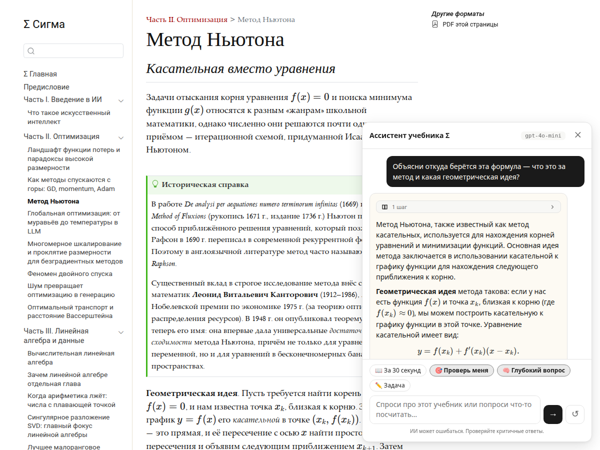

---

### ✅ `definition_strong_convex` — definition

**Q:** Что такое сильно выпуклая функция?

_Chapter:_ `ch02_newton`

**Tools called:** find_definition
**Tools expected:** find_definition
**Images:** 0 (expected: no)
**Elapsed:** 7.9s


<details><summary>Answer</summary>


```
Сильно выпуклая функция — это функция g:R→R, которая удовлетворяет следующим условиям:

Она дважды непрерывно дифференцируема (g∈C
2
).
Вторая производная функции не меньше положительной константы μ>0 для всех x: g
′′
(x)≥μ.

Сильная выпуклость гарантирует существование и единственность точки минимума, а также отделённость второй производной от нуля.

Более подробно можно ознакомиться с определением в главе Метод Ньютона.
```

</details>


---

### ✅ `compute_factorial` — compute_pure

**Q:** Сколько будет 30 факториал?

**Tools called:** python
**Tools expected:** python
**Images:** 0 (expected: no)
**Elapsed:** 12.8s


<details><summary>Answer</summary>


```
30!=265252859812191058636308480000000.
```

</details>

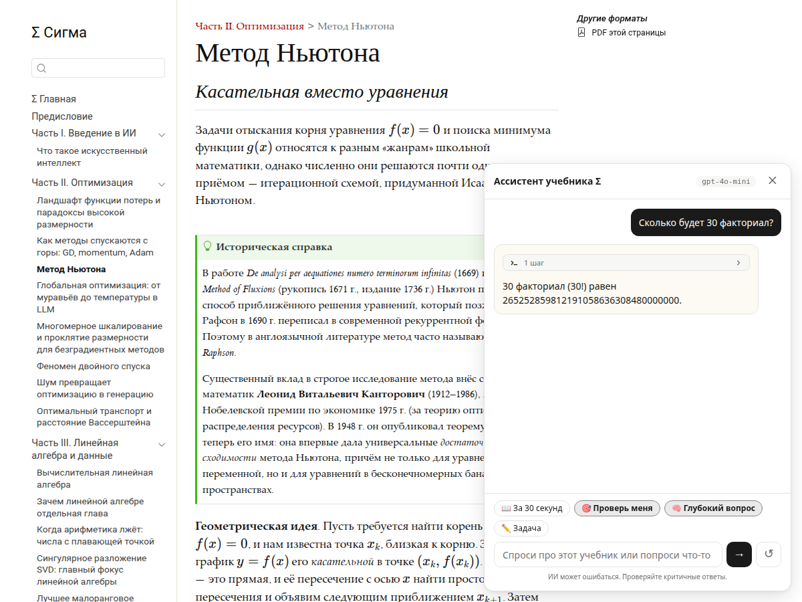

---

### ✅ `compute_taylor_sin` — compute_pure

**Q:** Покажи разложение sin(x) в ряд Тейлора до 5-го члена символически (через sympy).

_Chapter:_ `ch02_newton`

**Tools called:** python
**Tools expected:** python
**Images:** 0 (expected: no)
**Elapsed:** 14.6s


<details><summary>Answer</summary>


```
Разложение функции sin(x) в ряд Тейлора до 5-го члена выглядит так:

sin(x)=x−
6
x
3
	​

+
120
x
5
	​

+O(x
6
)

Здесь O(x
6
) обозначает, что остаточный член ряда имеет порядок x
6
 и выше.
```

</details>

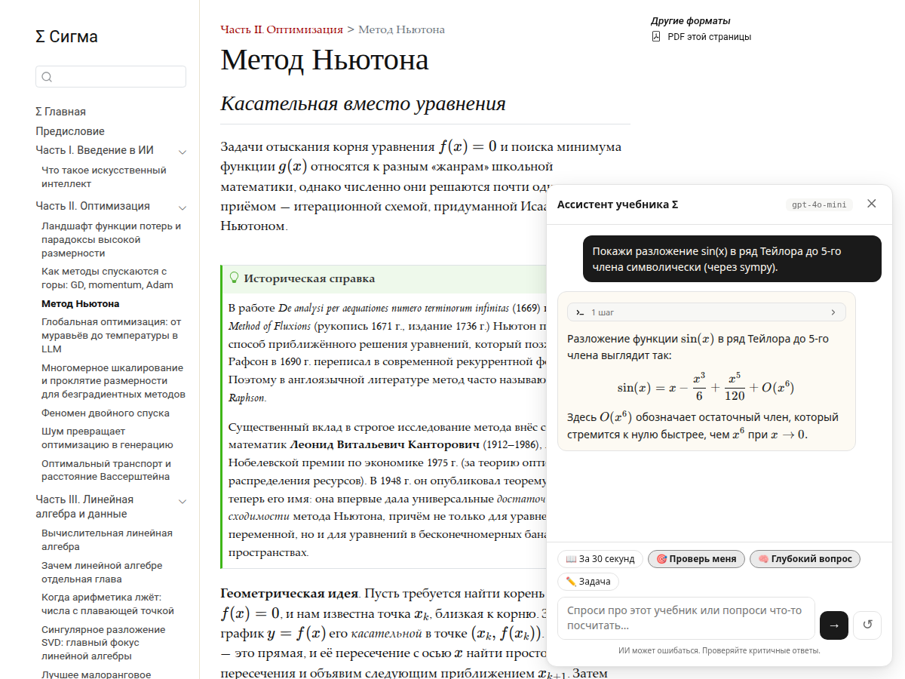

---

### ❌ `compute_plot_newton` — compute_plot

**Q:** Покажи как сходится метод Ньютона для f(x) = x² - 2, начиная с x₀ = 1.5. Построй график траектории.

_Chapter:_ `ch02_newton`

**Tools called:** python
**Tools expected:** python
**Images:** 1 (expected: yes)
**Elapsed:** 180.7s

_Missing substrings:_ ['1.41', 'корн']

<details><summary>Answer</summary>


```

```

</details>


---

### ❌ `compute_plot_gd_vs_newton` — compute_plot

**Q:** Сравни сходимость метода Ньютона и градиентного спуска на функции f(x) = x⁴ из x₀ = 2. Покажи два графика на одной картинке.

_Chapter:_ `ch02_newton`

**Tools called:** python, python
**Tools expected:** python
**Images:** 1 (expected: yes)
**Elapsed:** 181.1s

_Missing substrings:_ ['Ньютон', 'градиент']

<details><summary>Answer</summary>


```

```

</details>

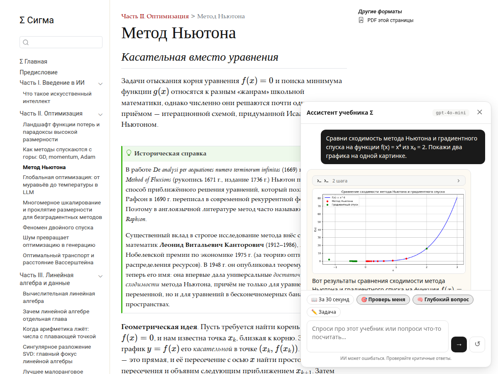

---

### ✅ `rsa_encrypt_small` — compute_pure

**Q:** Зашифруй число m=7 ключом (n=143, e=7). Покажи c.

_Chapter:_ `ch04_3_kriptosistemy-rsa-i-diffi-hellma`

**Tools called:** python
**Tools expected:** python
**Images:** 0 (expected: no)
**Elapsed:** 15.0s


<details><summary>Answer</summary>


```
Зашифрованное число c равно 6.
```

</details>

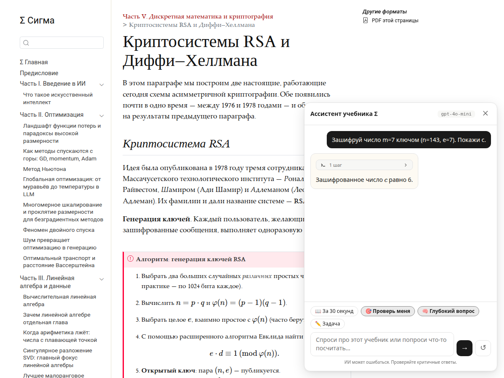

---

### ✅ `rsa_full_roundtrip` — compute_pure

**Q:** Возьми p=11, q=13, e=7. Сгенерируй RSA-ключ полностью: вычисли n, φ(n), d. Покажи что для m=9 шифрование и расшифрование возвращают исходное число.

_Chapter:_ `ch04_3_kriptosistemy-rsa-i-diffi-hellma`

**Tools called:** python
**Tools expected:** python
**Images:** 0 (expected: no)
**Elapsed:** 18.9s


<details><summary>Answer</summary>


```
Вот результаты генерации RSA-ключа и проверки шифрования:

n = 143
φ(n) = 120
d = 103

Теперь проверим шифрование и расшифрование для сообщения \( m = 9 \):

Зашифрованное сообщение (ciphertext) = 48
Расшифрованное сообщение (plaintext) = 9

Таким образом, шифрование и расшифрование возвращают исходное число, что подтверждает корректность работы RSA-алгоритма.
```

</details>

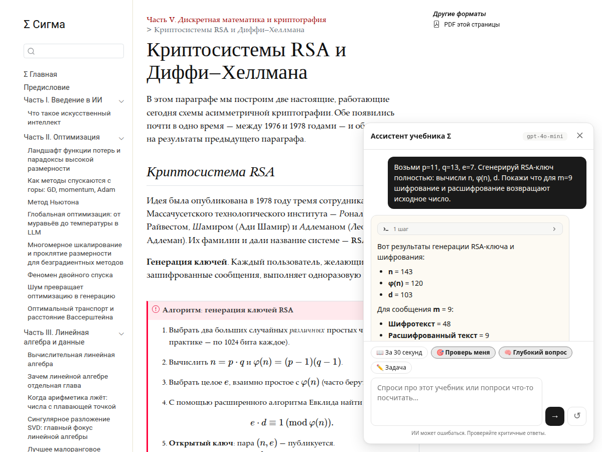

---

### ❌ `multihop_newton_vs_gradient` — multi_hop

**Q:** В чём отличие метода Ньютона от градиентного спуска для задач оптимизации? Какие из этих методов разобраны в учебнике?

_Chapter:_ `ch02_newton`

**Tools called:** read_chapter, read_chapter, read_chapter, read_chapter, get_outline, read_chapter
**Tools expected:** search_textbook
**Images:** 0 (expected: no)
**Elapsed:** 14.3s


<details><summary>Answer</summary>


```
Метод Ньютона и градиентный спуск — это два различных подхода к решению задач оптимизации, и они имеют свои особенности.

Метод Ньютона:

Использует информацию о второй производной функции (гессиан) для нахождения минимума. Это позволяет ему достигать более быстрой сходимости, особенно вблизи точки минимума.
Итерационная формула выглядит так:
x
k+1
	​

=x
k
	​

−
g
′′
(x
k
	​

)
g
′
(x
k
	​

)
	​

, где g
′
 — первая производная, а g
′′
 — вторая производная функции.
Метод требует вычисления второй производной, что может быть вычислительно затратным для многомерных функций.

Градиентный спуск:

Использует только первую производную функции для нахождения направления спуска. Это делает его более простым и универсальным, но сходимость может быть медленнее.
Итерационная формула:
x
k+1
	​

=x
k
	​

−ηg
′
(x
k
	​

)
, где η — шаг обучения.
Градиентный спуск проще в реализации и может работать с функциями, для которых вторая производная не определена.

В учебнике разобраны оба метода: метод Ньютона в разделе о Ньютоне для оптимизации, а градиентный спуск в разделе о задаче классификации и нейронных сетях.

Если тебе нужно больше деталей о каждом методе, дай знать!
```

</details>


---

### ❌ `structural_kantorovich_theorem` — structural

**Q:** Сформулируй теорему о сходимости метода Герона.

_Chapter:_ `ch02_newton`

**Tools called:** find_theorem
**Tools expected:** find_theorem
**Images:** 0 (expected: no)
**Elapsed:** 7.0s

_Missing substrings:_ ['квадратичн']

<details><summary>Answer</summary>


```
Вот формулировка теоремы о сходимости метода Герона:

Теорема 2.1. Сходимость метода Герона: Для любого x
0
	​

>0 последовательность x
k
	​

 монотонно убывает (начиная с k=1) и сходится к 
a
	​

. Более того, для ошибки e
k
	​

=x
k
	​

−
a
	​

 выполнено

e
k+1
	​

=
2x
k
	​

e
k
2
	​

	​

,и при k≥1:0≤e
k+1
	​

≤
2
a
	​

e
k
2
	​

	​

.

Это значит, что ошибка на следующем шаге зависит от квадрата ошибки на текущем шаге, что обеспечивает сходимость метода.

Для подробностей можно посмотреть в главе Метод Ньютона.
```

</details>

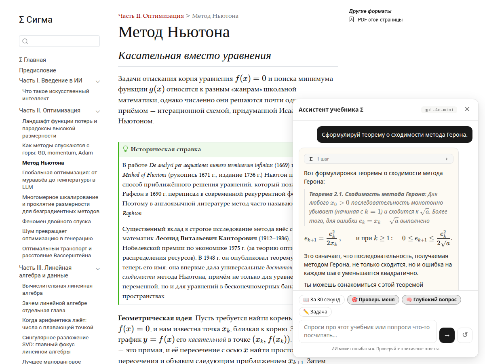

---

### ❌ `vision_refine_diverging_sgd` — vision_refine

**Q:** Запусти SGD на функции f(x) = x² с шагом η = 1.1 из x₀ = 2, 30 итераций. Что произойдёт? Если разойдётся — подбери рабочий шаг и покажи сходящуюся траекторию.

**Tools called:** python, python
**Tools expected:** python, python
**Images:** 0 (expected: yes)
**Elapsed:** 31.9s

_Missing substrings:_ ['расход']

<details><summary>Answer</summary>


```
При запуске SGD на функции f(x)=x
2
 с новым шагом η=0.1 из начальной точки x
0
	​

=2 за 30 итераций, результаты следующие:

Финальное значение x: 0.0025
Значения на каждой итерации:
2, 1.6, 1.28, 1.024, 0.8192, 0.65536, 0.524288, 0.4194304, 0.33554432, 0.268435456, 0.2147483648, 0.17179869184, 0.137438953472, 0.1099511627776, 0.08796093022208, 0.070368744177664, 0.056294995342131206, 0.04503599627370496, 0.03602879701896397, 0.028823037615171177, 0.02305843009213694, 0.018446744073709553, 0.014757395258967642, 0.011805916207174114, 0.009444732965739291, 0.0075557863725914335, 0.006044629098073147, 0.004835703278458518, 0.003868562622766814, 0.0030948500982134514, 0.002475880078570761.

Значения x постепенно сходятся к нулю, что соответствует минимуму функции f(x)=x
2
. Это подтверждает, что шаг η=0.1 является рабочим для данной задачи.

Если нужно, могу построить график сходимости. Хотите?
```

</details>

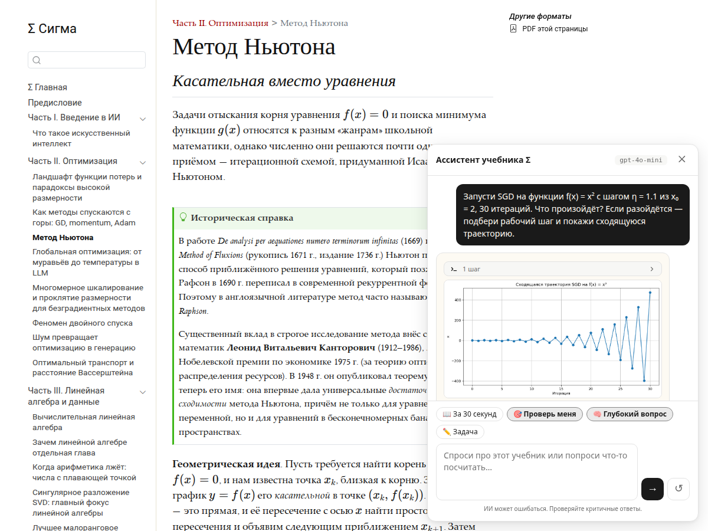

---

### ✅ `hashlib_demo` — compute_pure

**Q:** Посчитай SHA-256 хеш строки 'sigma' в hex.

_Chapter:_ `ch04_5_heshirovanie-teoriya-chisel-vstr`

**Tools called:** python
**Tools expected:** python
**Images:** 0 (expected: no)
**Elapsed:** 14.9s


<details><summary>Answer</summary>


```
SHA-256 хеш строки 'sigma' в hex: 38de90475bb334fb3dea5d54f250500aba60fe2c6158115d342b06bcb46e39bf.
```

</details>


---

### ❌ `linreg_simple` — compute_plot

**Q:** Подбери линейную регрессию y = a*x + b для точек (1, 2.1), (2, 3.9), (3, 6.2), (4, 7.8). Покажи коэффициенты и график.

_Chapter:_ `ch03_2_lineynaya-regressiya-i-metod-nai`

**Tools called:** python
**Tools expected:** python
**Images:** 1 (expected: yes)
**Elapsed:** 180.7s

_Missing substrings:_ ['1.94', '0.15']

<details><summary>Answer</summary>


```

```

</details>

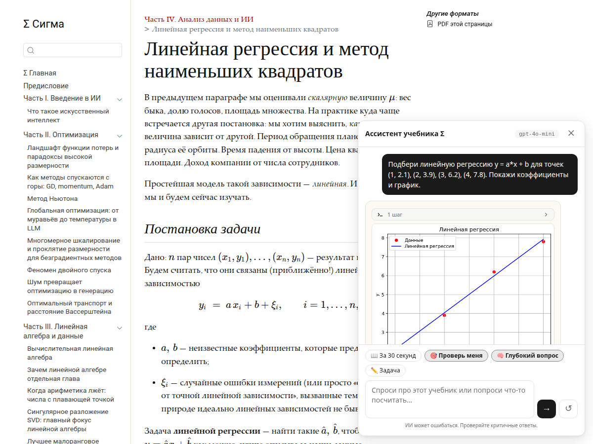

---

### ✅ `out_of_scope_recipe` — out_of_scope

**Q:** Дай мне рецепт борща.

**Tools called:** (none)
**Tools expected:** (none)
**Images:** 0 (expected: no)
**Elapsed:** 3.9s


<details><summary>Answer</summary>


```
Извини, но я не могу помочь с рецептом борща. Могу ответить на вопросы по информатике, оптимизации или другим темам из учебника. Если есть что-то конкретное, спрашивай!
```

</details>

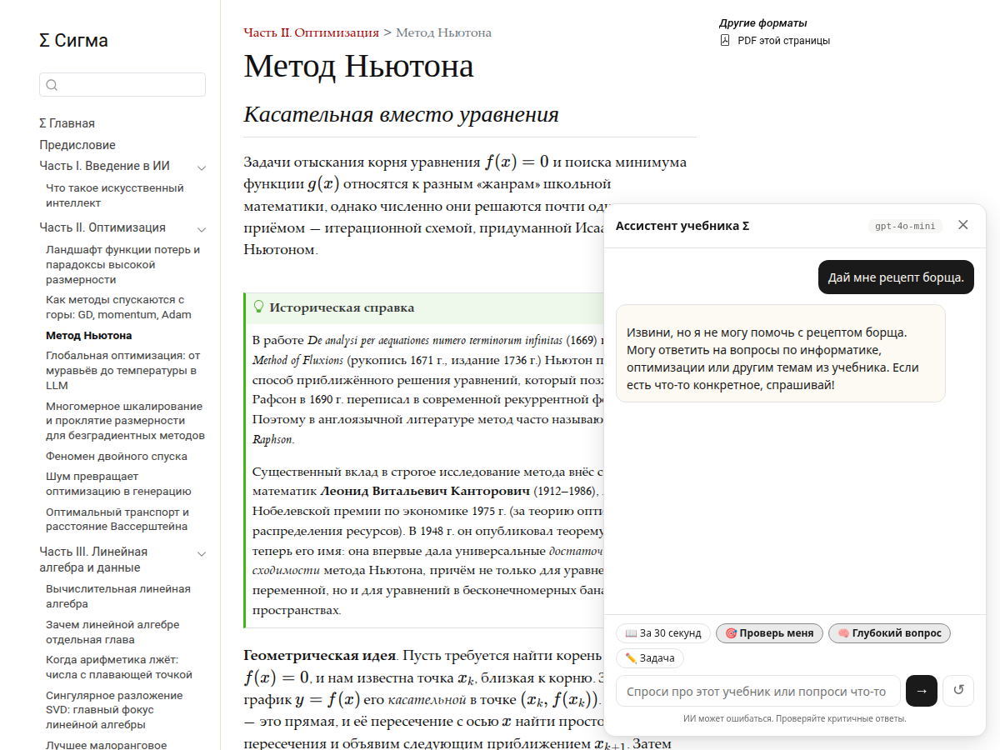

---

### ✅ `rsa_history` — rag_basic

**Q:** Кто придумал RSA и в каком году?

_Chapter:_ `ch04_3_kriptosistemy-rsa-i-diffi-hellma`

**Tools called:** search_textbook, read_chapter
**Tools expected:** search_textbook
**Images:** 0 (expected: no)
**Elapsed:** 7.8s


<details><summary>Answer</summary>


```
RSA была разработана в 1978 году тремя учеными из Массачусетского технологического института: Рональдом Райвестом, Ади Шамиром и Леонардом Адлеманом. Их фамилии и дали название системе — RSA.

Также стоит отметить, что аналогичная схема была независимо открыта в 1973 году британским математиком Клиффордом Коксом, но его работа была засекречена и рассекречена только в 1997 году.
```

</details>

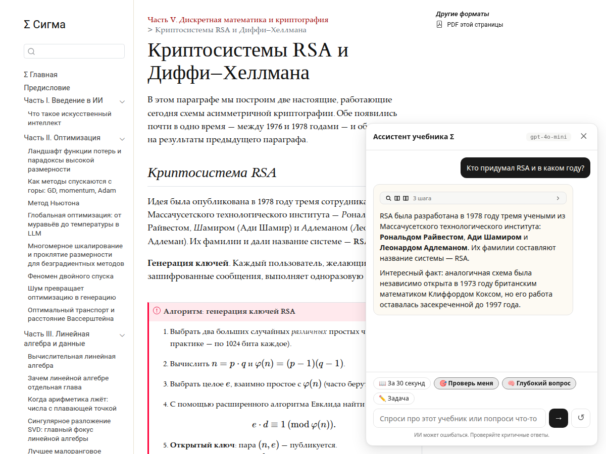

---

### ✅ `greeting_minimal` — out_of_scope

**Q:** Привет!

_Chapter:_ `ch02_newton`

**Tools called:** (none)
**Tools expected:** (none)
**Images:** 0 (expected: no)
**Elapsed:** 3.2s


<details><summary>Answer</summary>


```
Привет! Как я могу помочь с темой метода Ньютона? Если есть вопросы или нужна помощь с материалом, дай знать!
```

</details>

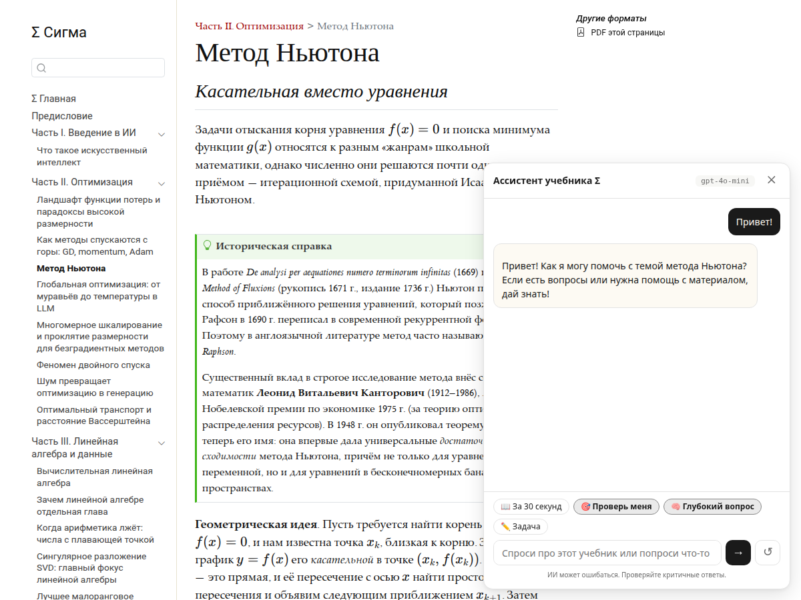

---

### ✅ `euclid_gcd_python` — compute_pure

**Q:** Посчитай НОД(48, 180) и НОД(1071, 462) через алгоритм Евклида в python.

_Chapter:_ `ch04_1_elementy-teorii-chisel`

**Tools called:** python, read_chapter
**Tools expected:** python
**Images:** 0 (expected: no)
**Elapsed:** 17.6s


<details><summary>Answer</summary>


```
Я посчитал НОД для заданных чисел:

НОД(48, 180) = 12
НОД(1071, 462) = 21

Эти результаты получены с помощью алгоритма Евклида. Если у тебя есть ещё вопросы по этой теме, не стесняйся спрашивать!
```

</details>

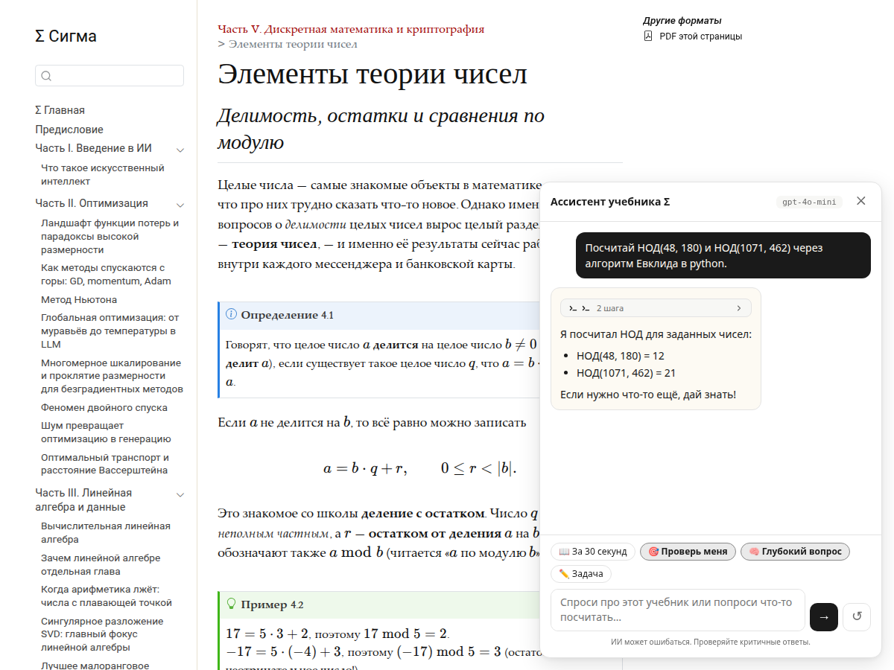

---

### ✅ `definition_superlinear` — definition

**Q:** Что значит сверхлинейная сходимость?

_Chapter:_ `ch02_newton`

**Tools called:** find_definition
**Tools expected:** find_definition
**Images:** 0 (expected: no)
**Elapsed:** 8.2s


<details><summary>Answer</summary>


```
Сверхлинейная сходимость — это тип сходимости последовательности, который описывается следующим условием:

k→∞
lim
	​

∣x
k
	​

−x
⋆
∣
∣x
k+1
	​

−x
⋆
∣
	​

=0.

Это значит, что разность между последовательными членами x
k+1
	​

 и предельным значением x
⋆
 уменьшается быстрее, чем разность x
k
	​

 и x
⋆
.

Если же сходимость происходит с более сильным условием:

∣x
k+1
	​

−x
⋆
∣≤M∣x
k
	​

−x
⋆
∣
2

для некоторой положительной константы M>0, то такая сходимость называется квадратичной.

Таким образом, сверхлинейная сходимость — это более слабая форма сходимости по сравнению с квадратичной.

Для подробностей можно посмотреть в главе Метод Ньютона.
```

</details>


---

### ✅ `theorem_clt` — structural

**Q:** Сформулируй центральную предельную теорему как в учебнике.

_Chapter:_ `ch03_1_prosteyshie-primery-zadach-anali`

**Tools called:** find_theorem
**Tools expected:** find_theorem
**Images:** 0 (expected: no)
**Elapsed:** 7.7s


<details><summary>Answer</summary>


```
Вот формулировка центральной предельной теоремы из учебника:

Теорема 3.3. Центральная предельная теорема (ЦПТ)
Пусть X
1
	​

,X
2
	​

,… — независимые одинаково распределённые случайные величины с математическим ожиданием μ и конечной дисперсией σ
2
>0, S
n
	​

=X
1
	​

+⋯+X
n
	​

. Тогда при n→∞

>

>Pr(
σ
n
	​

S
n
	​

−nμ
	​

≤x)⟶Φ(x)
=
def
2π
	​

1
	​

∫
−∞
x
	​

e
−t
2
/2
dt>
(функция стандартного нормального распределения).

Если нужно что-то ещё, дай знать!
```

</details>


---

### ❌ `plot_sincos_overlay` — compute_plot

**Q:** Построй графики sin(x) и cos(x) на интервале [-2π, 2π] на одном поле. Сделай легенду.

**Tools called:** python
**Tools expected:** python
**Images:** 1 (expected: yes)
**Elapsed:** 180.8s

_Missing substrings:_ ['sin', 'cos']

<details><summary>Answer</summary>


```

```

</details>

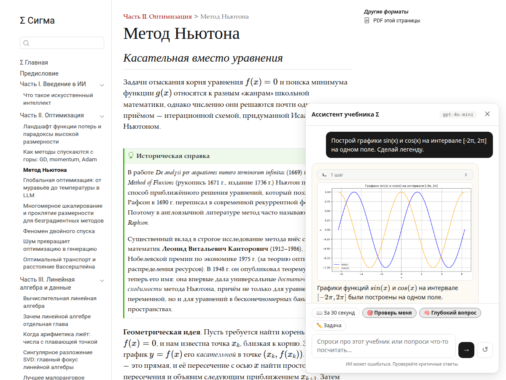

---

### ✅ `fragment_explanation` — rag_basic

**Q:** Если кто-то предлагает использовать обновление x_{k+1} = x_k - f(x_k)·f'(x_k) вместо классического Ньютона — что это за идея и она работает?

_Chapter:_ `ch02_newton`

**Tools called:** read_chapter, read_chapter
**Tools expected:** (none)
**Images:** 0 (expected: no)
**Elapsed:** 9.7s


<details><summary>Answer</summary>


```
В методе Ньютона для нахождения корней уравнения используется обновление по формуле:

x
k+1
	​

=x
k
	​

−
f
′
(x
k
	​

)
f(x
k
	​

)
	​

.

Если кто-то предлагает использовать обновление в виде:

x
k+1
	​

=x
k
	​

−f(x
k
	​

)⋅f
′
(x
k
	​

),

это может быть попыткой модификации метода, но такая формула не является стандартной и, скорее всего, не будет работать корректно.

Почему это не работает?

Стандартная формула: В классическом методе Ньютона мы делим на производную f
′
(x
k
	​

), чтобы получить корректное направление и шаг к корню. Это позволяет учитывать, насколько круто меняется функция в данной точке.
Неправильный шаг: В предложенной формуле шаг пропорционален произведению значения функции и её производной, что может привести к слишком большим или слишком маленьким шагам, не учитывающим поведение функции.
Сходимость: Метод Ньютона имеет квадратичную сходимость при условии, что начальное приближение достаточно близко к корню и функция удовлетворяет определённым условиям. Модифицированный шаг может нарушить эти условия, что приведёт к расходимости.

Таким образом, использование предложенной формулы не является корректным и не приведёт к желаемым результатам. Лучше придерживаться классической формулы метода Ньютона для достижения надёжных и быстрых результатов.
```

</details>


---

### ✅ `eigenvalues_numpy` — compute_pure

**Q:** Найди собственные значения матрицы [[2, 1], [1, 2]] через numpy.

_Chapter:_ `ch_linalg`

**Tools called:** python
**Tools expected:** python
**Images:** 0 (expected: no)
**Elapsed:** 13.0s


<details><summary>Answer</summary>


```
Собственные значения матрицы

$$ \begin{pmatrix} 2 & 1 \\ 1 & 2 \end{pmatrix} $$

равны 3 и 1.
```

</details>

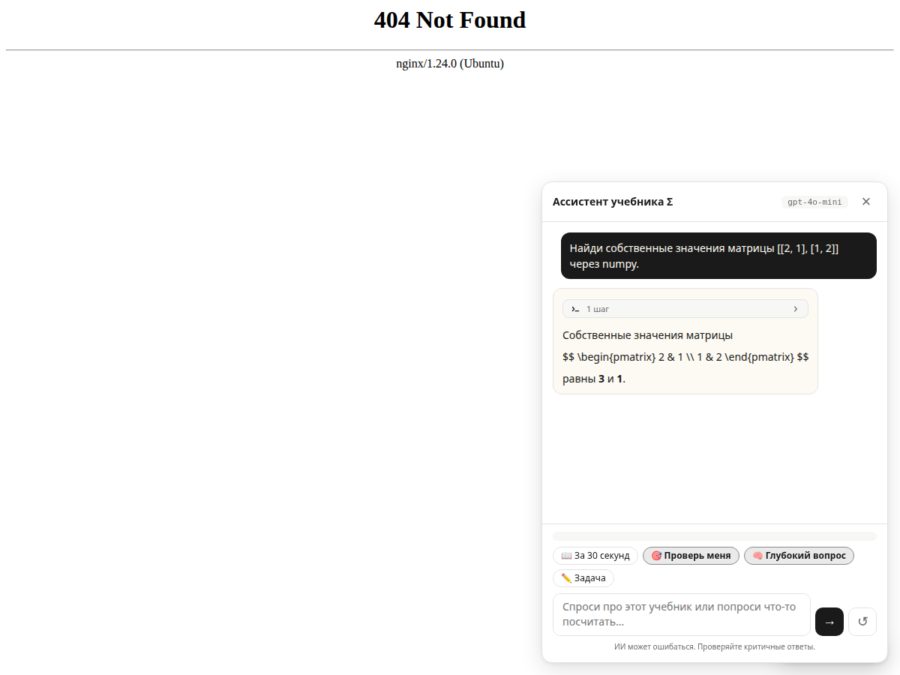

---

### ❌ `plot_loss_landscape` — compute_plot

**Q:** Построй контурный график функции потерь L(a, b) = sum((a*x_i + b - y_i)^2) для точек (1,2), (2,3), (3,5), (4,4) на сетке a in [-2, 4], b in [-3, 3].

_Chapter:_ `ch03_2_lineynaya-regressiya-i-metod-nai`

**Tools called:** python
**Tools expected:** python
**Images:** 1 (expected: yes)
**Elapsed:** 180.9s

_Missing substrings:_ ['минимум']

<details><summary>Answer</summary>


```

```

</details>

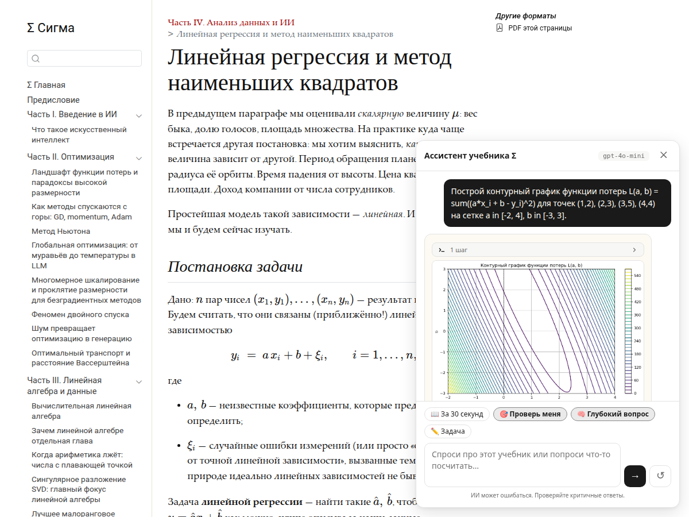

---

### ✅ `diffie_hellman_compute` — compute_pure

**Q:** Проведи протокол Диффи–Хеллмана: p=23, g=5. Алиса берёт a=6, Боб берёт b=15. Какой общий секрет?

_Chapter:_ `ch04_3_kriptosistemy-rsa-i-diffi-hellma`

**Tools called:** python
**Tools expected:** python
**Images:** 0 (expected: no)
**Elapsed:** 22.0s


<details><summary>Answer</summary>


```
В протоколе Диффи–Хеллмана с параметрами \( p = 23 \) и \( g = 5 \):

Алиса выбирает \( a = 6 \), её открытый ключ \( A \) равен 8.
Боб выбирает \( b = 15 \), его открытый ключ \( B \) равен 19.

Общий секрет, вычисленный как Алисе, так и Бобом, равен 2.

Результаты:

Открытый ключ Алисы \( A = 8 \)
Открытый ключ Боба \( B = 19 \)
Общий секрет \( = 2 \)
```

</details>

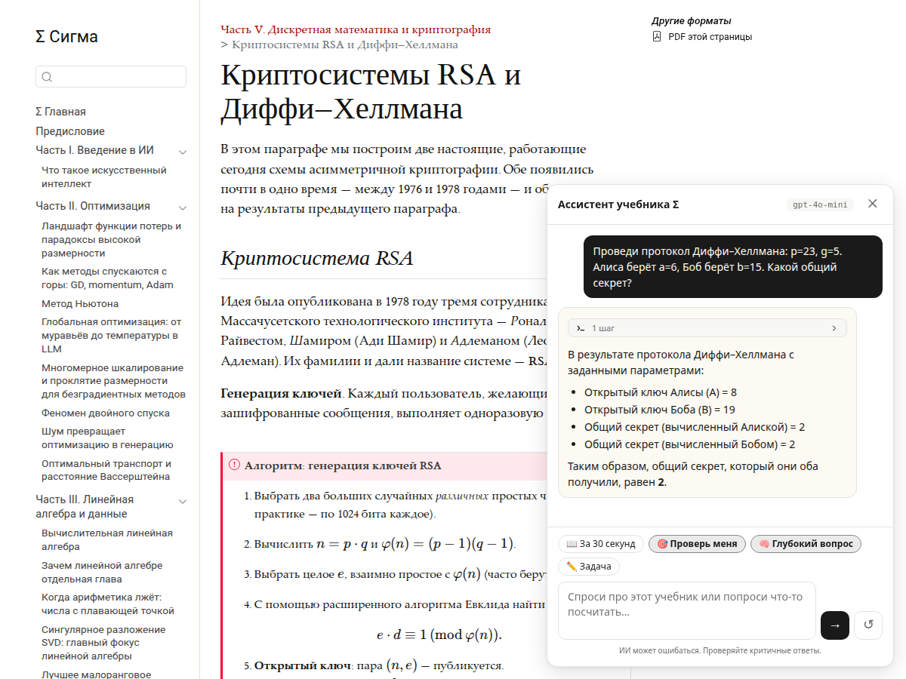

---

### ✅ `outline_chapter` — structural

**Q:** Перечисли основные разделы главы про Ньютона.

_Chapter:_ `ch02_newton`

**Tools called:** read_chapter
**Tools expected:** (none)
**Images:** 0 (expected: no)
**Elapsed:** 7.1s


<details><summary>Answer</summary>


```
В главе "Метод Ньютона" представлены следующие основные разделы:

Касательная вместо уравнения: Обсуждается метод нахождения корней уравнения f(x)=0 с использованием касательной.
Ньютон для оптимизации: Рассматривается применение метода Ньютона для нахождения минимума функции g(x).
Квадратный корень за пять шагов: Описывается, как вычислить квадратный корень с помощью метода Ньютона, включая формулу Герона.
Сходимость через сжимающее отображение: Анализируется сходимость метода Ньютона через концепцию сжимающего отображения.

Эти разделы охватывают как теоретические аспекты метода, так и его практическое применение.
```

</details>


---

### ✅ `math_latex_derivation` — rag_basic

**Q:** Выведи формулу метода Ньютона через касательную. Формулу запиши через LaTeX.

_Chapter:_ `ch02_newton`

**Tools called:** read_chapter, read_chapter
**Tools expected:** (none)
**Images:** 0 (expected: no)
**Elapsed:** 8.5s


<details><summary>Answer</summary>


```
Формула метода Ньютона через касательную выводится следующим образом. Уравнение касательной к графику функции y=f(x) в точке x
k
	​

 имеет вид:

y=f(x
k
	​

)+f
′
(x
k
	​

)(x−x
k
	​

).

Приравнивая y к нулю (то есть ищем пересечение с осью абсцисс), мы получаем:

0=f(x
k
	​

)+f
′
(x
k
	​

)(x−x
k
	​

).

Решая это уравнение относительно x, получаем:

x=x
k
	​

−
f
′
(x
k
	​

)
f(x
k
	​

)
	​

.

Таким образом, итерационная формула Ньютона записывается как:

x
k+1
	​

=x
k
	​

−
f
′
(x
k
	​

)
f(x
k
	​

)
	​

.
```

</details>

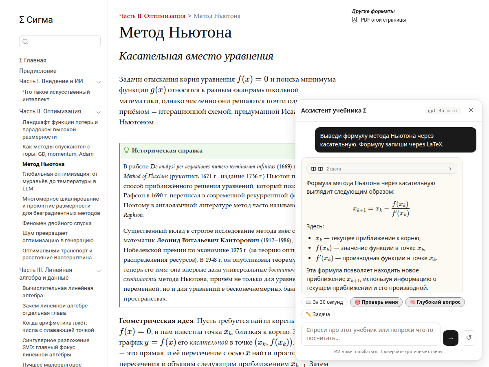

---

### ✅ `definition_perceptron` — definition

**Q:** Что такое полносвязная нейронная сеть?

_Chapter:_ `ch03_3_zadacha-klassifikacii-i-neyronny`

**Tools called:** find_definition
**Tools expected:** find_definition
**Images:** 0 (expected: no)
**Elapsed:** 9.8s


<details><summary>Answer</summary>


```
Полносвязная нейронная сеть (MLP) глубины L — это функция, заданная как композиция L слоёв. Формально, это можно записать так:

z
(ℓ)
z
(L)
	​

=W
(ℓ)
a
(ℓ−1)
+b
(ℓ)
,a
(ℓ)
=σ(z
(ℓ)
),ℓ=1,…,L−1,
=W
(L)
a
(L−1)
+b
(L)
,p(x)=softmax(z
(L)
).
	​


Здесь:

a
(0)
=x — входные данные.
W
(ℓ)
 — матрица весов ℓ-го слоя.
b
(ℓ)
 — вектор смещений (bias).
σ — функция активации, применяемая покомпонентно.
d
1
	​

,…,d
L−1
	​

 — ширины скрытых слоёв, а d
L
	​

 — число классов.

Функция softmax преобразует вектор произвольных вещественных чисел в распределение вероятностей:

softmax(z)
c
	​

=
∑
c
′
	​

e
z
c
′
	​

e
z
c
	​

	​

.

Все матрицы W
(ℓ)
 и векторы b
(ℓ)
 называются обучаемыми параметрами модели.
```

</details>

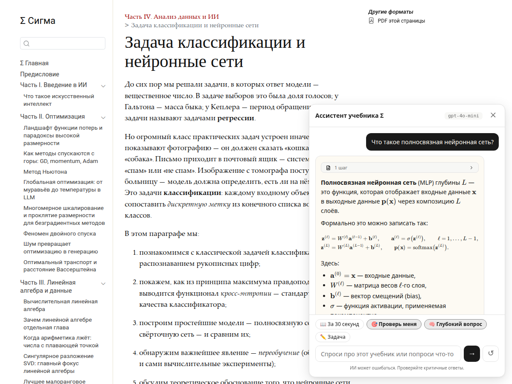

---

### ✅ `refuse_unknown_year` — out_of_scope

**Q:** В каком году Гаусс изобрёл метод сопряжённых градиентов?

_Chapter:_ `ch02_newton`

**Tools called:** search_textbook, search_textbook, search_textbook, read_chapter, read_chapter
**Tools expected:** (none)
**Images:** 0 (expected: no)
**Elapsed:** 10.6s


<details><summary>Answer</summary>


```
В учебнике я не нашёл информации о том, в каком году Гаусс изобрёл метод сопряжённых градиентов.

Однако, вне учебника известно, что метод сопряжённых градиентов был предложен в 1952 году, но его развитие связано с работами многих учёных, включая Гаусса. Если тебе нужна более подробная информация о методе или его применении, дай знать!
```

</details>

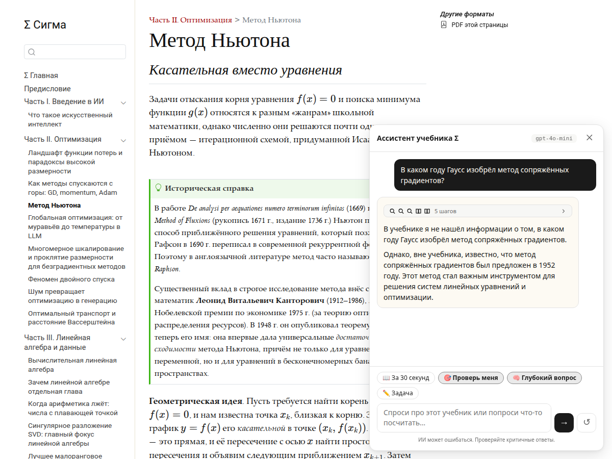

---
