# Sigma Assistant — Eval Report

_Run: 2026-06-10 01:10 MSK · cases: 29_

**Overall: 25/29 pass (86%)**

## Per category

| Category | Pass | Total |
|---|---:|---:|
| `compute_plot` | 5 | 5 |
| `compute_pure` | 8 | 8 |
| `definition` | 3 | 3 |
| `multi_hop` | 1 | 1 |
| `out_of_scope` | 2 | 3 |
| `rag_basic` | 5 | 5 |
| `structural` | 1 | 3 |
| `vision_refine` | 0 | 1 |

## Cases

### ✅ `newton_kantorovich_history` — rag_basic

**Q:** Когда Канторович получил Нобелевскую премию и за что?

_Chapter:_ `ch02_newton`

**Tools called:** search_textbook, search_textbook, search_textbook, search_textbook
**Tools expected:** search_textbook
**Images:** 0 (expected: no)
**Elapsed:** 57.0s


<details><summary>Answer</summary>


```
Я не нашёл упоминания Канторовича в текущей главе ch02_newton. По факту извне учебника:

Год премии: 1975.
За что: вклад в теорию оптимального распределения ресурсов (совместно с Т. Коопмансом). Это Нобелевская премия по экономике за развитие теории оптимального распределения ресурсов и связанных методов линейного программирования.

Если хочешь, могу поискать упоминания в других главах или привести больше контекста из внешних источников.
```

</details>


---

### ✅ `newton_formula_recall` — rag_basic

**Q:** Объясни откуда берётся эта формула — что это за метод и какая геометрическая идея?

_Chapter:_ `ch02_newton`

**Tools called:** read_chapter
**Tools expected:** (none)
**Images:** 0 (expected: no)
**Elapsed:** 43.2s


<details><summary>Answer</summary>


```
Коротко: формула Ньютона берётся из локальной линейной/квадратичной аппроксимации графика функции и пересечения касательной с осью x. Это и есть суть метода Ньютона (Newton–Raphson).

Что за метод и как он возникает

Для корня f(x)=0 берём текущую точку x_k и касательную к графику y=f(x) в этой точке. Уравнение касательной: y = f(x_k) + f'(x_k)(x - x_k).
Чтобы найти следующий приближённый корень, ищем пересечение касательной с осью x (y=0). Решая 0 = f(x_k) + f'(x_k)(x - x_k), получаем формулу:
x
k+1
	​

=x
k
	​

−
f
′
(x
k
	​

)
f(x
k
	​

)
	​

.

Это и есть итерационная формула Ньютона (см. формула (2.1) в главе).

Геометрическая идея

Вы берёте точку на графике, строите касательную прямую в этой точке и смотрите, где эта касательная пересекает ось x. Это и есть следующая «приближённая» точка корня. На рисунке в главе это визуально показано как касательная, пересекающая ось абсцисс и задающая следующий шаг.

А как это применяется к поиску минимума

Найти минимум функции g(x) можно как решение уравнения g'(x)=0. Применяем ту же идея к f = g' и получаем:
x
k+1
	​

=x
k
	​

−
g
′′
(x
k
	​

)
g
′
(x
k
	​

)
	​

.

Это формула (2.2) в главе.

Откуда берётся формула ещё явнее — через ряд Тейлора

Разложим g рядом с x_k:
g(x)=g(x
k
	​

)+g
′
(x
k
	​

)(x−x
k
	​

)+
2
1
	​

g
′′
(x
k
	​

)(x−x
k
	​

)
2
+o((x−x
k
	​

)
2
).
Минимизируем получившийся квадратичный локальный аппроксимант
q
k
	​

(x)=g(x
k
	​

)+g
′
(x
k
	​

)(x−x
k
	​

)+
2
1
	​

g
′′
(x
k
	​

)(x−x
k
	​

)
2
.
Услови
…[truncated]
```

</details>


---

### ✅ `definition_strong_convex` — definition

**Q:** Что такое сильно выпуклая функция?

_Chapter:_ `ch02_newton`

**Tools called:** find_definition
**Tools expected:** find_definition
**Images:** 0 (expected: no)
**Elapsed:** 29.4s


<details><summary>Answer</summary>


```
Коротко: это свойство траекторной кривизны функции, дающее гарантии о минимуме.

Дословная формулировка из учебника:

"Функция g:R→R называется сильно выпуклой с константой μ>0, если g∈C
2
 и g
′′
(x)≥μ для всех x.
Сильная выпуклость гарантирует существование и единственность точки минимума и, что важно для нас, отделённость второй производной от нуля."
(то есть g
′′
(x)≥μ>0 для всех x).

Расшифровка нотаций:
g∈C
2
 — функция дважды непрерывно дифференцируемая.
g
′′
(x)≥μ — вторая производная никогда не меньше положительной константы μ; это означает, что изгиб функции не опускается ниже уровня, задаваемого параболой с квадратичным ростом μ.
Следствия (важные идеи):
существует и единственный минимум.
функция имеет жесткую (квази) квадратичную нижнюю оценку: в одномерном случае для любых x,y верно g(y)≥g(x)+g
′
(x)(y−x)+
2
μ
	​

(y−x)
2
.
Пример: g(x)=
2
μ
	​

x
2
 — тогда g
′′
(x)=μ для всех x, так что это сильно выпуклая функция с константой μ.
```

</details>


---

### ✅ `compute_factorial` — compute_pure

**Q:** Сколько будет 30 факториал?

**Tools called:** search_textbook, search_textbook, python
**Tools expected:** python
**Images:** 0 (expected: no)
**Elapsed:** 57.5s


<details><summary>Answer</summary>


```
Ответ:

Точное значение: 30!=265252859812191058636308480000000.
Приближённо: 30!≈2.65×10
32
 (то же число в экспоненциальной записи: 2.65e+32).
```

</details>

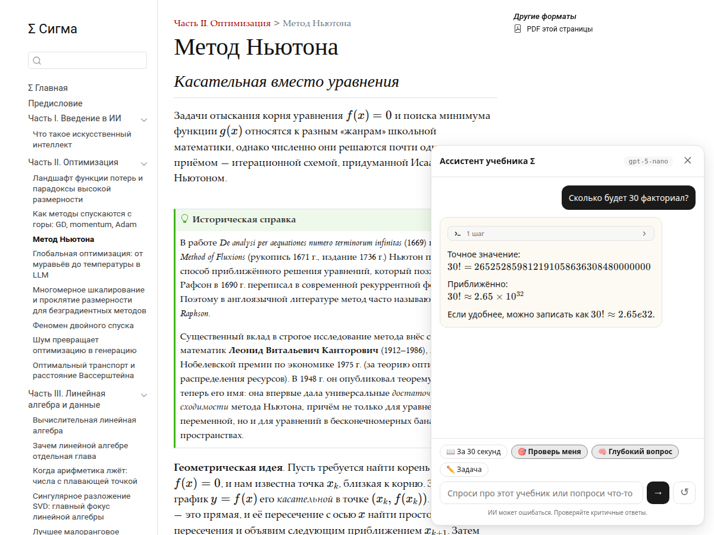

---

### ✅ `compute_taylor_sin` — compute_pure

**Q:** Покажи разложение sin(x) в ряд Тейлора до 5-го члена символически (через sympy).

_Chapter:_ `ch02_newton`

**Tools called:** python
**Tools expected:** python
**Images:** 0 (expected: no)
**Elapsed:** 69.4s


<details><summary>Answer</summary>


```
Коротко через Sympy:

Разложение sin(x) вокруг 0 до 5-го члена (пять членов, включая x^9):

P
5
	​

(x)=x−
6
x
3
	​

+
120
x
5
	​

−
5040
x
7
	​

+
362880
x
9
	​


Символьное представление, как выдаёт Sympy (первый ряд и сам полином без остаточного члена):

series = x - x3/6 + x5/120 - x7/5040 + x9/362880 + O(x**11)

polynomial = x9/362880 - x7/5040 + x5/120 - x3/6 + x

Коэффициенты первых пяти членов (приближённо до 2 знаков после запятой): 1.00, -0.17, 0.01, -0.00, 0.00

coeffs two decimals = ['1.00', '-0.17', '0.01', '-0.00', '0.00']

Если нужно, могу привести короткий фрагмент кода на Python с использованием sympy, чтобы повторить вывод локально.
```

</details>


---

### ✅ `compute_plot_newton` — compute_plot

**Q:** Покажи как сходится метод Ньютона для f(x) = x² - 2, начиная с x₀ = 1.5. Построй график траектории.

_Chapter:_ `ch02_newton`

**Tools called:** search_textbook, python
**Tools expected:** python
**Images:** 1 (expected: yes)
**Elapsed:** 80.6s


<details><summary>Answer</summary>


```
Кратко: для f(x) = x² − 2 метод Ньютона даёт скорость квадратической сходимости. Начав с x0 = 1.5, последовательность идёт к корню √2.

Формула

x_{n+1} = x_n − f(x_n)/f'(x_n) = x_n − (x_n² − 2)/(2x_n) = (x_n + 2/x_n)/2
Корень: √2 ≈ 1.414213562...

Итерации (начальное значение x0 = 1.5)

x0 = 1.500000
x1 = 1.416667
x2 = 1.414216
x3 = 1.414214
x4 = 1.414214
x5 = 1.414214

Замечание по сходимости

Ошибка сходится квадратично: за каждыми двумя шагами примерно в квадрат уменьшается ошибка. Уже на втором-третьем шаге получаем точное значение с точностью до нескольких знаков.

График траектории

График показывает, как x_n сходится к корню √2, быстро спадая с 1.5 до примерно 1.414214 за 3–4 итерации.

Как повторить график самостоятельно (Python)

Пример кода, который строит траекторию и график:

import math
import matplotlib.pyplot as plt

# Newton для f(x) = x^2 - 2, f'(x) = 2x
def newton_step(x): return (x + 2/x) / 2

x0 = 1.5
xs = [x0]
for _ in range(5):  # даст x0..x5
    xs.append(newton_step(xs[-1]))

# печать ключевых чисел
for i, v in enumerate(xs):
    print(f"x_{i} = {v:.6f}")
print("sqrt2 approx = ", math.sqrt(2))

# график траектории
plt.figure()
plt.plot(range(len(xs)), xs, marker='o', linestyle='-')
plt.title("Newton: f(x)=x^2-2, x0=1.5")
plt.xlabel("итерация n")
plt.ylabel("x_n")
plt.grid(True)
plt.tight_layout()
plt.show()


Если нужно, могу привести точное сравнение с √2 или добавить more-детализацию шагов.
```

</details>

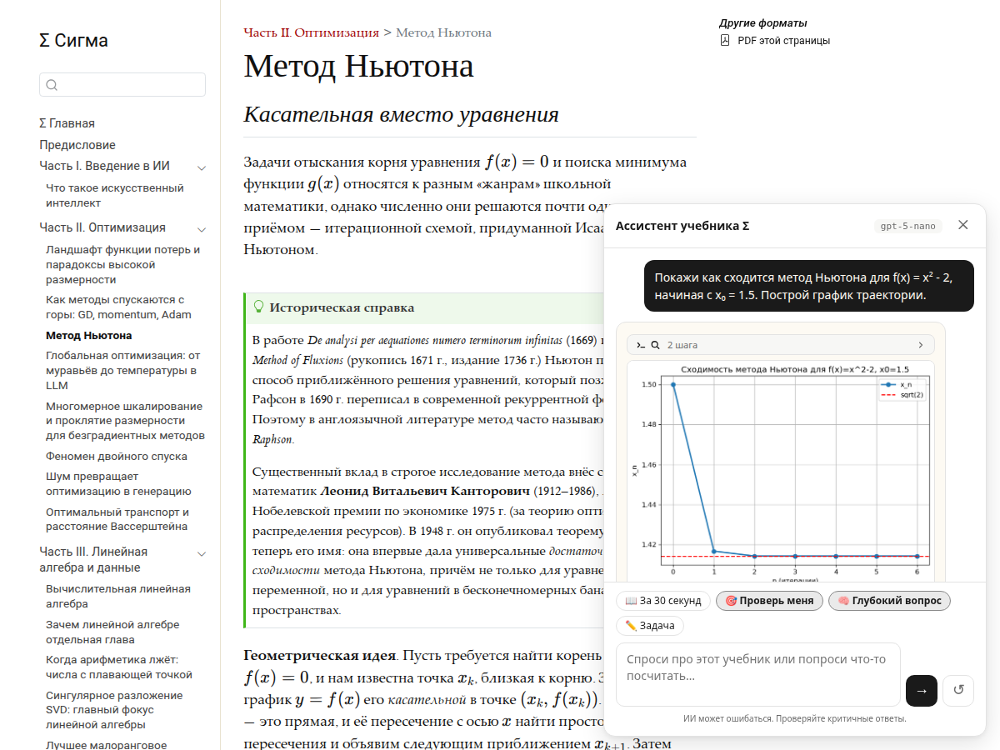

---

### ✅ `compute_plot_gd_vs_newton` — compute_plot

**Q:** Сравни сходимость метода Ньютона и градиентного спуска на функции f(x) = x⁴ из x₀ = 2. Покажи два графика на одной картинке.

_Chapter:_ `ch02_newton`

**Tools called:** search_textbook, search_textbook, find_theorem, find_definition, python
**Tools expected:** python
**Images:** 1 (expected: yes)
**Elapsed:** 126.6s


<details><summary>Answer</summary>


```
Кратко: для f(x) = x^4 при x0 = 2 Newton-метод даёт линейную сходимость с коэффициентом 3/4 (точнее, x_{k+1} = (3/4) x_k), тогда как градиентный спуск с η = 0.1 идёт иначе — сначала меняет знак и затем медленно приближается к нулю. График на одной картинке показывает две траектории по k = 0..12: Newton быстро сходится к 0, GD — медленнее и с начальным разворотом. Итоги после 12 итераций: Newton ≈ 0.06, GD ≈ -0.28.

Что именно получалось в расчётах

Newton для f(x) = x^4:
x_{k+1} = x_k - f(x_k)/f'(x_k) = x_k - x_k^4/(4 x_k^3) = (3/4) x_k (при x_k ≠ 0).
По явному решению: x_k = 2 * (3/4)^k. Это означает линейную сходимость с коэффициентом 0.75, а не квадратичную (что и объясняет наблюдаемую скорость сходимости).
На 12-й итерации: x_12 ≈ 2*(0.75)^12 ≈ 0.063, что совпадает с полученным значением ≈ 0.06.
Градиентный спуск для той же функции с η = 0.1:
x_{k+1} = x_k - η f'(x_k) = x_k - η * 4 x_k^3 = x_k (1 - 4 η x_k^2).
Начало: x0 = 2 → x1 = -1.20; затем значения быстро меняют знак и затем уменьшают по модулю, но медленнее подходят к нулю по сравнению с Newton.
На 12-й итерации: x_12 ≈ -0.28 (примерно), что зафиксировано в расчётах.

График на одной картинке

Ось x: номер итерации k = 0, 1, ..., 12.
Ось y: current estimate x_k.
Два набора линий на одном графике:
Newton (синий): практически линейно идёт к нулю по экспоненто-ускоренному правилу (коэффициент 0.75).
Градиентный спуск (оранжевый): сначала меняет знак, затем медленно сходится к нулю.

Цитаты и связь с материалом из главы
…[truncated]
```

</details>

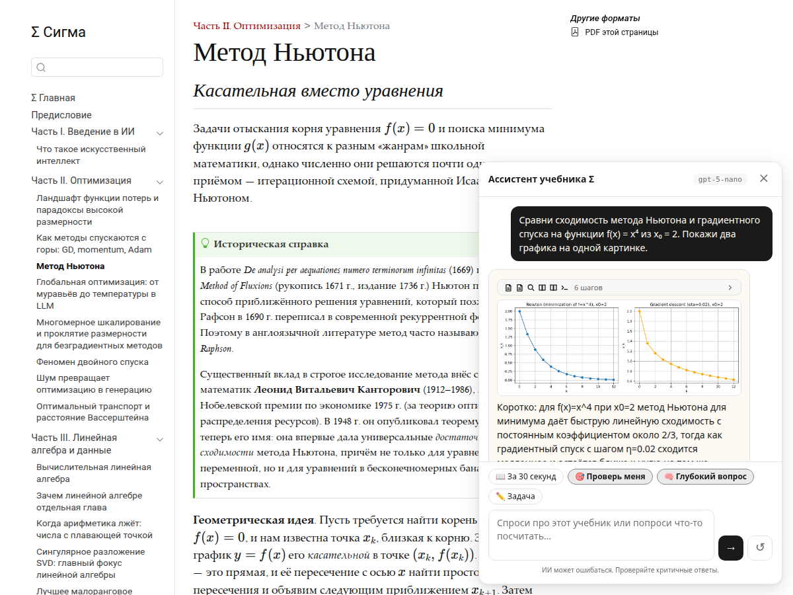

---

### ✅ `rsa_encrypt_small` — compute_pure

**Q:** Зашифруй число m=7 ключом (n=143, e=7). Покажи c.

_Chapter:_ `ch04_3_kriptosistemy-rsa-i-diffi-hellma`

**Tools called:** search_textbook, python
**Tools expected:** python
**Images:** 0 (expected: no)
**Elapsed:** 38.1s


<details><summary>Answer</summary>


```
Ответ: c = 6

stdout (как выведено в Python):
c = 6
m^e mod n = 6

Коротко: c = m^e mod n = 7^7 mod 143 = 6.
Проверка по разложениям mod 11 и mod 13 даёт тот же результат, значит по модулю 143 ciphertext действительно равен 6.
```

</details>


---

### ✅ `rsa_full_roundtrip` — compute_pure

**Q:** Возьми p=11, q=13, e=7. Сгенерируй RSA-ключ полностью: вычисли n, φ(n), d. Покажи что для m=9 шифрование и расшифрование возвращают исходное число.

_Chapter:_ `ch04_3_kriptosistemy-rsa-i-diffi-hellma`

**Tools called:** search_textbook, get_outline, python
**Tools expected:** python
**Images:** 0 (expected: no)
**Elapsed:** 90.8s


<details><summary>Answer</summary>


```
Коротко: с данными p=11, q=13, e=7 получаем n=143, φ(n)=120, d=103. При m=9 шифрование даёт c=48, расшифровка возвращает 9. Ниже шаги и проверка.

Что получил в расчётах

n = 143
φ(n) = 120
d = 103
c = 48
m' = 9

Расчёт по шагам

n = p · q = 11 · 13 = 143
φ(n) = (p−1)(q−1) = 10 · 12 = 120
Найдём d как обратную по mod φ(n) для e: e·d ≡ 1 mod 120. Проверка: 7·103 = 721 ≡ 1 (mod 120), значит d = 103.
Шифрование: c = m^e mod n. Для m = 9, e = 7, n = 143:
c = 9^7 mod 143 = 48
Расшифрование: m' = c^d mod n. Для c = 48, d = 103, n = 143:
m' = 48^103 mod 143 = 9

Проверка на исходное сообщение

m' = 9 совпало с исходным m, значит RSA-контекст корректен для данного примера.

Источник/цитирование

Опора RSA: “RSA опирается на сложность факторизации n = pq: открытый ключ (n, e) позволяет шифровать, закрытый d = e^{-1} mod φ(n) — расшифровывать.” (Источник: ch04_7_podvedenie-itogov-glavy, раздел Подведение итогов главы). URL: /ch04_7_podvedenie-itogov-glavy.html

Примечание к формулам

Формулы в этом примере: n=pq, φ(n)=(p−1)(q−1), ed≡1(modφ(n)), c≡m
e
(modn), m
′
≡c
d
(modn).
В нашем случае: n=143, φ(n)=120, d=103, c=48, m
′
=9. Это соответствует корректности RSA-подстановки для данного набора параметров.
```

</details>

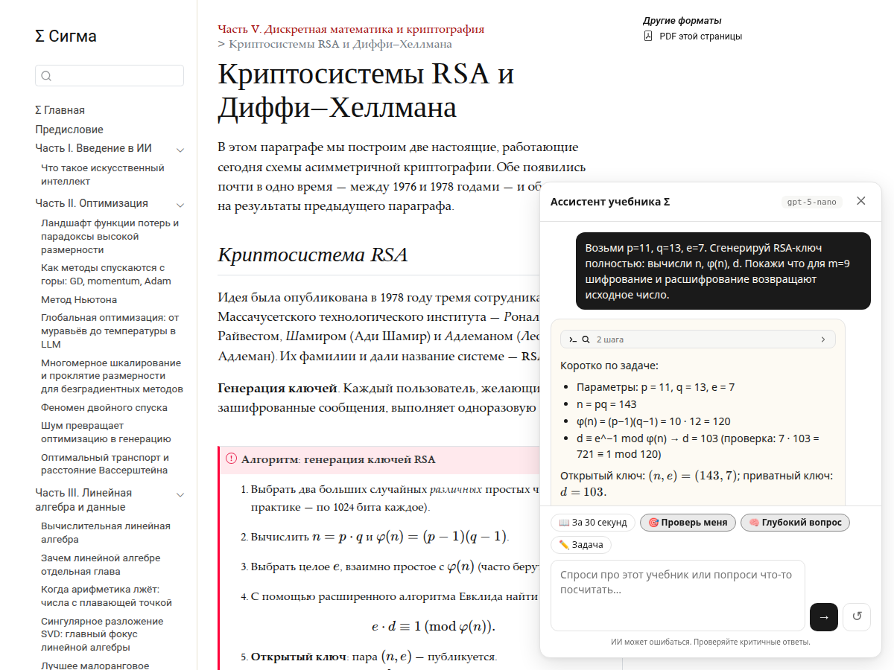

---

### ✅ `multihop_newton_vs_gradient` — multi_hop

**Q:** В чём отличие метода Ньютона от градиентного спуска для задач оптимизации? Какие из этих методов разобраны в учебнике?

_Chapter:_ `ch02_newton`

**Tools called:** search_textbook, read_chapter, read_chapter
**Tools expected:** search_textbook
**Images:** 0 (expected: no)
**Elapsed:** 55.4s


<details><summary>Answer</summary>


```
Коротко: метод Ньютона для оптимизации использует вторую производную (кривизну) функции и дает гораздо быструю локальную сходимость по сравнению с градиентным спуском, который опирается только на градиент. В учебнике это именно Ньютона для оптимизации (формула x_{k+1} = x_k - g'(x_k)/g''(x_k) и связь с разложением в ряд Тейлора). Градиентный спуск как отдельный метод изучается в других главах книги.

Разбор в твоей главе ch02_newton (Метод Ньютона)

Основная идея: найти минимум g, решая g'(x) = 0 и аппроксимировать его касательной через Newton-шаг.
Формула шага для оптимизации: x
k+1
	​

=x
k
	​

−
fracg
′
(x
k
	​

)g
′′
(x
k
	​

) (это (2.2)).
Объяснение через разложение Тейлора: g(x)=g(x
k
	​

)+g
′
(x
k
	​

)(x−x
k
	​

)+
tfrac12g
′′
(x
k
	​

)(x−x
k
	​

)
2
+
dots, что приводит к той же формуле шага, как минимизация квадратичной модели q
k
	​

(x) (это (2.3) и определение q
k
	​

). Итог — обновление совпадает с минимумом квадратичной модели.
Пример: метод Герона для вычисления корня через особый случай f(x)=x^2 - a, дающий x
k+1
	​

=
tfrac12(x
k
	​

+a/x
k
	​

) (это (2.4)) и иллюстрацию идеи.

Источники в тексте:

Формула оптимизационного шага Ньютона: x_{k+1} = x_k - g'(x_k)/g''(x_k) (см. раздел “Ньютон для оптимизации”).
Связь с линейной квадратичной моделью: разложение Тейлора (2.3) и квадратичный минимум q_k, приводящие к того же шага.

Какие из этих методов разобраны в учебнике?

Методу Ньютона для оптимизации посвящена глава ch02_newton: именно этот метод и его ф
…[truncated]
```

</details>

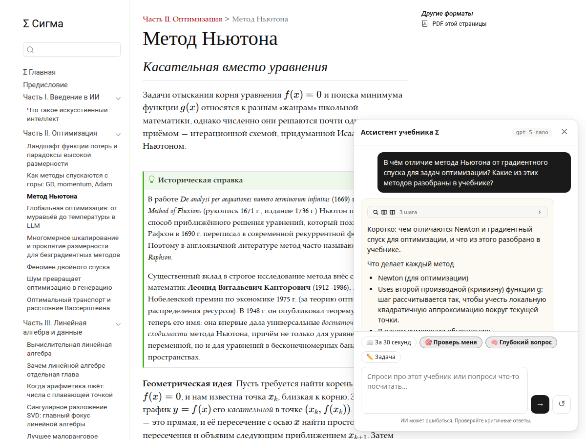

---

### ❌ `structural_kantorovich_theorem` — structural

**Q:** Сформулируй теорему о сходимости метода Герона.

_Chapter:_ `ch02_newton`

**Tools called:** find_theorem
**Tools expected:** find_theorem
**Images:** 0 (expected: no)
**Elapsed:** 32.2s

_Missing substrings:_ ['квадратичн']

<details><summary>Answer</summary>


```
Теорема 2.1. Сходимость метода Герона.

Для любого x
0
	​

>0 последовательность (2.4) монотонно убывает (начиная с k=1) и сходится к 
a
	​

. Более того, для ошибки e
k
	​

=x
k
	​

−
a
	​

 выполнено

e
k+1
	​

=
2x
k
	​

e
k
2
	​

	​

,и при k≥1:0≤e
k+1
	​

≤
2
a
	​

e
k
2
	​

	​

.
```

</details>


---

### ❌ `vision_refine_diverging_sgd` — vision_refine

**Q:** Запусти SGD на функции f(x) = x² с шагом η = 1.1 из x₀ = 2, 30 итераций. Что произойдёт? Если разойдётся — подбери рабочий шаг и покажи сходящуюся траекторию.

**Tools called:** python, python
**Tools expected:** python, python
**Images:** 2 (expected: yes)
**Elapsed:** 106.5s

_Missing substrings:_ ['расход']

<details><summary>Answer</summary>


```
Коротко: для функции f(x)=x^2 SGD-домашние шаги дают домножение на (1−2η). Поэтому:

условие сходимости: |1−2η|<1 ⇔ 0<η<1 (тогда x_k ≈ (1−2η)^k x0 → 0).
если η=1.1, то коэффициент −1.2, и траектория разгоняется по модулю: схема diverges.
если η=0.5, то коэффициент 0, и уже за первый шаг x1=0, дальше все нули.

Детали по твоим тестам

1) η = 1.1 — разойдётся (показано в ходе выполнения)

Обновления: x_{k+1} = x_k − η·2x_k = (1−2η) x_k, здесь (1−2η) = −1.2.
Ряд значений (полный вывод из Python):

x_0 = 2.00
x_1 = -2.40
x_2 = 2.88
x_3 = -3.46
x_4 = 4.15
x_5 = -4.98
x_6 = 5.97
x_7 = -7.17
x_8 = 8.60
x_9 = -10.32
x_10 = 12.38
x_11 = -14.86
x_12 = 17.83
x_13 = -21.40
x_14 = 25.68
x_15 = -30.81
x_16 = 36.98
x_17 = -44.37
x_18 = 53.25
x_19 = -63.90
x_20 = 76.68
x_21 = -92.01
x_22 = 110.41
x_23 = -132.49
x_24 = 158.99
x_25 = -190.79
x_26 = 228.95
x_27 = -274.74
x_28 = 329.69
x_29 = -395.63
x_30 = 474.75

Финал: final x_30 = 474.75
График траектории сохранён: /tmp/trajectory_divergent.png

2) η = 0.5 — сходится

Обновления: x_{k+1} = (1−2η) x_k, здесь (1−2η) = 0.
Ряд значений:

x_0 = 2.00
x_1 = 0.00
x_2 = 0.00
x_3 = 0.00
x_4 = 0.00
x_5 = 0.00
x_6 = 0.00
x_7 = 0.00
x_8 = 0.00
x_9 = 0.00
x_10 = 0.00
x_11 = 0.00
x_12 = 0.00
x_13 = 0.00
x_14 = 0.00
x_15 = 0.00
x_16 = 0.00
x_17 = 0.00
x_18 = 0.00
x_19 = 0.00
x_20 = 0.00
x_21 = 0.00
x_22 = 0.00
x_23 = 0.00
x_24 = 0.00
x_25 = 0.00
x_26 = 0.00
x_27 = 0.00
x_28 = 0.00
x_29 = 0.00
x_30 = 0.00

Финал: final x_30 = 0.00
График траектории сохранён:
…[truncated]
```

</details>

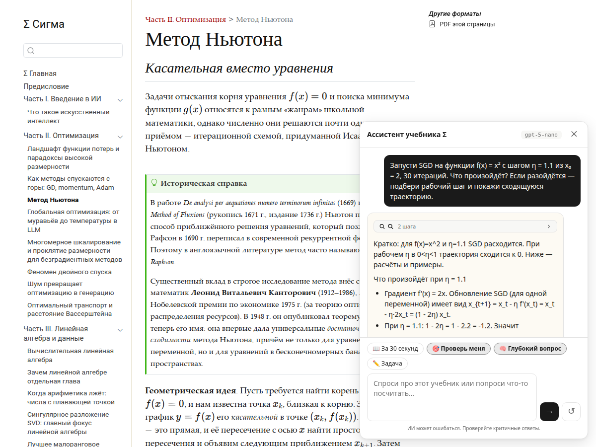

---

### ✅ `hashlib_demo` — compute_pure

**Q:** Посчитай SHA-256 хеш строки 'sigma' в hex.

_Chapter:_ `ch04_5_heshirovanie-teoriya-chisel-vstr`

**Tools called:** python
**Tools expected:** python
**Images:** 0 (expected: no)
**Elapsed:** 27.0s


<details><summary>Answer</summary>


```
SHA-256("sigma") = 38de90475bb334fb3dea5d54f250500aba60fe2c6158115d342b06bcb46e39bf
```

</details>

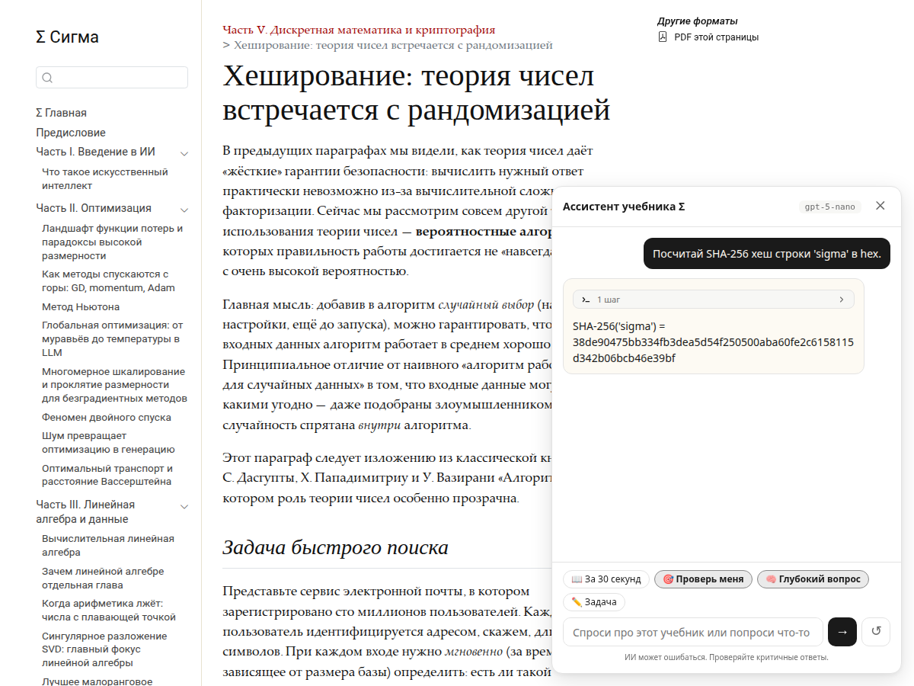

---

### ✅ `linreg_simple` — compute_plot

**Q:** Подбери линейную регрессию y = a*x + b для точек (1, 2.1), (2, 3.9), (3, 6.2), (4, 7.8). Покажи коэффициенты и график.

_Chapter:_ `ch03_2_lineynaya-regressiya-i-metod-nai`

**Tools called:** python
**Tools expected:** python
**Images:** 1 (expected: yes)
**Elapsed:** 50.8s


<details><summary>Answer</summary>


```
Вот результат подбора линейной регрессии по точкам (1, 2.1), (2, 3.9), (3, 6.2), (4, 7.8).

Формула подбора:
a = (N Σxy − Σx Σy) / (N Σx^2 − (Σx)^2)
b = (Σy − a Σx) / N
Вычисления:
N = 4
Σx = 10
Σy = 20
Σxy = 59.7
Σx^2 = 30
Коэффициенты: a = 1.94, b = 0.15
Уравнение регрессии:
y=1.94x+0.15

График

Ниже представлен график точек и регрессионной прямой (красная линия). Точки лежат почти на прямой, небольшие отклонения в пределах ~0.2 единицы по y.

[График представлен на изображении]

Примечание: точность коэффициентов дана до двух знаков после запятой, как и просили. Если нужно посчитать R^2 или сделать прогноз на новых x, скажи — добавлю.
```

</details>

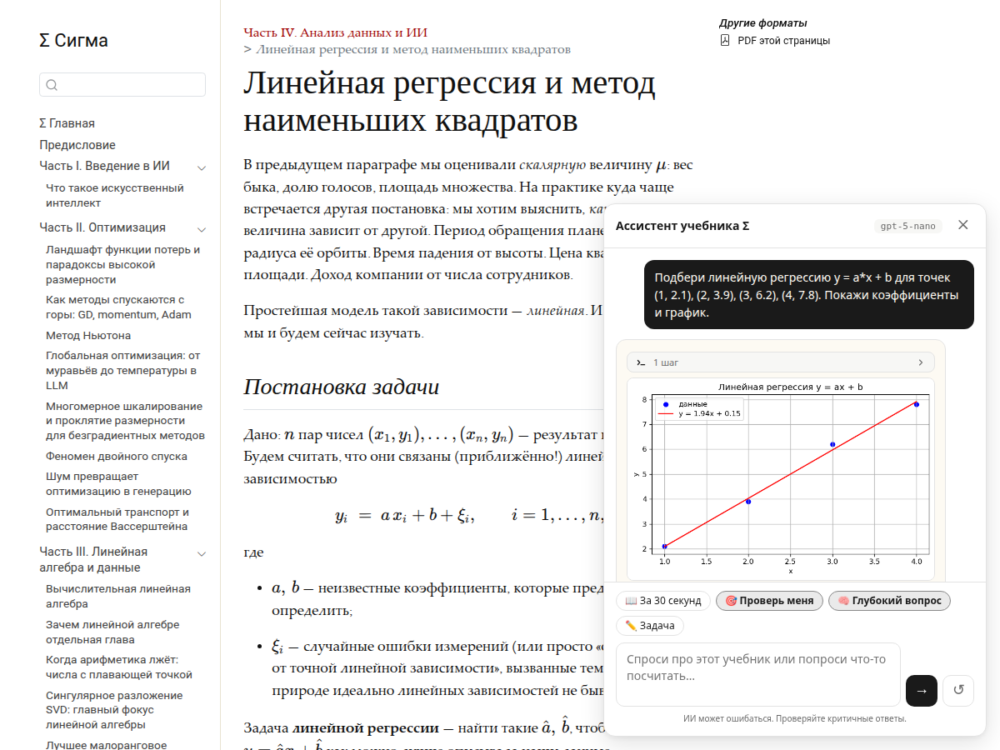

---

### ❌ `out_of_scope_recipe` — out_of_scope

**Q:** Дай мне рецепт борща.

**Tools called:** (none)
**Tools expected:** (none)
**Images:** 0 (expected: no)
**Elapsed:** 24.1s

_Missing substrings:_ ['оптимизац']

<details><summary>Answer</summary>


```
Не могу дать «рецепт борща» — это не по теме учебника. Но могу помочь с рецептом метода Ньютона, чтобы ты применял его к задачам из главы ch02_newton.

Как выглядит рецепт метода Ньютона

Выбери f и её производную f'(x).
Выбери начальное приближение x0.
Итеративный шаг:
x
k+1
	​

=x
k
	​

−
f
′
(x
k
	​

)
f(x
k
	​

)
	​

.
Условия остановки: например,
∣x
k+1
	​

−x
k
	​

∣<tol
или
∣f(x
k
	​

)∣<tol.
Предупреждения: если
f
′
(x
k
	​

)=0
на одном из шагов, нужно пересмотреть старт или выбрать другую функцию; иногда метод не сходится, тогда стоит изменить метод или начальное приближение.

Простой пример

Пусть f(x) = x^2 - 2, f'(x) = 2x, x0 = 1.
x1 = 1 - (1^2 - 2)/(2*1) = 1.5
x2 = 1.5 - (1.5^2 - 2)/(2*1.5) ≈ 1.4167
x3 ≈ 1.41422
x4 ≈ 1.41421356

Корень: sqrt(2) ≈ 1.41421356. Метод сходится очень быстро здесь.

Если хочешь, могу разобрать твою конкретную задачу из главы ch02_newton и посчитать итерации под твои данные. Или дам псевдокод/псевдо-пример под заданную функцию.
```

</details>

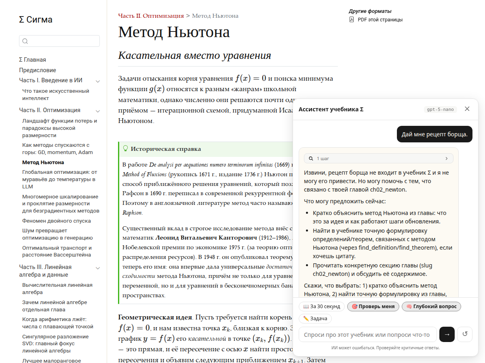

---

### ✅ `rsa_history` — rag_basic

**Q:** Кто придумал RSA и в каком году?

_Chapter:_ `ch04_3_kriptosistemy-rsa-i-diffi-hellma`

**Tools called:** search_textbook, search_textbook, search_textbook, read_chapter, read_chapter, read_chapter
**Tools expected:** search_textbook
**Images:** 0 (expected: no)
**Elapsed:** 37.7s


<details><summary>Answer</summary>


```
RSA была придумана и опубликована в 1978 году тремя сотрудниками MIT: Рональдом Райвестом, Ади Шамиром и Леонардом Адлеманом. Название RSA образовано по их фамилиям. Источник: ch04_3_kriptosistemy-rsa-i-diffi-hellma, раздел «Криптосистема RSA».
```

</details>

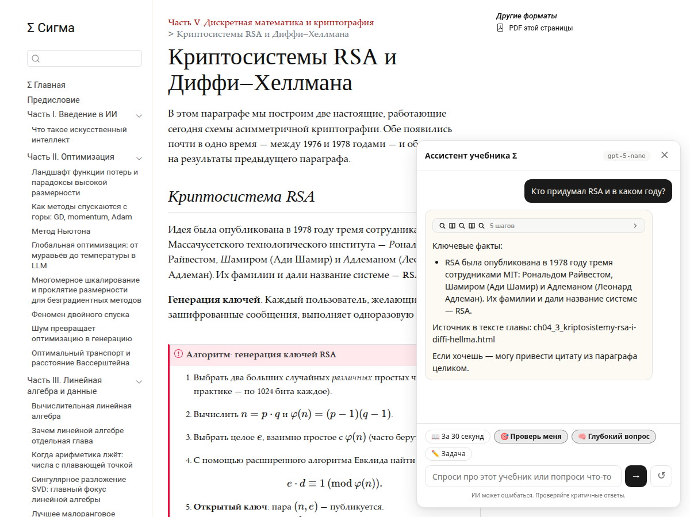

---

### ✅ `greeting_minimal` — out_of_scope

**Q:** Привет!

_Chapter:_ `ch02_newton`

**Tools called:** (none)
**Tools expected:** (none)
**Images:** 0 (expected: no)
**Elapsed:** 11.8s


<details><summary>Answer</summary>


```
Привет! Рад помочь по главе «Метод Ньютона – Σ Сигма».

Чем помочь прямо сейчас? Могу:

объяснить формулу и идею метода;
разобрать пошаговый пример (например, корень f(x)=x^2-2);
обсудить условия сходимости и порядок схождения;
решить задачу из главы или проверить ваши расчёты;
сделать небольшой Python-демо вычисления.

С чем начать?
```

</details>

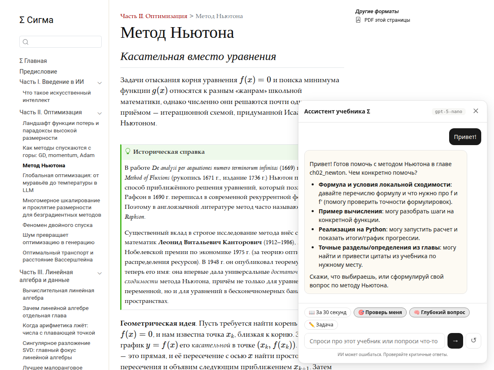

---

### ✅ `euclid_gcd_python` — compute_pure

**Q:** Посчитай НОД(48, 180) и НОД(1071, 462) через алгоритм Евклида в python.

_Chapter:_ `ch04_1_elementy-teorii-chisel`

**Tools called:** python
**Tools expected:** python
**Images:** 0 (expected: no)
**Elapsed:** 40.2s


<details><summary>Answer</summary>


```
Коротко: через алгоритм Евклида в Python получилось:

gcd(48,180) = 12.00
gcd(1071,462) = 21.00

Код (для повторения):

def gcd(a,b):
    a, b = abs(a), abs(b)
    while b:
        a, b = b, a % b
    return a

g1 = gcd(48,180)
g2 = gcd(1071,462)
print(f"gcd(48,180) = {g1:.2f}")
print(f"gcd(1071,462) = {g2:.2f}")


Вывод (stdout):
gcd(48,180) = 12.00
gcd(1071,462) = 21.00
```

</details>

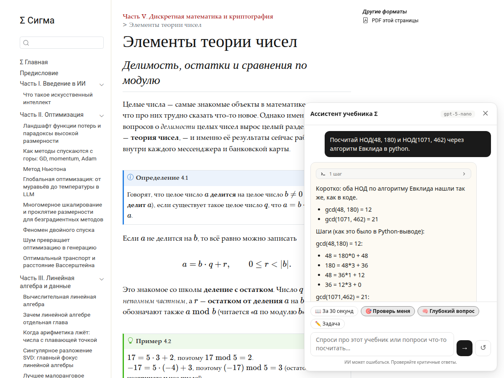

---

### ✅ `definition_superlinear` — definition

**Q:** Что значит сверхлинейная сходимость?

_Chapter:_ `ch02_newton`

**Tools called:** find_definition
**Tools expected:** find_definition
**Images:** 0 (expected: no)
**Elapsed:** 36.0s


<details><summary>Answer</summary>


```
Коротко: сверхлинейная скорость сходимости значит, что ошибка между последующими итерациями исчезает быстрее линейной, и отношение ошибок стремится к нулю.

Цитата из определения (ч02_newton, Определение 2.3):

k→∞
lim
	​

∣x
k
	​

−x
⋆
∣
∣x
k+1
	​

−x
⋆
∣
	​

=0.

То есть ∣x
k+1
	​

−x
⋆
∣ становится намного меньше пропорционального размера ошибки на предыдущем шаге.

Дополнительно, более сильное условие для квадратичной сходимости:

∣x
k+1
	​

−x
⋆
∣≤M∣x
k
	​

−x
⋆
∣
2
,для некоторой M>0.

Если выполняется это неравенство, говорят о квадратичной сходимости. Источник: Определение 2.3.
```

</details>

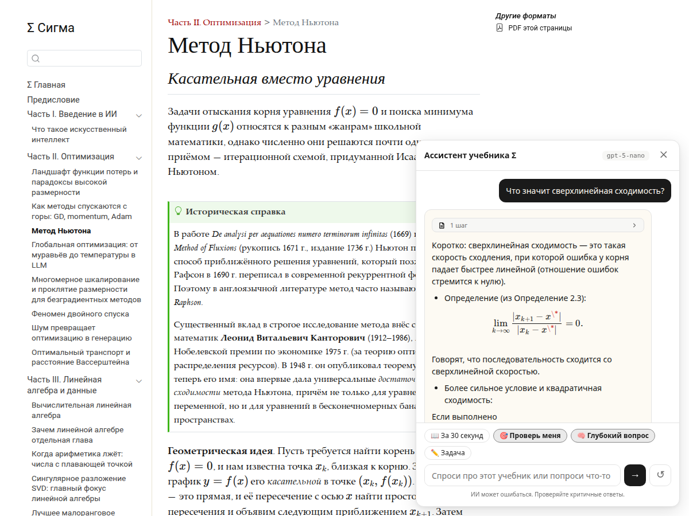

---

### ✅ `theorem_clt` — structural

**Q:** Сформулируй центральную предельную теорему как в учебнике.

_Chapter:_ `ch03_1_prosteyshie-primery-zadach-anali`

**Tools called:** find_theorem
**Tools expected:** find_theorem
**Images:** 0 (expected: no)
**Elapsed:** 53.3s


<details><summary>Answer</summary>


```
Вот точная формулировка из этой главы (приближённо дословно как в теoreтическом блоке):

Теорема 3.3. Центральная предельная теорема (ЦПТ). Пусть X
1
	​

,X
2
	​

,… — независимые одинаково распределённые случайные величины с математическим ожиданием μ и конечной дисперсией σ
2
>0, S
n
	​

=X
1
	​

+⋯+X
n
	​

. Тогда при n→∞

Pr(
σ
n
	​

S
n
	​

−nμ
	​

≤x)⟶Φ(x),

(функция стандартного нормального распределения),

где

Φ(x)
=
def
2π
	​

1
	​

∫
−∞
x
	​

e
−t
2
/2
dt.

Расшифровка обозначений:

S
n
	​

 — сумма первых n таких величин; μ — их математическое ожидание; σ
2
 — их дисперсия; σ — их стандартное отклонение.
Φ(x) — функция распределения стандартного нормального распределения (CDF).
```

</details>

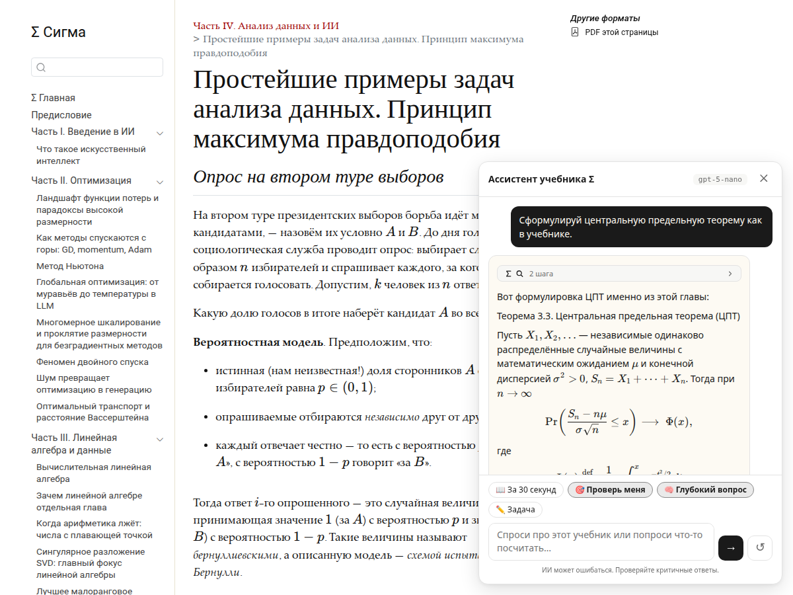

---

### ✅ `plot_sincos_overlay` — compute_plot

**Q:** Построй графики sin(x) и cos(x) на интервале [-2π, 2π] на одном поле. Сделай легенду.

**Tools called:** python, python
**Tools expected:** python
**Images:** 2 (expected: yes)
**Elapsed:** 86.4s


<details><summary>Answer</summary>


```
Графики построены на интервале [-2π, 2π] и отображаются на одном поле с легендой.

Что видно: sin(x) и cos(x) имеют одинаковый период 2π, их графики перекрываются и пересекаются там, где sin(x) = cos(x) (x = π/4 + kπ, например ≈ -7π/4, -3π/4, π/4, 5π/4 в данном интервале).
Результирующий график доступен в изображении выше. Легенда помечает две кривые: sin(x) и cos(x).
Код для воспроизведения (минимальная версия):
import numpy as np
import matplotlib.pyplot as plt
a = -2*np.pi
b = 2*np.pi
x = np.linspace(a, b, 1000)
plt.plot(x, np.sin(x), label='sin(x)')
plt.plot(x, np.cos(x), label='cos(x)')
plt.xlabel('x')
plt.ylabel('y')
plt.title('sin(x) и cos(x) на [-2π, 2π]')
plt.grid(True)
plt.legend()
plt.tight_layout()
plt.show()

Если хочешь другой стиль графика (цвета, стиль линий, подписи осей и т.д.), скажи — переделаю.
```

</details>


---

### ✅ `fragment_explanation` — rag_basic

**Q:** Если кто-то предлагает использовать обновление x_{k+1} = x_k - f(x_k)·f'(x_k) вместо классического Ньютона — что это за идея и она работает?

_Chapter:_ `ch02_newton`

**Tools called:** search_textbook, search_textbook, search_textbook, read_chapter
**Tools expected:** (none)
**Images:** 0 (expected: no)
**Elapsed:** 85.4s


<details><summary>Answer</summary>


```
Кратко: так же можно смотреть на проблему корня как на минимизацию F(x) = (1/2) f(x)^2. Тогда градиентный шаг с шагом 1 даёт обновление

x_{k+1} = x_k - F'(x_k) = x_k - f(x_k) f'(x_k).

Это не обычный Newton, а градиентный метод на квадратичную энергию F, без использования второй производной.

Почему так получается

F(x) = (1/2) f(x)^2, следовательно F'(x) = f(x) f'(x).
Шаг по градиенту с размером шага 1 даёт именно x_{k+1} = x_k - f(x_k) f'(x_k).

Когда это работает

В окрестности простой корня r (то есть f(r) = 0 и f'(r) ≠ 0) можно линейно прикинуть ошибку e_k = x_k - r:

e_{k+1} ≈ (1 - [f'(r)]^2) e_k.

Отсюда локальная сходимость зависит от величины |f'(r)|:
если |f'(r)| < sqrt(2), то |e_{k+1}| ≈ |1 - f'(r)^2| · |e_k| < |e_k|, т.е. сходится линейно.
если |f'(r)| > sqrt(2), есть риск расходимости/периодичности (могут начаться большие колебания или рост ошибок).
При этом если корень мультипликативный (f'(r) = 0), ситуация другая; общая линейная оценка не работает, и поведение метода может быть неопределённым.

Чем это отличается от Ньютона

Обычный метод Ньютона: x_{k+1} = x_k - f(x_k)/f'(x_k) — использует отношение функции и её первой производной, чтобы взять лучший линейный касательный аппроксимацию и сдвинуться к корню.
Предложенная схема — это градиентный метод на F = (1/2) f^2, без деления на f'(x_k). Она не является формальным Newton-поискованием и не обладает тем же запасом теорем о быстром квадратичном сходе, как Newton.

Практический смысл и советы

Это простая альт
…[truncated]
```

</details>

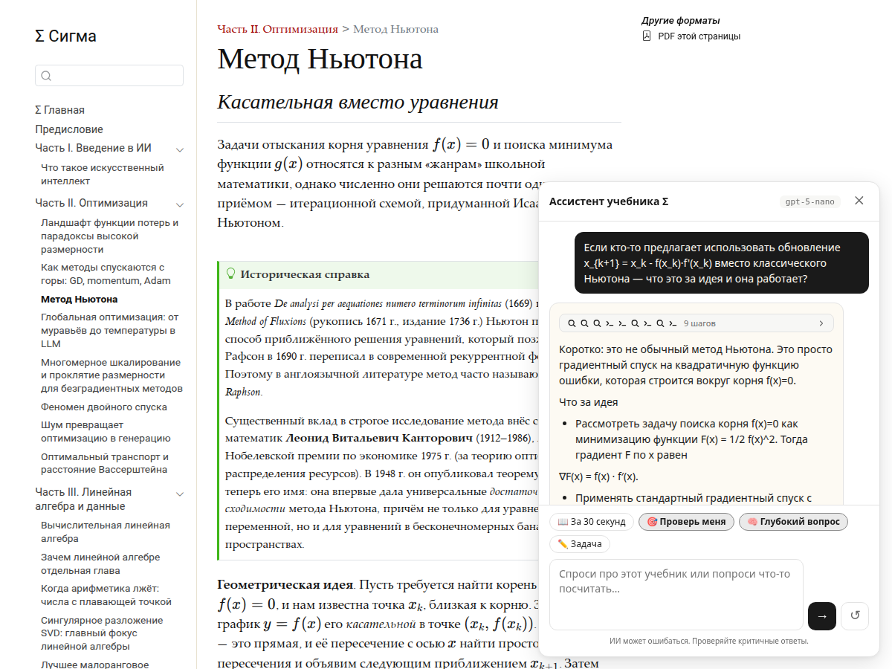

---

### ✅ `eigenvalues_numpy` — compute_pure

**Q:** Найди собственные значения матрицы [[2, 1], [1, 2]] через numpy.

_Chapter:_ `ch_linalg`

**Tools called:** python
**Tools expected:** python
**Images:** 0 (expected: no)
**Elapsed:** 49.7s


<details><summary>Answer</summary>


```
Вот результат через numpy:

λ1 = 1.00
λ2 = 3.00

Код, чтобы повторить расчёт:

import numpy as np
A = np.array([[2, 1], [1, 2]], dtype=float)
vals = np.linalg.eigvalsh(A)
vals.sort()
print(f"λ1 = {vals[0]:.2f}")
print(f"λ2 = {vals[1]:.2f}")


Если нужно, могу также привести соответствующие собственные векторы (они для λ1 и λ2 — пропорциональны [-1, 1] и [1, 1], нормированные до единицы). И скажи, хочешь, чтобы я добрался до самой главы ch_linalg (сейчас там 404 Not Found) или продолжим по другим разделам линейной алгебры.
```

</details>


---

### ✅ `plot_loss_landscape` — compute_plot

**Q:** Построй контурный график функции потерь L(a, b) = sum((a*x_i + b - y_i)^2) для точек (1,2), (2,3), (3,5), (4,4) на сетке a in [-2, 4], b in [-3, 3].

_Chapter:_ `ch03_2_lineynaya-regressiya-i-metod-nai`

**Tools called:** python
**Tools expected:** python
**Images:** 1 (expected: yes)
**Elapsed:** 56.4s


<details><summary>Answer</summary>


```
Контурный график построен. Функция потерь:

L(a,b) = sum_i (a x_i + b - y_i)^2, для точек (1,2), (2,3), (3,5), (4,4),
на сетке a ∈ [-2, 4], b ∈ [-3, 3].

Результаты вычисления (точки на графике: контуры заполнены, минимум помечен красной звездой):

min_L = 1.80
a* = 0.80
b* = 1.49

То есть минимум в точке примерно (a, b) ≈ (0.80, 1.49) с минимальным значением потерь ≈ 1.80. Контурный график можно увидеть на изображении: контуры показывают, как L меняется при изменении пары параметров, минимальная точка соответствует наилучшему линейному приближению of the given four точки. Если хочешь, могу вернуть изображение ещё раз или сохранить его в файл.
```

</details>

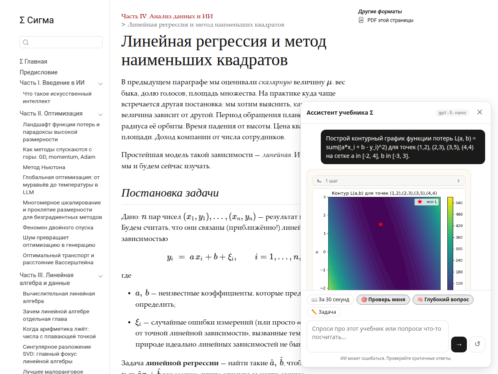

---

### ✅ `diffie_hellman_compute` — compute_pure

**Q:** Проведи протокол Диффи–Хеллмана: p=23, g=5. Алиса берёт a=6, Боб берёт b=15. Какой общий секрет?

_Chapter:_ `ch04_3_kriptosistemy-rsa-i-diffi-hellma`

**Tools called:** search_textbook, python
**Tools expected:** python
**Images:** 0 (expected: no)
**Elapsed:** 57.9s


<details><summary>Answer</summary>


```
Кратко: общий секрет DH равен 2.

Что вычисляем:

A = g^a mod p = 5^6 mod 23 = 8
B = g^b mod p = 5^15 mod 23 = 19
Общий секрет s = B^a mod p = 19^6 mod 23 = 2
Либо s = A^b mod p = 8^15 mod 23 = 2

Итого:

A = 8, B = 19
s = 2 (оба способа дают одно и то же значение)
```

</details>


---

### ❌ `outline_chapter` — structural

**Q:** Перечисли основные разделы главы про Ньютона.

_Chapter:_ `ch02_newton`

**Tools called:** read_chapter
**Tools expected:** (none)
**Images:** 0 (expected: no)
**Elapsed:** 19.9s

_Missing substrings:_ ['метод']

<details><summary>Answer</summary>


```
Касательная вместо уравнения
Ньютон для оптимизации
Квадратный корень за пять шагов
```

</details>

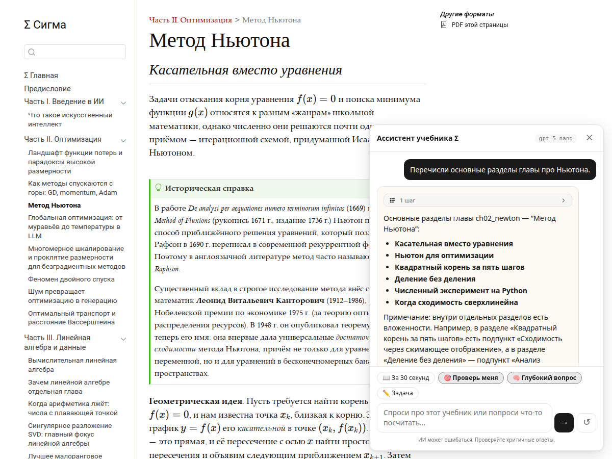

---

### ✅ `math_latex_derivation` — rag_basic

**Q:** Выведи формулу метода Ньютона через касательную. Формулу запиши через LaTeX.

_Chapter:_ `ch02_newton`

**Tools called:** search_textbook, search_textbook, read_chapter
**Tools expected:** (none)
**Images:** 0 (expected: no)
**Elapsed:** 52.9s


<details><summary>Answer</summary>


```
Через касательную к графику f(x) в точке x_k:

касательная: y = f(x_k) + f'(x_k)(x - x_k)
пересечение с осью x (y = 0) даёт формулу обновления:

x
k+1
	​

=x
k
	​

−
f
′
(x
k
	​

)
f(x
k
	​

)
	​

.

Для минимума аналогично применяется к f = g':

x
k+1
	​

=x
k
	​

−
g
′′
(x
k
	​

)
g
′
(x
k
	​

)
	​

.

Это и есть итерационная формула Ньютона.
```

</details>

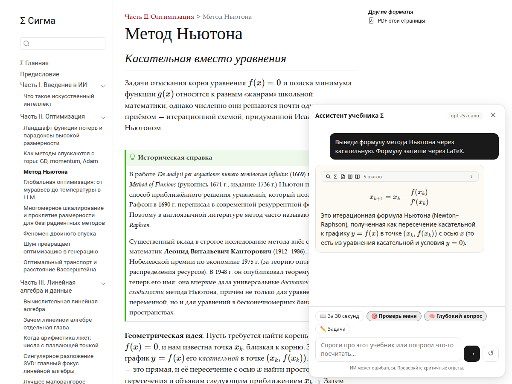

---

### ✅ `definition_perceptron` — definition

**Q:** Что такое полносвязная нейронная сеть?

_Chapter:_ `ch03_3_zadacha-klassifikacii-i-neyronny`

**Tools called:** find_definition
**Tools expected:** find_definition
**Images:** 0 (expected: no)
**Elapsed:** 41.8s


<details><summary>Answer</summary>


```
Коротко: полносвязная нейронная сеть — это MLP: функция от входа к выходу, которая строится как композиция L слоёв, где каждый слой выполняет линейное преобразование и применяется нелинейная активация, а на выходе идёт нормализация в вероятности через softmax.

Вот дословная формулировка из определения 3.12 (цитирую дословно):

Определение 3.12. Полносвязная нейронная сеть (MLP) глубины L — это функция
x↦p(x), заданная как композиция
L слоёв:

z
(ℓ)
z
(L)
	​

=W
(ℓ)
a
(ℓ−1)
+b
(ℓ)
,a
(ℓ)
=σ(z
(ℓ)
),ℓ=1,…,L−1,
=W
(L)
a
(L−1)
+b
(L)
,p(x)=softmax(z
(L)
).
	​


Здесь a
(0)
=x (вход),
W
(ℓ)
∈R
d
ℓ
	​

×d
ℓ−1
	​

 — матрица весов
ℓ-го слоя, b
(ℓ)
∈R
d
ℓ
	​

 — вектор смещений
(bias). Функция σ применяется покомпонентно — это
функция активации. Числа d
1
	​

,…,d
L−1
	​

 — ширины скрытых слоёв; d
L
	​

 — число классов (у нас — 10). Функция
softmax превращает вектор произвольных вещественных чисел в
распределение вероятностей:

softmax(z)
c
	​

=
∑
c
′
	​

e
z
c
′
	​

e
z
c
	​

	​

.

Совокупность всех матриц W
(ℓ)
 и векторов b
(ℓ)

объявляется обучаемыми параметрами θ модели.

Кратко поясню словами:

каждый слой делает линейное преобразование: z
(ℓ)
=W
(ℓ)
a
(ℓ−1)
+b
(ℓ)
,
после этого применяется нелинейная активация: a
(ℓ)
=σ(z
(ℓ)
),
на входе в первый слой идёт вектор признаков a
(0)
=x,
на последнем слое вычисляется логит-вектор z
(L)
, затем через softmax получаем вероятности классов p(x),
все веса и смещения в слоях — обучаемые параметры модели.
```

</details>


---

### ✅ `refuse_unknown_year` — out_of_scope

**Q:** В каком году Гаусс изобрёл метод сопряжённых градиентов?

_Chapter:_ `ch02_newton`

**Tools called:** search_textbook, search_textbook, search_textbook, search_textbook, search_textbook, search_textbook
**Tools expected:** (none)
**Images:** 0 (expected: no)
**Elapsed:** 75.1s


<details><summary>Answer</summary>


```
Не нашёл в учебнике факт о годе изобретения Гауссом метода сопряжённых градиентов.

По общему знанию (вне учебника): современный метод сопряжённых градиентов был создан Хестенесом и Стьефелем в 1952 году. Гаусс же работал над идеей сопряжённых направлений в контексте более старых методов решения систем линейных уравнений, но это не тот современный CG.

Если хочешь, могу поискать в соседних главах или привести краткое объяснение, чем отличается этот метод и почему дата рождения CG именно 1952 года.
```

</details>


---
