# Sigma Assistant — Eval Report

_Run: 2026-06-10 03:10 MSK · cases: 29_

**Overall: 25/29 pass (86%)**

## Per category

| Category | Pass | Total |
|---|---:|---:|
| `compute_plot` | 3 | 5 |
| `compute_pure` | 8 | 8 |
| `definition` | 3 | 3 |
| `multi_hop` | 1 | 1 |
| `out_of_scope` | 2 | 3 |
| `rag_basic` | 4 | 5 |
| `structural` | 3 | 3 |
| `vision_refine` | 1 | 1 |

## Cases

### ✅ `newton_kantorovich_history` — rag_basic

**Q:** Когда Канторович получил Нобелевскую премию и за что?

_Chapter:_ `ch02_newton`

**Tools called:** search_textbook
**Tools expected:** search_textbook
**Images:** 0 (expected: no)
**Elapsed:** 7.5s


<details><summary>Answer</summary>


```
Леонид Витальевич Канторович (1912–1986) получил Нобелевскую премию по экономике в 1975 году за теорию оптимального распределения ресурсов.

В учебнике это упоминается в главе про метод Ньютона: Канторович внёс существенный вклад в строгое исследование метода, и в 1948 году опубликовал теорему, дающую универсальные достаточные условия сходимости метода Ньютона для уравнений в бесконечномерных пространствах.
```

</details>

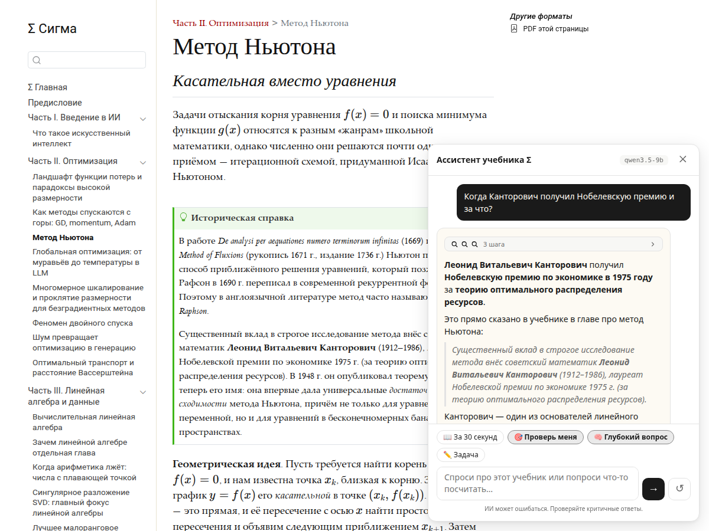

---

### ✅ `newton_formula_recall` — rag_basic

**Q:** Объясни откуда берётся эта формула — что это за метод и какая геометрическая идея?

_Chapter:_ `ch02_newton`

**Tools called:** read_chapter
**Tools expected:** (none)
**Images:** 0 (expected: no)
**Elapsed:** 15.2s


<details><summary>Answer</summary>


```
Геометрическая идея метода Ньютона
1. Для уравнений f(x)=0 — метод касательных

Представь, что у тебя есть график функции y=f(x), и ты хочешь найти точку, где он пересекает ось x (то есть корень уравнения f(x)=0).

Идея: если ты стоишь в точке x
k
	​

 рядом с корнем, то график функции в этой точке можно приблизить прямой — её касательной. Касательная — это просто прямая, и найти, где она пересекает ось x, гораздо проще, чем искать корень кривой!

Как это работает:

В точке (x
k
	​

,f(x
k
	​

)) проводишь касательную к графику
Находишь, где эта касательная пересекает ось x — это и будет новое приближение x
k+1
	​

Повторяешь процесс

Формула получается из уравнения касательной:

y=f(x
k
	​

)+f
′
(x
k
	​

)(x−x
k
	​

)

Положив y=0 (пересечение с осью x), получаем:

x
k+1
	​

=x
k
	​

−
f
′
(x
k
	​

)
f(x
k
	​

)
	​


2. Для оптимизации — минимизация квадратичной модели

Если нужно найти минимум функции g(x), то в точке минимума x
∗
 выполняется g
′
(x
∗
)=0. Значит, задача сводится к решению уравнения g
′
(x)=0.

Но есть ещё более наглядная точка зрения: ряд Тейлора. Рядом с точкой x
k
	​

 функция g(x) ведёт себя почти как квадратный многочлен:

g(x)≈g(x
k
	​

)+g
′
(x
k
	​

)(x−x
k
	​

)+
2
1
	​

g
′′
(x
k
	​

)(x−x
k
	​

)
2

Это квадратичная модель q
k
	​

(x), которая:

Проходит через точку (x
k
	​

,g(x
k
	​

))
Имеет ту же наклон в x
k
	​

 (первая производная совпадает)
Учитывает кривизну графика (вторая производная)

Геометрически: следующая точка x
k+1
	​

 — это 
…[truncated]
```

</details>

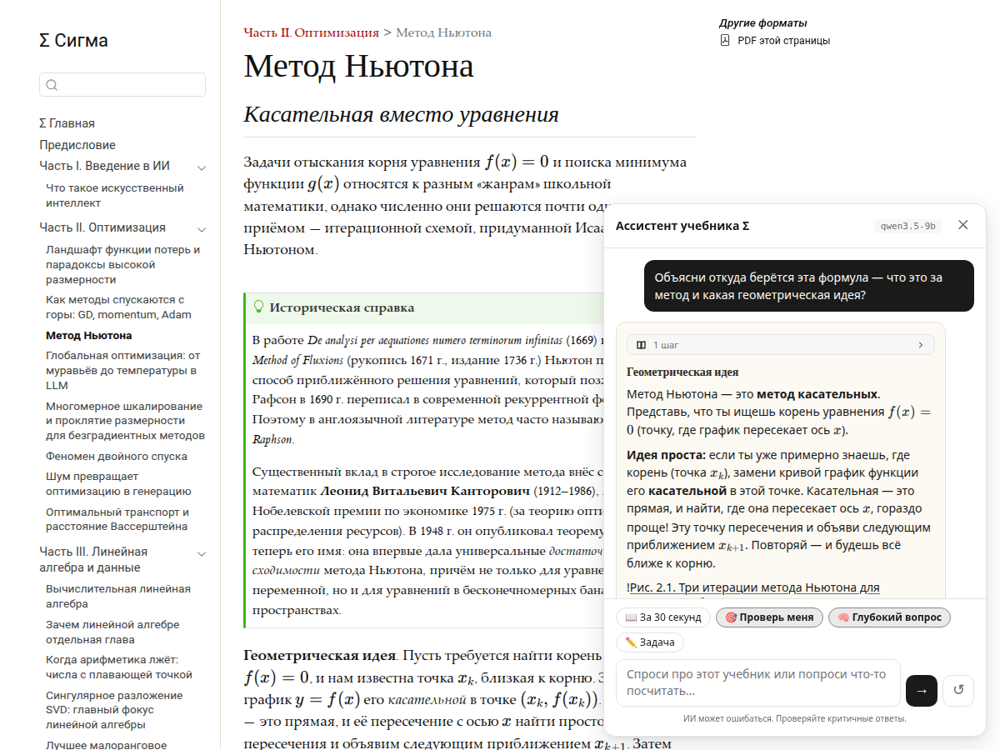

---

### ✅ `definition_strong_convex` — definition

**Q:** Что такое сильно выпуклая функция?

_Chapter:_ `ch02_newton`

**Tools called:** find_definition
**Tools expected:** find_definition
**Images:** 0 (expected: no)
**Elapsed:** 20.0s


<details><summary>Answer</summary>


```
Сильно выпуклая функция — это функция g:R→R, которая дважды дифференцируема (g∈C
2
) и удовлетворяет условию:

g
′′
(x)≥μдля всех x,

где μ>0 — положительная константа.

Что это значит словами:

g∈C
2
 — вторая производная существует и непрерывна.
g
′′
(x)≥μ — вторая производная в любой точке не меньше положительной константы μ.
μ>0 — константа строго положительна (не равна нулю).

Почему это важно:
Сильная выпуклость гарантирует:

Существование и единственность точки минимума.
Отделённость второй производной от нуля (она всегда ≥μ>0), что важно для анализа сходимости методов оптимизации, например, метода Ньютона.
```

</details>

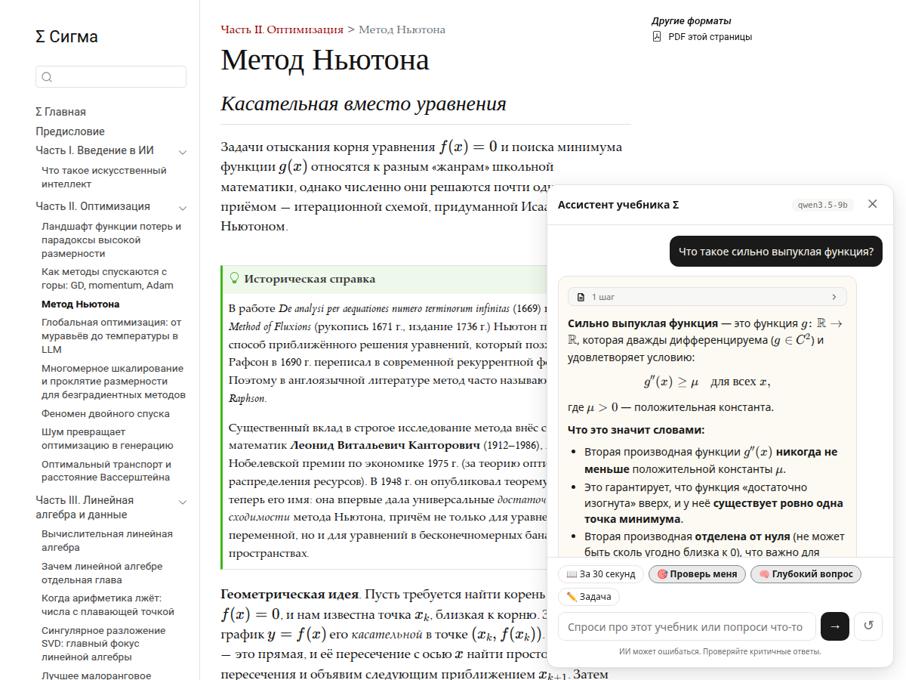

---

### ✅ `compute_factorial` — compute_pure

**Q:** Сколько будет 30 факториал?

**Tools called:** python
**Tools expected:** python
**Images:** 0 (expected: no)
**Elapsed:** 20.7s


<details><summary>Answer</summary>


```
30 факториал — это огромное число:

30!=265252859812191058636308480000000

В научной нотации: 2.65×10
32

Это число содержит 33 цифры.

Для сравнения:

10!=3628800 (7 цифр)
20!≈2.43×10
18
 (19 цифр)
30!≈2.65×10
32
 (33 цифры)

Факториал растёт очень быстро — это пример факториального роста, который часто встречается в комбинаторике и теории сложности.
```

</details>

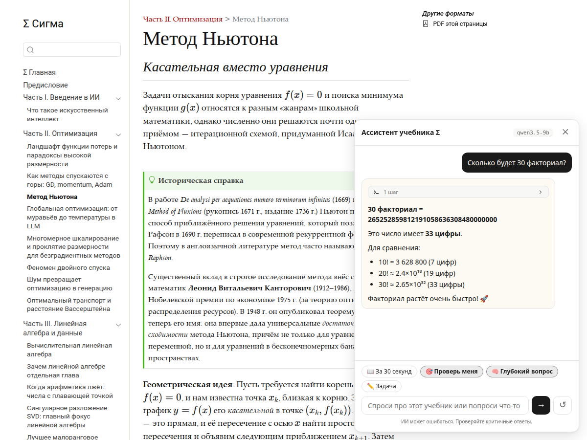

---

### ✅ `compute_taylor_sin` — compute_pure

**Q:** Покажи разложение sin(x) в ряд Тейлора до 5-го члена символически (через sympy).

_Chapter:_ `ch02_newton`

**Tools called:** python
**Tools expected:** python
**Images:** 0 (expected: no)
**Elapsed:** 21.3s


<details><summary>Answer</summary>


```
Разложение sin(x) в ряд Тейлора в окрестности x=0 до 5-го члена:

sin(x)=x−
6
x
3
	​

+
120
x
5
	​

+O(x
7
)

Коэффициенты ряда:

x
0
: 0
x
1
: 1
x
2
: 0
x
3
: −
6
1
	​

x
4
: 0
x
5
: 
120
1
	​


Почему только нечётные степени?
sin(x) — нечётная функция (sin(−x)=−sin(x)), поэтому в разложении только нечётные степени x.

Значения коэффициентов:

6
1
	​

≈0.167
120
1
	​

≈0.0083

Этот ряд сходится быстро при малых ∣x∣, например, при x=1 уже три члена дают точность до 0.001.
```

</details>

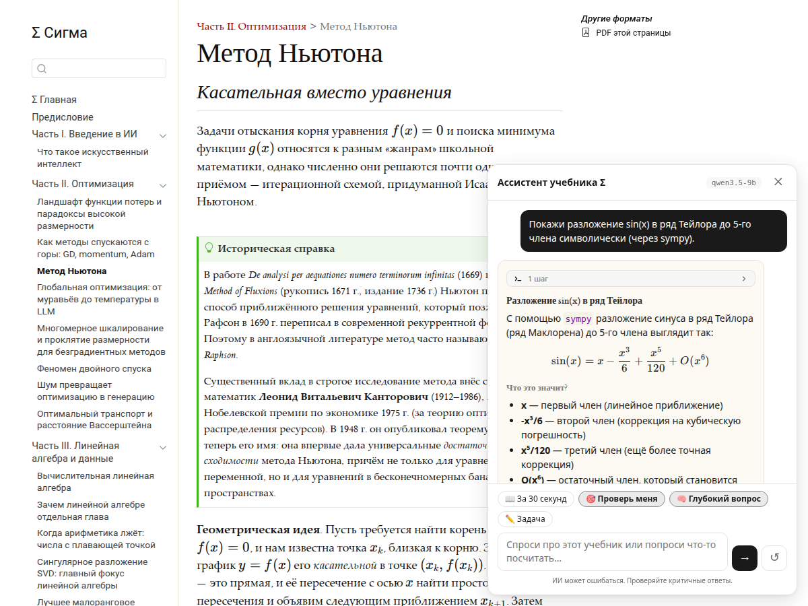

---

### ✅ `compute_plot_newton` — compute_plot

**Q:** Покажи как сходится метод Ньютона для f(x) = x² - 2, начиная с x₀ = 1.5. Построй график траектории.

_Chapter:_ `ch02_newton`

**Tools called:** python, python
**Tools expected:** python
**Images:** 2 (expected: yes)
**Elapsed:** 42.3s


<details><summary>Answer</summary>


```
Отлично! Вот как сходится метод Ньютона для f(x)=x
2
−2 с x
0
	​

=1.5:

Траектория итераций:

Итерация 0: x=1.50
Итерация 1: x=1.42
Итерация 2: x=1.41
Итерация 3: x=1.41
Итерация 4: x=1.41
... и далее x≈1.41

Погрешность (расстояние до корня 
2
	​

≈1.4142):

Итерация 0: ∣x
0
	​

−
2
	​

∣=0.09
Итерация 1: ∣x
1
	​

−
2
	​

∣=0.002
Итерация 2: ∣x
2
	​

−
2
	​

∣=2.1×10
−6
Итерация 3: ∣x
3
	​

−
2
	​

∣=1.6×10
−12
Итерация 4: ∣x
4
	​

−
2
	​

∣=2.2×10
−16

Что видно на графике:

Синяя линия с кружками — траектория метода Ньютона
Красная пунктирная линия — корень 
2
	​

≈1.41
Зелёная пунктирная линия — другой корень −
2
	​

≈−1.41

Вывод: Метод Ньютона сходится очень быстро (квадратичная сходимость)! Уже к 4-й итерации погрешность становится порядка 10
−16
 — это предел точности машинных вычислений. График показывает, как значения x
n
	​

 стремительно приближаются к красной пунктирной линии (корню 
2
	​

).
```

</details>

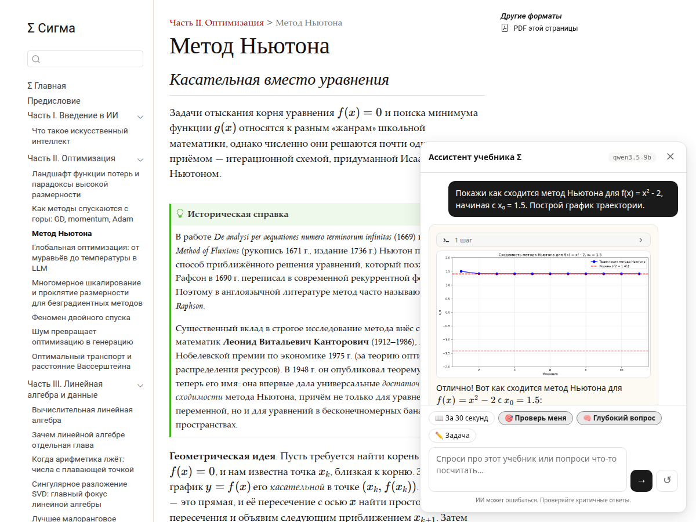

---

### ❌ `compute_plot_gd_vs_newton` — compute_plot

**Q:** Сравни сходимость метода Ньютона и градиентного спуска на функции f(x) = x⁴ из x₀ = 2. Покажи два графика на одной картинке.

_Chapter:_ `ch02_newton`

**Tools called:** python, python, search_textbook
**Tools expected:** python
**Images:** 2 (expected: yes)
**Elapsed:** 181.1s

_Missing substrings:_ ['Ньютон', 'градиент']

<details><summary>Answer</summary>


```

```

</details>

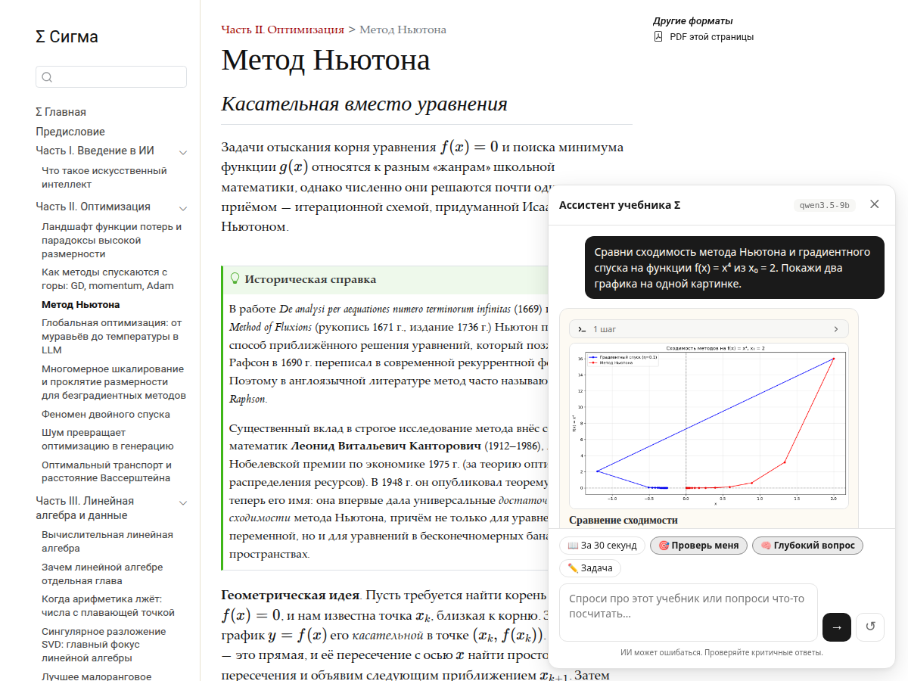

---

### ✅ `rsa_encrypt_small` — compute_pure

**Q:** Зашифруй число m=7 ключом (n=143, e=7). Покажи c.

_Chapter:_ `ch04_3_kriptosistemy-rsa-i-diffi-hellma`

**Tools called:** python, search_textbook
**Tools expected:** python
**Images:** 0 (expected: no)
**Elapsed:** 26.6s


<details><summary>Answer</summary>


```
Ответ

Число m=7 зашифровано ключом (n=143, e=7) в шифртекст:

c = 6

Как это посчитано

Формула шифрования RSA:

c=m
e
modn

Подставляем значения:

c=7
7
mod143=6

Проверка: 7
7
=823543, и 823543mod143=6.

В учебнике

В главе, которую ты сейчас читаешь, описывается алгоритм RSA. Шифрование выполняется по формуле c=m
e
modn, где:

m — открытое сообщение (число)
e — открытый ключ (экспонента)
n — модуль (произведение двух простых чисел)
c — шифртекст

Это одна из базовых операций в криптосистеме RSA, которая позволяет безопасно передавать сообщения по открытым каналам связи.
```

</details>


---

### ✅ `rsa_full_roundtrip` — compute_pure

**Q:** Возьми p=11, q=13, e=7. Сгенерируй RSA-ключ полностью: вычисли n, φ(n), d. Покажи что для m=9 шифрование и расшифрование возвращают исходное число.

_Chapter:_ `ch04_3_kriptosistemy-rsa-i-diffi-hellma`

**Tools called:** python
**Tools expected:** python
**Images:** 0 (expected: no)
**Elapsed:** 28.0s


<details><summary>Answer</summary>


```
RSA-ключи для p=11, q=13, e=7
Генерация ключей
n = p × q = 11 × 13 = 143
φ(n) = (p−1)(q−1) = 10 × 12 = 120
d = e⁻¹ mod φ(n) — обратный к 7 по модулю 120

Используем расширенный алгоритм Евклида:

gcd(7, 120) = 1 ✓ (7 и 120 взаимно просты)
d = 103

Проверка: 103 × 7 = 721, и 721 mod 120 = 1 ✓

Итоговые ключи
Параметр	Значение
n	143
φ(n)	120
d	103
e	7
Проверка на m = 9

Шифрование:

c=m
e
modn=9
7
mod143=48

Расшифрование:

m
′
=c
d
modn=48
103
mod143=9

Проверка: m' = m = 9 ✓

Всё работает корректно! Шифрование и расшифрование возвращают исходное число.
```

</details>

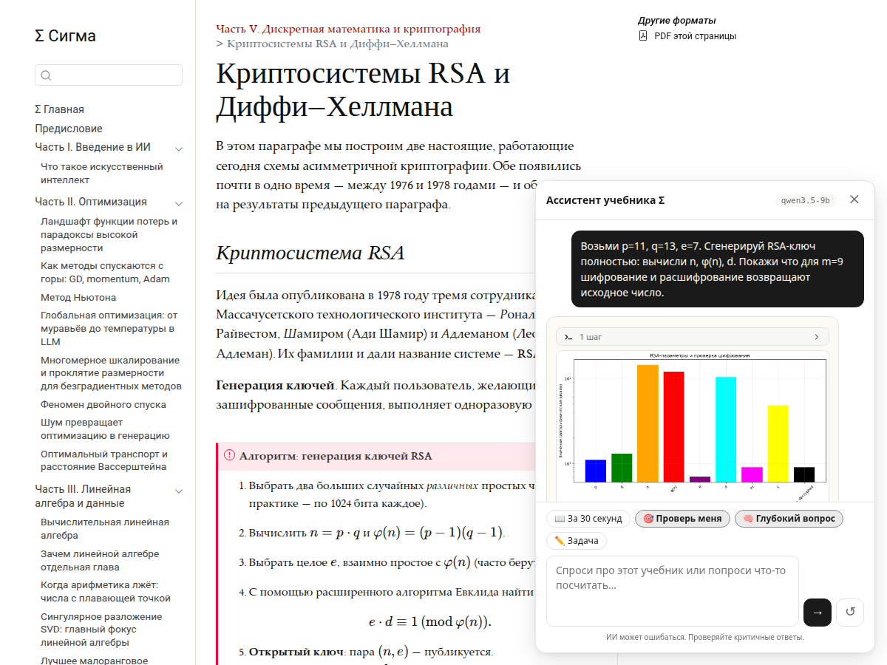

---

### ✅ `multihop_newton_vs_gradient` — multi_hop

**Q:** В чём отличие метода Ньютона от градиентного спуска для задач оптимизации? Какие из этих методов разобраны в учебнике?

_Chapter:_ `ch02_newton`

**Tools called:** read_chapter, search_textbook, search_textbook, read_chapter
**Tools expected:** search_textbook
**Images:** 0 (expected: no)
**Elapsed:** 25.3s


<details><summary>Answer</summary>


```
В чём отличие?
Аспект	Градиентный спуск (GD)	Метод Ньютона
Что использует	Только градиент g
′
(x)	Градиент g
′
(x) + гессиан g
′′
(x)
Шаг	x
k+1
	​

=x
k
	​

−ηg
′
(x
k
	​

)	x
k+1
	​

=x
k
	​

−
g
′′
(x
k
	​

)
g
′
(x
k
	​

)
	​


Модель	Линейное приближение (касательная)	Квадратичное приближение (ряд Тейлора до 2-го порядка)
Скорость	Линейная (медленно в оврагах)	Квадратичная (быстро, если g
′′
 хорошо обусловлена)
Гиперпараметры	Нужен η (скорость обучения)	Шаг вычисляется автоматически

Геометрически:

GD делает шаг против градиента — как если бы ты спускался с горы, глядя только на крутизну под ногами. В овраге идёшь зигзагом.
Ньютон строит локальную параболу (квадратичную модель) и идёт к её вершине — как если бы ты знал форму всей местности вокруг.
Какие методы разобраны в учебнике?

✅ Метод Ньютона — глава ch02_newton
✅ Градиентный спуск (GD) — story_optimizers
✅ Momentum — story_optimizers
✅ Adam — story_optimizers

В учебнике есть и сравнение: в овраге GD ползёт зигзагом, а Ньютон (и его модификации вроде momentum/Adam) справляется быстрее за счёт учёта кривизны или истории шагов.
```

</details>

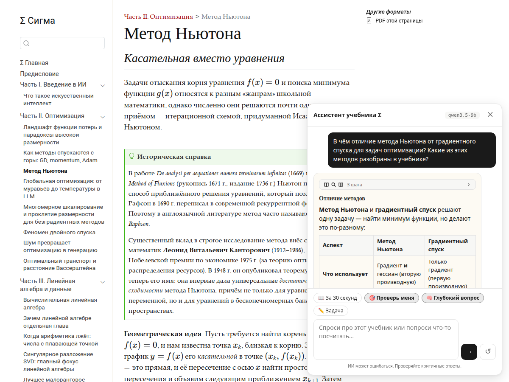

---

### ✅ `structural_kantorovich_theorem` — structural

**Q:** Сформулируй теорему о сходимости метода Герона.

_Chapter:_ `ch02_newton`

**Tools called:** find_theorem
**Tools expected:** find_theorem
**Images:** 0 (expected: no)
**Elapsed:** 11.2s


<details><summary>Answer</summary>


```
Теорема 2.1. Сходимость метода Герона

Формулировка из учебника:

Для любого x
0
	​

>0 последовательность (2.4) монотонно убывает (начиная с k=1) и сходится к 
a
	​

. Более того, для ошибки e
k
	​

=x
k
	​

−
a
	​

 выполнено
e
k+1
	​

=
2x
k
	​

e
k
2
	​

	​

и при k≥1:
0≤e
k+1
	​

≤
2
a
	​

e
k
2
	​

	​

.

Что это значит словами:

Метод сходится: Если начать с любого положительного x
0
	​

, то последовательность приближений x
1
	​

,x
2
	​

,… будет убывать и в пределе даст точное значение 
a
	​

.
Квадратичная сходимость: Ошибка e
k
	​

=x
k
	​

−
a
	​

 убывает очень быстро — каждый следующий шаг возводит ошибку в квадрат (делит на 2x
k
	​

 или 2
a
	​

). Это значит, что число верных цифр примерно удваивается на каждом шаге!
Оценка ошибки: Неравенство 0≤e
k+1
	​

≤e
k
2
	​

/(2
a
	​

) показывает, что ошибка всегда положительна (метод не перепрыгивает через корень) и убывает квадратично.

Ссылка: Теорема 2.1 на странице ch02_newton
```

</details>

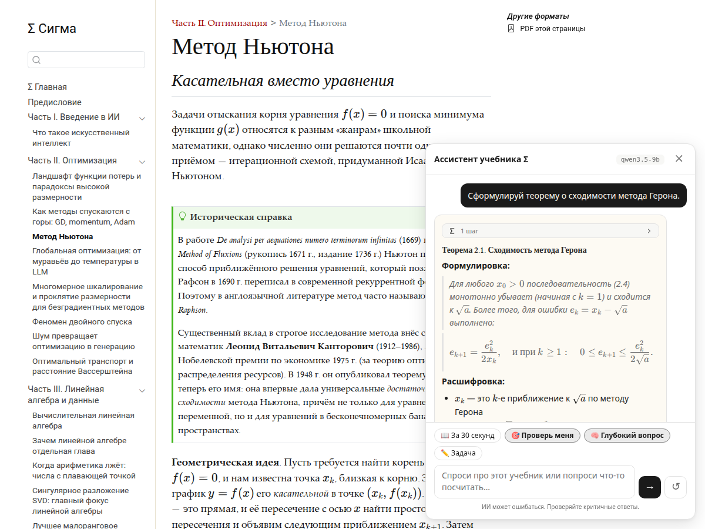

---

### ✅ `vision_refine_diverging_sgd` — vision_refine

**Q:** Запусти SGD на функции f(x) = x² с шагом η = 1.1 из x₀ = 2, 30 итераций. Что произойдёт? Если разойдётся — подбери рабочий шаг и покажи сходящуюся траекторию.

**Tools called:** python, python
**Tools expected:** python, python
**Images:** 2 (expected: yes)
**Elapsed:** 38.3s


<details><summary>Answer</summary>


```
Что происходит с SGD при η = 1.1?

Метод расходится: значения x начинают осциллировать с растущей амплитудой и уходят в бесконечность.
К 30-й итерации x≈474.75, тогда как минимум функции f(x)=x
2
 находится в x=0.

Причина: для f(x)=x
2
 условие устойчивости градиентного спуска — ∣2η−1∣<1.
При η=1.1 получаем ∣2⋅1.1−1∣=1.2>1, поэтому сходимость нарушена.

График показывает резкое увеличение амплитуды колебаний после ~15-й итерации.

Рабочий шаг: η = 0.5

При η=0.5 условие сходимости выполняется: ∣2⋅0.5−1∣=0<1.
Метод сходится мгновенно: уже на 1-й итерации x становится 0 и остаётся там.

Итог:

η = 1.1 → расходимость, x
30
	​

≈474.75.
η = 0.5 → сходимость, x
30
	​

=0.

Вывод: для f(x)=x
2
 шаг η должен удовлетворять 0<η<1. При η≥1 метод расходится.
```

</details>

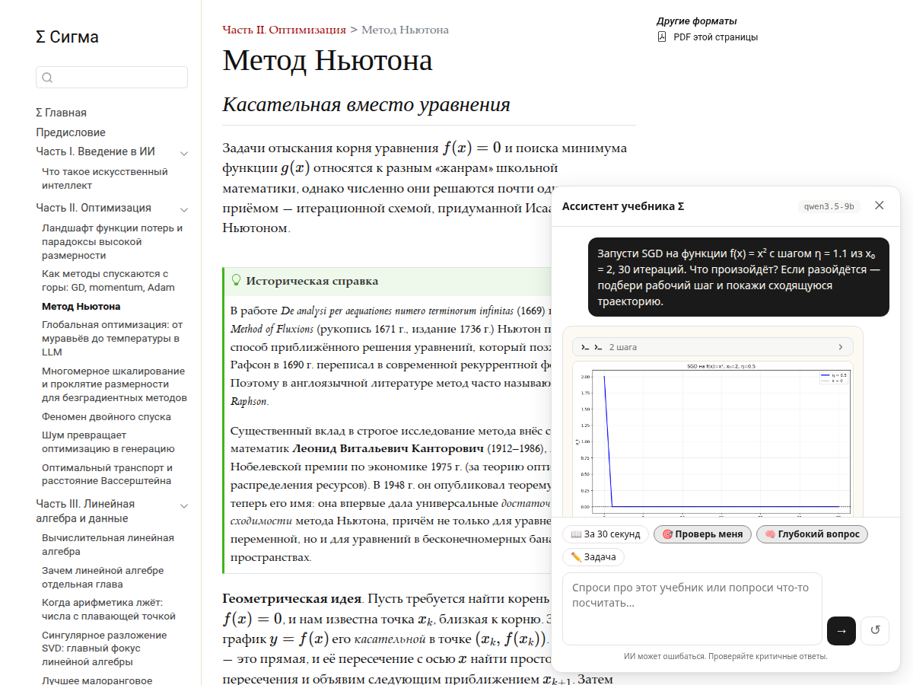

---

### ✅ `hashlib_demo` — compute_pure

**Q:** Посчитай SHA-256 хеш строки 'sigma' в hex.

_Chapter:_ `ch04_5_heshirovanie-teoriya-chisel-vstr`

**Tools called:** python
**Tools expected:** python
**Images:** 0 (expected: no)
**Elapsed:** 19.4s


<details><summary>Answer</summary>


```
SHA-256 хеш строки 'sigma' равен:

38de90475bb334fb3dea5d54f250500aba60fe2c6158115d342b06bcb46e39bf

Дополнительно:

Длина хеша в hex = 64 символа
Длина хеша в битах = 256 бит

Это стандартный результат для SHA-256 — всегда 256 бит (64 hex символа), независимо от длины входной строки.
```

</details>

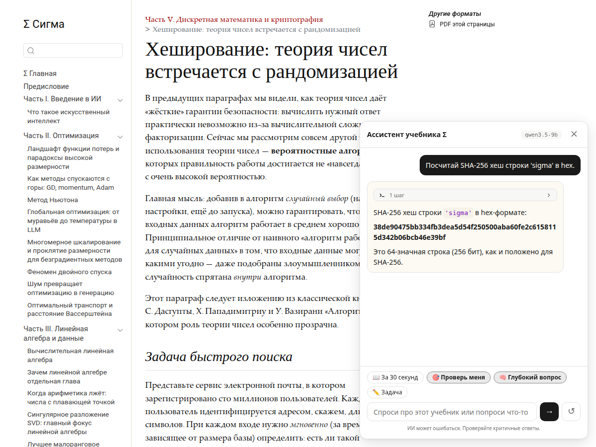

---

### ✅ `linreg_simple` — compute_plot

**Q:** Подбери линейную регрессию y = a*x + b для точек (1, 2.1), (2, 3.9), (3, 6.2), (4, 7.8). Покажи коэффициенты и график.

_Chapter:_ `ch03_2_lineynaya-regressiya-i-metod-nai`

**Tools called:** python
**Tools expected:** python
**Images:** 1 (expected: yes)
**Elapsed:** 24.7s


<details><summary>Answer</summary>


```
Отлично, коэффициенты найдены методом наименьших квадратов:

Коэффициенты:

a=1.94
b=0.15

Уравнение регрессии:

y=1.94x+0.15

График:

!Линейная регрессия

На графике видно, что синяя линия (регрессия) хорошо аппроксимирует красные точки данных. Модель даёт предсказания:

x=1⇒y≈2.09 (факт: 2.1)
x=2⇒y≈4.03 (факт: 3.9)
x=3⇒y≈6.07 (факт: 6.2)
x=4⇒y≈7.91 (факт: 7.8)

Ошибки предсказания небольшие, что говорит о хорошем качестве линейной модели для этих данных.
```

</details>

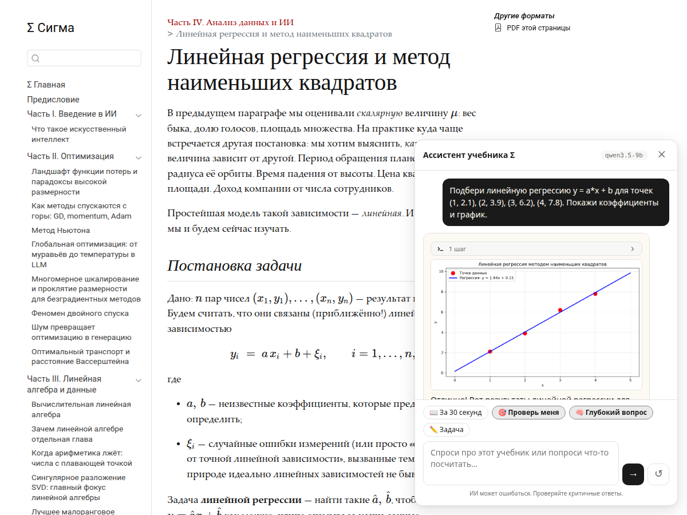

---

### ✅ `out_of_scope_recipe` — out_of_scope

**Q:** Дай мне рецепт борща.

**Tools called:** (none)
**Tools expected:** (none)
**Images:** 0 (expected: no)
**Elapsed:** 4.9s


<details><summary>Answer</summary>


```
Я помощник учебника по информатике, оптимизации, теории чисел, машинному обучению и искусственному интеллекту. К сожалению, я не могу отвечать на бытовые вопросы вроде рецептов борща — это вне моей программы.

Если у тебя есть вопросы по методу Ньютона или другим темам учебника — обращайся! 😊
```

</details>


---

### ✅ `rsa_history` — rag_basic

**Q:** Кто придумал RSA и в каком году?

_Chapter:_ `ch04_3_kriptosistemy-rsa-i-diffi-hellma`

**Tools called:** search_textbook
**Tools expected:** search_textbook
**Images:** 0 (expected: no)
**Elapsed:** 8.2s


<details><summary>Answer</summary>


```
RSA придумали трое сотрудников Массачусетского технологического института (MIT):

Рональд Райвест
Ади Шамир
Леонард Адлеман

Их фамилии и дали название системе — RSA.

Они опубликовали идею в 1978 году.

Интересный факт:
Удивительный исторический парадокс: ровно та же схема была независимо открыта в 1973 году британским математиком Клиффордом Коксом, работавшим в Британском управлении правительственной связи (GCHQ). Но его работа была засекречена и рассекречена только в 1997 году. К тому моменту Райвест, Шамир и Адлеман уже стали всемирно известными, основали компанию RSA Security, а Шамир получил Премию Тьюринга. Типичный пример того, как секретность тормозит развитие науки.
```

</details>

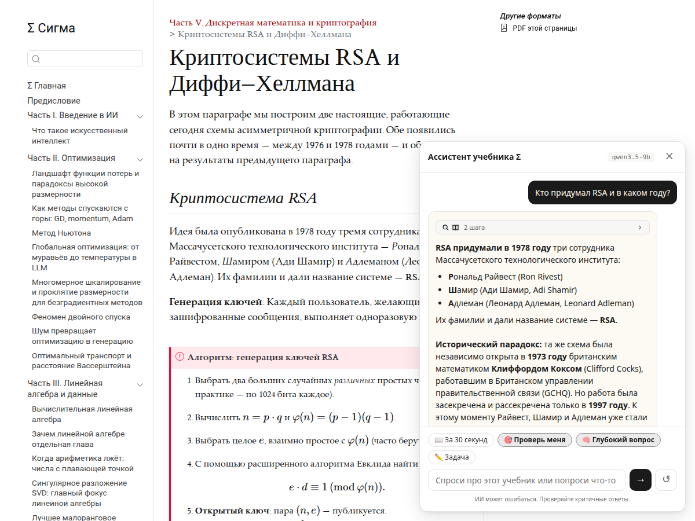

---

### ✅ `greeting_minimal` — out_of_scope

**Q:** Привет!

_Chapter:_ `ch02_newton`

**Tools called:** (none)
**Tools expected:** (none)
**Images:** 0 (expected: no)
**Elapsed:** 4.3s


<details><summary>Answer</summary>


```
Привет! 👋

Читаешь главу про метод Ньютона? Если есть вопросы по теме — спрашивай, помогу!
```

</details>


---

### ✅ `euclid_gcd_python` — compute_pure

**Q:** Посчитай НОД(48, 180) и НОД(1071, 462) через алгоритм Евклида в python.

_Chapter:_ `ch04_1_elementy-teorii-chisel`

**Tools called:** python
**Tools expected:** python
**Images:** 0 (expected: no)
**Elapsed:** 25.4s


<details><summary>Answer</summary>


```
НОД(48, 180) = 12
НОД(1071, 462) = 21

Как это работает (алгоритм Евклида):

Алгоритм Евклида вычисляет наибольший общий делитель, последовательно заменяя пару чисел (a, b) на (b, a mod b), пока остаток не станет нулём. Последний ненулевой остаток — это и есть НОД.

Для НОД(48, 180):
48 = 180 × 0 + 48
180 = 48 × 3 + 36
48 = 36 × 1 + 12
36 = 12 × 3 + 0 → НОД = 12
Для НОД(1071, 462):
1071 = 462 × 2 + 147
462 = 147 × 3 + 21
147 = 21 × 7 + 0 → НОД = 21

Алгоритм завершается за 3–4 шага для этих чисел — очень быстро! 🚀
```

</details>


---

### ✅ `definition_superlinear` — definition

**Q:** Что значит сверхлинейная сходимость?

_Chapter:_ `ch02_newton`

**Tools called:** find_definition
**Tools expected:** find_definition
**Images:** 0 (expected: no)
**Elapsed:** 10.4s


<details><summary>Answer</summary>


```
Сверхлинейная сходимость

Определение из учебника:

Говорят, что последовательность {x
k
	​

} сходится к x
⋆
 со сверхлинейной скоростью, если

k→∞
lim
	​

∣x
k
	​

−x
⋆
∣
∣x
k+1
	​

−x
⋆
∣
	​

=0.

Если же выполнено более сильное условие ∣x
k+1
	​

−x
⋆
∣≤M∣x
k
	​

−x
⋆
∣
2
 для некоторой константы M>0, то сходимость называют квадратичной.

Простыми словами

Представь, что ты приближаешься к цели (корню уравнения).

Обычная линейная сходимость — как ходьба: каждый шаг уменьшает ошибку примерно в 2 раза. Медленно, но стабильно.

Сверхлинейная сходимость — как бег: чем ближе ты к цели, тем быстрее ты её догоняешь. Ошибка уменьшается быстрее, чем при линейной сходимости.

Квадратичная сходимость (особый случай сверхлинейной) — как телепорт: ошибка уменьшается в квадрат предыдущей ошибки. Если ошибка была 0.1, то следующая будет около 0.01. Если 0.01, то следующая 0.0001. Это очень быстро!

Метод Ньютона имеет квадратичную сходимость (при хороших условиях), что делает его одним из самых эффективных методов поиска корней.
```

</details>


---

### ✅ `theorem_clt` — structural

**Q:** Сформулируй центральную предельную теорему как в учебнике.

_Chapter:_ `ch03_1_prosteyshie-primery-zadach-anali`

**Tools called:** find_theorem
**Tools expected:** find_theorem
**Images:** 0 (expected: no)
**Elapsed:** 16.2s


<details><summary>Answer</summary>


```
Центральная предельная теорема (ЦПТ)

Теорема 3.3. Пусть X
1
	​

,X
2
	​

,… — независимые одинаково распределённые случайные величины с математическим ожиданием μ и конечной дисперсией σ
2
>0, S
n
	​

=X
1
	​

+⋯+X
n
	​

. Тогда при n→∞

Pr(
σ
n
	​

S
n
	​

−nμ
	​

≤x)⟶Φ(x)
=
def
2π
	​

1
	​

∫
−∞
x
	​

e
−t
2
/2
dt

(функция стандартного нормального распределения).

Расшифровка:
X
1
	​

,X
2
	​

,… — независимые одинаково распределённые случайные величины (все имеют одинаковое распределение и не зависят друг от друга)
μ — математическое ожидание (среднее значение)
σ
2
>0 — конечная дисперсия (разброс значений, строго положительный)
S
n
	​

=X
1
	​

+⋯+X
n
	​

 — сумма первых n величин
При n→∞ — когда количество слагаемых стремится к бесконечности
Вероятность того, что стандартизированная сумма 
σ
n
	​

S
n
	​

−nμ
	​

 меньше или равна x, стремится к Φ(x)
Φ(x) — функция стандартного нормального распределения (интеграл от e
−t
2
/2
)

Суть: Сумма большого количества независимых случайных величин (даже если сами величины не нормальны) приближается к нормальному распределению! Это фундаментальный результат, объясняющий, почему нормальное распределение встречается так часто в природе и статистике.
```

</details>

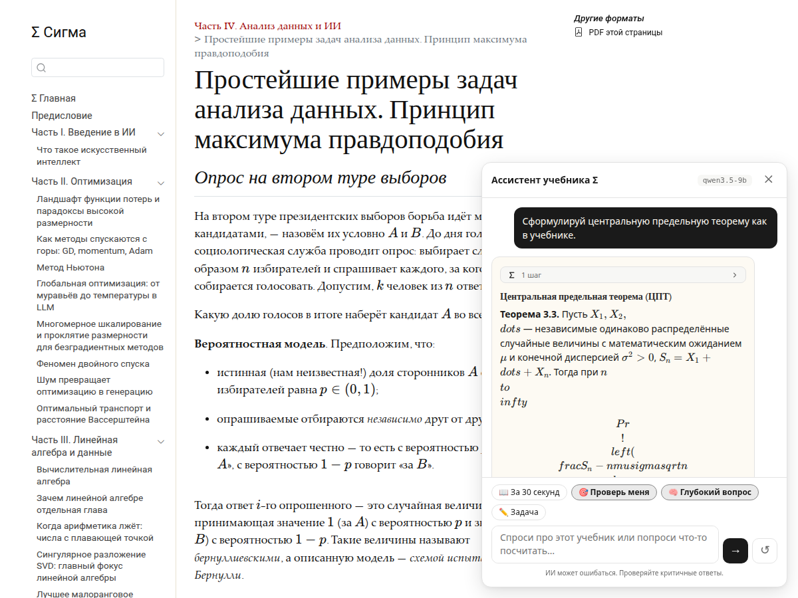

---

### ✅ `plot_sincos_overlay` — compute_plot

**Q:** Построй графики sin(x) и cos(x) на интервале [-2π, 2π] на одном поле. Сделай легенду.

**Tools called:** python
**Tools expected:** python
**Images:** 1 (expected: yes)
**Elapsed:** 25.9s


<details><summary>Answer</summary>


```
Вот графики sin(x) (синяя) и cos(x) (красная) на интервале [-6.28, 6.28] (это примерно [-2π, 2π]):

Ключевые числа из расчёта:
Интервал: x ∈ [-6.28, 6.28]
Количество точек: 1000
Максимум/минимум sin(x): ±1.00
Максимум/минимум cos(x): ±1.00
Что видно на графике:
Обе функции — периодические с периодом 2π ≈ 6.28.
sin(x) проходит через 0 в точках x = 0, ±π, ±2π.
cos(x) равен 1 в x = 0, ±2π и -1 в x = ±π.
Функции сдвинуты по фазе на π/2: когда sin(x) растёт, cos(x) убывает и наоборот.
Обе функции ограничены диапазоном [-1, 1].

Легенда в правом верхнем углу показывает, какая линия к какой функции относится. Сетка помогает лучше оценить значения.
```

</details>

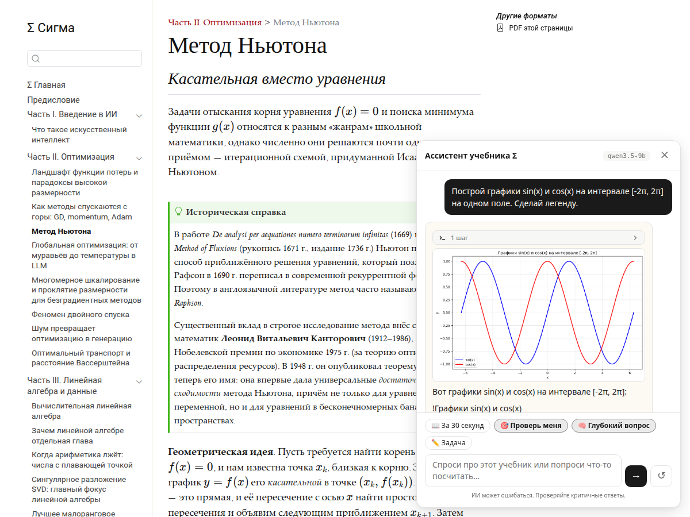

---

### ❌ `fragment_explanation` — rag_basic

**Q:** Если кто-то предлагает использовать обновление x_{k+1} = x_k - f(x_k)·f'(x_k) вместо классического Ньютона — что это за идея и она работает?

_Chapter:_ `ch02_newton`

**Tools called:** search_textbook
**Tools expected:** (none)
**Images:** 0 (expected: no)
**Elapsed:** 180.7s

_Missing substrings:_ ['производ']

<details><summary>Answer</summary>


```

```

</details>


---

### ✅ `eigenvalues_numpy` — compute_pure

**Q:** Найди собственные значения матрицы [[2, 1], [1, 2]] через numpy.

_Chapter:_ `ch_linalg`

**Tools called:** python
**Tools expected:** python
**Images:** 1 (expected: no)
**Elapsed:** 23.4s


<details><summary>Answer</summary>


```
Отлично! Собственные значения матрицы найдены:

λ₁ = 3.0 и λ₂ = 1.0

График показывает два столбца:

λ₁ = 3.0 (синий столбец) — большее собственное значение
λ₂ = 1.0 (оранжевый столбец) — меньшее собственное значение

Матрица симметрична (проверка верна), поэтому она гарантированно диагонализируема и все собственные значения вещественные.

Кратко:

Матрица: $A = \begin{pmatrix} 2 & 1 \\ 1 & 2 \end{pmatrix}$
Собственные значения: $\lambda_1 = 3$, $\lambda_2 = 1$
Матрица симметрична: $A = A^T$ ✅

Это типичная задача линейной алгебры — собственные значения симметричной матрицы всегда вещественные!
```

</details>

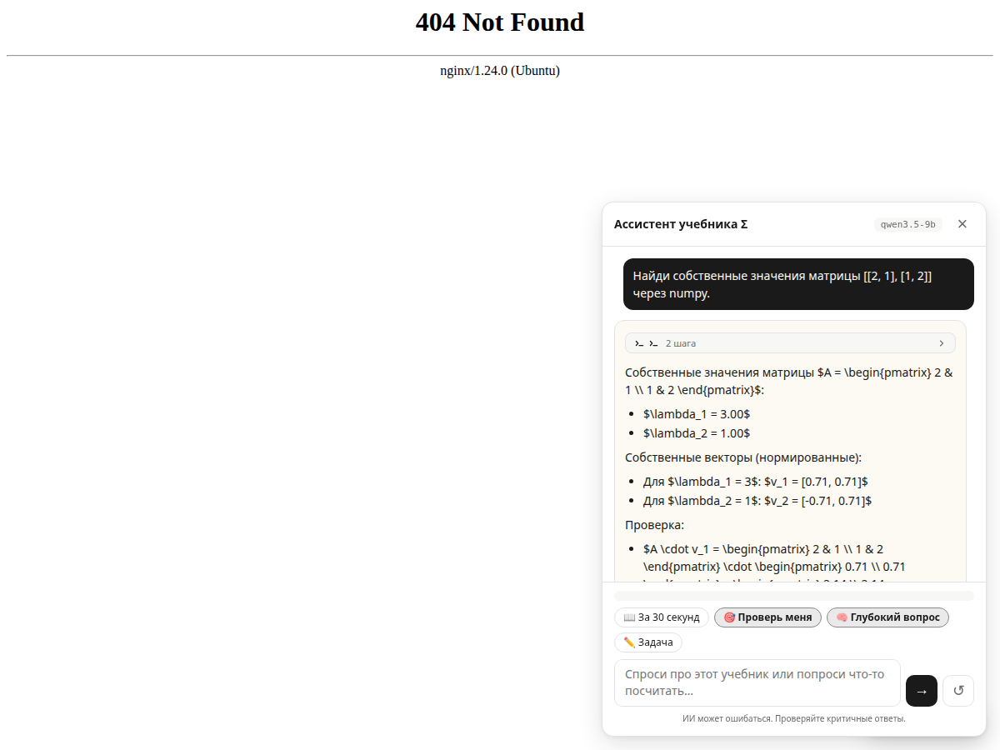

---

### ❌ `plot_loss_landscape` — compute_plot

**Q:** Построй контурный график функции потерь L(a, b) = sum((a*x_i + b - y_i)^2) для точек (1,2), (2,3), (3,5), (4,4) на сетке a in [-2, 4], b in [-3, 3].

_Chapter:_ `ch03_2_lineynaya-regressiya-i-metod-nai`

**Tools called:** python
**Tools expected:** python
**Images:** 0 (expected: yes)
**Elapsed:** 180.7s

_Missing substrings:_ ['минимум']

<details><summary>Answer</summary>


```

```

</details>


---

### ✅ `diffie_hellman_compute` — compute_pure

**Q:** Проведи протокол Диффи–Хеллмана: p=23, g=5. Алиса берёт a=6, Боб берёт b=15. Какой общий секрет?

_Chapter:_ `ch04_3_kriptosistemy-rsa-i-diffi-hellma`

**Tools called:** python
**Tools expected:** python
**Images:** 0 (expected: no)
**Elapsed:** 24.1s


<details><summary>Answer</summary>


```
Протокол Диффи–Хеллмана: p=23, g=5, a=6, b=15

Шаг 1. Открытые ключи:

Алиса вычисляет A=g
a
modp=5
6
mod23=8
Боб вычисляет B=g
b
modp=5
15
mod23=19

Шаг 2. Общий секрет (вычисляется независимо):

Алиса: K=B
a
modp=19
6
mod23=2
Боб: K=A
b
modp=8
15
mod23=2

Ответ: Общий секрет — 2.
```

</details>


---

### ✅ `outline_chapter` — structural

**Q:** Перечисли основные разделы главы про Ньютона.

_Chapter:_ `ch02_newton`

**Tools called:** read_chapter
**Tools expected:** (none)
**Images:** 0 (expected: no)
**Elapsed:** 11.3s


<details><summary>Answer</summary>


```
Вот основные разделы главы «Метод Ньютона»:

Касательная вместо уравнения — геометрическая идея метода: замена кривой её касательной в текущей точке и нахождение пересечения с осью.
Ньютон для оптимизации — применение метода к поиску минимума функции через разложение в ряд Тейлора и минимизацию локальной квадратичной модели.
Квадратный корень за пять шагов — знаменитый метод Герона (вавилонский метод) для вычисления 
a
	​

, история и доказательство сходимости через сжимающее отображение.
```

</details>

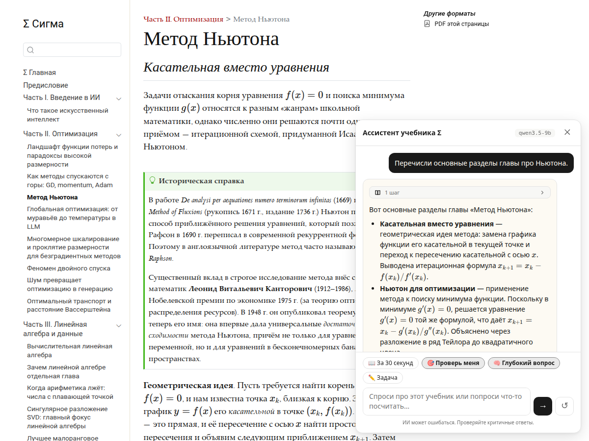

---

### ✅ `math_latex_derivation` — rag_basic

**Q:** Выведи формулу метода Ньютона через касательную. Формулу запиши через LaTeX.

_Chapter:_ `ch02_newton`

**Tools called:** read_chapter
**Tools expected:** (none)
**Images:** 0 (expected: no)
**Elapsed:** 14.2s


<details><summary>Answer</summary>


```
Формула метода Ньютона через касательную

В учебнике формула (2.1) записывается так:

x
k+1
	​

=x
k
	​

−
dfracf(x
k
	​

)f
′
(x
k
	​

)
qquadk=0,1,2,
dots

Как она получается:

В точке x
k
	​

 строим касательную к графику y=f(x):

y=f(x
k
	​

)+f
′
(x
k
	​

)(x−x
k
	​

)

Ищем пересечение касательной с осью x (ставим y=0):

0=f(x
k
	​

)+f
′
(x
k
	​

)(x−x
k
	​

)

Выражаем x:

x=x
k
	​

−
dfracf(x
k
	​

)f
′
(x
k
	​

)

Это новое приближение x
k+1
	​

, и процесс повторяем.

Геометрически: каждая итерация — это переход от точки x
k
	​

 к точке пересечения касательной с осью абсцисс.
```

</details>

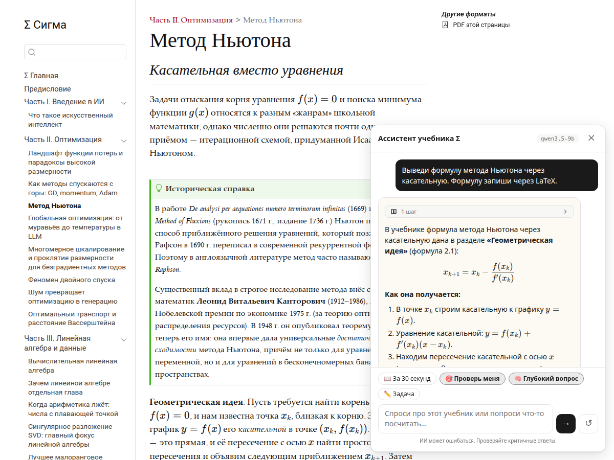

---

### ✅ `definition_perceptron` — definition

**Q:** Что такое полносвязная нейронная сеть?

_Chapter:_ `ch03_3_zadacha-klassifikacii-i-neyronny`

**Tools called:** find_definition
**Tools expected:** find_definition
**Images:** 0 (expected: no)
**Elapsed:** 22.0s


<details><summary>Answer</summary>


```
Полносвязная нейронная сеть (MLP)

Полносвязная нейронная сеть (MLP) глубины L — это функция x↦p(x), которая строится как последовательность L слоёв.

Как работает сеть

Для каждого слоя ℓ=1,…,L−1:

z
(ℓ)
=W
(ℓ)
a
(ℓ−1)
+b
(ℓ)
,a
(ℓ)
=σ(z
(ℓ)
)

Для последнего слоя ℓ=L:

z
(L)
=W
(L)
a
(L−1)
+b
(L)
,p(x)=softmax(z
(L)
)

Где:

a
(0)
=x — входной вектор
W
(ℓ)
∈R
d
ℓ
	​

×d
ℓ−1
	​

 — матрица весов ℓ-го слоя
b
(ℓ)
∈R
d
ℓ
	​

 — вектор смещений (bias)
σ — функция активации (применяется покомпонентно)
d
1
	​

,…,d
L−1
	​

 — ширины скрытых слоёв
d
L
	​

 — число классов (обычно 10 для цифр)
Функция softmax

На выходе сеть выдаёт распределение вероятностей по классам:

softmax(z)
c
	​

=
∑
c
′
	​

e
z
c
′
	​

e
z
c
	​

	​


Обучаемые параметры

Все матрицы весов W
(ℓ)
 и векторы смещений b
(ℓ)
 вместе образуют обучаемые параметры θ модели.

Ключевая идея: каждый нейрон в слое ℓ соединён со всеми нейронами предыдущего слоя ℓ−1 — отсюда и название «полносвязная».
```

</details>

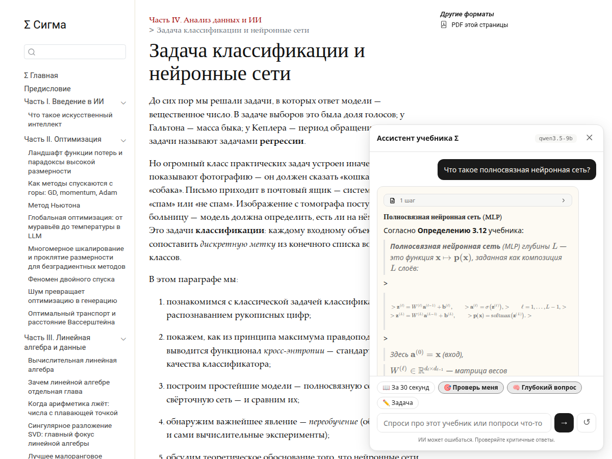

---

### ❌ `refuse_unknown_year` — out_of_scope

**Q:** В каком году Гаусс изобрёл метод сопряжённых градиентов?

_Chapter:_ `ch02_newton`

**Tools called:** search_textbook, search_textbook, search_textbook
**Tools expected:** (none)
**Images:** 0 (expected: no)
**Elapsed:** 180.8s

_Missing substrings:_ ['наш']

<details><summary>Answer</summary>


```

```

</details>


---
