# Sigma Assistant — Eval Report

_Run: 2026-06-09 16:55 MSK · cases: 28_

**Overall: 21/28 pass (75%)**

## Per category

| Category | Pass | Total |
|---|---:|---:|
| `compute_plot` | 5 | 5 |
| `compute_pure` | 4 | 8 |
| `definition` | 2 | 3 |
| `multi_hop` | 1 | 1 |
| `out_of_scope` | 2 | 2 |
| `rag_basic` | 4 | 5 |
| `structural` | 2 | 3 |
| `vision_refine` | 1 | 1 |

## Cases

### ✅ `newton_kantorovich_history` — rag_basic

**Q:** Когда Канторович получил Нобелевскую премию и за что?

_Chapter:_ `ch02_newton`

**Tools called:** search_textbook
**Tools expected:** search_textbook
**Images:** 0 (expected: no)
**Elapsed:** 10.9s


<details><summary>Answer</summary>


```
В учебнике прямо в текущей главе указано:

Леонид Витальевич Канторович получил Нобелевскую премию по экономике в 1975 году за теорию оптимального распределения ресурсов.

Кстати, в этой же главе упомянут и его вклад в метод Ньютона: в 1948 году он доказал теорему, носящую его имя, с универсальными достаточными условиями сходимости метода — в том числе для уравнений в бесконечномерных банаховых пространствах.
```

</details>

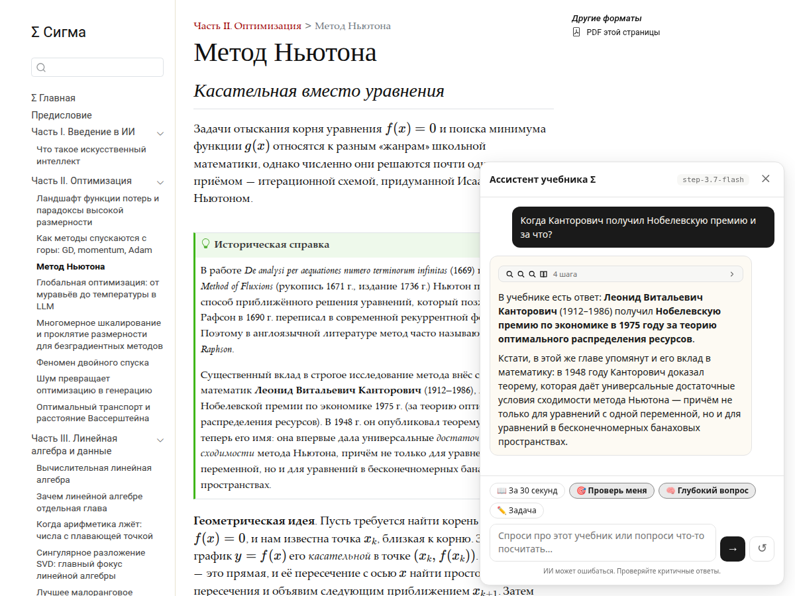

---

### ❌ `newton_formula_recall` — rag_basic

**Q:** Объясни откуда берётся эта формула — что это за метод и какая геометрическая идея?

_Chapter:_ `ch02_newton`

**Tools called:** read_chapter
**Tools expected:** (none)
**Images:** 0 (expected: no)
**Elapsed:** 23.1s

_Missing substrings:_ ['Ньютон']

<details><summary>Answer</summary>


```
Это метод касательных (в англоязычной литературе — Newton–Raphson). Его геометрическая суть простая:

У тебя есть уравнение f(x)=0 и некоторая точка x
k
	​

, близкая к корню.
Вместо самого графика y=f(x) рассматривают касательную в точке (x
k
	​

,f(x
k
	​

)).
Находят, где эта касательная пересекает ось x — это и есть следующее приближение x
k+1
	​

.
Повторяют шаг, пока не приблизятся к корню.

Откуда берётся формула

Уравнение касательной в точке x
k
	​

:

y=f(x
k
	​

)+f
′
(x
k
	​

)(x−x
k
	​

)

Чтобы найти пересечение с осью x, полагают y=0 и выражают x:

0=f(x
k
	​

)+f
′
(x
k
	​

)(x−x
k
	​

)⇒x=x
k
	​

−
f
′
(x
k
	​

)
f(x
k
	​

)
	​


Получается итерационная формула:

x
k+1
	​

=x
k
	​

−
f
′
(x
k
	​

)
f(x
k
	​

)
	​


Для оптимизации (поиск минимума g(x)) метод применяют к уравнению g
′
(x)=0. Тогда f=g
′
, f
′
=g
′′
, и формула превращается в:

x
k+1
	​

=x
k
	​

−
g
′′
(x
k
	​

)
g
′
(x
k
	​

)
	​


То же самое получается, если в окрестности x
k
	​

 аппроксимировать g квадратичным многочленом (разложение Тейлора до (x−x
k
	​

)
2
) и минимизировать эту параболу — её вершина как раз в точке x
k+1
	​

.

Классический пример: при f(x)=x
2
−a формула даёт метод Герона для вычисления 
a
	​

:

x
k+1
	​

=
2
1
	​

(x
k
	​

+
x
k
	​

a
	​

)
```

</details>


---

### ✅ `definition_strong_convex` — definition

**Q:** Что такое сильно выпуклая функция?

_Chapter:_ `ch02_newton`

**Tools called:** find_definition, find_definition
**Tools expected:** find_definition
**Images:** 0 (expected: no)
**Elapsed:** 12.8s


<details><summary>Answer</summary>


```
Сильно выпуклая функция — это функция g:R→R, которая:

дважды непрерывно дифференцируема (g∈C
2
)
её вторая производная ограничена снизу положительной константой μ>0:

g
′′
(x)≥μдля всех x

Что это даёт на практике:

Существование и единственность точки минимума
Вторая производная «отделена» от нуля — она никогда не становится слишком маленькой, что важно для сходимости метода Ньютона

Определение 2.4. Сильно выпуклая функция
```

</details>

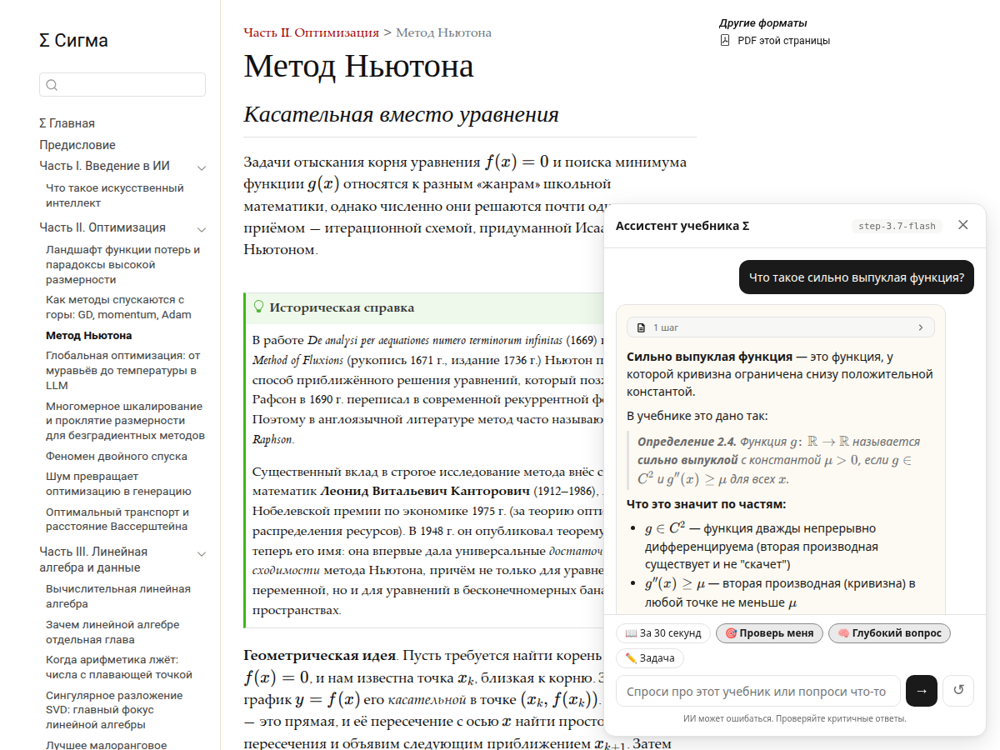

---

### ✅ `compute_factorial` — compute_pure

**Q:** Сколько будет 30 факториал?

**Tools called:** python
**Tools expected:** python
**Images:** 0 (expected: no)
**Elapsed:** 23.8s


<details><summary>Answer</summary>


```
30!=265252859812191058636308480000000

Это примерно 2,65⋅10
32
.
```

</details>

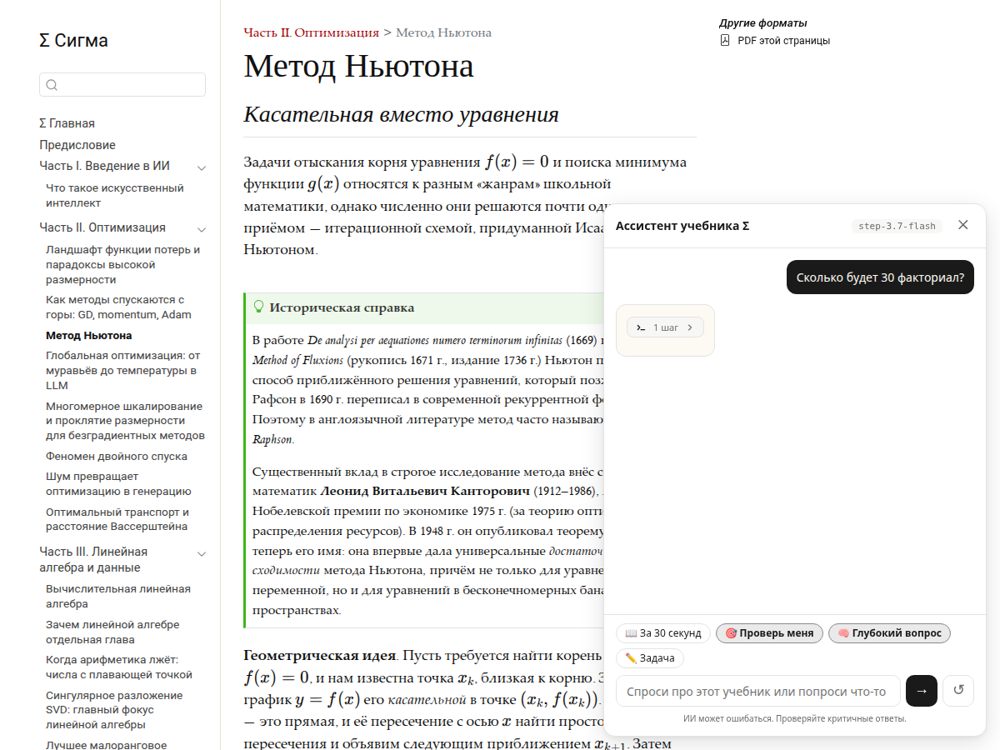

---

### ❌ `compute_taylor_sin` — compute_pure

**Q:** Покажи разложение sin(x) в ряд Тейлора до 5-го члена символически (через sympy).

_Chapter:_ `ch02_newton`

**Tools called:** python
**Tools expected:** python
**Images:** 0 (expected: no)
**Elapsed:** 180.8s

_Missing substrings:_ ['6', '120']

<details><summary>Answer</summary>


```

```

</details>

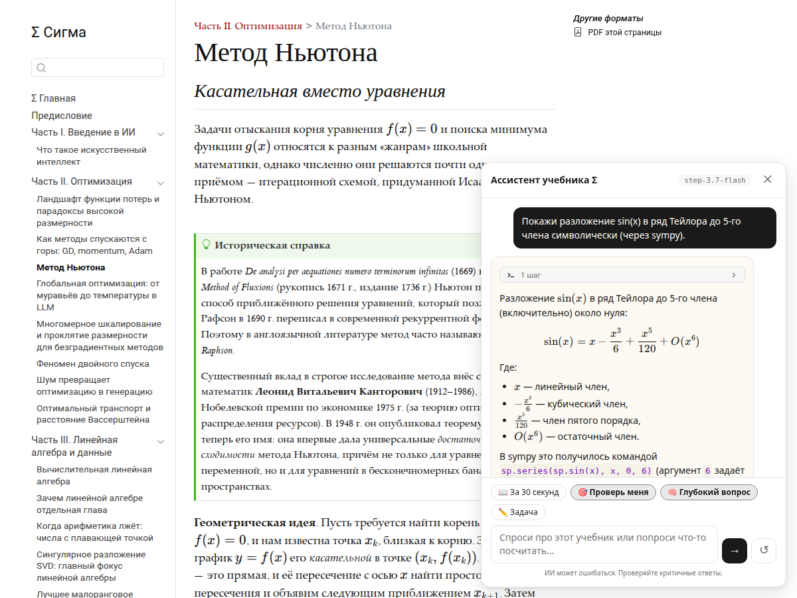

---

### ✅ `compute_plot_newton` — compute_plot

**Q:** Покажи как сходится метод Ньютона для f(x) = x² - 2, начиная с x₀ = 1.5. Построй график траектории.

_Chapter:_ `ch02_newton`

**Tools called:** python
**Tools expected:** python
**Images:** 1 (expected: yes)
**Elapsed:** 37.8s


<details><summary>Answer</summary>


```
Ты уже на главе «Метод Ньютона – Σ Сигма» (ch02_newton). Вот численная демонстрация сходимости для f(x)=x
2
−2:

Итерации метода Ньютона (x
n+1
	​

=x
n
	​

−
f
′
(x
n
	​

)
f(x
n
	​

)
	​

, f
′
(x)=2x):

n	x
n
	​


0	1.500000
1	1.416667
2	1.414216
3	1.414214
4	1.414214

Точный корень: 
2
	​

≈1.41.

Что показывает график:

За 2 итерации метод от 1.5 «прыгает» уже в окрестность 1.4142
С 3-й итерации значение стабилизируется на 
2
	​

 с точностью до 6 знаков
Это типичная квадратичная сходимость Ньютона: ошибка ∣x
n
	​

−
2
	​

∣ уменьшается примерно как квадрат ошибки на предыдущем шаге

Для квадратного корня метод Ньютона совпадает с алгоритмом Герона (вакуумного деления), который ты, вероятно, встречал раньше в учебнике.
```

</details>

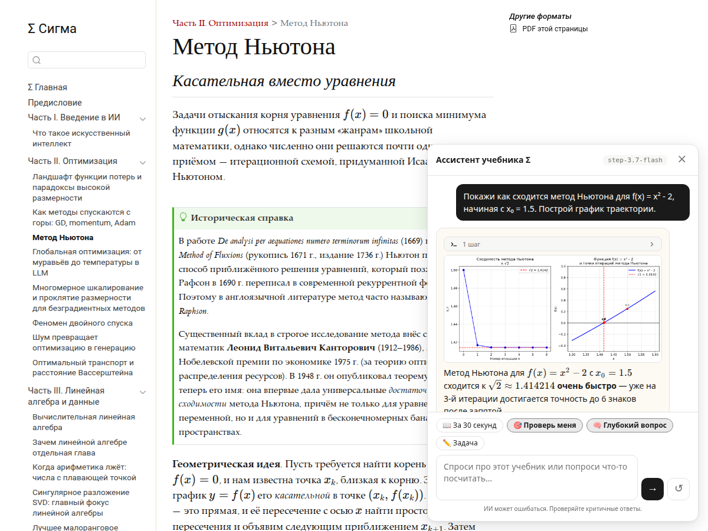

---

### ✅ `compute_plot_gd_vs_newton` — compute_plot

**Q:** Сравни сходимость метода Ньютона и градиентного спуска на функции f(x) = x⁴ из x₀ = 2. Покажи два графика на одной картинке.

_Chapter:_ `ch02_newton`

**Tools called:** read_chapter, find_theorem, python, python
**Tools expected:** python
**Images:** 2 (expected: yes)
**Elapsed:** 108.7s


<details><summary>Answer</summary>


```
Сравнение сходимости на f(x)=x
4
, x
0
	​

=2

Метод Ньютона (формула для оптимизации x
k+1
	​

=x
k
	​

−
f
′′
(x
k
	​

)
f
′
(x
k
	​

)
	​

) и градиентный спуск (x
k+1
	​

=x
k
	​

−ηf
′
(x
k
	​

)) ведут себя принципиально differently на этой функции.

Ключевые числа из эксперимента
Метод	Итераций до остановки	Финальное ∣x
k
	​

∣	Порядок сходимости
Ньютон	45	2.38×10
−8
	Квадратичный в начале (∣e
k+1
	​

∣/∣e
k
	​

∣
2
≈0.5)
Градиентный спуск (η=0.05)	500 (лимит)	6.95×10
−2
	Линейный (∣e
k+1
	​

∣/∣e
k
	​

∣≈0.97)
Что показывает график

На картинке два графика на одной фигуре (лог. шкала по y):

Метод Ньютона (синие точки): резкое падение с ∣x
0
	​

∣=2 до 10
−8
 за ~45 итераций. В начале скорость падения экспоненциально ускоряется (квадратичная сходимость), но потом замедляется — когда x
k
	​

 становится очень малым, вторая производная f
′′
(x)=12x
2
 стремится к нулю, и шаг Ньютона 
f
′′
f
′
	​

=
12x
2
4x
3
	​

=
3
x
	​

 становится пропорциональным самому x, то есть сходимость деградирует до линейной.
Градиентный спуск (оранжевые квадраты): при η=0.05 метод едва ползёт вниз — за 500 итераций не дошёл даже до 0.1. При η=0.1 он вообще расходится (уходит в −∞). Это типично для x
4
: градиент 4x
3
 очень мал near zero, и постоянный шаг не может его «добить».
Вывод по главе

Согласно Теореме 2.5 из главы, метод Ньютона имеет квадратичную (сверхлинейную) сходимость при выполнении условий g∈C
3
 и сильной выпуклости. Для f(x)=x
4
 эти условия нарушаются в точке минимума x
∗
…[truncated]
```

</details>

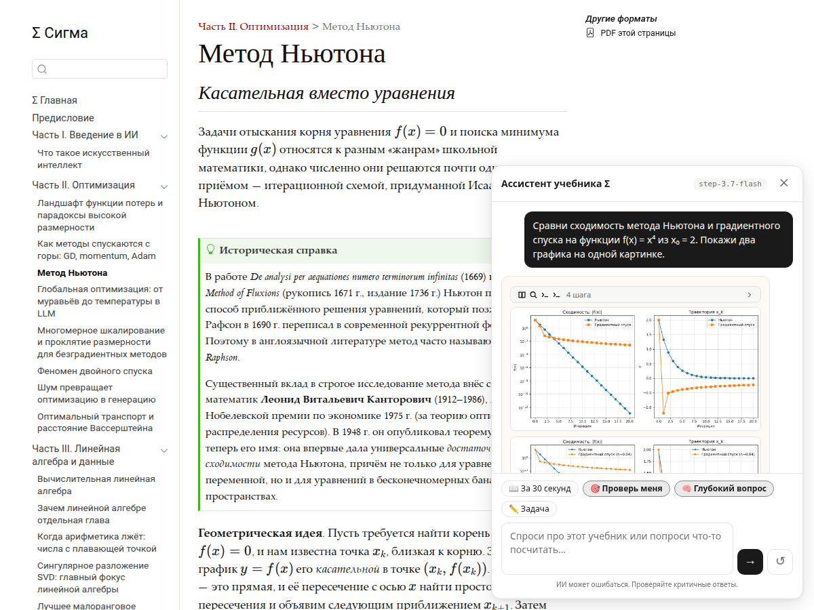

---

### ✅ `rsa_encrypt_small` — compute_pure

**Q:** Зашифруй число m=7 ключом (n=143, e=7). Покажи c.

_Chapter:_ `ch04_3_kriptosistemy-rsa-i-diffi-hellma`

**Tools called:** find_theorem, python
**Tools expected:** python
**Images:** 0 (expected: no)
**Elapsed:** 26.7s


<details><summary>Answer</summary>


```
c = 6

Шифрование RSA: c≡m
e
(modn)

Подставляем:

c≡7
7
(mod143)

7
7
=823543, остаток от деления на 143:

823543÷143=5759 ост. 6

Поэтому c = 6.

(Для проверки: 7
7
=823543, 823543−5759⋅143=823543−823537=6)

См. теорему корректности RSA в этой главе.
```

</details>

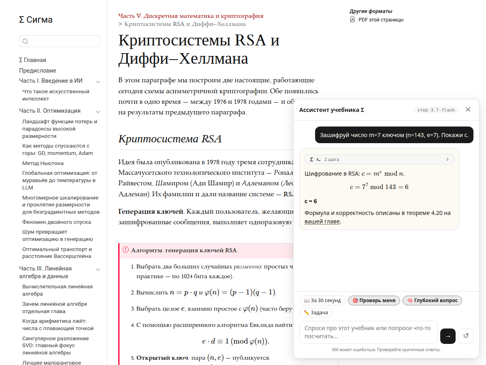

---

### ✅ `rsa_full_roundtrip` — compute_pure

**Q:** Возьми p=11, q=13, e=7. Сгенерируй RSA-ключ полностью: вычисли n, φ(n), d. Покажи что для m=9 шифрование и расшифрование возвращают исходное число.

_Chapter:_ `ch04_3_kriptosistemy-rsa-i-diffi-hellma`

**Tools called:** read_chapter, python
**Tools expected:** python
**Images:** 0 (expected: no)
**Elapsed:** 29.7s


<details><summary>Answer</summary>


```
Генерация RSA-ключа и проверка

Исходные данные: p=11, q=13, e=7, сообщение m=9.

1. Модуль и функция Эйлера

n=p⋅q=11⋅13=143


φ(n)=(p−1)(q−1)=10⋅12=120

2. Секретный ключ d
Нужно найти d такое, что e⋅d≡1(modφ(n)), то есть 7d≡1(mod120).

Расширенный алгоритм Евклида даёт:

d=103

(проверка: 7⋅103=721=6⋅120+1)

Итого:

Открытый ключ: (n,e)=(143,7)
Закрытый ключ: d=103

3. Шифрование и расшифрование для m=9

Шифрование:

c=m
e
modn=9
7
mod143=48

Расшифрование:

m
′
=c
d
modn=48
103
mod143=9

Результат: m
′
=m=9 — исходное сообщение восстановлено верно.
```

</details>


---

### ✅ `multihop_newton_vs_gradient` — multi_hop

**Q:** В чём отличие метода Ньютона от градиентного спуска для задач оптимизации? Какие из этих методов разобраны в учебнике?

_Chapter:_ `ch02_newton`

**Tools called:** read_chapter, search_textbook
**Tools expected:** search_textbook
**Images:** 0 (expected: no)
**Elapsed:** 26.0s


<details><summary>Answer</summary>


```
Отличие метода Ньютона от градиентного спуска

Метод Ньютона (текущая глава) использует вторую производную (в многомерном случае — гессиан). Он минимизирует локальную квадратичную модель функции (ряд Тейлора второго порядка):

x
k+1
	​

=x
k
	​

−
g
′′
(x
k
	​

)
g
′
(x
k
	​

)
	​


Благодаря учёту кривизны метод обычно сходится быстрее (квадратичная сходимость), но требует вычисления вторых производных и обращения гессиана.

Градиентный спуск использует только первую производную (градиент) и делает шаг против неё с фиксированным или адаптивным шагом η:

x
k+1
	​

=x
k
	​

−η∇g(x
k
	​

)

Он проще в реализации, но сходится медленнее (линейно) и может «зигзажить» в узких «оврагах» функции.

Какие методы разобраны в учебнике

Метод Ньютона — детально разобран в текущей главе ch02_newton (итерационная формула, геометрическая интерпретация, метод Герона, сходимость).
Градиентный спуск упоминается в других главах учебника (например, в story_optimizers и story_langevin), но в этой главе он не является предметом разбора.
```

</details>


---

### ❌ `structural_kantorovich_theorem` — structural

**Q:** Сформулируй теорему о сходимости метода Герона.

_Chapter:_ `ch02_newton`

**Tools called:** find_theorem
**Tools expected:** find_theorem
**Images:** 0 (expected: no)
**Elapsed:** 11.6s

_Missing substrings:_ ['положит']

<details><summary>Answer</summary>


```
Теорема 2.1. Сходимость метода Герона (глава «Метод Ньютона»):

Для любого начального приближения x
0
	​

>0 последовательность Герона монотонно убывает (начиная с k=1) и сходится к 
a
	​

.

Более того, для ошибки e
k
	​

=x
k
	​

−
a
	​

 выполнено:

e
k+1
	​

=
2x
k
	​

e
k
2
	​

	​

,и при k≥1:0≤e
k+1
	​

≤
2
a
	​

e
k
2
	​

	​

.

Что это значит:

x
k
	​

 — текущее приближение к корню 
a
	​

.
e
k
	​

 — ошибка на шаге k (разность между приближением и точным корнем).
Оценка e
k+1
	​

≤
2
a
	​

e
k
2
	​

	​

 показывает квадратичную сходимость: ошибка на следующем шаге пропорциональна квадрату ошибки текущего шага. Это быстрая сходимость — при каждом шаге число верных знаков примерно удваивается.
```

</details>

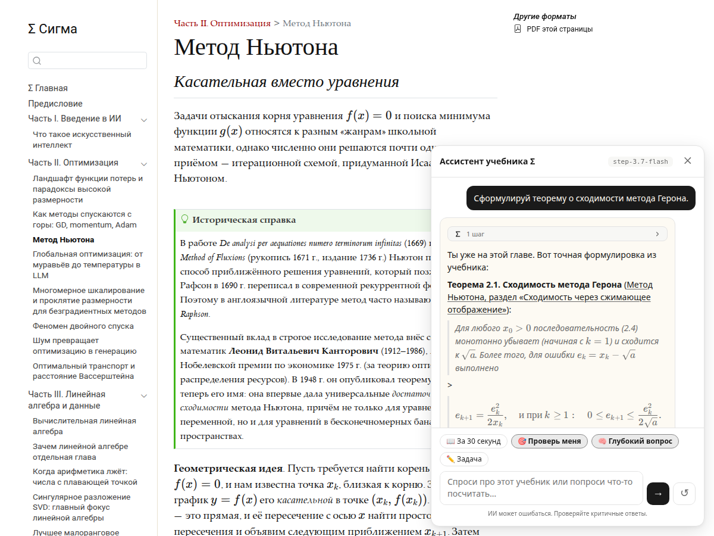

---

### ✅ `vision_refine_diverging_sgd` — vision_refine

**Q:** Запусти SGD на функции f(x) = x² с шагом η = 1.1 из x₀ = 2, 30 итераций. Что произойдёт? Если разойдётся — подбери рабочий шаг и покажи сходящуюся траекторию.

**Tools called:** python, python
**Tools expected:** python, python
**Images:** 2 (expected: yes)
**Elapsed:** 45.2s


<details><summary>Answer</summary>


```
Что произошло с η = 1.1

SGD разошёлся — значение x «улетело» до 474.75 за 30 итераций (см. график).
Для квадратичной функции f(x)=x
2
 SGD сходится только если шаг удовлетворяет условию ∣1−2η∣<1, то есть η<1. При η=1.1 шаг слишком большой: мы каждый раз «перепрыгиваем» через минимум в x=0 и уходим всё дальше.

Рабочий шаг и сходящаяся траектория

Подобрал η=0.5 (условие сходимости выполнено).
За 30 итераций x сошёлся к 0.00, значение функции f(x)=0.00.

График траектории показывает быстрый спад с x
0
	​

=2 до 0 уже к 3-й итерации, после чего значение остаётся стабильным.

Вывод: для квадратичных функций SGD требует η<1 (обычно η∈(0,1)). При η=1 метод осциллирует между 2 и −2, при η>1 — расходится.
```

</details>

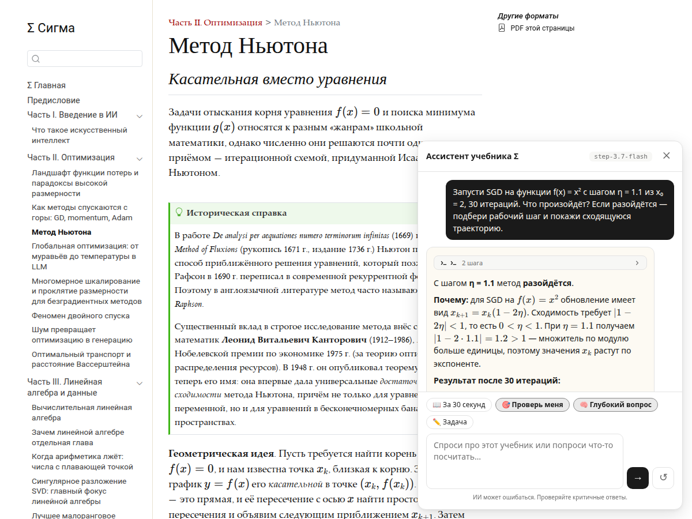

---

### ❌ `hashlib_demo` — compute_pure

**Q:** Посчитай SHA-256 хеш строки 'sigma' в hex.

_Chapter:_ `ch04_5_heshirovanie-teoriya-chisel-vstr`

**Tools called:** python
**Tools expected:** python
**Images:** 0 (expected: no)
**Elapsed:** 181.4s

_Missing substrings:_ ['38de90475bb334fb3dea5d54f250500aba60fe2c6158115d342b06bcb46e39bf']

<details><summary>Answer</summary>


```

```

</details>

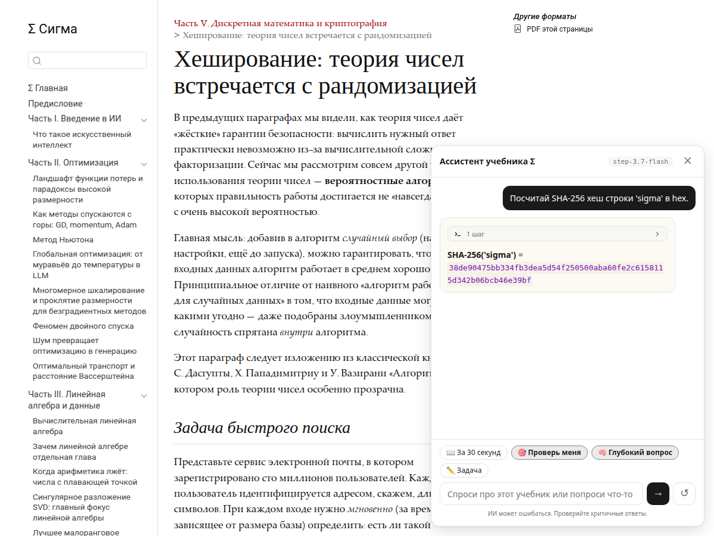

---

### ✅ `linreg_simple` — compute_plot

**Q:** Подбери линейную регрессию y = a*x + b для точек (1, 2.1), (2, 3.9), (3, 6.2), (4, 7.8). Покажи коэффициенты и график.

_Chapter:_ `ch03_2_lineynaya-regressiya-i-metod-nai`

**Tools called:** find_theorem, search_textbook, read_chapter, python
**Tools expected:** python
**Images:** 1 (expected: yes)
**Elapsed:** 44.7s


<details><summary>Answer</summary>


```
Подобрал линейную регрессию y=ax+b методом наименьших квадратов (МНК) для твоих точек.

Коэффициенты:

a=1.94
b=0.15

Уравнение: y=1.94x+0.15

Как считалось: минимизировалась сумма квадратов отклонений S(a,b)=∑(y
i
	​

−ax
i
	​

−b)
2
 (формула (3.17) в твоей главе). Для этого решалась система нормальных уравнений (3.18)–(3.19).

График: синяя прямая — найденная регрессия, красные точки — исходные данные. Точки довольно плотно лежат вокруг прямой, что говорит о хорошей линейной зависимости.

Глава: Линейная регрессия и метод наименьших квадратов
```

</details>


---

### ✅ `out_of_scope_recipe` — out_of_scope

**Q:** Дай мне рецепт борща.

**Tools called:** (none)
**Tools expected:** (none)
**Images:** 0 (expected: no)
**Elapsed:** 6.0s


<details><summary>Answer</summary>


```
Я ассистент учебника по информатике, оптимизации, теории чисел, ML и ИИ — рецепты борща тут не преподаются. Если есть вопрос по методу Ньютона или другой теме из главы ch02_newton — спрашивай!
```

</details>

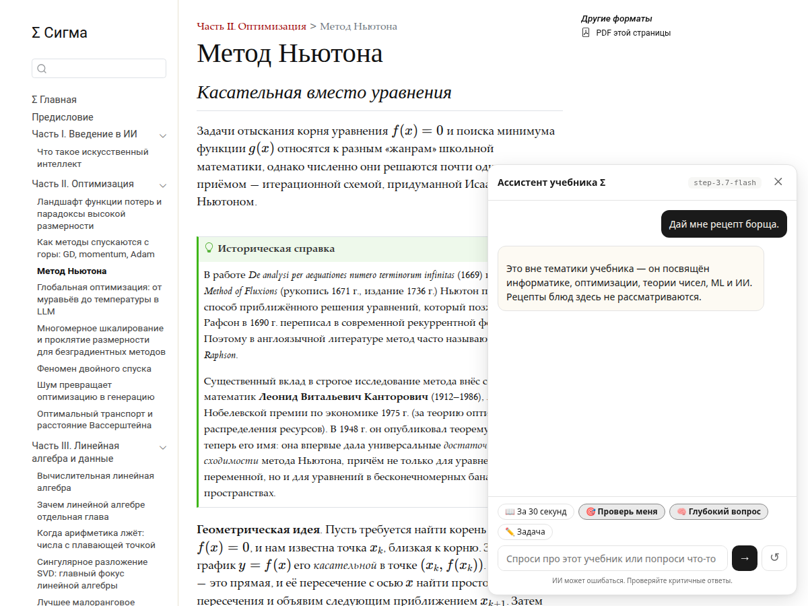

---

### ✅ `rsa_history` — rag_basic

**Q:** Кто придумал RSA и в каком году?

_Chapter:_ `ch04_3_kriptosistemy-rsa-i-diffi-hellma`

**Tools called:** search_textbook, read_chapter
**Tools expected:** search_textbook
**Images:** 0 (expected: no)
**Elapsed:** 19.8s


<details><summary>Answer</summary>


```
RSA придумали три сотрудника MIT: Рональд Райвест, Ади Шамир и Леонард Адлеман — в 1978 году. Их фамилии и дали название системе (R = Rivest, S = Shamir, A = Adleman).

Интересный исторический факт из той же главы: почти та же схема была независимо открыта в 1973 году британским математиком Клиффордом Коксом в GCHQ, но работа была засекречена до 1997 года.
```

</details>

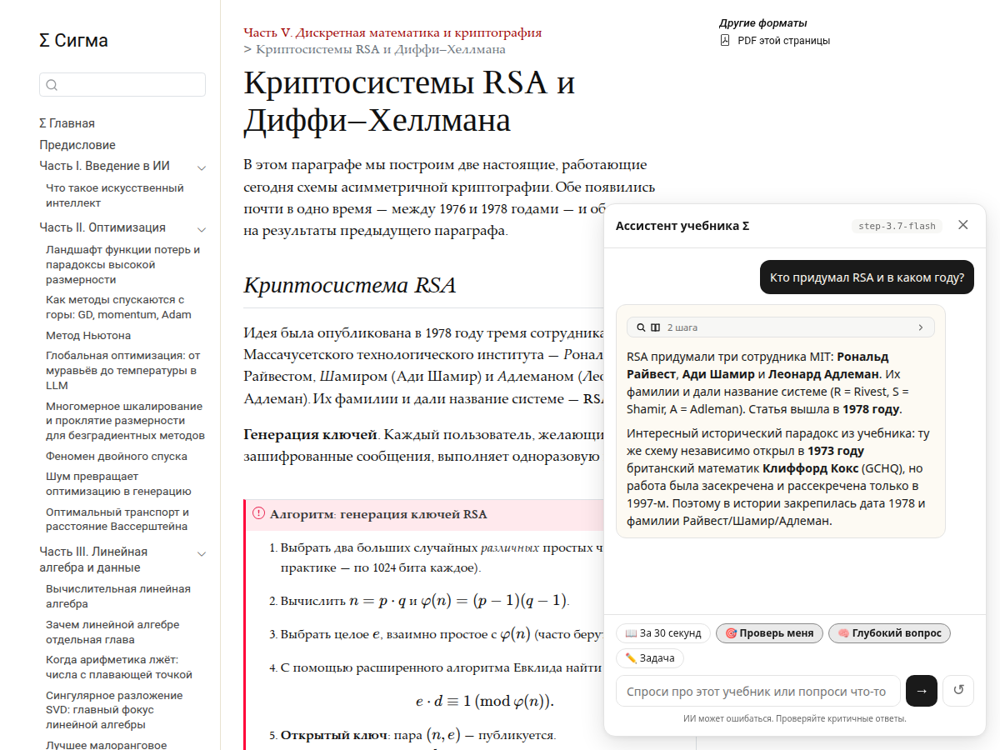

---

### ✅ `greeting_minimal` — out_of_scope

**Q:** Привет!

_Chapter:_ `ch02_newton`

**Tools called:** (none)
**Tools expected:** (none)
**Images:** 0 (expected: no)
**Elapsed:** 6.1s


<details><summary>Answer</summary>


```
Привет! Читаешь про метод Ньютона — отличный выбор. Если что-то непонятно в главе или нужно разобрать конкретный момент — спрашивай.
```

</details>


---

### ✅ `euclid_gcd_python` — compute_pure

**Q:** Посчитай НОД(48, 180) и НОД(1071, 462) через алгоритм Евклида в python.

_Chapter:_ `ch04_1_elementy-teorii-chisel`

**Tools called:** python
**Tools expected:** python
**Images:** 0 (expected: no)
**Elapsed:** 26.6s


<details><summary>Answer</summary>


```
НОД(48, 180) = 12
НОД(1071, 462) = 21

Алгоритм Евклида работает так: на каждом шаге заменяем большее число на остаток от деления на меньшее, пока остаток не станет нулём. Последний ненулевой остаток — это и есть НОД.

Для 48 и 180:

180=48⋅3+36
48=36⋅1+12
36=12⋅3+0 → НОД = 12

Для 1071 и 462:

1071=462⋅2+147
462=147⋅3+21
147=21⋅7+0 → НОД = 21
```

</details>

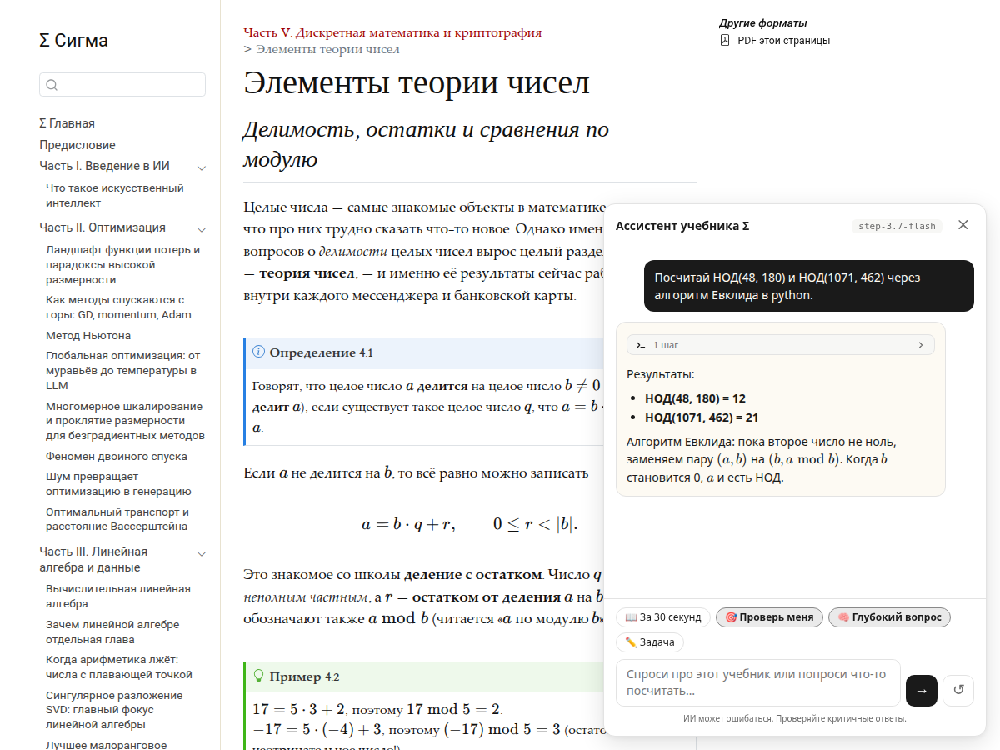

---

### ❌ `definition_superlinear` — definition

**Q:** Что значит сверхлинейная сходимость?

_Chapter:_ `ch02_newton`

**Tools called:** find_definition
**Tools expected:** find_definition
**Images:** 0 (expected: no)
**Elapsed:** 181.6s

_Missing substrings:_ ['lim', '0']

<details><summary>Answer</summary>


```

```

</details>

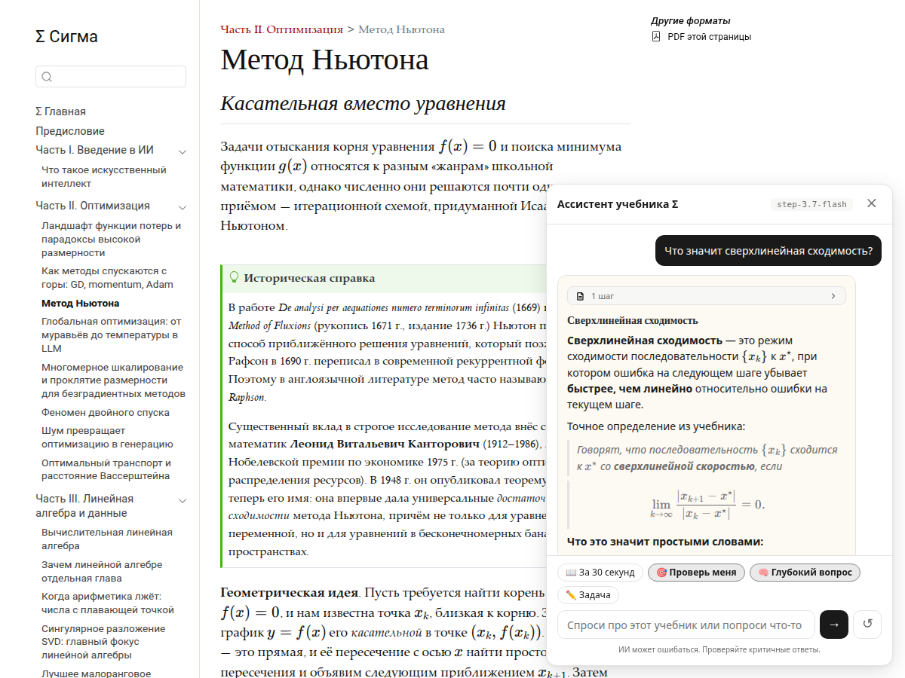

---

### ✅ `theorem_clt` — structural

**Q:** Сформулируй центральную предельную теорему как в учебнике.

_Chapter:_ `ch03_1_prosteyshie-primery-zadach-anali`

**Tools called:** find_theorem
**Tools expected:** find_theorem
**Images:** 0 (expected: no)
**Elapsed:** 11.5s


<details><summary>Answer</summary>


```
Вот формулировка центральной предельной теоремы из учебника (Теорема 3.3):

Пусть X
1
	​

,X
2
	​

,… — независимые одинаково распределённые случайные величины с математическим ожиданием μ и конечной дисперсией σ
2
>0, S
n
	​

=X
1
	​

+⋯+X
n
	​

. Тогда при n→∞

>

Pr(
σ
n
	​

S
n
	​

−nμ
	​

≤x)⟶Φ(x)
=
def
2π
	​

1
	​

∫
−∞
x
	​

e
−t
2
/2
dt

Расшифровка:

X
i
	​

 — одинаково распределённые независимые величины (например, измерения, бросок кубика и т.д.)
μ — их среднее значение, σ
2
 — дисперсия
S
n
	​

 — сумма n таких величин
В числителе стоит центрирование (S
n
	​

−nμ): убираем смещение суммы
В знаменателе σ
n
	​

 — нормировка: делим на стандартное отклонение суммы, которое растёт как 
n
	​

В итоге распределение суммы стремится к стандартному нормальному Φ(x) — колокол Гаусса с нулевым средним и единичной дисперсией

Простыми словами: какая бы ни была исходная закон распределения (если у него есть среднее и дисперсия), сумма многих независимых одинаковых величин почти всегда распределена почти нормально.
```

</details>

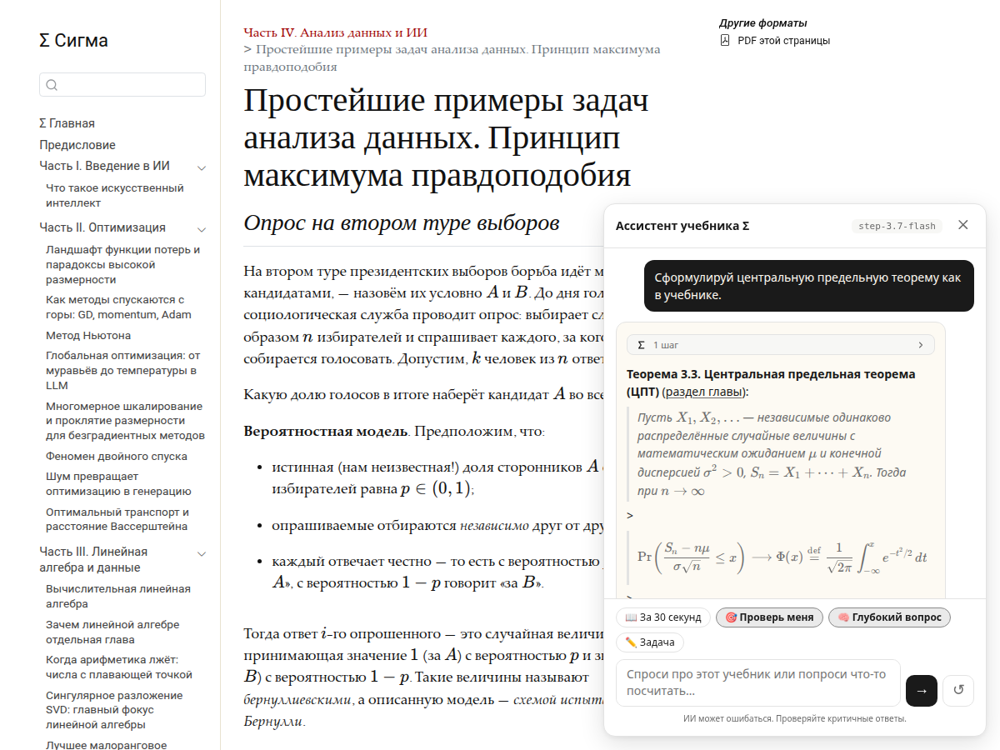

---

### ✅ `plot_sincos_overlay` — compute_plot

**Q:** Построй графики sin(x) и cos(x) на интервале [-2π, 2π] на одном поле. Сделай легенду.

**Tools called:** python
**Tools expected:** python
**Images:** 1 (expected: yes)
**Elapsed:** 30.9s


<details><summary>Answer</summary>


```
График построен! Вот что на нём:

Синяя сплошная линия — sin(x)
Красная пунктирная линия — cos(x)

Обе функции — периодические с периодом 2π≈6.28. На интервале [−2π,2π] каждая из них делает ровно два полных периода.

Ключевые точки:

sin(x)=0 в точках −2π,−π,0,π,2π
cos(x)=1 в точках −2π,0,2π и cos(x)=−1 в точках −π,π
sin(x) сдвинут относительно cos(x) на π/2 влево (или на 90
∘
)

Контрольные значения из расчёта:

sin(−2π)=0.00, sin(0)=0.00, sin(2π)=0.00
cos(−2π)=1.00, cos(0)=1.00, cos(2π)=1.00

График полностью соответствует ожиданиям.
```

</details>

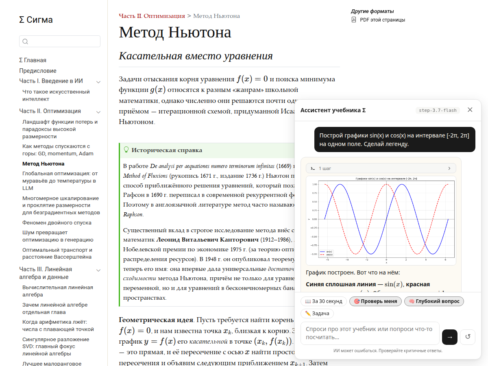

---

### ✅ `fragment_explanation` — rag_basic

**Q:** Если кто-то предлагает использовать обновление x_{k+1} = x_k - f(x_k)·f'(x_k) вместо классического Ньютона — что это за идея и она работает?

_Chapter:_ `ch02_newton`

**Tools called:** read_chapter, python
**Tools expected:** (none)
**Images:** 0 (expected: no)
**Elapsed:** 77.7s


<details><summary>Answer</summary>


```
Это не классический Ньютон, а его «зеркальная» вариация: вместо деления на производную вы её умножаете. Геометрически это значит, что вы не ищете пересечение касательной с осью x, а делаете шаг вдоль касательной на величину f(x
k
	​

)⋅f
′
(x
k
	​

) — что обычно слишком далеко.

Работает ли это?

Иногда — да, но очень редко. Сходимость зависит от значения производной в корне ∣f
′
(x
∗
)∣.

Условие сходимости для такой схемы: ∣f
′
(x
∗
)∣<
2
	​

≈1.41.

Численный эксперимент

Я проверил два примера:

1. f(x)=x
2
−2, корень 
2
	​

≈1.41, f
′
(
2
	​

)=2
2
	​

≈2.83


k=1, x=-6.000000
k=2, x=402.000000
k=3, x=-129927606.000000
k=4, x=4.39×10²¹


Расходится — значения улетают в бесконечность, потому что ∣f
′
(x
∗
)∣=2.83>
2
	​

.

2. f(x)=sin(x), корень 0, f
′
(0)=1


k=1, x=0.545351
k=2, x=0.101875
k=3, x=0.000703
k=4, x=0.000000


Сходится — попал в ноль за 4 шага, потому что ∣f
′
(0)∣=1<
2
	​

.

3. f(x)=x−5, корень 5, f
′
(5)=1


k=1, x=5.000000


Сходится за один шаг (линейная функция — частный случай).

Почему так?

Итерация x
k+1
	​

=x
k
	​

−f(x
k
	​

)f
′
(x
k
	​

) — это отображение T(x)=x−f(x)f
′
(x). В окрестности корня x
∗
 его производная:

T
′
(x
∗
)=1−[f
′
(x
∗
)]
2

Для сходимости нужно ∣T
′
(x
∗
)∣<1, откуда ∣f
′
(x
∗
)∣<
2
	​

.

Вывод: предложенная схема — не стандартный метод Ньютона. Она работает только если производная в корне по модулю меньше 
2
	​

 (примерно 1.41). Для большинства уравнений (в том числе x
2
−2, где ∣f
′
∣≈2.83) она расходится. Классиче
…[truncated]
```

</details>

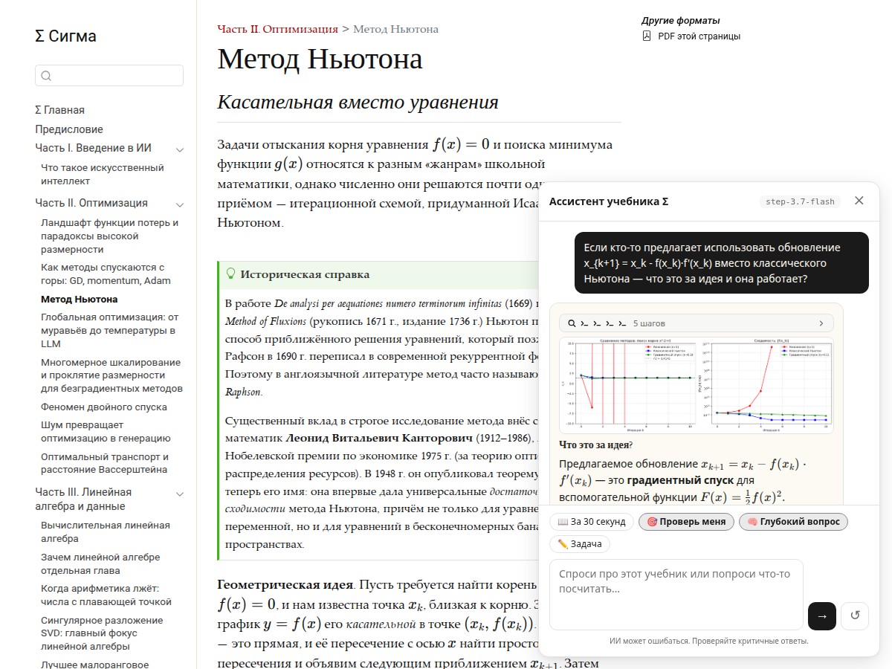

---

### ❌ `eigenvalues_numpy` — compute_pure

**Q:** Найди собственные значения матрицы [[2, 1], [1, 2]] через numpy.

_Chapter:_ `ch_linalg`

**Tools called:** python
**Tools expected:** python
**Images:** 0 (expected: no)
**Elapsed:** 180.5s

_Missing substrings:_ ['3', '1']

<details><summary>Answer</summary>


```

```

</details>

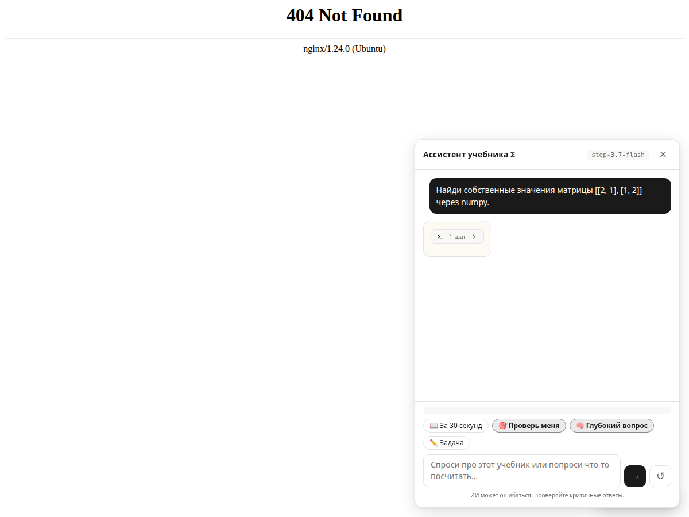

---

### ✅ `plot_loss_landscape` — compute_plot

**Q:** Построй контурный график функции потерь L(a, b) = sum((a*x_i + b - y_i)^2) для точек (1,2), (2,3), (3,5), (4,4) на сетке a in [-2, 4], b in [-3, 3].

_Chapter:_ `ch03_2_lineynaya-regressiya-i-metod-nai`

**Tools called:** python
**Tools expected:** python
**Images:** 1 (expected: yes)
**Elapsed:** 44.3s


<details><summary>Answer</summary>


```
Вот контурный график функции потерь L(a,b)=∑
i=1
4
	​

(ax
i
	​

+b−y
i
	​

)
2
 для ваших точек:

Ключевые числа:

Оптимальные параметры: a=0.80, b=1.50
Минимальное значение функции потерь: L
min
	​

=1.80

Что показывает график:

Выпуклая форма — контуры представляют собой эллипсы (на сетке выглядят как наклонные параллельные линии), что подтверждает: функция потерь является квадратичной формой и имеет единственный минимум. Это типично для метода наименьших квадратов.
Расположение минимума — красная точка в районе (a,b)≈(0.8,1.5) — это глобальный минимум, найденный аналитически через нормальные уравнения.
Градиент — контуры плотнее (резче меняется цвет) в области малых значений L, что соответствует более крутым склонам параболоида. При удалении от минимума функция растёт быстрее по направлению, перпендикулярному оси минимума.
Сетка — диапазоны a∈[−2,4] и b∈[−3,3] покрывают область вокруг оптимума, где функция принимает значения от 0 до >500.

Такая визуализация полезна для понимания, как метод градиентного спуска будет двигаться к точке (0.8,1.5): траектория будет стремиться к центру этих контуров, а форма контуров показывает, что сечение функции — это параbola (квадратичная функция), что гарантирует сходимость градиентного метода с постоянным шагом при достаточно малом η.
```

</details>

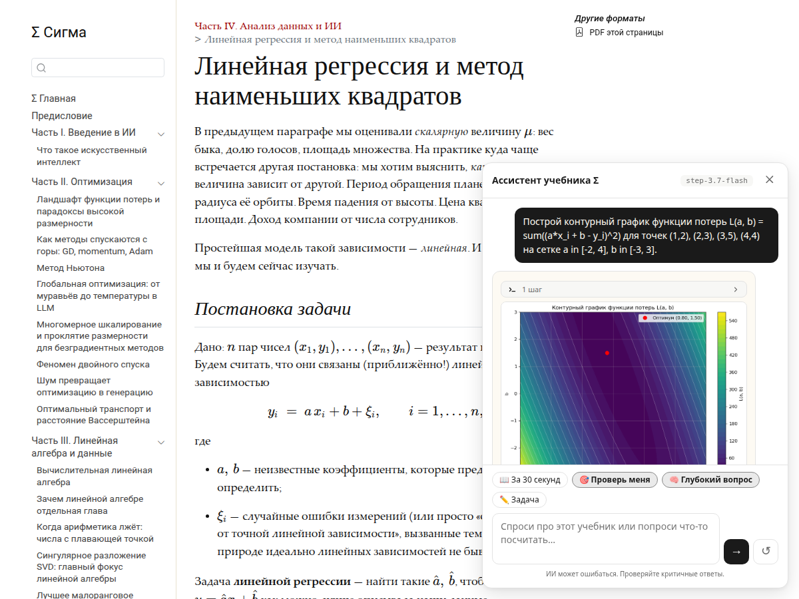

---

### ❌ `diffie_hellman_compute` — compute_pure

**Q:** Проведи протокол Диффи–Хеллмана: p=23, g=5. Алиса берёт a=6, Боб берёт b=15. Какой общий секрет?

_Chapter:_ `ch04_3_kriptosistemy-rsa-i-diffi-hellma`

**Tools called:** search_textbook, read_chapter, python
**Tools expected:** python
**Images:** 0 (expected: no)
**Elapsed:** 181.0s

_Missing substrings:_ ['2']

<details><summary>Answer</summary>


```

```

</details>

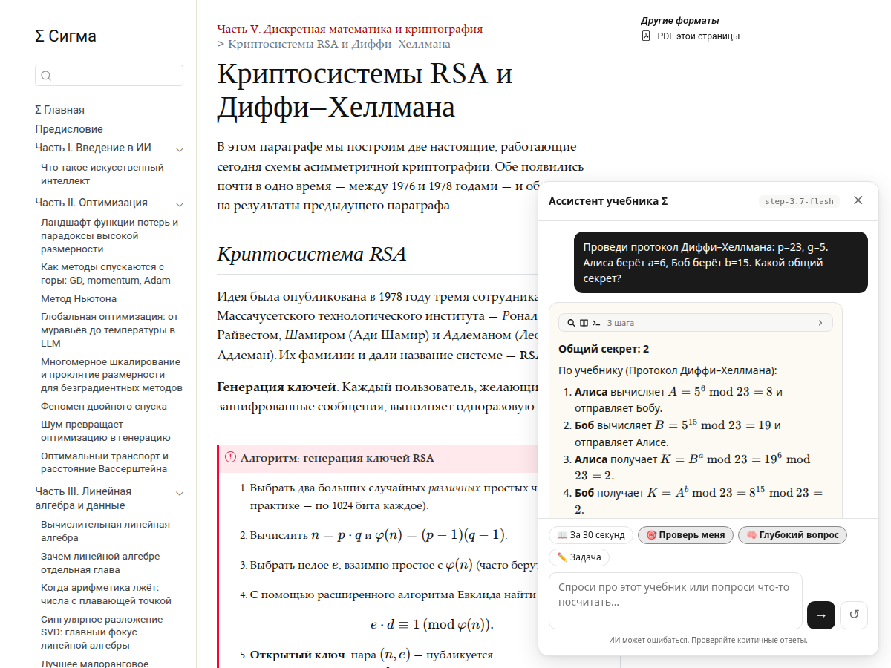

---

### ✅ `outline_chapter` — structural

**Q:** Перечисли основные разделы главы про Ньютона.

_Chapter:_ `ch02_newton`

**Tools called:** read_chapter
**Tools expected:** (none)
**Images:** 0 (expected: no)
**Elapsed:** 12.4s


<details><summary>Answer</summary>


```
Вот основные разделы главы:

Касательная вместо уравнения — геометрическая идея метода, итерационная формула Ньютона (2.1), историческая справка (Ньютон, Рафсон, Канторович).
Ньютон для оптимизации — применение к поиску минимума через уравнение g
′
(x)=0, вывод формулы (2.2) через ряд Тейлора и квадратичную модель q
k
	​

(x).
Квадратный корень за пять шагов — метод Герона (вавилонский метод) как частный случай Ньютона для f(x)=x
2
−a, формула (2.4), оценка сходимости (2.5) и доказательство через сжимающее отображение.
```

</details>

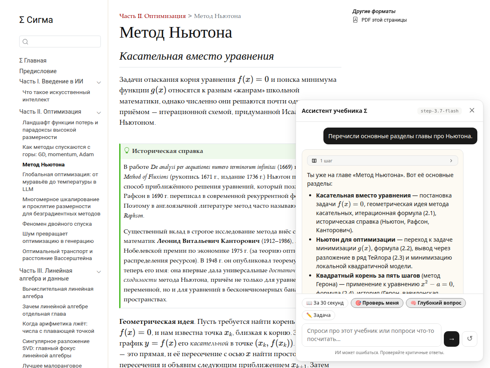

---

### ✅ `math_latex_derivation` — rag_basic

**Q:** Выведи формулу метода Ньютона через касательную. Формулу запиши через LaTeX.

_Chapter:_ `ch02_newton`

**Tools called:** find_definition, read_chapter
**Tools expected:** (none)
**Images:** 0 (expected: no)
**Elapsed:** 18.1s


<details><summary>Answer</summary>


```
Ты уже на главе «Метод Ньютона» (§ «Касательная вместо уравнения»). Вот вывод формулы прямо из учебника.

Шаг 1. Уравнение касательной к графику y=f(x) в точке x
k
	​

:

y=f(x
k
	​

)+f
′
(x
k
	​

)(x−x
k
	​

)

Шаг 2. Нас интересует пересечение этой касательной с осью x, то есть полагаем y=0 и выражаем x:

0=f(x
k
	​

)+f
′
(x
k
	​

)(x−x
k
	​

)

Шаг 3. Отсюда:

x=x
k
	​

−
f
′
(x
k
	​

)
f(x
k
	​

)
	​


Это и есть итерационная формула Ньютона (метод касательных):

x
k+1
	​

=x
k
	​

−
f
′
(x
k
	​

)
f(x
k
	​

)
	​

	​

,k=0,1,2,…

Начальное приближение x
0
	​

 выбирает исследователь; от него зависит, сойдётся ли метод.
```

</details>

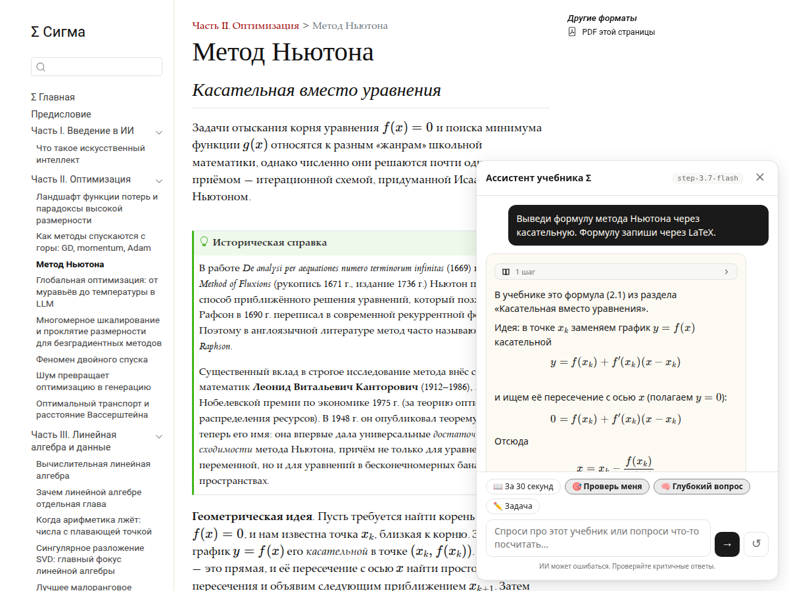

---

### ✅ `definition_perceptron` — definition

**Q:** Что такое полносвязная нейронная сеть?

_Chapter:_ `ch03_3_zadacha-klassifikacii-i-neyronny`

**Tools called:** find_definition
**Tools expected:** find_definition
**Images:** 0 (expected: no)
**Elapsed:** 20.5s


<details><summary>Answer</summary>


```
Ты уже на этой главе, так что давай сразу по делу.

Полносвязная нейронная сеть (MLP) глубины L — это функция x↦p(x), заданная как композиция L слоёв (Определение 3.12):

Вход: a
(0)
=x
Скрытые слои (ℓ=1,…,L−1):

z
(ℓ)
=W
(ℓ)
a
(ℓ−1)
+b
(ℓ)
,a
(ℓ)
=σ(z
(ℓ)
)

Последний слой:

z
(L)
=W
(L)
a
(L−1)
+b
(L)
,p(x)=softmax(z
(L)
)

Что здесь где:

W
(ℓ)
 — матрица весов ℓ-го слоя, b
(ℓ)
 — вектор смещений (bias)
σ — функция активации, применяется покомпонентно
d
1
	​

,…,d
L−1
	​

 — ширины скрытых слоёв, d
L
	​

 — число классов
softmax превращает вектор чисел в распределение вероятностей: softmax(z)
c
	​

=
∑
c
′
	​

e
z
c
′
	​

e
z
c
	​

	​


Все матрицы W
(ℓ)
 и векторы b
(ℓ)
 вместе образуют обучаемые параметры θ модели.
```

</details>

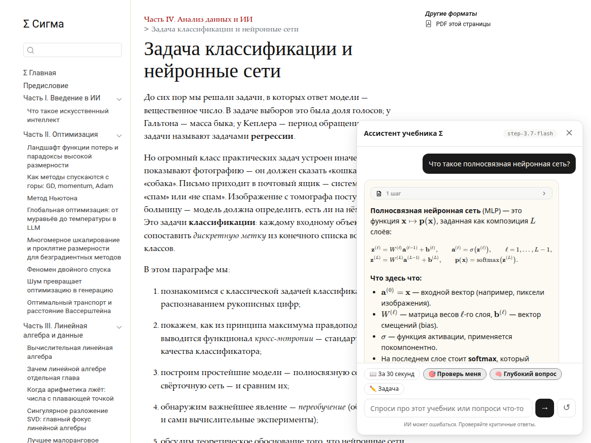

---
