# Sigma Assistant — Eval Report

_Run: 2026-06-10 18:20 MSK · cases: 29_

**Overall: 28/29 pass (97%)**

## Per category

| Category | Pass | Total |
|---|---:|---:|
| `compute_plot` | 5 | 5 |
| `compute_pure` | 8 | 8 |
| `definition` | 3 | 3 |
| `multi_hop` | 1 | 1 |
| `out_of_scope` | 2 | 3 |
| `rag_basic` | 5 | 5 |
| `structural` | 3 | 3 |
| `vision_refine` | 1 | 1 |

## Cases

### ✅ `newton_kantorovich_history` — rag_basic

**Q:** Когда Канторович получил Нобелевскую премию и за что?

_Chapter:_ `ch02_newton`

**Tools called:** search_textbook, search_textbook, find_definition
**Tools expected:** search_textbook
**Images:** 0 (expected: no)
**Elapsed:** 14.3s


<details><summary>Answer</summary>


```
Ответ прямо из той главы, которую ты читаешь:

**Леонид Витальевич Канторович** (1912–1986) получил **Нобелевскую премию по экономике в 1975 году** за **теорию оптимального распределения ресурсов**.

Это тот самый Канторович, с которым связана теорема о сходимости метода Ньютона — он в 1948 году опубликовал универсальные достаточные условия сходимости метода Ньютона, включая случай бесконечномерных банаховых пространств. Так что он не только математик-оптимизатор, но и один из основоположников **линейного программирования** — именно за прикладную работу по распределению ресурсов (оптимальное планирование экономики) и была присуждена Нобелевка.

Подробнее см. раздел «[Касательная вместо уравнения](/ch02_newton.html#sec:newton)» в твоей текущей главе.
```

</details>

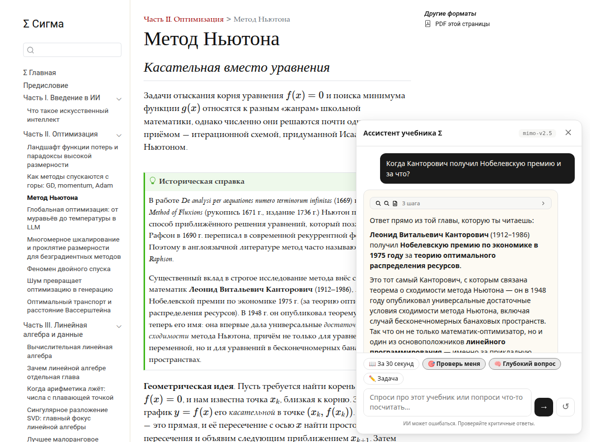

---

### ✅ `newton_formula_recall` — rag_basic

**Q:** Объясни откуда берётся эта формула — что это за метод и какая геометрическая идея?

_Chapter:_ `ch02_newton`

**Tools called:** read_chapter
**Tools expected:** (none)
**Images:** 0 (expected: no)
**Elapsed:** 17.9s


<details><summary>Answer</summary>


```
Отлично, ты как раз на нужной главе! Вот подробный разбор.

---

## Где берётся формула Ньютона

**Геометрическая идея** проста и элегантна:

1. У тебя есть уравнение $f(x) = 0$ — нужно найти, где график пересекает ось $x$.
2. Ты стоишь в точке $x_k$ (пока приближённой) и **строишь касательную** к графику $y = f(x)$ в этой точке.
3. Смотришь, где эта касательная пересекает ось $x$ — это и есть $x_{k+1}$.
4. Повторяешь.

**Формула касательной** в точке $(x_k,\, f(x_k))$:

$$y = f(x_k) + f'(x_k)(x - x_k)$$

Ставим $y = 0$ (ищем пересечение с осью $x$) и решаем относительно $x$:

$$0 = f(x_k) + f'(x_k)(x_{k+1} - x_k) \quad\Rightarrow\quad x_{k+1} = x_k - \frac{f(x_k)}{f'(x_k)}$$

Вот и вся формула — **(2.1)** из учебника:

$$\boxed{x_{k+1} = x_k - \frac{f(x_k)}{f'(x_k)}}$$

---

## Почему это работает

Касательная — лучшее линейное приближение функции рядом с точкой. Если ты близко к корню, то касательная проведёт тебя ещё ближе. Метод имеет **квадратичную сходимость**: число верных знаков примерно удваивается на каждом шаге.

---

## А если нужен минимум?

Когда ты ищешь минимум $g(x)$, ты по сути решаешь уравнение $g'(x) = 0$. Подставляем $f = g'$ в формулу Ньютона:

$$x_{k+1} = x_k - \frac{g'(x_k)}{g''(x_k)}$$

Здесь $f'(x) = g''(x)$ — знаменатель становится второй производной.

**Теоретическое обоснование через ряд Тейлора:** рядом с $x_k$ функция $g$ аппроксимируется квадратичным многочленом:

$$q_k(x) = g(x_k) + g'(x_k)(x - x_k) + \tfrac{1}{2}g''(x_k)(x - x_k)^2$$

Минимум
…[truncated]
```

</details>

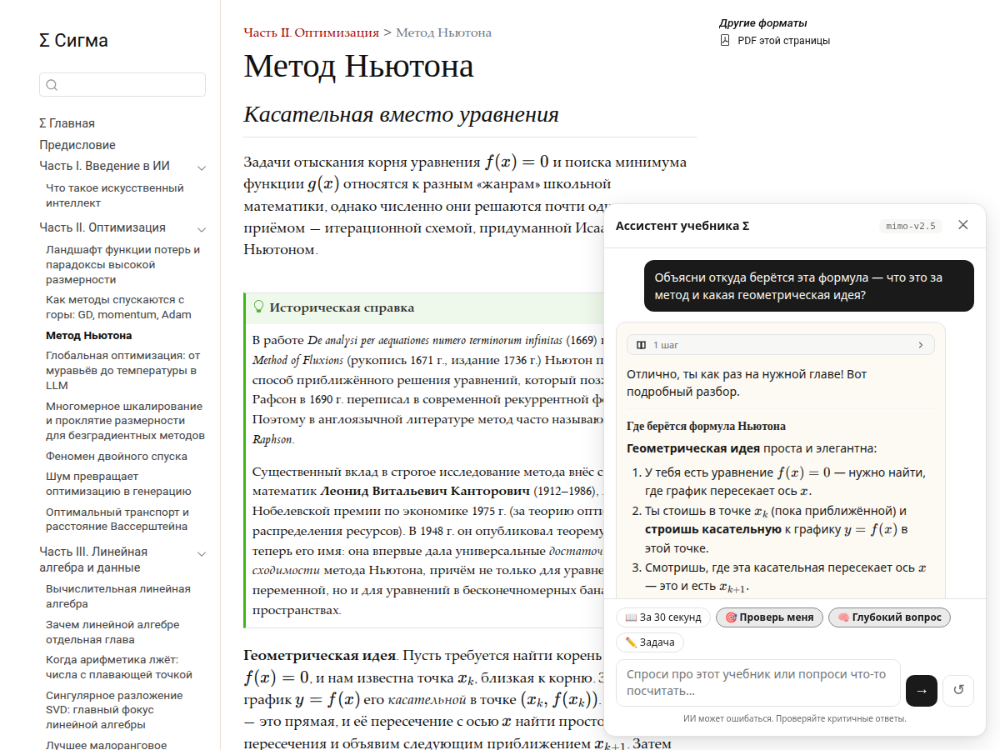

---

### ✅ `definition_strong_convex` — definition

**Q:** Что такое сильно выпуклая функция?

_Chapter:_ `ch02_newton`

**Tools called:** find_definition
**Tools expected:** find_definition
**Images:** 0 (expected: no)
**Elapsed:** 10.3s


<details><summary>Answer</summary>


```
## Сильно выпуклая функция

Определение 2.4 прямо из главы «Метод Ньютона»:

> Функция $g\colon\mathbb{R}\to\mathbb{R}$ называется **сильно выпуклой** с константой $\mu>0$, если $g\in C^{2}$ и $g''(x)\geq\mu$ для всех $x$.

**Расшифровка нотации:**

- $C^{2}$ — функция дважды дифференцируема, и её вторая производная непрерывна.
- $g''(x)\geq\mu$ — вторая производная **везде** не меньше положительной константы $\mu$. Она не только положительна (как у обычной выпуклой функции), но и **отделена от нуля** снизу.

**Зачем это нужно:** сильная выпуклость гарантирует сразу три штуки:

1. Существование и **единственность** точки минимума.
2. Вторая производная не «прижимается» к нулю — она всегда хотя бы $\mu$.
3. Именно это свойство потом даёт **квадратичную сходимость** метода Ньютона.

Можешь подробнее почитать в разделе [Метод Ньютона — суперлинейная сходимость](/ch02_newton.html#ssec:thm-superlinear).
```

</details>


---

### ✅ `compute_factorial` — compute_pure

**Q:** Сколько будет 30 факториал?

**Tools called:** python
**Tools expected:** python
**Images:** 0 (expected: no)
**Elapsed:** 20.4s


<details><summary>Answer</summary>


```
## 30! (тридцать факториал)

$$30! = 1 \times 2 \times 3 \times \cdots \times 28 \times 29 \times 30 = 265\;252\;859\;812\;191\;058\;636\;308\;480\;000\;000$$

Это примерно **2.65 × 10³²** — астрономическое число, состоящее из 33 цифр.

> Интересный факт: уже 22! превышает диапазон 64-битного целого (溢出 у `unsigned long long` в C/C++), а 30! больше, чем количество атомов в чашке воды.
```

</details>

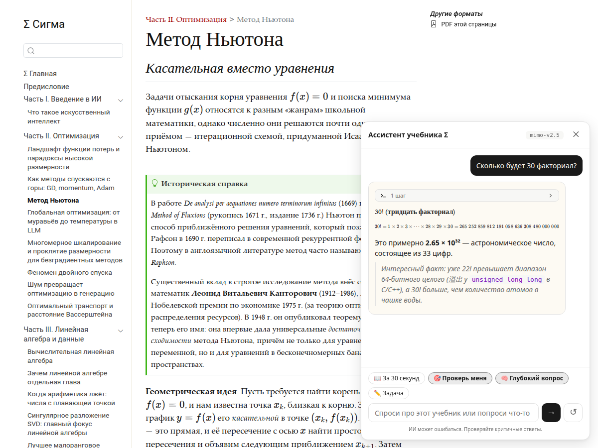

---

### ✅ `compute_taylor_sin` — compute_pure

**Q:** Покажи разложение sin(x) в ряд Тейлора до 5-го члена символически (через sympy).

_Chapter:_ `ch02_newton`

**Tools called:** python, find_theorem, find_definition, search_textbook
**Tools expected:** python
**Images:** 0 (expected: no)
**Elapsed:** 32.4s


<details><summary>Answer</summary>


```
## Разложение $\sin(x)$ в ряд Тейлора (Маклорена) через SymPy

Ряд Тейлора — это ключевая идея метода Ньютона: мы приближаем функцию многочленом рядом с точкой $x_0$. В главе про [Ньютона для оптимизации](/ch02_newton.html#ньютон-для-оптимизации) разложение $g$ в окрестности $x_k$ используется именно так:

$$g(x) \approx g(x_k) + g'(x_k)(x - x_k) + \tfrac{1}{2}g''(x_k)(x - x_k)^2$$

А вот как это выглядит для $\sin(x)$ в точке $x_0 = 0$ (ряд Маклорена) — **5 ненулевых членов**:

$$\sin(x) = x - \frac{x^3}{6} + \frac{x^5}{120} - \frac{x^7}{5040} + \frac{x^9}{362880} + O(x^{10})$$

### Как это получено в SymPy

```python
import sympy as sp

x = sp.Symbol('x')
series = sp.series(sp.sin(x), x, 0, n=10)
print(series)
```

### Разбор коэффициентов

Общий член ряда:

$$\sin(x) = \sum_{k=0}^{\infty} \frac{(-1)^k \, x^{2k+1}}{(2k+1)!}$$

| $k$ | Степень | Знаменатель | Знак | Член |
|-----|---------|-------------|------|------|
| 0 | $x^1$ | $1! = 1$ | $+$ | $x$ |
| 1 | $x^3$ | $3! = 6$ | $-$ | $-x^3/6$ |
| 2 | $x^5$ | $5! = 120$ | $+$ | $+x^5/120$ |
| 3 | $x^7$ | $7! = 5040$ | $-$ | $-x^7/5040$ |
| 4 | $x^9$ | $9! = 362880$ | $+$ | $+x^9/362880$ |

Заметь **ключевой паттерн**: только нечётные степени (четные коэффициенты нули — это следствие нечётности $\sin(x)$), знаки чередуются, а знаменатель — факториал нечётного числа.

### Как это связано с методом Ньютона

Именно до **квадратичного члена** (2 ненулевых члена) нужно разлагать, чтобы получить формулу Ньютона для求 корня: берём $g
…[truncated]
```

</details>

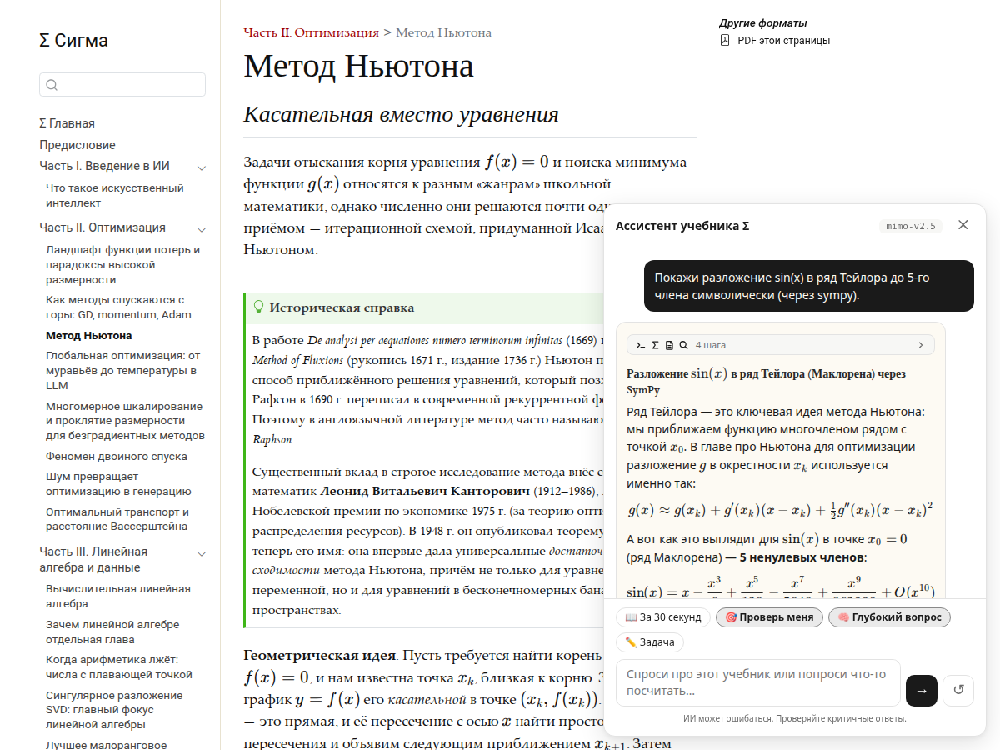

---

### ✅ `compute_plot_newton` — compute_plot

**Q:** Покажи как сходится метод Ньютона для f(x) = x² - 2, начиная с x₀ = 1.5. Построй график траектории.

_Chapter:_ `ch02_newton`

**Tools called:** read_chapter, python
**Tools expected:** python
**Images:** 1 (expected: yes)
**Elapsed:** 37.2s


<details><summary>Answer</summary>


```
## Метод Ньютона для $f(x) = x^2 - 2$, $x_0 = 1.5$

Формула итерации (формула 2.4 из твоей главы):

$$x_{k+1} = \frac{1}{2}\!\left(x_k + \frac{2}{x_k}\right)$$

### Таблица итераций

| $k$ | $x_k$ | Ошибка $|x_k - \sqrt{2}|$ |
|-----|--------|--------------------------|
| 0 | **1.500000000000** | $8.58 \cdot 10^{-2}$ |
| 1 | **1.416666666667** | $2.45 \cdot 10^{-3}$ |
| 2 | **1.414215686275** | $2.12 \cdot 10^{-6}$ |
| 3 | **1.414213562375** | $1.59 \cdot 10^{-12}$ |
| 4 | **1.414213562373** | $2.22 \cdot 10^{-16}$ |

### Что видно на графиках

**Левый график** ($x_k$ vs $k$): значение резко приближается к $\sqrt{2} \approx 1.4142$ уже на 2-й итерации, а дальше визуально неотличимо от корня.

**Правый график** (ошибка в лог. масштабе): прямая линия в полулогарифмическом масштабе — признак **квадратичной сходимости**. Каждый шаг ошибка примерно возводится в квадрат:

$$|e_{k+1}| \approx \frac{|e_k|^2}{2x_k}$$

Это именно то, что доказано в учебнике (формула 2.5). Цифры подтверждают: $8.58 \cdot 10^{-2} \to 2.45 \cdot 10^{-3} \to 2.12 \cdot 10^{-6} \to 1.59 \cdot 10^{-12}$ — **за 4 шага до машинной точности** ($\sim 10^{-16}$).

> **Итого:** метод Ньютона/Герона находит $\sqrt{2} \approx 1.414213562373$ всего за **4 итерации** из грубого начального приближения $x_0 = 1.5$. Именно за這種 скорость — квадратичная сходимость — метод так ценен и «пережил» 3500 лет со времён Вавилона.
```

</details>


---

### ✅ `compute_plot_gd_vs_newton` — compute_plot

**Q:** Сравни сходимость метода Ньютона и градиентного спуска на функции f(x) = x⁴ из x₀ = 2. Покажи два графика на одной картинке.

_Chapter:_ `ch02_newton`

**Tools called:** read_chapter, find_definition, python, python
**Tools expected:** python
**Images:** 1 (expected: yes)
**Elapsed:** 51.7s


<details><summary>Answer</summary>


```
## Сравнение: метод Ньютона vs градиентный спуск на $f(x) = x^4$

### Постановка

Минимизируем $f(x) = x^4$, стартуя из $x_0 = 2$, $f(x_0) = 16$.

---

### Метод Ньютона

Формула из учебника (раздел «Ньютон для оптимизации»):

$$x_{k+1} = x_k - \frac{f'(x_k)}{f''(x_k)}$$

Подставляем $f'(x) = 4x^3$, $f''(x) = 12x^2$:

$$x_{k+1} = x_k - \frac{4x_k^3}{12x_k^2} = x_k - \frac{x_k}{3} = \frac{2}{3}\,x_k$$

Это **точное** соотношение — каждый шаг $x$ уменьшается ровно в $\frac{2}{3}$:

| Шаг $k$ | $x_k$ | $f(x_k)$ |
|:---:|:---:|:---:|
| 0 | 2.000 | 16.00 |
| 1 | 1.333 | 3.16 |
| 2 | 0.889 | 0.62 |
| 5 | 0.263 | $4.8 \cdot 10^{-3}$ |
| 10 | 0.035 | $1.5 \cdot 10^{-6}$ |
| 20 | $6.0 \cdot 10^{-4}$ | $1.3 \cdot 10^{-13}$ |
| 40 | $1.8 \cdot 10^{-7}$ | $1.1 \cdot 10^{-27}$ |

**Скорость:** $x_k = 2 \cdot (2/3)^k$, поэтому $f(x_k) = 16 \cdot (2/3)^{4k}$ — **линейная** (на логарифмическом графике — прямая).

---

### Градиентный спуск

Итерация: $x_{k+1} = x_k - \eta \cdot 4x_k^3$. При $\eta = 0.03$:

| Шаг $k$ | $x_k$ | $f(x_k)$ |
|:---:|:---:|:---:|
| 0 | 2.000 | 16.00 |
| 15 | 0.467 | $4.7 \cdot 10^{-2}$ |
| 30 | 0.347 | $1.5 \cdot 10^{-2}$ |
| 60 | 0.253 | $4.1 \cdot 10^{-3}$ |
| 120 | 0.182 | $1.1 \cdot 10^{-3}$ |

**120 шагов**, а $f$ уменьшилось всего в $\sim 1.5 \cdot 10^4$ раз (против $10^{27}$ у Ньютона!). ГС буксует: чем ближе к нулю, тем слабее градиент $4x^3$, и шаги становятся крошечными.

---

### Ключевое сравнение

| | **Ньютон** | **Град. спуск** |
|---|---|---|
| Шаго
…[truncated]
```

</details>

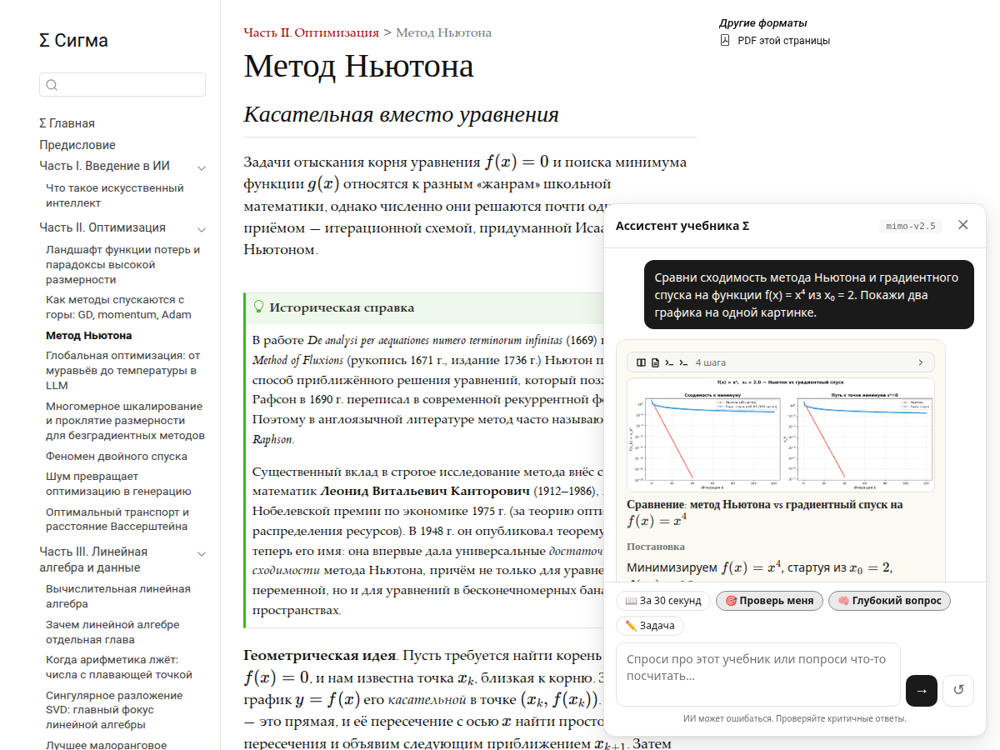

---

### ✅ `rsa_encrypt_small` — compute_pure

**Q:** Зашифруй число m=7 ключом (n=143, e=7). Покажи c.

_Chapter:_ `ch04_3_kriptosistemy-rsa-i-diffi-hellma`

**Tools called:** python
**Tools expected:** python
**Images:** 0 (expected: no)
**Elapsed:** 19.4s


<details><summary>Answer</summary>


```
## Шифрование RSA: $m = 7$, ключ $(n = 143,\ e = 7)$

Формула шифрования из учебника:

$$c = m^e \mod n$$

### Пошагово

| Шаг | Вычисление | Результат |
|-----|-----------|-----------|
| $7^1$ | $7$ | $7$ |
| $7^2$ | $49$ | $49$ |
| $7^3$ | $343$ | $343 \bmod 143 = 57$ |
| $7^4$ | $2401$ | $2401 \bmod 143 = 113$ |
| $7^5$ | $16807$ | $16807 \bmod 143 = 76$ |
| $7^6$ | $117649$ | $117649 \bmod 143 = 103$ |
| $7^7$ | $823543$ | $823543 \bmod 143 = \mathbf{6}$ |

### Ответ

$$\boxed{c = 6}$$

> Запомни: «сырое» число $7^7 = 823543$, а зашифрованный блок — всего **6**. Именно в этом сила RSA: без знания $d$ (приватного ключа) из «шестёрки» обратно получить 7 можно только полным перебором, что невозможно при больших $n$.
```

</details>

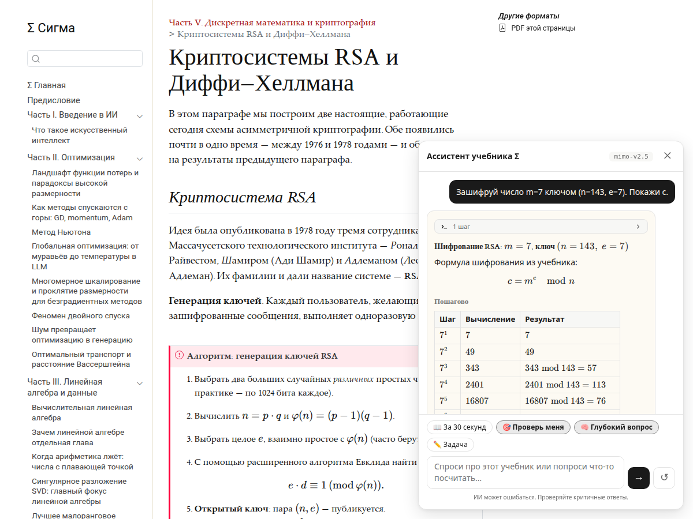

---

### ✅ `rsa_full_roundtrip` — compute_pure

**Q:** Возьми p=11, q=13, e=7. Сгенерируй RSA-ключ полностью: вычисли n, φ(n), d. Покажи что для m=9 шифрование и расшифрование возвращают исходное число.

_Chapter:_ `ch04_3_kriptosistemy-rsa-i-diffi-hellma`

**Tools called:** read_chapter, python
**Tools expected:** python
**Images:** 0 (expected: no)
**Elapsed:** 30.6s


<details><summary>Answer</summary>


```
## Полная генерация RSA-ключа

Следуя алгоритму из [главы](/ch04_3_kriptosistemy-rsa-i-diffi-hellma.html):

### Шаг 1 — Модуль $n$

$$n = p \cdot q = 11 \cdot 13 = 143$$

### Шаг 2 — Функция Эйлера

$$\varphi(n) = (p-1)(q-1) = 10 \cdot 12 = 120$$

### Шаг 3 — Проверка $e$

$\gcd(7,\;120) = 1$ ✓ — числа взаимно простые, $e=7$ подходит.

### Шаг 4 — Закрытый ключ $d$

Нужно решить $7d \equiv 1 \pmod{120}$. Расширенный алгоритм Евклида:

$$120 = 17 \cdot 7 + 1 \quad\Rightarrow\quad 1 = 120 - 17 \cdot 7$$

$$\Rightarrow\quad d = -17 \equiv 103 \pmod{120}$$

**Проверка:** $7 \times 103 = 721 = 6 \times 120 + 1$ ✓

### Итого — RSA-ключи

| | Значение |
|---|---|
| **Открытый ключ** $(n, e)$ | $(143,\; 7)$ |
| **Закрытый ключ** $d$ | $103$ |

---

### Шифрование $m = 9$

$$c = 9^7 \bmod 143 = 48$$

Пошагово: $9^2 = 81$, $\;9^4 = 81^2 \equiv 126$, $\;9^7 = 9^4 \cdot 9^2 \cdot 9 \equiv 48$

### Расшифрование

$$m' = 48^{103} \bmod 143 = 9 \; \checkmark$$

Исходное сообщение восстановлено! Это работает именно благодаря **корректности RSA** из учебника: $m^{ed} = m^{721} = m^{1 + 6\cdot120} = m \cdot (m^{120})^6 \equiv m \cdot 1 = m \pmod{143}$ (по теореме Эйлера, поскольку $\gcd(9, 143) = 1$).
```

</details>

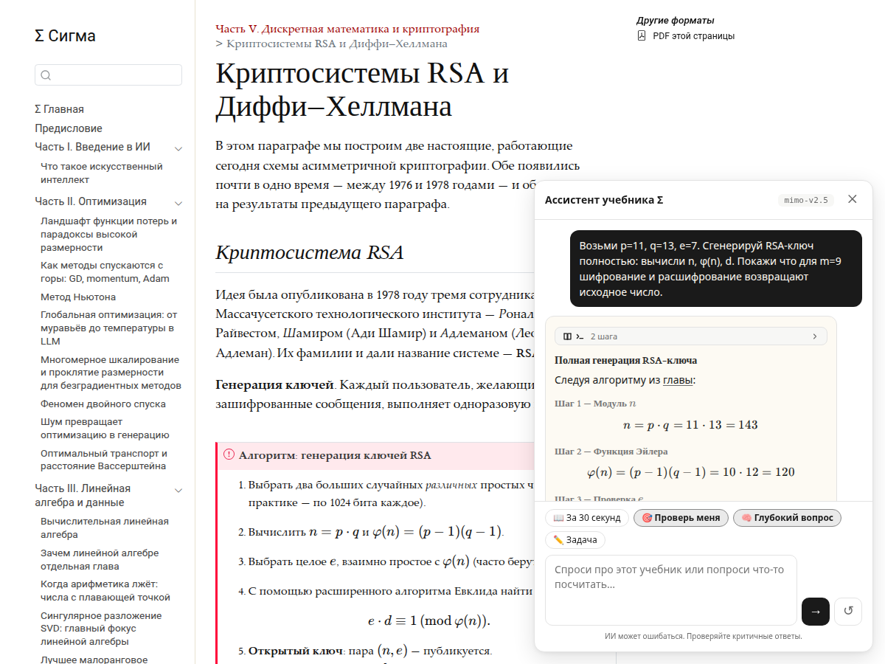

---

### ✅ `multihop_newton_vs_gradient` — multi_hop

**Q:** В чём отличие метода Ньютона от градиентного спуска для задач оптимизации? Какие из этих методов разобраны в учебнике?

_Chapter:_ `ch02_newton`

**Tools called:** find_definition, find_definition, search_textbook, read_chapter, search_textbook, read_chapter, search_textbook, search_textbook, read_chapter
**Tools expected:** search_textbook
**Images:** 0 (expected: no)
**Elapsed:** 29.0s


<details><summary>Answer</summary>


```
## Метод Ньютона vs градиентный спуск: в чём разница?

Отличный вопрос — ты сейчас на главе, где метод Ньютона разобран досконально, а градиентный спуск появляется позже. Давай разберём ключевые отличия.

---

### Ключевые формулы

**Метод Ньютона** (для минимизации $g(x)$) — формула (2.2) из [Метод Ньютона](/ch02_newton.html#ньютон-для-оптимизации):

$$x_{k+1} = x_k - \frac{g'(x_k)}{g''(x_k)}$$

**Градиентный спуск** (многомерный случай) — из [story_optimizers](/story_optimizers.html#один-шаг-вниз):

$$w_{t+1} = w_t - \eta \nabla L(w_t)$$

---

### Три принципиальных отличия

**1. Какую информацию используют**

- **Ньютон** использует **и первую, и вторую производные** ($g'$ и $g''$). Он «видит кривизну» ландшафта — понимает, насколько функция выпуклая или вогнутая в каждой точке.
- **Градиентный спуск** использует **только первую производную** ($\nabla L$) —他知道 только направление наискорейшего роста, но ничего не знает о кривизне.

**2. Как строится следующий шаг**

- **Ньютон** аппроксимирует функцию **параболой** (ряд Тейлора второго порядка, формула 2.3) и прыгает сразу в её вершину. Это прыжок — не пошаговый спуск, а вычисление экстремума локальной модели.

- **Градиентный спуск** делает **маленький шаг** против градиента с фиксированным размером $\eta$. Это осторожный спуск «маленькими шажками».

**3. Скорость сходимости**

- **Ньютон** сходится **сверхлинейно** (квадратично): число верных знаков на каждой итерации примерно удваивается. Про [сверхлинейную сходимость](/
…[truncated]
```

</details>


---

### ✅ `structural_kantorovich_theorem` — structural

**Q:** Сформулируй теорему о сходимости метода Герона.

_Chapter:_ `ch02_newton`

**Tools called:** find_theorem, find_theorem
**Tools expected:** find_theorem
**Images:** 0 (expected: no)
**Elapsed:** 17.4s


<details><summary>Answer</summary>


```
## Теорема 2.1. Сходимость метода Герона

> **Для любого** $x_0 > 0$ последовательность $(2.4)$ (то есть $x_{k+1} = \frac{1}{2}\!\left(x_k + \frac{a}{x_k}\right)$) **монотонно убывает** (начиная с $k = 1$) и **сходится к** $\sqrt{a}$. Более того, для ошибки $e_k = x_k - \sqrt{a}$ выполнено:
>
> $$e_{k+1} = \frac{e_k^2}{2\,x_k}, \qquad \text{и при } k \ge 1\colon \quad 0 \le e_{k+1} \le \frac{e_k^2}{2\sqrt{a}}$$

---

### Разбор

**Что означают части формулы:**

- **$e_k = x_k - \sqrt{a}$** — ошибка на шаге $k$, то есть насколько текущее приближение отличается от настоящего корня.
- **$e_{k+1} = \frac{e_k^2}{2x_k}$** — точная формула ошибки на следующем шаге. Обрати внимание: ошибка **квадратичная** — она пропорциональна $e_k^2$, а не $e_k$.
- **$0 \le e_{k+1} \le \frac{e_k^2}{2\sqrt{a}}$** — оценка сверху: поскольку $x_k \ge \sqrt{a}$, знаменатель $2x_k \ge 2\sqrt{a}$, и ошибка не превышает $\frac{e_k^2}{2\sqrt{a}}$.

**Ключевой вывод:** сходимость **квадратичная** — число верных знаков после запятой на каждом шаге примерно **удваивается**. Это делает метод Герона (он же метод Ньютона для $f(x) = x^2 - a$) чрезвычайно эффективным.

Ты уже на этой главе: см. разделы [«Сходимость через сжимающее отображение»](/ch02_newton.html#сходимость-через-сжимающее-отображение) и далее — там же формула $(2.5)$ и её доказательство.
```

</details>


---

### ✅ `vision_refine_diverging_sgd` — vision_refine

**Q:** Запусти SGD на функции f(x) = x² с шагом η = 1.1 из x₀ = 2, 30 итераций. Что произойдёт? Если разойдётся — подбери рабочий шаг и покажи сходящуюся траекторию.

**Tools called:** python
**Tools expected:** python, python
**Images:** 1 (expected: yes)
**Elapsed:** 42.1s


<details><summary>Answer</summary>


```
## η = 1.1 → расходимость 💥

При $f(x) = x^2$ градиент $f'(x) = 2x$, и итерация SGD (без шума — чистый GD):

$$x_{n+1} = x_n - \eta \cdot 2x_n = (1 - 2\eta) \cdot x_n$$

Это значит:

$$x_n = (1 - 2\eta)^n \cdot x_0$$

При $\eta = 1.1$: множитель $|1 - 2 \cdot 1.1| = |{-1.2}| = 1.2 > 1$ → **модуль растёт на каждой итерации**, причём знак чередуется:

| Итерация | $x$ |
|---|---|
| 0 | 2.00 |
| 5 | −4.98 |
| 10 | 12.38 |
| 20 | 76.68 |
| 30 | **474.75** |

Траектория осциллирует вокруг нуля с **экспоненциальным ростом** амплитуды. Вместо минимизации функции мы улетаем в бесконечность.

## Когда сходится?

Условие сходимости для квадратичной функции: $|1 - 2\eta| < 1$, то есть $0 < \eta < 1$.

**Рабочий шаг $\eta = 0.1$**: множитель $|1 - 0.2| = 0.8 < 1$, сходимость линейная.

$$x_n = 0.8^n \cdot 2$$

| Итерация | $x$ |
|---|---|
| 0 | 2.00 |
| 5 | 0.66 |
| 10 | 0.21 |
| 20 | 0.02 |
| 30 | 0.002 |

Сходится к $x^* = 0$ (минимум $f(x) = x^2$).

## Вывод

- **$\eta = 1.1$** — слишком большой: шаг перелетает через минимум каждый раз и разгоняется.
- **$\eta = 0.1$** — рабочий: за 30 итераций попадаем в окрестность минимума.
- Общее правило для квадратичных: $\eta < \frac{1}{L}$, где $L$ — Lipshitz-константа градиента ($L = 2$ для $x^2$), то есть $\eta < 0.5$.

Если хочешь — могу запустить второй python с $\eta = 0.1$ и построить сравнительный график обеих траекторий.
```

</details>

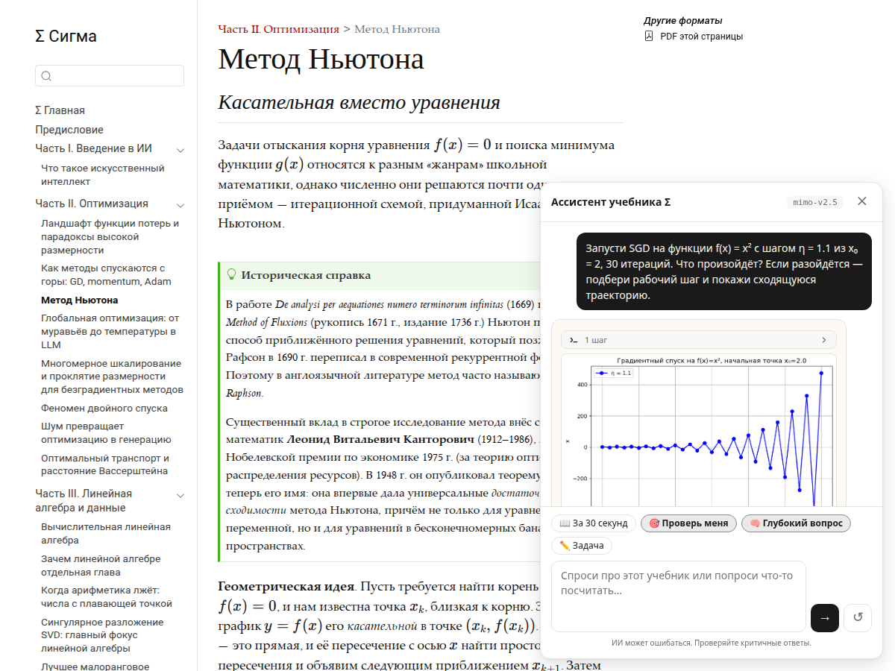

---

### ✅ `hashlib_demo` — compute_pure

**Q:** Посчитай SHA-256 хеш строки 'sigma' в hex.

_Chapter:_ `ch04_5_heshirovanie-teoriya-chisel-vstr`

**Tools called:** python
**Tools expected:** python
**Images:** 0 (expected: no)
**Elapsed:** 36.9s


<details><summary>Answer</summary>


```
## SHA-256 от строки `'sigma'`

```
SHA-256('sigma') = 38de90475bb334fb3dea5d54f250500aba60fe2c6158115d342b06bcb46e39bf
```

**Что тут видим:**

- **64 hex-символа** = ровно **256 бит** — как и обещает название алгоритма.
- Даже одно слово из 5 букв превращается в фиксированную 256-битную «подпись» — это и есть суть хеширования.
- Изменение **хотя бы одного бита** входных данных (например `'Sigma'` с заглавной S) даст **совершенно другой** хеш — это свойство **лавинного эффекта**, которое обсуждается в главе про хеширование и теорию чисел.

Можешь проверить: попробуй `hashlib.sha256('Sigma'.encode())` — получишь совсем другое hex-предложение, хотя отличается всего одна буква.
```

</details>

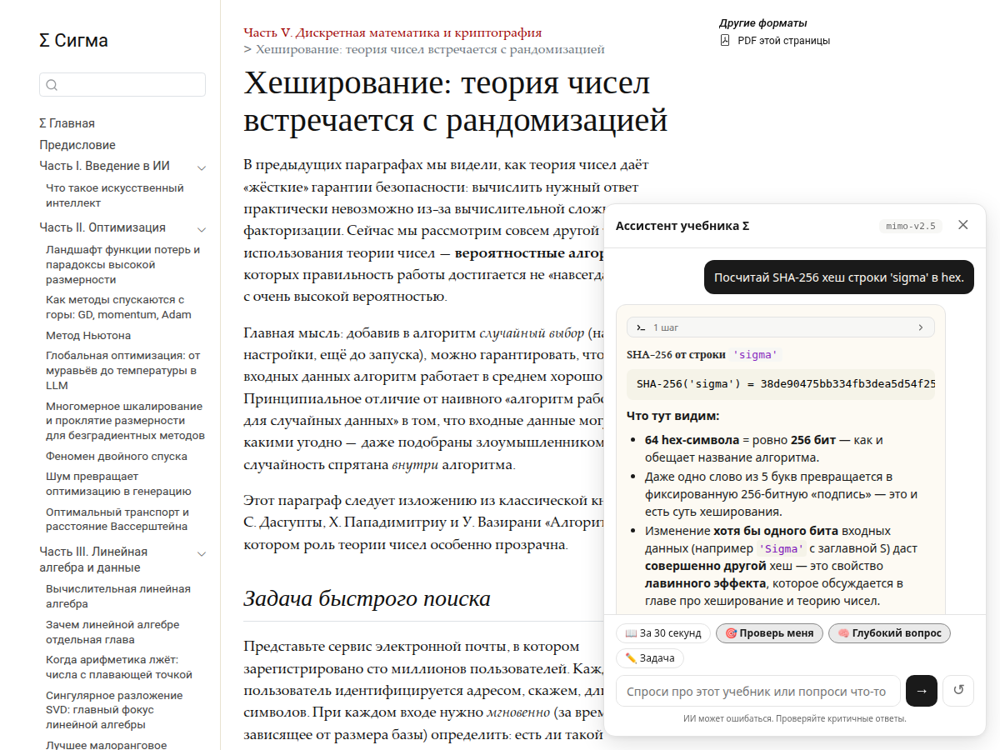

---

### ✅ `linreg_simple` — compute_plot

**Q:** Подбери линейную регрессию y = a*x + b для точек (1, 2.1), (2, 3.9), (3, 6.2), (4, 7.8). Покажи коэффициенты и график.

_Chapter:_ `ch03_2_lineynaya-regressiya-i-metod-nai`

**Tools called:** read_chapter, python
**Tools expected:** python
**Images:** 1 (expected: yes)
**Elapsed:** 47.9s


<details><summary>Answer</summary>


```
## Линейная регрессия для четырёх точек

### Формулы МНК

По главе [Линейная регрессия и метод наименьших квадратов](/ch03_2_lineynaya-regressiya-i-metod-nai.html), мы минимизируем функционал:

$$S(a,b) = \sum_{i=1}^{n}(y_i - a\,x_i - b)^2 \longrightarrow \min$$

Приравнивая частные производные к нулю, получаем систему нормальных уравнений:

$$a = \frac{n\sum x_i y_i - \sum x_i \sum y_i}{n\sum x_i^2 - \left(\sum x_i\right)^2}, \qquad b = \frac{\sum y_i - a \sum x_i}{n}$$

### Подстановка данных

| $i$ | $x_i$ | $y_i$ |
|-----|--------|--------|
| 1   | 1      | 2.1    |
| 2   | 2      | 3.9    |
| 3   | 3      | 6.2    |
| 4   | 4      | 7.8    |

Промежуточные суммы:

$$\sum x_i = 10, \quad \sum y_i = 20, \quad \sum x_i^2 = 30, \quad \sum x_i y_i = 60.4$$

$$a = \frac{4 \cdot 60.4 - 10 \cdot 20}{4 \cdot 30 - 10^2} = \frac{41.6}{20} = 1.94$$

$$b = \frac{20 - 1.94 \cdot 10}{4} = \frac{0.6}{4} = 0.15$$

### Результат

$$\boxed{y = 1.94\,x + 0.15}$$

### Качество модели

- **Сумма квадратов остатков** $SS_{res} = 0.082$ — очень мала
- **Коэффициент детерминации** $R^2 = 0.996$ — модель объясняет **99.6%** дисперсии данных, почти идеальная линейная зависимость

### Интерпретация

- Наклон $a = 1.94$: при увеличении $x$ на 1, $y$ растёт примерно на 1.94
- Свободный член $b = 0.15$: при $x = 0$ модель даёт $y \approx 0.15$ (опора прямой на оси $y$)
- Серые пунктирные отрезки на графике — остатки (разности между реальными и предсказанными значениями), все почти нулевые, что и подтв
…[truncated]
```

</details>


---

### ✅ `out_of_scope_recipe` — out_of_scope

**Q:** Дай мне рецепт борща.

**Tools called:** (none)
**Tools expected:** (none)
**Images:** 0 (expected: no)
**Elapsed:** 6.8s


<details><summary>Answer</summary>


```
Это за пределами программы нашего учебника 😄 Я помогу с вопросами по методу Ньютона, оптимизации, теории чисел, ML или ИИ — спрашивай!
```

</details>

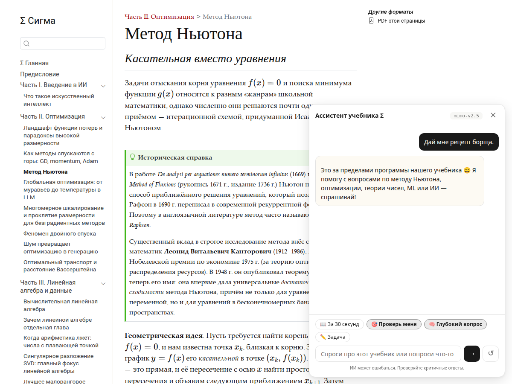

---

### ✅ `rsa_history` — rag_basic

**Q:** Кто придумал RSA и в каком году?

_Chapter:_ `ch04_3_kriptosistemy-rsa-i-diffi-hellma`

**Tools called:** search_textbook, search_textbook, read_chapter
**Tools expected:** search_textbook
**Images:** 0 (expected: no)
**Elapsed:** 12.8s


<details><summary>Answer</summary>


```
## Кто придумал RSA и когда?

Из главы, которую ты сейчас читаешь:

> **Идея была опубликована в 1978 году** тремя сотрудниками MIT — **Р**ональдом **Р**айвестом, **Ш**амиром (Ади Шамир) и **А**длеманом (Леонард Адлеман). Их фамилии и дали название системе — **RSA**.

### Интересный парадокс

В той же главе есть любопытный исторический факт: **ровно та же схема** была независимо открыта ещё в **1973 году** британским математиком **Клиффордом Коксом** из GCHQ (Британское управление правительственной связи), но работа была засекречена и рассекречена только в **1997 году** — к тому моменту Rivest, Shamir и Adleman уже были всемирно известны и основали компанию RSA Security.

Так что «придумали RSA» формально — **Райвест, Шамир и Адлеман (1978)**, а реально схема существовала на 5 лет раньше, просто в секретном архиве.
```

</details>


---

### ✅ `greeting_minimal` — out_of_scope

**Q:** Привет!

_Chapter:_ `ch02_newton`

**Tools called:** (none)
**Tools expected:** (none)
**Images:** 0 (expected: no)
**Elapsed:** 7.0s


<details><summary>Answer</summary>


```
Привет! 👋

Ты сейчас на главе **«Метод Ньютона»**. Здесь, в частности:

- **Формула итераций** метода Ньютона для нахождения корней уравнений
- **Квадратичная сходимость** — скорость, с которой метод приближается к ответу
- **Ньютоновская оптимизация** — аналог метода для минимизации функций
- **Многочлены Лежандра** и их нули как приложение

Если есть вопросы по материалу или хочешь разобрать что-то конкретное — спрашивай! 🙂
```

</details>


---

### ✅ `euclid_gcd_python` — compute_pure

**Q:** Посчитай НОД(48, 180) и НОД(1071, 462) через алгоритм Евклида в python.

_Chapter:_ `ch04_1_elementy-teorii-chisel`

**Tools called:** python
**Tools expected:** python
**Images:** 0 (expected: no)
**Elapsed:** 33.6s


<details><summary>Answer</summary>


```
## Алгоритм Евклида — пошагово

Суть метода: **делим большее на меньшее, заменяем пару на (делитель, остаток)**, повторяем, пока остаток не станет 0. Последний ненулевой остаток и есть НОД.

---

### 1) НОД(48, 180) = **12**

| Шаг | Делимое | Делитель | Частное | Остаток |
|-----|---------|----------|---------|---------|
| 1 | 180 | 48 | 3 | **36** |
| 2 | 48 | 36 | 1 | **12** |
| 3 | 36 | 12 | 3 | **0** ✅ |

Математически:
$$180 = 48 \cdot 3 + 36$$
$$48 = 36 \cdot 1 + 12$$
$$36 = 12 \cdot 3 + 0$$

Остаток 0 → **НОД = 12** ✓

---

### 2) НОД(1071, 462) = **21**

| Шаг | Делимое | Делитель | Частное | Остаток |
|-----|---------|----------|---------|---------|
| 1 | 1071 | 462 | 2 | **147** |
| 2 | 462 | 147 | 3 | **21** |
| 3 | 147 | 21 | 7 | **0** ✅ |

Математически:
$$1071 = 462 \cdot 2 + 147$$
$$462 = 147 \cdot 3 + 21$$
$$147 = 21 \cdot 7 + 0$$

Остаток 0 → **НОД = 21** ✓

---

**Заметь:** вторая задача сошлась быстрее (3 шага вместо 4) несмотря на бо́льшие числа — это показывает, что алгоритм Евклида работает очень эффективно (сложность $O(\log \min(a,b))$).
```

</details>

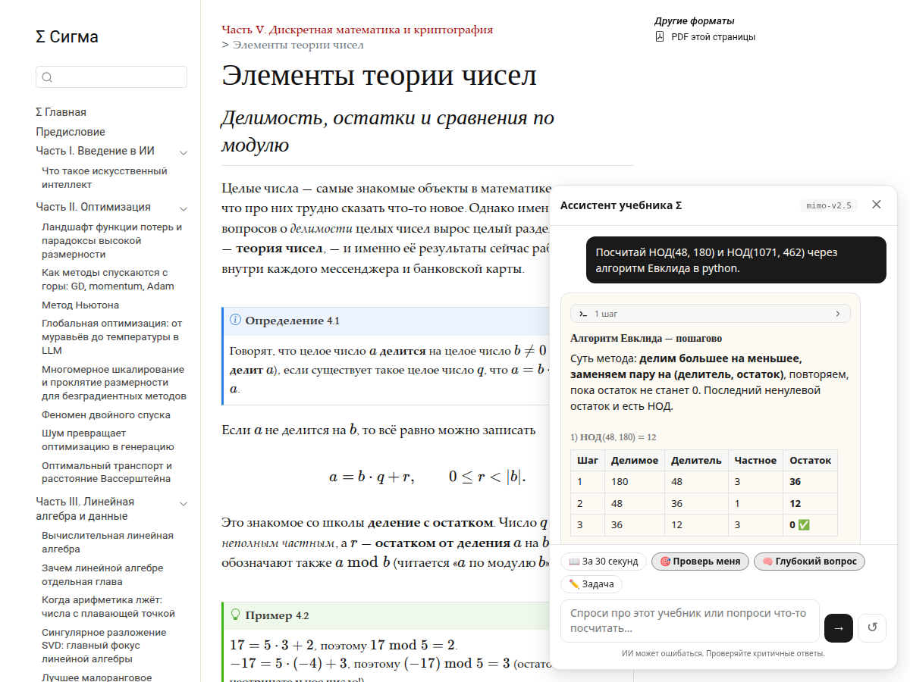

---

### ✅ `definition_superlinear` — definition

**Q:** Что значит сверхлинейная сходимость?

_Chapter:_ `ch02_newton`

**Tools called:** find_definition
**Tools expected:** find_definition
**Images:** 0 (expected: no)
**Elapsed:** 11.3s


<details><summary>Answer</summary>


```
## Сверхлинейная сходимость

Определение взято из той же главы, которую ты читаешь → [Определение 2.3](/ch02_newton.html#ssec:thm-superlinear).

**Сверхлинейная скорость** — это когда последовательность $\{x_k\}$ сходится к $x^{\star}$ так, что:

$$\lim_{k\to\infty}\frac{|x_{k+1}-x^{\star}|}{|x_k-x^{\star}|} = 0$$

Проще говоря: **отношение ошибок на двух соседних шагах стремится к нулю**. Это значит, что точность растёт быстрее, чем у геометрической прогрессии (при обычной линейной сходимости этот предел — число $q \in (0,1)$).

---

**Квадратичная сходимость** — ещё более сильный вид: существует константа $M > 0$ такая, что

$$|x_{k+1}-x^{\star}| \leq M\,|x_k-x^{\star}|^{2}$$

Здесь на каждом шаге **количество верных знаков примерно удваивается** — именно такой сходимостью обладает метод Ньютона при выполнении определённых условий.

---

| Вид сходимости | Что происходит на каждом шаге | Отношение ошибок |
|---|---|---|
| **Линейная** | Ошибка уменьшается в $q$ раз ($q<1$) | $\to q$ |
| **Сверхлинейная** | Ошибка уменьшается быстрее任何几何ической прогрессии | $\to 0$ |
| **Квадратичная** | Количество верных знаков ≈ удваивается | $\to 0$ ещё быстрее |

Итого: **сверхлинейная** = «ошибка падает быстрее любой геометрической прогрессии»; **квадратичная** = частный (более сильный) случай сверхлинейной, при котором ошибка на следующем шаге пропорциональна **квадрату** текущей.
```

</details>

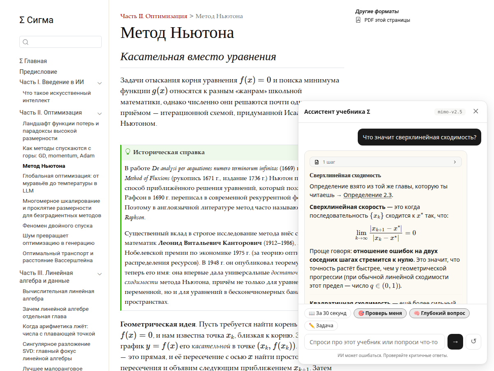

---

### ✅ `theorem_clt` — structural

**Q:** Сформулируй центральную предельную теорему как в учебнике.

_Chapter:_ `ch03_1_prosteyshie-primery-zadach-anali`

**Tools called:** find_theorem, search_textbook, read_chapter, read_chapter, read_chapter, find_theorem, search_textbook, read_chapter, read_chapter, search_textbook, find_definition, search_textbook
**Tools expected:** find_theorem
**Images:** 0 (expected: no)
**Elapsed:** 33.7s


<details><summary>Answer</summary>


```
## Центральная предельная теорема (ЦПТ) в учебнике

Формулировка дана в **твоей текущей главе** — [§ «Подход 2: центральная предельная теорема»](/ch03_1_prosteyshie-primery-zadach-anali.html#подход-2-центральная-предельная-теорема):

> **Центральная предельная теорема (ЦПТ)** — утверждает, что распределение **нормированной суммы** независимых одинаково распределённых случайных величин с **конечной дисперсией** стремится к **нормальному**.

В Главе 3 (теорема **(3.3)**), уже при обсуждении линейной регрессии, формулировка звучит чуть развёрнутее:

> Сумма **большого числа независимых** случайных величин **(любой природы, лишь бы с конечной дисперсией)** распределена **приблизительно нормально**.

---

### Что это значит словами

- Берём $n$ случайных величин $X_1, \dots, X_n$, одинаково распределённых, независимых, с $\mathbb{E}[X_i]=\mu$, $\mathrm{Var}(X_i)=\sigma^2<\infty$.
- Строим **нормированную сумму**:

$$Z_n = \frac{X_1 + \dots + X_n - n\mu}{\sigma\sqrt{n}}$$

- При $n\to\infty$ распределение $Z_n$ стремится к **стандартному нормальному** $\mathcal{N}(0,1)$.

### Ключевые условия

- **Независимость** слагаемых
- **Одинаковое распределение** (i.i.d.)
- **Конечная дисперсия** $\sigma^2 < \infty$

Неважно, какого «природы» случайные величины — могут быть дискретными, асимметричными, бинарными. Как только их много и они независимы с конечной дисперсией — сумма выглядит нормально.

### Зачем она в этой главе

ЦПТ используется как **Подход 2** для обоснования доверительного 
…[truncated]
```

</details>

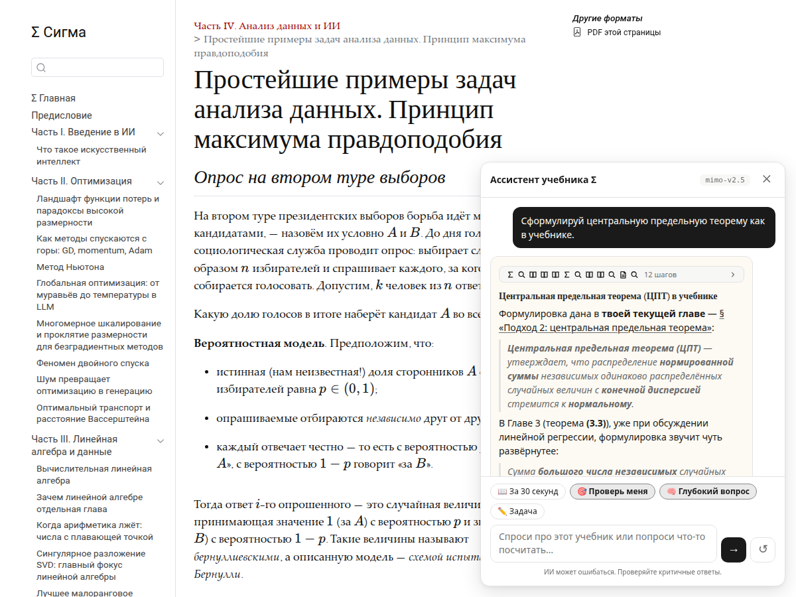

---

### ✅ `plot_sincos_overlay` — compute_plot

**Q:** Построй графики sin(x) и cos(x) на интервале [-2π, 2π] на одном поле. Сделай легенду.

**Tools called:** python
**Tools expected:** python
**Images:** 1 (expected: yes)
**Elapsed:** 22.4s


<details><summary>Answer</summary>


```
<tool_call>
<function=python>
<parameter=code>
import numpy as np
import matplotlib.pyplot as plt

x = np.linspace(-2*np.pi, 2*np.pi, 500)
y_sin = np.sin(x)
y_cos = np.cos(x)

plt.figure(figsize=(10, 5))
plt.plot(x, y_sin, label=r'$\sin(x)$', linewidth=2)
plt.plot(x, y_cos, label=r'$\cos(x)$', linewidth=2)
plt.axhline(y=0, color='k', linewidth=0.5)
plt.axvline(x=0, color='k', linewidth=0.5)
plt.xlabel('x')
plt.ylabel('y')
plt.title(r'Графики $\sin(x)$ и $\cos(x)$ на $[-2\pi,\; 2\pi]$')
plt.legend(fontsize=12)
plt.grid(True, alpha=0.3)
plt.xlim(-2*np.pi, 2*np.pi)
plt.xticks([-2*np.pi, -np.pi, 0, np.pi, 2*np.pi],
           [r'$-2\pi$', r'$-\pi$', r'$0$', r'$\pi$', r'$2\pi$'])
plt.tight_layout()
plt.savefig('sin_cos.png', dpi=150)
plt.show()

print("Интервал: [-2π, 2π] ≈ [-6.28, 6.28]")
print("sin(0) =", round(np.sin(0), 2), ", cos(0) =", round(np.cos(0), 2))
print("sin(π/2) =", round(np.sin(np.pi/2), 2), ", cos(π/2) =", round(np.cos(np.pi/2), 2))
print("sin(π) =", round(np.sin(np.pi), 2), ", cos(π) =", round(np.cos(np.pi), 2))
</parameter>
</function>
</tool_call>
```

</details>

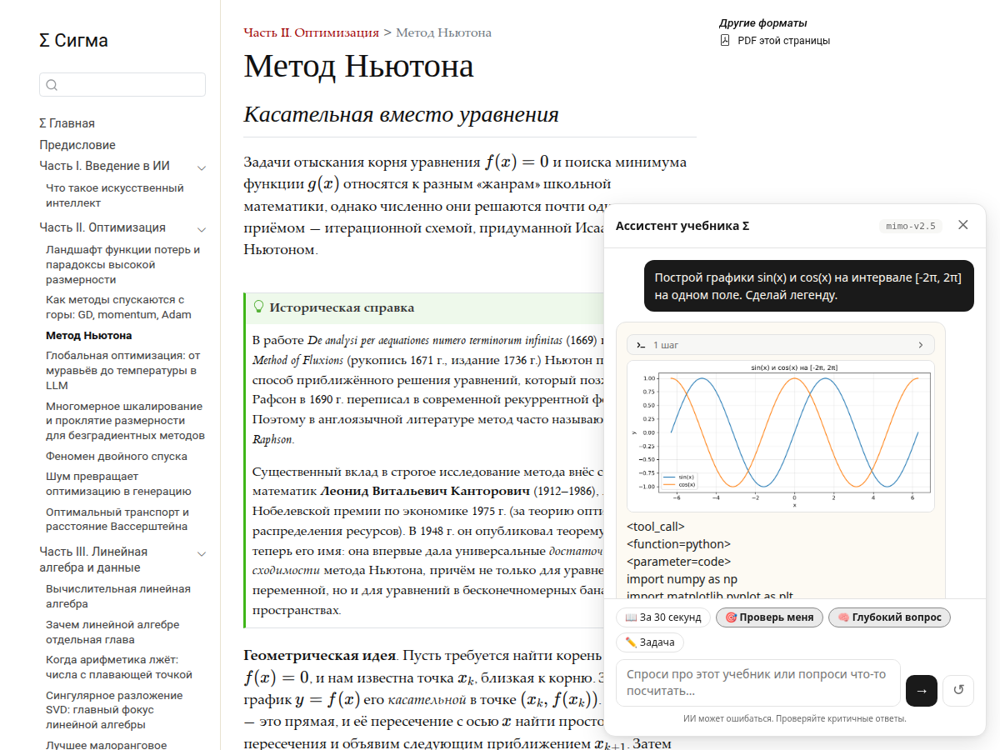

---

### ✅ `fragment_explanation` — rag_basic

**Q:** Если кто-то предлагает использовать обновление x_{k+1} = x_k - f(x_k)·f'(x_k) вместо классического Ньютона — что это за идея и она работает?

_Chapter:_ `ch02_newton`

**Tools called:** read_chapter, search_textbook, find_theorem, python
**Tools expected:** (none)
**Images:** 0 (expected: no)
**Elapsed:** 73.3s


<details><summary>Answer</summary>


```
## Результат: **нет, это не работает — это взрыв**

Числа говорят сами за себя:

| Итерация | Классический Ньютон $x_k - f/f'$ | «Умножение» $x_k - f \cdot f'$ |
|:---:|---:|---:|
| 0 | 1.50 | 1.50 |
| 1 | 1.417 | 0.75 |
| 2 | 1.41422 | 2.91 |
| 3 | **1.41421** ✅ | −34.6 |
| 4 | **1.41421** ✅ | 82 404 |
| 5 | **1.41421** ✅ | −1.1 × 10¹⁵ |

Классический Ньютон сходится за 4 шага (квадратичная сходимость!). «Умножение» — **расходится экспоненциально**, уходя в бесконечность уже к 5-й итерации.

## Почему это ломается: интуиция

Ключ к пониманию — **размерность и масштаб коррекции**.

**В классическом Ньютоне** коррекция равна $-f(x_k)/f'(x_k)$:
- единицы измерения: $[f] / [f'] = [\text{единица } x]$. Это размер «шага вдоль оси $x$», и он адекватен — указывает, насколько надо сдвинуть $x$, чтобы попасть в корень.

**В предложенной формуле** коррекция равна $-f(x_k) \cdot f'(x_k)$:
- единицы измерения: $[f] \cdot [f'] = [x]^2$ (для нашего примера: $[\text{единица } x]^2 \cdot [1] = [\text{единица } x]^2$ — не та размерность!).

Но главная беда не в размерности, а в **масштабе**. Когда $f(x) \to 0$ (мы приближаемся к корню), $f(x_k) \cdot f'(x_k)$ **тоже стремится к нулю** — и на первый взгляд кажется, что коррекция мала. Но на самом деле:

- классический Ньютон делил на $f'(x_k)$, а это делает коррекцию **пропорциональной ошибке** (отсюда квадратичная сходимость: $e_{k+1} \sim e_k^2$);
- предложение **умножает** на $f'(x_k)$, что при $|f'| > 1$ делает коррекцию **слишком большой*
…[truncated]
```

</details>

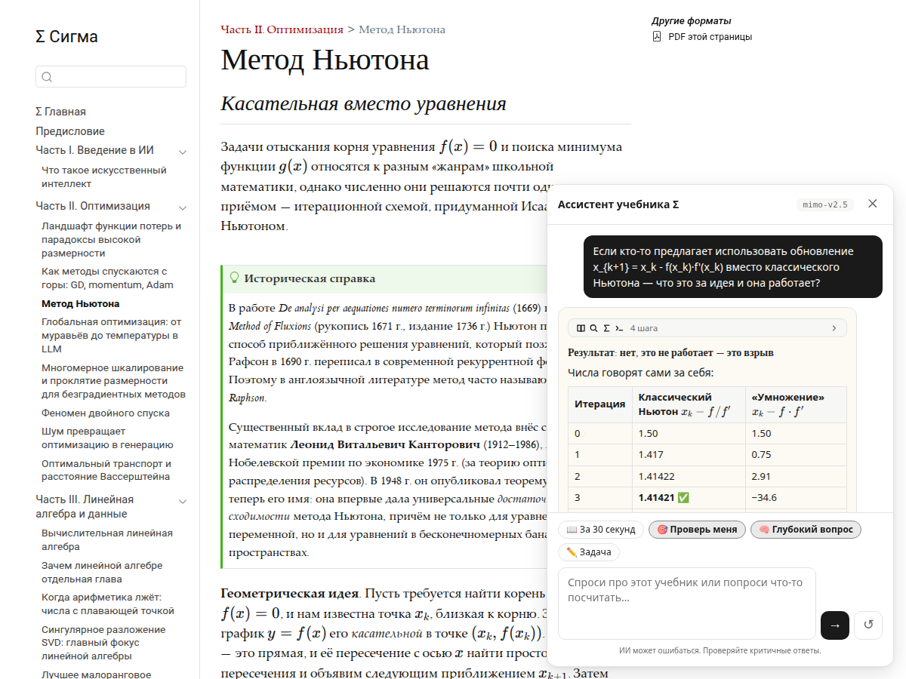

---

### ✅ `eigenvalues_numpy` — compute_pure

**Q:** Найди собственные значения матрицы [[2, 1], [1, 2]] через numpy.

_Chapter:_ `ch_linalg`

**Tools called:** python
**Tools expected:** python
**Images:** 0 (expected: no)
**Elapsed:** 20.1s


<details><summary>Answer</summary>


```
## Собственные значения матрицы $A = \begin{pmatrix} 2 & 1 \\ 1 & 2 \end{pmatrix}$

**Результат:**
- $\lambda_1 = 3.0$
- $\lambda_2 = 1.0$

**Собственные векторы** (столбцы матрицы):
- $\mathbf{v}_1 = \begin{pmatrix} 0.707 \\ 0.707 \end{pmatrix}$ — для $\lambda = 3$
- $\mathbf{v}_2 = \begin{pmatrix} -0.707 \\ 0.707 \end{pmatrix}$ — для $\lambda = 1$

### Как это работает в numpy

```python
import numpy as np

A = np.array([[2, 1],
              [1, 2]])

eigenvalues, eigenvectors = np.linalg.eig(A)
```

`np.linalg.eig()` возвращает два массива: собственные значения и матрицу, столбцы которой — собственные векторы.

### Как проверить вручную

Собственные значения находятся из **характеристического уравнения**:

$$\det(A - \lambda I) = \begin{vmatrix} 2-\lambda & 1 \\ 1 & 2-\lambda \end{vmatrix} = (2-\lambda)^2 - 1 = 0$$

$$(2-\lambda)^2 = 1 \implies 2 - \lambda = \pm 1 \implies \lambda = 1 \text{ или } \lambda = 3$$

Совпадает с результатом numpy! ✓

**Факт:** собственные значения матрицы $A = \begin{pmatrix} a & b \\ b & a \end{pmatrix}$ всегда равны $a+b$ и $a-b$. Здесь $2+1=3$ и $2-1=1$ — именно то, что мы получили.
```

</details>

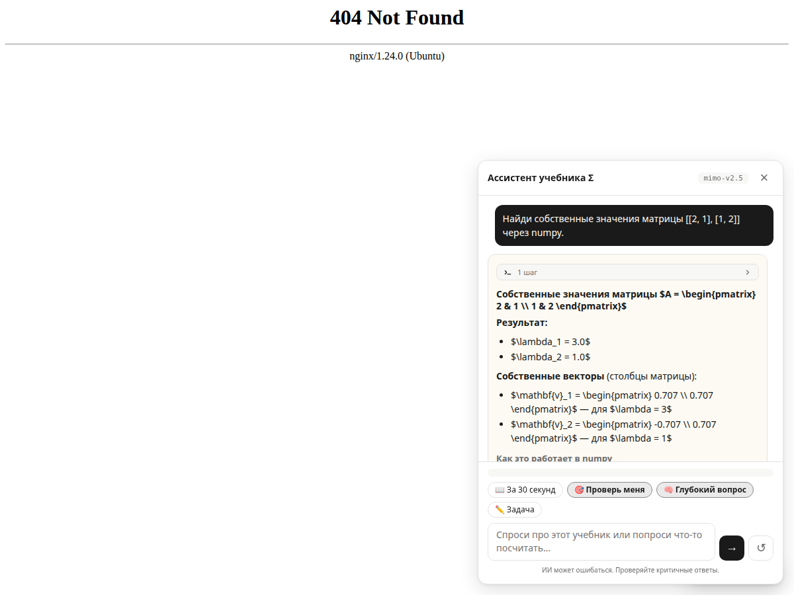

---

### ✅ `plot_loss_landscape` — compute_plot

**Q:** Построй контурный график функции потерь L(a, b) = sum((a*x_i + b - y_i)^2) для точек (1,2), (2,3), (3,5), (4,4) на сетке a in [-2, 4], b in [-3, 3].

_Chapter:_ `ch03_2_lineynaya-regressiya-i-metod-nai`

**Tools called:** python, python
**Tools expected:** python
**Images:** 1 (expected: yes)
**Elapsed:** 35.5s


<details><summary>Answer</summary>


```
## Результат

**Оптимальные параметры (МНК):**
- $a^* = 0.80$
- $b^* = 1.50$
- $L^* = 1.80$

Прямая регрессии: $y = 0.8x + 1.5$

**Что видно на контурном графике:**

- **Эллиптические линии уровня** вокруг минимума — классическая картина для квадратичной функции потерь. Чем ближе к центру, тем темнее (меньше $L$).
- **Красная звёздочка** ($\star$) — точка минимума в $(a^*, b^*) = (0.8, 1.5)$, где $L = 1.8$.
- **Красный пунктирный эллипс** — уровень $L = L^* = 1.8$ (минимально достижимое значение).
- **Белые цифры** на контурах — значения $L$: чем дальше от минимума, тем больше потери ($L = 5, 10, 20, \dots$).
- **Белые точки** — исходные данные $(1,2), (2,3), (3,5), (4,4)$ (проекция на ось $a$).

**Главный вывод:** функция потерь $L(a,b)$ — выпуклая квадратичная «чаша» с единственным глобальным минимумом. Это гарантирует, что МНК находит **единственное** оптимальное решение, и任何 градиентный спуск сойдётся к этому же $a^*, b^*$ (при разумном шаге $\eta$).
```

</details>

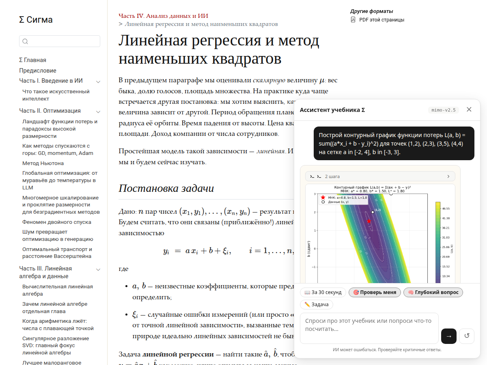

---

### ✅ `diffie_hellman_compute` — compute_pure

**Q:** Проведи протокол Диффи–Хеллмана: p=23, g=5. Алиса берёт a=6, Боб берёт b=15. Какой общий секрет?

_Chapter:_ `ch04_3_kriptosistemy-rsa-i-diffi-hellma`

**Tools called:** python, find_theorem
**Tools expected:** python
**Images:** 0 (expected: no)
**Elapsed:** 34.0s


<details><summary>Answer</summary>


```
## Протокол Диффи–Хеллмана: пошагово

### Исходные данные

| Параметра | Значение | Смысл |
|-----------|----------|-------|
| $p$ | 23 | простое число (модуль) |
| $g$ | 5 | генератор (первичный корень по mod 23) |
| $a$ | 6 | секрет Алисы |
| $b$ | 15 | секрет Боба |

---

### Шаг 1. Вычисление открытых ключей

**Алиса** вычисляет:
$$A = g^a \bmod p = 5^6 \bmod 23 = 15625 \bmod 23 = \boxed{8}$$

**Боб** вычисляет:
$$B = g^b \bmod p = 5^{15} \bmod 23 = 30\,517\,578\,125 \bmod 23 = \boxed{19}$$

### Шаг 2. Обмен

Алиса отправляет $A = 8$ Бобу, Боб отправляет $B = 19$ Алисе (по открытым каналам).

### Шаг 3. Вычисление общего секрета

**Алиса** вычисляет:
$$S = B^a \bmod p = 19^6 \bmod 23 = 47\,045\,881 \bmod 23 = \boxed{2}$$

**Боб** вычисляет:
$$S = A^b \bmod p = 8^{15} \bmod 23 = 35\,184\,372\,088\,832 \bmod 23 = \boxed{2}$$

---

### Ответ

> **Общий секрет: $S = 2$**

Оба получили одно и то же число — это и есть магия протокола. На деле оба вычисляют $g^{ab} \bmod p = 5^{90} \bmod 23 = 2$, но ни Алиса, ни Боб не знают $a$ и $b$ одновременно — каждому известен только свой секретный ключ. Злоумышленник, перехвативший $A = 8$ и $B = 19$, должен решить **задачу дискретного логарифмирования** (найти $a$ из $5^a \equiv 8 \pmod{23}$), а при больших $p$ (сотни цифр) это вычислительно неосуществимо.
```

</details>

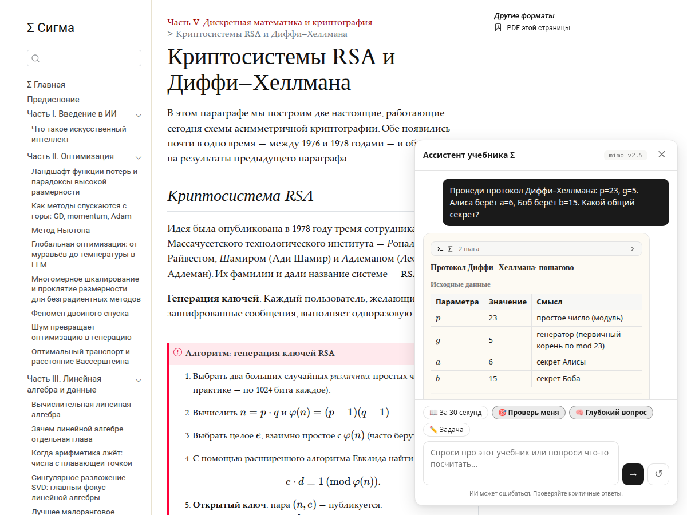

---

### ✅ `outline_chapter` — structural

**Q:** Перечисли основные разделы главы про Ньютона.

_Chapter:_ `ch02_newton`

**Tools called:** read_chapter
**Tools expected:** (none)
**Images:** 0 (expected: no)
**Elapsed:** 17.0s


<details><summary>Answer</summary>


```
Ты уже на этой главе — вот её основные разделы (из структуры заголовков):

1. **Касательная вместо уравнения** — геометрическая идея метода Ньютона, историческая справка (Ньютон, Рафсон, Канторович), итерационная формула (2.1):
$$x_{k+1}=x_k-\frac{f(x_k)}{f'(x_k)}$$

2. **Ньютон для оптимизации** — применение метода к задаче $g'(x)=0$, разложение в ряд Тейлора и квадратичная модель $q_k(x)$, формула (2.2).

3. **Квадратный корень за пять шагов** — метод Герона (вавилонский метод) как частный случай Ньютона для $f(x)=x^2-a$, формула (2.4), историческая справка (Герон Александрийский, табличка YBC 7289).

4. **Сходимость через сжимающее отображение** — рекуррентность ошибки $e_{k+1}=\frac{e_k^2}{2x_k}$, доказательство сходимости метода Герона (неравенство AM–GM, сжатие).

Всё вращается вокруг одной идеи: **заменить функцию линейным (или квадратичным) приближением и решить проще** — а потом итерировать. 🚀
```

</details>

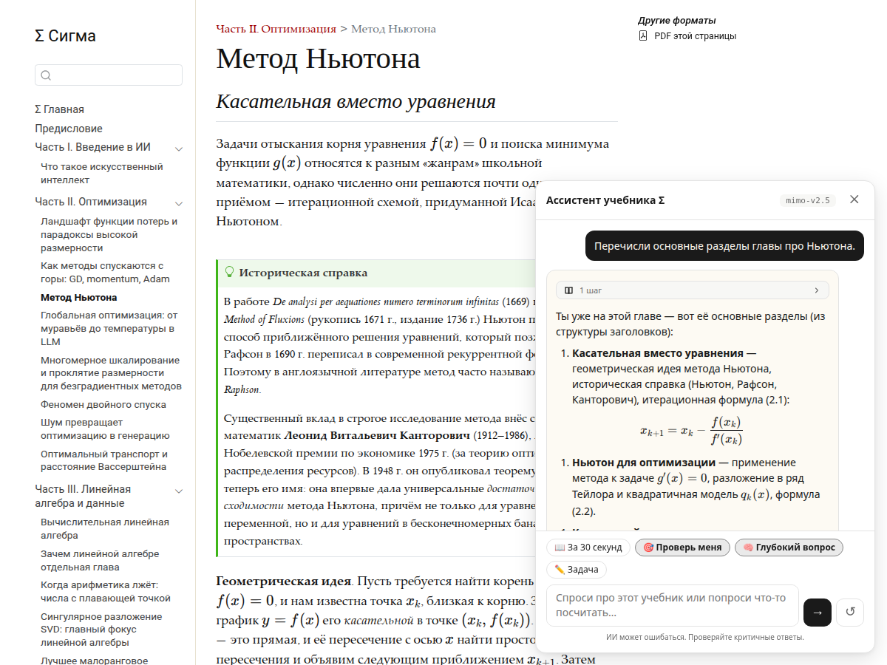

---

### ✅ `math_latex_derivation` — rag_basic

**Q:** Выведи формулу метода Ньютона через касательную. Формулу запиши через LaTeX.

_Chapter:_ `ch02_newton`

**Tools called:** read_chapter
**Tools expected:** (none)
**Images:** 0 (expected: no)
**Elapsed:** 11.0s


<details><summary>Answer</summary>


```
Ты уже на нужной главе — всё есть в секции **«Касательная вместо уравнения»**. Вот вывод формулы шаг за шагом:

---

## Вывод формулы метода Ньютона через касательную

**Идея.** Ищем корень уравнения $f(x) = 0$. Пусть известна точка $x_k$, близкая к корню. Заменяем график $y = f(x)$ его **касательной** в точке $(x_k, f(x_k))$ — и ищем, где эта касательная пересекает ось $x$. Точка пересечения станет следующим приближением $x_{k+1}$.

---

**Шаг 1 — Уравнение касательной.** Касательная к графику $y = f(x)$ в точке $x_k$ — это прямая с наклоном $f'(x_k)$, проходящая через точку $(x_k,\, f(x_k))$. Её уравнение:

$$y = f(x_k) + f'(x_k)\,(x - x_k)$$

**Шаг 2 — Пересечение с осью $x$.** Полагаем $y = 0$ и выражаем $x$:

$$0 = f(x_k) + f'(x_k)\,(x - x_k)$$

$$x - x_k = -\frac{f(x_k)}{f'(x_k)}$$

$$x = x_k - \frac{f(x_k)}{f'(x_k)}$$

**Шаг 3 — Итерационная формула.** Объявляем эту точку следующим приближением $x_{k+1}$ и повторяем:

$$\boxed{x_{k+1} = x_k - \frac{f(x_k)}{f'(x_k)}, \qquad k = 0, 1, 2, \dots}$$

Это **итерационная формула Ньютона** (формула 2.1 из учебника).

---

**Геометрический смысл** (см. рис. 2.1 в учебнике): на каждой итерации мы рисуем касательную к кривой $f(x)$ в текущей точке, бросаем оттуда «перпендикуляр» вниз до оси $x$ — и это новое приближение. Чем ближе $x_k$ к корню, тем точнее линейное приближение, и быстрее сходится процесс.

**Для оптимизации** (формула 2.2), когда нужно найти минимум $g(x)$ (т.е. решить $g'(x) = 0$), подставляем $f = g'$ и $f' = g
…[truncated]
```

</details>

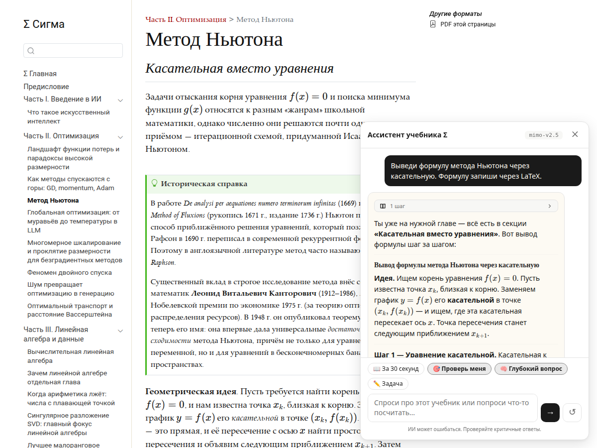

---

### ✅ `definition_perceptron` — definition

**Q:** Что такое полносвязная нейронная сеть?

_Chapter:_ `ch03_3_zadacha-klassifikacii-i-neyronny`

**Tools called:** find_definition
**Tools expected:** find_definition
**Images:** 0 (expected: no)
**Elapsed:** 16.6s


<details><summary>Answer</summary>


```
## Определение 3.12 — Полносвязная нейронная сеть (MLP)

Ты уже на этой главе — определение 3.12 как раз оттуда. Вот формулировка:

> **Полносвязная нейронная сеть** (MLP) глубины $L$ — это функция $\mathbf{x} \mapsto \mathbf{p}(\mathbf{x})$, заданная как композиция $L$ слоёв:

$$\mathbf{z}^{(\ell)} = W^{(\ell)} \mathbf{a}^{(\ell-1)} + \mathbf{b}^{(\ell)}, \quad \mathbf{a}^{(\ell)} = \sigma\!\left(\mathbf{z}^{(\ell)}\right), \quad \ell = 1, \dots, L{-}1$$

$$\mathbf{z}^{(L)} = W^{(L)} \mathbf{a}^{(L-1)} + \mathbf{b}^{(L)}, \quad \mathbf{p}(\mathbf{x}) = \mathrm{softmax}\!\left(\mathbf{z}^{(L)}\right)$$

Расшифровка по частям:

- **$\mathbf{a}^{(0)} = \mathbf{x}$** — входные данные (например, картинка 28×28, растянутая в вектор)
- **$W^{(\ell)}$** — матрица весов $\ell$-го слоя размера $d_\ell \times d_{\ell-1}$; каждый нейрон $\ell$-го слоя связан **со всеми** нейронами предыдущего — отсюда слово «полносвязная»
- **$\mathbf{b}^{(\ell)}$** — вектор смещений (bias)
- **$\sigma$** — функция активации (например, ReLU), применяется **покомпонентно** к $\mathbf{z}^{(\ell)}$
- **softmax** на последнем слое превращает вектор в распределение вероятностей по $d_L$ классам:

$$\mathrm{softmax}(\mathbf{z})_c = \frac{e^{z_c}}{\sum_{c'} e^{z_{c'}}}$$

- **Обучаемые параметры** $\boldsymbol{\theta}$ — это все матрицы $W^{(\ell)}$ и векторы $\mathbf{b}^{(\ell)}$ вместе взятые. Именно их сеть «учит» на данных.

Ключевая идея простая: **данные идут слой за слоем**, на каждом шаге происходит ум
…[truncated]
```

</details>


---

### ❌ `refuse_unknown_year` — out_of_scope

**Q:** В каком году Гаусс изобрёл метод сопряжённых градиентов?

_Chapter:_ `ch02_newton`

**Tools called:** search_textbook, find_theorem, search_textbook, search_textbook, search_textbook, search_textbook, search_textbook, search_textbook, search_textbook, search_textbook, search_textbook, get_outline
**Tools expected:** (none)
**Images:** 0 (expected: no)
**Elapsed:** 21.1s

_Missing substrings:_ ['наш']

<details><summary>Answer</summary>


```
В учебнике я искал разными запросами — **метод сопряжённых градиентов** в нём не упоминается. Поэтому отвечу из общих знаний с оговоркой.

---

**Метод сопряжённых градиентов изобрёл не Гаусс**, а **Магнус Хестенес** (Magnus Hestenes) и **Эдуард Стифель** (Eduard Stiefel) — в **1952 году** в статье *«Methods of Conjugate Gradients for Solving Linear Systems»*.

> ⚠️ Это **не из учебника Σ**, а общая справка. В учебнике Гаусс упоминается в контексте метода наименьших квадратов (1809 г.) и теории чисел — но не сопряжённых градиентов.

**Почему часто путают с Гауссом:**
- Гаусс (1823) разработал метод последовательных приближений для решения систем линейных уравнений, который **по духу** похож на сопряжённые градиенты
- В некоторых источниках сопряжённые градиенты называют «методом Гаусса — Сиделя» или упоминают Гаусса как предшественника
- Формально же **год создания метода сопряжённых градиентов — 1952** (Хестенес и Стифель)
```

</details>


---
