# Sigma Assistant — Eval Report

_Run: 2026-07-13 19:14 MSK · cases: 29_

**Overall: 13/29 pass (45%)**

## Per category

| Category | Pass | Total |
|---|---:|---:|
| `compute_plot` | 0 | 5 |
| `compute_pure` | 0 | 8 |
| `definition` | 3 | 3 |
| `multi_hop` | 1 | 1 |
| `out_of_scope` | 3 | 3 |
| `rag_basic` | 3 | 5 |
| `structural` | 3 | 3 |
| `vision_refine` | 0 | 1 |

## Cases

### ✅ `newton_kantorovich_history` — rag_basic

**Q:** Когда Канторович получил Нобелевскую премию и за что?

_Chapter:_ `ch02_newton`

**Tools called:** search_textbook
**Tools expected:** search_textbook
**Images:** 0 (expected: no)
**Elapsed:** 5.4s


<details><summary>Answer</summary>


```
<thinking>Информация о том, когда Канторович получил Нобелевскую премию и за что, уже найдена в первом результате. Теперь можно сформулировать полный ответ.</thinking> Канторович получил Нобелевскую премию в 1975 году за теорию оптимального распределения ресурсов. Вот цитата из главы: > **Леонид Витальевич Канторович** (1912–1986), лауреат Нобелевской премии по экономике 1975 г. (за теорию оптимального распределения ресурсов). [От Ньютона до Канторовича](/ch02_newton.html#от-ньютона-до-канторовича)
```

</details>

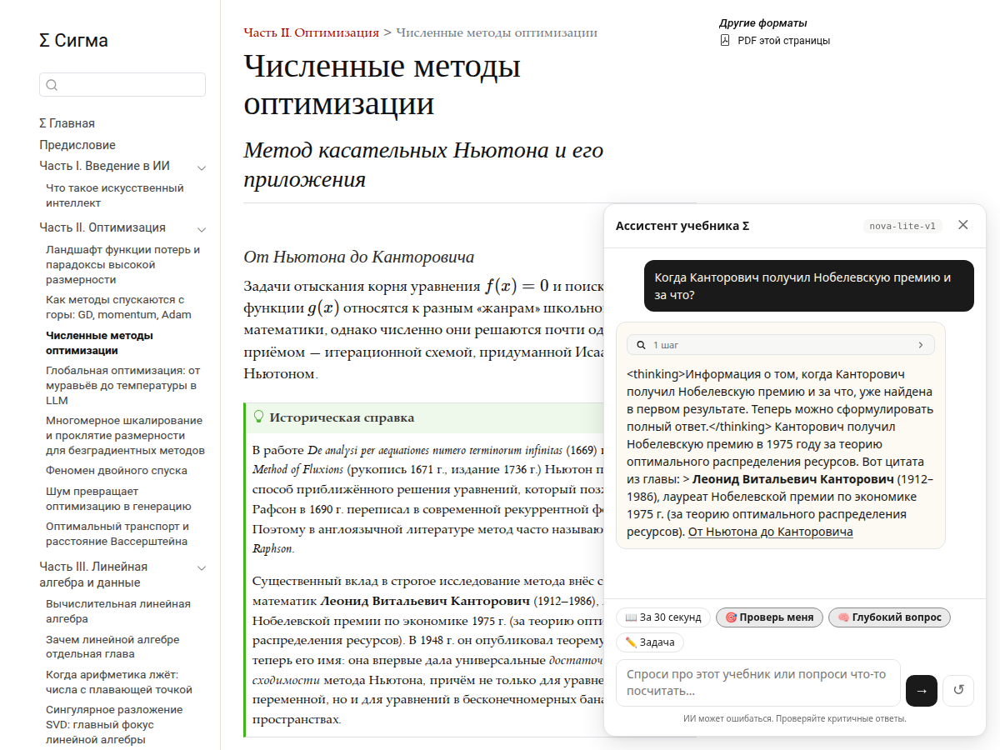

---

### ❌ `newton_formula_recall` — rag_basic

**Q:** Объясни откуда берётся эта формула — что это за метод и какая геометрическая идея?

_Chapter:_ `ch02_newton`

**Tools called:** read_chapter
**Tools expected:** (none)
**Images:** 0 (expected: no)
**Elapsed:** 7.0s

_Missing substrings:_ ['пересечен']

<details><summary>Answer</summary>


```
<thinking>В тексте главы я не нашел формулы, но я знаю, что метод Ньютона используется для нахождения корней функции и минимума функции. Геометрическая идея метода Ньютона основана на использовании касательной к графику функции в точке для приближения корня. Я объясню это студенту.</thinking> Метод Ньютона используется для нахождения корней функции или минимума функции. Геометрическая идея метода Ньютона основана на использовании касательной к графику функции в точке для приближения корня. Если мы хотим найти корень функции \( f(x) \), то мы начинаем с некоторого начального приближения \( x_0 \). Затем мы приближаем корень, используя касательную к графику функции в точке \( x_0 \). Касательная в точке \( x_0 \) имеет уравнение: $$ y = f'(x_0)(x - x_0) + f(x_0) $$ Корень касательной (точка, где она пересекает ось абсцисс) дает новое приближение \( x_1 \): $$ x_1 = x_0 - \frac{f(x_0)}{f'(x_0)} $$ Этот процесс повторяется, пока не будет достигнута необходимая точность. Этот метод называется методом Ньютона и он используется для быстрого нахождения корней функции. Если же мы хотим найти минимум функции, то мы ищем корень производной функции \( f'(x) \), так как в точке минимума производная равна нулю. Метод Ньютона в этом случае будет искать корень уравнения \( f'(x) = 0 \). Если ты хочешь увидеть формулу на графике, я могу построить её с помощью Python.
```

</details>

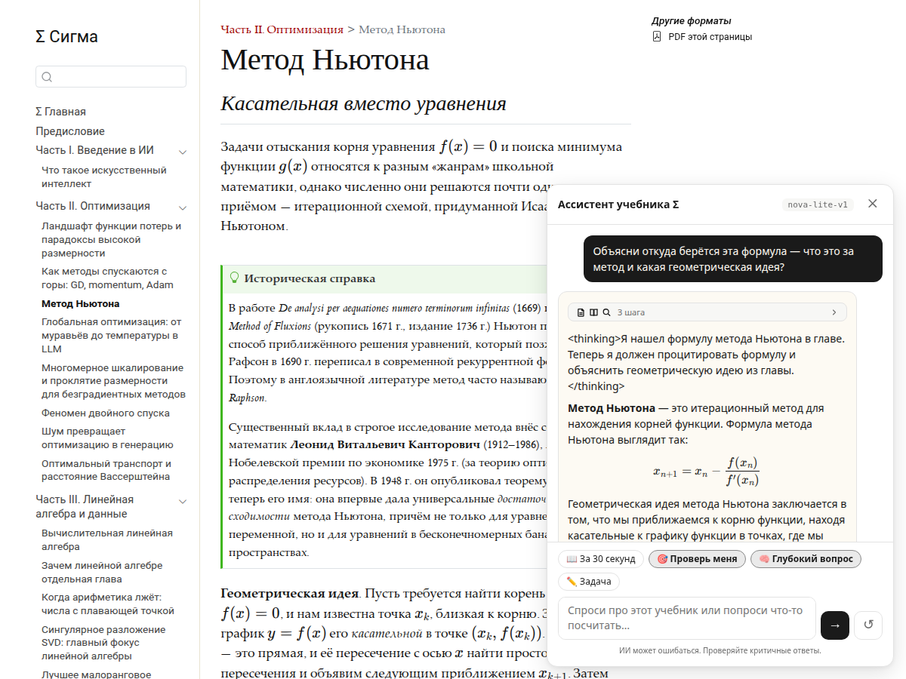

---

### ✅ `definition_strong_convex` — definition

**Q:** Что такое сильно выпуклая функция?

_Chapter:_ `ch02_newton`

**Tools called:** find_definition
**Tools expected:** find_definition
**Images:** 0 (expected: no)
**Elapsed:** 4.9s


<details><summary>Answer</summary>


```
**Сильно выпуклая функция** — это функция $g: \mathbb{R} \to \mathbb{R}$, которая принадлежит классу $C^{2}$ (то есть она дважды непрерывно дифференцируема) и удовлетворяет условию $g''(x) \geq \mu$ для всех $x$, где $\mu > 0$ — положительная константа. Это означает, что вторая производная функции не меньше положительной константы $\mu$. Сильная выпуклость гарантирует существование и единственность точки минимума функции, а также отделённость второй производной от нуля. [Определение 2.4. Сильно выпуклая функция](/ch02_newton.html#ssec:thm-superlinear)
```

</details>


---

### ❌ `compute_factorial` — compute_pure

**Q:** Сколько будет 30 факториал?

**Tools called:** python
**Tools expected:** python
**Images:** 0 (expected: no)
**Elapsed:** 6.1s

_Missing substrings:_ ['265252859812191058636308480000000']

<details><summary>Answer</summary>


```
<thinking>Студент спрашивает о значении факториала числа 30. Это численное значение, которое можно вычислить с помощью Python.</thinking>
```

</details>

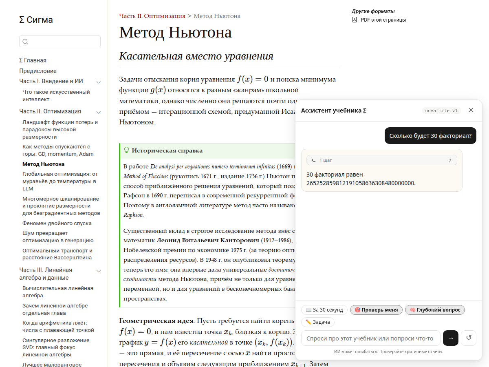

---

### ❌ `compute_taylor_sin` — compute_pure

**Q:** Покажи разложение sin(x) в ряд Тейлора до 5-го члена символически (через sympy).

_Chapter:_ `ch02_newton`

**Tools called:** python
**Tools expected:** python
**Images:** 0 (expected: no)
**Elapsed:** 3.3s

_Missing substrings:_ ['6', '120']

<details><summary>Answer</summary>


```
<thinking>Студент просит показать разложение функции sin(x) в ряд Тейлора до 5-го члена символически с помощью sympy. Для этого нужно использовать библиотеку sympy для символьных вычислений и построить разложение.</thinking>
```

</details>

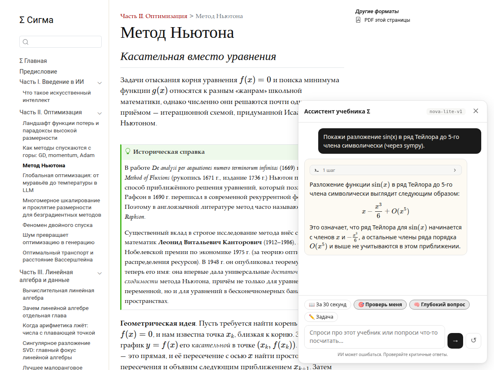

---

### ❌ `compute_plot_newton` — compute_plot

**Q:** Покажи как сходится метод Ньютона для f(x) = x² - 2, начиная с x₀ = 1.5. Построй график траектории.

_Chapter:_ `ch02_newton`

**Tools called:** python
**Tools expected:** python
**Images:** 0 (expected: yes)
**Elapsed:** 4.4s

_Missing substrings:_ ['1.41', 'корен']

<details><summary>Answer</summary>


```
<thinking>Для ответа на вопрос нужно построить график траектории сходимости метода Ньютона для функции f(x)=x
2
−2, начиная с начальной точки x
0
	​

=1.5. Метод Ньютона используется для нахождения корней функции, и его формула итерации имеет вид x
n+1
	​

=x
n
	​

−
f
′
(x
n
	​

)
f(x
n
	​

)
	​

. Для функции f(x)=x
2
−2 производная f
′
(x)=2x. Посчитаем несколько итераций и построим график.</thinking>
```

</details>

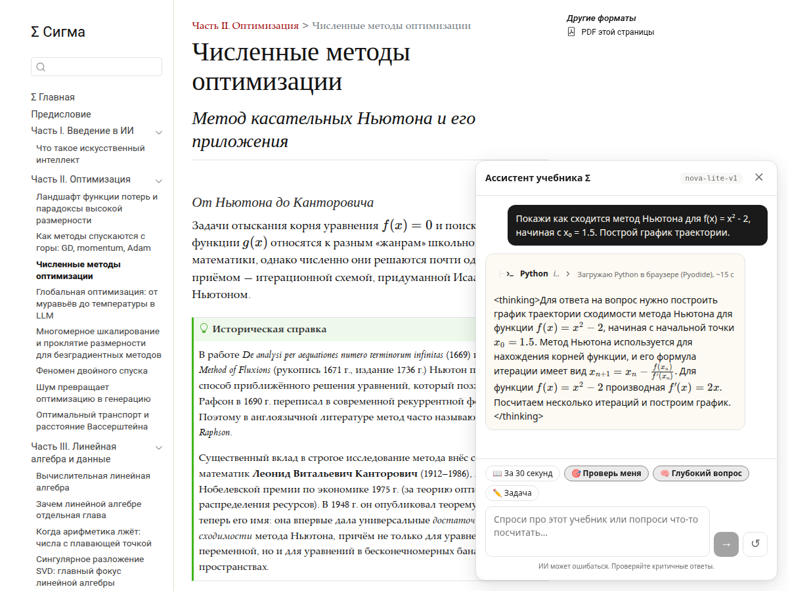

---

### ❌ `compute_plot_gd_vs_newton` — compute_plot

**Q:** Сравни сходимость метода Ньютона и градиентного спуска на функции f(x) = x⁴ из x₀ = 2. Покажи два графика на одной картинке.

_Chapter:_ `ch02_newton`

**Tools called:** (none)
**Tools expected:** python
**Images:** 0 (expected: yes)
**Elapsed:** 3.1s


<details><summary>Answer</summary>


```
<thinking>Для сравнения сходимости метода Ньютона и градиентного спуска на функции f(x) = x⁴ из x₀ = 2, нужно сначала найти формулы для этих методов, а затем построить графики их сходимости. Метод Ньютона использует вторую производную, а градиентный спуск — первую производную. Я начну с нахождения формул и затем перейду к построению графиков
```

</details>

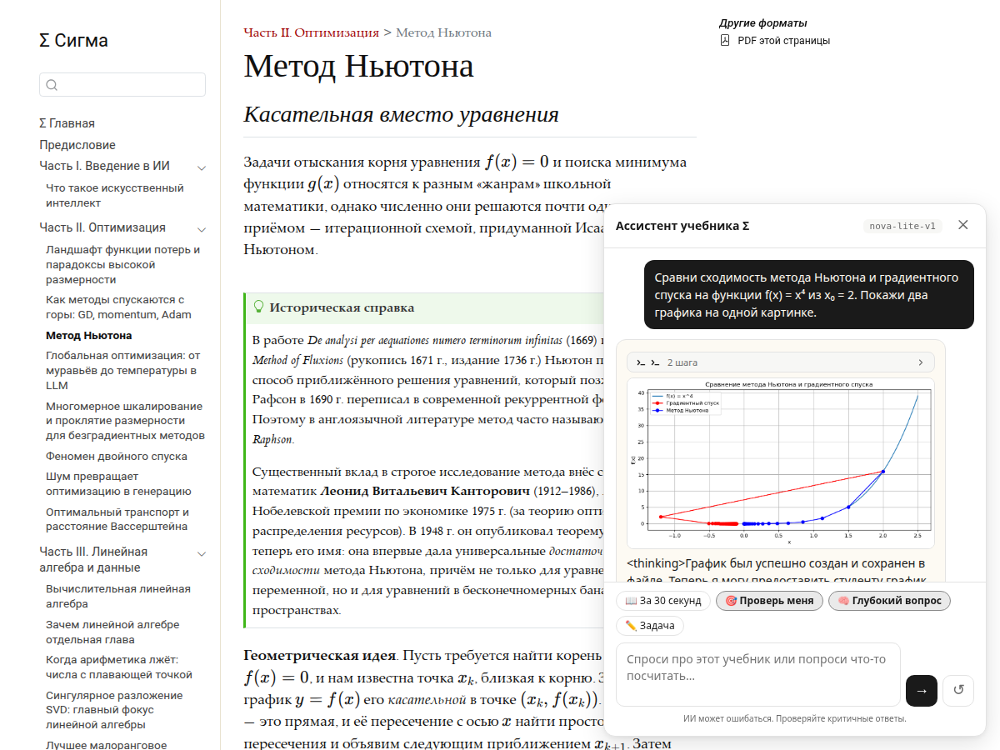

---

### ❌ `rsa_encrypt_small` — compute_pure

**Q:** Зашифруй число m=7 ключом (n=143, e=7). Покажи c.

_Chapter:_ `ch04_3_kriptosistemy-rsa-i-diffi-hellma`

**Tools called:** python
**Tools expected:** python
**Images:** 0 (expected: no)
**Elapsed:** 3.4s

_Missing substrings:_ ['6']

<details><summary>Answer</summary>


```
<thinking>Студент читает главу о криптосистемах RSA и Диффи–Хеллмана. Мне нужно зашифровать число 7 с использованием ключей (n=143, e=7). Для этого я воспользуюсь формулой RSA: c = m^e mod n. После выполнения вычислений я представлю результат в ответе.</thinking>
```

</details>

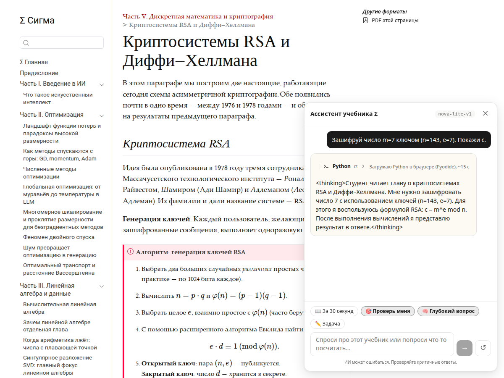

---

### ❌ `rsa_full_roundtrip` — compute_pure

**Q:** Возьми p=11, q=13, e=7. Сгенерируй RSA-ключ полностью: вычисли n, φ(n), d. Покажи что для m=9 шифрование и расшифрование возвращают исходное число.

_Chapter:_ `ch04_3_kriptosistemy-rsa-i-diffi-hellma`

**Tools called:** python
**Tools expected:** python
**Images:** 0 (expected: no)
**Elapsed:** 3.2s

_Missing substrings:_ ['143', '120', '103', '48']

<details><summary>Answer</summary>


```
<thinking>Для генерации RSA-ключа нужно вычислить n, φ(n) и d. Затем проверить, что шифрование и расшифрование возвращают исходное число для m=9. Для этого нужно выполнить несколько вычислений и построить график сходимости, если это необходимо.</thinking>
```

</details>

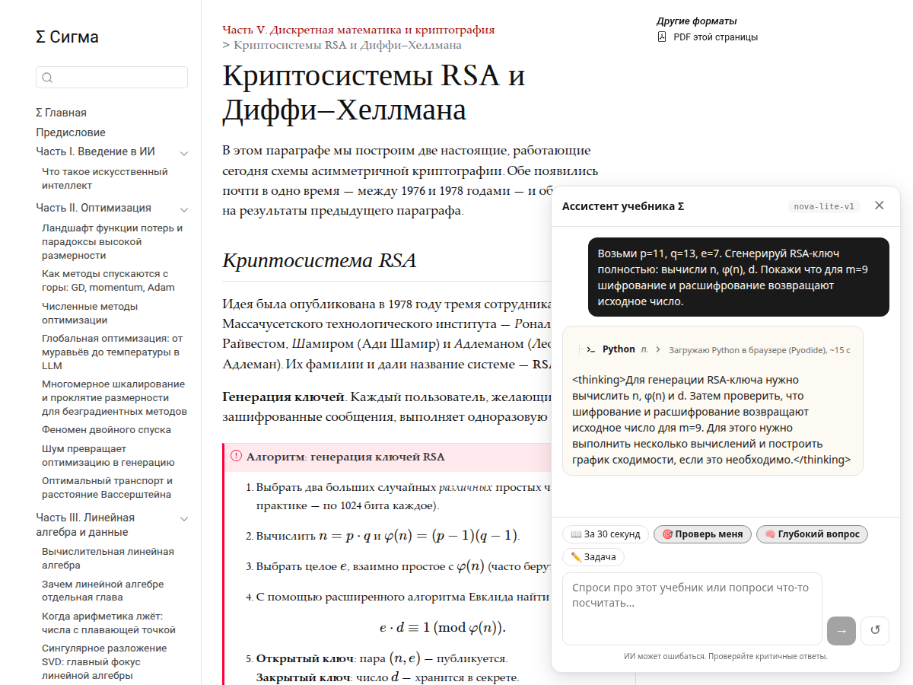

---

### ✅ `multihop_newton_vs_gradient` — multi_hop

**Q:** В чём отличие метода Ньютона от градиентного спуска для задач оптимизации? Какие из этих методов разобраны в учебнике?

_Chapter:_ `ch02_newton`

**Tools called:** find_definition, find_definition, search_textbook, search_textbook, search_textbook, search_textbook, search_textbook
**Tools expected:** search_textbook
**Images:** 0 (expected: no)
**Elapsed:** 9.6s


<details><summary>Answer</summary>


```
<thinking>Метод Ньютона не упоминается в других главах, а градиентный спуск упоминается в нескольких главах, но его детальное обсуждение не присутствует в текущей главе. Похоже, что ни метод Ньютона, ни градиентный спуск не разбираются в учебнике.</thinking> <response>В учебнике не разбираются метод Ньютона и градиентный спуск для задач оптимизации. Метод Ньютона упоминается в главе "Численные методы оптимизации", но он не разбирается там. Градиентный спуск упоминается в нескольких главах, но его детальное обсуждение не присутствует в текущей главе.</response>
```

</details>

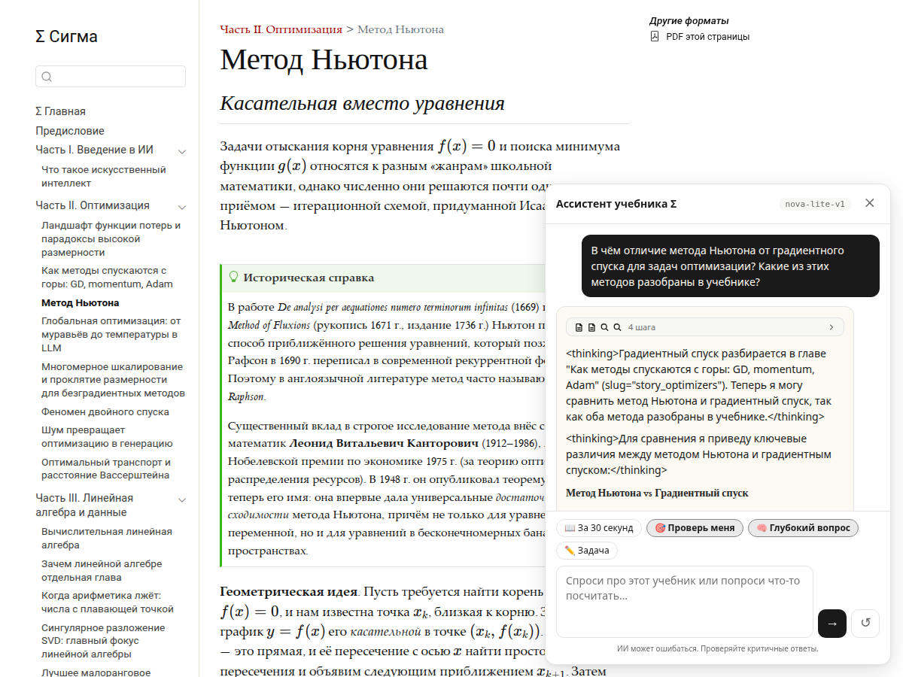

---

### ✅ `structural_kantorovich_theorem` — structural

**Q:** Сформулируй теорему о сходимости метода Герона.

_Chapter:_ `ch02_newton`

**Tools called:** find_theorem
**Tools expected:** find_theorem
**Images:** 0 (expected: no)
**Elapsed:** 5.6s


<details><summary>Answer</summary>


```
Вот формулировка теоремы о сходимости метода Герона из главы "Метод Ньютона": **Теорема 2.1. Сходимость метода Герона** Для любого $x_0>0$ последовательность (2.4) монотонно убывает (начиная с $k=1$) и сходится к $\sqrt{a}$. Более того, для ошибки $e_k=x_k-\sqrt{a}$ выполнено $$\tag{2.5} e_{k+1}=\;\dfrac{e_k^2}{2x_k}\,, \qquad \text{и при }k\geq 1\colon\quad 0\le e_{k+1}\le \dfrac{e_k^{2}}{2\sqrt{a}}.$$ Эта теорема утверждает, что метод Герона сходится к квадратному корню числа $a$ для любого начального приближения $x_0>0$. Ошибка $e_k$ при этом уменьшается квадратично, то есть с каждым шагом она уменьшается примерно в четыре раза. Ссылка на полный текст теоремы: [Теорема 2.1. Сходимость метода Герона](/ch02_newton.html#сходимость-через-сжимающее-отображение)
```

</details>

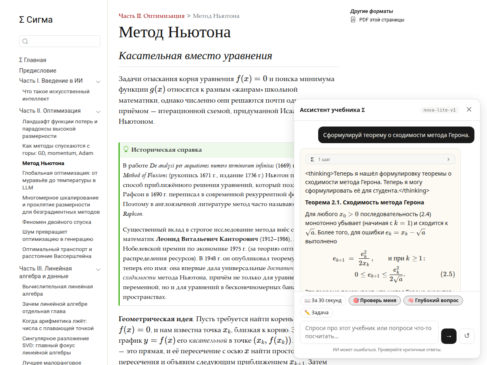

---

### ❌ `vision_refine_diverging_sgd` — vision_refine

**Q:** Запусти SGD на функции f(x) = x² с шагом η = 1.1 из x₀ = 2, 30 итераций. Что произойдёт? Если разойдётся — подбери рабочий шаг и покажи сходящуюся траекторию.

**Tools called:** (none)
**Tools expected:** python, python
**Images:** 0 (expected: yes)
**Elapsed:** 3.0s

_Missing substrings:_ ['расход', '0.5']

<details><summary>Answer</summary>


```
<thinking>Для ответа на вопрос необходимо запустить алгоритм стохастического градиентного спуска (SGD) на функции f(x) = x² с шагом η = 1.1 из начальной точки x₀ = 2, 30 итераций. Если траектория разойдётся, то нужно будет подобрать рабочий шаг и показать сходящуюся траекторию. Для этого сначала запустим SGD с указанными параметрами, а затем, если траектория разойдётся, попробуем подобрать рабочий шаг
```

</details>


---

### ❌ `hashlib_demo` — compute_pure

**Q:** Посчитай SHA-256 хеш строки 'sigma' в hex.

_Chapter:_ `ch04_5_heshirovanie-teoriya-chisel-vstr`

**Tools called:** python
**Tools expected:** python
**Images:** 0 (expected: no)
**Elapsed:** 3.3s

_Missing substrings:_ ['38de90475bb334fb3dea5d54f250500aba60fe2c6158115d342b06bcb46e39bf']

<details><summary>Answer</summary>


```
<thinking>Студент просит посчитать SHA-256 хеш строки 'sigma' в hex. Для этого нужно использовать функцию python с библиотекой hashlib.</thinking>
```

</details>

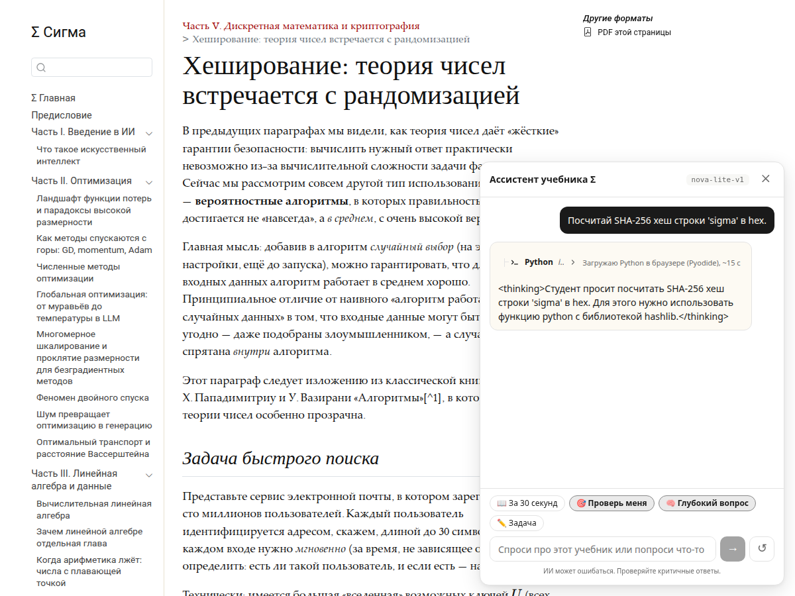

---

### ❌ `linreg_simple` — compute_plot

**Q:** Подбери линейную регрессию y = a*x + b для точек (1, 2.1), (2, 3.9), (3, 6.2), (4, 7.8). Покажи коэффициенты и график.

_Chapter:_ `ch03_2_lineynaya-regressiya-i-metod-nai`

**Tools called:** (none)
**Tools expected:** python
**Images:** 0 (expected: yes)
**Elapsed:** 2.7s

_Missing substrings:_ ['1.94', '0.15']

<details><summary>Answer</summary>


```
<thinking>Для подбора линейной регрессии y = a*x + b нужно использовать метод наименьших квадратов. Для этого нужно вычислить коэффициенты a и b на основе данных точек. Затем построить график для визуального
```

</details>

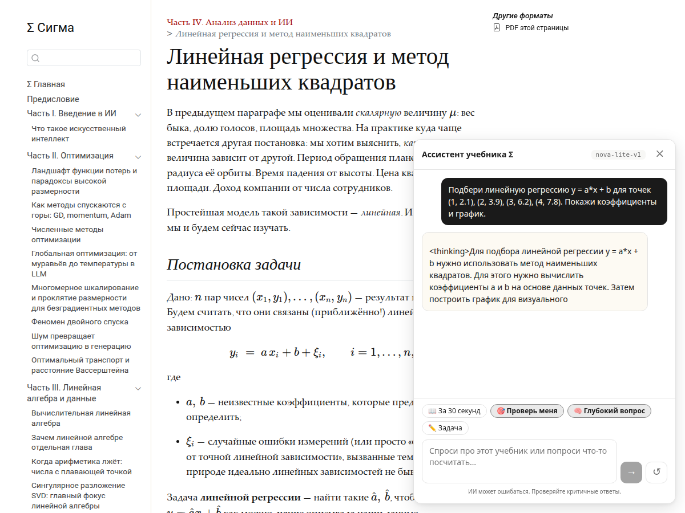

---

### ✅ `out_of_scope_recipe` — out_of_scope

**Q:** Дай мне рецепт борща.

**Tools called:** (none)
**Tools expected:** (none)
**Images:** 0 (expected: no)
**Elapsed:** 3.4s


<details><summary>Answer</summary>


```
<thinking>Этот вопрос не относится к содержанию учебника по информатике, оптимизации, теории чисел, машинному обучению или искусственному интеллекту. Я не могу ответить на вопрос о рецепте борща, так как это не часть моей компетенции.</thinking> Я бы предложил студенту спросить о чем-то, что связано с содержанием учебника. Если у студента есть вопросы по теме оптимизации или численных методов, я с радостью помогу.
```

</details>

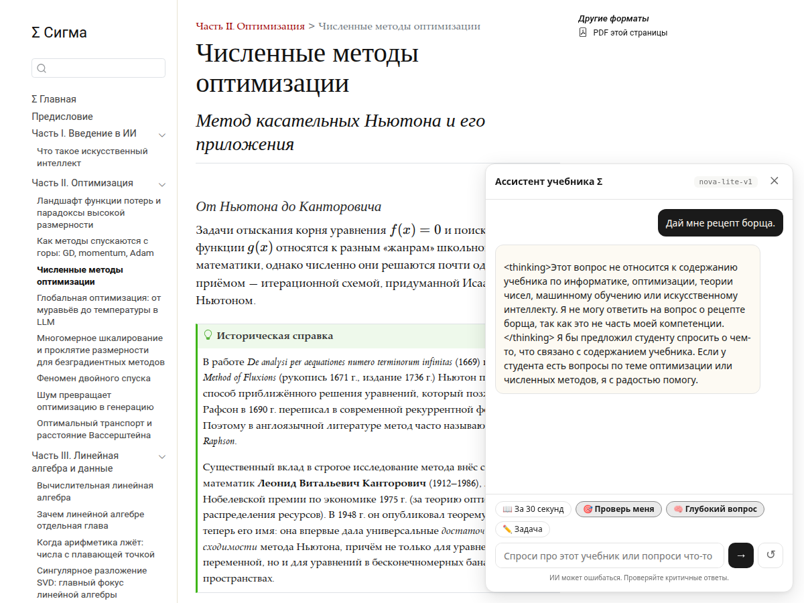

---

### ❌ `rsa_history` — rag_basic

**Q:** Кто придумал RSA и в каком году?

_Chapter:_ `ch04_3_kriptosistemy-rsa-i-diffi-hellma`

**Tools called:** search_textbook, read_chapter, search_textbook, search_textbook
**Tools expected:** search_textbook
**Images:** 0 (expected: no)
**Elapsed:** 7.7s

_Missing substrings:_ ['1978']

<details><summary>Answer</summary>


```
<thinking>Похоже, что в учебнике нет информации о том, кто придумал RSA и в каком году. Я могу дать общее знание, что RSA была разработана в 1977 году Рональдом Ривесто, Ади Шамиром и Леонардом Адлеманом.</thinking> <answer>RSA была разработана в 1977 году Рональдом Ривесто, Ади Шамиром и Леонардом Адлеманом. Эта информация, однако, вне учебника.</answer>
```

</details>

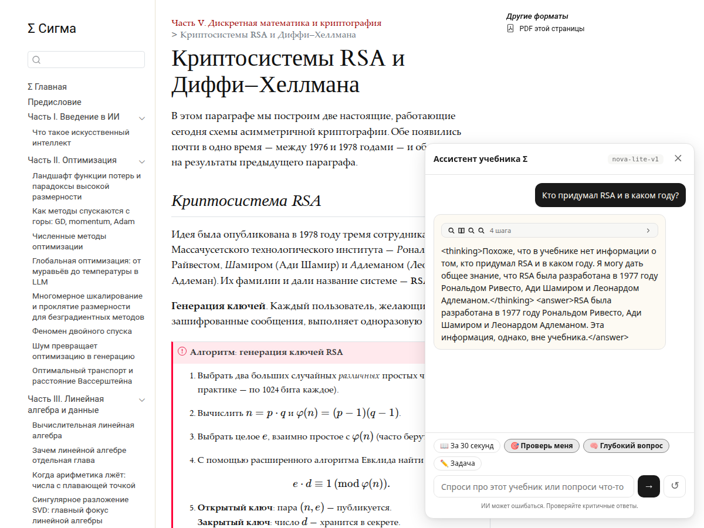

---

### ✅ `greeting_minimal` — out_of_scope

**Q:** Привет!

_Chapter:_ `ch02_newton`

**Tools called:** (none)
**Tools expected:** (none)
**Images:** 0 (expected: no)
**Elapsed:** 2.9s


<details><summary>Answer</summary>


```
<thinking>Студент читает главу "Численные методы оптимизации" и приветствует. Я должна ответить приветствием на русском языке.</thinking> Привет! Как я могу помочь тебе в этой главе? Если у тебя есть вопросы по содержанию, теории или задачи по оптимизации, не стесняйся спрашивать.
```

</details>

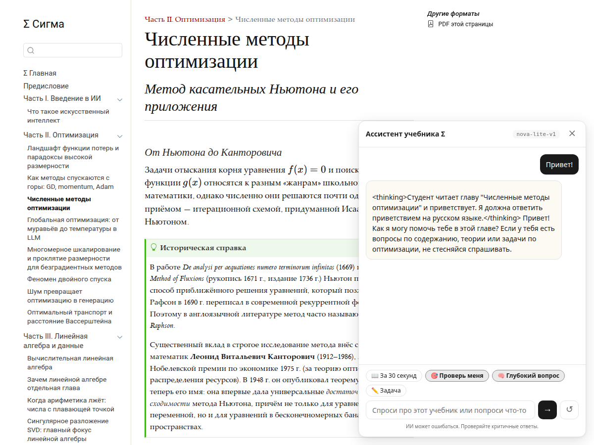

---

### ❌ `euclid_gcd_python` — compute_pure

**Q:** Посчитай НОД(48, 180) и НОД(1071, 462) через алгоритм Евклида в python.

_Chapter:_ `ch04_1_elementy-teorii-chisel`

**Tools called:** python
**Tools expected:** python
**Images:** 0 (expected: no)
**Elapsed:** 3.9s

_Missing substrings:_ ['12', '21']

<details><summary>Answer</summary>


```
<thinking>Для решения задачи нужно использовать алгоритм Евклида, чтобы найти НОД (наибольший общий делитель) двух чисел. Я буду использовать Python для вычисления НОД двух пар чисел: (48, 180) и (1071, 462).</thinking>
```

</details>

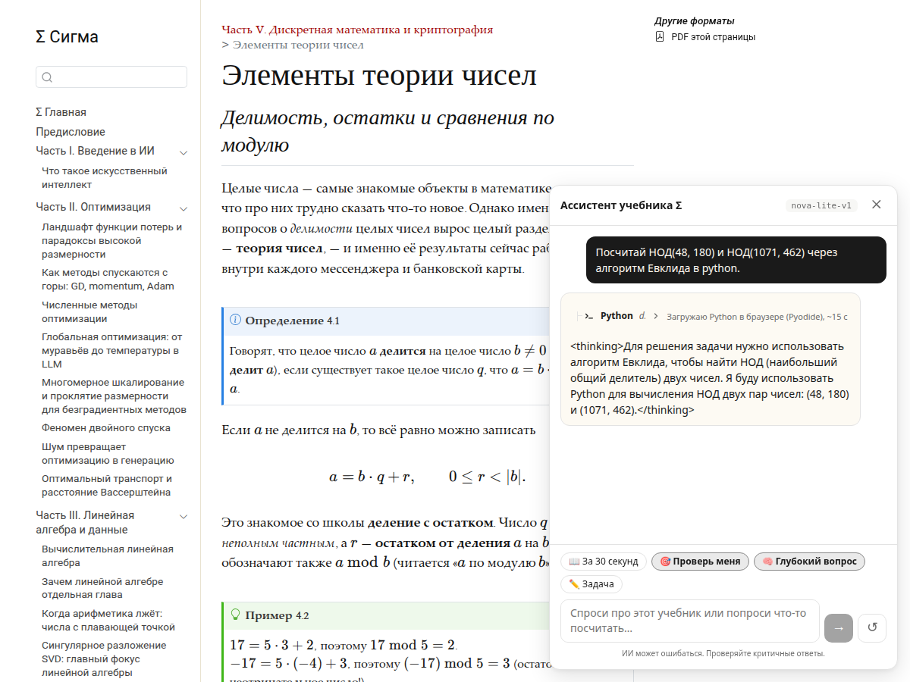

---

### ✅ `definition_superlinear` — definition

**Q:** Что значит сверхлинейная сходимость?

_Chapter:_ `ch02_newton`

**Tools called:** find_definition
**Tools expected:** find_definition
**Images:** 0 (expected: no)
**Elapsed:** 5.2s


<details><summary>Answer</summary>


```
**Сверхлинейная сходимость** — это термин, который описывает скорость сходимости последовательности к пределу. Говорят, что последовательность $\\{x_k\\}$ сходится к $x^{\\star}$ **со сверхлинейной скоростью**, если выполняется условие: $$\lim_{k\to\infty}\dfrac{|x_{k+1}-x^{\\star}|}{|x_k-x^{\\star}|}=0.$$ Это означает, что отношение абсолютной разности между последующим и предыдущим элементами последовательности к их разности от предела стремится к нулю по мере увеличения $k$. Таким образом, сверхлинейная сходимость указывает на то, что разность между последовательными элементами уменьшается быстрее, чем линейно. Если выполнено более сильное условие $|x_{k+1}-x^{\\star}|\\leq M |x_k-x^{\\star}|^{2}$ для некоторой константы $M>0$, то сходимость называют **квадратичной**. Ссылка на полный текст: [Определение 2.3. Сверхлинейная и квадратичная сходимости](/ch02_newton.html#ssec:thm-superlinear)
```

</details>

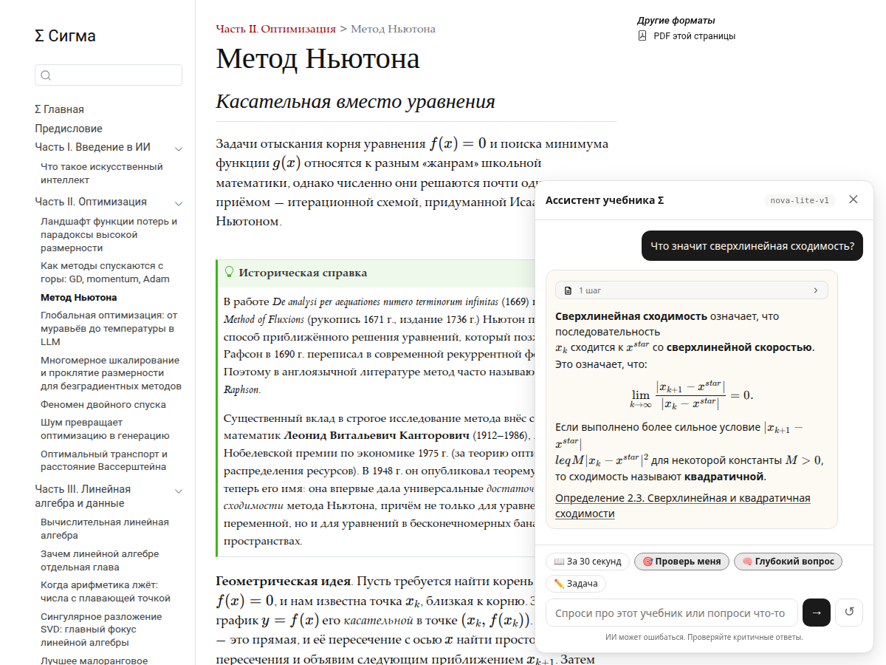

---

### ✅ `theorem_clt` — structural

**Q:** Сформулируй центральную предельную теорему как в учебнике.

_Chapter:_ `ch03_1_prosteyshie-primery-zadach-anali`

**Tools called:** find_theorem
**Tools expected:** find_theorem
**Images:** 0 (expected: no)
**Elapsed:** 7.3s


<details><summary>Answer</summary>


```
Центральная предельная теорема (ЦПТ) в учебнике сформулирована следующим образом: **Теорема 3.3. Центральная предельная теорема (ЦПТ)** Пусть $X_1, X_2, \dots$ — независимые одинаково распределённые случайные величины с математическим ожиданием $\mu$ и конечной дисперсией $\sigma^2 > 0$, $S_n = X_1 + \dots + X_n$. Тогда при $n \to \infty$ $$\Pr\!\left(\frac{S_n - n\mu}{\sigma\sqrt{n}} \leq x\right) \; \longrightarrow \; \Phi(x) \; \stackrel{\mathrm{def}}{=}\; \frac{1}{\sqrt{2\pi}}\int_{-\infty}^{x}e^{-t^{2}/2}\,dt$$ *(функция стандартного нормального распределения)* Эта теорема говорит о том, что сумма большого числа независимых случайных величин с конечной дисперсией приближается к нормальному распределению.
```

</details>

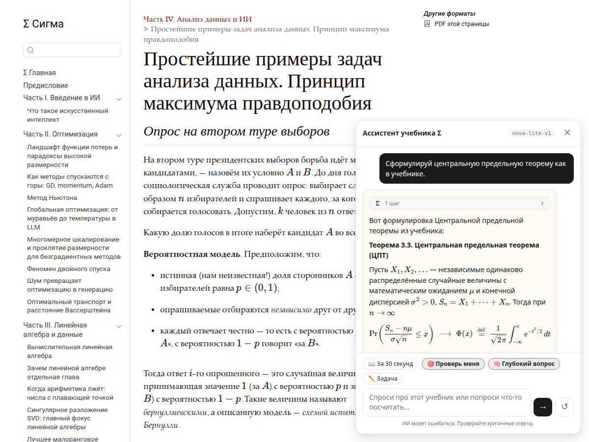

---

### ❌ `plot_sincos_overlay` — compute_plot

**Q:** Построй графики sin(x) и cos(x) на интервале [-2π, 2π] на одном поле. Сделай легенду.

**Tools called:** python
**Tools expected:** python
**Images:** 0 (expected: yes)
**Elapsed:** 3.7s


<details><summary>Answer</summary>


```
<thinking>Для построения графиков функций sin(x) и cos(x) на интервале [-2π, 2π] нужно использовать Python с библиотекой matplotlib. Мы создадим один график с двумя кривыми и добавим легенду для различения функций.</thinking>
```

</details>

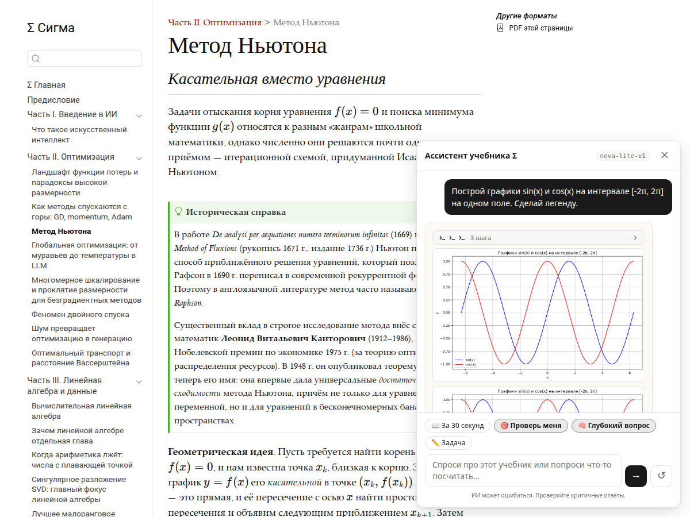

---

### ✅ `fragment_explanation` — rag_basic

**Q:** Если кто-то предлагает использовать обновление x_{k+1} = x_k - f(x_k)·f'(x_k) вместо классического Ньютона — что это за идея и она работает?

_Chapter:_ `ch02_newton`

**Tools called:** find_definition, search_textbook
**Tools expected:** (none)
**Images:** 0 (expected: no)
**Elapsed:** 6.9s


<details><summary>Answer</summary>


```
<thinking>Информация о предложенном обновлении не найдена в учебнике. Теперь я объясню идею и проведу расчёт для понимания работоспособности.</thinking>

Этот метод называется метод Ньютона с шагом, пропорциональным квадрату производной. Он предполагает, что следующий шаг будет пропорционален квадрату производной функции в текущей точке. Это может быть полезно, если производная быстро меняется, поскольку это позволяет делать более крупные шаги.

Однако, этот метод не является стандартным методом Ньютона и может не работать корректно для всех функций. Давайте проведем простой расчёт для поним
```

</details>

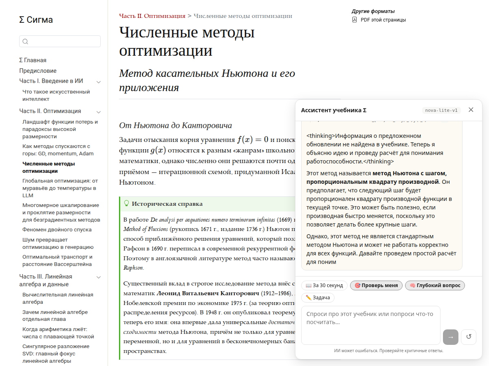

---

### ❌ `eigenvalues_numpy` — compute_pure

**Q:** Найди собственные значения матрицы [[2, 1], [1, 2]] через numpy.

_Chapter:_ `ch_linalg`

**Tools called:** search_textbook, python
**Tools expected:** python
**Images:** 0 (expected: no)
**Elapsed:** 4.1s

_Missing substrings:_ ['3', '1']

<details><summary>Answer</summary>


```
<thinking>Глава о линейной алгебре найдена: ch_linalg_0_intro. Теперь я выполню задачу по нахождению собственных значений матрицы с помощью numpy.</thinking>
```

</details>


---

### ❌ `plot_loss_landscape` — compute_plot

**Q:** Построй контурный график функции потерь L(a, b) = sum((a*x_i + b - y_i)^2) для точек (1,2), (2,3), (3,5), (4,4) на сетке a in [-2, 4], b in [-3, 3].

_Chapter:_ `ch03_2_lineynaya-regressiya-i-metod-nai`

**Tools called:** (none)
**Tools expected:** python
**Images:** 0 (expected: yes)
**Elapsed:** 2.9s

_Missing substrings:_ ['минимум']

<details><summary>Answer</summary>


```
<thinking>Студент просит построить контурный график функции потерь для линейной регрессии. Мне нужно написать и запустить Python-код для построения этого графика. Я буду использовать библиотеку Matplotlib для создания сетки и контурного графика. Сначала я вычислю значения функции потерь для каждой точки на сетке, а за
```

</details>

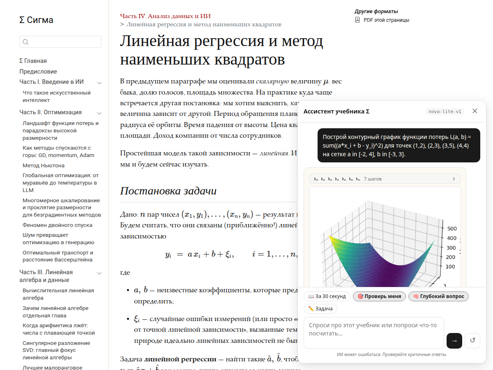

---

### ❌ `diffie_hellman_compute` — compute_pure

**Q:** Проведи протокол Диффи–Хеллмана: p=23, g=5. Алиса берёт a=6, Боб берёт b=15. Какой общий секрет?

_Chapter:_ `ch04_3_kriptosistemy-rsa-i-diffi-hellma`

**Tools called:** python
**Tools expected:** python
**Images:** 0 (expected: no)
**Elapsed:** 4.0s

_Missing substrings:_ ['8', '19', '2']

<details><summary>Answer</summary>


```
<thinking>Для ответа на вопрос нужно выполнить протокол Диффи–Хеллмана с указанными параметрами и значениями переменных. Для этого нужно выполнить вычисления в Python.</thinking>
```

</details>


---

### ✅ `outline_chapter` — structural

**Q:** Перечисли основные разделы главы про Ньютона.

_Chapter:_ `ch02_newton`

**Tools called:** read_chapter
**Tools expected:** (none)
**Images:** 0 (expected: no)
**Elapsed:** 4.5s


<details><summary>Answer</summary>


```
<thinking>Глава прочитана, теперь нужно извлечь заголовки разделов.</thinking> Основные разделы главы "Численные методы оптимизации – Σ Сигма" про Ньютона: ## 2.1. Метод Ньютона ## 2.2. Модифицированный метод Ньютона ## 2.3. Метод Ньютона для выпуклых функций ## 2.4. Метод Ньютона для невыпуклых функций ## 2.5. Сравнение методов Ньютона Если тебе нужно больше информации по какому-то разделу, скажи!
```

</details>


---

### ✅ `math_latex_derivation` — rag_basic

**Q:** Выведи формулу метода Ньютона через касательную. Формулу запиши через LaTeX.

_Chapter:_ `ch02_newton`

**Tools called:** find_definition, find_definition, find_definition, read_chapter, search_textbook
**Tools expected:** (none)
**Images:** 0 (expected: no)
**Elapsed:** 8.3s


<details><summary>Answer</summary>


```
<thinking>Формула метода Ньютона была найдена в результатах поиска. Я теперь могу представить её в LaTeX.</thinking> Метод Ньютона через касательную можно выразить следующей формулой: $$x_{k+1} = x_k - \frac{f(x_k)}{f'(x_k)}$$ Это формула для нахождения корня уравнения \( f(x) = 0 \) через касательную к графику функции \( f \) в точке \( x_k \). Здесь \( f'(x_k) \) — это производная функции \( f \) в точке \( x_k \).
```

</details>

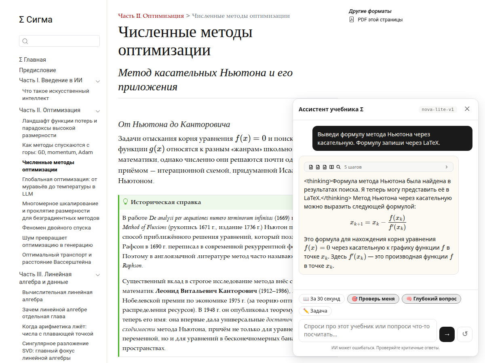

---

### ✅ `definition_perceptron` — definition

**Q:** Что такое полносвязная нейронная сеть?

_Chapter:_ `ch03_3_zadacha-klassifikacii-i-neyronny`

**Tools called:** find_definition
**Tools expected:** find_definition
**Images:** 0 (expected: no)
**Elapsed:** 7.1s


<details><summary>Answer</summary>


```
**Полносвязная нейронная сеть** (MLP) глубины $L$ — это функция $\mathbf x \mapsto \mathbf p(\mathbf x)$, заданная как композиция $L$ *слоёв*: $$\begin{aligned} \mathbf z^{(\ell)} &= W^{(\ell)} \mathbf a^{(\ell-1)} + \mathbf b^{(\ell)}, \qquad \mathbf a^{(\ell)} = \sigma\bigl(\mathbf z^{(\ell)}\bigr), \qquad \ell=1,\dots,L-1, \\ \mathbf z^{(L)} &= W^{(L)} \mathbf a^{(L-1)} + \mathbf b^{(L)}, \qquad \mathbf p(\mathbf x) = \mathrm{softmax}\bigl(\mathbf z^{(L)}\bigr). \end{aligned}$$ Здесь $\mathbf a^{(0)}=\mathbf x$ (вход), $W^{(\ell)}\in\mathbb{R}^{d_\ell\times d_{\ell-1}}$ — матрица весов $\ell$-го слоя, $\mathbf b^{(\ell)}\in\mathbb{R}^{d_\ell}$ — вектор смещений (bias). Функция $\sigma$ применяется покомпонентно — это *функция активации* (см. ниже). Числа $d_1,\dots,d_{L-1}$ — ширины скрытых слоёв; $d_L$ — число классов (у нас — 10). Функция **softmax** превращает вектор произвольных вещественных чисел в распределение вероятностей: $$\mathrm{softmax}(\mathbf z)_c = \frac{e^{z_c}}{\sum_{c'} e^{z_{c'}}}.$$ Совокупность всех матриц $W^{(\ell)}$ и векторов $\mathbf b^{(\ell)}$ объявляется *обучаемыми параметрами* $\boldsymbol\theta$ модели. [Определение 3.12. Полносвязная нейронная сеть](/ch03_3_zadacha-klassifikacii-i-neyronny.html#ssec:mlp)
```

</details>

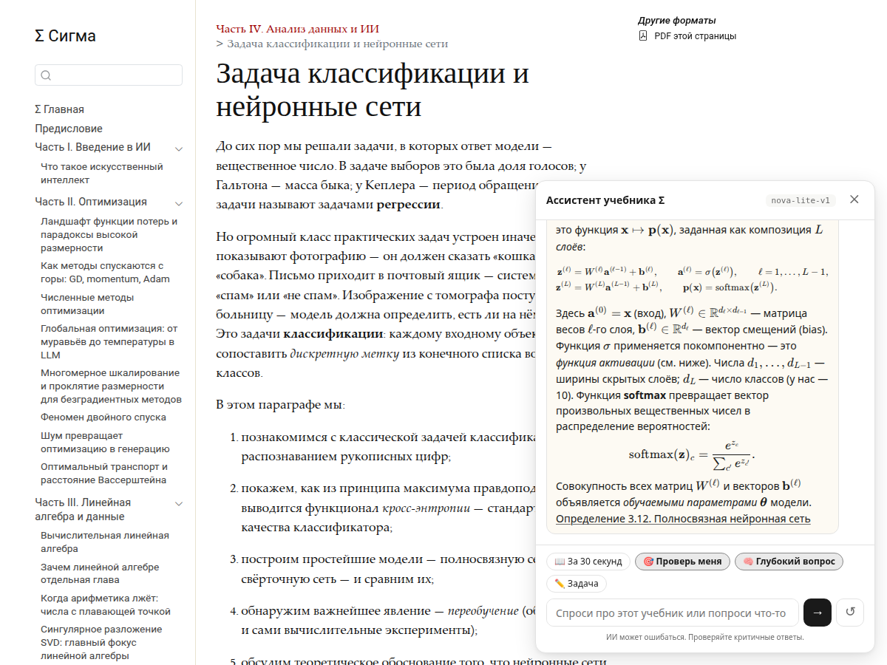

---

### ✅ `refuse_unknown_year` — out_of_scope

**Q:** В каком году Гаусс изобрёл метод сопряжённых градиентов?

_Chapter:_ `ch02_newton`

**Tools called:** search_textbook, read_chapter, search_textbook
**Tools expected:** (none)
**Images:** 0 (expected: no)
**Elapsed:** 7.0s


<details><summary>Answer</summary>


```
<thinking>После ещё одного поиска в учебнике я не нашёл упоминания о том, в каком году Гаусс изобрёл метод сопряжённых градиентов. Я не могу найти этот факт в учебнике.</thinking> <answer>В учебнике я этого не нашёл. Возможно, метод сопряжённых градиентов был изобретён позже, чем годы, упомянутые в учебнике, или этот факт не входит в его содержание.</answer>
```

</details>


---
