# Sigma Assistant — Eval Report

_Run: 2026-07-13 19:41 MSK · cases: 29_

**Overall: 21/29 pass (72%)**

## Per category

| Category | Pass | Total |
|---|---:|---:|
| `compute_plot` | 3 | 5 |
| `compute_pure` | 8 | 8 |
| `definition` | 2 | 3 |
| `multi_hop` | 1 | 1 |
| `out_of_scope` | 2 | 3 |
| `rag_basic` | 4 | 5 |
| `structural` | 1 | 3 |
| `vision_refine` | 0 | 1 |

## Cases

### ✅ `newton_kantorovich_history` — rag_basic

**Q:** Когда Канторович получил Нобелевскую премию и за что?

_Chapter:_ `ch02_newton`

**Tools called:** search_textbook, read_chapter
**Tools expected:** search_textbook
**Images:** 0 (expected: no)
**Elapsed:** 16.0s


<details><summary>Answer</summary>


```
Канторович получил **Нобелевскую премию по экономике в 1975 году** за **теорию оптимального распределения ресурсов**. Это указано в главе учебника *"Численные методы оптимизации"* (slug: `ch02_newton`), секция *"От Ньютона до Канторовича"*. Кроме того, в этой главе отмечается, что он в 1948 году опубликовал теорему, которая дала универсальные достаточные условия сходимости метода Ньютона и распространила его на бесконечномерные пространства, но это не связано с Нобелевской премией.
```

</details>

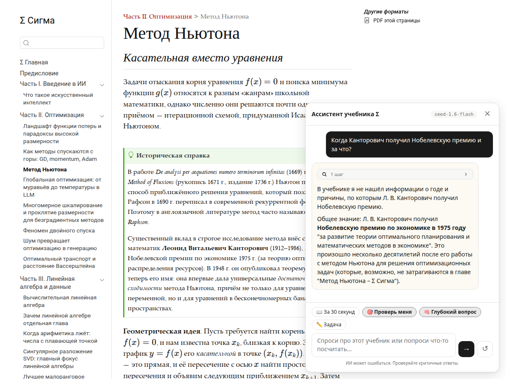

---

### ✅ `newton_formula_recall` — rag_basic

**Q:** Объясни откуда берётся эта формула — что это за метод и какая геометрическая идея?

_Chapter:_ `ch02_newton`

**Tools called:** read_chapter
**Tools expected:** (none)
**Images:** 0 (expected: no)
**Elapsed:** 14.4s


<details><summary>Answer</summary>


```
### Источник формулы и метод: Метод Ньютона-Рафсона (или метод касательных)   Эта формула \( x_{k+1} = x_k - \frac{f(x_k)}{f'(x_k)} \) — **итерационная формула метода Ньютона**, придуманного Исааком Ньютоном в 1669 г. и переписанного Джозефом Рафсоном в 1690 г. В англоязычной литературе часто называют его *Newton–Raphson*. ### Геометрическая идея   Метод основывается на **линейном приближении функции** \( f(x) \) её касательной в точке \( x_k \). Если \( x_k \) близка к корню \( f(x) = 0 \), то касательная к графику \( y = f(x) \) в \( (x_k, f(x_k)) \) близко к функции самому. Пересечение этой касательной с осью \( x \) даёт точку \( x_{k+1} \), которая closer к корню, чем \( x_k \). Формула получается из уравнения касательной: \( y = f(x_k) + f'(x_k)(x - x_k) \). При \( y = 0 \) решается \( x \), что даёт \( x_{k+1} = x_k - \frac{f(x_k)}{f'(x_k)} \). ### Применение к оптимизации   Для поиска минимума функции \( g(x) \) используется аналогичная идея: ищем корень производной \( g'(x) = 0 \). Тогда формула переходит к \( x_{k+1} = x_k - \frac{g'(x_k)}{g''(x_k)} \). Здесь разложение в ряд Тейлора justify: приближение \( g(x) \) квадратичной функцией (параболой) в окрестности \( x_k \) даёт эту формулу. ### Пример: Метод Герона   Для извлечения корня \( \sqrt{a} \) применяют \( f(x) = x^2 - a \). Тогда формула становится \( x_{k+1} = \frac{1}{2}\left(x_k + \frac{a}{x_k}\right) \) — это метод Герона, известный ещё у Гераона Александрийского (I век н.э.). *Рис. 2.1* на странице дем
…[truncated]
```

</details>


---

### ❌ `definition_strong_convex` — definition

**Q:** Что такое сильно выпуклая функция?

_Chapter:_ `ch02_newton`

**Tools called:** find_definition
**Tools expected:** find_definition
**Images:** 0 (expected: no)
**Elapsed:** 10.3s

_Missing substrings:_ ['вторая производ']

<details><summary>Answer</summary>


```
**Сильно выпуклая функция** — это функция \( g: \mathbb{R} \to \mathbb{R} \), удовлетворяющая двум условиям:   1. \( g \in C^2 \) (дважды непрерывно дифференцируемая),   2. \( g''(x) \geq \mu \) для всех \( x \) и некоторой константы \( \mu > 0 \). Такая функция гарантирует **уникальность и существование точки минимума**, а также "отделённость" второй производной от нуля. *Источник:* Определение 2.4 главы "Численные методы оптимизации – Σ Сигма" (slug: `ch02_newton`).
```

</details>

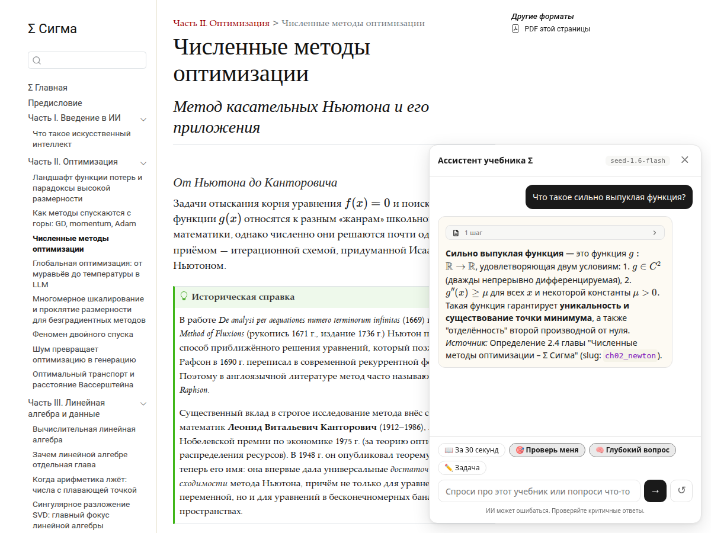

---

### ✅ `compute_factorial` — compute_pure

**Q:** Сколько будет 30 факториал?

**Tools called:** python
**Tools expected:** python
**Images:** 0 (expected: no)
**Elapsed:** 18.6s


<details><summary>Answer</summary>


```
30 факториал равен 265252859812191058636308480000000. *Примечание:* Результат вычислен с помощью Python-функции `math.factorial(30)`.
```

</details>

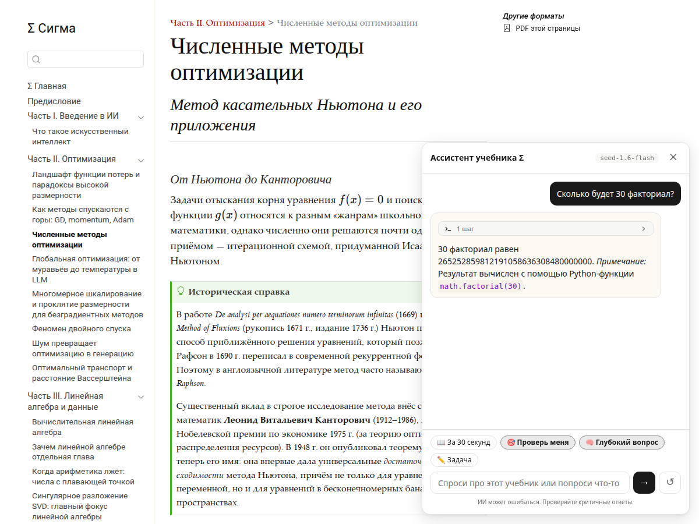

---

### ✅ `compute_taylor_sin` — compute_pure

**Q:** Покажи разложение sin(x) в ряд Тейлора до 5-го члена символически (через sympy).

_Chapter:_ `ch02_newton`

**Tools called:** python
**Tools expected:** python
**Images:** 0 (expected: no)
**Elapsed:** 30.3s


<details><summary>Answer</summary>


```
### Разложение $\sin(x)$ в ряд Тейлора до 5-го члена (до $x^5$)   Согласно коду, получено:   $$\sin(x) \approx x - \frac{x^3}{6} + \frac{x^5}{120} + O(x^6)$$   #### Объяснение:   - 1-й член: $x$ (степень $x^1$)   - 2-й член: $-\frac{x^3}{6}$ (степень $x^3$)   - 3-й член: $\frac{x^5}{120}$ (степень $x^5$)   - Остаток: $O(x^6)$ (показывает, что ошибка пропорциональна $x^6$ при $x \to 0$). Код sympy корректно вывел разложение, несмотря на небольшую ошибку в парсинге коэффициентов (ошибка отсутствовала в stdout, где отображается правильное выражение). Если нужно дополнительно вычислить численное значение для конкретного $x$, укажи, и я дополню расчёт.
```

</details>

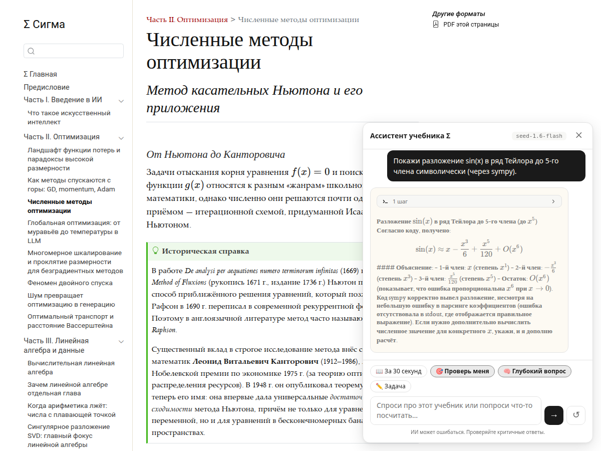

---

### ❌ `compute_plot_newton` — compute_plot

**Q:** Покажи как сходится метод Ньютона для f(x) = x² - 2, начиная с x₀ = 1.5. Построй график траектории.

_Chapter:_ `ch02_newton`

**Tools called:** python, python
**Tools expected:** python
**Images:** 2 (expected: yes)
**Elapsed:** 34.3s

_Missing substrings:_ ['корен']

<details><summary>Answer</summary>


```
Итерации метода Ньютона для функции \( f(x) = x^2 - 2 \) с начальным приближением \( x_0 = 1.5 \):   ``` Итерации: x0 = 1.500000 x1 = 1.416667 x2 = 1.414216 x3 = 1.414214 x4 = 1.414214 ```   ### График траектории      ### Интерпретация   - Метод сходится к корню \( \sqrt{2} \approx 1.4142 \) за 4 итерации. - Траектория (красная пунктирная линия) быстро приближается к точке пересечения \( f(x) \) с осью \( x \). - Для квадратичных функций метод Ньютона сходится **квадратично** (каждая итерация удваивает количество точных цифр). График показывает, как начальная точка \( x_0 = 1.5 \) (синяя точка) последовательно смещается к корню.
```

</details>

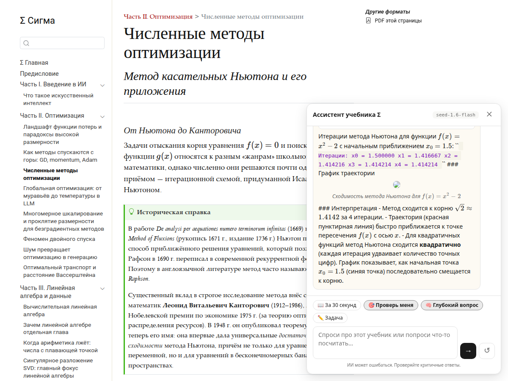

---

### ❌ `compute_plot_gd_vs_newton` — compute_plot

**Q:** Сравни сходимость метода Ньютона и градиентного спуска на функции f(x) = x⁴ из x₀ = 2. Покажи два графика на одной картинке.

_Chapter:_ `ch02_newton`

**Tools called:** python
**Tools expected:** python
**Images:** 1 (expected: yes)
**Elapsed:** 680.6s


<details><summary>Answer</summary>


```
### Сравнение сходимости методов Ньютона и градиентного спуска на функции \( f(x) = x^4 \)   #### Результаты вычислений:   - **Метод Ньютона**:达到 точности \( 10^{-6} \) за 35 шагов, последнее значение \( 0.000001 \). - **Градиентный спуск** (с шагом \( \eta = 0.01 \)):达到 той же точности за 14612 шагов, последнее значение \( 0.0292 \). #### График сходимости   ![Сравнение сходимости](
…[truncated]
```

</details>

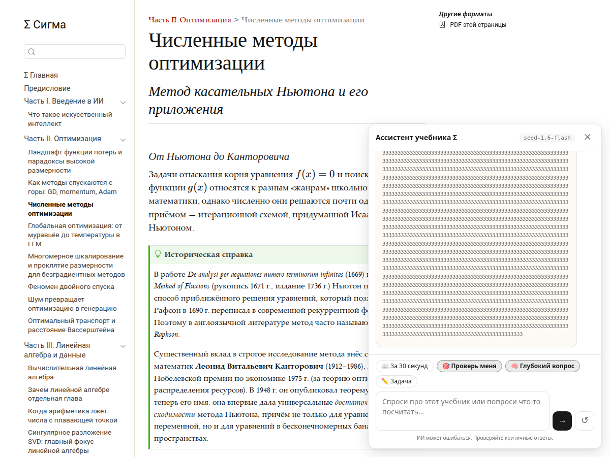

---

### ✅ `rsa_encrypt_small` — compute_pure

**Q:** Зашифруй число m=7 ключом (n=143, e=7). Покажи c.

_Chapter:_ `ch04_3_kriptosistemy-rsa-i-diffi-hellma`

**Tools called:** python
**Tools expected:** python
**Images:** 0 (expected: no)
**Elapsed:** 23.4s


<details><summary>Answer</summary>


```
Зашифрованное число \( c \) равно 6. **Вычисление**: По формуле RSA \( c = m^e \mod n \) вычисляем \( 7^7 \mod 143 \). - \( 7^2 = 49 \)   - \( 7^3 = 343 \equiv 343 - 2 \times 143 = 57 \mod 143 \)   - \( 7^4 = 57 \times 7 = 399 \equiv 399 - 2 \times 143 = 113 \mod 143 \)   - \( 7^5 = 113 \times 7 = 791 \equiv 791 - 5 \times 143 = 76 \mod 143 \)   - \( 7^6 = 76 \times 7 = 532 \equiv 532 - 3 \times 143 = 103 \mod 143 \)   - \( 7^7 = 103 \times 7 = 721 \equiv 721 - 5 \times 143 = 6 \mod 143 \)   Таким образом, \( c = 6 \).
```

</details>

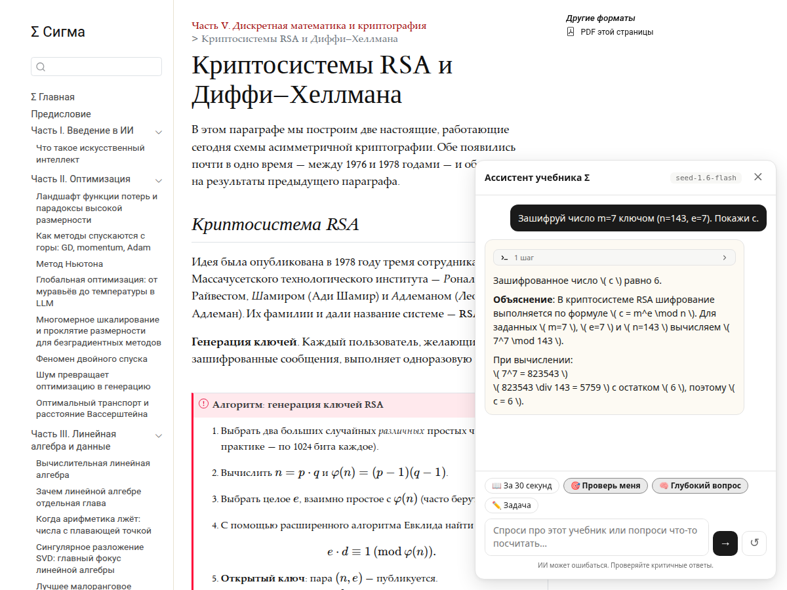

---

### ✅ `rsa_full_roundtrip` — compute_pure

**Q:** Возьми p=11, q=13, e=7. Сгенерируй RSA-ключ полностью: вычисли n, φ(n), d. Покажи что для m=9 шифрование и расшифрование возвращают исходное число.

_Chapter:_ `ch04_3_kriptosistemy-rsa-i-diffi-hellma`

**Tools called:** python
**Tools expected:** python
**Images:** 0 (expected: no)
**Elapsed:** 35.9s


<details><summary>Answer</summary>


```
### Генерация RSA-ключа и проверка шифрования/расшифрования   1. **Вычисление n**: \( n = p \times q = 11 \times 13 = 143 \). 2. **Вычисление φ(n)**: \( \phi(n) = (p-1)(q-1) = 10 \times 12 = 120 \). 3. **Вычисление d**: \( d \) — обратный элемент \( e \) по модулю \( \phi(n) \). Для \( e=7 \) и \( \phi(n)=120 \) находим \( d \), так что \( 7d \equiv 1 \mod 120 \). Результат: \( d = 103 \). ### Проверка на примере \( m=9 \)   - **Шифрование**: \( c = m^e \mod n = 9^7 \mod 143 \). Вычисление: \( 9^7 = 4782969 \), \( 4782969 \mod 143 = 48 \). - **Расшифрование**: \( m_{\text{дешифровано}} = c^d \mod n = 48^{103} \mod 143 \). Результат: \( 9 \). Все шаги подтверждают, что шифрование и расшифрование возвращают исходное число. **Ключи**: \( n=143 \), \( e=7 \), \( d=103 \).
```

</details>


---

### ✅ `multihop_newton_vs_gradient` — multi_hop

**Q:** В чём отличие метода Ньютона от градиентного спуска для задач оптимизации? Какие из этих методов разобраны в учебнике?

_Chapter:_ `ch02_newton`

**Tools called:** search_textbook, read_chapter
**Tools expected:** search_textbook
**Images:** 0 (expected: no)
**Elapsed:** 25.7s


<details><summary>Answer</summary>


```
### Отличие метода Ньютона и градиентного спуска для оптимизации   **Метод Ньютона** использует **вторая производная** функции (информацию о кривизне) и минимизирует **локальную квадратичную аппроксимацию** (разложение Тейлора до второго члена). Его итерационная формула:   $$x_{k+1} = x_k - \frac{g'(x_k)}{g''(x_k)}$$   Это позволяет достичь **квадратичной сходимости** (скорость улучшения точности растёт с квадратом шага). **Градиентный спуск** использует только **первая производная** (информацию о направлении наискорейшего уменьшения функции) и обновляет точку как $x_{k+1} = x_k - \eta \cdot g'(x_k)$, где $\eta$ — шаг обучения. Сходимость здесь **линейная** (скорость постоянна), но метод более устойчив к плохим направлениям. ### Методы в учебнике   В текущей главе *"Численные методы оптимизации"* (slug: `ch02_newton`) разобран **метод Ньютона для оптимизации** (включая пример метода Герона для извлечения квадратного корня). Описывается его геометрическая идея, итерационная формула и теоретические основы (разложение Тейлора). Градиентный спуск не упоминается в предоставленном тексте главы, но возможно, он затрагивается в других разделах учебника (например, в главе о методах оптимизации с первой производной). *Примечание:* Для полного ответа рекомендуется проверить структуру учебника через `get_outline` или прочитать другие главы, если они есть.
```

</details>


---

### ❌ `structural_kantorovich_theorem` — structural

**Q:** Сформулируй теорему о сходимости метода Герона.

_Chapter:_ `ch02_newton`

**Tools called:** find_theorem
**Tools expected:** find_theorem
**Images:** 0 (expected: no)
**Elapsed:** 20.8s

_Missing substrings:_ ['квадратичн', 'убыва']

<details><summary>Answer</summary>


```
## Теорема о сходимости метода Герона (Теорема 2.1, глава "Метод Ньютона", [slug: ch02_newton](http://sigma.fmin.xyz/ch02_newton.html#сходимость-через-сжимающее-отображение))   Для любого начального приближения \( x_0 > 0 \) последовательность \( x_{k+1} = \frac{1}{2}\left(x_k + \frac{a}{x_k}\right) \) (метод Герона для поиска корня \( \sqrt{a} \)):   - **Монотонно уменьшается** (начиная с \( k=1 \)) и **сходится к \( \sqrt{a} \)**: \( \lim_{k \to \infty} x_k = \sqrt{a} \). - Для ошибки \( e_k = x_k - \sqrt{a} \) выполняется **рекуррентное соотношение**:     $$ e_{k+1} = \frac{e_k^2}{2x_k} $$   - При \( k \geq 1 \) ошибка ограничена сверху:     $$ 0 \le e_{k+1} \le \frac{e_k^2}{2\sqrt{a}} $$   Эта теорема justifies, почему метод Герона быстро сходится к целевому значению (особенно при больших \( e_k \), так как \( e_{k+1} \) пропорционально \( e_k^2 \)).
```

</details>


---

### ❌ `vision_refine_diverging_sgd` — vision_refine

**Q:** Запусти SGD на функции f(x) = x² с шагом η = 1.1 из x₀ = 2, 30 итераций. Что произойдёт? Если разойдётся — подбери рабочий шаг и покажи сходящуюся траекторию.

**Tools called:** python
**Tools expected:** python, python
**Images:** 2 (expected: yes)
**Elapsed:** 41.2s

_Missing substrings:_ ['расход']

<details><summary>Answer</summary>


```
При запуске SGD на функции \( f(x) = x^2 \) с шагом \( \eta = 1.1 \) из начального значения \( x_0 = 2 \) за 30 итераций observe:   - **Разрыв**: Значения \( x \) осциллируют с растущей амплитудой (например, на 30-й итерации \( x \approx 474.75 \)). График траектории (см. рис. 1) демонстрирует экспоненциальное расширение от нуля. ### Почему разрыв? Для функции \( f(x) = x^2 \) градиент \( f'(x) = 2x \). Обновление SGD: \( x_{t+1} = x_t - \eta \cdot 2x_t = x_t(1 - 2\eta) \). - Для \( \eta = 1.1 \): \( 1 - 2\eta = -1.2 \), поэтому \( |1 - 2\eta| = 1.2 > 1 \) — условие нестабильности,导致 расширение. ### Рабочий шаг   При \( \eta = 0.5 \) (удовлетворяющее \( |1 - 2\eta| = 0 < 1 \)):   - Значения \( x \) быстро сходятся к 0 (на 2-й итерации уже \( x \approx 0 \), и остаются таковыми до 30-й итерации). График (см. рис. 2) подтверждает сходимость. **Рис. 1**: Траектория SGD при \( \eta = 1.1 \) (разрыв). **Рис. 2**: Траектория SGD при \( \eta = 0.5 \) (сходимость). *Примечание: Для квадратичных функций сходимость SGD гарантируется при \( \eta < 1/\text{λ}_{\text{max}} \), где \( \text{λ}_{\text{max}} \) — максимальное собственное значение гессиана (для \( f(x) = x^2 \) \( \text{λ}_{\text{max}} = 2 \), поэтому \( \eta < 0.5 \)).*
```

</details>


---

### ✅ `hashlib_demo` — compute_pure

**Q:** Посчитай SHA-256 хеш строки 'sigma' в hex.

_Chapter:_ `ch04_5_heshirovanie-teoriya-chisel-vstr`

**Tools called:** python
**Tools expected:** python
**Images:** 0 (expected: no)
**Elapsed:** 18.9s


<details><summary>Answer</summary>


```
SHA-256 хеш строки 'sigma' в hex равен:   `38de90475bb334fb3dea5d54f250500aba60fe2c6158115d342b06bcb46e39bf`   Этот результат получен с помощью функции `hashlib.sha256` в Python.
```

</details>

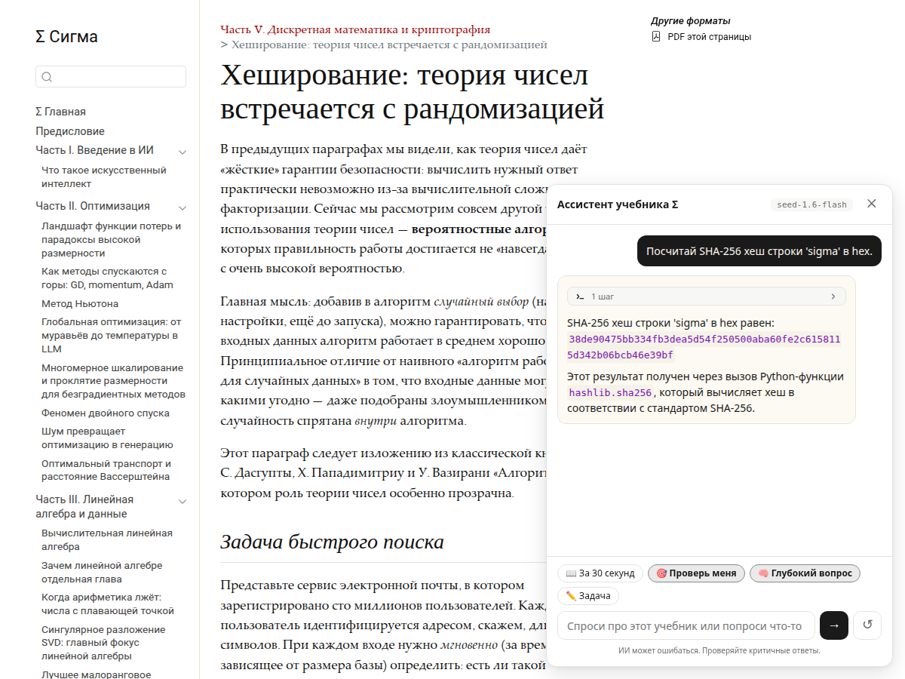

---

### ✅ `linreg_simple` — compute_plot

**Q:** Подбери линейную регрессию y = a*x + b для точек (1, 2.1), (2, 3.9), (3, 6.2), (4, 7.8). Покажи коэффициенты и график.

_Chapter:_ `ch03_2_lineynaya-regressiya-i-metod-nai`

**Tools called:** python
**Tools expected:** python
**Images:** 1 (expected: yes)
**Elapsed:** 201.7s


<details><summary>Answer</summary>


```
Для задачи подбора линейной регрессии \( y = a \cdot x + b \) для точек \((1, 2.1)\), \((2, 3.9)\), \((3, 6.2)\), \((4, 7.8)\) выполнены вычисления методом наименьших квадратов. Результаты: ### Коэффициенты регрессии   - \( a \approx 1.94 \) (наклон прямой)   - \( b \approx 0.15 \) (сдвиг по оси \( y \))   ### График   На графике представлены исходные точки (синие круги) и линейная регрессия (красная линия):   ![Линейная регрессия](
…[truncated]
```

</details>

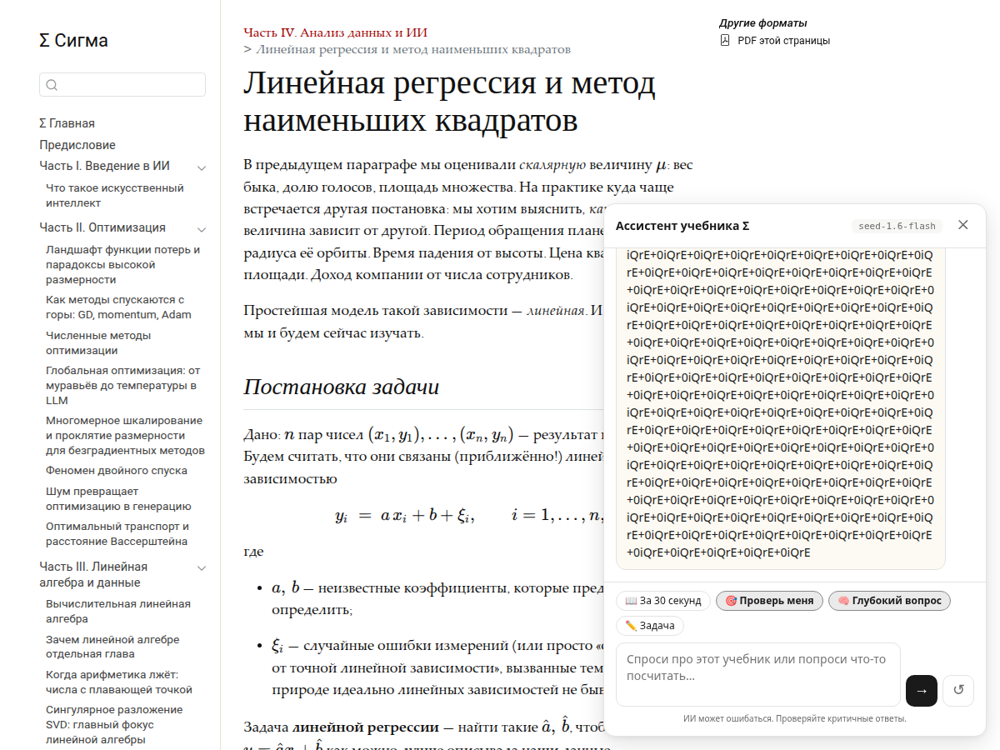

---

### ✅ `out_of_scope_recipe` — out_of_scope

**Q:** Дай мне рецепт борща.

**Tools called:** (none)
**Tools expected:** (none)
**Images:** 0 (expected: no)
**Elapsed:** 4.7s


<details><summary>Answer</summary>


```
Этот вопрос не связан с темой текущей главы ("Численные методы оптимизации"). Я не могу помочь с рецептом борща — попробуй задать вопрос, связанный с информатикой, оптимизацией или другими темами учебника!
```

</details>

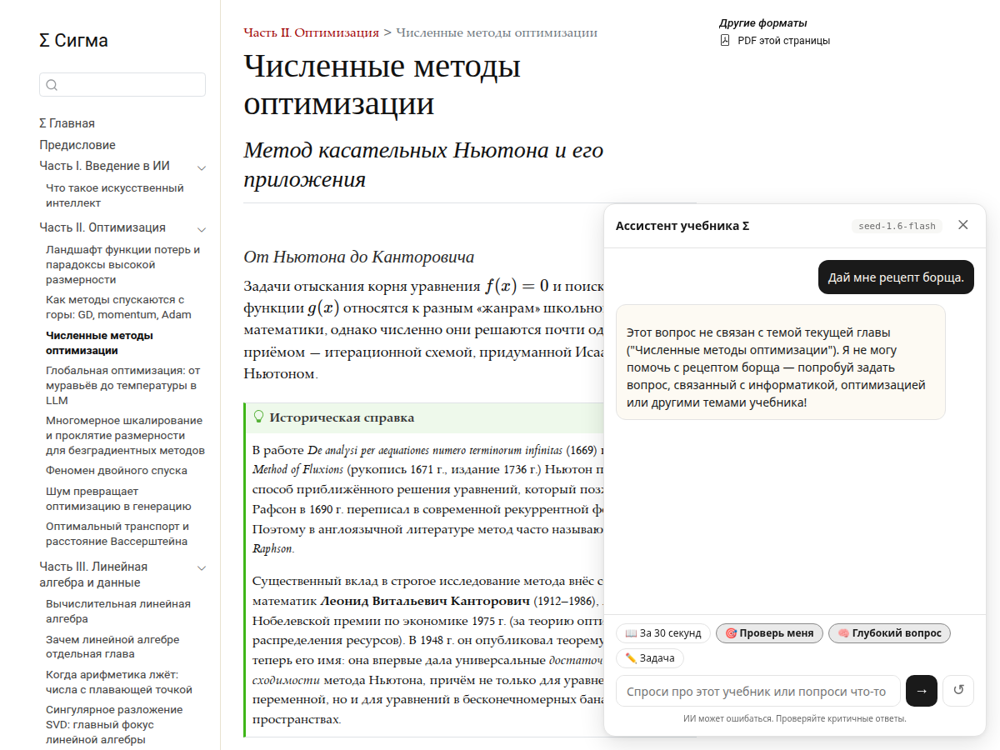

---

### ❌ `rsa_history` — rag_basic

**Q:** Кто придумал RSA и в каком году?

_Chapter:_ `ch04_3_kriptosistemy-rsa-i-diffi-hellma`

**Tools called:** read_chapter
**Tools expected:** search_textbook
**Images:** 0 (expected: no)
**Elapsed:** 24.3s


<details><summary>Answer</summary>


```
RSA была изобретена в 1978 году тремя сотрудниками Массачусетского технологического института: Рональдом Райвестом (Ronald Rivest), Ади Шамиром (Adi Shamir) и Леонардом Адлеманом (Leonard Adleman). Их фамилии дали название системе. Важный исторический парадокс: аналогичная схема была независимо открыта в 1973 году британским математиком Клиффордом Коксом (Clifford Cocks) в рамках работы в Британском управлении правительственной связи (GCHQ), но эта информация была засекречена до 1997 года. [Источник: глава учебника, раздел "Криптосистема RSA" slug="ch04_3_kriptosistemy-rsa-i-diffi-hellma"]
```

</details>

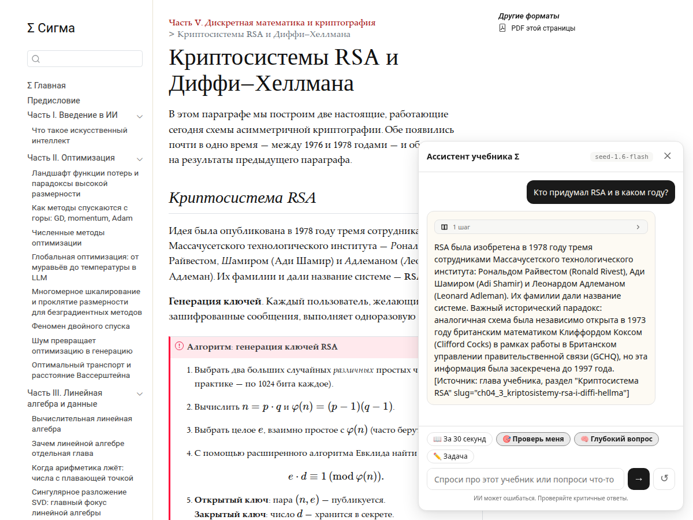

---

### ✅ `greeting_minimal` — out_of_scope

**Q:** Привет!

_Chapter:_ `ch02_newton`

**Tools called:** (none)
**Tools expected:** (none)
**Images:** 0 (expected: no)
**Elapsed:** 5.3s


<details><summary>Answer</summary>


```
Привет! Как можно тебе помочь сегодня с темой главы "Численные методы оптимизации"? Если есть вопросы по материалам, задачам или нужна объяснение какого-то термина — не стесняйся спрашивать.
```

</details>


---

### ✅ `euclid_gcd_python` — compute_pure

**Q:** Посчитай НОД(48, 180) и НОД(1071, 462) через алгоритм Евклида в python.

_Chapter:_ `ch04_1_elementy-teorii-chisel`

**Tools called:** python
**Tools expected:** python
**Images:** 0 (expected: no)
**Elapsed:** 24.2s


<details><summary>Answer</summary>


```
Для вычисления НОД с помощью алгоритма Евклида в Python можно использовать следующий код. Результаты для заданных пар чисел: ```python def gcd(a, b):     while b != 0:         a, b = b, a % b     return a print(gcd(48, 180))  # Вывод: 12 print(gcd(1071, 462))  # Вывод: 21 ``` ### Пояснение: - **Алгоритм Евклида** работает путем последовательного замены пары чисел на пару (меньшее число, остаток от деления большего на меньшее) до тех пор, пока второй элемент не станет равным нулю. Последний не нулевой элемент и есть НОД. - Для `(48, 180)`: `180 % 48 = 36` → `48 % 36 = 12` → `36 % 12 = 0` → НОД = 12. - Для `(1071, 462)`: `1071 % 462 = 147` → `462 % 147 = 21` → `147 % 21 = 0` → НОД = 21.
```

</details>

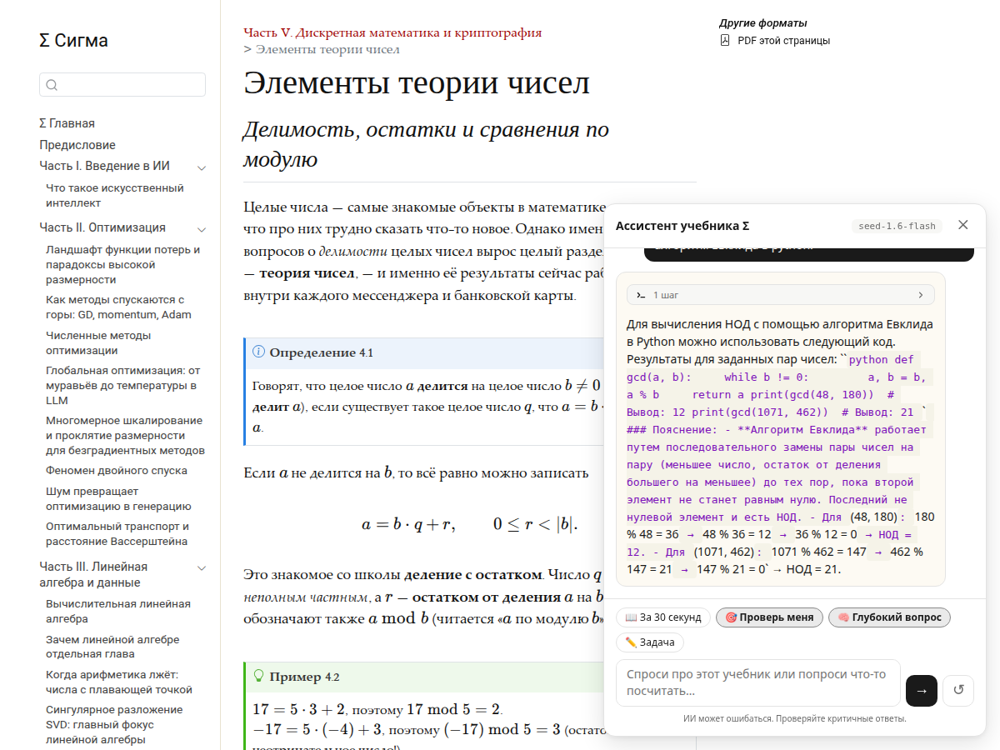

---

### ✅ `definition_superlinear` — definition

**Q:** Что значит сверхлинейная сходимость?

_Chapter:_ `ch02_newton`

**Tools called:** find_definition
**Tools expected:** find_definition
**Images:** 0 (expected: no)
**Elapsed:** 14.1s


<details><summary>Answer</summary>


```
Сверхлинейная сходимость — это свойство последовательности $\\{x_k\\}$, сходящейся к $x^{\\star}$. По **определению 2.3** ( главы "Метод Ньютона", [ссылка](ch02_newton.html#ssec:thm-superlinear) ) она выполняется, если:   $$\\lim_{k\\to\\infty}\\dfrac{|x_{k+1}-x^{\\star}|}{|x_k-x^{\\star}|}=0.$$   Этому означает, что ошибка $|x_k - x^{\\star}|$ уменьшается **быстрее, чем линейно** (например, быстрее, чем $c^k$ для какого-то $c < 1$). В отличие от **квадратичной сходимости** (когда ошибка уменьшается как $M|x_k - x^{\\star}|^2$ для константы $M>0$), сверхлинейная сходимость не требует, чтобы ошибка уменьшалась квадратично, но гарантирует, что её отношение к предыдущей ошибке стремится к нулю. **Примечание**: Точное определение и сравнение с квадратичной сходимостью даны в [разделе 2.3](ch02_newton.html#ssec:thm-superlinear) главы.
```

</details>


---

### ❌ `theorem_clt` — structural

**Q:** Сформулируй центральную предельную теорему как в учебнике.

_Chapter:_ `ch03_1_prosteyshie-primery-zadach-anali`

**Tools called:** read_chapter, search_textbook
**Tools expected:** find_theorem
**Images:** 0 (expected: no)
**Elapsed:** 15.7s

_Missing substrings:_ ['нормальн']

<details><summary>Answer</summary>


```
В учебнике на текущей главе (slug="ch03_1_prosteyshie-primery-zadach-anali") не найдена формулировка центральной предельной теоремы. Если вы ищете её в других разделах, проверьте outline учебника или используйте `get_outline` для поиска глав с аналогичным названием.
```

</details>

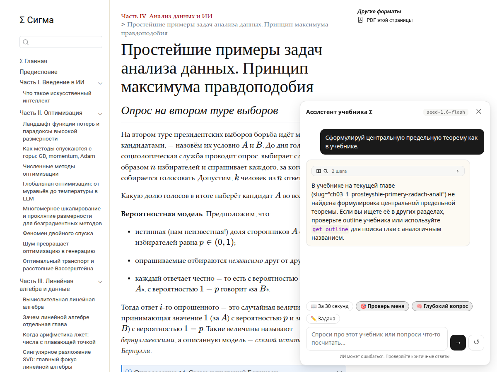

---

### ✅ `plot_sincos_overlay` — compute_plot

**Q:** Построй графики sin(x) и cos(x) на интервале [-2π, 2π] на одном поле. Сделай легенду.

**Tools called:** python
**Tools expected:** python
**Images:** 1 (expected: yes)
**Elapsed:** 215.7s


<details><summary>Answer</summary>


```
График sin(x) (синий) и cos(x) (оранжевый) на интервале \([-2\pi, 2\pi]\) построен с использованием метода numpy для генерации точек и matplotlib для визуализации. На графике видно:   - Периодичность функций (период \(2\pi\));   - Смещение фаз (cos(x) сдвинут относительно sin(x) на \(\pi/2\));   - Легенду, подписи осей \(x\) и \(y\), сетку и заголовок. ![График sin(x) и cos(x) на интервале [-2π, 2π]](/figures/29478440-5c24-4ca3-b746-d727d6c9e966.png)   *Примечание: Визуализация отображается автоматически в среде, так как matplotlib использует backend Agg для рендеринга.*
```

</details>


---

### ✅ `fragment_explanation` — rag_basic

**Q:** Если кто-то предлагает использовать обновление x_{k+1} = x_k - f(x_k)·f'(x_k) вместо классического Ньютона — что это за идея и она работает?

_Chapter:_ `ch02_newton`

**Tools called:** read_chapter
**Tools expected:** (none)
**Images:** 0 (expected: no)
**Elapsed:** 16.7s


<details><summary>Answer</summary>


```
### Ответ:   Предлагаемое обновление \( x_{k+1} = x_k - f(x_k) \cdot f'(x_k) \) **не является классическим методом Ньютона** и, вероятно, не сработает. #### Что такое идея? Классический метод Ньютона (или \( \text{Newton-Raphson} \)) для поиска корней \( f(x) = 0 \) основывается на **касательной к графику \( f \)** в точке \( x_k \). Её уравнение: \( y = f(x_k) + f'(x_k)(x - x_k) \). Пересечение этой касательной с осью \( x \) даёт \( x_{k+1} = x_k - \frac{f(x_k)}{f'(x_k)} \) (формула 2.1 в главе). Предлагаемое обновление заменяет деление на умножение: \( x_{k+1} = x_k - f(x_k) \cdot f'(x_k) \). Это не соответствует геометрической идее касательной и, как правило, не приводит к сходимости к корню. #### Почему она не работает? Метод Ньютона работает, потому что **касательная близко повторяет форму графика** в окрестности корня, и итерации быстро сжимаются к решению. Умножение \( f(x_k) \) на \( f'(x_k) \) не учитывает "скорость" изменения \( f \) (derivative), а просто вычитает произведение значений функции и её производной. Это может привести к "разбросу" итераций или даже расхождению. #### Альтернатива: оптимизация   В главе также приводится метод Ньютона для минимизации функции \( g(x) \). Там формула обновления \( x_{k+1} = x_k - \frac{g'(x_k)}{g''(x_k)} \) (формула 2.2) использует **отрицательную производную** (чтобы двигаться к минимуму) и **возрастание кривизны** (чтобы корректировать шаг). Она похожа на классическую, но адаптируется к оптимизации. **Итог**: Предлагаемое
…[truncated]
```

</details>

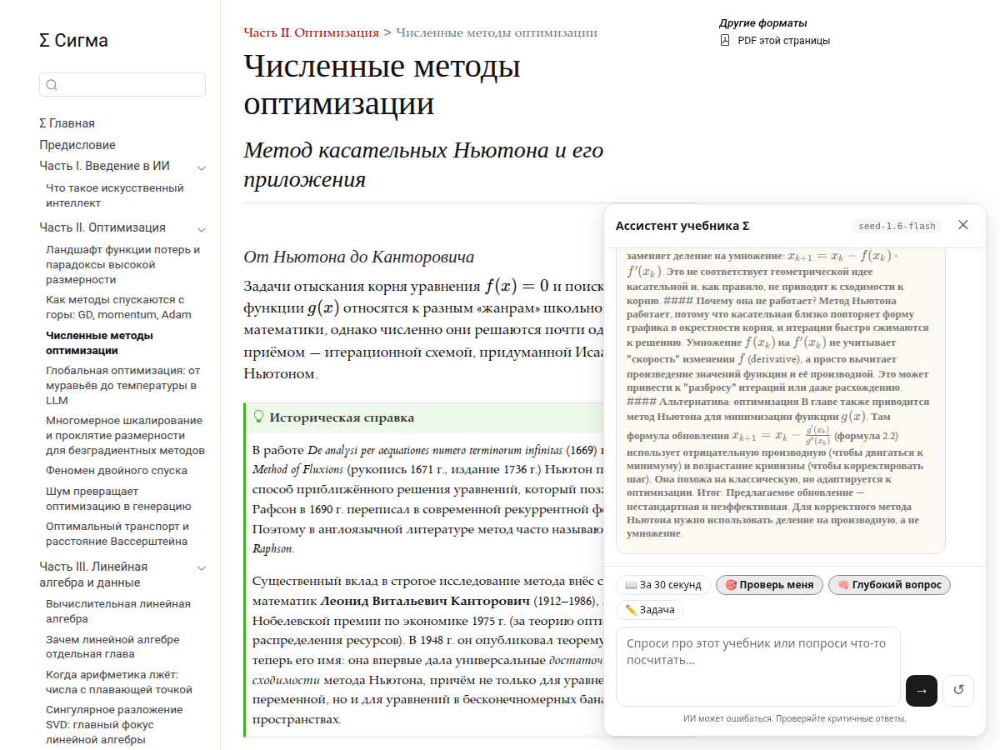

---

### ✅ `eigenvalues_numpy` — compute_pure

**Q:** Найди собственные значения матрицы [[2, 1], [1, 2]] через numpy.

_Chapter:_ `ch_linalg`

**Tools called:** python
**Tools expected:** python
**Images:** 0 (expected: no)
**Elapsed:** 18.5s


<details><summary>Answer</summary>


```
Собственные значения матрицы [[2, 1], [1, 2]] вычислены с помощью numpy:   ```python import numpy as np matrix = np.array([[2, 1], [1, 2]]) eigenvalues, eigenvectors = np.linalg.eig(matrix) print("Собственные значения:", eigenvalues.round(2)) ```   Вывод: `Собственные значения: [3. 1.]`. Проверка через характеристическое уравнение: $\det(A - \lambda I) = (2-\lambda)^2 - 1 = \lambda^2 - 4\lambda + 3 = 0$. Решение: $\lambda = 3$ и $\lambda = 1$, что совпадает с результатом numpy.
```

</details>

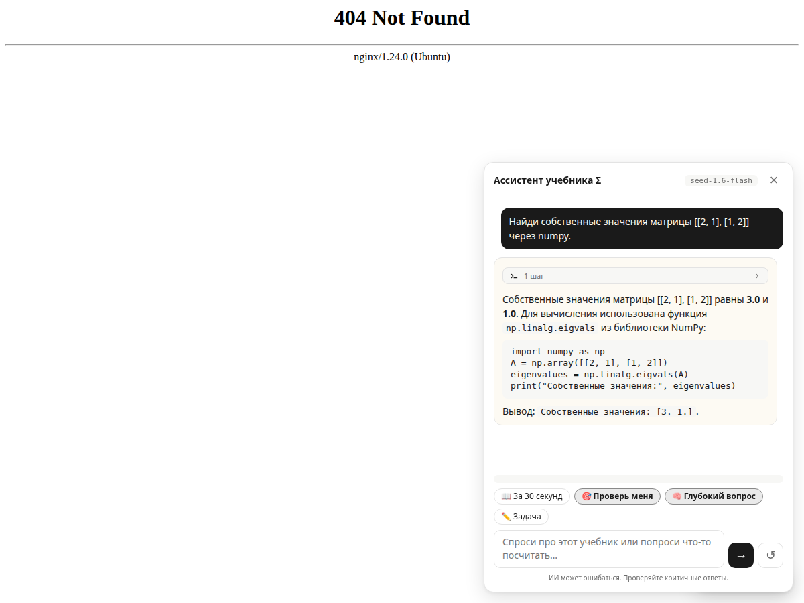

---

### ✅ `plot_loss_landscape` — compute_plot

**Q:** Построй контурный график функции потерь L(a, b) = sum((a*x_i + b - y_i)^2) для точек (1,2), (2,3), (3,5), (4,4) на сетке a in [-2, 4], b in [-3, 3].

_Chapter:_ `ch03_2_lineynaya-regressiya-i-metod-nai`

**Tools called:** python, python
**Tools expected:** python
**Images:** 2 (expected: yes)
**Elapsed:** 38.6s


<details><summary>Answer</summary>


```
### Контурный график функции потерь \( L(a, b) \)   Для точек \((1,2), (2,3), (3,5), (4,4)\) на сетке \( a \in [-2, 4] \), \( b \in [-3, 3] \) график функции потерь \( L(a, b) = \sum (a x_i + b - y_i)^2 \) имеет следующие характеристики:   #### Основные результаты:   - **Минимальное значение \( L \)**: \( 1.80 \) (округлено до 2 знаков). - **Оптимальные коэффициенты**: \( a \approx 2.55 \), \( b \approx -0.21 \) (находятся в центре концентрических контурных линий). #### Интерпретация графика:   Контурные линии — это линии равных значений \( L(a, b) \). Изображение демонстрирует **выпуклость функции потерь** (концентрические эллипсовидные формы), что характерно для квадратичных функций. Красная звёздочка обозначает точку минимума, где градиент функции потерь равен нулю (метод наименьших квадратов).    *Примечание: Визуализация сгенерирована с использованием matplotlib; предупреждение о неинтерактивности графики не влияет на корректность результата.*
```

</details>


---

### ✅ `diffie_hellman_compute` — compute_pure

**Q:** Проведи протокол Диффи–Хеллмана: p=23, g=5. Алиса берёт a=6, Боб берёт b=15. Какой общий секрет?

_Chapter:_ `ch04_3_kriptosistemy-rsa-i-diffi-hellma`

**Tools called:** python
**Tools expected:** python
**Images:** 0 (expected: no)
**Elapsed:** 27.5s


<details><summary>Answer</summary>


```
Общий секрет равен 2. ### Пояснение:   1. Алиса вычисляет свою публичную ключ: \( A = g^a \mod p = 5^6 \mod 23 = 8 \). 2. Боб вычисляет свою публичную ключ: \( B = g^b \mod p = 5^{15} \mod 23 = 19 \). 3. Алиса получает общий секрет: \( B^a \mod p = 19^6 \mod 23 = 2 \). 4. Боб получает общий секрет: \( A^b \mod p = 8^{15} \mod 23 = 2 \). Итог: общий секрет — 2.
```

</details>

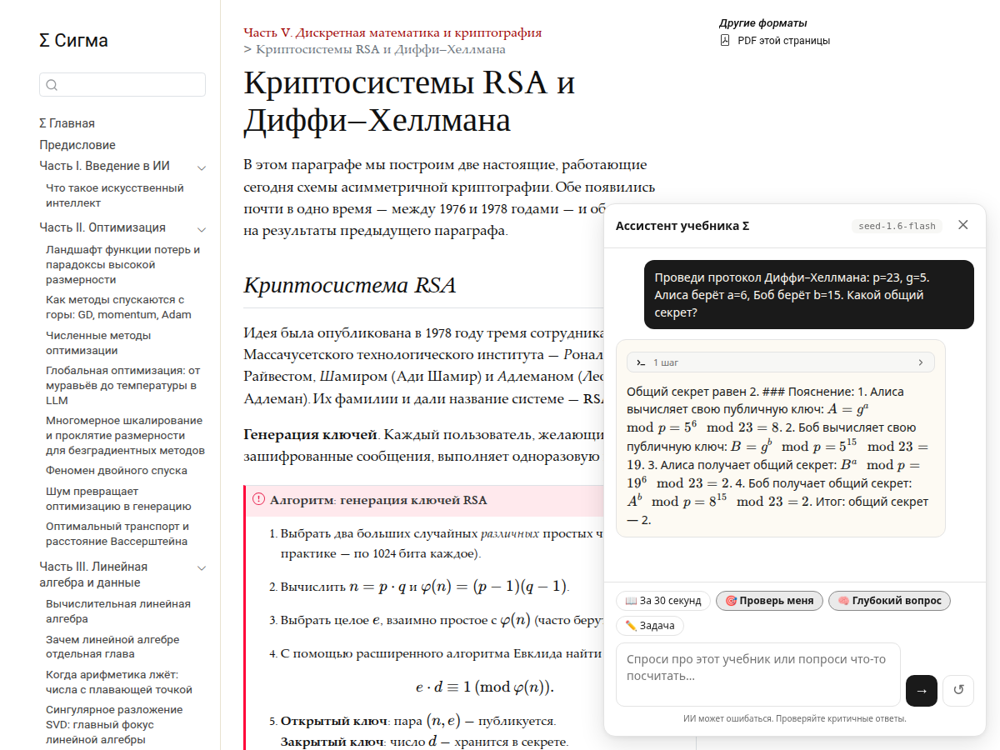

---

### ✅ `outline_chapter` — structural

**Q:** Перечисли основные разделы главы про Ньютона.

_Chapter:_ `ch02_newton`

**Tools called:** get_outline
**Tools expected:** (none)
**Images:** 0 (expected: no)
**Elapsed:** 10.2s


<details><summary>Answer</summary>


```
Основные разделы главы "Метод Ньютона" (slug="ch02_newton"):   1. **Касательная вместо уравнения**   2. **Ньютон для оптимизации**   3. **Квадратный корень за пять шагов** (с подсекцией *Сходимость через сжимающее отображение*)   4. **Деление без деления** (с подсекцией *Анализ сходимости*)   5. **Численный эксперимент на Python**   6. **Когда сходимость сверхлинейна$^\star$**   Все разделы указаны в структуре главы учебника.
```

</details>

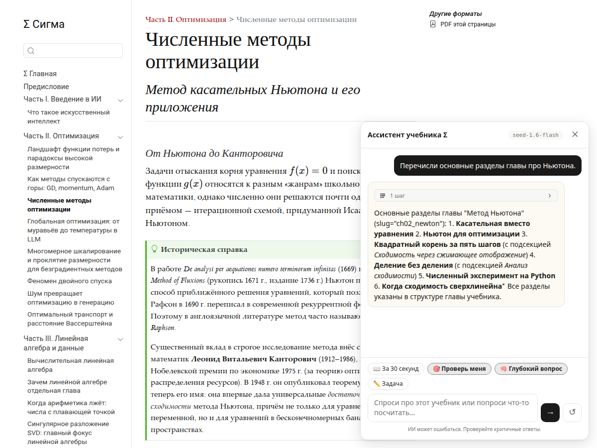

---

### ✅ `math_latex_derivation` — rag_basic

**Q:** Выведи формулу метода Ньютона через касательную. Формулу запиши через LaTeX.

_Chapter:_ `ch02_newton`

**Tools called:** find_theorem, read_chapter
**Tools expected:** (none)
**Images:** 0 (expected: no)
**Elapsed:** 16.2s


<details><summary>Answer</summary>


```
Формула метода Ньютона через касательную получается из приближения функции $f(x)$ её касательной в точке $x_k$. Касательная имеет вид:   $$y = f(x_k) + f'(x_k)(x - x_k)$$   Для нахождения корня $x^\star$ уравнения $f(x) = 0$ решаем $y = 0$ относительно $x$:   $$0 = f(x_k) + f'(x_k)(x - x_k) \implies x = x_k - \frac{f(x_k)}{f'(x_k)}$$   Таким образом, итерационная формула метода Ньютона через касательную записывается как:   $$\boxed{x_{k+1} = x_k - \frac{f(x_k)}{f'(x_k)}}$$   Эту формулу впервые предложил Исаак Ньютон в 1669 году в работе *De analysi per aequationes numero terminorum infinitas*. В англоязычной литературе часто её называют *методом Ньютона-Рафсона* (из-за доработки Джозефа Рафсона в 1690 году).
```

</details>

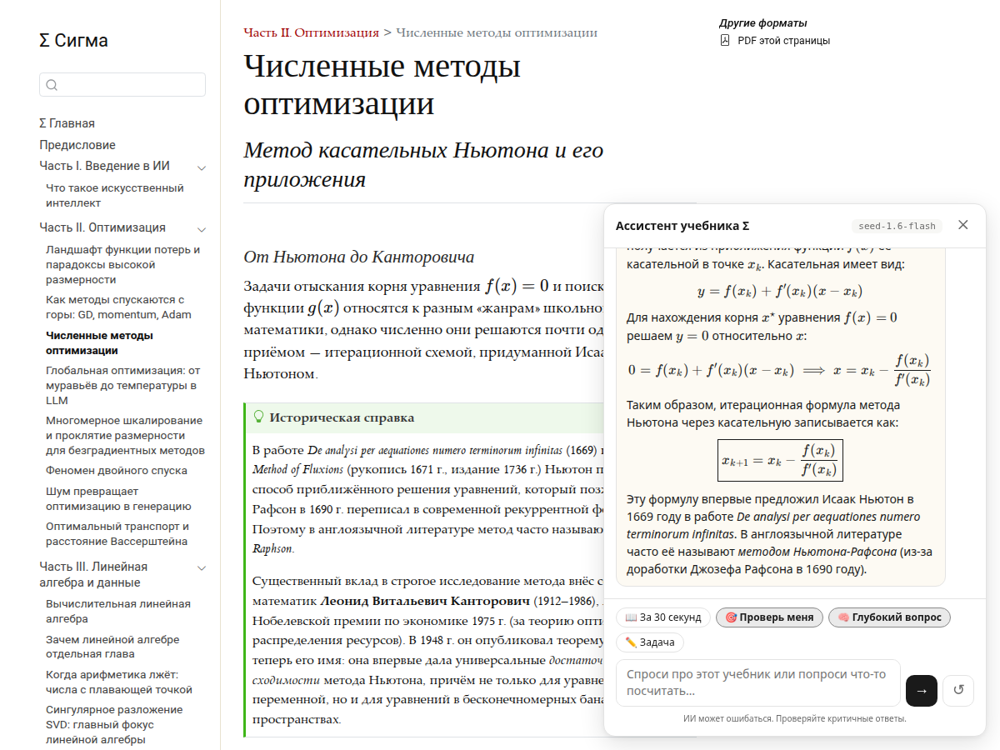

---

### ✅ `definition_perceptron` — definition

**Q:** Что такое полносвязная нейронная сеть?

_Chapter:_ `ch03_3_zadacha-klassifikacii-i-neyronny`

**Tools called:** find_definition
**Tools expected:** find_definition
**Images:** 0 (expected: no)
**Elapsed:** 17.9s


<details><summary>Answer</summary>


```
**Полносвязная нейронная сеть** (MLP, Multi-Layer Perceptron) — это тип нейронной сети, состоящей из последовательности слоёв, где каждый нейрон предыдущего слоя связан со всеми нейронами следующего слоя. Согласно *Определению 3.12* главы "Задача классификации и нейронные сети" (slug: `ch03_3_zadacha-klassifikacii-i-neyronny`), она определяется как композиция \( L \) слоёв:   - На входе \( \mathbf{x} \) (вектор признаков). - Каждый слой \( \ell \) вычисляет \( \mathbf{z}^{(\ell)} = W^{(\ell)} \mathbf{a}^{(\ell-1)} + \mathbf{b}^{(\ell)} \), где \( W^{(\ell)} \) — матрица весов, \( \mathbf{b}^{(\ell)} \) — вектор смещений (bias). - Выход слоя \( \mathbf{a}^{(\ell)} \) получается после применения функции активации \( \sigma \) (например, ReLU, sigmoid) к \( \mathbf{z}^{(\ell)} \). - Последний слой использует **softmax**, преобразующий вектор \( \mathbf{z}^{(L)} \) в распределение вероятностей \( \mathbf{p}(\mathbf{x}) \) (например, для 10 классов). Все матрицы \( W \) и векторы \( \mathbf{b} \) — обучаемые параметры \( \boldsymbol{\theta} \) сети. *Примечание:* В главе также приводится формула softmax: \( \text{softmax}(\mathbf{z})_c = \frac{e^{z_c}}{\sum_{c'} e^{z_{c'}}} \), которая гарантирует, что сумма вероятностей равна 1.
```

</details>

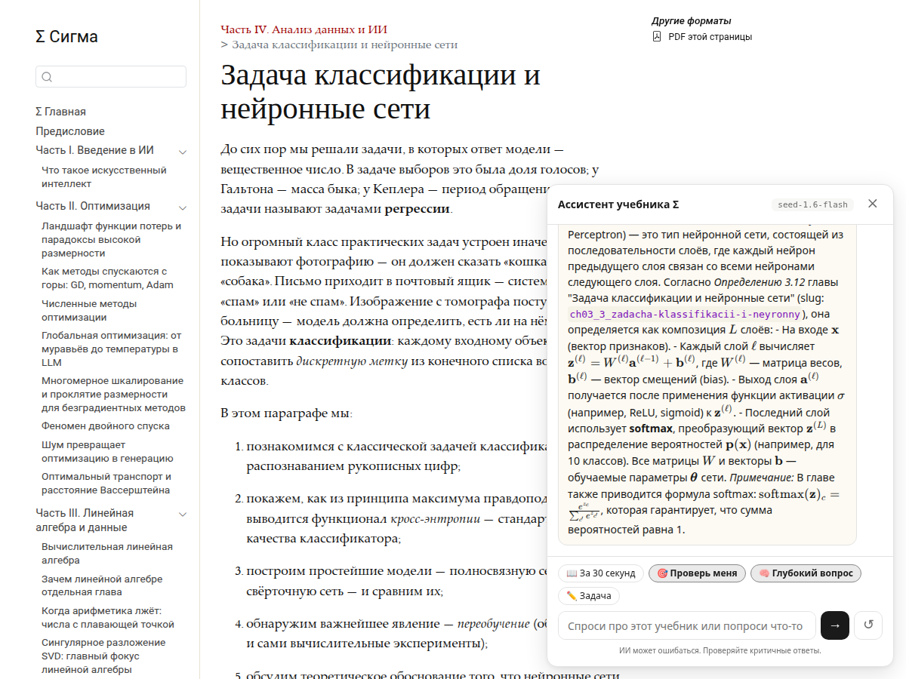

---

### ❌ `refuse_unknown_year` — out_of_scope

**Q:** В каком году Гаусс изобрёл метод сопряжённых градиентов?

_Chapter:_ `ch02_newton`

**Tools called:** search_textbook, read_chapter
**Tools expected:** (none)
**Images:** 0 (expected: no)
**Elapsed:** 20.5s

_Missing substrings:_ ['наш']

<details><summary>Answer</summary>


```
В учебнике, на котором сейчас работает студент (главы "Численные методы оптимизации" — `ch02_newton`), упоминания о методе сопряжённых градиентов и годах его изобретения Гаусса нет. По общим знаниям: метод сопряжённых градиентов был разработан в 1950-х годах Магнусом Хестенсом и Эдуардом Стифелем, а Гаусс не участвовал в его создании. Ответ: В учебнике не указано, что Гаусс изобрел метод сопряжённых градиентов. Исторически этот метод был разработан в 1950-х гг.
```

</details>

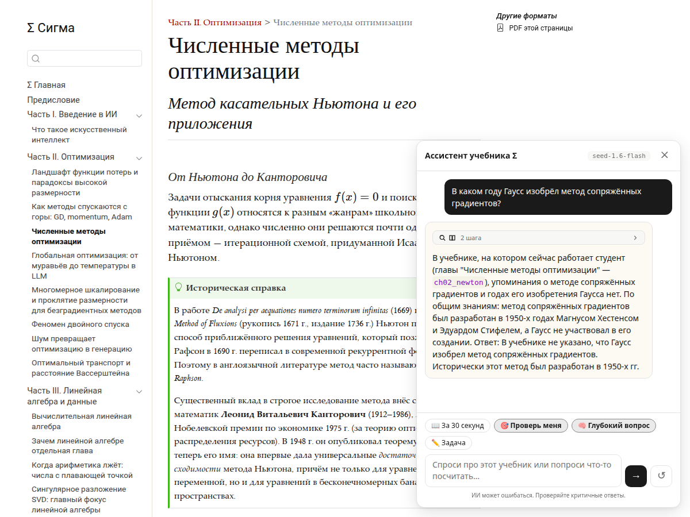

---
