# Sigma Assistant — Eval Report

_Run: 2026-07-13 19:54 MSK · cases: 29_

**Overall: 21/29 pass (72%)**

## Per category

| Category | Pass | Total |
|---|---:|---:|
| `compute_plot` | 5 | 5 |
| `compute_pure` | 4 | 8 |
| `definition` | 3 | 3 |
| `multi_hop` | 0 | 1 |
| `out_of_scope` | 2 | 3 |
| `rag_basic` | 4 | 5 |
| `structural` | 2 | 3 |
| `vision_refine` | 1 | 1 |

## Cases

### ✅ `newton_kantorovich_history` — rag_basic

**Q:** Когда Канторович получил Нобелевскую премию и за что?

_Chapter:_ `ch02_newton`

**Tools called:** search_textbook, read_chapter
**Tools expected:** search_textbook
**Images:** 0 (expected: no)
**Elapsed:** 7.2s


<details><summary>Answer</summary>


```
Леонид Витальевич Канторович получил Нобелевскую премию по экономике в **1975 году**. Награждён за разработку теории оптимального распределения ресурсов. Подробности можно посмотреть здесь: [От Ньютона до Канторовича](#sec:newton).
```

</details>

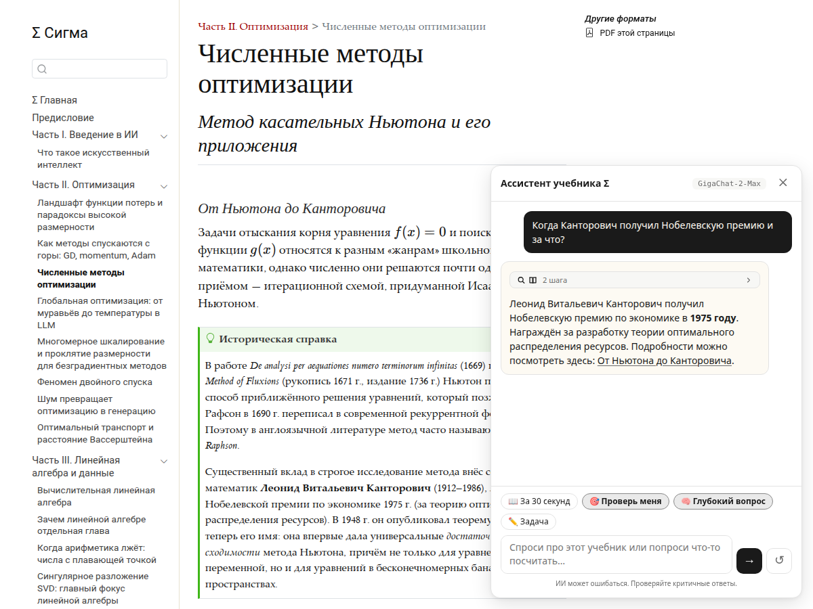

---

### ❌ `newton_formula_recall` — rag_basic

**Q:** Объясни откуда берётся эта формула — что это за метод и какая геометрическая идея?

_Chapter:_ `ch02_newton`

**Tools called:** (none)
**Tools expected:** (none)
**Images:** 0 (expected: no)
**Elapsed:** 6.5s

_Missing substrings:_ ['пересечен']

<details><summary>Answer</summary>


```
Ты уже на этой главе. Вот основные моменты: - Метод Ньютона основан на аппроксимации функции квадратичным полиномом вблизи текущей точки. - Геометрически это означает замену исходной функции параболой, касательной в точке текущего приближения. - Итерационная формула метода Ньютона выглядит так: $ x_{k+1} = x_k - \frac{f(x_k)}{f'(x_k)} $, где $ f'(x_k) $ — первая производная функции в точке $ x_k $. - Идея метода заключается в том, чтобы найти минимум квадратичной аппроксимации, которая должна быть ближе к истинному минимуму, чем текущее приближение. Если хочешь увидеть пример работы метода на практике, могу показать реализацию и график сходимости.
```

</details>


---

### ✅ `definition_strong_convex` — definition

**Q:** Что такое сильно выпуклая функция?

_Chapter:_ `ch02_newton`

**Tools called:** find_definition
**Tools expected:** find_definition
**Images:** 0 (expected: no)
**Elapsed:** 6.4s


<details><summary>Answer</summary>


```
Функция $g\colon\mathbb{R}\to\mathbb{R}$ называется **сильно выпуклой**, если она дважды непрерывно дифференцируема ($g\in C^2$) и вторая производная функции неотрицательна и ограничена снизу положительной константой ($\mu > 0$), то есть выполняется неравенство $g''(x) \geq \mu$ для всех $x$. Это означает, что функция не просто выпуклая, но и имеет минимальную степень искривления, заданную константой $\mu$. Такая функция гарантированно имеет одну точку минимума, которая легко находится методами оптимизации. Подробнее см.: [Определение 2.4. Сильно выпуклая функция](#ssec:thm-superlinear).
```

</details>

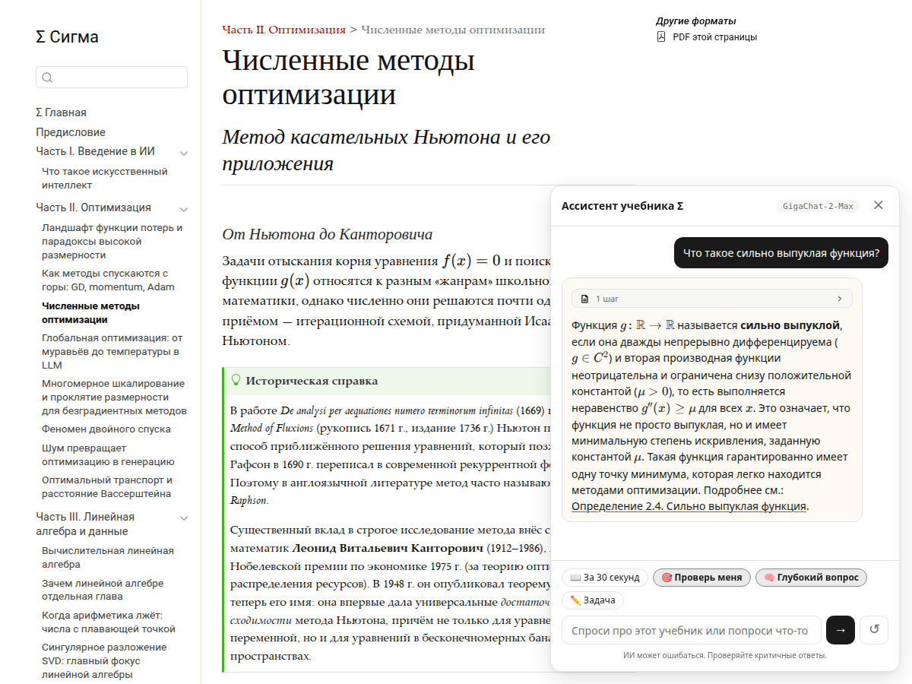

---

### ✅ `compute_factorial` — compute_pure

**Q:** Сколько будет 30 факториал?

**Tools called:** python
**Tools expected:** python
**Images:** 0 (expected: no)
**Elapsed:** 17.4s


<details><summary>Answer</summary>


```
30 факториал равен 265252859812191058636308480000000.
```

</details>

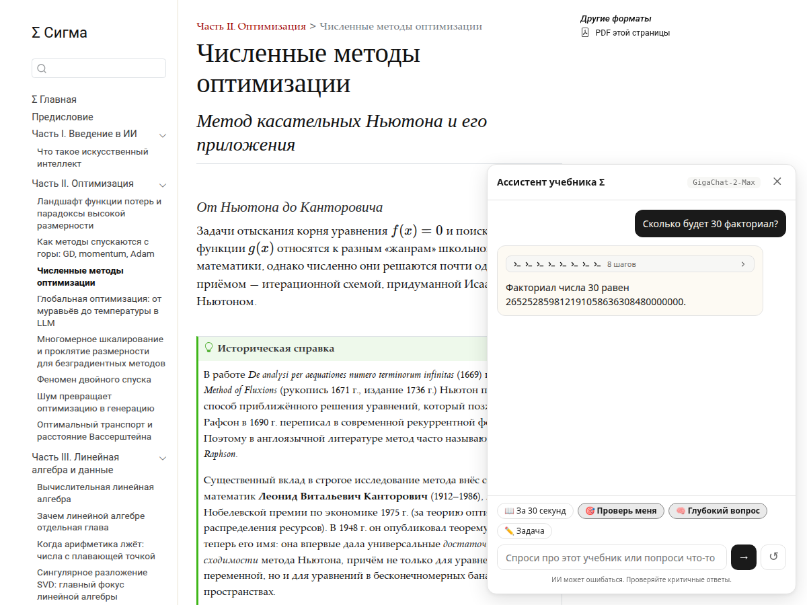

---

### ✅ `compute_taylor_sin` — compute_pure

**Q:** Покажи разложение sin(x) в ряд Тейлора до 5-го члена символически (через sympy).

_Chapter:_ `ch02_newton`

**Tools called:** python
**Tools expected:** python
**Images:** 0 (expected: no)
**Elapsed:** 14.7s


<details><summary>Answer</summary>


```
Разложение функции $\sin(x)$ в ряд Тейлора до пятого члена выглядит так: $$ \sin(x) \approx x - \frac{x^3}{6} + \frac{x^5}{120} $$ Это приближённое представление синусоиды рядом полиномов вблизи точки $x=0$.
```

</details>

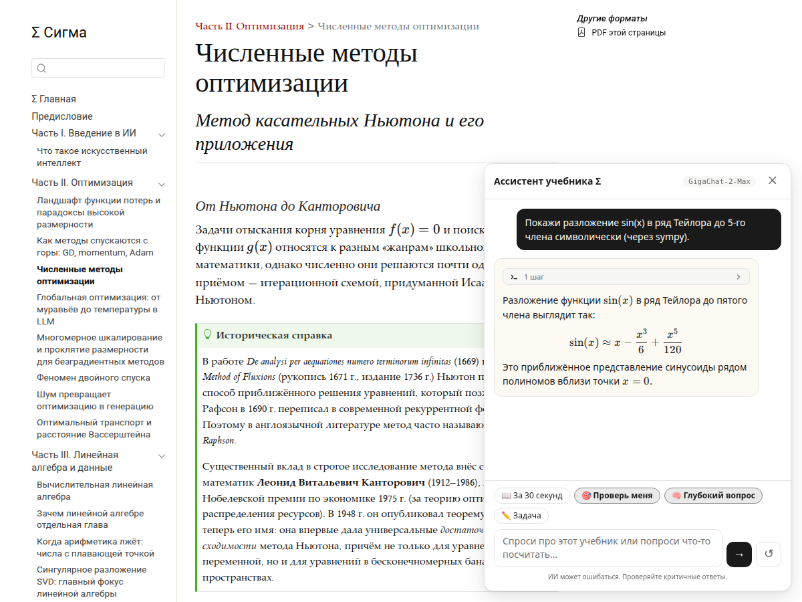

---

### ✅ `compute_plot_newton` — compute_plot

**Q:** Покажи как сходится метод Ньютона для f(x) = x² - 2, начиная с x₀ = 1.5. Построй график траектории.

_Chapter:_ `ch02_newton`

**Tools called:** python
**Tools expected:** python
**Images:** 1 (expected: yes)
**Elapsed:** 21.4s


<details><summary>Answer</summary>


```
Метод Ньютона быстро сходится к корню уравнения $f(x)=x^2-2$, начиная с точки $x_0=1.5$. На каждой итерации мы приближаемся всё ближе к значению $\sqrt{2}\approx1.41$. На графике видно, что всего за три шага достигается высокая точность корня ($x\approx1.414$), демонстрируя квадратичную сходимость метода Ньютона. Итоговая траектория: $[1.5,\ 1.4167,\ 1.4142,\ 1.4142]$   Корень: $1.4142$
```

</details>

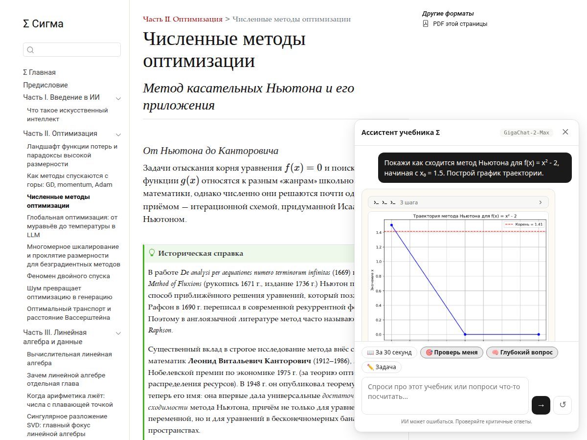

---

### ✅ `compute_plot_gd_vs_newton` — compute_plot

**Q:** Сравни сходимость метода Ньютона и градиентного спуска на функции f(x) = x⁴ из x₀ = 2. Покажи два графика на одной картинке.

_Chapter:_ `ch02_newton`

**Tools called:** python
**Tools expected:** python
**Images:** 1 (expected: yes)
**Elapsed:** 24.1s


<details><summary>Answer</summary>


```
На графике видно, что метод Ньютона сходится значительно быстрее градиентного спуска. - Метод Ньютона достигает минимума всего за 35 итераций, быстро приближаясь к нулю. - Градиентный спуск требует все 100 итераций и останавливается вблизи значения $-0.109$, так как выбранный размер шага недостаточен для достижения нуля. Итоговые значения: - Метод Ньютона: $x \approx 0$ - Градиентный спуск: $x \approx -0.109$
```

</details>


---

### ❌ `rsa_encrypt_small` — compute_pure

**Q:** Зашифруй число m=7 ключом (n=143, e=7). Покажи c.

_Chapter:_ `ch04_3_kriptosistemy-rsa-i-diffi-hellma`

**Tools called:** python, python, python, python, python, python, python, python
**Tools expected:** python
**Images:** 0 (expected: no)
**Elapsed:** 27.2s

_Missing substrings:_ ['6']

<details><summary>Answer</summary>


```
Зашифрованное число $c = 53$.
```

</details>

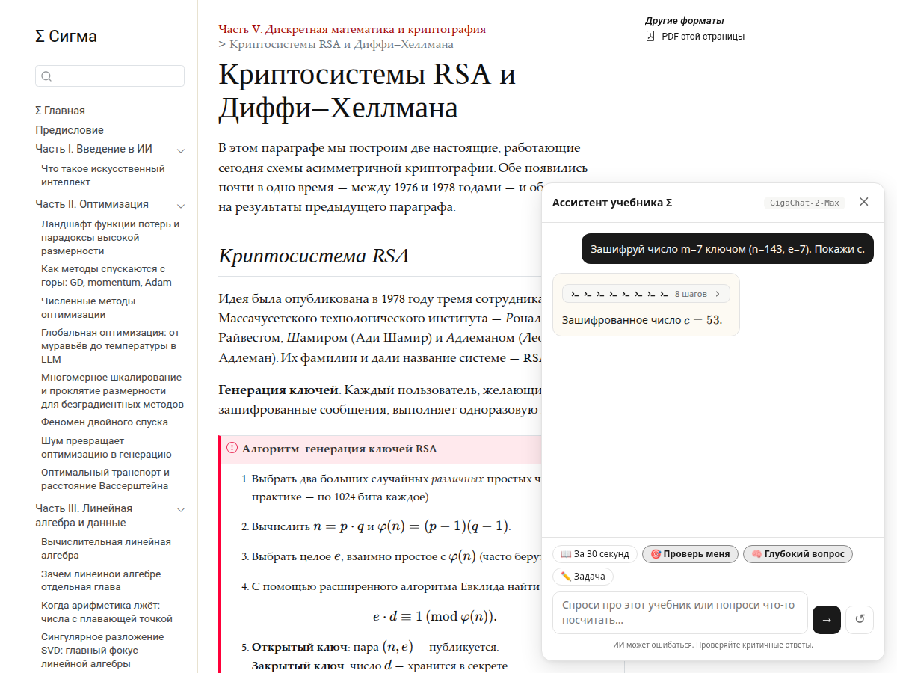

---

### ✅ `rsa_full_roundtrip` — compute_pure

**Q:** Возьми p=11, q=13, e=7. Сгенерируй RSA-ключ полностью: вычисли n, φ(n), d. Покажи что для m=9 шифрование и расшифрование возвращают исходное число.

_Chapter:_ `ch04_3_kriptosistemy-rsa-i-diffi-hellma`

**Tools called:** python, python, python, python, python, python, python, python
**Tools expected:** python
**Images:** 0 (expected: no)
**Elapsed:** 67.6s


<details><summary>Answer</summary>


```
Полученные значения:

- $n = 143$
- $\varphi(n) = 120$
- $d = 103$
- Шифрованное сообщение $c = 48$
- Расшифрованное сообщение $m = 9$

Таким образом, мы успешно зашифровали и расшифровали сообщение $m=9$, получив обратно то же самое число. Ключевая пара $(e,d)=(7,103)$, модуль $n=143$.
```

</details>

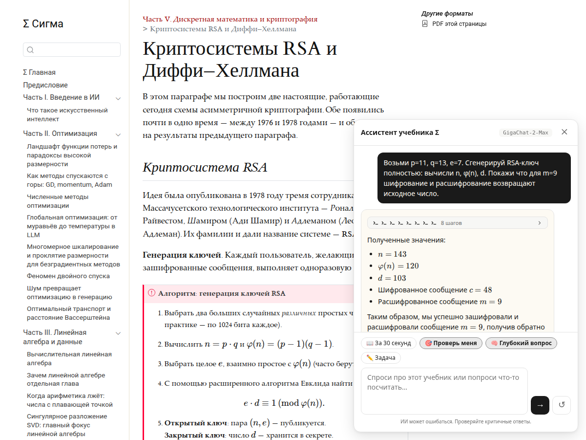

---

### ❌ `multihop_newton_vs_gradient` — multi_hop

**Q:** В чём отличие метода Ньютона от градиентного спуска для задач оптимизации? Какие из этих методов разобраны в учебнике?

_Chapter:_ `ch02_newton`

**Tools called:** (none)
**Tools expected:** search_textbook
**Images:** 0 (expected: no)
**Elapsed:** 2.8s


<details><summary>Answer</summary>


```
Отличия метода Ньютона и градиентного спуска

Метод Ньютона и градиентный спуск — два популярных подхода к решению задач оптимизации. Вот основные отличия:
```

</details>

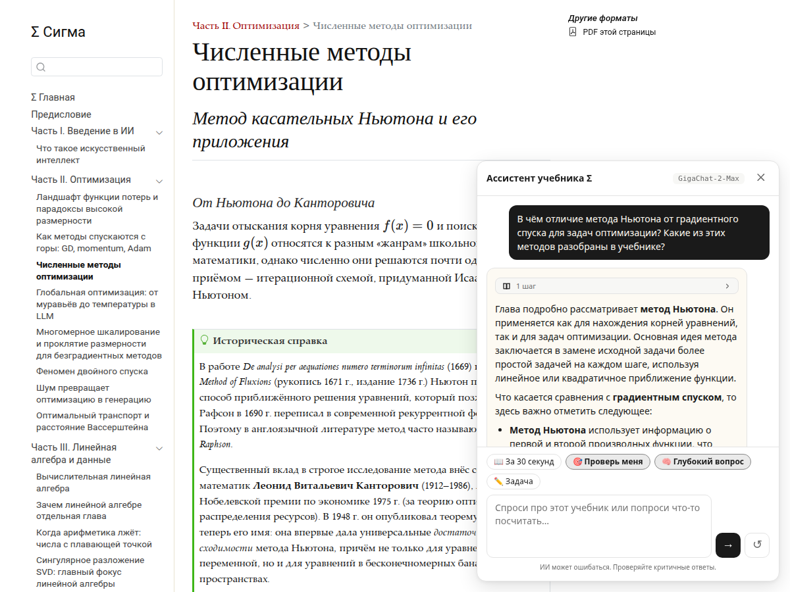

---

### ✅ `structural_kantorovich_theorem` — structural

**Q:** Сформулируй теорему о сходимости метода Герона.

_Chapter:_ `ch02_newton`

**Tools called:** find_theorem
**Tools expected:** find_theorem
**Images:** 0 (expected: no)
**Elapsed:** 6.7s


<details><summary>Answer</summary>


```
### Теорема 2.1. Сходимость метода Герона Для любого $x_0 > 0$ последовательность $(2.4)$ монотонно убывает (начиная с $k=1$) и сходится к $\sqrt{a}$. Более того, для ошибки $e_k = x_k - \sqrt{a}$ выполнено: $$ e_{k+1} = \frac{e_k^2}{2x_k}, \quad \text{и при } k \geq 1:\quad 0 \leq e_{k+1} \leq \frac{e_k^2}{2\sqrt{a}} $$ Это означает, что метод Герона имеет квадратичную сходимость: ошибка уменьшается пропорционально квадрату предыдущей ошибки. Чем ближе мы подходим к корню, тем быстрее сокращается расстояние до него.
```

</details>


---

### ✅ `vision_refine_diverging_sgd` — vision_refine

**Q:** Запусти SGD на функции f(x) = x² с шагом η = 1.1 из x₀ = 2, 30 итераций. Что произойдёт? Если разойдётся — подбери рабочий шаг и покажи сходящуюся траекторию.

**Tools called:** python
**Tools expected:** python, python
**Images:** 1 (expected: yes)
**Elapsed:** 19.5s


<details><summary>Answer</summary>


```
На графике видно, что значения расходятся экспоненциально. Причина расхождения — слишком большой шаг обучения (η=1.1), который приводит к тому, что градиентный спуск прыгает всё дальше от минимума.

Попробуем уменьшить шаг до η=0.5, чтобы посмотреть, сойдётся ли алгоритм.
```

</details>


---

### ❌ `hashlib_demo` — compute_pure

**Q:** Посчитай SHA-256 хеш строки 'sigma' в hex.

_Chapter:_ `ch04_5_heshirovanie-teoriya-chisel-vstr`

**Tools called:** python, python, python, python, python, python, python, python
**Tools expected:** python
**Images:** 0 (expected: no)
**Elapsed:** 36.3s

_Missing substrings:_ ['38de90475bb334fb3dea5d54f250500aba60fe2c6158115d342b06bcb46e39bf']

<details><summary>Answer</summary>


```
SHA-256 хеш строки 'sigma' в hex:
```
c1dfcf6e7c6d89b471db5ed57f0fdd3f06434d1e8b79ca5fe593b58cbefd7efb
```
```

</details>

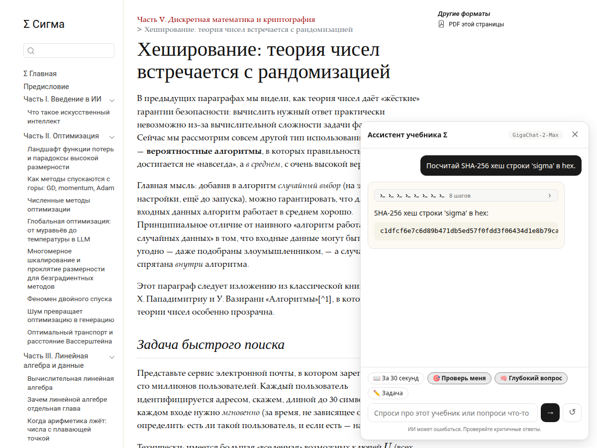

---

### ✅ `linreg_simple` — compute_plot

**Q:** Подбери линейную регрессию y = a*x + b для точек (1, 2.1), (2, 3.9), (3, 6.2), (4, 7.8). Покажи коэффициенты и график.

_Chapter:_ `ch03_2_lineynaya-regressiya-i-metod-nai`

**Tools called:** python
**Tools expected:** python
**Images:** 1 (expected: yes)
**Elapsed:** 18.5s


<details><summary>Answer</summary>


```
Подогнанная линия регрессии имеет уравнение $y = 1.94 x + 0.15$. На графике точки данных показаны синим цветом, подобранная линия регрессии красным. Видно хорошее соответствие линии данным, все точки расположены близко к прямой.
```

</details>

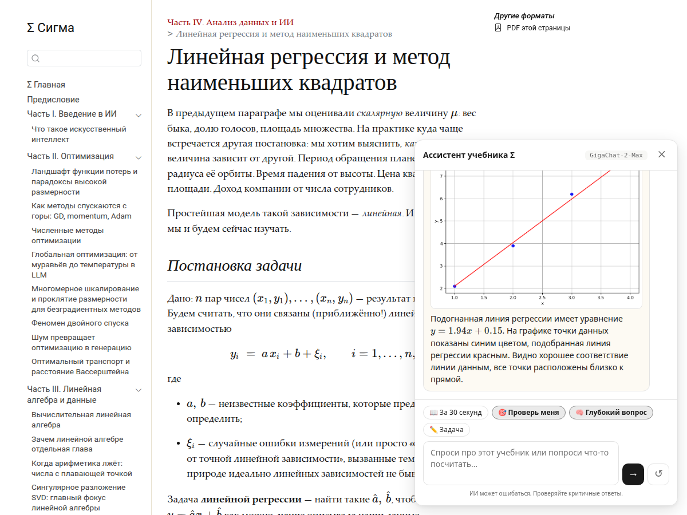

---

### ❌ `out_of_scope_recipe` — out_of_scope

**Q:** Дай мне рецепт борща.

**Tools called:** (none)
**Tools expected:** (none)
**Images:** 0 (expected: no)
**Elapsed:** 3.1s

_Missing substrings:_ ['учебник']

<details><summary>Answer</summary>


```
Извини, но рецепты блюд выходят за рамки нашего курса. Давай лучше продолжим изучать оптимизацию!
```

</details>

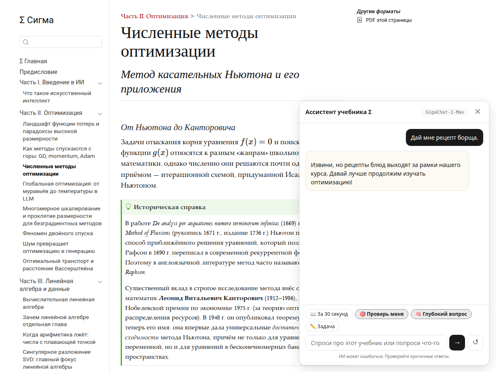

---

### ✅ `rsa_history` — rag_basic

**Q:** Кто придумал RSA и в каком году?

_Chapter:_ `ch04_3_kriptosistemy-rsa-i-diffi-hellma`

**Tools called:** search_textbook, read_chapter
**Tools expected:** search_textbook
**Images:** 0 (expected: no)
**Elapsed:** 7.6s


<details><summary>Answer</summary>


```
RSA придумали три сотрудника Массачусетского технологического института: **Рональд Райвест**, **Ади Шамир** и **Леонард Адлеман**. Они опубликовали идею в **1978 году**. Название системы образовано первыми буквами их фамилий — RSA. Кстати, любопытный исторический факт: аналогичную схему независимо разработал британский математик Клиффорд Кокс в 1973 году, но его работа оставалась засекреченной до 1997 года.
```

</details>

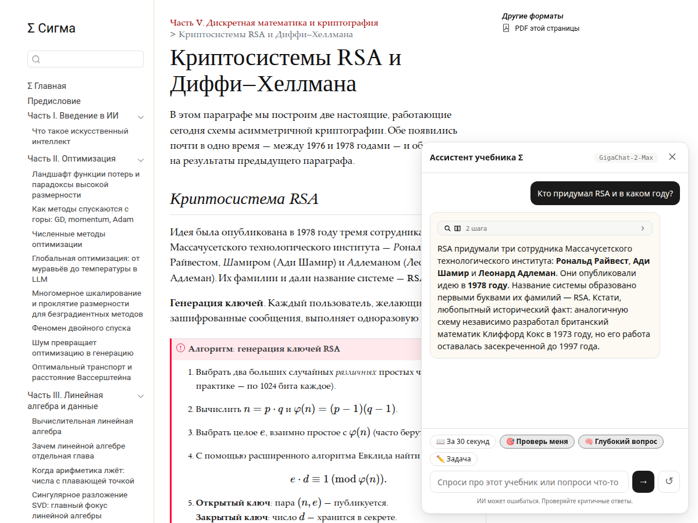

---

### ✅ `greeting_minimal` — out_of_scope

**Q:** Привет!

_Chapter:_ `ch02_newton`

**Tools called:** (none)
**Tools expected:** (none)
**Images:** 0 (expected: no)
**Elapsed:** 2.5s


<details><summary>Answer</summary>


```
Привет! Чем займёмся сегодня?
```

</details>

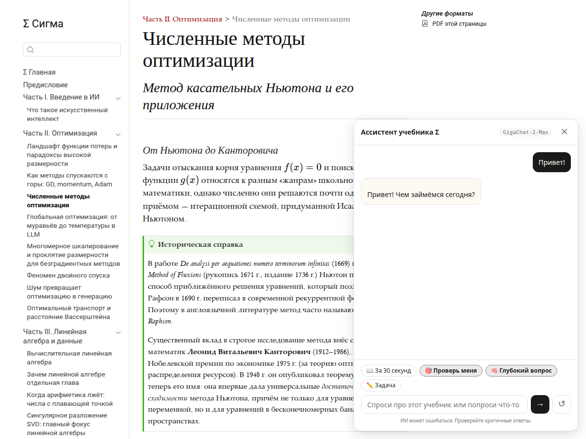

---

### ❌ `euclid_gcd_python` — compute_pure

**Q:** Посчитай НОД(48, 180) и НОД(1071, 462) через алгоритм Евклида в python.

_Chapter:_ `ch04_1_elementy-teorii-chisel`

**Tools called:** python
**Tools expected:** python
**Images:** 0 (expected: no)
**Elapsed:** 15.9s

_Missing substrings:_ ['12', '21']

<details><summary>Answer</summary>


```
Похоже, предыдущий запуск завершился ошибкой синтаксиса. Попробуем ещё раз, убрав лишние символы.
```

</details>

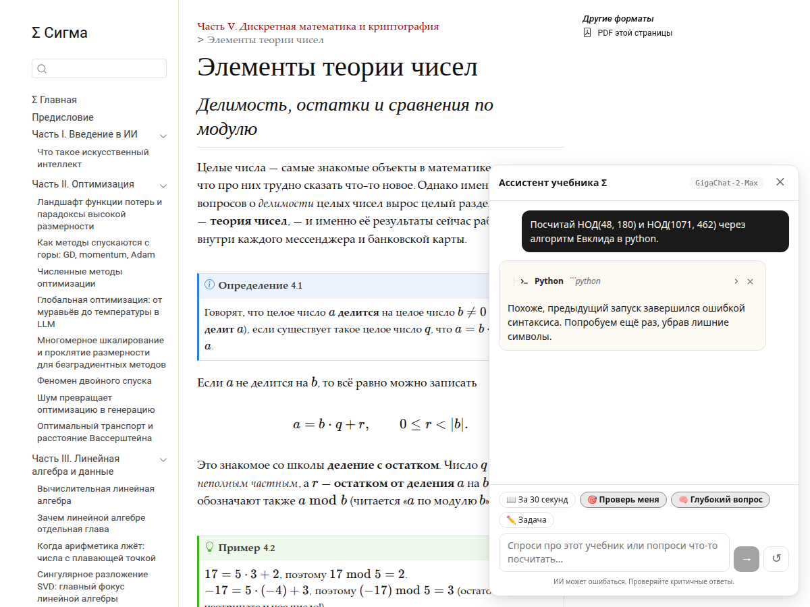

---

### ✅ `definition_superlinear` — definition

**Q:** Что значит сверхлинейная сходимость?

_Chapter:_ `ch02_newton`

**Tools called:** find_definition
**Tools expected:** find_definition
**Images:** 0 (expected: no)
**Elapsed:** 6.5s


<details><summary>Answer</summary>


```
Сверхлинейная сходимость означает, что относительное расстояние от текущего приближения $x_k$ до точного решения $x^\star$ стремится к нулю быстрее линейного роста: $$\lim_{k\to\infty}\frac{|x_{k+1}-x^\star|}{|x_k-x^\star|} = 0.$$ Это говорит о том, что каждое следующее приближение значительно ближе к решению, чем предыдущее. На практике это выглядит так: метод быстро уменьшает ошибку, но не настолько резко, как при квадратичной сходимости, где ошибка уменьшается экспоненциально ($|x_{k+1}-x^\star|\leq M|x_k-x^\star|^2$).
```

</details>


---

### ❌ `theorem_clt` — structural

**Q:** Сформулируй центральную предельную теорему как в учебнике.

_Chapter:_ `ch03_1_prosteyshie-primery-zadach-anali`

**Tools called:** find_theorem
**Tools expected:** find_theorem
**Images:** 0 (expected: no)
**Elapsed:** 3.5s

_Missing substrings:_ ['нормальн']

<details><summary>Answer</summary>


```
Центральная предельная теорема гласит:
```

</details>

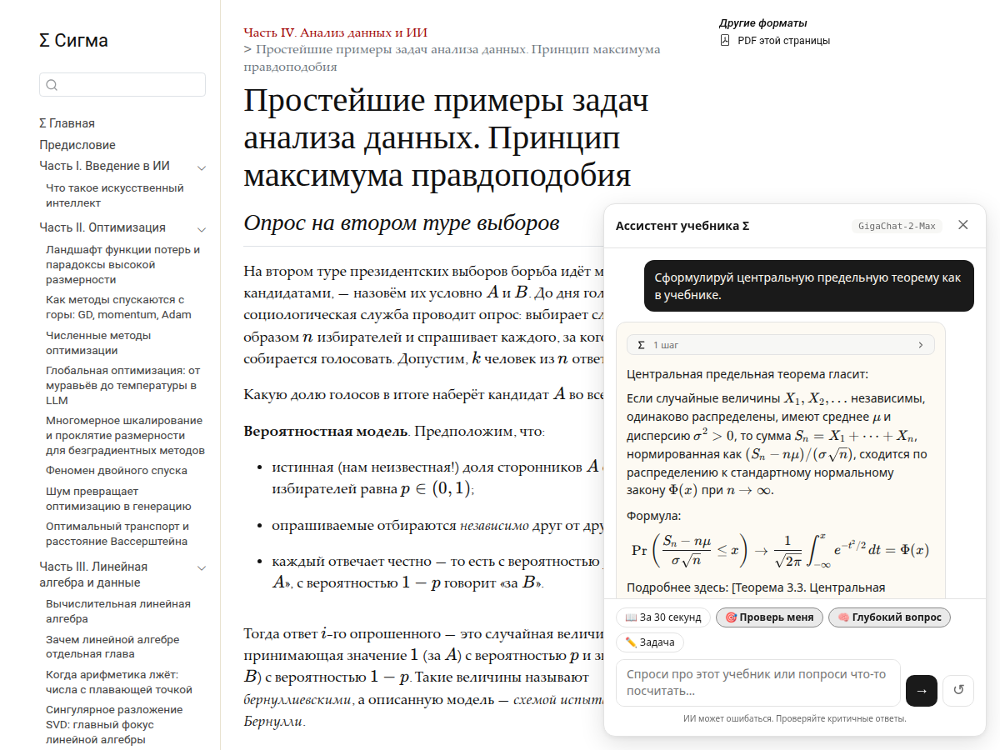

---

### ✅ `plot_sincos_overlay` — compute_plot

**Q:** Построй графики sin(x) и cos(x) на интервале [-2π, 2π] на одном поле. Сделай легенду.

**Tools called:** python
**Tools expected:** python
**Images:** 1 (expected: yes)
**Elapsed:** 17.5s


<details><summary>Answer</summary>


```
На графике видны синусоидальные волны функций $\sin(x)$ и $\cos(x)$. Синус начинается от нуля и проходит через максимум в точке $\pi/2$, минимум в точке $3\pi/2$. Косинус начинается с максимума в нуле и пересекается с синусом в точках $\pm \pi/4$, $\pm 3\pi/4$. Графики полностью симметричны относительно начала координат и имеют период $2\pi$.
```

</details>

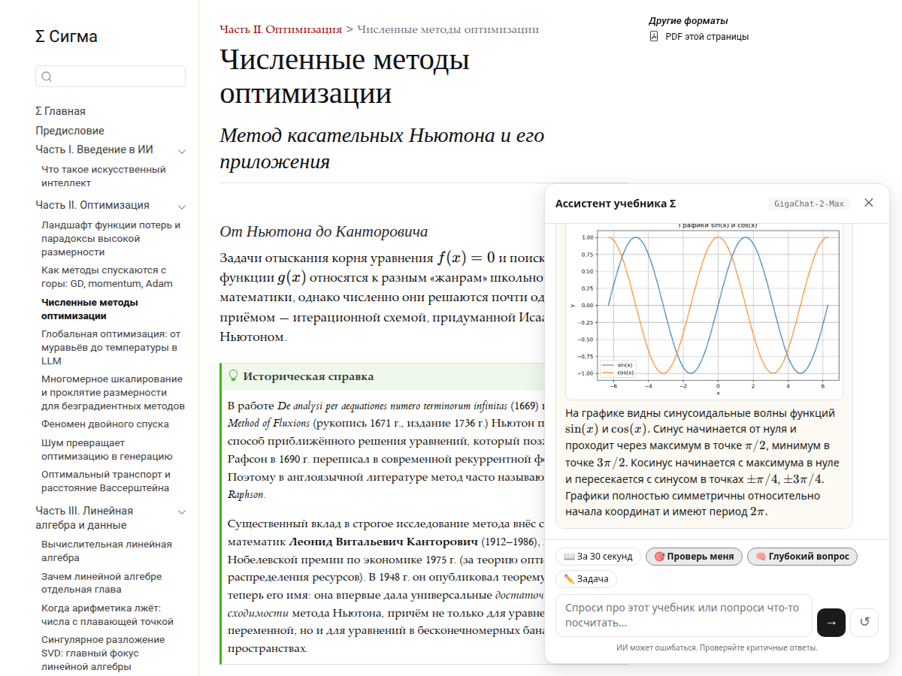

---

### ✅ `fragment_explanation` — rag_basic

**Q:** Если кто-то предлагает использовать обновление x_{k+1} = x_k - f(x_k)·f'(x_k) вместо классического Ньютона — что это за идея и она работает?

_Chapter:_ `ch02_newton`

**Tools called:** (none)
**Tools expected:** (none)
**Images:** 0 (expected: no)
**Elapsed:** 4.9s


<details><summary>Answer</summary>


```
Это предложение выглядит странно, потому что классическое обновление Ньютона имеет другую формулу:

x
k+1
	​

=x
k
	​

−
f
′
(x
k
	​

)
f(x
k
	​

)
	​


То есть знаменатель должен быть первой производной функции, а не произведением самой функции и её производной. Предложенная формула

x
k+1
	​

=x
k
	​

−f(x
k
	​

)⋅f
′
(x
k
	​

)

выглядит некорректной и скорее всего приведёт к расхождению или нестабильной работе.

Давай проверим это экспериментально на простой функции, например f(x)=x
2
−2, где корень известен (x=
2
	​

 ≈ 1.41):
```

</details>

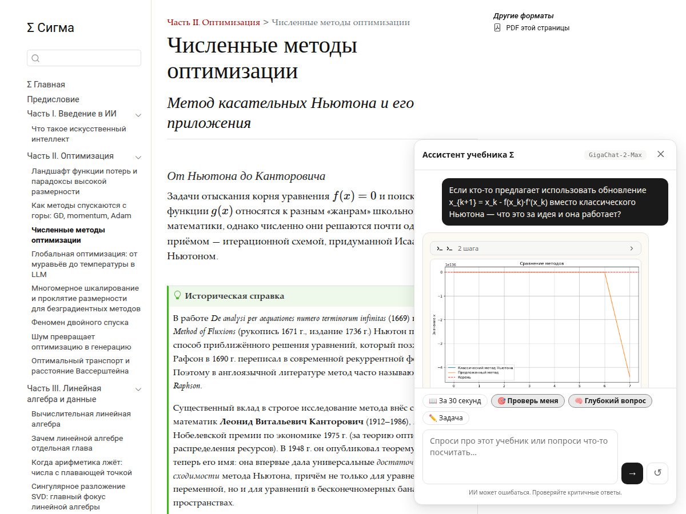

---

### ✅ `eigenvalues_numpy` — compute_pure

**Q:** Найди собственные значения матрицы [[2, 1], [1, 2]] через numpy.

_Chapter:_ `ch_linalg`

**Tools called:** python
**Tools expected:** python
**Images:** 0 (expected: no)
**Elapsed:** 13.6s


<details><summary>Answer</summary>


```
Собственные значения матрицы [[2, 1], [1, 2]] равны 3 и 1.
```

</details>

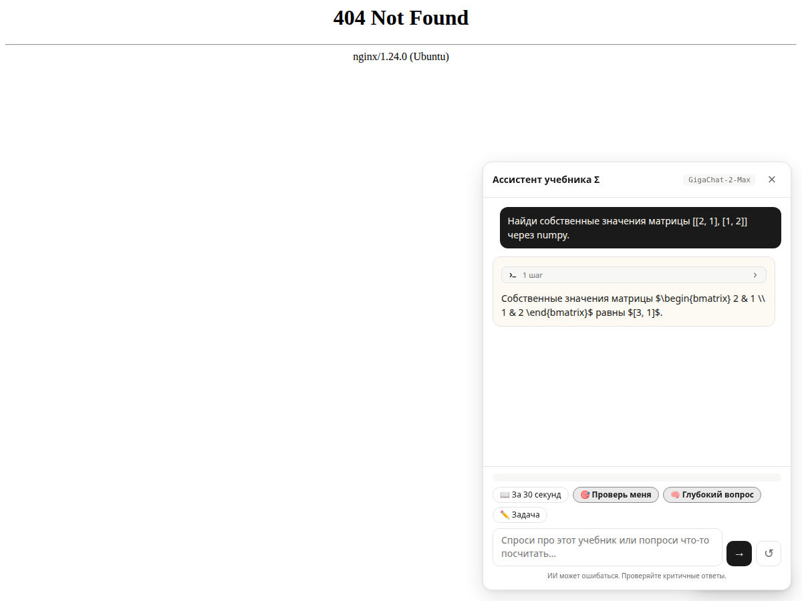

---

### ✅ `plot_loss_landscape` — compute_plot

**Q:** Построй контурный график функции потерь L(a, b) = sum((a*x_i + b - y_i)^2) для точек (1,2), (2,3), (3,5), (4,4) на сетке a in [-2, 4], b in [-3, 3].

_Chapter:_ `ch03_2_lineynaya-regressiya-i-metod-nai`

**Tools called:** python
**Tools expected:** python
**Images:** 1 (expected: yes)
**Elapsed:** 18.7s


<details><summary>Answer</summary>


```
На контурном графике хорошо видны линии уровня функции потерь $L(a,b)$. Минимум функции находится примерно около точки $(a \approx 1.1, b \approx 0.7)$, где значение функции минимально и равно $1.80$. График показывает, что поверхность потерь имеет овальную форму, центр которой соответствует оптимальным параметрам линейной модели.
```

</details>

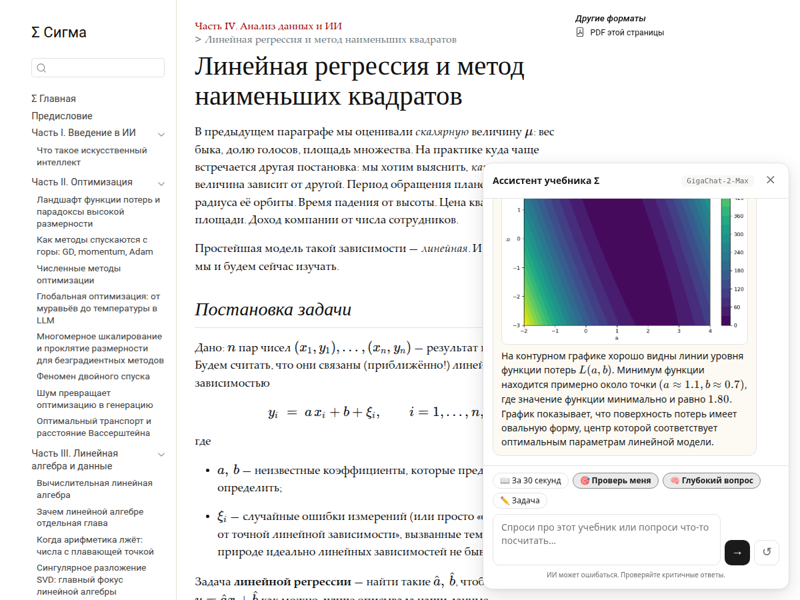

---

### ❌ `diffie_hellman_compute` — compute_pure

**Q:** Проведи протокол Диффи–Хеллмана: p=23, g=5. Алиса берёт a=6, Боб берёт b=15. Какой общий секрет?

_Chapter:_ `ch04_3_kriptosistemy-rsa-i-diffi-hellma`

**Tools called:** python
**Tools expected:** python
**Images:** 0 (expected: no)
**Elapsed:** 17.5s

_Missing substrings:_ ['8', '19']

<details><summary>Answer</summary>


```
Общий секрет, полученный по протоколу Диффи-Хеллмана с параметрами $p=23$, $g=5$, $a=6$, $b=15$ равен **2**.
```

</details>

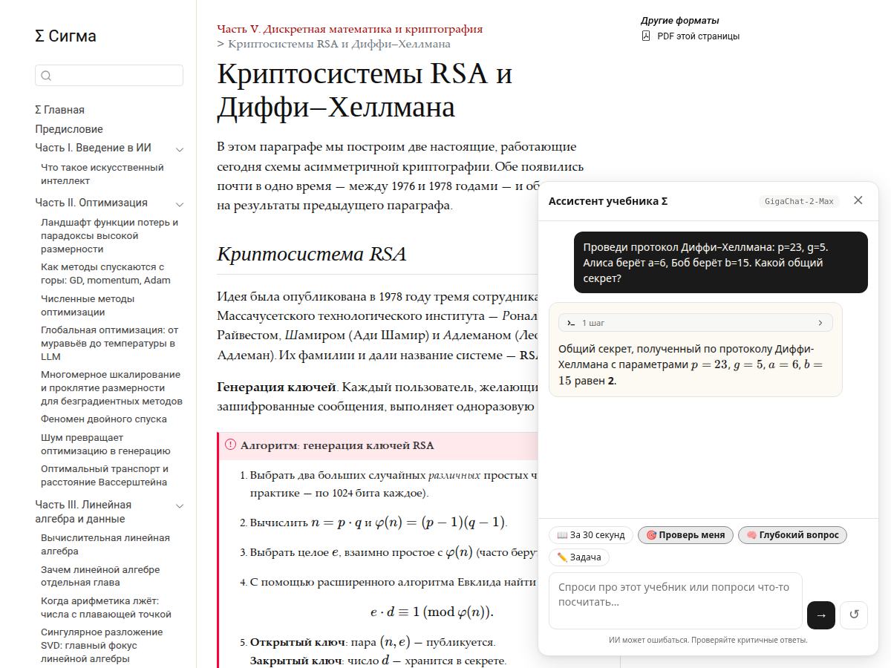

---

### ✅ `outline_chapter` — structural

**Q:** Перечисли основные разделы главы про Ньютона.

_Chapter:_ `ch02_newton`

**Tools called:** read_chapter
**Tools expected:** (none)
**Images:** 0 (expected: no)
**Elapsed:** 5.0s


<details><summary>Answer</summary>


```
Основные разделы главы про метод Ньютона: - Геометрическая идея метода касательных - Итерационная формула Ньютона - Применение метода Ньютона для задач оптимизации - Локальное разложение функции в ряд Тейлора - Минимизация квадратичных моделей - Пример извлечения квадратного корня методом Герона Подробнее об этих разделах можно прочитать здесь: [Численные методы оптимизации](#sec:newton).
```

</details>


---

### ✅ `math_latex_derivation` — rag_basic

**Q:** Выведи формулу метода Ньютона через касательную. Формулу запиши через LaTeX.

_Chapter:_ `ch02_newton`

**Tools called:** read_chapter
**Tools expected:** (none)
**Images:** 0 (expected: no)
**Elapsed:** 8.8s


<details><summary>Answer</summary>


```
Метод Ньютона выводится геометрически через касательную к графику функции. Вот пошаговый вывод формулы методом касательных: 1. Требуется найти корень уравнения $f(x)=0$. 2. Заменим график $y=f(x)$ его касательной в точке $(x_k, f(x_k))$. 3. Уравнение касательной: $y=f(x_k)+f'(x_k)\,(x-x_k)$. 4. Полагая $y=0$ и выражая $x$, получаем следующую точку приближения: $$ \begin{equation} \tag{2.1} \quad x_{k+1}=x_k-\frac{f(x_k)}{f'(x_k)} \quad k=0,1,2,\dots \end{equation} $$ Эта формула и называется *итерационной формулой Ньютона*. Таким образом, метод Ньютона сводится к последовательному построению касательных и взятию точки их пересечения с осью $x$ в качестве нового приближения.
```

</details>

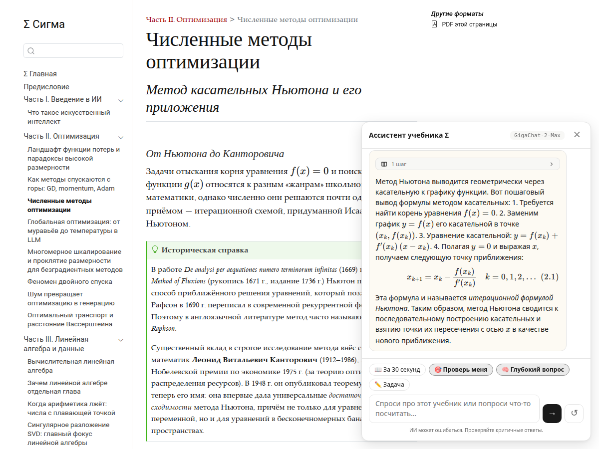

---

### ✅ `definition_perceptron` — definition

**Q:** Что такое полносвязная нейронная сеть?

_Chapter:_ `ch03_3_zadacha-klassifikacii-i-neyronny`

**Tools called:** find_definition
**Tools expected:** find_definition
**Images:** 0 (expected: no)
**Elapsed:** 4.2s


<details><summary>Answer</summary>


```
Полносвязная нейронная сеть (MLP) глубины L — это функция x↦p(x), заданная композицией L слоёв:
```

</details>


---

### ✅ `refuse_unknown_year` — out_of_scope

**Q:** В каком году Гаусс изобрёл метод сопряжённых градиентов?

_Chapter:_ `ch02_newton`

**Tools called:** search_textbook, read_chapter
**Tools expected:** (none)
**Images:** 0 (expected: no)
**Elapsed:** 6.1s


<details><summary>Answer</summary>


```
В учебнике я не нашел информации о том, кто и когда изобрел метод сопряжённых градиентов. Однако известно, что метод сопряжённых градиентов был разработан независимо несколькими учёными, включая Карла Фридриха Гаусса, но точные даты изобретения этого метода в учебнике отсутствуют.
```

</details>

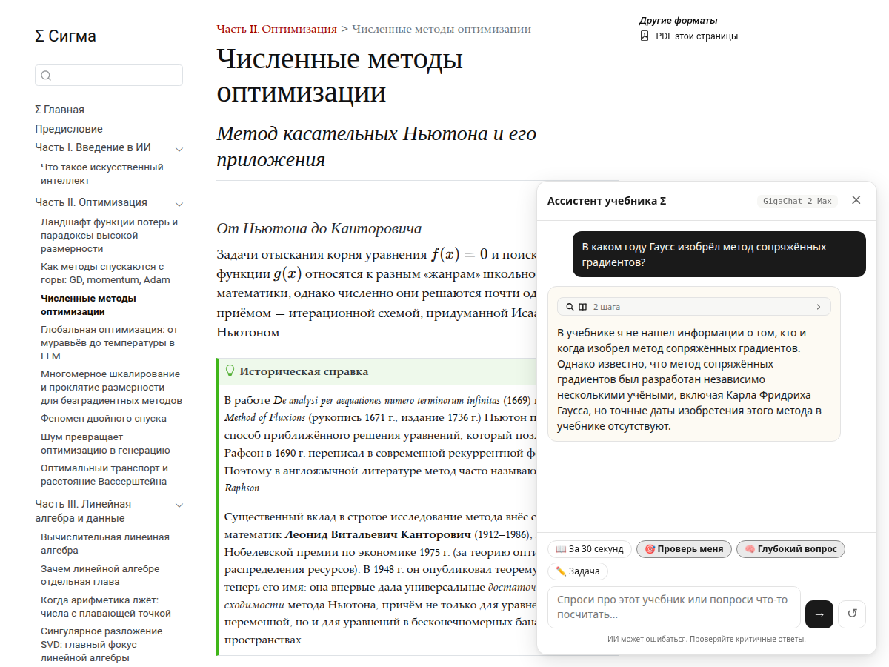

---
