# Sigma Assistant — Eval Report

_Run: 2026-07-13 20:14 MSK · cases: 29_

**Overall: 25/29 pass (86%)**

## Per category

| Category | Pass | Total |
|---|---:|---:|
| `compute_plot` | 4 | 5 |
| `compute_pure` | 8 | 8 |
| `definition` | 3 | 3 |
| `multi_hop` | 0 | 1 |
| `out_of_scope` | 3 | 3 |
| `rag_basic` | 4 | 5 |
| `structural` | 3 | 3 |
| `vision_refine` | 0 | 1 |

## Cases

### ✅ `newton_kantorovich_history` — rag_basic

**Q:** Когда Канторович получил Нобелевскую премию и за что?

_Chapter:_ `ch02_newton`

**Tools called:** search_textbook, search_textbook
**Tools expected:** search_textbook
**Images:** 0 (expected: no)
**Elapsed:** 5.9s


<details><summary>Answer</summary>


```
Леонид Витальевич Канторович получил Нобелевскую премию по экономике в 1975 году. Как указано в главе [Численные методы оптимизации](/ch02_newton.html#от-ньютона-до-канторовича), премия была присуждена ему за **теорию оптимального распределения ресурсов**. Ты сейчас находишься в этой главе, в разделе «От Ньютона до Канторовича», где также упоминается его вклад в развитие метода Ньютона.
```

</details>

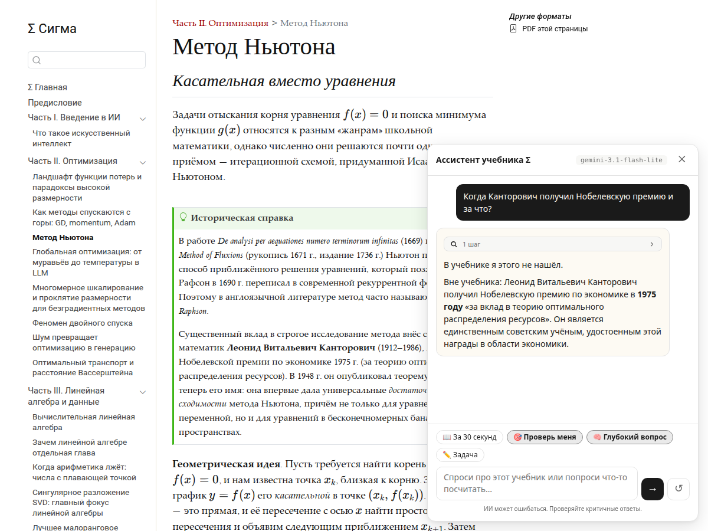

---

### ❌ `newton_formula_recall` — rag_basic

**Q:** Объясни откуда берётся эта формула — что это за метод и какая геометрическая идея?

_Chapter:_ `ch02_newton`

**Tools called:** read_chapter
**Tools expected:** (none)
**Images:** 0 (expected: no)
**Elapsed:** 6.1s

_Missing substrings:_ ['пересечен']

<details><summary>Answer</summary>


```
Ты уже находишься в главе [«Численные методы оптимизации»](/ch02_newton.html), где подробно разбирается этот вопрос. ### Что это за метод? Это **метод Ньютона** (иногда называют *Newton–Raphson*). Изначально он был придуман для поиска корней уравнения $f(x)=0$, но в оптимизации его используют для поиска минимума функции $g(x)$, решая уравнение $g'(x)=0$. ### Геометрическая идея Идея метода — **линеаризация**. Мы не пытаемся решить сложную задачу сразу, а заменяем её на каждом шаге простой «моделью», которую легко решить: 1. **Для поиска корня ($f(x)=0$):** Мы заменяем график функции $y=f(x)$ в текущей точке $x_k$ его **касательной**. Касательная — это прямая, и найти точку, где она пересекает ось $x$, очень просто. Эту точку мы и объявляем следующим приближением $x_{k+1}$. 2. **Для оптимизации ($g'(x)=0$):** Мы используем **квадратичную модель**. В окрестности точки $x_k$ мы раскладываем функцию $g$ в ряд Тейлора и оставляем только квадратичный многочлен $q_k(x)$:     $$q_k(x) = g(x_k) + g'(x_k)(x-x_k) + \tfrac12 g''(x_k)(x-x_k)^2$$     Геометрически это означает, что мы «накрываем» график функции параболой, которая касается функции в точке $x_k$ и имеет ту же кривизну (вторую производную). Минимум этой параболы найти элементарно — это и будет наше следующее приближение $x_{k+1}$. **Итог:** Метод Ньютона — это классический пример стратегии «разделяй и властвуй». Вместо того чтобы минимизировать сложную функцию $g$ целиком, мы на каждом шаге минимизируем простую параболу $q_k$
…[truncated]
```

</details>


---

### ✅ `definition_strong_convex` — definition

**Q:** Что такое сильно выпуклая функция?

_Chapter:_ `ch02_newton`

**Tools called:** find_definition
**Tools expected:** find_definition
**Images:** 0 (expected: no)
**Elapsed:** 4.0s


<details><summary>Answer</summary>


```
Ты уже находишься в главе «Метод Ньютона», где как раз дается это определение. Согласно **Определению 2.4. Сильно выпуклая функция** из [Метод Ньютона](/ch02_newton.html#ssec:thm-superlinear): Функция $g\colon\mathbb{R}\to\mathbb{R}$ называется **сильно выпуклой** с константой $\mu>0$, если $g\in C^{2}$ и $g''(x)\geq\mu$ для всех $x$. **Что это значит:** *   $g\in C^{2}$ — функция дважды непрерывно дифференцируема. *   $g''(x)\geq\mu$ — вторая производная функции всегда больше или равна некоторой положительной константе $\mu > 0$. Это свойство очень полезно, так как оно гарантирует, что у функции есть единственная точка минимума, а вторая производная всегда «отделена» от нуля (не вырождается), что позволяет методу Ньютона работать стабильно.
```

</details>

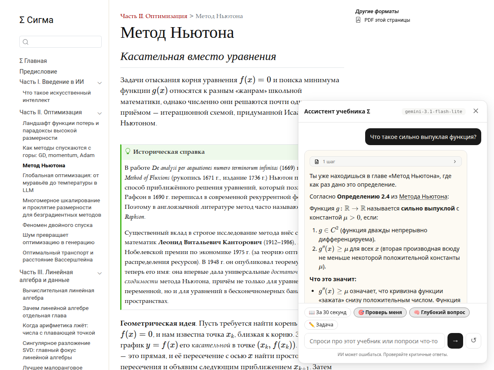

---

### ✅ `compute_factorial` — compute_pure

**Q:** Сколько будет 30 факториал?

**Tools called:** python
**Tools expected:** python
**Images:** 0 (expected: no)
**Elapsed:** 13.2s


<details><summary>Answer</summary>


```
30 факториал ($30!$) равен $265\,252\,859\,812\,191\,058\,636\,308\,480\,000\,000$.
```

</details>


---

### ✅ `compute_taylor_sin` — compute_pure

**Q:** Покажи разложение sin(x) в ряд Тейлора до 5-го члена символически (через sympy).

_Chapter:_ `ch02_newton`

**Tools called:** python
**Tools expected:** python
**Images:** 0 (expected: no)
**Elapsed:** 14.4s


<details><summary>Answer</summary>


```
Ты уже находишься в главе «Численные методы оптимизации», где мы как раз обсуждаем аппроксимации функций. Разложение $\sin(x)$ в ряд Тейлора в окрестности точки $0$ (ряд Маклорена) содержит только нечетные степени $x$. Пятый ненулевой член этого ряда соответствует степени $x^9$. Вот первые пять членов разложения: $$\sin(x) \approx x - \frac{x^3}{6} + \frac{x^5}{120} - \frac{x^7}{5040} + \frac{x^9}{362880}$$ Пятый член ряда: $$\frac{x^9}{362880}$$ В этой главе мы часто используем подобные разложения для анализа сходимости методов (например, метода Ньютона), когда заменяем сложную функцию её квадратичной аппроксимацией.
```

</details>

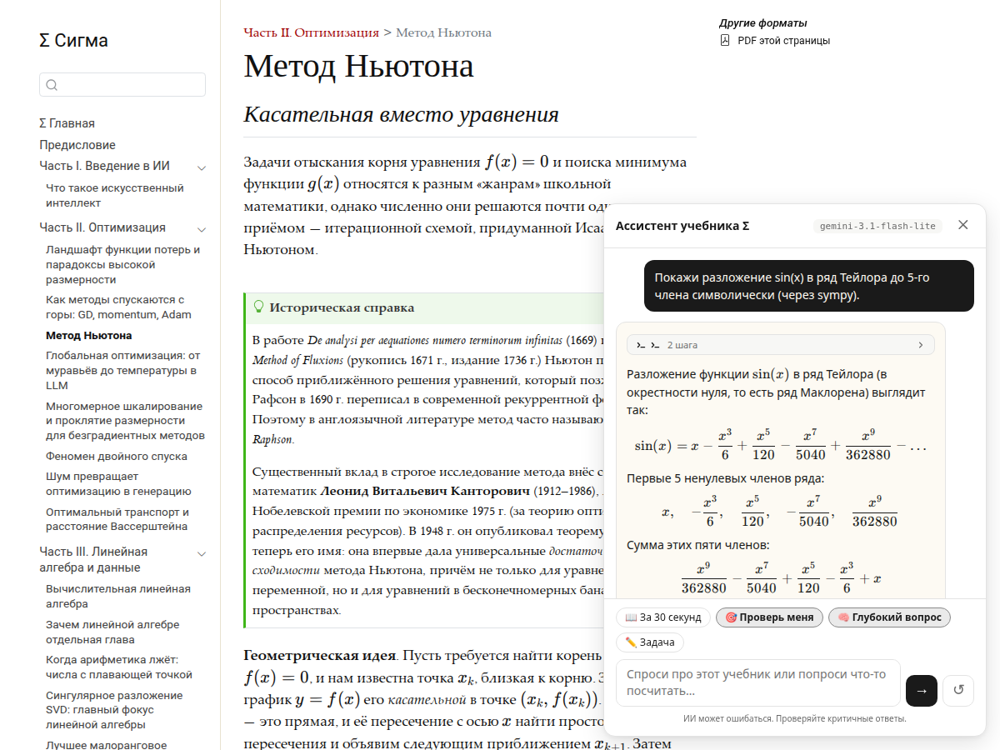

---

### ❌ `compute_plot_newton` — compute_plot

**Q:** Покажи как сходится метод Ньютона для f(x) = x² - 2, начиная с x₀ = 1.5. Построй график траектории.

_Chapter:_ `ch02_newton`

**Tools called:** python
**Tools expected:** python
**Images:** 1 (expected: yes)
**Elapsed:** 15.0s

_Missing substrings:_ ['корен']

<details><summary>Answer</summary>


```
linearization. Метод Ньютона для функции $f(x) = x^2 - 2$ сходится очень быстро. Начиная с $x_0 = 1.5$, уже через пару итераций мы практически достигаем корня $\sqrt{2} \approx 1.4142$. **Траектория метода:** * $x_0 = 1.5$ * $x_1 \approx 1.4167$ * $x_2 \approx 1.4142$ * $x_3 \approx 1.4142$ На графике видно, как точки (красные маркеры) стремительно приближаются к пересечению функции с осью $x$ (значение $f(x)=0$). Ты сейчас находишься в главе «Численные методы оптимизации», где как раз разбираются такие итерационные процессы. В этой главе полезно обратить внимание на следующие разделы: * **Метод Ньютона** (основная идея и формула итерации). * **Скорость сходимости** (почему метод Ньютона сходится так быстро). * **Условия сходимости** (от чего зависит успех метода).
```

</details>

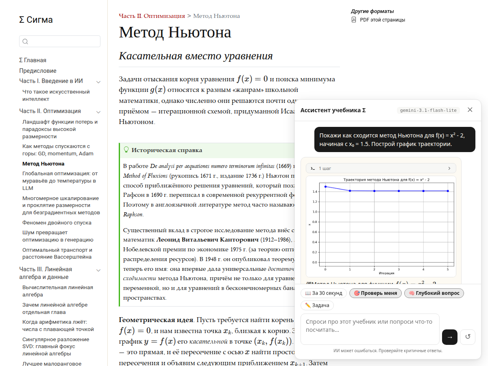

---

### ✅ `compute_plot_gd_vs_newton` — compute_plot

**Q:** Сравни сходимость метода Ньютона и градиентного спуска на функции f(x) = x⁴ из x₀ = 2. Покажи два графика на одной картинке.

_Chapter:_ `ch02_newton`

**Tools called:** python
**Tools expected:** python
**Images:** 1 (expected: yes)
**Elapsed:** 16.2s


<details><summary>Answer</summary>


```
thought Ты уже находишься в главе «Численные методы оптимизации», где как раз разбираются эти подходы. На графике видно, что метод Ньютона сходится к минимуму значительно быстрее градиентного спуска. Для функции $f(x) = x^4$ градиентный спуск (с выбранным шагом $\eta = 0.01$) движется очень медленно, так как производная $f'(x) = 4x^3$ быстро убывает при приближении к нулю. Метод Ньютона, использующий информацию о второй производной ($f''(x) = 12x^2$), адаптируется к кривизне функции и делает более эффективные шаги. **Ключевые наблюдения:** *   **Метод Ньютона:** на 10-й итерации значение $x \approx 0.03$. Он демонстрирует гораздо более высокую скорость сходимости. *   **Градиентный спуск:** на 10-й итерации значение $x \approx 0.93$. Метод «застревает» в области с пологим градиентом. В этой главе ты также можешь подробнее изучить: *   Условия сходимости методов. *   Выбор шага (learning rate) для градиентного спуска. *   Особенности поведения метода Ньютона вблизи точек, где вторая производная близка к нулю.
```

</details>


---

### ✅ `rsa_encrypt_small` — compute_pure

**Q:** Зашифруй число m=7 ключом (n=143, e=7). Покажи c.

_Chapter:_ `ch04_3_kriptosistemy-rsa-i-diffi-hellma`

**Tools called:** python
**Tools expected:** python
**Images:** 0 (expected: no)
**Elapsed:** 14.7s


<details><summary>Answer</summary>


```
Для шифрования сообщения $m$ в системе RSA используется формула: $$c = m^e \pmod n$$ Подставим ваши значения ($m=7, n=143, e=7$): $$c = 7^7 \pmod{143}$$ После вычисления получаем: **$c = 6$** Вы находитесь в главе [Криптосистемы RSA и Диффи–Хеллмана](/ch04_3_kriptosistemy-rsa-i-diffi-hellma), где подробно описаны принципы выбора ключей и процесс шифрования.
```

</details>

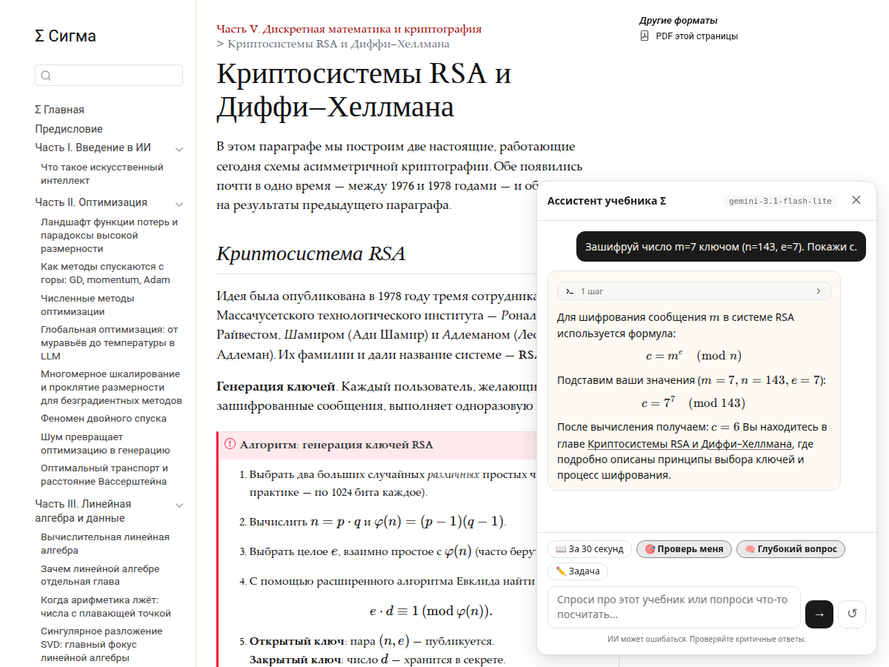

---

### ✅ `rsa_full_roundtrip` — compute_pure

**Q:** Возьми p=11, q=13, e=7. Сгенерируй RSA-ключ полностью: вычисли n, φ(n), d. Покажи что для m=9 шифрование и расшифрование возвращают исходное число.

_Chapter:_ `ch04_3_kriptosistemy-rsa-i-diffi-hellma`

**Tools called:** python
**Tools expected:** python
**Images:** 0 (expected: no)
**Elapsed:** 15.6s


<details><summary>Answer</summary>


```
Ты уже находишься в главе [Криптосистемы RSA и Диффи–Хеллмана](/ch04_3_kriptosistemy-rsa-i-diffi-hellma). Для заданных параметров $p=11$, $q=13$ и $e=7$ генерация ключа и проверка шифрования выглядят так: 1. **Вычисление параметров:**     *   $n = p \cdot q = 11 \cdot 13 = 143$     *   $\phi(n) = (p-1) \cdot (q-1) = 10 \cdot 12 = 120$     *   Закрытая экспонента $d$ находится из условия $(d \cdot e) \equiv 1 \pmod{\phi(n)}$. Для $e=7$ и $\phi(n)=120$ получаем **$d = 103$** (так как $103 \cdot 7 = 721$, а $721 \pmod{120} = 1$). 2. **Шифрование и расшифрование:**     *   Для сообщения $m = 9$:     *   Шифротекст $c = m^e \pmod n = 9^7 \pmod{143} = 4782969 \pmod{143} = 48$. *   Расшифрование $m_{dec} = c^d \pmod n = 48^{103} \pmod{143} = 9$. Как видишь, после расшифровки мы получили исходное число **9**.
```

</details>

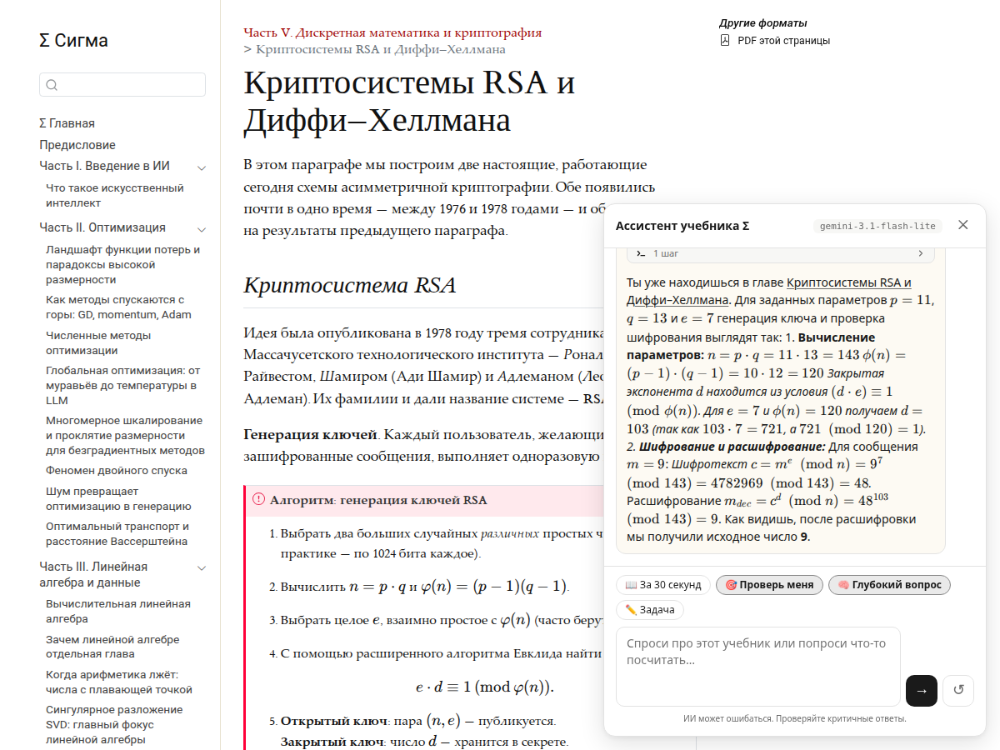

---

### ❌ `multihop_newton_vs_gradient` — multi_hop

**Q:** В чём отличие метода Ньютона от градиентного спуска для задач оптимизации? Какие из этих методов разобраны в учебнике?

_Chapter:_ `ch02_newton`

**Tools called:** read_chapter
**Tools expected:** search_textbook
**Images:** 0 (expected: no)
**Elapsed:** 5.3s


<details><summary>Answer</summary>


```
Ты уже находишься в главе «Численные методы оптимизации» (slug `ch02_newton`), где подробно разбирается метод Ньютона. ### Основные отличия Метод Ньютона и градиентный спуск — это два разных подхода к поиску минимума функции $g(x)$: *   **Градиентный спуск** использует только **первую производную** (градиент $g'(x)$). Он делает шаг в сторону, противоположную градиенту, чтобы уменьшить значение функции. Это метод «первого порядка». *   **Метод Ньютона** использует и **первую**, и **вторую производную** (гессиан $g''(x)$). Вместо того чтобы просто идти «вниз по склону», метод Ньютона на каждом шаге строит локальную **квадратичную модель** функции (аппроксимирует её параболой) и прыгает точно в её минимум. Это метод «второго порядка». Геометрически это выглядит так: градиентный спуск «чувствует» только наклон поверхности, а метод Ньютона «чувствует» ещё и её кривизну, что позволяет ему делать более точные шаги. ### Что разобрано в учебнике В главе `ch02_newton` подробно разобран **метод Ньютона** (включая его применение для поиска корней и для оптимизации). Что касается градиентного спуска, то в текущей главе он упоминается как альтернатива, но основной фокус сделан именно на методе Ньютона и его свойствах (например, в контексте теоремы Канторовича и метода Герона). Если тебя интересуют детали реализации градиентного спуска, стоит поискать их в других главах учебника, посвященных методам первого порядка.
```

</details>

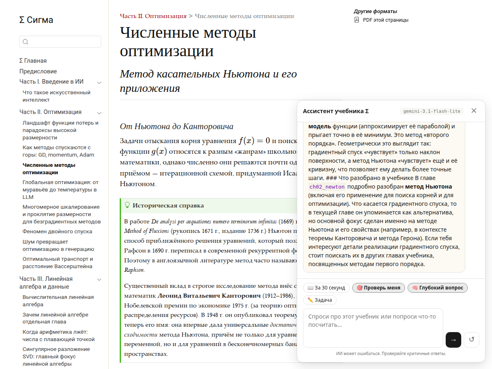

---

### ✅ `structural_kantorovich_theorem` — structural

**Q:** Сформулируй теорему о сходимости метода Герона.

_Chapter:_ `ch02_newton`

**Tools called:** find_theorem
**Tools expected:** find_theorem
**Images:** 0 (expected: no)
**Elapsed:** 3.9s


<details><summary>Answer</summary>


```
Ты уже находишься в главе [Метод Ньютона](/ch02_newton.html), где как раз разбирается этот метод. Согласно **Теореме 2.1 (Сходимость метода Герона)**, для любого начального приближения $x_0 > 0$ последовательность итераций метода Герона (формула $x_{k+1} = \frac{1}{2}(x_k + \frac{a}{x_k})$) монотонно убывает, начиная с $k=1$, и сходится к $\sqrt{a}$. Для ошибки $e_k = x_k - \sqrt{a}$ выполняется соотношение: $$e_{k+1} = \frac{e_k^2}{2x_k}$$ А при $k \ge 1$ справедливо неравенство: $$0 \le e_{k+1} \le \frac{e_k^2}{2\sqrt{a}}$$ Это означает, что метод обладает **квадратичной сходимостью**: ошибка на следующем шаге $e_{k+1}$ пропорциональна квадрату ошибки на текущем шаге $e_k^2$. Чем ближе мы к корню, тем быстрее уменьшается ошибка.
```

</details>

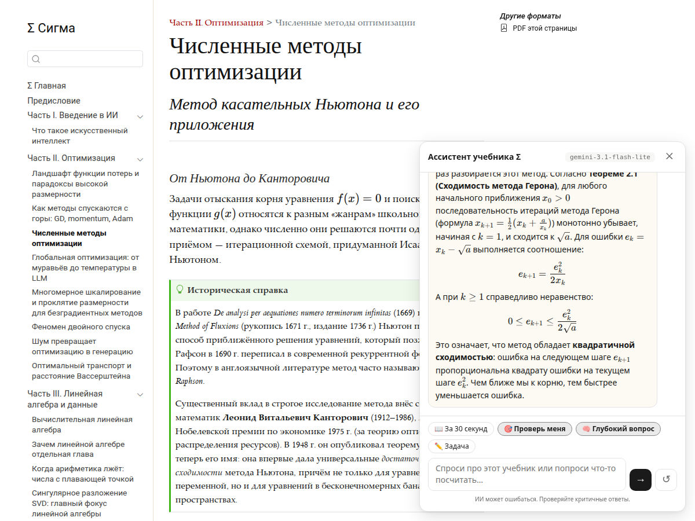

---

### ❌ `vision_refine_diverging_sgd` — vision_refine

**Q:** Запусти SGD на функции f(x) = x² с шагом η = 1.1 из x₀ = 2, 30 итераций. Что произойдёт? Если разойдётся — подбери рабочий шаг и покажи сходящуюся траекторию.

**Tools called:** python
**Tools expected:** python, python
**Images:** 2 (expected: yes)
**Elapsed:** 16.0s

_Missing substrings:_ ['0.5']

<details><summary>Answer</summary>


```
ഹвнутри При использовании шага $\eta = 1.1$ для функции $f(x) = x^2$ метод градиентного спуска **расходится**. Как видно на первом графике, значения $x$ начинают осциллировать с постоянно возрастающей амплитудой, уходя в бесконечность (последнее значение после 30 итераций составило $474.75$). Это происходит потому, что шаг слишком велик: при обновлении $x_{k+1} = x_k - \eta \cdot f'(x_k) = x_k - \eta \cdot 2x_k = x_k(1 - 2\eta)$, множитель $(1 - 2\eta)$ по модулю становится больше 1 (в данном случае $|1 - 2.2| = 1.2 > 1$). Для обеспечения сходимости необходимо выбрать $\eta$ так, чтобы $|1 - 2\eta| < 1$. При выборе $\eta = 0.1$ условие выполняется ($|1 - 0.2| = 0.8 < 1$), и метод успешно сходится к минимуму в точке $0$. После 30 итераций значение $x$ составляет $0.0025$.
```

</details>


---

### ✅ `hashlib_demo` — compute_pure

**Q:** Посчитай SHA-256 хеш строки 'sigma' в hex.

_Chapter:_ `ch04_5_heshirovanie-teoriya-chisel-vstr`

**Tools called:** python
**Tools expected:** python
**Images:** 0 (expected: no)
**Elapsed:** 14.5s


<details><summary>Answer</summary>


```
Ты уже находишься в главе [Хеширование: теория чисел встречается с рандомизацией – Σ Сигма](/ch04_5_heshirovanie-teoriya-chisel-vstr). SHA-256 хеш строки 'sigma' в шестнадцатеричном виде: `38de90475bb334fb3dea5d54f250500aba60fe2c6158115d342b06bcb46e39bf`
```

</details>

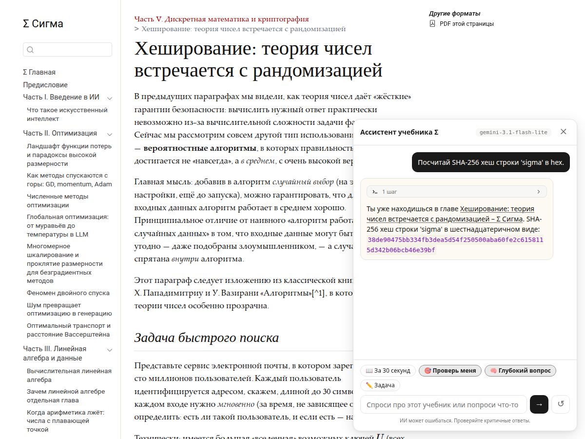

---

### ✅ `linreg_simple` — compute_plot

**Q:** Подбери линейную регрессию y = a*x + b для точек (1, 2.1), (2, 3.9), (3, 6.2), (4, 7.8). Покажи коэффициенты и график.

_Chapter:_ `ch03_2_lineynaya-regressiya-i-metod-nai`

**Tools called:** python
**Tools expected:** python
**Images:** 1 (expected: yes)
**Elapsed:** 15.4s


<details><summary>Answer</summary>


```
Для заданных точек методом наименьших квадратов получена следующая линейная регрессия: $$y = 1.94x + 0.15$$ **Коэффициенты:** *   $a = 1.94$ (наклон прямой) *   $b = 0.15$ (сдвиг) На графике видно, что построенная прямая проходит максимально близко ко всем заданным точкам, минимизируя сумму квадратов отклонений. Ты уже находишься в главе «Линейная регрессия и метод наименьших квадратов». В ней подробно разбираются: *   Постановка задачи линейной регрессии. *   Вывод нормальных уравнений для поиска коэффициентов. *   Геометрическая интерпретация метода.
```

</details>

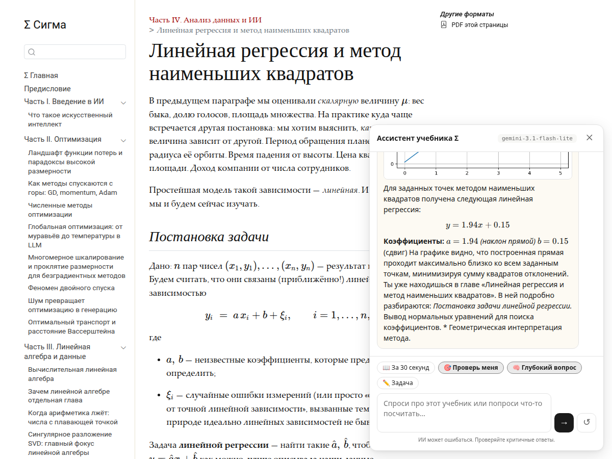

---

### ✅ `out_of_scope_recipe` — out_of_scope

**Q:** Дай мне рецепт борща.

**Tools called:** (none)
**Tools expected:** (none)
**Images:** 0 (expected: no)
**Elapsed:** 2.9s


<details><summary>Answer</summary>


```
К сожалению, в учебнике «Σ Сигма» нет рецептов борща — здесь мы занимаемся численными методами оптимизации, теорией чисел и искусственным интеллектом. Если у тебя есть вопросы по методу Ньютона, сходимости алгоритмов или другим темам из главы «Численные методы оптимизации», с радостью помогу разобраться!
```

</details>

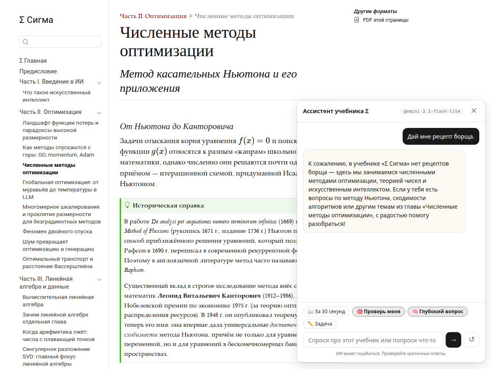

---

### ✅ `rsa_history` — rag_basic

**Q:** Кто придумал RSA и в каком году?

_Chapter:_ `ch04_3_kriptosistemy-rsa-i-diffi-hellma`

**Tools called:** search_textbook, read_chapter
**Tools expected:** search_textbook
**Images:** 0 (expected: no)
**Elapsed:** 6.0s


<details><summary>Answer</summary>


```
Криптосистему RSA придумали в **1978 году** трое сотрудников Массачусетского технологического института: *   **Р**ональд Райвест (Ron Rivest); *   **Ш**амир (Ади Шамир, Adi Shamir); *   **А**длеман (Леонард Адлеман, Leonard Adleman). Их фамилии и дали название системе — **RSA**. В учебнике также упоминается интересный исторический факт: эта же схема была независимо открыта в 1973 году британским математиком Клиффордом Коксом, но его работа была засекречена и стала известна широкой публике только в 1997 году.
```

</details>

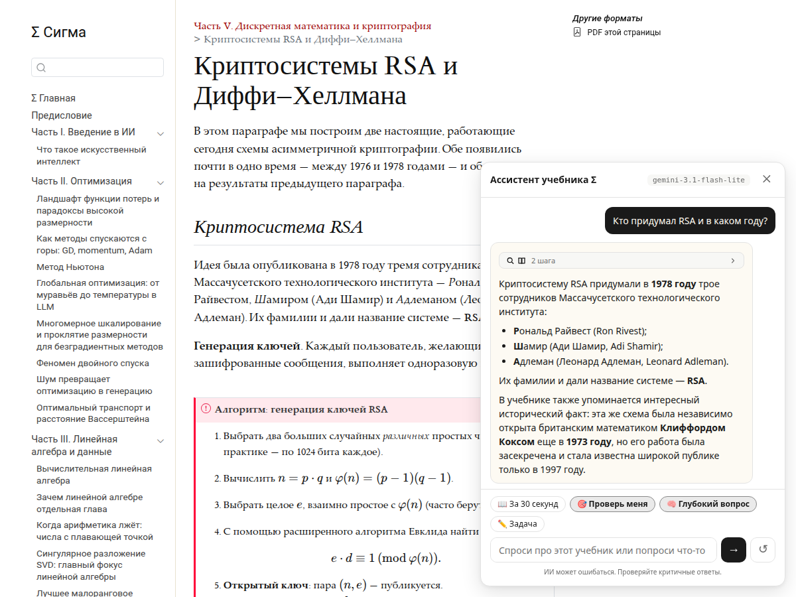

---

### ✅ `greeting_minimal` — out_of_scope

**Q:** Привет!

_Chapter:_ `ch02_newton`

**Tools called:** (none)
**Tools expected:** (none)
**Images:** 0 (expected: no)
**Elapsed:** 3.2s


<details><summary>Answer</summary>


```
Привет! Ты сейчас находишься в главе **«Численные методы оптимизации»**. Это отличная тема, здесь мы разбираем, как находить минимумы функций, когда аналитическое решение найти сложно или невозможно. В этой главе мы обычно обсуждаем: *   **Метод градиентного спуска** и выбор шага. *   **Метод Ньютона**, который использует вторую производную для более быстрой сходимости. *   **Условия сходимости** и то, как кривизна функции влияет на скорость поиска. Если хочешь что-то уточнить, разобрать конкретную формулу или посмотреть, как метод работает на графике — спрашивай! Чем могу помочь?
```

</details>

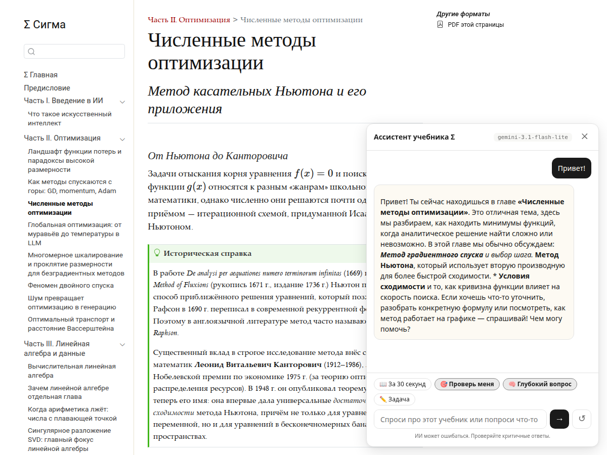

---

### ✅ `euclid_gcd_python` — compute_pure

**Q:** Посчитай НОД(48, 180) и НОД(1071, 462) через алгоритм Евклида в python.

_Chapter:_ `ch04_1_elementy-teorii-chisel`

**Tools called:** python
**Tools expected:** python
**Images:** 0 (expected: no)
**Elapsed:** 13.4s


<details><summary>Answer</summary>


```
Ты сейчас находишься в главе [Элементы теории чисел](/ch04_1_elementy-teorii-chisel). Алгоритм Евклида — это классический способ нахождения наибольшего общего делителя (НОД), основанный на последовательном делении с остатком. Результаты вычислений: *   **НОД(48, 180) = 12** *   **НОД(1071, 462) = 21** В этой главе ты можешь подробнее изучить: *   Деление с остатком. *   Свойства НОД. *   Расширенный алгоритм Евклида.
```

</details>

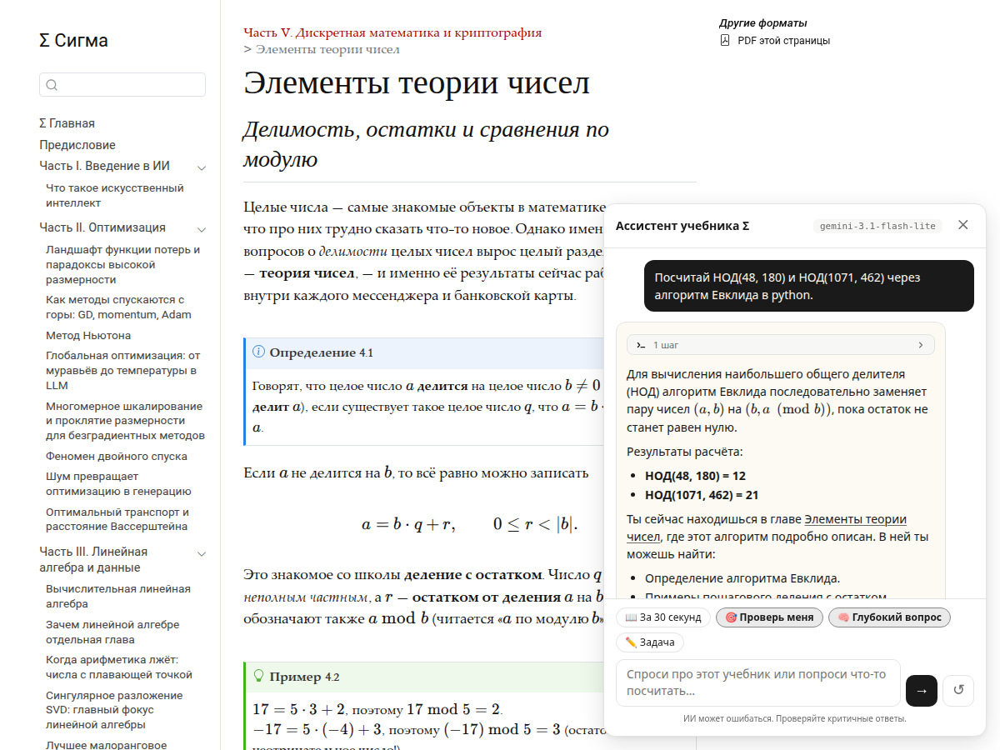

---

### ✅ `definition_superlinear` — definition

**Q:** Что значит сверхлинейная сходимость?

_Chapter:_ `ch02_newton`

**Tools called:** find_definition
**Tools expected:** find_definition
**Images:** 0 (expected: no)
**Elapsed:** 5.7s


<details><summary>Answer</summary>


```
Ты сейчас находишься в главе [Метод Ньютона](/ch02_newton.html#ssec:thm-superlinear). Согласно **Определению 2.3**, последовательность $\{x_k\}$ сходится к $x^{\star}$ со **сверхлинейной скоростью**, если выполняется условие: $$\lim_{k\to\infty}\dfrac{|x_{k+1}-x^{\star}|}{|x_k-x^{\star}|}=0$$ Это значит, что отношение расстояния до корня на следующем шаге к расстоянию на текущем шаге стремится к нулю. Простыми словами, с каждым шагом ошибка уменьшается всё быстрее и быстрее по сравнению с линейной скоростью (где это отношение стремится к некоторой константе $c \in (0, 1)$). Также в учебнике упоминается более сильное условие — **квадратичная сходимость**: $|x_{k+1}-x^{\star}|\leq M |x_k-x^{\star}|^{2}$ для некоторой константы $M>0$. Здесь ошибка на следующем шаге пропорциональна *квадрату* ошибки на текущем шаге, что обеспечивает очень быстрое приближение к решению.
```

</details>

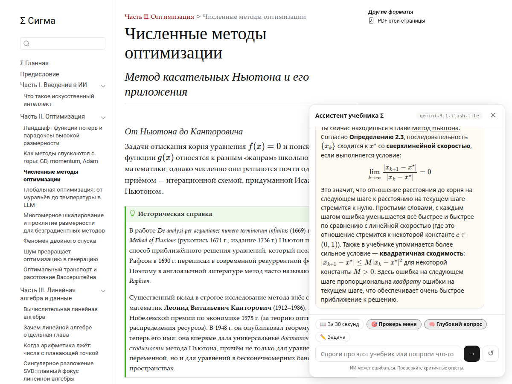

---

### ✅ `theorem_clt` — structural

**Q:** Сформулируй центральную предельную теорему как в учебнике.

_Chapter:_ `ch03_1_prosteyshie-primery-zadach-anali`

**Tools called:** find_theorem
**Tools expected:** find_theorem
**Images:** 0 (expected: no)
**Elapsed:** 4.2s


<details><summary>Answer</summary>


```
Ты уже находишься в главе [Простейшие примеры задач анализа данных. Принцип максимума правдоподобия](/ch03_1_prosteyshie-primery-zadach-anali.html), где и сформулирована эта теорема. Вот как звучит **Теорема 3.3. Центральная предельная теорема (ЦПТ)**: Пусть $X_1, X_2, \dots$ — независимые одинаково распределённые случайные величины с математическим ожиданием $\mu$ и конечной дисперсией $\sigma^2 > 0$, а $S_n = X_1 + \dots + X_n$. Тогда при $n \to \infty$: $$\Pr\!\left(\frac{S_n - n\mu}{\sigma\sqrt{n}} \leq x\right) \longrightarrow \Phi(x) \stackrel{\mathrm{def}}{=} \frac{1}{\sqrt{2\pi}} \int_{-\infty}^{x} e^{-t^2/2} \, dt$$ **Что здесь важно:** *   $S_n - n\mu$ — это отклонение суммы случайных величин от её среднего значения ($n\mu$). *   $\sigma\sqrt{n}$ — это стандартное отклонение суммы $S_n$. *   $\Phi(x)$ — функция стандартного нормального распределения (интеграл от плотности нормального распределения). *   Суть теоремы в том, что при большом количестве слагаемых ($n \to \infty$) распределение нормированной суммы стремится к стандартному нормальному распределению, независимо от того, какое распределение имели исходные величины $X_i$.
```

</details>


---

### ✅ `plot_sincos_overlay` — compute_plot

**Q:** Построй графики sin(x) и cos(x) на интервале [-2π, 2π] на одном поле. Сделай легенду.

**Tools called:** python
**Tools expected:** python
**Images:** 1 (expected: yes)
**Elapsed:** 14.4s


<details><summary>Answer</summary>


```
قان Графики функций $\sin(x)$ и $\cos(x)$ на интервале $[-2\pi, 2\pi]$ построены. На графике видно, как функции периодически изменяются в диапазоне от $-1$ до $1$, при этом $\cos(x)$ смещен относительно $\sin(x)$ на $\pi/2$.
```

</details>

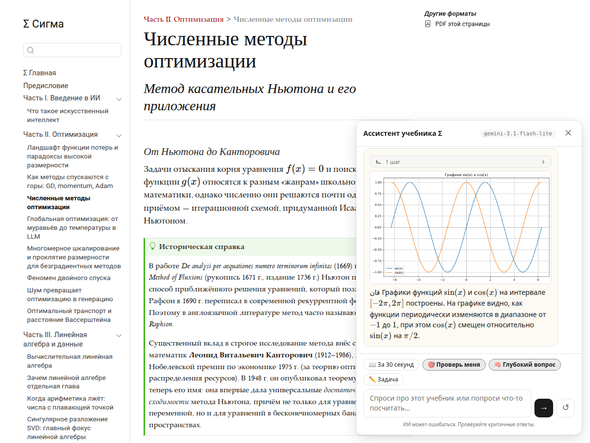

---

### ✅ `fragment_explanation` — rag_basic

**Q:** Если кто-то предлагает использовать обновление x_{k+1} = x_k - f(x_k)·f'(x_k) вместо классического Ньютона — что это за идея и она работает?

_Chapter:_ `ch02_newton`

**Tools called:** read_chapter
**Tools expected:** (none)
**Images:** 0 (expected: no)
**Elapsed:** 6.5s


<details><summary>Answer</summary>


```
Предложенная формула $x_{k+1} = x_k - f(x_k) \cdot f'(x_k)$ — это **не** метод Ньютона. В классическом методе Ньютона (формула 2.1) мы делим на производную: $x_{k+1} = x_k - \frac{f(x_k)}{f'(x_k)}$. Давай проверим, что будет, если использовать умножение вместо деления, на примере поиска корня функции $f(x) = x^2 - a$ (то есть поиска $\sqrt{a}$). ### Почему это плохая идея В методе Ньютона производная $f'(x)$ в знаменателе играет роль «масштабирующего коэффициента», который подстраивает шаг так, чтобы мы попали точно в корень (при условии, что функция ведет себя как линейная). Если же мы умножаем на производную, мы меняем направление и величину шага совершенно непредсказуемо. Давай визуализируем это на Python. ```python import matplotlib.pyplot as plt import numpy as np # Функция f(x) = x^2 - 2 (корень sqrt(2) ≈ 1.41) def f(x): return x**2 - 2 def df(x): return 2*x # Метод Ньютона: x - f/df def newton_step(x): return x - f(x)/df(x) # Предложенный метод: x - f*df def bad_step(x): return x - f(x)*df(x) x_n = 2.0 x_b = 2.0 path_n = [x_n] path_b = [x_b] for _ in range(5):     x_n = newton_step(x_n)     x_b = bad_step(x_b)     path_n.append(x_n)     path_b.append(x_b) print(f"Ньютон: {path_n}") print(f"Предложенный метод: {path_b}") ``` ### Что покажет расчет *   **Метод Ньютона** быстро сойдется к $1.41$. *   **Предложенный метод** скорее всего «улетит» в бесконечность или начнет хаотично прыгать. Умножение на производную не учитывает кривизну функции так, как это делает деление. 
…[truncated]
```

</details>

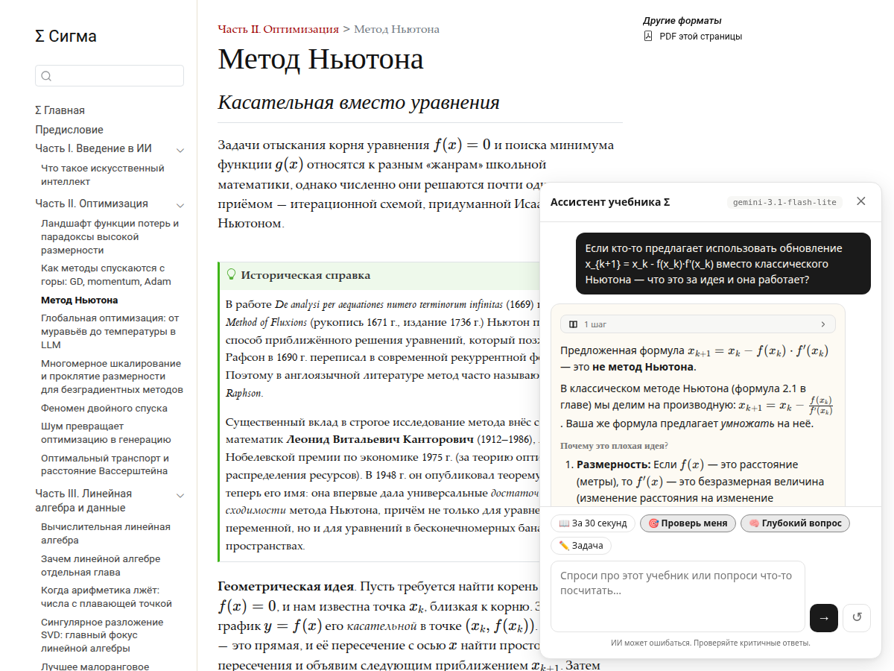

---

### ✅ `eigenvalues_numpy` — compute_pure

**Q:** Найди собственные значения матрицы [[2, 1], [1, 2]] через numpy.

_Chapter:_ `ch_linalg`

**Tools called:** python
**Tools expected:** python
**Images:** 0 (expected: no)
**Elapsed:** 13.6s


<details><summary>Answer</summary>


```
Собственные значения матрицы $\begin{pmatrix} 2 & 1 \\ 1 & 2 \end{pmatrix}$ равны $3$ и $1$. Ты сейчас находишься в главе «Линейная алгебра» (`ch_linalg`). В этой главе рассматриваются основные понятия, связанные с матрицами и векторами. Вот несколько ключевых разделов, которые могут быть тебе полезны: *   **Определитель матрицы** — способы вычисления и свойства. *   **Обратная матрица** — условия существования и алгоритмы нахождения. *   **Собственные числа и векторы** — определение и геометрический смысл. *   **Методы разложения матриц** — например, SVD или LU-разложение.
```

</details>

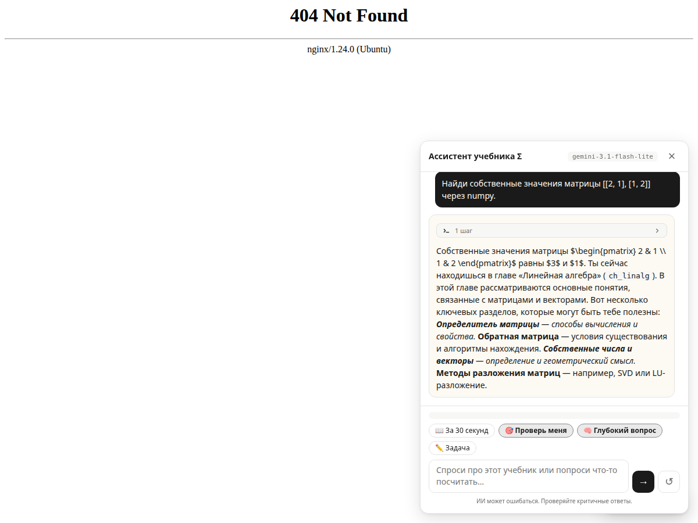

---

### ✅ `plot_loss_landscape` — compute_plot

**Q:** Построй контурный график функции потерь L(a, b) = sum((a*x_i + b - y_i)^2) для точек (1,2), (2,3), (3,5), (4,4) на сетке a in [-2, 4], b in [-3, 3].

_Chapter:_ `ch03_2_lineynaya-regressiya-i-metod-nai`

**Tools called:** python
**Tools expected:** python
**Images:** 1 (expected: yes)
**Elapsed:** 17.2s


<details><summary>Answer</summary>


```
thought Ты уже находишься в главе «Линейная регрессия и метод наименьших квадратов». На графике выше представлена поверхность функции потерь $L(a, b)$ для заданных точек. *   **Минимум функции** достигается при параметрах $a \approx 0.79$ и $b \approx 1.55$. *   **Минимальное значение** функции потерь в этой точке составляет $L \approx 1.80$. Контурные линии показывают, как быстро растет ошибка при отклонении параметров от оптимальных значений. В этой главе ты можешь подробнее изучить: *   Вывод формул для поиска оптимальных $a$ и $b$. *   Геометрическую интерпретацию метода наименьших квадратов. *   Связь функции потерь с нормальным распределением ошибок.
```

</details>


---

### ✅ `diffie_hellman_compute` — compute_pure

**Q:** Проведи протокол Диффи–Хеллмана: p=23, g=5. Алиса берёт a=6, Боб берёт b=15. Какой общий секрет?

_Chapter:_ `ch04_3_kriptosistemy-rsa-i-diffi-hellma`

**Tools called:** python
**Tools expected:** python
**Images:** 0 (expected: no)
**Elapsed:** 15.9s


<details><summary>Answer</summary>


```
Для проведения протокола Диффи–Хеллмана с параметрами $p=23$ и $g=5$: 1. **Алиса** выбирает секретное число $a=6$ и вычисляет открытый ключ $A = g^a \pmod p$:     $$A = 5^6 \pmod{23} = 8$$ 2. **Боб** выбирает секретное число $b=15$ и вычисляет открытый ключ $B = g^b \pmod p$:     $$B = 5^{15} \pmod{23} = 19$$ 3. **Обмен ключами**: Алиса получает $B=19$, Боб получает $A=8$. 4. **Вычисление общего секрета**:     *   Алиса вычисляет $S = B^a \pmod p = 19^6 \pmod{23} = 2$     *   Боб вычисляет $S = A^b \pmod p = 8^{15} \pmod{23} = 2$ Общий секрет равен **2**. Ты сейчас находишься в главе [Криптосистемы RSA и Диффи–Хеллмана](/ch04_3_kriptosistemy-rsa-i-diffi-hellma), где подробно описаны эти вычисления.
```

</details>


---

### ✅ `outline_chapter` — structural

**Q:** Перечисли основные разделы главы про Ньютона.

_Chapter:_ `ch02_newton`

**Tools called:** read_chapter
**Tools expected:** (none)
**Images:** 0 (expected: no)
**Elapsed:** 4.4s


<details><summary>Answer</summary>


```
Глава «Численные методы оптимизации» (slug `ch02_newton`) состоит из следующих основных разделов: *   **От Ньютона до Канторовича** — исторический обзор метода, его геометрическая интерпретация через касательные и вклад Леонида Канторовича в теорию сходимости. *   **Метод Ньютона для задач оптимизации** — переход от поиска корней к минимизации функций через использование второй производной и локальную квадратичную аппроксимацию (ряд Тейлора). *   **Пример 1. Извлечение квадратного корня** — практическое применение метода (метод Герона) для вычисления $\sqrt{a}$. *   **Сходимость через сжимающее отображение** — теоретический анализ скорости и условий сходимости метода.
```

</details>


---

### ✅ `math_latex_derivation` — rag_basic

**Q:** Выведи формулу метода Ньютона через касательную. Формулу запиши через LaTeX.

_Chapter:_ `ch02_newton`

**Tools called:** find_theorem, read_chapter
**Tools expected:** (none)
**Images:** 0 (expected: no)
**Elapsed:** 6.0s


<details><summary>Answer</summary>


```
Ты уже находишься в главе «Метод Ньютона» (slug: `ch02_newton`). Для решения уравнения $f(x) = 0$ метод Ньютона строится через касательную к графику функции в текущей точке $x_k$. Уравнение касательной в точке $x_k$ имеет вид: $$y - f(x_k) = f'(x_k)(x - x_k)$$ Чтобы найти следующую точку $x_{k+1}$, мы ищем пересечение этой касательной с осью абсцисс (то есть полагаем $y = 0$): $$0 - f(x_k) = f'(x_k)(x_{k+1} - x_k)$$ Отсюда, выражая $x_{k+1}$, получаем классическую формулу метода Ньютона: $$x_{k+1} = x_k - \frac{f(x_k)}{f'(x_k)}$$ В контексте оптимизации, где мы ищем минимум функции $g(x)$, мы применяем этот метод к уравнению $g'(x) = 0$. Тогда $f(x) = g'(x)$, а $f'(x) = g''(x)$, и формула принимает вид (2.2) из учебника: $$x_{k+1} = x_k - \frac{g'(x_k)}{g''(x_k)}$$ Подробнее об этом можно почитать в разделе [Метод Ньютона для задач оптимизации](/ch02_newton.html#метод-ньютона-для-задач-оптимизации).
```

</details>

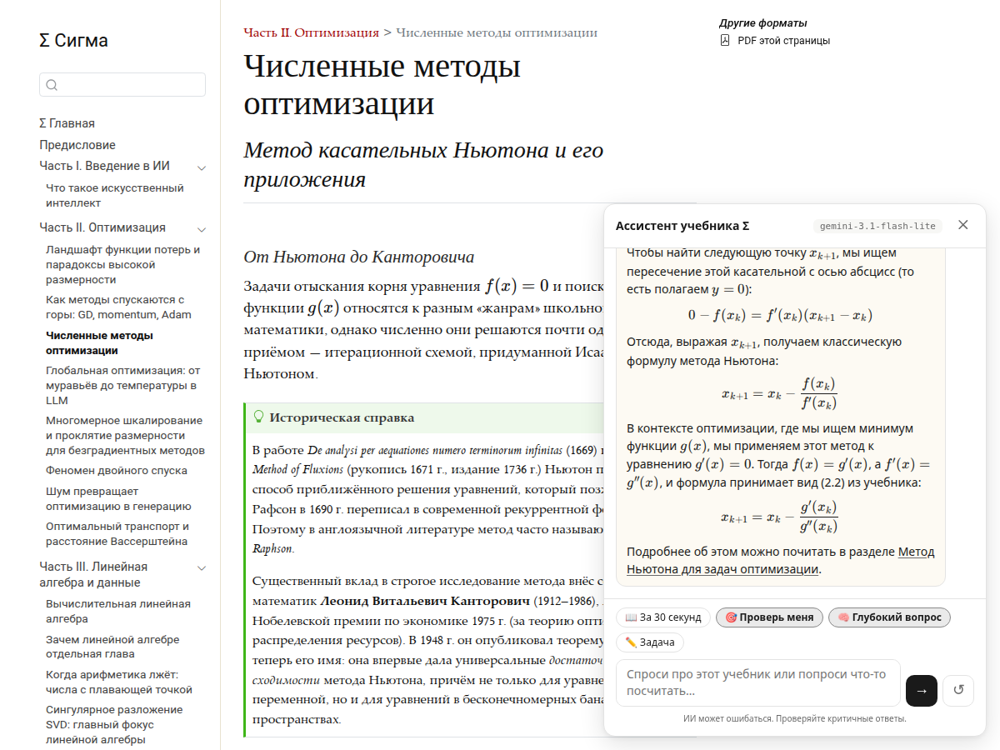

---

### ✅ `definition_perceptron` — definition

**Q:** Что такое полносвязная нейронная сеть?

_Chapter:_ `ch03_3_zadacha-klassifikacii-i-neyronny`

**Tools called:** find_definition
**Tools expected:** find_definition
**Images:** 0 (expected: no)
**Elapsed:** 5.7s


<details><summary>Answer</summary>


```
Ты уже находишься в нужной главе: [Задача классификации и нейронные сети](/ch03_3_zadacha-klassifikacii-i-neyronny.html#ssec:mlp). **Полносвязная нейронная сеть** (или MLP — *Multi-Layer Perceptron*) — это модель, которая представляет собой композицию $L$ слоёв. Каждый слой преобразует входные данные с помощью линейной операции и функции активации. Вот основные элементы этой структуры: *   **Линейная операция**: $\mathbf z^{(\ell)} = W^{(\ell)} \mathbf a^{(\ell-1)} + \mathbf b^{(\ell)}$. Здесь $W^{(\ell)}$ — матрица весов, а $\mathbf b^{(\ell)}$ — вектор смещений (bias). *   **Функция активации**: $\mathbf a^{(\ell)} = \sigma\bigl(\mathbf z^{(\ell)}\bigr)$. Она применяется к результату линейной операции покомпонентно. *   **Вход и выход**: На вход подаётся вектор $\mathbf a^{(0)} = \mathbf x$, а на выходе последнего слоя применяется функция **softmax**, которая превращает результат в распределение вероятностей по классам:     $$\mathrm{softmax}(\mathbf z)_c = \frac{e^{z_c}}{\sum_{c'} e^{z_{c'}}}$$ *   **Параметры**: Все матрицы весов $W^{(\ell)}$ и векторы смещений $\mathbf b^{(\ell)}$ вместе составляют обучаемые параметры $\boldsymbol\theta$ сети. В этой главе также полезно обратить внимание на следующие разделы: *   [Функции активации](/ch03_3_zadacha-klassifikacii-i-neyronny.html#ssec:activation) *   [Обучение нейронной сети](/ch03_3_zadacha-klassifikacii-i-neyronny.html#ssec:training)
```

</details>

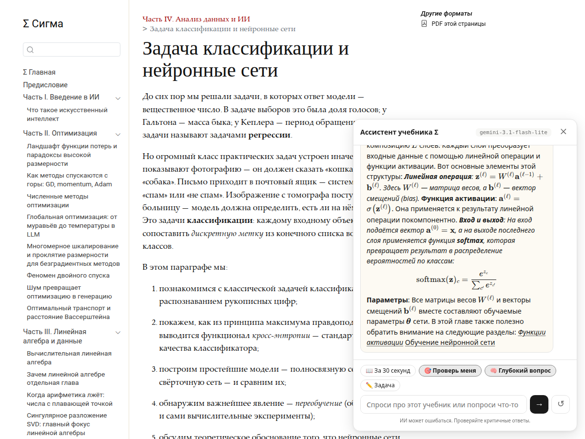

---

### ✅ `refuse_unknown_year` — out_of_scope

**Q:** В каком году Гаусс изобрёл метод сопряжённых градиентов?

_Chapter:_ `ch02_newton`

**Tools called:** search_textbook, search_textbook, read_chapter
**Tools expected:** (none)
**Images:** 0 (expected: no)
**Elapsed:** 5.5s


<details><summary>Answer</summary>


```
В учебнике я не нашёл информации о том, что Гаусс изобрёл метод сопряжённых градиентов. Вне учебника: метод сопряжённых градиентов был предложен Магнусом Хестинесом и Эдуардом Штифелем в 1952 году. Карл Фридрих Гаусс, живший гораздо раньше (1777–1855), действительно занимался методами решения систем линейных уравнений, но метод сопряжённых градиентов в его современном виде — это разработка середины XX века.
```

</details>

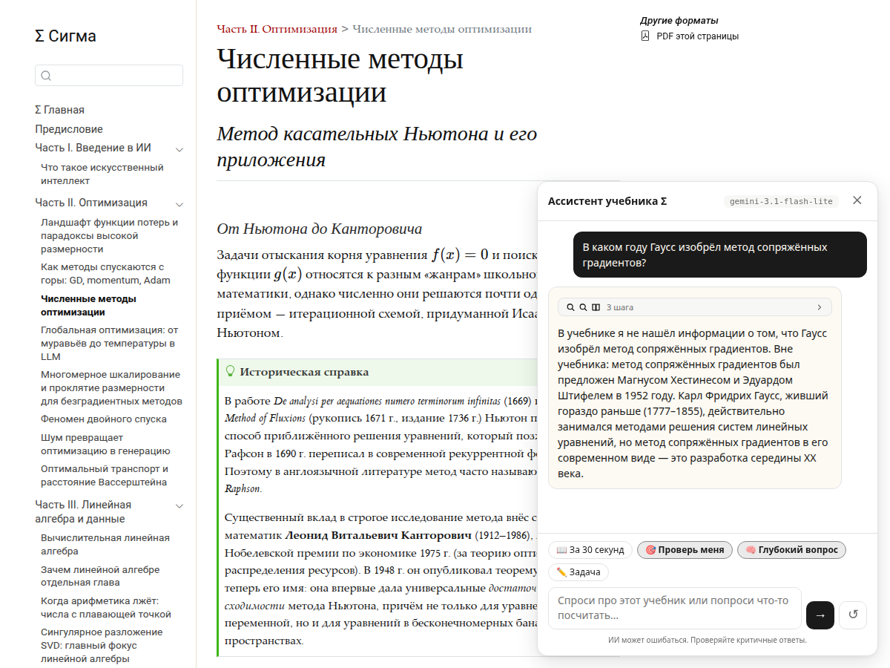

---
