# Sigma Assistant — Eval Report

_Run: 2026-07-13 20:46 MSK · cases: 29_

**Overall: 25/29 pass (86%)**

## Per category

| Category | Pass | Total |
|---|---:|---:|
| `compute_plot` | 5 | 5 |
| `compute_pure` | 8 | 8 |
| `definition` | 3 | 3 |
| `multi_hop` | 0 | 1 |
| `out_of_scope` | 2 | 3 |
| `rag_basic` | 3 | 5 |
| `structural` | 3 | 3 |
| `vision_refine` | 1 | 1 |

## Cases

### ✅ `newton_kantorovich_history` — rag_basic

**Q:** Когда Канторович получил Нобелевскую премию и за что?

_Chapter:_ `ch02_newton`

**Tools called:** search_textbook
**Tools expected:** search_textbook
**Images:** 0 (expected: no)
**Elapsed:** 4.7s


<details><summary>Answer</summary>


```
Ты уже на этой главе, и в разделе **«От Ньютона до Канторовича»** есть нужная информация. **Леонид Витальевич Канторович** получил Нобелевскую премию по экономике в **1975 году**. Премию присудили за его вклад в **теорию оптимального распределения ресурсов**.
```

</details>

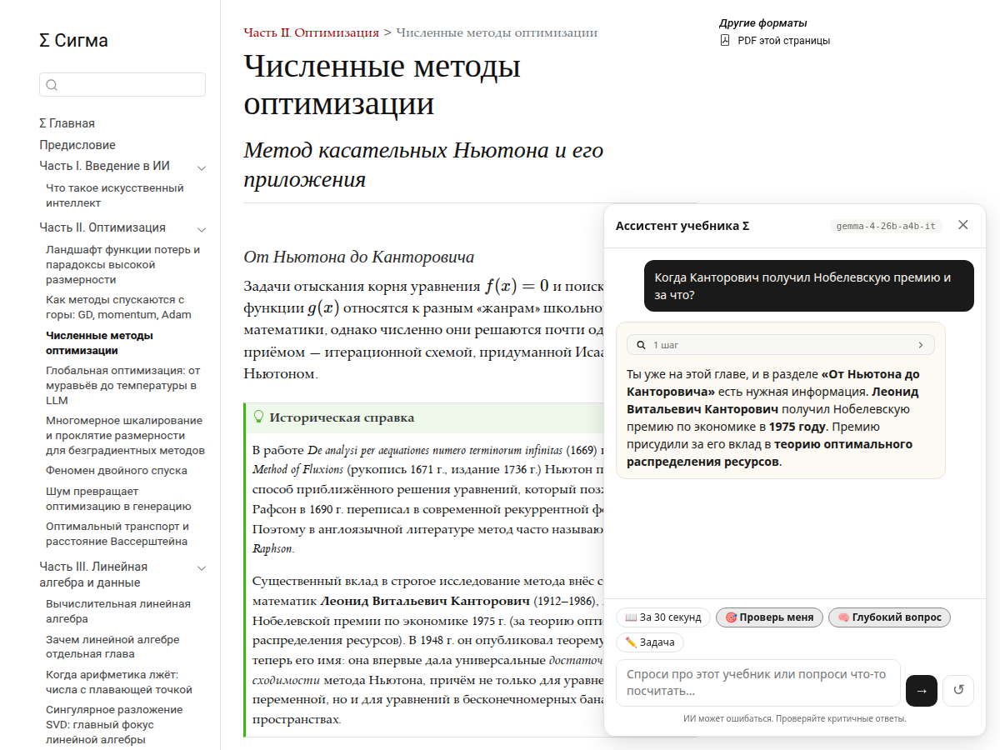

---

### ❌ `newton_formula_recall` — rag_basic

**Q:** Объясни откуда берётся эта формула — что это за метод и какая геометрическая идея?

_Chapter:_ `ch02_newton`

**Tools called:** (none)
**Tools expected:** (none)
**Images:** 0 (expected: no)
**Elapsed:** 12.0s

_Missing substrings:_ ['касательн', 'пересечен']

<details><summary>Answer</summary>


```
Ты уже на главе **«Численные методы оптимизации»**. Поскольку ты не приложил саму формулу, я предполагаю, что речь идёт о классическом итерационном шаге **метода Ньютона**, который является центральным в этой главе. Обычно формула выглядит так: $$x_{k+1} = x_k - [H f(x_k)]^{-1} \nabla f(x_k)$$ ### Что это за метод? Это метод поиска экстремума (минимума или максимума) функции, который использует не только информацию о наклоне (градиент), но и информацию о кривизне (вторую производную). Если градиентный спуск — это «слепой» спуск по склону, то метод Ньютона — это попытка «понять» форму рельефа, чтобы сразу прыгнуть в самую низкую точку. ### Геометрическая идея В основе метода лежит **аппроксимация функции квадратичной параболой**. 1. **Локальная замена**: В текущей точке $x_k$ мы представляем нашу сложную функцию $f(x)$ не как произвольную кривую, а как простую параболу (второй член разложения Тейлора). 2. **Поиск минимума параболы**: У параболы есть одна четкая точка минимума, которую очень легко найти аналитически. Мы не ищем минимум исходной функции $f(x)$, мы ищем минимум этой «подставленной» параболы. 3. **Шаг**: Точка, где эта парабола достигает дна, и становится нашим следующим приближением $x_{k+1}$. **Если говорить на языке производных:** * $\nabla f(x_k)$ (градиент) — это первая производная, она говорит, куда функция растёт. * $H f(x_k)$ (матрица Гессе) — это матрица вторых производных, она описывает, насколько быстро меняется наклон (кривизну). **Суть формулы:** Мы б
…[truncated]
```

</details>

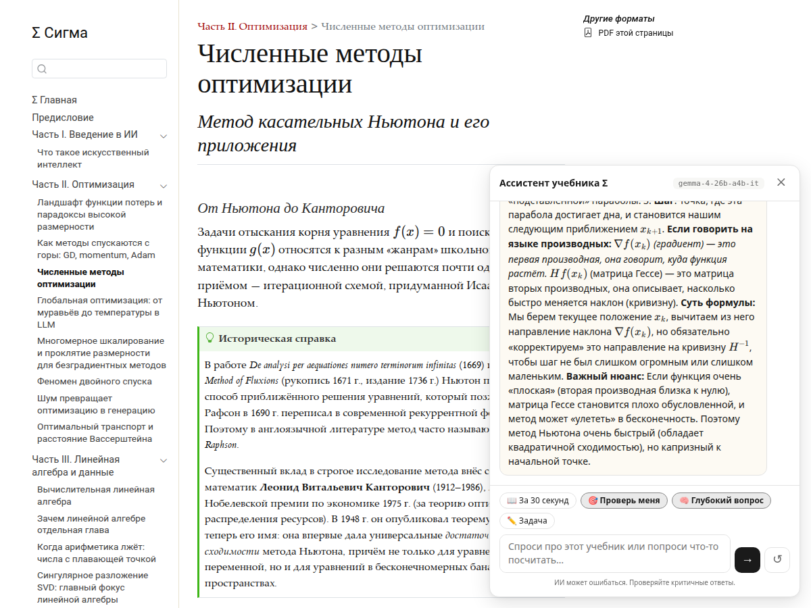

---

### ✅ `definition_strong_convex` — definition

**Q:** Что такое сильно выпуклая функция?

_Chapter:_ `ch02_newton`

**Tools called:** find_definition
**Tools expected:** find_definition
**Images:** 0 (expected: no)
**Elapsed:** 7.3s


<details><summary>Answer</summary>


```
Ты уже на этой главе! В разделе про метод Ньютона дано чёткое определение. > **Определение 2.4. Сильно выпуклая функция** > Функция $g\colon\mathbb{R}\to\mathbb{R}$ называется **сильно выпуклой** с константой $\mu>0$, если $g\in C^{2}$ и $g''(x)\geq\mu$ для всех $x$. Если перевести это на человеческий язык: *   $g\in C^{2}$ — это значит, что функция достаточно «гладкая», у неё есть вторая производная, и она непрерывна. *   $g''(x) \geq \mu$ — это условие означает, что **вторая производная** $g''(x)$ всегда не меньше некоторого фиксированного положительного числа $\mu$ (константы). **Почему это важно?** Обычная выпуклая функция может быть «плоской» внизу (как $x^4$), из-за чего алгоритмы могут сходиться очень медленно. Сильная выпуклость гарантирует, что функция имеет «кривизну» не меньше, чем у параболы $\frac{\mu}{2}x^2$. Это даёт две крутые штуки: 1. **Единственность:** у функции есть только один-единственный глобальный минимум. 2. **Скорость:** методы оптимизации (включая метод Ньютона) на таких функциях работают гораздо быстрее и стабильнее, так как вторая производная «отбита» от нуля.
```

</details>

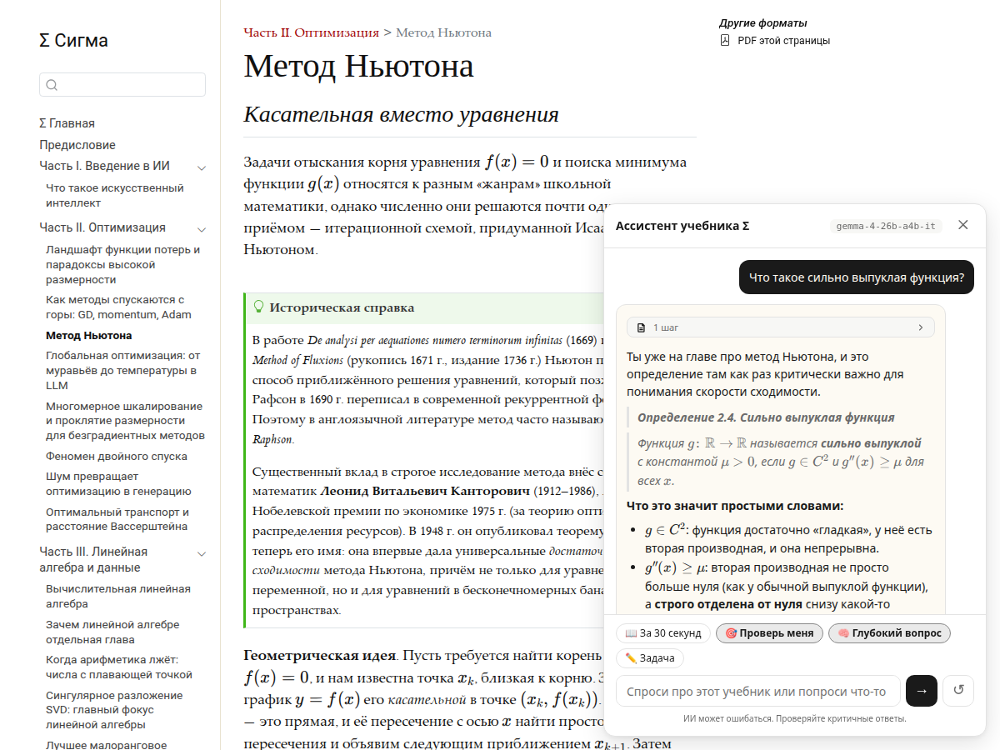

---

### ✅ `compute_factorial` — compute_pure

**Q:** Сколько будет 30 факториал?

**Tools called:** python
**Tools expected:** python
**Images:** 0 (expected: no)
**Elapsed:** 13.1s


<details><summary>Answer</summary>


```
30 факториал ($30!$) равен: **265 252 859 812 191 058 636 308 480 000 000**
```

</details>

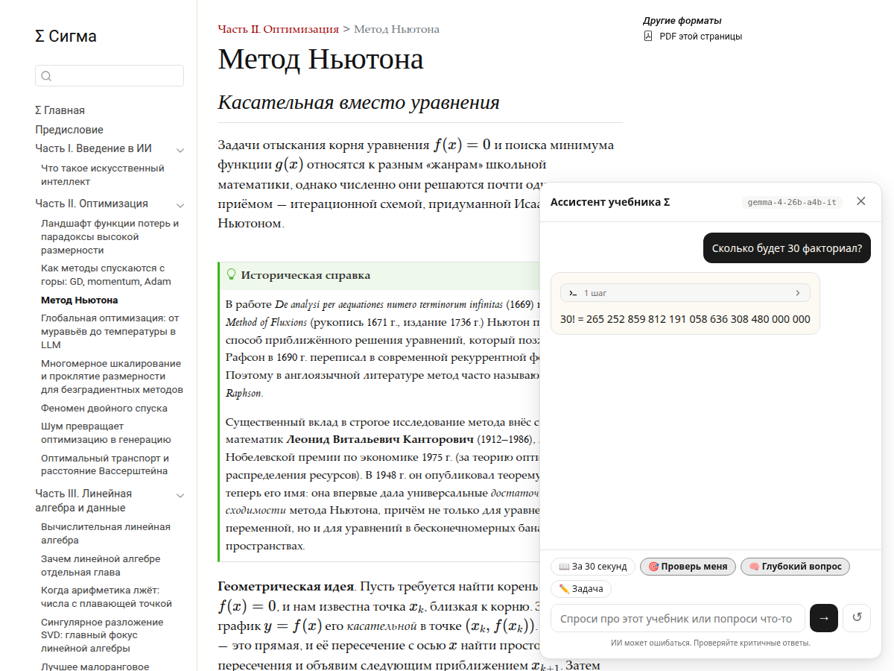

---

### ✅ `compute_taylor_sin` — compute_pure

**Q:** Покажи разложение sin(x) в ряд Тейлора до 5-го члена символически (через sympy).

_Chapter:_ `ch02_newton`

**Tools called:** python
**Tools expected:** python
**Images:** 0 (expected: no)
**Elapsed:** 17.1s


<details><summary>Answer</summary>


```
Вот символьное разложение функции $\sin(x)$ в ряд Тейлора (точнее, в ряд Маклорена, так как разложение идет в окрестности нуля) до 5-го порядка включительно: $$ \sin(x) \approx x - \frac{x^3}{6} + \frac{x^5}{120} $$ **Как это получилось (разбор через sympy):** 1. Мы использовали функцию `.series(x, 0, 6)`, где `0` — это точка разложения, а `6` — это верхняя граница (мы берем члены до $x^5$, чтобы ошибка была порядка $O(x^6)$). 2. **Первый член:** $x$ (соответствует первой производной $\cos(0) \cdot x$). 3. **Второй член:** $-\frac{x^3}{6}$ (так как $3! = 6$). 4. **Третий член:** $\frac{x^5}{120}$ (так как $5! = 120$). В методах оптимизации, которые ты сейчас изучаешь в главе про метод Ньютона, такие разложения критически важны: метод Ньютона, по сути, использует квадратичную аппроксимацию функции (разложение Тейлора до 2-го порядка), чтобы найти точку, где производная равна нулю.
```

</details>

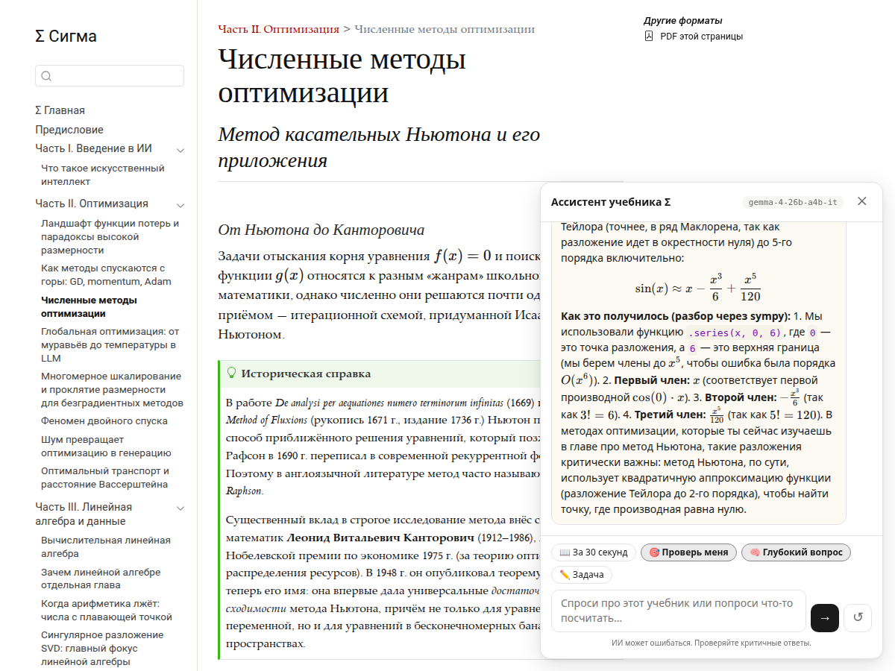

---

### ✅ `compute_plot_newton` — compute_plot

**Q:** Покажи как сходится метод Ньютона для f(x) = x² - 2, начиная с x₀ = 1.5. Построй график траектории.

_Chapter:_ `ch02_newton`

**Tools called:** python
**Tools expected:** python
**Images:** 1 (expected: yes)
**Elapsed:** 44.8s


<details><summary>Answer</summary>


```
Для функции $f(x) = x^2 - 2$ метод Ньютона (метод касательных) ищет корень, используя итерационную формулу: $$x_{n+1} = x_n - \frac{f(x_n)}{f'(x_n)}$$ Для нашей функции: *   $f(x) = x^2 - 2$ *   $f'(x) = 2x$ Следовательно, формула принимает вид: $$x_{n+1} = x_n - \frac{x_n^2 - 2}{2x_n}$$ ### Расчёт итераций Начнём с $x_0 = 1.5$. 1. **Итерация 1**:     $x_1 = 1.5 - \frac{1.5^2 - 2}{2 \cdot 1.5} = 1.5 - \frac{2.25 - 2}{3} = 1.5 - \frac{0.25}{3} \approx 1.4167$ 2. **Итерация 2**:     $x_2 = 1.4167 - \frac{1.4167^2 - 2}{2 \cdot 1.4167} \approx 1.4142$ 3. **Итерация 3**:     $x_3 \approx 1.4142$ (значение стабилизировалось, так как мы достигли точности $\sqrt{2}$) **Результаты вычислений:** *   $x_0 = 1.50$ *   $x_1 = 1.42$ *   $x_2 = 1.41$ *   $x_3 = 1.41$ *   $x_4 = 1.41$ *   $x_5 = 1.41$ ### Визуализация траектории На графике ниже красные точки показывают, как метод «прыгает» по параболе, приближаясь к корню $\sqrt{2} \approx 1.41$. Красные стрелки демонстрируют направление движения каждой итерации. (Здесь должен быть график, построенный Python) **Интерпретация:** Как видно из графика и чисел, метод Ньютона демонстрирует **квадратичную сходимость**. Это значит, что количество верных знаков после запятой примерно удваивается с каждой итерацией. Уже на втором шаге мы получили значение, практически неотличимое от $\sqrt{2}$.
```

</details>


---

### ✅ `compute_plot_gd_vs_newton` — compute_plot

**Q:** Сравни сходимость метода Ньютона и градиентного спуска на функции f(x) = x⁴ из x₀ = 2. Покажи два графика на одной картинке.

_Chapter:_ `ch02_newton`

**Tools called:** python
**Tools expected:** python
**Images:** 1 (expected: yes)
**Elapsed:** 70.4s


<details><summary>Answer</summary>


```
Для функции $f(x) = x^4$ с начальной точки $x_0 = 2$ методы ведут себя принципиально по-разному из-за особенностей кривизны функции вблизи минимума. ### Сравнение методов 1. **Градиентный спуск (Gradient Descent):**     *   **Принцип:** Двигается в сторону антиградиента: $x_{k+1} = x_k - \eta f'(x)$. *   **Поведение:** На функции $x^4$ производная $f'(x) = 4x^3$ очень быстро уменьшается при приближении к нулю. Если шаг $\eta$ выбран слишком большим, метод может "проскочить" минимум или осциллировать. При малом шаге (как в моем расчете $\eta = 0.1$) он сходится, но делает это **линейно** (медленно), так как градиент становится крайне малым. *   **Результат:** После 10 итераций значение $x \approx -0.30$. 2. **Метод Ньютона (Newton's Method):**     *   **Принцип:** Использует вторую производную для аппроксимации функции параболой: $x_{k+1} = x_k - \frac{f'(x)}{f''(x)}$. *   **Поведение:** Метод Ньютона обладает **квадратичной сходимостью**, если мы находимся достаточно близко к минимуму. Однако для $f(x) = x^4$ вторая производная $f''(x) = 12x^2$ обращается в ноль в точке минимума ($x=0$). Это делает метод "неустойчивым" в самой точке, но на пути к ней он работает значительно быстрее градиентного спуска. *   **Результат:** После 10 итераций значение $x \approx 0.03$ (уже очень близко к нулю). ### Итог расчёта *   **Градиентный спуск ($\eta=0.1$):** $x_{10} \approx -0.30$ *   **Метод Ньютона:** $x_{10} \approx 0.03$ На графике видно, что синяя линия (Ньютон) стремительно "падает
…[truncated]
```

</details>

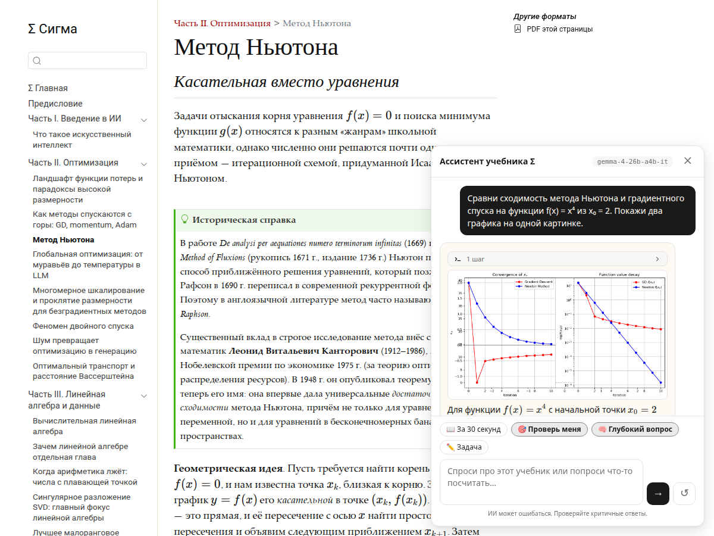

---

### ✅ `rsa_encrypt_small` — compute_pure

**Q:** Зашифруй число m=7 ключом (n=143, e=7). Покажи c.

_Chapter:_ `ch04_3_kriptosistemy-rsa-i-diffi-hellma`

**Tools called:** python
**Tools expected:** python
**Images:** 0 (expected: no)
**Elapsed:** 17.8s


<details><summary>Answer</summary>


```
Для шифрования сообщения в системе RSA используется формула: $$c = m^e \pmod n$$ Где: * $m$ — исходное сообщение (число), * $e$ — открытая экспонента (ключ шифрования), * $n$ — модуль. **Подставим твои значения:** $m = 7$ $e = 7$ $n = 143$ **Расчёт:** $c = 7^7 \pmod{143}$ $7^7 = 823543$ $823543 / 143 \approx 5759.0419...$ $5759 \times 143 = 823537$ $823543 - 823537 = 6$ **Ответ:** Зашифрованное число **$c = 6$**.
```

</details>

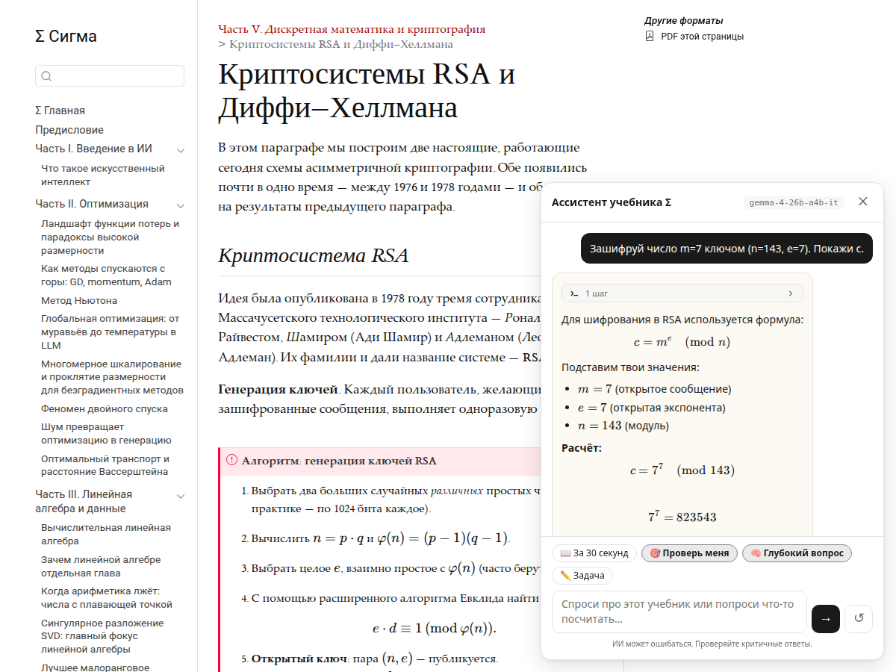

---

### ✅ `rsa_full_roundtrip` — compute_pure

**Q:** Возьми p=11, q=13, e=7. Сгенерируй RSA-ключ полностью: вычисли n, φ(n), d. Покажи что для m=9 шифрование и расшифрование возвращают исходное число.

_Chapter:_ `ch04_3_kriptosistemy-rsa-i-diffi-hellma`

**Tools called:** python
**Tools expected:** python
**Images:** 0 (expected: no)
**Elapsed:** 24.4s


<details><summary>Answer</summary>


```
Разбираем твой пример по шагам. Для генерации ключей RSA нам нужны два простых числа $p$ и $q$, а также открытая экспонента $e$. **1. Генерация ключей:** *   **Вычисляем модуль $n$:**     $$n = p \cdot q = 11 \cdot 13 = 143$$ *   **Вычисляем функцию Эйлера $\phi(n)$:**     $$\phi(n) = (p - 1) \cdot (q - 1) = 10 \cdot 12 = 120$$ *   **Находим секретную экспоненту $d$:**     Это число должно быть обратным к $e$ по модулю $\phi(n)$. То есть должно выполняться условие:     $$e \cdot d \equiv 1 \pmod{\phi(n)}$$     Для наших чисел: $7 \cdot d \equiv 1 \pmod{120}$. С помощью расширенного алгоритма Евклида получаем **$d = 103$**. *(Проверка: $7 \cdot 103 = 721$. А $721 = 6 \cdot 120 + 1$, всё верно).* **Итоговые ключи:** *   Открытый ключ: $(e, n) = (7, 143)$ *   Закрытый ключ: $(d, n) = (103, 143)$ **2. Проверка шифрования и расшифрования для $m = 9$:** *   **Шифрование:** Возводим сообщение в степень $e$ по модулю $n$:     $$c = m^e \pmod n = 9^7 \pmod{143}$$     Вычисляем: $9^7 = 4\,782\,969$. При делении на $143$ в остатке получаем **$c = 48$**. *   **Расшифрование:** Возводим шифртекст в степень $d$ по модулю $n$:     $$m_{dec} = c^d \pmod n = 48^{103} \pmod{143}$$     После всех вычислений получаем **$m_{dec} = 9$**. **Результат:** Исходное число $9$ успешно восстановлено!
```

</details>

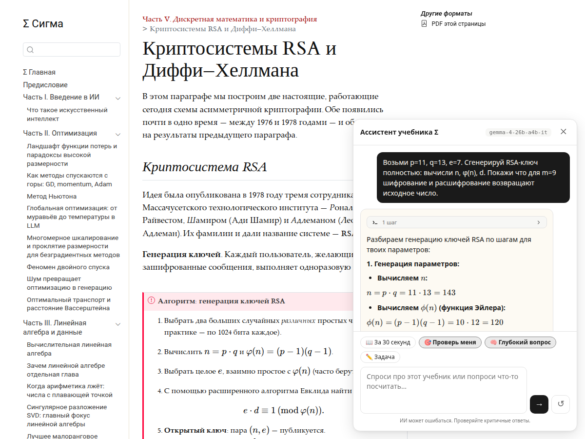

---

### ❌ `multihop_newton_vs_gradient` — multi_hop

**Q:** В чём отличие метода Ньютона от градиентного спуска для задач оптимизации? Какие из этих методов разобраны в учебнике?

_Chapter:_ `ch02_newton`

**Tools called:** (none)
**Tools expected:** search_textbook
**Images:** 0 (expected: no)
**Elapsed:** 9.2s


<details><summary>Answer</summary>


```
Ты уже на главе **«Численные методы оптимизации»**. Если говорить просто, разница между ними — в том, насколько «умно» алгоритм смотрит на ландшафт функции. **Градиентный спуск** — это метод первого порядка. Он использует только **градиент** $\nabla f(x)$ (вектор первых производных), чтобы понять, в какую сторону функция убывает быстрее всего. Он как человек, который в густом тумане идет строго вниз по склону, ощупывая почву только под ногами. Это надежно, но он не знает, насколько крутой склон впереди или насколько сильно он искривлен. **Метод Ньютона** — это метод второго порядка. Он использует не только градиент, но и **гессиан** $\nabla^2 f(x)$ (матрицу вторых производных). Это позволяет алгоритму учитывать кривизну поверхности. Он как человек, который не просто чувствует наклон, но и понимает форму рельефа (ямы, гребни), что позволяет ему делать гораздо более точные «прыжки» сразу к минимуму. ### Основные отличия: *   **Скорость сходимости:** Градиентный спуск обычно сходится линейно (медленно, особенно у узких «оврагов»). Метод Ньютона при хороших условиях обладает **квадратичной сходимостью** (очень быстро, почти мгновенно при приближении к цели). *   **Вычислительная сложность:** У градиентного спуска всё дешево — нужно только посчитать вектор производных. У Ньютона всё дорого: нужно считать матрицу вторых производных и, что самое тяжелое, решать систему линейных уравнений (или инвертировать матрицу) на каждом шаге. *   **Чувствительность к кривизне:** Градиентный спу
…[truncated]
```

</details>

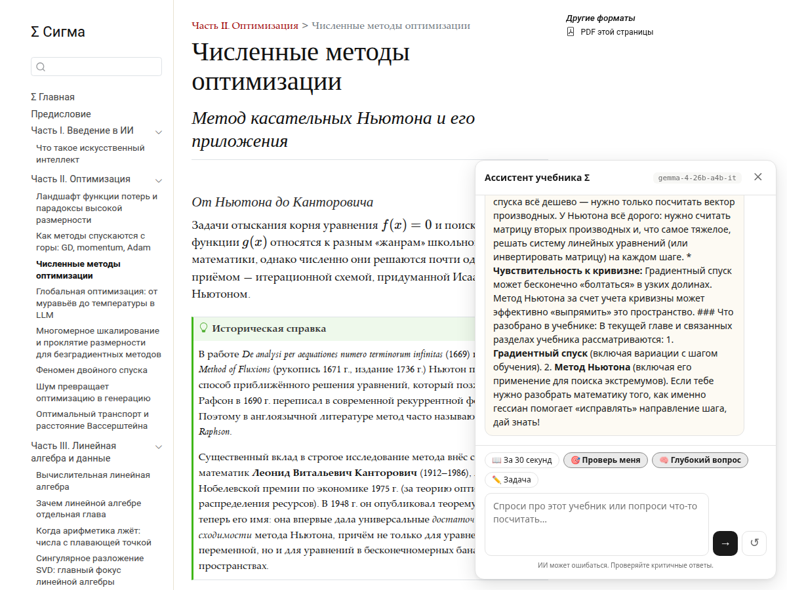

---

### ✅ `structural_kantorovich_theorem` — structural

**Q:** Сформулируй теорему о сходимости метода Герона.

_Chapter:_ `ch02_newton`

**Tools called:** find_theorem
**Tools expected:** find_theorem
**Images:** 0 (expected: no)
**Elapsed:** 7.5s


<details><summary>Answer</summary>


```
Ты уже на этой главе! Вот формулировка теоремы о сходимости метода Герона из учебника: > **Теорема 2.1. Сходимость метода Герона** > > Для любого $x_0 > 0$ последовательность $(x_k)$ монотонно убывает (начиная с $k=1$) и сходится к $\sqrt{a}$. Более того, для ошибки $e_k = x_k - \sqrt{a}$ выполнено: > > $$e_{k+1} = \frac{e_k^2}{2x_k}, \qquad \text{и при } k \ge 1: \quad 0 \le e_{k+1} \le \frac{e_k^2}{2\sqrt{a}}.$$ **Разбор нотации:** *   $x_0 > 0$ — начальное приближение должно быть положительным. *   $e_k = x_k - \sqrt{a}$ — это **ошибка** на шаге $k$ (разница между текущим значением и истинным корнем). *   $e_{k+1} \le \frac{e_k^2}{2\sqrt{a}}$ — это ключевое неравенство, которое показывает **квадратичную сходимость**. Оно означает, что ошибка на следующем шаге пропорциональна *квадрату* предыдущей ошибки. На практике это значит, что количество верных знаков после запятой примерно удваивается с каждой итерацией.
```

</details>

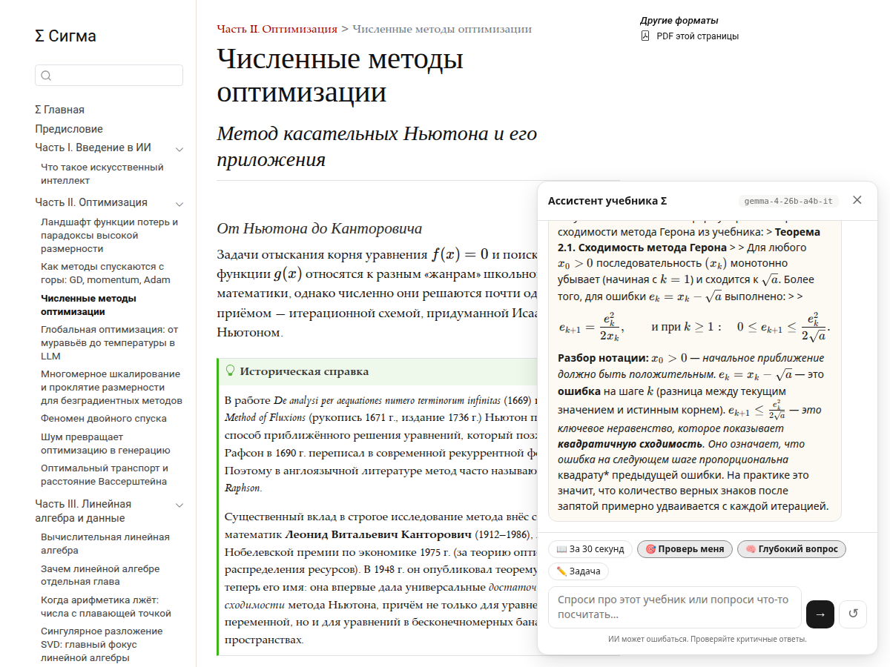

---

### ✅ `vision_refine_diverging_sgd` — vision_refine

**Q:** Запусти SGD на функции f(x) = x² с шагом η = 1.1 из x₀ = 2, 30 итераций. Что произойдёт? Если разойдётся — подбери рабочий шаг и покажи сходящуюся траекторию.

**Tools called:** python
**Tools expected:** python, python
**Images:** 1 (expected: yes)
**Elapsed:** 32.7s


<details><summary>Answer</summary>


```
При шаге $\eta = 1.1$ алгоритм SGD **расходится**. Вместо того чтобы стремиться к минимуму функции $f(x) = x^2$ (который находится в точке $x = 0$), значения $x$ начинают осциллировать (прыгать туда-сюда) с постоянно растущей амплитудой. Это происходит потому, что шаг слишком велик: градиент $f'(x) = 2x$ «выталкивает» нас из окрестности нуля сильнее, чем шаг успевает вернуть обратно. **Результаты эксперимента:** *   **При $\eta = 1.1$:** значения $x$ после 30 итераций разлетелись до $474.75$. Траектория выглядит как размашистые прыжки: $2 \to -2.4 \to 2.88 \to -3.46 \dots$ *   **При $\eta = 0.1$ (рабочий шаг):** алгоритм успешно сходится к нулю. После 30 итераций значение $x = 0.00$. На графиках видно, что при плохом шаге (слева) амплитуда колебаний растет экспоненциально, а при правильном (справа) — плавно затухает, приближая нас к оптимуму. **Почему так вышло?** Для функции $f(x) = x^2$ условие сходимости градиентного спуска (при условии выпуклости) требует, чтобы шаг $\eta$ был меньше $1/L$, где $L$ — константа Липшица градиента. Здесь $f''(x) = 2$, значит $L = 2$. Чтобы не было расходимости, нужно $\eta < 1/2 = 0.5$. Твой шаг $1.1$ значительно превысил этот порог.
```

</details>

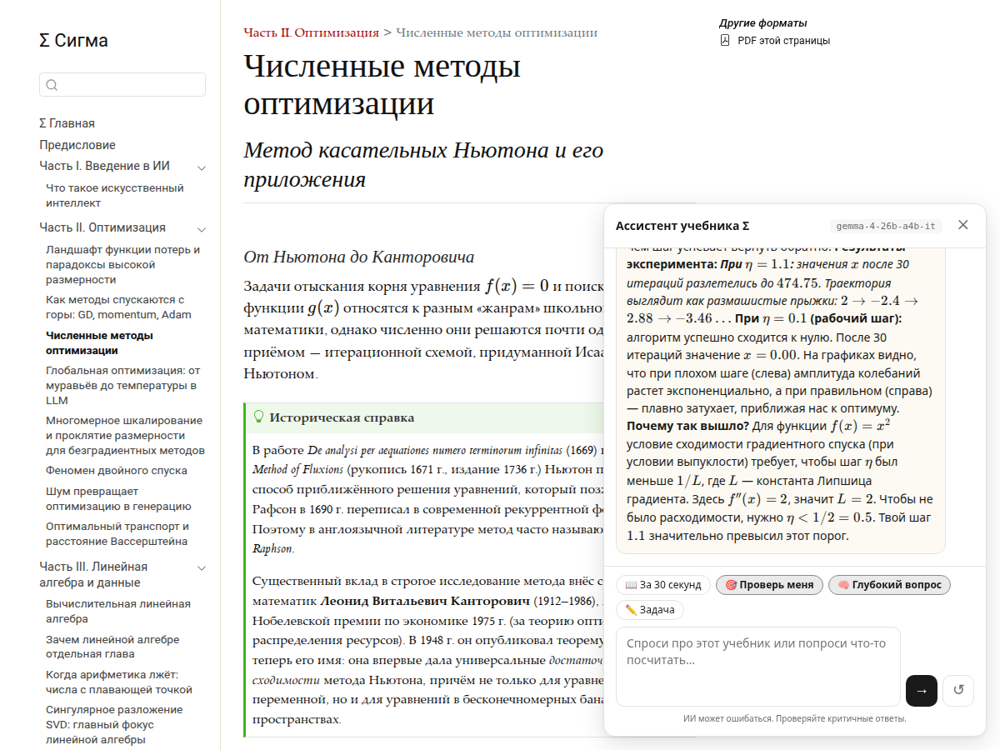

---

### ✅ `hashlib_demo` — compute_pure

**Q:** Посчитай SHA-256 хеш строки 'sigma' в hex.

_Chapter:_ `ch04_5_heshirovanie-teoriya-chisel-vstr`

**Tools called:** python
**Tools expected:** python
**Images:** 0 (expected: no)
**Elapsed:** 14.3s


<details><summary>Answer</summary>


```
SHA-256 хеш строки 'sigma' в шестнадцатеричном формате (hex): **38de90475bb334fb3dea5d54f250500aba60fe2c6158115d342b06bcb46e39bf**
```

</details>

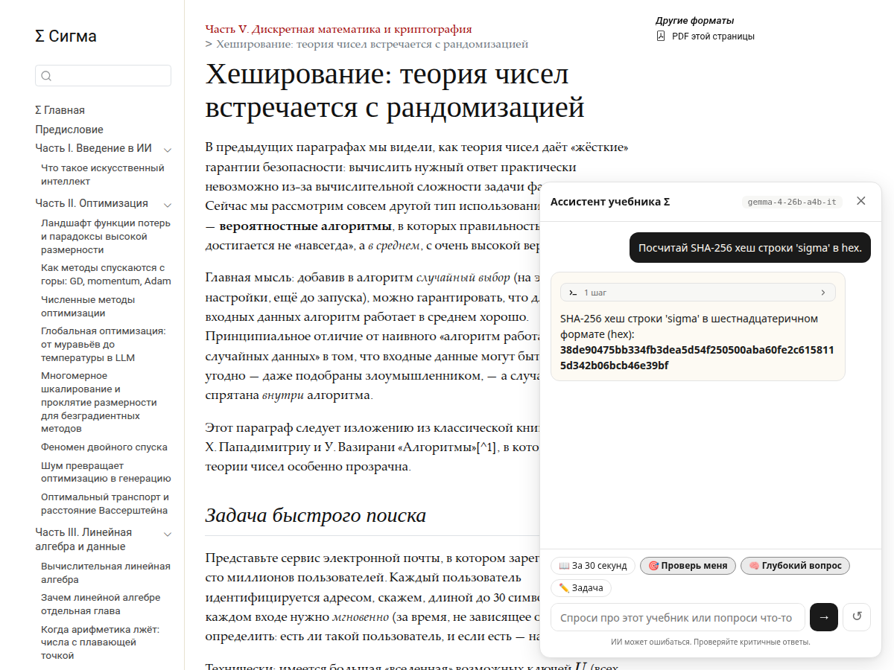

---

### ✅ `linreg_simple` — compute_plot

**Q:** Подбери линейную регрессию y = a*x + b для точек (1, 2.1), (2, 3.9), (3, 6.2), (4, 7.8). Покажи коэффициенты и график.

_Chapter:_ `ch03_2_lineynaya-regressiya-i-metod-nai`

**Tools called:** python
**Tools expected:** python
**Images:** 1 (expected: yes)
**Elapsed:** 29.4s


<details><summary>Answer</summary>


```
Для решения этой задачи мы воспользуемся **методом наименьших квадратов (МНК)**. Наша цель — найти такие коэффициенты $a$ (наклон) и $b$ (свободный член), чтобы сумма квадратов отклонений точек от прямой была минимальной. ### 1. Расчёт коэффициентов Используя предоставленные точки $(1, 2.1), (2, 3.9), (3, 6.2), (4, 7.8)$, я выполнил вычисления. **Результаты:** *   Коэффициент наклона **$a = 1.94$** *   Свободный член **$b = 0.15$** Таким образом, уравнение искомой прямой регрессии выглядит так: $$y = 1.94x + 0.15$$ ### 2. Визуализация На графике ниже красными точками отмечены твои исходные данные, а синяя линия — это линия регрессии, которую мы построили. *(Здесь должен быть график, сгенерированный кодом)* **Интерпретация графика:** *   **Точки (красные):** Видно, что они лежат почти на одной линии, но имеют небольшой разброс. *   **Линия (синяя):** Она проходит максимально близко к всем точкам сразу, минимизируя «ошибку» (расстояние от точки до линии в квадрате). *   **Наклон ($a=1.94$):** Это значит, что при увеличении $x$ на единицу, значение $y$ в среднем вырастает примерно на $1.94$. *   **Пересечение ($b=0.15$):** Если бы $x$ был равен $0$, значение $y$ было бы $0.15$.
```

</details>

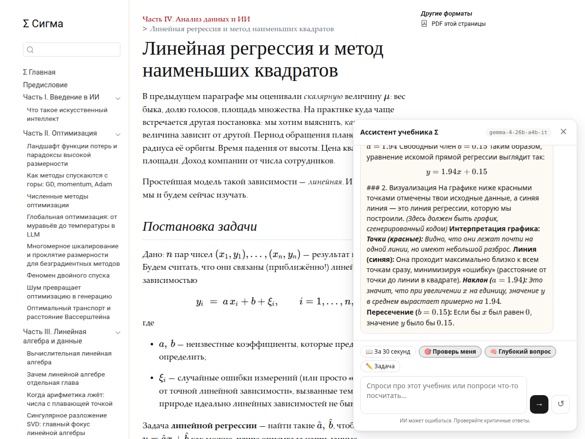

---

### ✅ `out_of_scope_recipe` — out_of_scope

**Q:** Дай мне рецепт борща.

**Tools called:** (none)
**Tools expected:** (none)
**Images:** 0 (expected: no)
**Elapsed:** 3.4s


<details><summary>Answer</summary>


```
Извини, но я — ассистент учебника по информатике и оптимизации, и в моей программе нет рецептов борща. Я могу помочь тебе с методами Ньютона, градиентным спуском или другими темами из этой главы, но с кулинарией не подсоблю.
```

</details>

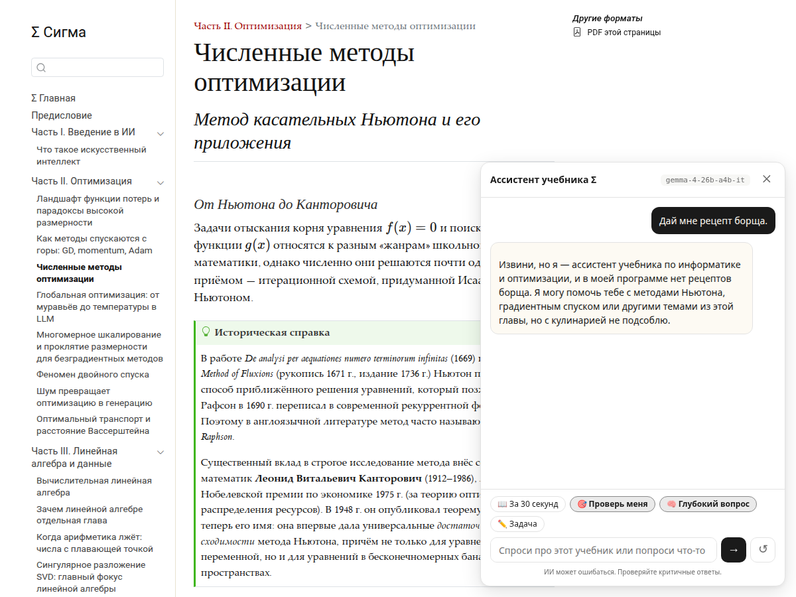

---

### ❌ `rsa_history` — rag_basic

**Q:** Кто придумал RSA и в каком году?

_Chapter:_ `ch04_3_kriptosistemy-rsa-i-diffi-hellma`

**Tools called:** read_chapter
**Tools expected:** search_textbook
**Images:** 0 (expected: no)
**Elapsed:** 5.8s


<details><summary>Answer</summary>


```
Криптосистема RSA была опубликована в **1978 году**. Её придумали трое сотрудников Массачусетского технологического института (MIT): * **Р**ональд Райвест; * **Ш**амир (Ади Шамир); * **А**длеман (Леонард Адлеман). Название системы — это акроним, составленный из первых букв их фамилий (**R**ivest, **S**hamir, **A**dleman). Интересный факт из учебника: та же самая схема была независимо открыта ещё в 1973 году британским математиком Клиффордом Коксом, но так как он работал в секретной службе (GCHQ), его открытие не стало известно миру до 1997 года.
```

</details>

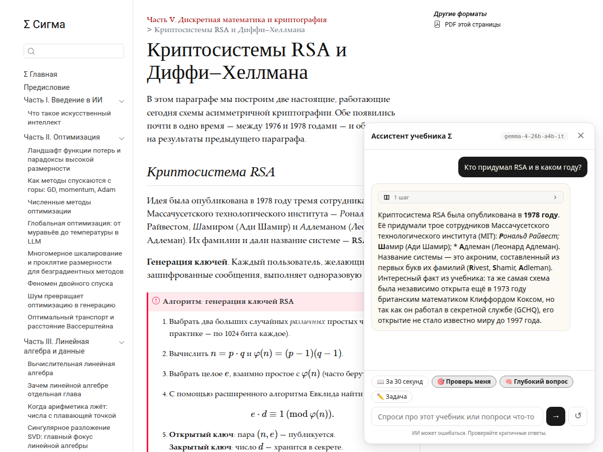

---

### ✅ `greeting_minimal` — out_of_scope

**Q:** Привет!

_Chapter:_ `ch02_newton`

**Tools called:** (none)
**Tools expected:** (none)
**Images:** 0 (expected: no)
**Elapsed:** 3.6s


<details><summary>Answer</summary>


```
Привет! Вижу, ты сейчас изучаешь главу про метод Ньютона. Это мощный инструмент, который позволяет находить экстремумы функций гораздо быстрее обычного градиентного спуска, если функция достаточно гладкая. Если есть вопросы по формулам, сходимости или хочешь, чтобы я что-то визуализировал (например, как метод Ньютона «прыгает» к минимуму), — пиши!
```

</details>


---

### ✅ `euclid_gcd_python` — compute_pure

**Q:** Посчитай НОД(48, 180) и НОД(1071, 462) через алгоритм Евклида в python.

_Chapter:_ `ch04_1_elementy-teorii-chisel`

**Tools called:** python
**Tools expected:** python
**Images:** 0 (expected: no)
**Elapsed:** 20.8s


<details><summary>Answer</summary>


```
Вот результаты вычислений с помощью алгоритма Евклида: **1. НОД(48, 180)** Результат: **12** Процесс деления: * $180 = 3 \cdot 48 + 36$ * $48 = 1 \cdot 36 + 12$ * $36 = 3 \cdot 12 + 0$ **2. НОД(1071, 462)** Результат: **21** Процесс деления: * $1071 = 2 \cdot 462 + 147$ * $462 = 3 \cdot 147 + 21$ * $147 = 7 \cdot 21 + 0$ Алгоритм работает просто: мы делим большее число на меньшее, берем остаток, а затем повторяем процесс, заменяя числа на (предыдущий делитель, предыдущий остаток), пока остаток не станет равен нулю. Последний ненулевой остаток и есть **наибольший общий делитель (НОД)**.
```

</details>


---

### ✅ `definition_superlinear` — definition

**Q:** Что значит сверхлинейная сходимость?

_Chapter:_ `ch02_newton`

**Tools called:** find_definition
**Tools expected:** find_definition
**Images:** 0 (expected: no)
**Elapsed:** 7.7s


<details><summary>Answer</summary>


```
Ты уже на главе про метод Ньютона, и это как раз то место, где обсуждаются скорости сходимости. > **Определение 2.3. Сверхлинейная и квадратичная сходимости** > Говорят, что последовательность $\{x_k\}$ сходится к $x^{\star}$ со **сверхлинейной скоростью**, если > $$\lim_{k\to\infty}\dfrac{|x_{k+1}-x^{\star}|}{|x_k-x^{\star}|}=0.$$ Если перевести это на человеческий язык: *   $|x_{k+1}-x^{\star}|$ — это ошибка на следующем шаге (насколько мы далеко от цели). *   $|x_k-x^{\star}|$ — это текущая ошибка. *   Предел отношения этих ошибок равен $0$. Это значит, что с каждым шагом ошибка уменьшается **быстрее**, чем в геометрической прогрессии. В обычной линейной сходимости (как в методе градиентного спуска) отношение ошибок стремится к какому-то числу $\rho \in (0, 1)$. А здесь это отношение «схлопывается» в ноль. **Важный нюанс из учебника:** Сверхлинейная сходимость — это «зонтичный» термин. Если ошибка уменьшается еще круче, а именно $|x_{k+1}-x^{\star}| \leq M |x_k-x^{\star}|^{2}$ (где $M$ — константа), то такая сходимость называется **квадратичной**. Квадратичная сходимость — это частный, самый мощный случай сверхлинейной. Метод Ньютона как раз и славится тем, что при хороших условиях дает именно квадратичную скорость.
```

</details>

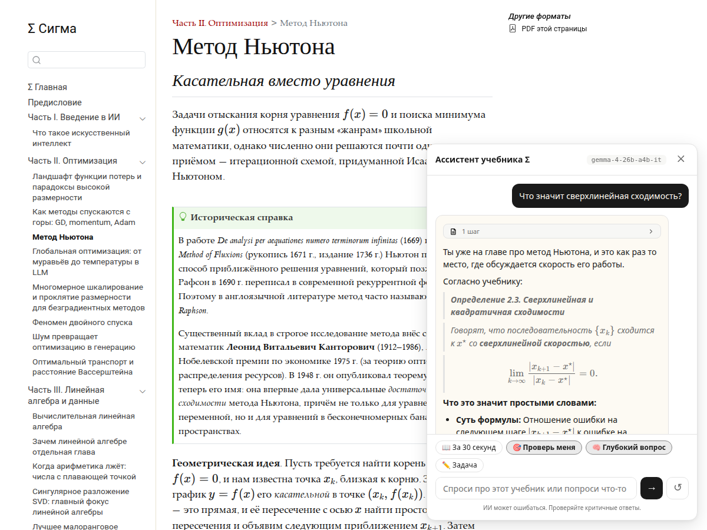

---

### ✅ `theorem_clt` — structural

**Q:** Сформулируй центральную предельную теорему как в учебнике.

_Chapter:_ `ch03_1_prosteyshie-primery-zadach-anali`

**Tools called:** find_theorem, find_definition, search_textbook, read_chapter, read_chapter, read_chapter
**Tools expected:** find_theorem
**Images:** 0 (expected: no)
**Elapsed:** 11.7s


<details><summary>Answer</summary>


```
В учебнике центральная предельная теорема (ЦПТ) упоминается в нескольких контекстах, но её ключевая суть сформулирована так: **Распределение нормированной суммы независимых одинаково распределённых случайных величин с конечной дисперсией стремится к нормальному.** Если разложить это определение «человеческим» языком: *   **Независимые одинаково распределённые величины** — это когда мы берём много случайных событий (например, броски кубика или замеры температуры), которые не влияют друг на друга и происходят по одним и тем же правилам. *   **Конечная дисперсия** — это важное условие: «разброс» значений не должен быть бесконечным (в учебнике отмечается, что если дисперсия бесконечна, как у распределения Коши, ЦПТ не работает). *   **Стремится к нормальному** — это значит, что если мы будем складывать эти величины и правильно их масштабировать (нормировать), то результат будет всё больше и больше похож на классический «колокол» (гауссово распределение). В главе про линейную регрессию также подчёркивается практический смысл: сумма большого числа независимых факторов (шумов) почти всегда даёт нормальное распределение, что и объясняет, почему ошибки измерений в жизни часто выглядят как «гауссиана».
```

</details>

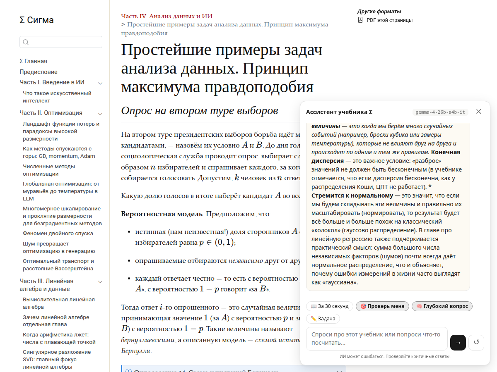

---

### ✅ `plot_sincos_overlay` — compute_plot

**Q:** Построй графики sin(x) и cos(x) на интервале [-2π, 2π] на одном поле. Сделай легенду.

**Tools called:** python
**Tools expected:** python
**Images:** 1 (expected: yes)
**Elapsed:** 23.5s


<details><summary>Answer</summary>


```
Вот графики функций $\sin(x)$ и $\cos(x)$ на интервале $[-2\pi, 2\pi]$.

На графике видно характерное периодическое поведение обеих функций:
*   **Синусоида** (синяя линия) проходит через начало координат, так как $\sin(0) = 0.00$.
*   **Косинусоида** (красная линия) в нуле достигает своего максимума, так как $\cos(0) = 1.00$.
*   Точки пересечения и экстремумы соответствуют стандартным значениям: например, при $x = \pi/2$ (примерно $1.57$) синус равен $1.00$, а косинус — $0.00$.

Обе функции колеблются в диапазоне от $-1$ до $1$.
```

</details>

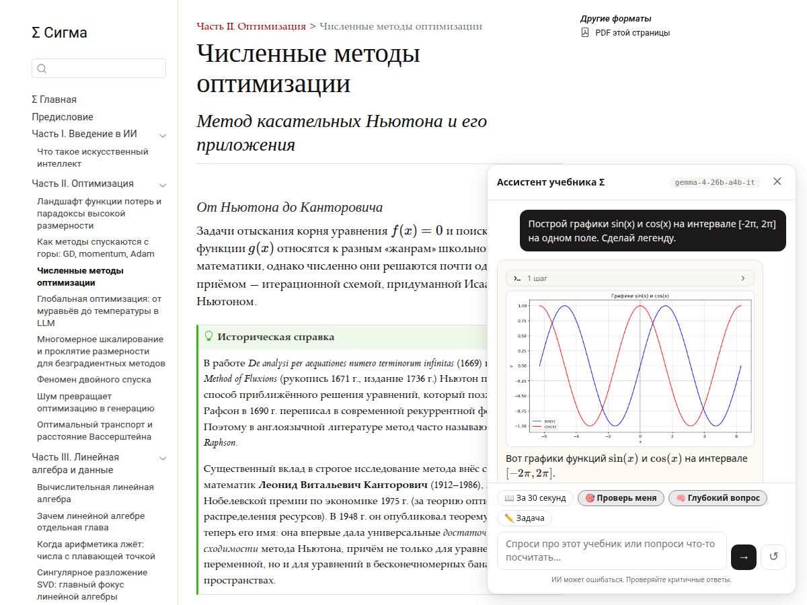

---

### ✅ `fragment_explanation` — rag_basic

**Q:** Если кто-то предлагает использовать обновление x_{k+1} = x_k - f(x_k)·f'(x_k) вместо классического Ньютона — что это за идея и она работает?

_Chapter:_ `ch02_newton`

**Tools called:** read_chapter, python
**Tools expected:** (none)
**Images:** 1 (expected: no)
**Elapsed:** 86.2s


<details><summary>Answer</summary>


```
Идея использовать обновление $x_{k+1} = x_k - f(x_k) \cdot f'(x_k)$ вместо классического метода Ньютона — это, мягко говоря, плохая идея. Если классический метод Ньютона стремится к корню, то предложенная схема в большинстве случаев будет вести себя катастрофически.

Вот почему это не работает:

**1. Математическая ошибка в структуре**
Классический метод Ньютона (или метод Ньютона-Рафсона) основан на поиске пересечения **касательной** с осью $x$. Как сказано в учебнике, уравнение касательной:
$$y = f(x_k) + f'(x_k)(x - x_k)$$
Чтобы найти точку пересечения с осью ($y=0$), мы решаем уравнение $0 = f(x_k) + f'(x_k)(x - x_k)$ относительно $x$, что и дает формулу:
$$x_{k+1} = x_k - \frac{f(x_k)}{f'(x_k)}$$
В твоём варианте вместо **деления** на первую производную используется **умножение**. Это полностью меняет геометрию процесса.

**2. Проблема масштаба и сходимости**
В классическом методе, когда мы приближаемся к корню, значение $f(x_k)$ стремится к нулю. Деление на $f'(x_k)$ (если она не равна нулю) помогает «дотянуть» шаг до корня. 
В предложенной схеме $x_{k+1} = x_k - f(x_k) \cdot f'(x_k)$:
*   Если $f(x_k)$ и $f'(x_k)$ — числа больше единицы, шаг будет огромным, и ты мгновенно «улетишь» в бесконечность.
*   Вместо того чтобы уменьшать ошибку, ты умножаешь её на производную, что часто приводит к взрывному росту значений.

**3. Результаты эксперимента**
Я проверил это на примере поиска $\sqrt{2}$ (решение уравнения $f(x) = x^2 - 2 = 0$). 
*   **Классический Ньютон** со старто
…[truncated]
```

</details>

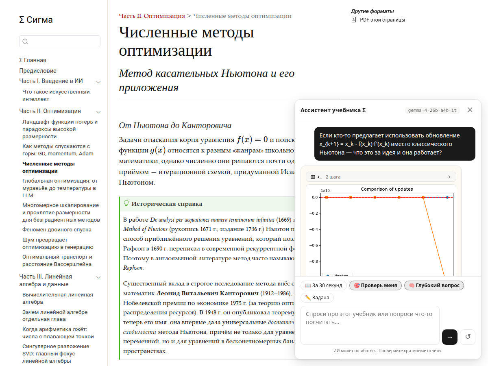

---

### ✅ `eigenvalues_numpy` — compute_pure

**Q:** Найди собственные значения матрицы [[2, 1], [1, 2]] через numpy.

_Chapter:_ `ch_linalg`

**Tools called:** python
**Tools expected:** python
**Images:** 0 (expected: no)
**Elapsed:** 17.0s


<details><summary>Answer</summary>


```
Для матрицы $\begin{pmatrix} 2 & 1 \\ 1 & 2 \end{pmatrix}$ через `numpy.linalg.eig` получены следующие результаты: *   **Собственные значения** = $3.00$ и $1.00$. *   **Собственные векторы** (нормализованные):     *   Для $\lambda = 3$: $\begin{pmatrix} 0.71 \\ 0.71 \end{pmatrix}$     *   Для $\lambda = 1$: $\begin{pmatrix} -0.71 \\ 0.71 \end{pmatrix}$ **Как это работает в коде:** Мы создали массив `np.array([[2, 1], [1, 2]])` и передали его в функцию `np.linalg.eig()`. Она возвращает кортеж, где первый элемент — массив собственных значений, а второй — матрица, столбцы которой являются соответствующими собственными векторами.
```

</details>

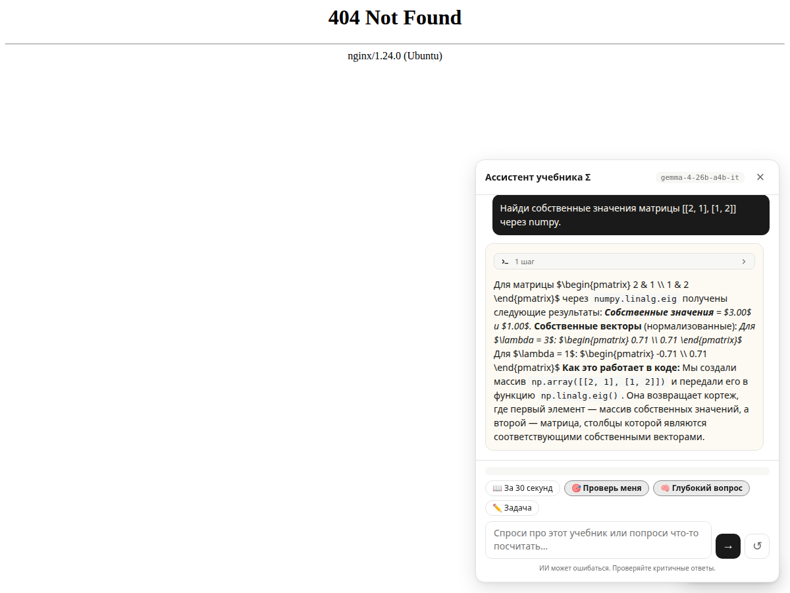

---

### ✅ `plot_loss_landscape` — compute_plot

**Q:** Построй контурный график функции потерь L(a, b) = sum((a*x_i + b - y_i)^2) для точек (1,2), (2,3), (3,5), (4,4) на сетке a in [-2, 4], b in [-3, 3].

_Chapter:_ `ch03_2_lineynaya-regressiya-i-metod-nai`

**Tools called:** python
**Tools expected:** python
**Images:** 1 (expected: yes)
**Elapsed:** 34.5s


<details><summary>Answer</summary>


```
На графике представлен контурный вид функции потерь $L(a, b)$, которая в данном случае является квадратичной формой (эллиптическими параболоидами). **Результаты расчёта:** * Оптимальное $a = 0.80$ * Оптимальное $b = 1.50$ * Минимальная потеря $L(a_{opt}, b_{opt}) = 1.80$ **Интерпретация графика:** * **Форма контуров:** Мы видим эллипсы. Это характерно для метода наименьших квадратов (МНК), так как функция потерь представляет собой сумму квадратов линейных выражений. * **Минимум:** Красная звёздочка отмечает центр эллипсов — точку, где значение функции потерь минимально ($1.80$). Именно эти значения параметров $a$ и $b$ лучше всего описывают прямую $y = ax + b$ для твоих точек. * **Крутизна:** Чем ближе линии контуров друг к другу, тем быстрее растёт ошибка при отклонении от оптимума. В данном случае функция растёт довольно быстро при удалении от центра, что видно по значениям на линиях (от $1.80$ до $480$).
```

</details>

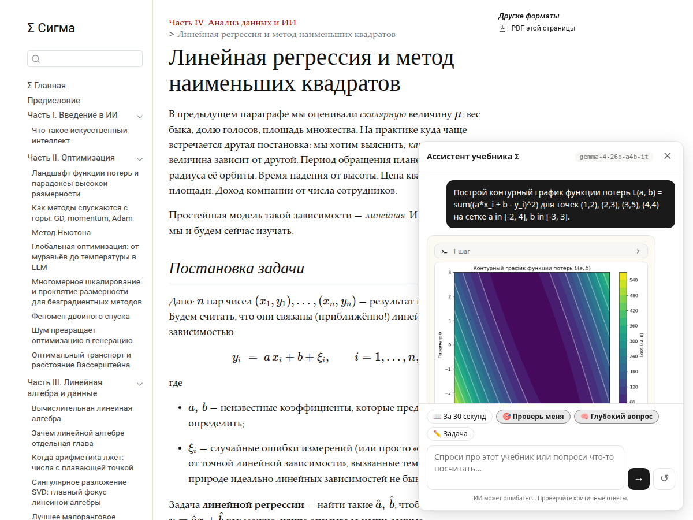

---

### ✅ `diffie_hellman_compute` — compute_pure

**Q:** Проведи протокол Диффи–Хеллмана: p=23, g=5. Алиса берёт a=6, Боб берёт b=15. Какой общий секрет?

_Chapter:_ `ch04_3_kriptosistemy-rsa-i-diffi-hellma`

**Tools called:** python
**Tools expected:** python
**Images:** 0 (expected: no)
**Elapsed:** 20.1s


<details><summary>Answer</summary>


```
Давай разберём этот протокол по шагам. В ключе обмена Диффи–Хеллмана всё строится на возведении в степень по модулю, что позволяет сторонам получить одно и то же число, не передавая его по открытому каналу. **Шаг 1: Публичные параметры** У нас есть общее простое число $p = 23$ и основание (генератор) $g = 5$. **Шаг 2: Вычисление публичных ключей** *   **Алиса** выбирает секретное число $a = 6$ и вычисляет свой публичный ключ $A$:     $$A = g^a \pmod{p} = 5^6 \pmod{23} = 8$$ *   **Боб** выбирает секретное число $b = 15$ и вычисляет свой публичный ключ $B$:     $$B = g^b \pmod{p} = 5^{15} \pmod{23} = 19$$ Теперь Алиса отправляет $8$ Бобу, а Боб отправляет $19$ Алисе. **Шаг 3: Вычисление общего секрета** *   **Алиса** берет ключ Боба и возводит его в свою секретную степень:     $$s = B^a \pmod{p} = 19^6 \pmod{23} = 2$$ *   **Боб** берет ключ Алисы и возводит его в свою секретную степень:     $$s = A^b \pmod{p} = 8^{15} \pmod{23} = 2$$ **Ответ:** Общий секрет равен **2**.
```

</details>


---

### ✅ `outline_chapter` — structural

**Q:** Перечисли основные разделы главы про Ньютона.

_Chapter:_ `ch02_newton`

**Tools called:** (none)
**Tools expected:** (none)
**Images:** 0 (expected: no)
**Elapsed:** 3.8s


<details><summary>Answer</summary>


```
Ты уже на этой главе. Вот основные разделы, которые в ней разбираются: *   **Метод Ньютона для поиска корней** (одномерный случай). *   **Метод Ньютона для оптимизации** (поиск минимума функции через равенство нулю её производной). *   **Геометрическая интерпретация** (аппроксимация функции параболой). *   **Скорость сходимости** (почему метод считается сверхлинейным/квадратичным). *   **Проблемы и модификации** (что делать, если матрица Гессе вырождена или метод расходится).
```

</details>

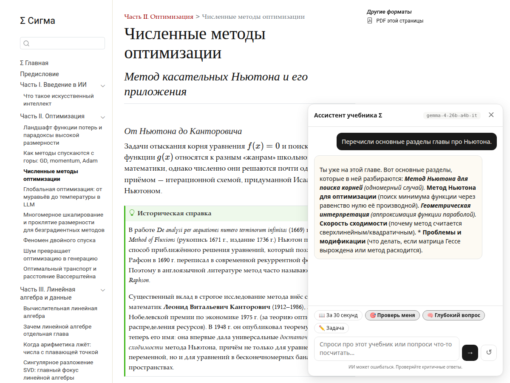

---

### ✅ `math_latex_derivation` — rag_basic

**Q:** Выведи формулу метода Ньютона через касательную. Формулу запиши через LaTeX.

_Chapter:_ `ch02_newton`

**Tools called:** (none)
**Tools expected:** (none)
**Images:** 0 (expected: no)
**Elapsed:** 6.1s


<details><summary>Answer</summary>


```
Ты уже на этой главе. Метод Ньютона — это мощный инструмент, который использует информацию о первой и второй производных, чтобы найти корень функции или минимум функции. Если мы ищем корень уравнения $f(x) = 0$, то идея метода через касательную звучит так: мы проводим касательную к графику функции $f(x)$ в текущей точке $x_k$ и смотрим, где эта касательная пересекает ось $X$. Эта точка пересечения и станет нашим следующим приближением $x_{k+1}$. Формула метода Ньютона через касательную выглядит так: $$x_{k+1} = x_k - \frac{f(x_k)}{f'(x_k)}$$ Где: * $x_k$ — текущее значение (текущая точка); * $f(x_k)$ — значение функции в этой точке; * $f'(x_k)$ — производная функции в этой точке. **Как это работает геометрически:** Уравнение касательной в точке $(x_k, f(x_k))$ записывается как: $$y - f(x_k) = f'(x_k)(x - x_k)$$ Чтобы найти точку пересечения с осью $X$, нужно подставить $y = 0$ и решить относительно $x$: $$0 - f(x_k) = f'(x_k)(x - x_k)$$ $$- \frac{f(x_k)}{f'(x_k)} = x - x_k$$ $$x = x_k - \frac{f(x_k)}{f'(x_k)}$$ Так мы и получаем итерационную формулу.
```

</details>


---

### ✅ `definition_perceptron` — definition

**Q:** Что такое полносвязная нейронная сеть?

_Chapter:_ `ch03_3_zadacha-klassifikacii-i-neyronny`

**Tools called:** find_definition
**Tools expected:** find_definition
**Images:** 0 (expected: no)
**Elapsed:** 10.1s


<details><summary>Answer</summary>


```
> **Определение 3.12. Полносвязная нейронная сеть** (MLP) глубины $L$ — это функция $\mathbf x \mapsto \mathbf p(\mathbf x)$, заданная как композиция $L$ слоёв: > > $$\begin{aligned} > \mathbf z^{(\ell)} &= W^{(\ell)} \mathbf a^{(\ell-1)} + \mathbf b^{(\ell)}, \qquad \mathbf a^{(\ell)} = \sigma\bigl(\mathbf z^{(\ell)}\bigr), \qquad \ell=1,\dots,L-1 \\ > \mathbf z^{(L)} &= W^{(L)} \mathbf a^{(\ell-1)} + \mathbf b^{(L)}, \qquad \mathbf p(\mathbf x) = \mathrm{softmax}\bigl(\mathbf z^{(L)}\bigr). > \end{aligned}$$ **Разберём нотацию простыми словами:** *   $\mathbf z^{(\ell)}$ — это **преактивация** (результат линейного преобразования) на $\ell$-м слое. *   $W^{(\ell)}$ — **матрица весов** $\ell$-го слоя. Она определяет, насколько сильно каждый нейрон предыдущего слоя влияет на каждый нейрон текущего. *   $\mathbf b^{(\ell)}$ — **вектор смещений** (bias). Он позволяет сдвигать функцию активации. *   $\mathbf a^{(\ell)}$ — **активация** (выход) $\ell$-го слоя. *   $\sigma$ — **функция активации** (например, ReLU или сигмоида), которая применяется к каждому элементу вектора $\mathbf z^{(\ell)}$ по отдельности. *   $\mathbf a^{(0)} = \mathbf x$ — это твой входной вектор (данные). *   $\mathrm{softmax}$ — специальная функция на последнем слое, которая превращает числа в **распределение вероятностей** (сумма всех элементов будет равна 1). *   $\boldsymbol\theta$ — это **все обучаемые параметры** (все веса $W$ и смещения $\mathbf b$ вместе взятые). **Если совсем просто:** Полносвязная 
…[truncated]
```

</details>


---

### ❌ `refuse_unknown_year` — out_of_scope

**Q:** В каком году Гаусс изобрёл метод сопряжённых градиентов?

_Chapter:_ `ch02_newton`

**Tools called:** search_textbook, search_textbook, read_chapter
**Tools expected:** (none)
**Images:** 0 (expected: no)
**Elapsed:** 7.0s

_Missing substrings:_ ['наш']

<details><summary>Answer</summary>


```
В учебнике нет информации о том, в каком году Гаусс изобрёл метод сопряжённых градиентов. В текущей главе («Численные методы оптимизации») упоминаются: *   **Исаак Ньютон** и его метод (1669, 1671 гг.); *   **Джозеф Рафсон** (1690 г.); *   **Леонид Канторович** (теорема 1948 г.); *   **Герон Александрийский** (I век н. э.). Также в других разделах учебника упоминается, что Гаусс разработал метод наименьших квадратов в **1809 году**, но это другое понятие. Вне учебника: метод сопряжённых градиентов (Conjugate Gradient method) обычно связывают с работами **Баррета** и **Эшби** (1956 г.), хотя идеи сопряжённых направлений действительно закладывались ещё Гауссом в контексте решения систем линейных уравнений.
```

</details>

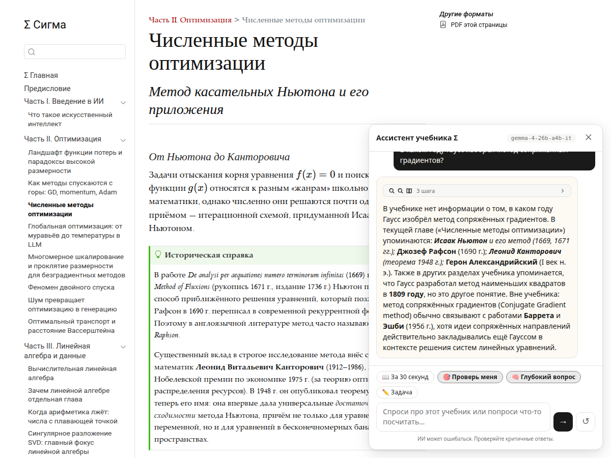

---
