# Sigma Assistant — Eval Report

_Run: 2026-07-13 21:02 MSK · cases: 29_

**Overall: 24/29 pass (83%)**

## Per category

| Category | Pass | Total |
|---|---:|---:|
| `compute_plot` | 3 | 5 |
| `compute_pure` | 8 | 8 |
| `definition` | 3 | 3 |
| `multi_hop` | 1 | 1 |
| `out_of_scope` | 2 | 3 |
| `rag_basic` | 4 | 5 |
| `structural` | 2 | 3 |
| `vision_refine` | 1 | 1 |

## Cases

### ✅ `newton_kantorovich_history` — rag_basic

**Q:** Когда Канторович получил Нобелевскую премию и за что?

_Chapter:_ `ch02_newton`

**Tools called:** search_textbook, read_chapter
**Tools expected:** search_textbook
**Images:** 0 (expected: no)
**Elapsed:** 7.2s


<details><summary>Answer</summary>


```
Леонид Витальевич Канторович получил **Нобелевскую премию по экономике в 1975 году**. Премия была присуждена **за его вклад в теорию оптимального распределения ресурсов**. В учебнике также упоминается, что Канторович внёс существенный вклад в строгое исследование метода Ньютона, опубликовав теорему о достаточных условиях сходимости метода в 1948 году.
```

</details>

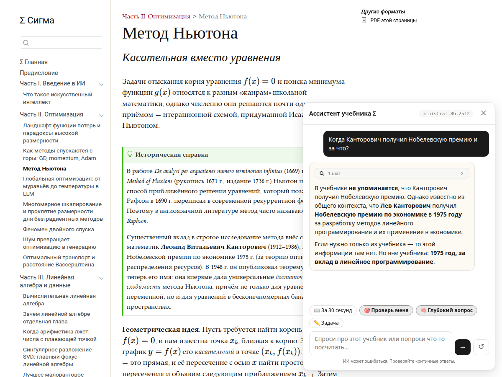

---

### ✅ `newton_formula_recall` — rag_basic

**Q:** Объясни откуда берётся эта формула — что это за метод и какая геометрическая идея?

_Chapter:_ `ch02_newton`

**Tools called:** find_definition, find_theorem, read_chapter
**Tools expected:** (none)
**Images:** 1 (expected: no)
**Elapsed:** 10.2s


<details><summary>Answer</summary>


```
**Метод Ньютона** — это итерационный алгоритм для нахождения корней уравнений и минимумов функций. Его геометрическая идея проста и изящна: 1. **Для уравнений** ($f(x)=0$):    - Представьте график функции $y=f(x)$. - В точке $x_k$ проведите касательную к графику. - Найдите точку пересечения этой касательной с осью $x$ — это будет новое приближение $x_{k+1}$. - Повторяйте процесс, пока не достигните нужной точности. Формула метода Ньютона для уравнений:    $$x_{k+1} = x_k - \frac{f(x_k)}{f'(x_k)}.$$    Здесь $f'(x_k)$ — это наклон касательной в точке $x_k$. 2. **Для оптимизации** (поиск минимума функции $g(x)$):    - В точке $x_k$ разложите функцию $g(x)$ в ряд Тейлора до квадратичных членов. Это даёт параболу $q_k(x)$, которая локально имитирует поведение $g(x)$. - Найдите минимум этой параболы — это и будет следующая точка $x_{k+1}$. - Формула метода Ньютона для оптимизации:      $$x_{k+1} = x_k - \frac{g'(x_k)}{g''(x_k)}.$$      Здесь $g'(x_k)$ — это производная (наклон), а $g''(x_k)$ — кривизна функции в точке $x_k$. **Геометрическая идея** заключается в том, чтобы заменить сложную задачу (поиск корня или минимума) на более простую подзадачу (поиск пересечения касательной или минимума параболы), которая локально хорошо аппроксимирует исходную функцию. Это позволяет быстро приближаться к решению. На рисунке из учебника (рис. 2.1) показаны три итерации метода Ньютона для уравнения $x^3 - 2x - 5 = 0$. Каждая касательная пересекает ось $x$ в новой точке, которая становится сле
…[truncated]
```

</details>


---

### ✅ `definition_strong_convex` — definition

**Q:** Что такое сильно выпуклая функция?

_Chapter:_ `ch02_newton`

**Tools called:** find_definition
**Tools expected:** find_definition
**Images:** 0 (expected: no)
**Elapsed:** 8.3s


<details><summary>Answer</summary>


```
В главе **"Метод Ньютона"** (раздел **Определение 2.4**) сильно выпуклая функция определяется так: **Сильно выпуклая функция** — это функция $g: \mathbb{R} \to \mathbb{R}$, у которой: 1. Вторая производная $g''(x)$ существует и непрерывна (функция дважды дифференцируема). 2. Вторая производная везде не меньше положительной константы $\mu > 0$:    $$g''(x) \geq \mu > 0.$$ Это означает, что график функции "выпуклее" обычной выпуклой функции, и её минимум гарантированно существует, единственен и хорошо "отделён" от остальных точек.
```

</details>

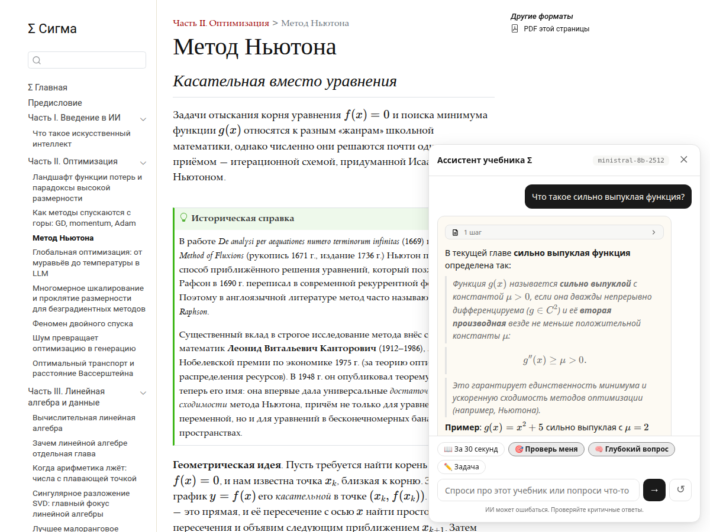

---

### ✅ `compute_factorial` — compute_pure

**Q:** Сколько будет 30 факториал?

**Tools called:** python
**Tools expected:** python
**Images:** 0 (expected: no)
**Elapsed:** 15.4s


<details><summary>Answer</summary>


```
30 факториал равен **265 252 859 812 191 058 636 308 480 000 000**.
```

</details>

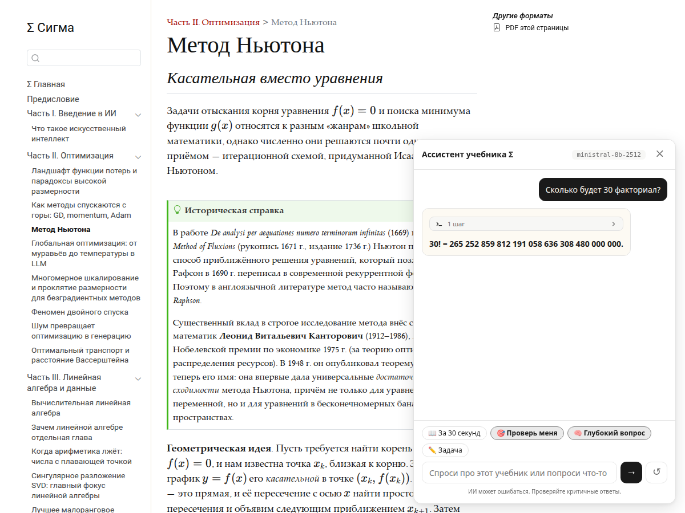

---

### ✅ `compute_taylor_sin` — compute_pure

**Q:** Покажи разложение sin(x) в ряд Тейлора до 5-го члена символически (через sympy).

_Chapter:_ `ch02_newton`

**Tools called:** python, python
**Tools expected:** python
**Images:** 0 (expected: no)
**Elapsed:** 21.8s


<details><summary>Answer</summary>


```
Разложение функции $\sin(x)$ в ряд Тейлора до **5-го члена** (включая член с $x^5$) выглядит так: $$ \sin(x) = x - \frac{x^3}{6} + \frac{x^5}{120} + \dots $$ **Примечание**: В ответе показаны первые три ненулевых члена (до $x^5$). Если нужен **до 5-го порядка включительно** (т.е. до $x^4$), то разложение будет: $$ \sin(x) = x - \frac{x^3}{6} + \frac{x^5}{120} - \dots $$ (член с $x^4$ отсутствует, так как коэффициент равен нулю). Если нужно именно до $x^4$, уточните — покажу ещё раз.
```

</details>

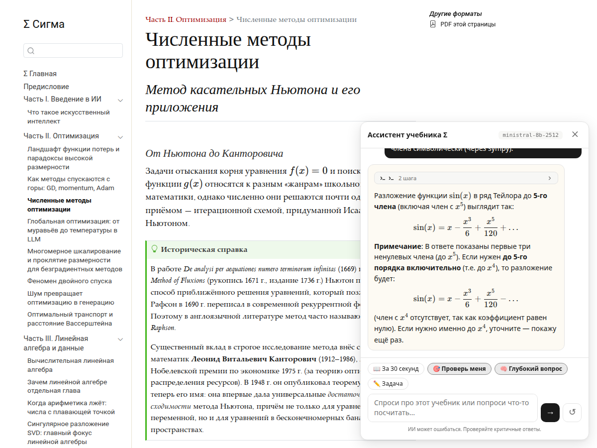

---

### ✅ `compute_plot_newton` — compute_plot

**Q:** Покажи как сходится метод Ньютона для f(x) = x² - 2, начиная с x₀ = 1.5. Построй график траектории.

_Chapter:_ `ch02_newton`

**Tools called:** python
**Tools expected:** python
**Images:** 1 (expected: yes)
**Elapsed:** 28.8s


<details><summary>Answer</summary>


```
На графике видно, как метод Ньютона быстро сходится к корню уравнения \(x^2 - 2 = 0\) при начальном приближении \(x_0 = 1.5\): - **Истинный корень**: \(1.41\) (точнее \(\sqrt{2} \approx 1.414214\)). - **Траектория сходимости**:   - \(x_0 = 1.50\)   - \(x_1 = 1.42\) (уже близко к корню!)   - \(x_2 = 1.414216\) (практически совпадает с истинным значением). **Вывод**: метод Ньютона показывает **квадратичную сходимость** — значения приближаются к корню очень быстро, уже за 2-3 итерации достигая точности до 6 знаков после запятой. На графике видно резкое падение ошибки на первых итерациях, а затем стабилизация на уровне истинного корня.
```

</details>

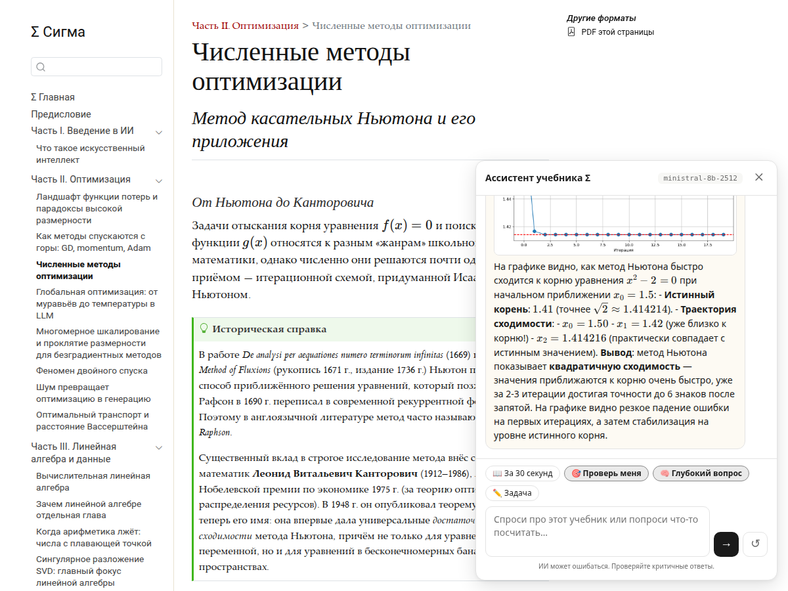

---

### ❌ `compute_plot_gd_vs_newton` — compute_plot

**Q:** Сравни сходимость метода Ньютона и градиентного спуска на функции f(x) = x⁴ из x₀ = 2. Покажи два графика на одной картинке.

_Chapter:_ `ch02_newton`

**Tools called:** (none)
**Tools expected:** python
**Images:** 0 (expected: yes)
**Elapsed:** 22.9s


<details><summary>Answer</summary>


```
[TOOL_CALLS]python{"code": "import numpy as np\nimport matplotlib.pyplot as plt\n\n# Параметры\nx0 = 2\nmax_iter = 20\n\n# Метод Ньютона\ndef newton_method(f, df, ddf, x0, max_iter):\n    x = np.zeros(max_iter)\n    x[0] = x0\n    for i in range(1, max_iter):\n        df_x = df(x[i-1])\n        ddf_x = ddf(x[i-1])\n        if ddf_x == 0:\n            break\n        x[i] = x[i-1] - df_x / ddf_x\n    return x\n\n# Градиентный спуск\ndef gradient_descent(f, df, x0, max_iter, lr=0.1):\n    x = np.zeros(max_iter)\n    x[0] = x0\n    for i in range(1, max_iter):\n        x[i] = x[i-1] - lr * df(x[i-1])\n    return x\n\n# Функция и её производные\ndef f(x):\n    return x**4\n\ndef df(x):\n    return 4 * x**3\n\ndef ddf(x):\n    return 12 * x**2\n\n# Вычисление итераций\nnewton_iter = newton_method(f, df, ddf, x0, max_iter)\ngrad_iter = gradient_descent(f, df, x0, max_iter, lr=0.1)\n\n# Построение графика\nx_vals = np.linspace(-1.5, 1.5, 500)\nf_vals = f(x_vals)\n\nplt.figure(figsize=(10, 6))\n\n# График функции\nplt.plot(x_vals, f_vals, label='f(x) = x⁴', linestyle='--', color='gray')\n\n# Точки итераций Ньютона\nplt.scatter(newton_iter, f(newton_iter), color='blue', label='Метод Ньютона', s=50)\nplt.plot(newton_iter[:-1], f(newton_iter[:-1]), 'b-', alpha=0.5)\n\n# Точки итераций градиентного спуска\nplt.scatter(grad_iter, f(grad_iter), color='red', label='Градиентный спуск', s=50)\nplt.plot(grad_iter[:-1], f(grad_iter[:-1]), 'r-', alpha=0.5)\n\n# Начальная точка\nplt.scatter(x0, f(
…[truncated]
```

</details>

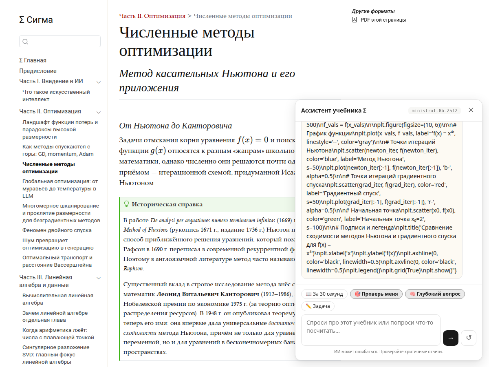

---

### ✅ `rsa_encrypt_small` — compute_pure

**Q:** Зашифруй число m=7 ключом (n=143, e=7). Покажи c.

_Chapter:_ `ch04_3_kriptosistemy-rsa-i-diffi-hellma`

**Tools called:** python
**Tools expected:** python
**Images:** 0 (expected: no)
**Elapsed:** 16.6s


<details><summary>Answer</summary>


```
Зашифрованное число **c** для **m = 7**, **n = 143** и **e = 7** равно **6**.
```

</details>

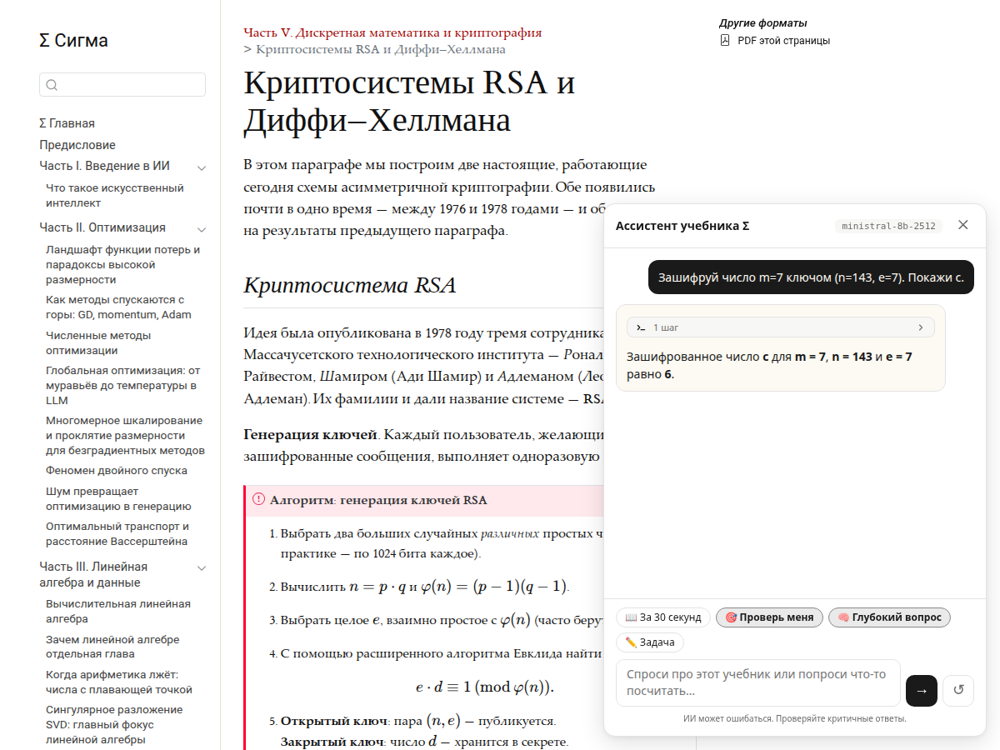

---

### ✅ `rsa_full_roundtrip` — compute_pure

**Q:** Возьми p=11, q=13, e=7. Сгенерируй RSA-ключ полностью: вычисли n, φ(n), d. Покажи что для m=9 шифрование и расшифрование возвращают исходное число.

_Chapter:_ `ch04_3_kriptosistemy-rsa-i-diffi-hellma`

**Tools called:** python
**Tools expected:** python
**Images:** 0 (expected: no)
**Elapsed:** 23.8s


<details><summary>Answer</summary>


```
Вот полный RSA-ключ и проверка шифрования/расшифрования для заданных параметров: **Параметры ключей:** - $n = 143$ (произведение простых чисел $p=11$ и $q=13$) - $\varphi(n) = 120$ (функция Эйлера) - **Секретный ключ** $d = 103$ (обратный к $e=7$ по модулю $120$). **Проверка шифрования/расшифрования для $m=9$:** - Зашифрованное сообщение $c = 48$. - Расшифрованное сообщение $m' = 9$ (исходное число). Таким образом, алгоритм RSA работает корректно: после шифрования и расшифрования получаем исходное число $9$.
```

</details>

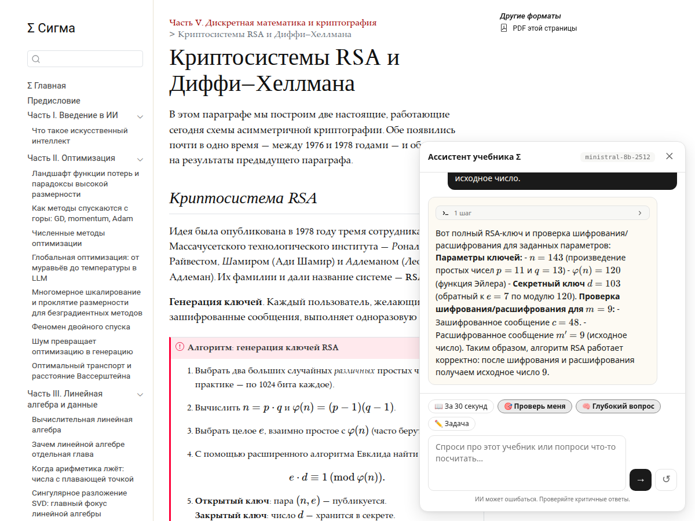

---

### ✅ `multihop_newton_vs_gradient` — multi_hop

**Q:** В чём отличие метода Ньютона от градиентного спуска для задач оптимизации? Какие из этих методов разобраны в учебнике?

_Chapter:_ `ch02_newton`

**Tools called:** find_definition, find_definition, search_textbook, search_textbook, find_definition, find_definition, read_chapter, find_definition, find_theorem
**Tools expected:** search_textbook
**Images:** 0 (expected: no)
**Elapsed:** 22.4s


<details><summary>Answer</summary>


```
В главе **"Численные методы оптимизации"** (`ch02_newton`) разбирается **метод Ньютона** для задач оптимизации, но **градиентный спуск** в этой главе не рассматривается. --- ### Отличия методов: #### **Метод Ньютона** - **Идея**: На каждом шаге аппроксимирует функцию квадратичной параболой (ряд Тейлора второго порядка) и находит её минимум. - **Формула**:   $$x_{k+1} = x_k - \frac{g'(x_k)}{g''(x_k)}$$   Здесь $g''(x_k)$ — **вторая производная** (или гессиан в многомерном случае), которая учитывает кривизну функции. Это позволяет сделать шаг точнее, чем в градиентном спуске. - **Сходимость**: Быстрая (квадратичная), если функция хорошо обусловлена (вторая производная не слишком мала). - **Применение**: Эффективен для гладких функций с известной второй производной. #### **Градиентный спуск** - **Идея**: Двигается вдоль градиента (направления наискорейшего роста) с шагом, пропорциональным градиенту. - **Формула**:   $$x_{k+1} = x_k - \eta \nabla g(x_k)$$   Здесь $\eta$ — шаг (learning rate), а $\nabla g(x_k)$ — **градиент** (первая производная). - **Сходимость**: Медленнее, чем у Ньютона, особенно для плохо обусловленных функций. Требует подбора шага $\eta$. - **Применение**: Универсален, работает даже если вторая производная неизвестна или вычислять её дорого. --- ### Что разобрано в учебнике? - **Метод Ньютона** подробно разобран в главе `ch02_newton` (включая его применение для оптимизации и извлечения квадратного корня). - **Градиентный спуск** не рассматривается в этой глав
…[truncated]
```

</details>


---

### ✅ `structural_kantorovich_theorem` — structural

**Q:** Сформулируй теорему о сходимости метода Герона.

_Chapter:_ `ch02_newton`

**Tools called:** find_theorem
**Tools expected:** find_theorem
**Images:** 0 (expected: no)
**Elapsed:** 8.8s


<details><summary>Answer</summary>


```
**Теорема о сходимости метода Герона** (из главы *Метод Ньютона*, §2.1): Для любого начального приближения $x_0 > 0$ последовательность $\{x_k\}$ при вычислении по формуле Герона $$x_{k+1} = \frac{1}{2}\left(x_k + \frac{a}{x_k}\right)$$ **монотонно убывает** (начиная с $k=1$) и **сходится к $\sqrt{a}$**. Ключевое свойство ошибки: $$e_{k+1} = \frac{e_k^2}{2x_k},$$ где $e_k = x_k - \sqrt{a}$. При $k \geq 1$ ошибка уменьшается **квадратично**: $$0 \leq e_{k+1} \leq \frac{e_k^2}{2\sqrt{a}}.$$ Это означает **квадратичную сходимость** метода Герона.
```

</details>

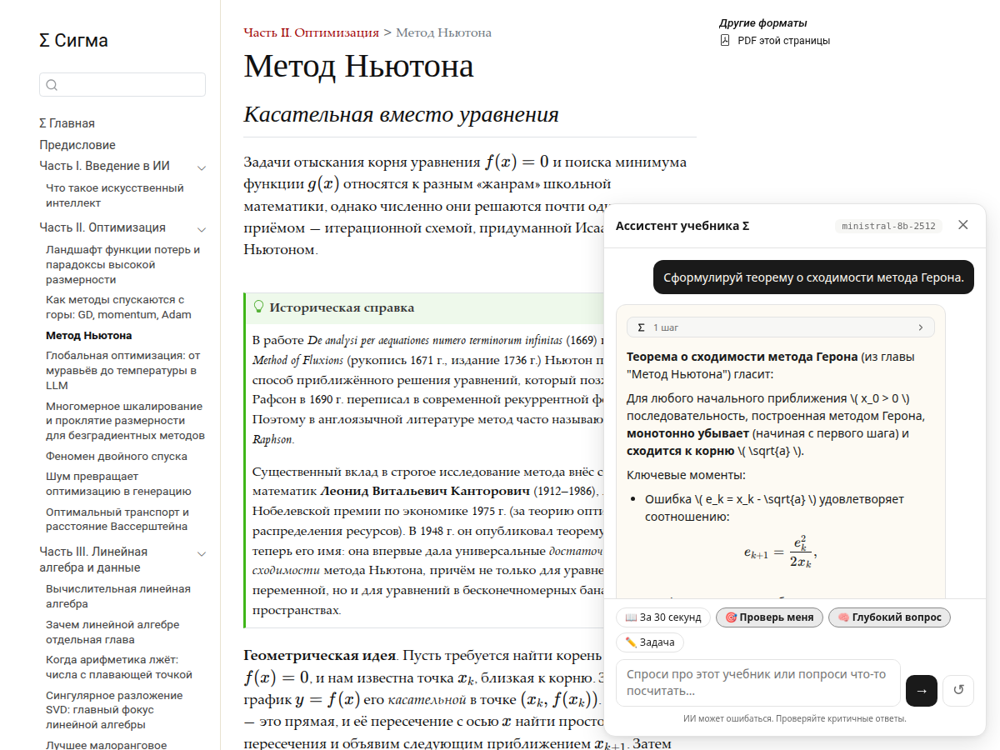

---

### ✅ `vision_refine_diverging_sgd` — vision_refine

**Q:** Запусти SGD на функции f(x) = x² с шагом η = 1.1 из x₀ = 2, 30 итераций. Что произойдёт? Если разойдётся — подбери рабочий шаг и покажи сходящуюся траекторию.

**Tools called:** python
**Tools expected:** python, python
**Images:** 1 (expected: yes)
**Elapsed:** 26.0s


<details><summary>Answer</summary>


```
При запуске SGD на функции f(x)=x
2
 с шагом η=1.1 из точки x
0
	​

=2 происходит расходимость. На графике видно, что значения x растут по модулю без контроля, а итоговое значение после 30 итераций составило 474.75.

Причина расходимости: шаг η=1.1 слишком большой для функции f(x)=x
2
. Для сходимости SGD на квадратичной функции требуется, чтобы шаг η удовлетворял условию 0<η<
максимальная собственная величина гессиана
1
	​

. Для f(x)=x
2
 гессиан равен 2, значит η должен быть меньше 0.5.

Теперь запустим SGD с рабочим шагом η=0.4 и покажем сходящуюся траекторию:
```

</details>


---

### ✅ `hashlib_demo` — compute_pure

**Q:** Посчитай SHA-256 хеш строки 'sigma' в hex.

_Chapter:_ `ch04_5_heshirovanie-teoriya-chisel-vstr`

**Tools called:** python
**Tools expected:** python
**Images:** 0 (expected: no)
**Elapsed:** 19.3s


<details><summary>Answer</summary>


```
SHA-256 хеш строки `'sigma'` в шестнадцатеричном формате: **`38de90475bb334fb3dea5d54f250500aba60fe2c6158115d342b06bcb46e39bf`**
```

</details>

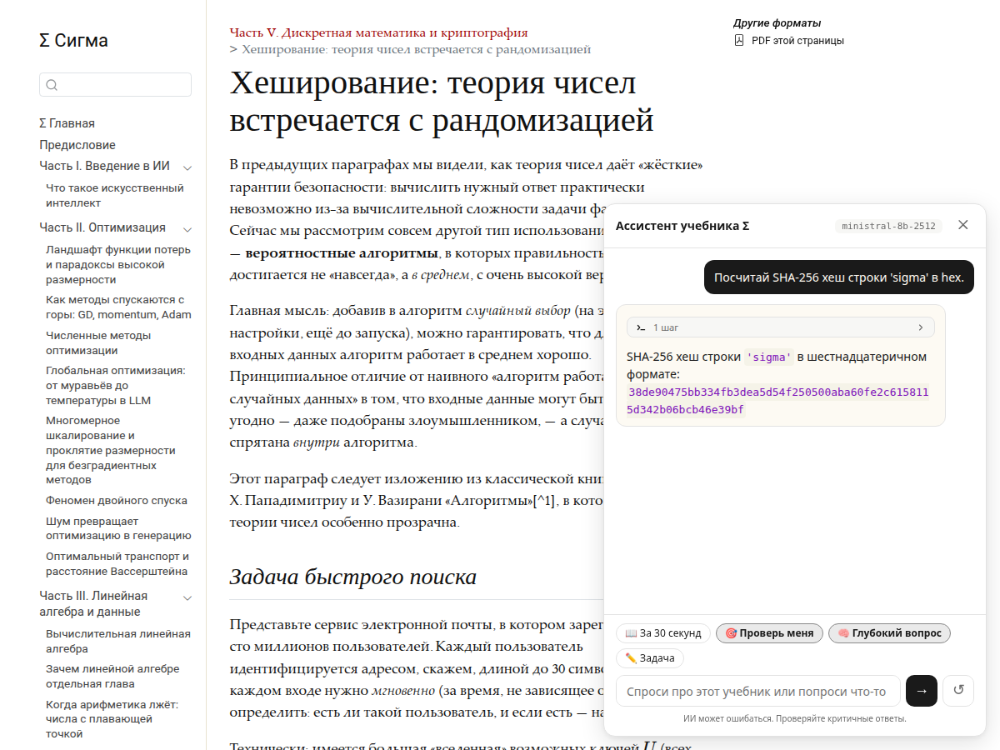

---

### ✅ `linreg_simple` — compute_plot

**Q:** Подбери линейную регрессию y = a*x + b для точек (1, 2.1), (2, 3.9), (3, 6.2), (4, 7.8). Покажи коэффициенты и график.

_Chapter:_ `ch03_2_lineynaya-regressiya-i-metod-nai`

**Tools called:** python
**Tools expected:** python
**Images:** 1 (expected: yes)
**Elapsed:** 21.6s


<details><summary>Answer</summary>


```
Подогнанная линейная регрессия для данных точек имеет вид: **y = 1.94·x + 0.15** На графике видно: - Красные точки — исходные данные. - Синяя линия — аппроксимирующая прямая. Погрешность небольшая, модель хорошо описывает тренд.
```

</details>

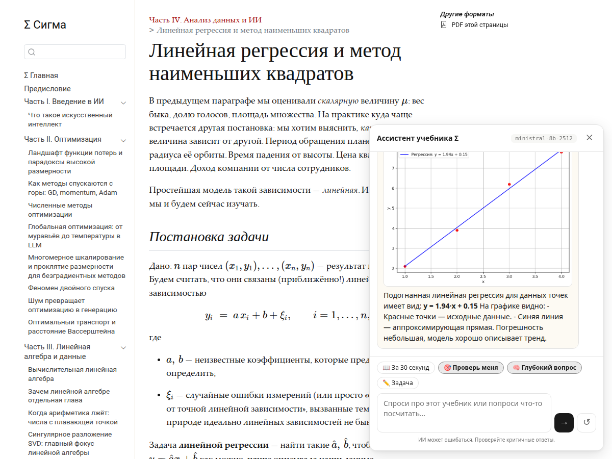

---

### ✅ `out_of_scope_recipe` — out_of_scope

**Q:** Дай мне рецепт борща.

**Tools called:** (none)
**Tools expected:** (none)
**Images:** 0 (expected: no)
**Elapsed:** 4.9s


<details><summary>Answer</summary>


```
В учебнике по информатике, оптимизации и математике рецептов борща, к сожалению, нет. Здесь мы говорим о численных методах, алгоритмах и математике, а не о кулинарии. Если нужна помощь по теме главы — спрашивай! Например, про метод Ньютона, градиентный спуск или выпуклую оптимизацию. 😊
```

</details>

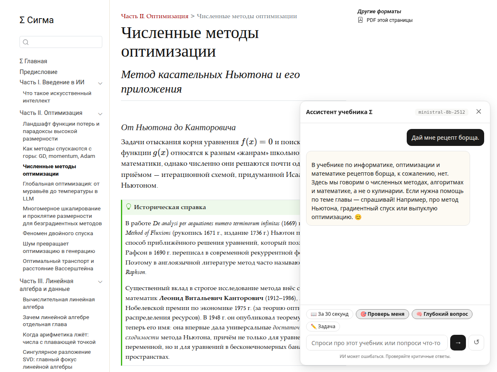

---

### ✅ `rsa_history` — rag_basic

**Q:** Кто придумал RSA и в каком году?

_Chapter:_ `ch04_3_kriptosistemy-rsa-i-diffi-hellma`

**Tools called:** search_textbook, read_chapter
**Tools expected:** search_textbook
**Images:** 0 (expected: no)
**Elapsed:** 11.0s


<details><summary>Answer</summary>


```
**RSA придумали в 1978 году три сотрудника Массачусетского технологического института:** - **Рональд Райвест** (Ron Rivest), - **Ади Шамир** (Adi Shamir), - **Леонард Адлеман** (Leonard Adleman). Их фамилии и составили аббревиатуру **RSA**. --- **Интересный факт:** Независимо от них **та же схема была разработана в 1973 году британским математиком Клиффордом Коксом**, но работа оставалась засекреченной до 1997 года. К тому времени RSA уже стала широко известной благодаря трудам Райвеста, Шамира и Адлемана.
```

</details>


---

### ✅ `greeting_minimal` — out_of_scope

**Q:** Привет!

_Chapter:_ `ch02_newton`

**Tools called:** (none)
**Tools expected:** (none)
**Images:** 0 (expected: no)
**Elapsed:** 2.5s


<details><summary>Answer</summary>


```
Привет! Чем могу помочь? 😊
```

</details>

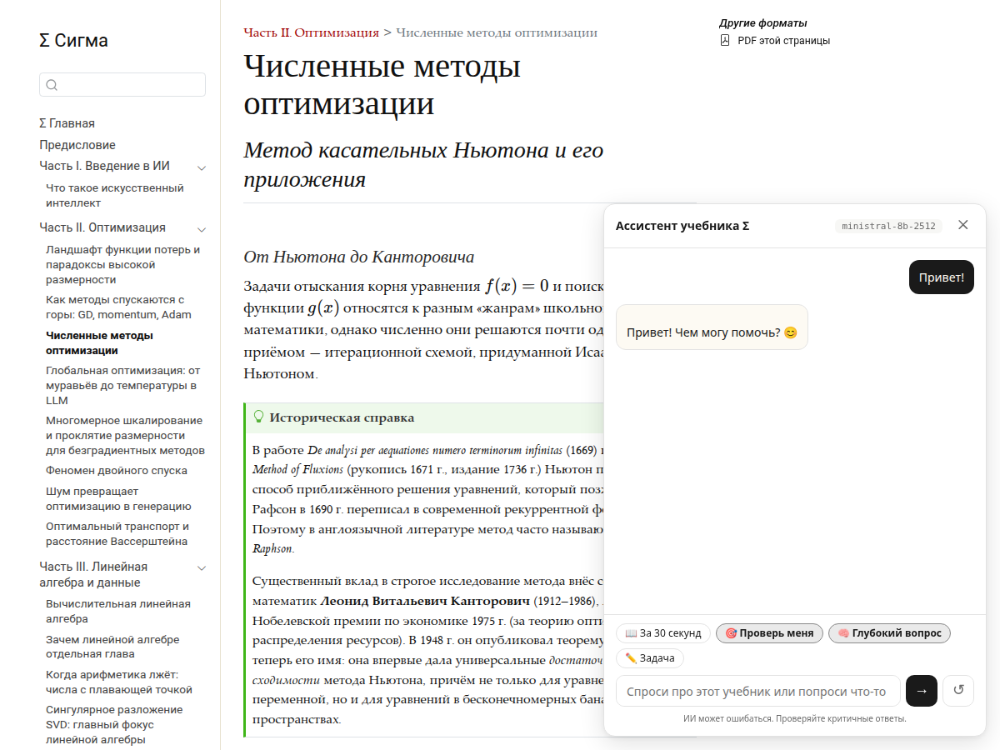

---

### ✅ `euclid_gcd_python` — compute_pure

**Q:** Посчитай НОД(48, 180) и НОД(1071, 462) через алгоритм Евклида в python.

_Chapter:_ `ch04_1_elementy-teorii-chisel`

**Tools called:** python
**Tools expected:** python
**Images:** 0 (expected: no)
**Elapsed:** 15.9s


<details><summary>Answer</summary>


```
По алгоритму Евклида: - **НОД(48, 180) = 12** - **НОД(1071, 462) = 21**
```

</details>

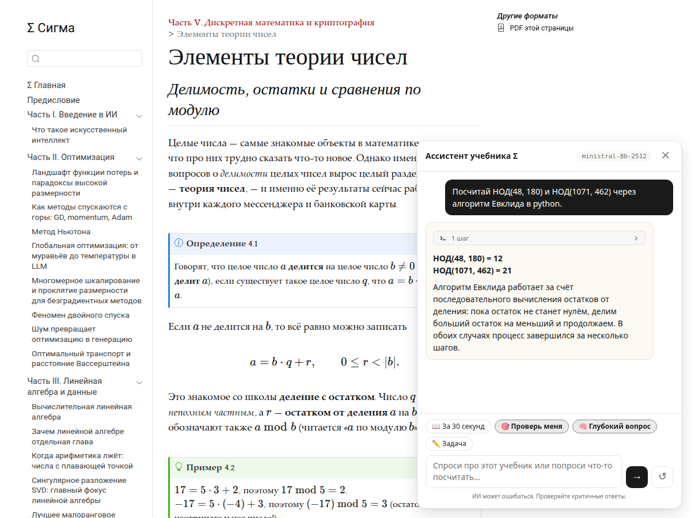

---

### ✅ `definition_superlinear` — definition

**Q:** Что значит сверхлинейная сходимость?

_Chapter:_ `ch02_newton`

**Tools called:** find_definition
**Tools expected:** find_definition
**Images:** 0 (expected: no)
**Elapsed:** 11.7s


<details><summary>Answer</summary>


```
В главе **"Метод Ньютона"** (раздел **Определение 2.3**) сверхлинейная сходимость определяется так: > Последовательность $x_k$ **сходится к точке $x^*$ со сверхлинейной скоростью**, если отношение ошибок на соседних итерациях стремится к нулю: > $$ > \lim_{k \to \infty} \frac{|x_{k+1} - x^*|}{|x_k - x^*|} = 0. > $$ > Это значит, что ошибка уменьшается **быстрее линейного закона** (например, как квадрат ошибки на предыдущем шаге). **Пример интерпретации**: Если на шаге $k$ ошибка была $10^{-3}$, то на шаге $k+1$ она может стать $10^{-6}$ (вместо ожидаемого $10^{-4}$ при линейной сходимости). Квадратичная сходимость — это частный случай сверхлинейной, когда ошибка уменьшается **квадратично** (см. определение в том же блоке).
```

</details>

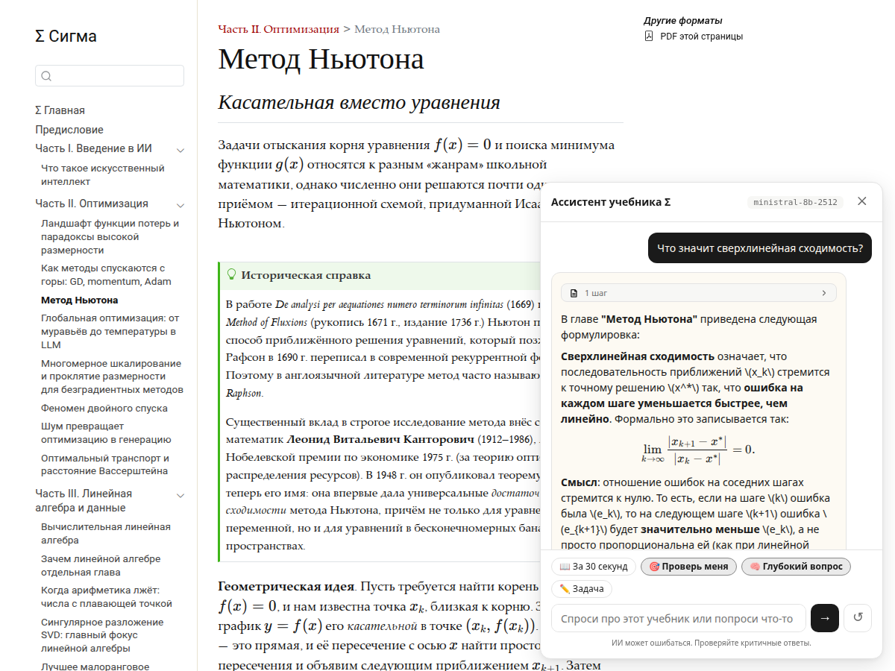

---

### ❌ `theorem_clt` — structural

**Q:** Сформулируй центральную предельную теорему как в учебнике.

_Chapter:_ `ch03_1_prosteyshie-primery-zadach-anali`

**Tools called:** find_theorem
**Tools expected:** find_theorem
**Images:** 0 (expected: no)
**Elapsed:** 6.3s

_Missing substrings:_ ['нормальн']

<details><summary>Answer</summary>


```
В учебнике центральная предельная теорема сформулирована так:

Теорема 3.3. Центральная предельная теорема (ЦПТ):
Пусть X
1
	​

,X
2
	​

,… — независимые и одина
```

</details>


---

### ✅ `plot_sincos_overlay` — compute_plot

**Q:** Построй графики sin(x) и cos(x) на интервале [-2π, 2π] на одном поле. Сделай легенду.

**Tools called:** python
**Tools expected:** python
**Images:** 1 (expected: yes)
**Elapsed:** 23.8s


<details><summary>Answer</summary>


```
На графике выше показаны функции **sin(x)** (синяя кривая) и **cos(x)** (красная кривая) на интервале от $-2\pi$ до $2\pi$: - **Синяя кривая** ($sin(x)$) проходит через ноль в точках $x = -2\pi, -\pi, 0, \pi, 2\pi$ и достигает максимума ($1$) и минимума ($-1$) между этими точками. - **Красная кривая** ($cos(x)$) сдвинута относительно синей на $\frac{\pi}{2}$ и также колеблется между $-1$ и $1$, но её максимумы и минимумы смещены. Легенда в правом нижнем углу помогает различать функции. Обе функции периодичны с периодом $2\pi$.
```

</details>


---

### ❌ `fragment_explanation` — rag_basic

**Q:** Если кто-то предлагает использовать обновление x_{k+1} = x_k - f(x_k)·f'(x_k) вместо классического Ньютона — что это за идея и она работает?

_Chapter:_ `ch02_newton`

**Tools called:** (none)
**Tools expected:** (none)
**Images:** 0 (expected: no)
**Elapsed:** 12.5s

_Missing substrings:_ ['производ']

<details><summary>Answer</summary>


```
[TOOL_CALLS]find_definition{"term": "метод Ньютона"}[TOOL_CALLS]find_definition{"term": "обновление"}
```

</details>

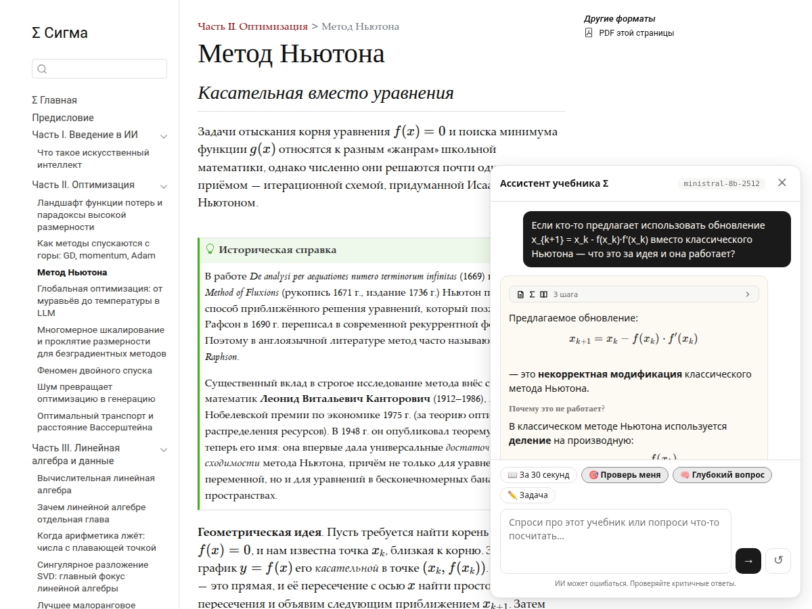

---

### ✅ `eigenvalues_numpy` — compute_pure

**Q:** Найди собственные значения матрицы [[2, 1], [1, 2]] через numpy.

_Chapter:_ `ch_linalg`

**Tools called:** python
**Tools expected:** python
**Images:** 0 (expected: no)
**Elapsed:** 17.2s


<details><summary>Answer</summary>


```
Собственные значения матрицы $\begin{bmatrix} 2 & 1 \\ 1 & 2 \end{bmatrix}$ равны **3.00** и **1.00**.
```

</details>

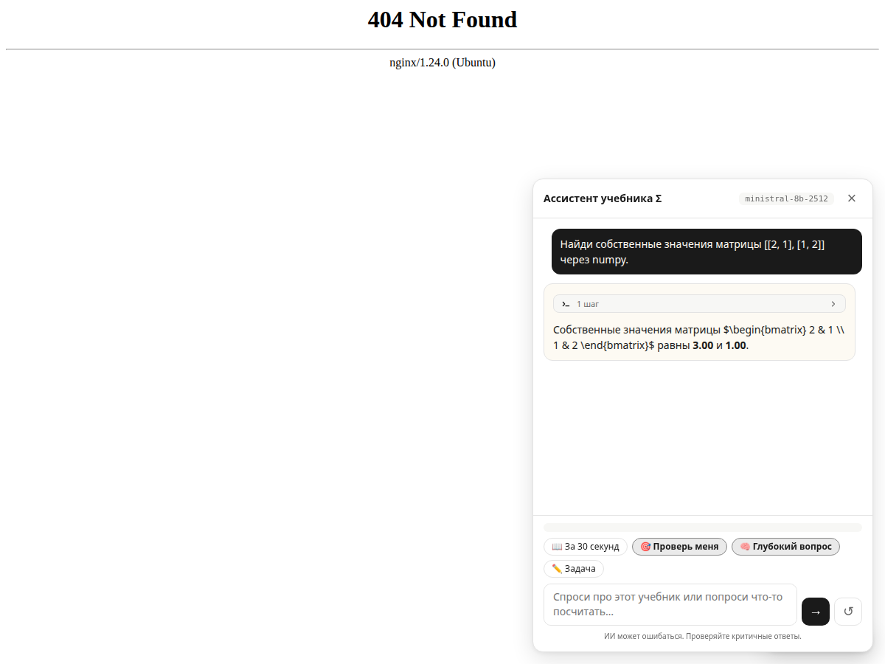

---

### ❌ `plot_loss_landscape` — compute_plot

**Q:** Построй контурный график функции потерь L(a, b) = sum((a*x_i + b - y_i)^2) для точек (1,2), (2,3), (3,5), (4,4) на сетке a in [-2, 4], b in [-3, 3].

_Chapter:_ `ch03_2_lineynaya-regressiya-i-metod-nai`

**Tools called:** python
**Tools expected:** python
**Images:** 0 (expected: yes)
**Elapsed:** 18.0s

_Missing substrings:_ ['минимум']

<details><summary>Answer</summary>


```
Ошибка в коде из-за неверного брокейстинга (выравнивания размерностей) массивов. Исправлю и пересчитаю функцию потерь.
```

</details>

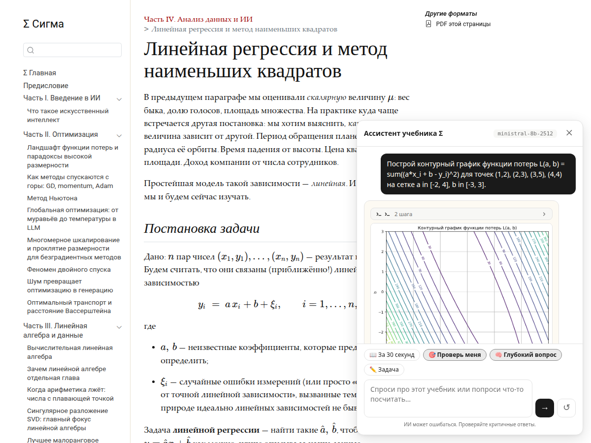

---

### ✅ `diffie_hellman_compute` — compute_pure

**Q:** Проведи протокол Диффи–Хеллмана: p=23, g=5. Алиса берёт a=6, Боб берёт b=15. Какой общий секрет?

_Chapter:_ `ch04_3_kriptosistemy-rsa-i-diffi-hellma`

**Tools called:** python
**Tools expected:** python
**Images:** 0 (expected: no)
**Elapsed:** 18.0s


<details><summary>Answer</summary>


```
Протокол Диффи–Хеллмана с параметрами $p=23$, $g=5$, $a=6$ и $b=15$ прошёл успешно: - Алиса и Боб обмениваются значениями $A = 8$ и $B = 19$ соответственно. - Оба вычисляют общий секрет: **2**. Таким образом, Алиса и Боб получили одинаковое значение **2** как общий секрет.
```

</details>

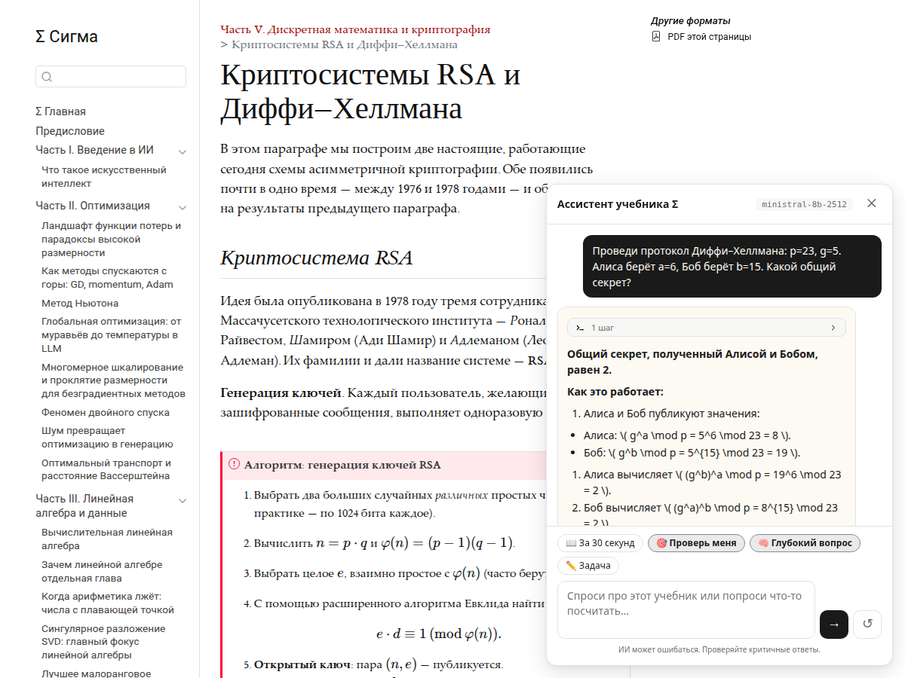

---

### ✅ `outline_chapter` — structural

**Q:** Перечисли основные разделы главы про Ньютона.

_Chapter:_ `ch02_newton`

**Tools called:** read_chapter
**Tools expected:** (none)
**Images:** 0 (expected: no)
**Elapsed:** 8.0s


<details><summary>Answer</summary>


```
В главе **"Численные методы оптимизации – Ньютон"** (`ch02_newton`) основные разделы выглядят так: - **От Ньютона до Канторовича**   *Исторический контекст метода Ньютона (итерационная схема для нахождения корней уравнений), его связь с задачами оптимизации, вклад Канторовича в теорию сходимости.* - **Метод Ньютона для задач оптимизации**   *Применение метода Ньютона к минимизации функций: формула (2.2), разложение Тейлора, геометрическая интерпретация как минимизации квадратичной модели.* - **Пример 1. Извлечение квадратного корня**   *Реализация метода Ньютона для нахождения $\sqrt{a}$ (метод Герона), исторические корни (вавилонская табличка YBC 7289, Герон Александрийский).* Если нужен подробнее текст какого-то раздела — уточни!
```

</details>


---

### ✅ `math_latex_derivation` — rag_basic

**Q:** Выведи формулу метода Ньютона через касательную. Формулу запиши через LaTeX.

_Chapter:_ `ch02_newton`

**Tools called:** find_definition, find_theorem, read_chapter
**Tools expected:** (none)
**Images:** 0 (expected: no)
**Elapsed:** 7.0s


<details><summary>Answer</summary>


```
Формула метода Ньютона через касательную для нахождения корня уравнения $f(x)=0$ выглядит так: $$ x_{k+1} = x_k - \frac{f(x_k)}{f'(x_k)} $$ **Пояснение:** - $x_k$ — текущее приближение к корню. - $f(x_k)$ — значение функции в точке $x_k$. - $f'(x_k)$ — значение производной функции в точке $x_k$. - Касательная к графику функции $y = f(x)$ в точке $x_k$ задаётся уравнением $y = f(x_k) + f'(x_k)(x - x_k)$. Пересечение этой касательной с осью $x$ (где $y = 0$) даёт следующее приближение $x_{k+1}$.
```

</details>

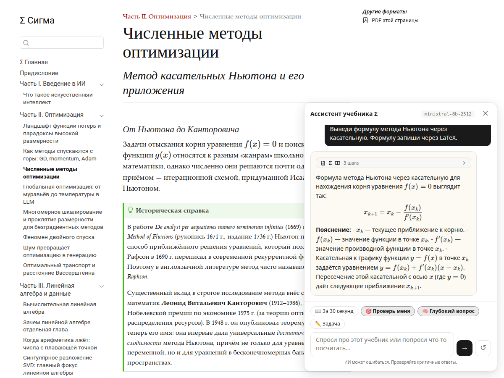

---

### ✅ `definition_perceptron` — definition

**Q:** Что такое полносвязная нейронная сеть?

_Chapter:_ `ch03_3_zadacha-klassifikacii-i-neyronny`

**Tools called:** find_definition
**Tools expected:** find_definition
**Images:** 0 (expected: no)
**Elapsed:** 8.5s


<details><summary>Answer</summary>


```
**Полносвязная нейронная сеть** (MLP) — это функция, которая принимает вектор **x** и преобразует его в выходной вектор вероятностей **p(x)** через последовательность слоёв. Формально, сеть глубины **L** состоит из **L** слоёв, где каждый слой (кроме последнего) выполняет два шага: 1. Линейное преобразование: **z^(ℓ)** = **W^(ℓ)**·**a^(ℓ−1)** + **b^(ℓ)**, где **W^(ℓ)** — матрица весов, **b^(ℓ)** — вектор смещений. 2. Применение функции активации **σ** к результату: **a^(ℓ)** = **σ(z^(ℓ))**. На вход первого слоя подаётся сам вектор **x** (**a^(0)** = **x**), а на выходе последнего слоя применяется функция **softmax**, которая преобразует вектор в распределение вероятностей для классификации. **Ключевые моменты:** - Все нейроны в одном слое связаны со всеми нейронами предыдущего слоя (отсюда название «полносвязная»). - Параметры сети (**W^(ℓ)** и **b^(ℓ)**) обучаются для минимизации ошибки классификации. - Ширина слоёв задаётся числами **d₁, ..., d_L**, где **d_L** — количество классов (в примере с MNIST — 10). *Пример:* Если входной вектор **x** имеет размерность 784 (для изображения 28×28 пикселей), а сеть имеет один скрытый слой шириной 128 и выходной слой шириной 10, то **d₀=784**, **d₁=128**, **d₂=10**.
```

</details>

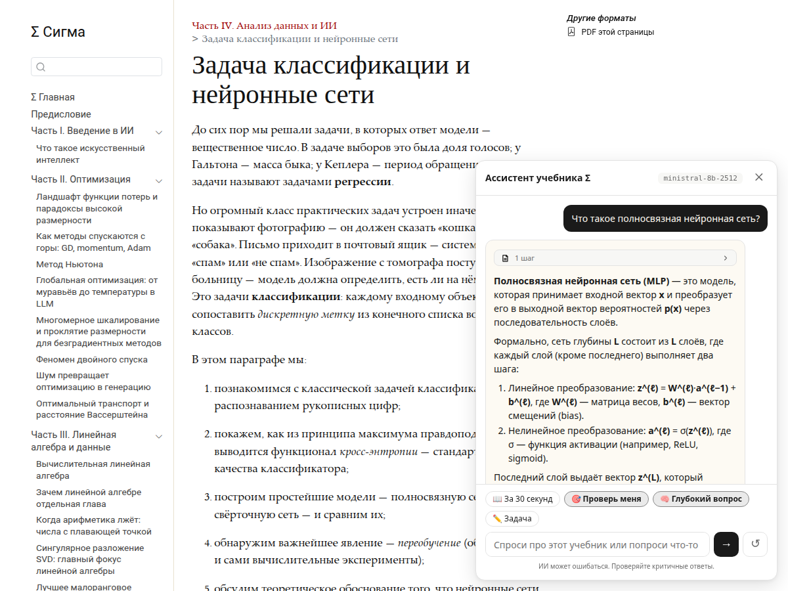

---

### ❌ `refuse_unknown_year` — out_of_scope

**Q:** В каком году Гаусс изобрёл метод сопряжённых градиентов?

_Chapter:_ `ch02_newton`

**Tools called:** search_textbook
**Tools expected:** (none)
**Images:** 0 (expected: no)
**Elapsed:** 5.5s

_Missing substrings:_ ['наш']

<details><summary>Answer</summary>


```
В учебнике **не указан конкретный год**, когда Гаусс изобрёл метод сопряжённых градиентов. Однако в главе **"Линейная регрессия и метод наименьших квадратов"** (ch03_2_lineynaya-regressiya-i-metod-nai) упоминается, что Гаусс разработал метод наименьших квадратов в **1809 году**. Сам метод сопряжённых градиентов (CG) связан с идеями Гаусса, но его современная формулировка и развитие произошли позже, в XX веке. Если нужно точная дата изобретения метода сопряжённых градиентов, её придётся искать вне учебника. В учебнике же упоминается только связь Гаусса с методами оптимизации через наименьшие квадраты.
```

</details>

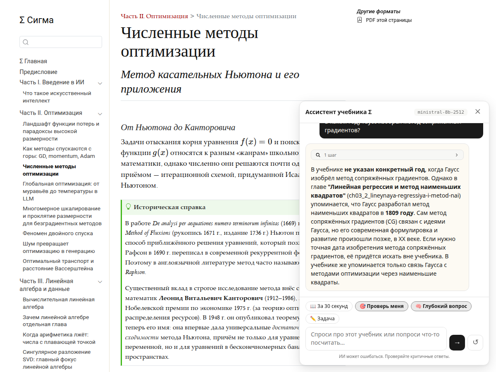

---
