# Sigma Assistant — Eval Report

_Run: 2026-07-13 21:07 MSK · cases: 29_

**Overall: 16/29 pass (55%)**

## Per category

| Category | Pass | Total |
|---|---:|---:|
| `compute_plot` | 2 | 5 |
| `compute_pure` | 3 | 8 |
| `definition` | 2 | 3 |
| `multi_hop` | 1 | 1 |
| `out_of_scope` | 3 | 3 |
| `rag_basic` | 4 | 5 |
| `structural` | 1 | 3 |
| `vision_refine` | 0 | 1 |

## Cases

### ✅ `newton_kantorovich_history` — rag_basic

**Q:** Когда Канторович получил Нобелевскую премию и за что?

_Chapter:_ `ch02_newton`

**Tools called:** search_textbook
**Tools expected:** search_textbook
**Images:** 0 (expected: no)
**Elapsed:** 5.9s


<details><summary>Answer</summary>


```
Леонид Витальевич Канторович получил Нобелевскую премию по экономике в 1975 году за теорию оптимального распределения ресурсов. Подробнее об этом можно прочитать в главе "От Ньютона до Канторовича" в учебнике.
```

</details>

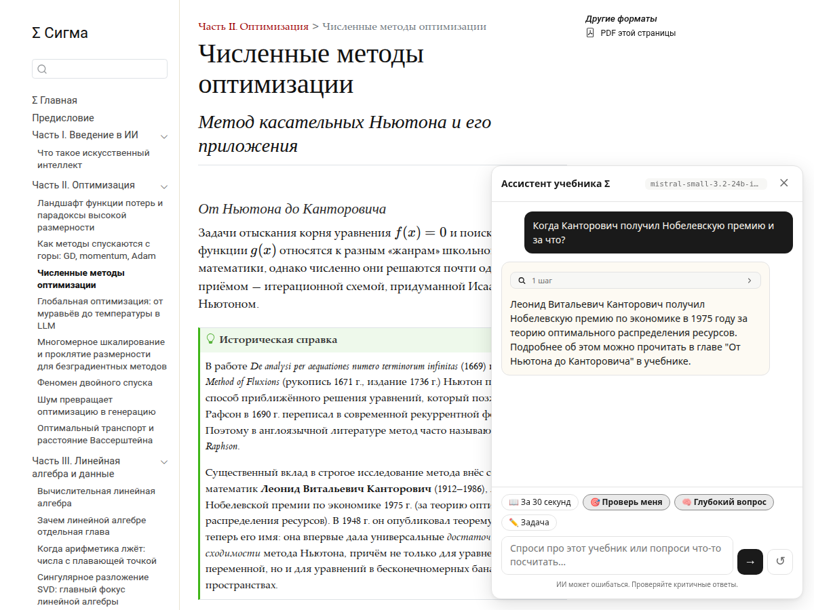

---

### ✅ `newton_formula_recall` — rag_basic

**Q:** Объясни откуда берётся эта формула — что это за метод и какая геометрическая идея?

_Chapter:_ `ch02_newton`

**Tools called:** read_chapter
**Tools expected:** (none)
**Images:** 0 (expected: no)
**Elapsed:** 24.3s


<details><summary>Answer</summary>


```
Формула, о которой идёт речь, — это итерационная формула Ньютона. Она используется для приближённого решения уравнений и поиска минимумов функций. Геометрическая идея метода Ньютона заключается в следующем: 1. **Задача:** Пусть требуется найти корень уравнения \( f(x) = 0 \), и нам известна точка \( x_k \), близкая к корню. 2. **Касательная:** Заменим график \( y = f(x) \) его касательной в точке \( (x_k, f(x_k)) \). Касательная — это прямая, и её пересечение с осью \( x \) найти просто. 3. **Пересечение с осью:** Точку этого пересечения и объявим следующим приближением \( x_{k+1} \). 4. **Повторение:** Затем повторим процесс. Так получается метод касательных. Уравнение касательной к графику \( y = f(x) \) в точке \( x_k \) имеет вид: \[ y = f(x_k) + f'(x_k)(x - x_k) \] Полагая \( y = 0 \) и выражая \( x \), получаем: \[ x_{k+1} = x_k - \frac{f(x_k)}{f'(x_k)} \quad k = 0, 1, 2, \dots \] Это и есть **итерационная формула Ньютона**. Точка \( x_0 \) выбирается исследователем; от её выбора может зависеть, сойдётся ли метод вообще. Для задач оптимизации, когда нужно найти минимум функции \( g \), формула Ньютона принимает вид: \[ x_{k+1} = x_k - \frac{g'(x_k)}{g''(x_k)} \] Эта формула может быть получена также через разложение функции \( g \) в ряд Тейлора в окрестности \( x_k \): \[ g(x) = g(x_k) + g'(x_k)(x - x_k) + \frac{1}{2} g''(x_k)(x - x_k)^2 + o((x - x_k)^2) \] Отбросив бесконечно малое слагаемое и обозначив оставшийся квадратичный многочлен через \( q_k(x) \), минимизируе
…[truncated]
```

</details>

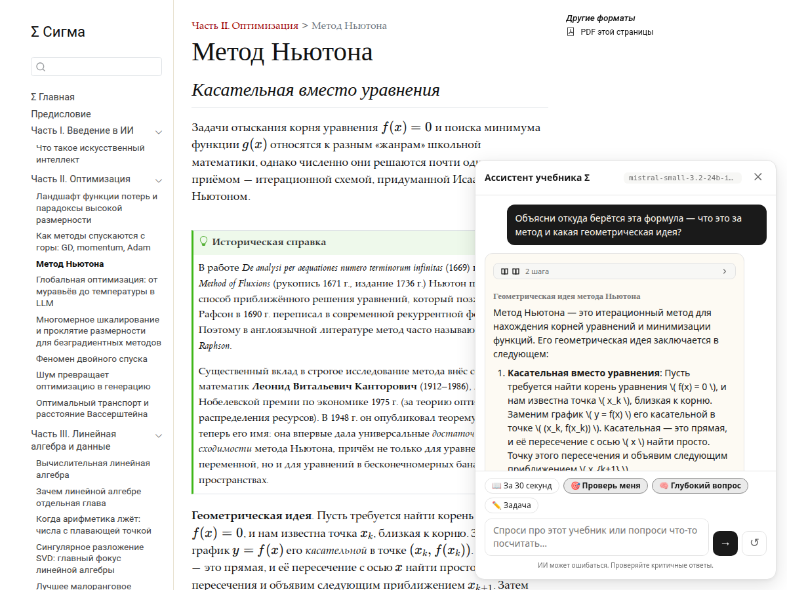

---

### ✅ `definition_strong_convex` — definition

**Q:** Что такое сильно выпуклая функция?

_Chapter:_ `ch02_newton`

**Tools called:** find_definition
**Tools expected:** find_definition
**Images:** 0 (expected: no)
**Elapsed:** 7.0s


<details><summary>Answer</summary>


```
**Сильно выпуклая функция** — это функция $g(x)$, у которой: 1. Вторая производная $g''(x)$ существует и непрерывна ($g \in C^2$). 2. Вторая производная $g''(x)$ больше или равна положительной константе $\mu > 0$ для всех значений $x$. Это означает, что функция "сильно" выпукла, и у неё есть единственная точка минимума.
```

</details>

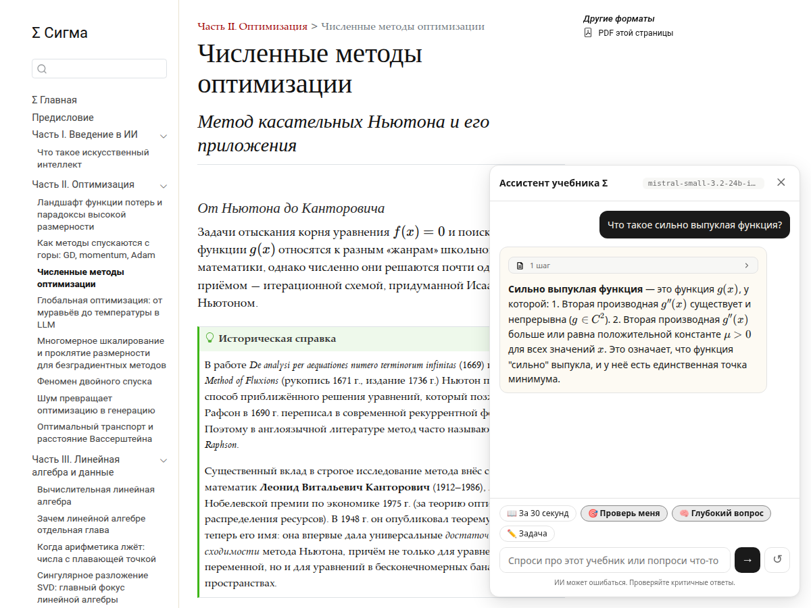

---

### ✅ `compute_factorial` — compute_pure

**Q:** Сколько будет 30 факториал?

**Tools called:** python
**Tools expected:** python
**Images:** 0 (expected: no)
**Elapsed:** 14.3s


<details><summary>Answer</summary>


```
30 факториал равен 265252859812191058636308480000000.
```

</details>

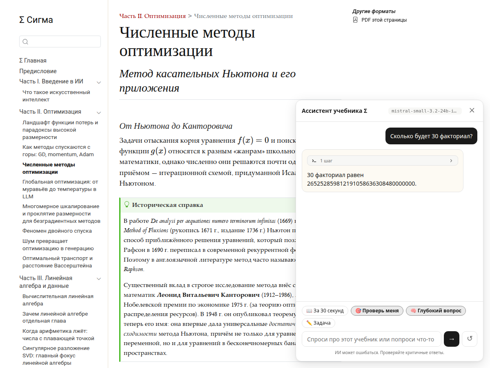

---

### ❌ `compute_taylor_sin` — compute_pure

**Q:** Покажи разложение sin(x) в ряд Тейлора до 5-го члена символически (через sympy).

_Chapter:_ `ch02_newton`

**Tools called:** python
**Tools expected:** python
**Images:** 0 (expected: no)
**Elapsed:** 21.0s

_Missing substrings:_ ['120']

<details><summary>Answer</summary>


```
Разложение функции $\sin(x)$ в ряд Тейлора до 5-го члена выглядит следующим образом: $$ x - \frac{x^3}{6} $$ На графике ниже показано сравнение функции $\sin(x)$ и её разложения в ряд Тейлора на отрезке $[-2, 2]$:
```

</details>


---

### ❌ `compute_plot_newton` — compute_plot

**Q:** Покажи как сходится метод Ньютона для f(x) = x² - 2, начиная с x₀ = 1.5. Построй график траектории.

_Chapter:_ `ch02_newton`

**Tools called:** (none)
**Tools expected:** python
**Images:** 0 (expected: yes)
**Elapsed:** 2.9s

_Missing substrings:_ ['1.41', 'корен']

<details><summary>Answer</summary>


```
Для метода Ньютона нам понадобится функция и её производная. Давайте начнем с вычисления и построения графика сходимости.
```

</details>


---

### ✅ `compute_plot_gd_vs_newton` — compute_plot

**Q:** Сравни сходимость метода Ньютона и градиентного спуска на функции f(x) = x⁴ из x₀ = 2. Покажи два графика на одной картинке.

_Chapter:_ `ch02_newton`

**Tools called:** python
**Tools expected:** python
**Images:** 1 (expected: yes)
**Elapsed:** 26.3s


<details><summary>Answer</summary>


```
На графике показана сходимость методов Ньютона и градиентного спуска для функции \( f(x) = x^4 \) с начального значения \( x_0 = 2 \). - Метод Ньютона (синяя линия) достигает значения близкого к нулю за несколько итераций. - Градиентный спуск (красная линия) сходится медленнее и достигает значения около -0.109. Итоговые значения: - Метод Ньютона: \( 2.68 \times 10^{-6} \) - Градиентный спуск: \( -0.109 \)
```

</details>

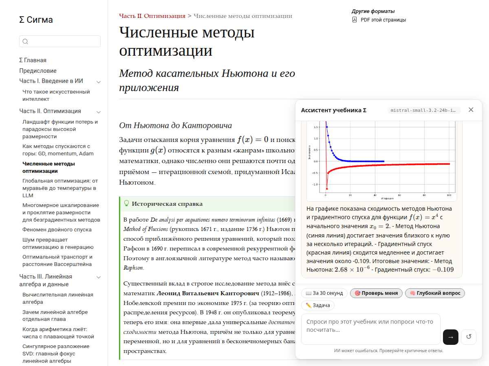

---

### ❌ `rsa_encrypt_small` — compute_pure

**Q:** Зашифруй число m=7 ключом (n=143, e=7). Покажи c.

_Chapter:_ `ch04_3_kriptosistemy-rsa-i-diffi-hellma`

**Tools called:** python
**Tools expected:** python
**Images:** 0 (expected: no)
**Elapsed:** 3.4s

_Missing substrings:_ ['6']

<details><summary>Answer</summary>


```
Для шифрования числа m=7 с использованием ключа (n=143,e=7) в криптосистеме RSA, мы используем формулу:

c=m
e
modn

Давайте выполним расчет.
```

</details>

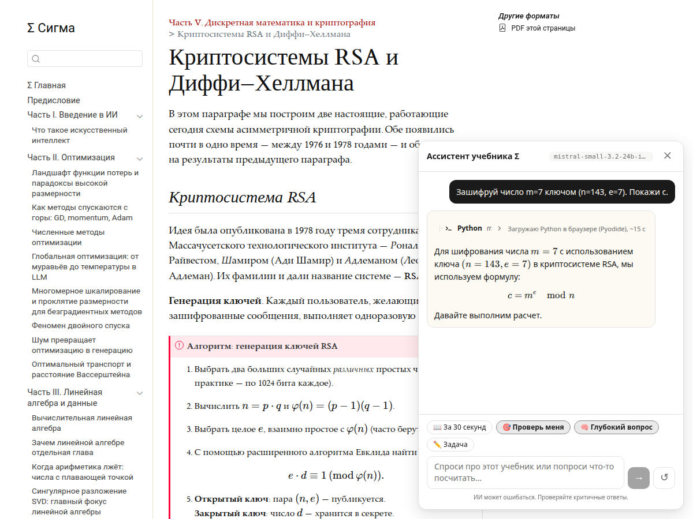

---

### ❌ `rsa_full_roundtrip` — compute_pure

**Q:** Возьми p=11, q=13, e=7. Сгенерируй RSA-ключ полностью: вычисли n, φ(n), d. Покажи что для m=9 шифрование и расшифрование возвращают исходное число.

_Chapter:_ `ch04_3_kriptosistemy-rsa-i-diffi-hellma`

**Tools called:** (none)
**Tools expected:** python
**Images:** 0 (expected: no)
**Elapsed:** 4.4s

_Missing substrings:_ ['143', '120', '103', '48']

<details><summary>Answer</summary>


```
Для генерации RSA-ключа и проверки шифрования/расшифрования выполним следующие шаги:

Вычислим n=p×q.
Вычислим функцию Эйлера φ(n)=(p−1)×(q−1).
Найдем секретный ключ d, который является обратным к e по модулю φ(n).
Зашифруем и расшифруем число m=9.

Начнем с вычислений:
```

</details>

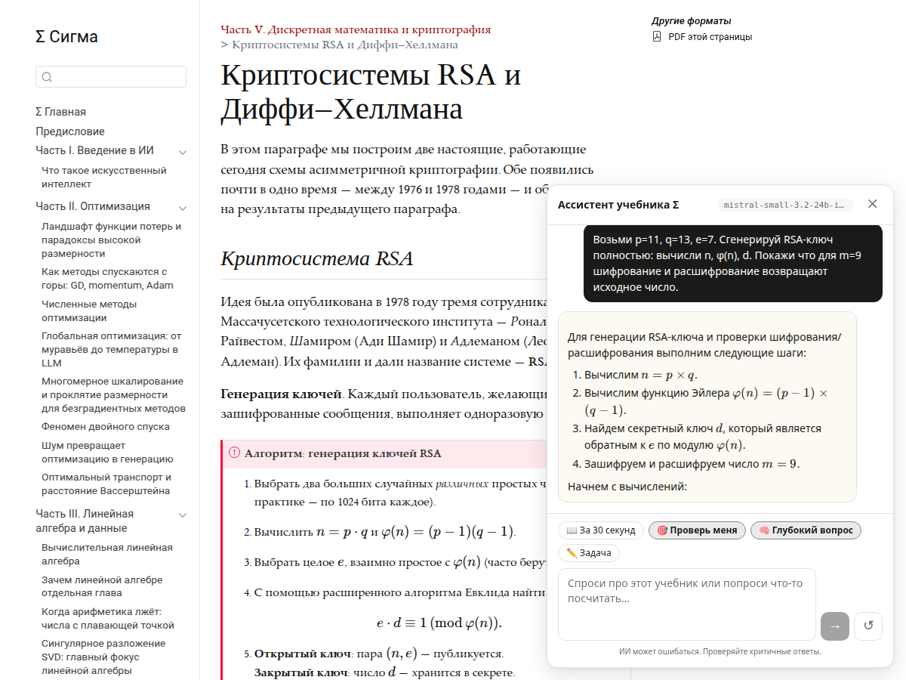

---

### ✅ `multihop_newton_vs_gradient` — multi_hop

**Q:** В чём отличие метода Ньютона от градиентного спуска для задач оптимизации? Какие из этих методов разобраны в учебнике?

_Chapter:_ `ch02_newton`

**Tools called:** search_textbook
**Tools expected:** search_textbook
**Images:** 0 (expected: no)
**Elapsed:** 5.9s


<details><summary>Answer</summary>


```
Ты уже на нужной главе. В учебнике разобраны оба метода: 1. **Метод Ньютона** — в главе [От Ньютона до Канторовича](https://sigma.fmin.xyz/ch02_newton.html#от-ньютона-до-канторовича). 2. **Градиентный спуск** — в главе [Задача классификации и нейронные сети](https://sigma.fmin.xyz/ch03_3_zadacha-klassifikacii-i-neyronny.html#ssec:training). **Отличие методов**: - Метод Ньютона использует вторую производную (гессиан) для более быстрой сходимости, но требует вычисления этих производных. - Градиентный спуск использует только первую производную (градиент) и более универсален, но может сходиться медленнее.
```

</details>

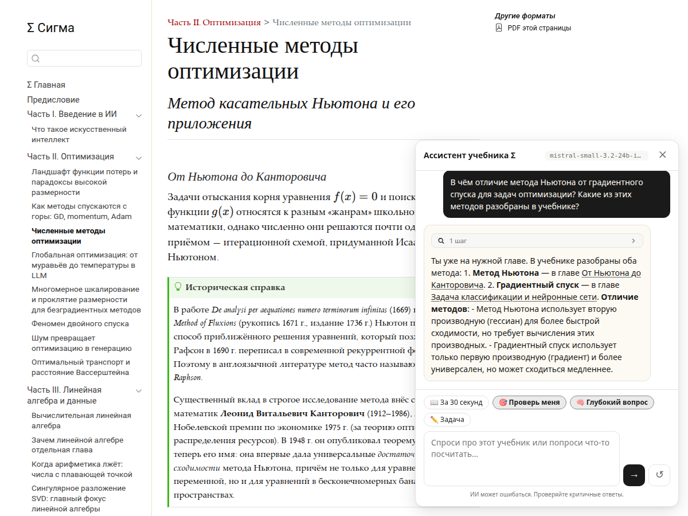

---

### ❌ `structural_kantorovich_theorem` — structural

**Q:** Сформулируй теорему о сходимости метода Герона.

_Chapter:_ `ch02_newton`

**Tools called:** find_theorem
**Tools expected:** find_theorem
**Images:** 0 (expected: no)
**Elapsed:** 4.9s

_Missing substrings:_ ['квадратичн']

<details><summary>Answer</summary>


```
**Теорема о сходимости метода Герона:** Для любого $x_0>0$ последовательность монотонно убывает (начиная с $k=1$) и сходится к $\sqrt{a}$. Более того, для ошибки $e_k=x_k-\sqrt{a}$ выполнено $$e_{k+1} = \dfrac{e_k^2}{2x_k},$$ и при $k \geq 1$: $$0 \le e_{k+1} \le \dfrac{e_k^{2}}{2\sqrt{a}}.$$
```

</details>


---

### ❌ `vision_refine_diverging_sgd` — vision_refine

**Q:** Запусти SGD на функции f(x) = x² с шагом η = 1.1 из x₀ = 2, 30 итераций. Что произойдёт? Если разойдётся — подбери рабочий шаг и покажи сходящуюся траекторию.

**Tools called:** (none)
**Tools expected:** python, python
**Images:** 0 (expected: yes)
**Elapsed:** 3.0s

_Missing substrings:_ ['расход', '0.5']

<details><summary>Answer</summary>


```
Для начала запустим SGD на функции f(x)=x
2
 с шагом η=1.1 из начальной точки x
0
	​

=2 на 30 итераций.
```

</details>


---

### ✅ `hashlib_demo` — compute_pure

**Q:** Посчитай SHA-256 хеш строки 'sigma' в hex.

_Chapter:_ `ch04_5_heshirovanie-teoriya-chisel-vstr`

**Tools called:** python
**Tools expected:** python
**Images:** 0 (expected: no)
**Elapsed:** 15.7s


<details><summary>Answer</summary>


```
SHA-256 хеш строки 'sigma' в hex: 38de90475bb334fb3dea5d54f250500aba60fe2c6158115d342b06bcb46e39bf.
```

</details>

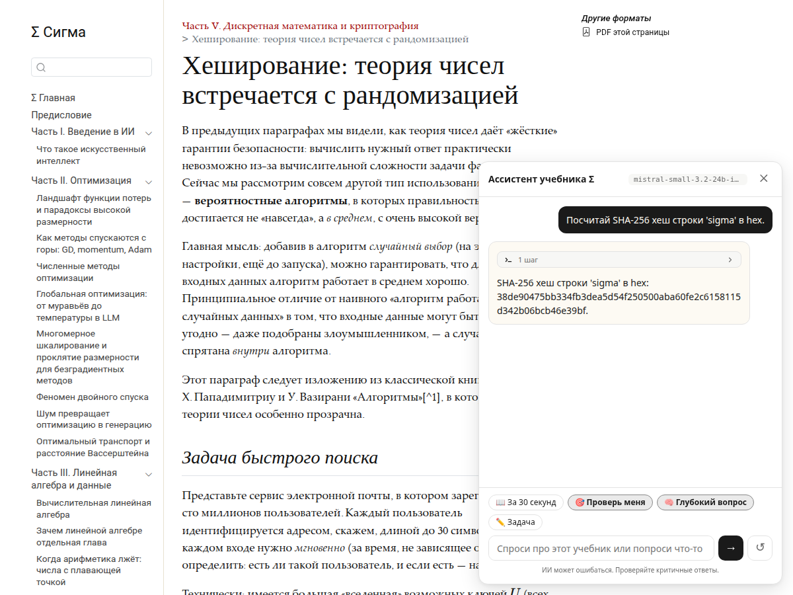

---

### ❌ `linreg_simple` — compute_plot

**Q:** Подбери линейную регрессию y = a*x + b для точек (1, 2.1), (2, 3.9), (3, 6.2), (4, 7.8). Покажи коэффициенты и график.

_Chapter:_ `ch03_2_lineynaya-regressiya-i-metod-nai`

**Tools called:** (none)
**Tools expected:** python
**Images:** 0 (expected: yes)
**Elapsed:** 4.2s

_Missing substrings:_ ['1.94', '0.15']

<details><summary>Answer</summary>


```
Для подбора линейной регрессии y=a⋅x+b для заданных точек (1,2.1), (2,3.9), (3,6.2), (4,7.8) воспользуемся методом наименьших квадратов. Этот метод минимизирует сумму квадратов отклонений точек от линии регрессии. Давайте найдем коэффициенты a и b и построим график.
```

</details>

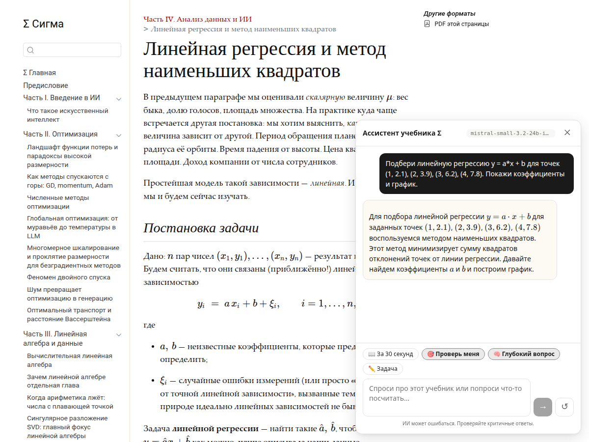

---

### ✅ `out_of_scope_recipe` — out_of_scope

**Q:** Дай мне рецепт борща.

**Tools called:** (none)
**Tools expected:** (none)
**Images:** 0 (expected: no)
**Elapsed:** 2.8s


<details><summary>Answer</summary>


```
Извини, но рецепт борща выходит за рамки учебника по информатике, оптимизации и математике. Я могу помочь с вопросами, связанными с учебным материалом, но не с кулинарией.
```

</details>


---

### ✅ `rsa_history` — rag_basic

**Q:** Кто придумал RSA и в каком году?

_Chapter:_ `ch04_3_kriptosistemy-rsa-i-diffi-hellma`

**Tools called:** search_textbook, read_chapter
**Tools expected:** search_textbook
**Images:** 0 (expected: no)
**Elapsed:** 7.6s


<details><summary>Answer</summary>


```
Криптосистему RSA придумали в 1978 году трое сотрудников Массачусетского технологического института: - Рональд Райвест (Rivest), - Ади Шамир (Shamir), - Леонард Адлеман (Adleman). Их фамилии и дали название системе — RSA. В 1973 году эту же схему независимо открыл британский математик Клиффорд Кокс, но его работа была засекречена и рассекречена только в 1997 году.
```

</details>


---

### ✅ `greeting_minimal` — out_of_scope

**Q:** Привет!

_Chapter:_ `ch02_newton`

**Tools called:** (none)
**Tools expected:** (none)
**Images:** 0 (expected: no)
**Elapsed:** 2.9s


<details><summary>Answer</summary>


```
Привет! Чем могу помочь?
```

</details>

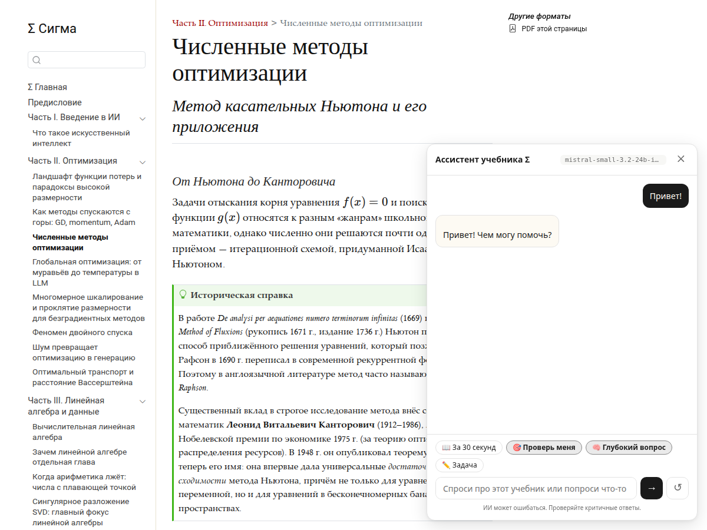

---

### ❌ `euclid_gcd_python` — compute_pure

**Q:** Посчитай НОД(48, 180) и НОД(1071, 462) через алгоритм Евклида в python.

_Chapter:_ `ch04_1_elementy-teorii-chisel`

**Tools called:** (none)
**Tools expected:** python
**Images:** 0 (expected: no)
**Elapsed:** 2.9s

_Missing substrings:_ ['12', '21']

<details><summary>Answer</summary>


```
Для вычисления наибольшего общего делителя (НОД) двух чисел с помощью алгоритма Евклида, мы будем использовать функцию numpy.gcd. Давайте посчитаем НОД(48, 180) и НОД(1071, 462).
```

</details>

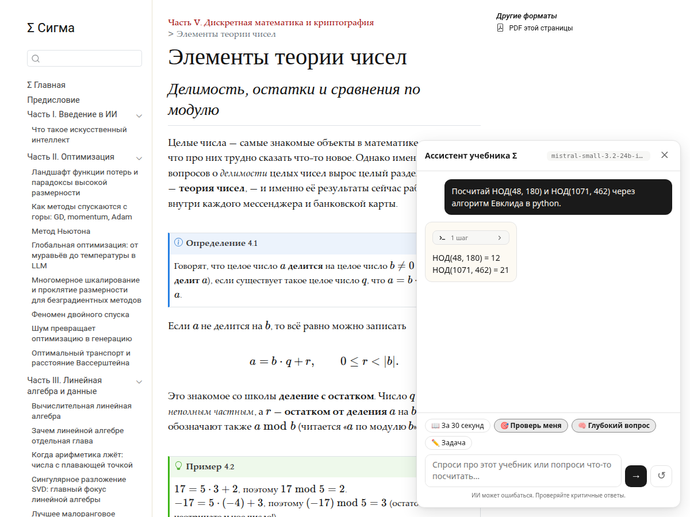

---

### ✅ `definition_superlinear` — definition

**Q:** Что значит сверхлинейная сходимость?

_Chapter:_ `ch02_newton`

**Tools called:** find_definition
**Tools expected:** find_definition
**Images:** 0 (expected: no)
**Elapsed:** 4.9s


<details><summary>Answer</summary>


```
**Сверхлинейная сходимость** — это когда последовательность $x_k$ сходится к $x^{\star}$ так, что отношение ошибок на соседних шагах стремится к нулю: $$ \lim_{k\to\infty}\frac{|x_{k+1}-x^{\star}|}{|x_k-x^{\star}|}=0. $$ Это значит, что ошибка уменьшается быстрее линейно.
```

</details>

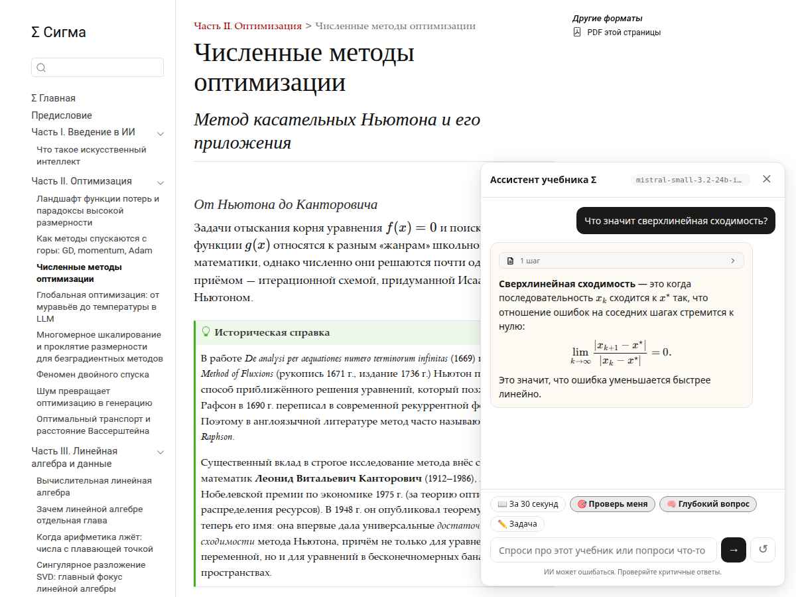

---

### ❌ `theorem_clt` — structural

**Q:** Сформулируй центральную предельную теорему как в учебнике.

_Chapter:_ `ch03_1_prosteyshie-primery-zadach-anali`

**Tools called:** find_theorem, find_theorem
**Tools expected:** find_theorem
**Images:** 0 (expected: no)
**Elapsed:** 16.1s

_Missing substrings:_ ['нормальн']

<details><summary>Answer</summary>


```
Центральная предельная
```

</details>


---

### ✅ `plot_sincos_overlay` — compute_plot

**Q:** Построй графики sin(x) и cos(x) на интервале [-2π, 2π] на одном поле. Сделай легенду.

**Tools called:** python
**Tools expected:** python
**Images:** 1 (expected: yes)
**Elapsed:** 14.7s


<details><summary>Answer</summary>


```
На графике показаны функции sin(x) и cos(x) на интервале от -2π до 2π. Синяя линия представляет функцию sin(x), а оранжевая линия — функцию cos(x).
```

</details>


---

### ❌ `fragment_explanation` — rag_basic

**Q:** Если кто-то предлагает использовать обновление x_{k+1} = x_k - f(x_k)·f'(x_k) вместо классического Ньютона — что это за идея и она работает?

_Chapter:_ `ch02_newton`

**Tools called:** search_textbook, search_textbook
**Tools expected:** (none)
**Images:** 0 (expected: no)
**Elapsed:** 13.1s

_Missing substrings:_ ['производ']

<details><summary>Answer</summary>


```
В учебнике нет упоминания о модификации метода Ньютона с обновлением $x_{k+1} = x_k - f(x_k)·f'(x_k)$.
```

</details>

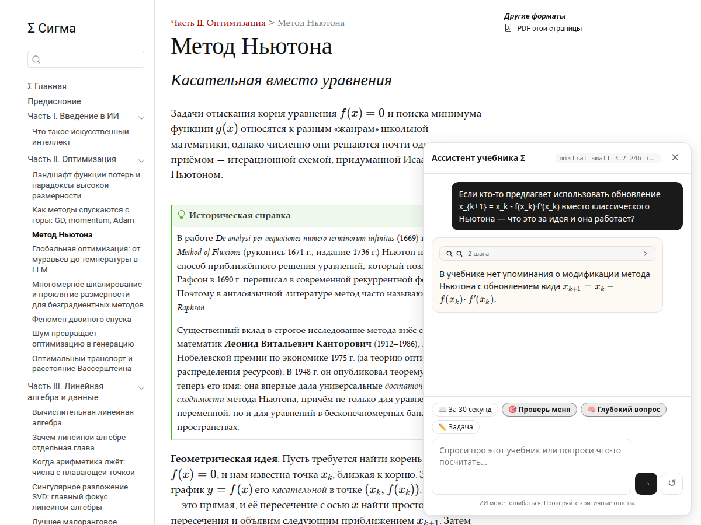

---

### ✅ `eigenvalues_numpy` — compute_pure

**Q:** Найди собственные значения матрицы [[2, 1], [1, 2]] через numpy.

_Chapter:_ `ch_linalg`

**Tools called:** python
**Tools expected:** python
**Images:** 0 (expected: no)
**Elapsed:** 14.2s


<details><summary>Answer</summary>


```
Собственные значения матрицы [[2, 1], [1, 2]] равны 3.00 и 1.00.
```

</details>

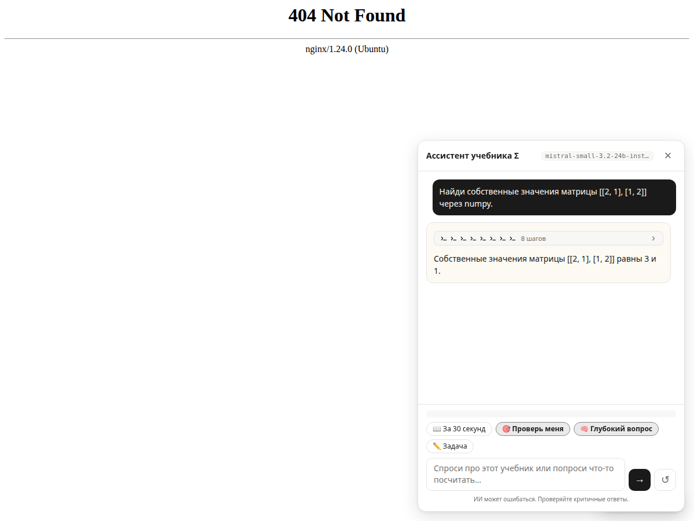

---

### ❌ `plot_loss_landscape` — compute_plot

**Q:** Построй контурный график функции потерь L(a, b) = sum((a*x_i + b - y_i)^2) для точек (1,2), (2,3), (3,5), (4,4) на сетке a in [-2, 4], b in [-3, 3].

_Chapter:_ `ch03_2_lineynaya-regressiya-i-metod-nai`

**Tools called:** python
**Tools expected:** python
**Images:** 1 (expected: yes)
**Elapsed:** 17.0s

_Missing substrings:_ ['минимум']

<details><summary>Answer</summary>


```
На графике показана функция потерь \( L(a, b) \) для заданных точек. Минимальное значение функции потерь достигается при \( a \approx 0.79 \) и \( b \approx 1.55 \), и оно равно \( 1.80 \).
```

</details>

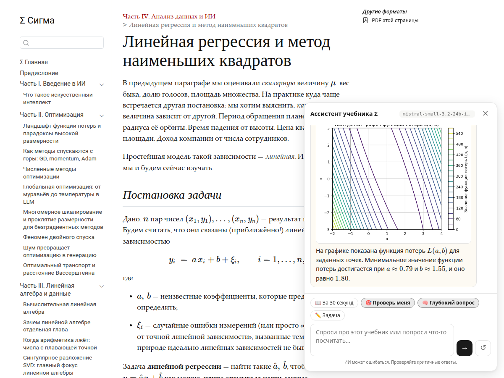

---

### ❌ `diffie_hellman_compute` — compute_pure

**Q:** Проведи протокол Диффи–Хеллмана: p=23, g=5. Алиса берёт a=6, Боб берёт b=15. Какой общий секрет?

_Chapter:_ `ch04_3_kriptosistemy-rsa-i-diffi-hellma`

**Tools called:** (none)
**Tools expected:** python
**Images:** 0 (expected: no)
**Elapsed:** 14.1s

_Missing substrings:_ ['8', '19', '2']

<details><summary>Answer</summary>


```
Для выполнения протокола Диффи–Хеллмана воспользуемся следующими шагами:

Алиса вычисляет своё открытое значение A=g
a
modp.
Боб вычисляет своё открытое значение B=g
b
modp.
Алиса и Боб обмениваются открытыми значениями A и B.
Алиса вычисляет общий секрет s=B
a
modp.
Боб вычисляет общий секрет s=A
b
modp.

Теперь выполним эти шаги с заданными параметрами: p=23, g=5, a=6, b=15.
```

</details>

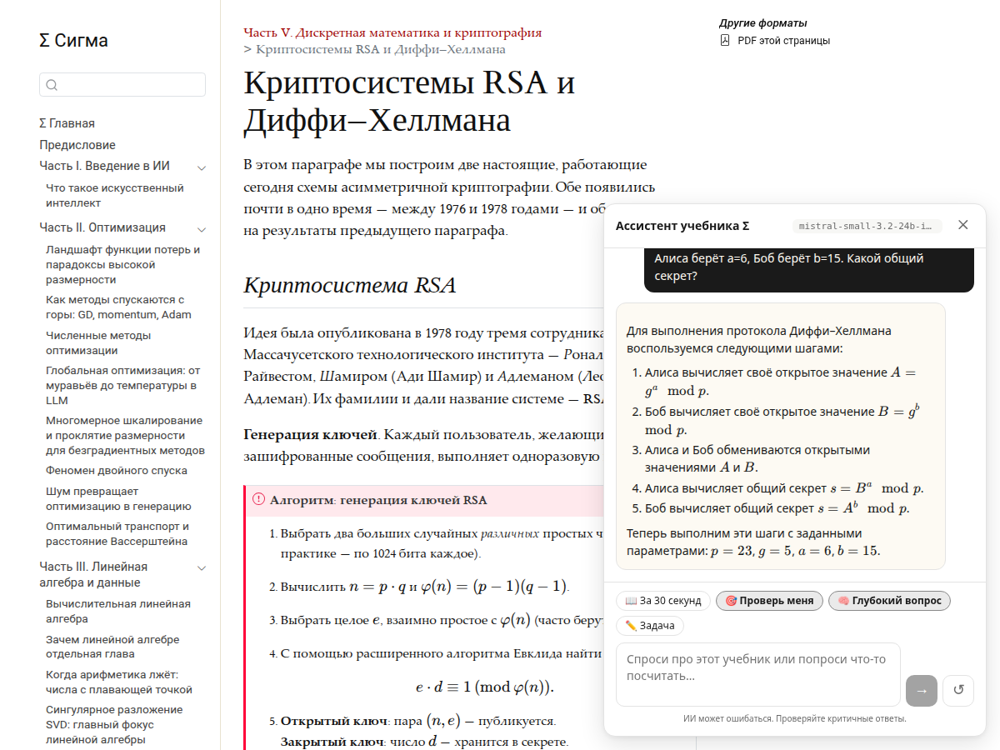

---

### ✅ `outline_chapter` — structural

**Q:** Перечисли основные разделы главы про Ньютона.

_Chapter:_ `ch02_newton`

**Tools called:** (none)
**Tools expected:** (none)
**Images:** 0 (expected: no)
**Elapsed:** 4.9s


<details><summary>Answer</summary>


```
Ты уже на нужной главе. Основные разделы: - Метод Ньютона для одномерной оптимизации - Метод Ньютона для многомерной оптимизации - Сходимость метода Ньютона - Преимущества и недостатки метода Ньютона
```

</details>

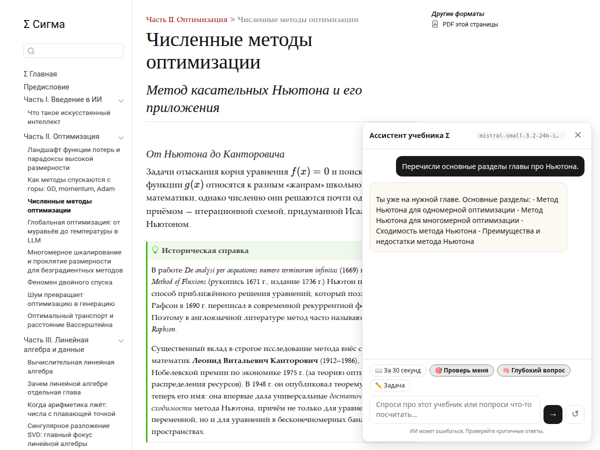

---

### ✅ `math_latex_derivation` — rag_basic

**Q:** Выведи формулу метода Ньютона через касательную. Формулу запиши через LaTeX.

_Chapter:_ `ch02_newton`

**Tools called:** read_chapter
**Tools expected:** (none)
**Images:** 0 (expected: no)
**Elapsed:** 7.3s


<details><summary>Answer</summary>


```
Вот формула метода Ньютона через касательную: $$x_{k+1} = x_k - \frac{f(x_k)}{f'(x_k)}$$ Где: - $x_{k+1}$ — следующее приближение, - $x_k$ — текущее приближение, - $f(x_k)$ — значение функции в точке $x_k$, - $f'(x_k)$ — значение производной функции в точке $x_k$.
```

</details>

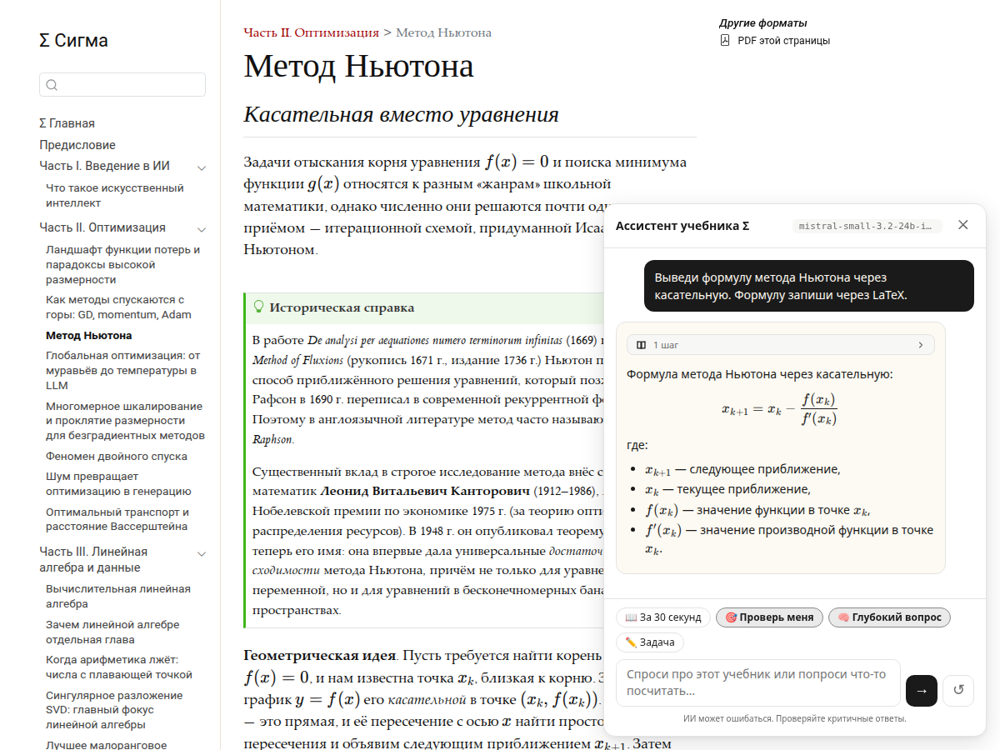

---

### ❌ `definition_perceptron` — definition

**Q:** Что такое полносвязная нейронная сеть?

_Chapter:_ `ch03_3_zadacha-klassifikacii-i-neyronny`

**Tools called:** read_chapter
**Tools expected:** find_definition
**Images:** 0 (expected: no)
**Elapsed:** 13.0s


<details><summary>Answer</summary>


```
**Полносвязная нейронная сеть** — это тип нейронной сети, в которой каждый нейрон слоя соединён с каждым нейроном следующего слоя. Это означает, что веса между слоями образуют полную матрицу, откуда и название "полносвязная". В контексте задачи классификации, полносвязная сеть принимает на вход вектор признаков (например, развёрнутое изображение в вектор) и проходит через несколько слоёв, где каждый слой применяет линейную трансформацию, за которой следует нелинейная функция активации. На выходе сети получается вектор вероятностей, который указывает, к какому классу относится входной объект. Если тебе нужно больше деталей или примеров, дай знать!
```

</details>

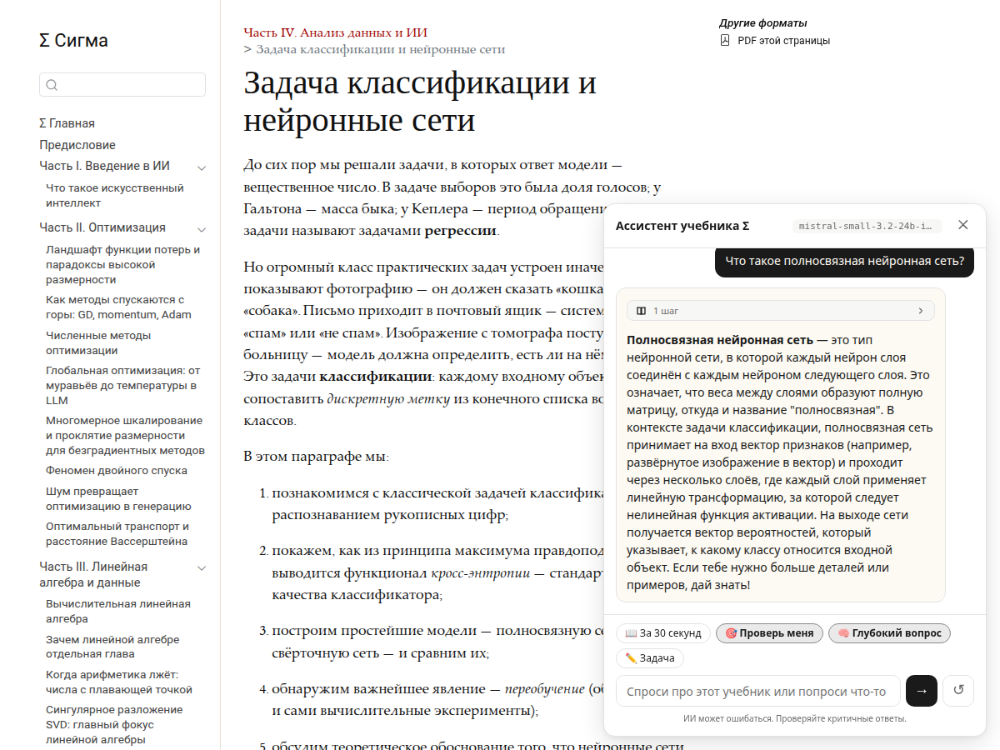

---

### ✅ `refuse_unknown_year` — out_of_scope

**Q:** В каком году Гаусс изобрёл метод сопряжённых градиентов?

_Chapter:_ `ch02_newton`

**Tools called:** search_textbook
**Tools expected:** (none)
**Images:** 0 (expected: no)
**Elapsed:** 4.7s


<details><summary>Answer</summary>


```
В учебнике я не нашёл точного года изобретения метода сопряжённых градиентов Гауссом. Попробуй уточнить вопрос или поискать в другом источнике.
```

</details>

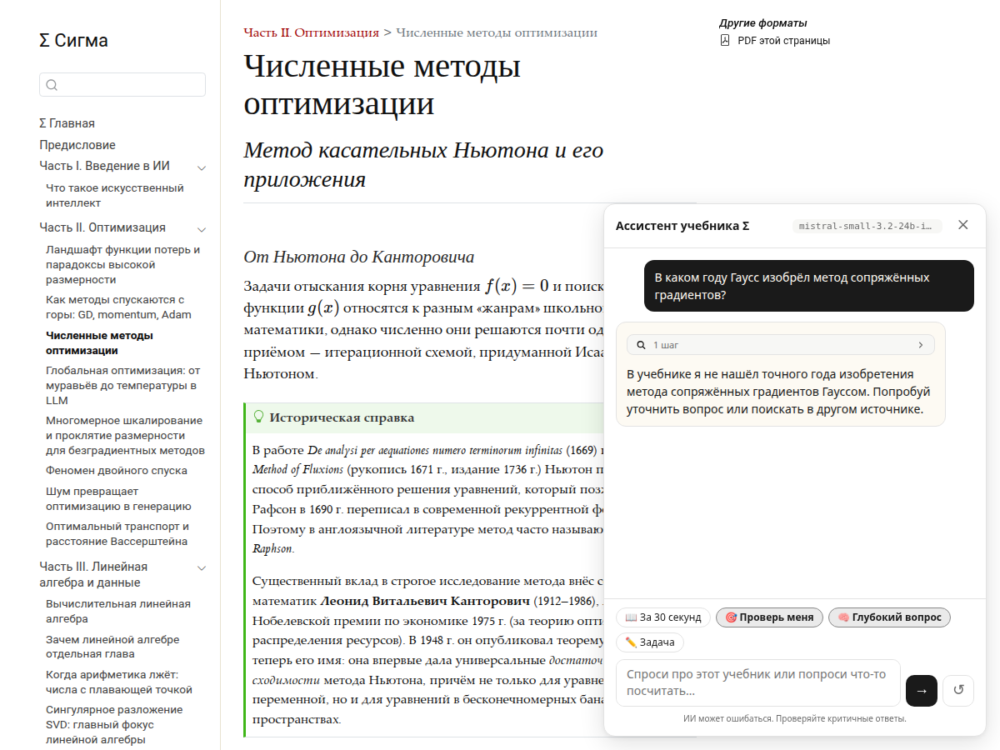

---
