# Sigma Assistant — Eval Report

_Run: 2026-07-13 21:43 MSK · cases: 29_

**Overall: 22/29 pass (76%)**

## Per category

| Category | Pass | Total |
|---|---:|---:|
| `compute_plot` | 3 | 5 |
| `compute_pure` | 7 | 8 |
| `definition` | 3 | 3 |
| `multi_hop` | 1 | 1 |
| `out_of_scope` | 3 | 3 |
| `rag_basic` | 3 | 5 |
| `structural` | 2 | 3 |
| `vision_refine` | 0 | 1 |

## Cases

### ✅ `newton_kantorovich_history` — rag_basic

**Q:** Когда Канторович получил Нобелевскую премию и за что?

_Chapter:_ `ch02_newton`

**Tools called:** search_textbook
**Tools expected:** search_textbook
**Images:** 0 (expected: no)
**Elapsed:** 19.0s


<details><summary>Answer</summary>


```
**Леонид Витальевич Канторович** получил Нобелевскую премию по экономике в **1975 году** — за теорию оптимального распределения ресурсов. Кстати, ты как раз читаешь главу, где он упоминается: помимо экономики, он внёс огромный вклад в математику — в 1948 году доказал знаменитую теорему о сходимости метода Ньютона, которая работает даже в бесконечномерных пространствах.
```

</details>

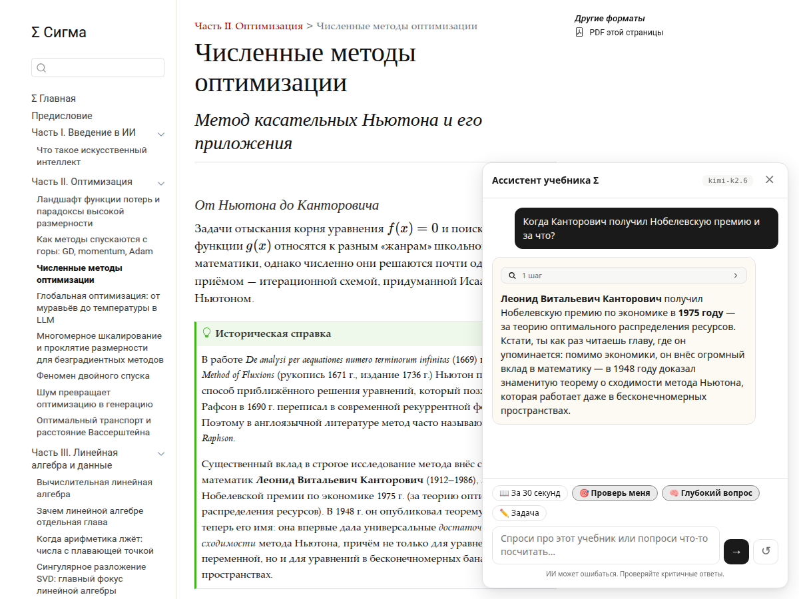

---

### ✅ `newton_formula_recall` — rag_basic

**Q:** Объясни откуда берётся эта формула — что это за метод и какая геометрическая идея?

_Chapter:_ `ch02_newton`

**Tools called:** read_chapter
**Tools expected:** (none)
**Images:** 0 (expected: no)
**Elapsed:** 76.1s


<details><summary>Answer</summary>


```
Это метод касательных Ньютона (в англоязычной литературе часто Newton–Raphson). Он решает две близкие задачи: находит корень уравнения f(x)=0 и ищет минимум функции g(x). Обе версии работают по одной и той же идее — локально заменяют сложную функцию простой.

Геометрическая идея для корня. Представь график y=f(x). Мы стоим в точке x
k
	​

 и хотим найти, где график пересекает ось x. Вместо того чтобы искать пересечение самой кривой, мы строим касательную к графику в точке (x
k
	​

,f(x
k
	​

)). Касательная — прямая, и её пересечение с осью x найти легко. Эту точку пересечения и берём за следующее приближение x
k+1
	​

.

Уравнение касательной такое:

y=f(x
k
	​

)+f
′
(x
k
	​

)(x−x
k
	​

)

где f
′
(x
k
	​

) — производная в текущей точке (угловой коэффициент прямой).

Чтобы найти пересечение с осью x, полагаем y=0 и реша
```

</details>


---

### ✅ `definition_strong_convex` — definition

**Q:** Что такое сильно выпуклая функция?

_Chapter:_ `ch02_newton`

**Tools called:** find_definition
**Tools expected:** find_definition
**Images:** 0 (expected: no)
**Elapsed:** 68.2s


<details><summary>Answer</summary>


```
**Сильно выпуклая функция** — это функция, у которой вторая производная отделена от нуля положительной константой. Вот точное определение из учебника ([Определение 2.4](/ch02_newton.html#ssec:thm-superlinear)): > Функция $g\colon\mathbb{R}\to\mathbb{R}$ называется **сильно выпуклой** с константой $\mu>0$, если $g\in C^{2}$ и $g''(x)\geq\mu$ для всех $x$. **Расшифровка:** - **$g\in C^{2}$** — функция дважды непрерывно дифференцируема, то есть у неё есть первая и вторая производные, и они непрерывны. - **$g''(x)\geq\mu>0$** — вторая производная функции в любой точке не меньше некоторого положительного числа $\mu$. Это значит, что график не просто «смотрит вверх» (выпуклость), а загнут довольно сильно — с запасом. **Зачем это важно:** сильная выпуклость гарантирует, что у функции есть **ровно одна** точка минимума, и методы оптимизации (в том числе метод Ньютона, который ты сейчас читаешь) сходятся к ней быстрее и надёжнее.
```

</details>

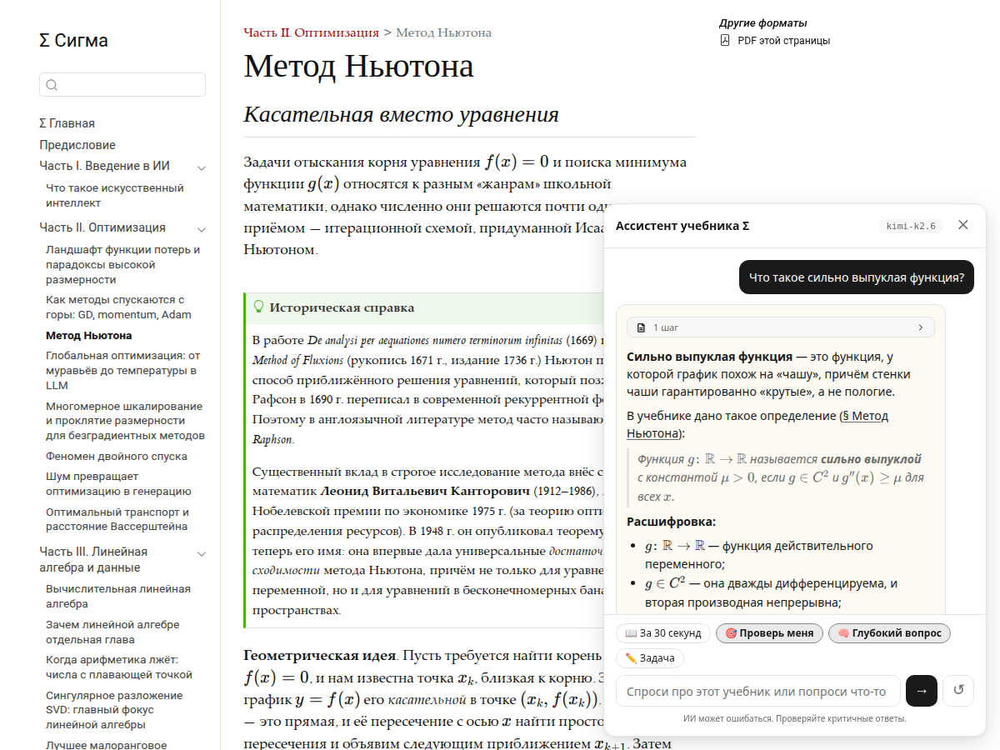

---

### ✅ `compute_factorial` — compute_pure

**Q:** Сколько будет 30 факториал?

**Tools called:** python
**Tools expected:** python
**Images:** 0 (expected: no)
**Elapsed:** 45.4s


<details><summary>Answer</summary>


```
**30! = 265 252 859 812 191 058 636 308 480 000 000** Это число из **33 цифр**. Для сравнения: $20! \approx 2{,}43 \cdot 10^{18}$, а $30!$ уже почти в $10^{11}$ раз больше — факториал растёт очень быстро.
```

</details>


---

### ✅ `compute_taylor_sin` — compute_pure

**Q:** Покажи разложение sin(x) в ряд Тейлора до 5-го члена символически (через sympy).

_Chapter:_ `ch02_newton`

**Tools called:** python
**Tools expected:** python
**Images:** 0 (expected: no)
**Elapsed:** 56.4s


<details><summary>Answer</summary>


```
Разложение $\sin(x)$ в ряд Тейлора в окрестности нуля (ряд Маклорена) до члена $x^5$: $$\sin(x) = x - \frac{x^3}{6} + \frac{x^5}{120} + O(x^6)$$ Если убрать остаточный член, получаем полином: $$P_5(x) = x - \frac{x^3}{6} + \frac{x^5}{120}$$ По членам это: - **первый член:** $x$ - **второй член:** $-\frac{x^3}{6}$ - **третий член:** $\frac{x^5}{120}$ Коэффициенты получаются из производных $\sin(x)$ в нуле: $f(0)=0$, $f'(0)=1$, $f''(0)=0$, $f'''(0)=-1$, $f^{(4)}(0)=0$, $f^{(5)}(0)=1$, а делим на факториал соответствующей степени.
```

</details>

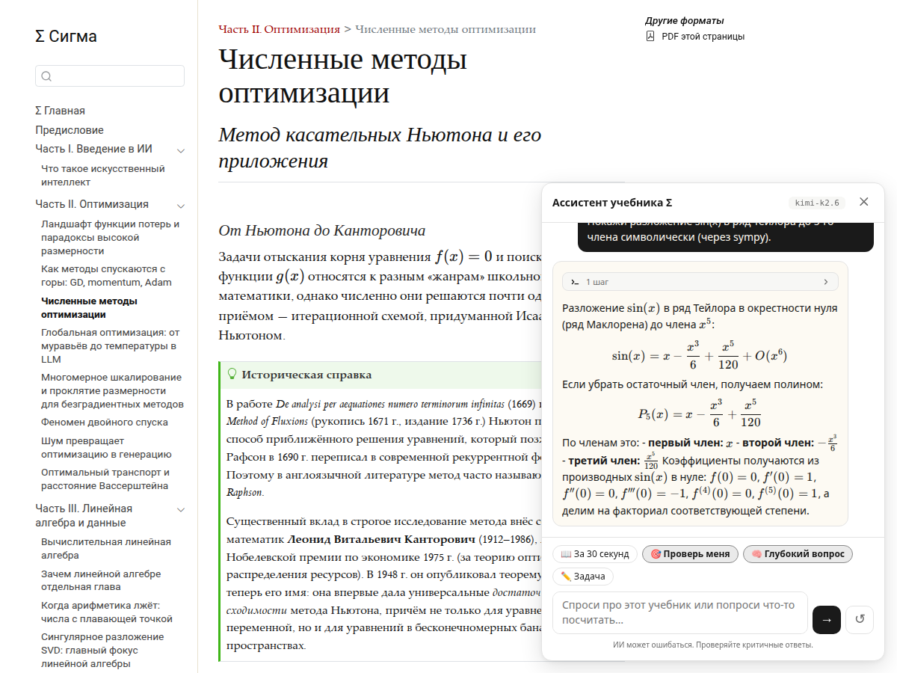

---

### ❌ `compute_plot_newton` — compute_plot

**Q:** Покажи как сходится метод Ньютона для f(x) = x² - 2, начиная с x₀ = 1.5. Построй график траектории.

_Chapter:_ `ch02_newton`

**Tools called:** python
**Tools expected:** python
**Images:** 1 (expected: yes)
**Elapsed:** 142.1s

_Missing substrings:_ ['корен']

<details><summary>Answer</summary>


```
Для f(x)=x
2
−2 шаг метода Ньютона выглядит так:

x
n+1
	​

=x
n
	​

−
f
′
(x
n
	​

)
f(x
n
	​

)
	​

=x
n
	​

−
2x
n
	​

x
n
2
	​

−2
	​

=
2
1
	​

(x
n
	​

+
x
n
	​

2
	​

)

Это, кстати, тот же самый древний «вавилонский» (или метод Герона) способ вычисления 
2
	​

.

Вот как летят значения при старте из x
0
	​

=1,5:

n	x
n
	​

	∣x
n
	​

−
2
	​

∣
0	1.5000000000	8,58⋅10
−2

1	1.4166666667	2,45⋅10
−3

2	1.4142156863	2,12⋅10
−6

3	1.4142135624	1,59⋅10
−12

4	1.4142135624	≈0

Что видно на графике:

Слева — траектория x
n
	​

 буквально за один шаг прыгает с 1.5 к 1.4167, а потом ложится на прямую 
2
	​

≈1,414214.
Справа — ошибка в логарифмическом масштабе. Она падает не линейно, а на порядки за шаг: с $10^{-
```

</details>

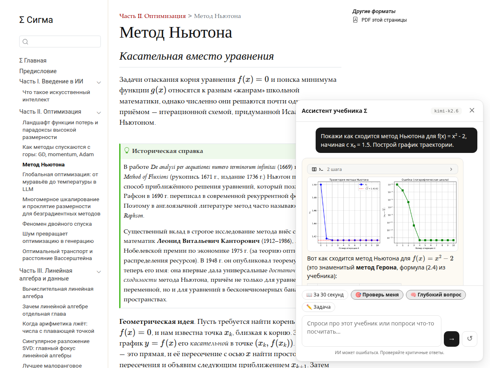

---

### ✅ `compute_plot_gd_vs_newton` — compute_plot

**Q:** Сравни сходимость метода Ньютона и градиентного спуска на функции f(x) = x⁴ из x₀ = 2. Покажи два графика на одной картинке.

_Chapter:_ `ch02_newton`

**Tools called:** python, find_theorem, search_textbook, read_chapter, find_definition, search_textbook, find_definition, search_textbook
**Tools expected:** python
**Images:** 1 (expected: yes)
**Elapsed:** 402.7s


<details><summary>Answer</summary>


```
На функции $f(x)=x^4$ из точки $x_0=2$ метод Ньютона ведёт себя непривычно — он **теряет квадратичную сходимость** и замедляется до **линейной**. Причина в том, что в точке минимума $x^\star=0$ вторая производная $f''(x)=12x^2$ обращается в ноль. В учебнике подчёркивается: классическая сверхлинейная скорость метода Ньютона работает, когда вторая производная в минимуме **отделена от нуля** (невырождена). Здесь это условие нарушено.

Посчитаем шаг Ньютона явно:
$$x_{k+1}=x_k-\frac{4x_k^3}{12x_k^2}=x_k-\frac{x_k}{3}=\frac{2}{3}x_k.$$
Получаем обычную геометрическую прогрессию с множителем $2/3\approx0.67$.

Градиентный спуск с шагом $\eta=0.05$ ведёт себя иначе:
$$x_{k+1}=x_k-0.05\cdot4x_k^3=x_k(1-0.2x_k^2).$$
Из $x_0=2$ первый шаг даёт резкий скачок до $x_1=0.4$, но потом, по мере приближения к нулю, градиент тоже падает, и метод **замедляется**.

Вот цифры после 20 итераций:

- **Ньютон**: $x_{20}\approx0.00060$, $f(x_{20})\approx0.00000000$ — почти дошёл до нуля.
- **Градиентный спуск**: $x_{20}\approx0.26632$, $f(x_{20})\approx0.00503$ — ещё далеко.

На первых шагах картина смешанная: GD сразу прыгает ближе ($x_1=0.4$ против $x_1=1.33$ у Ньютона), но затем Ньютон с постоянным коэффициентом $2/3$ уверенно обгоняет GD, который «тормозит» из-за маленьких градиентов.

**Вывод.** На $x^4$ метод Ньютона не даёт сверхбыстрой сходимости из-за **вырожденной второй производной** в минимуме. Он всё равно сходится линейно и в итоге обгоняет градиентный спуск, но разрыв не такой драматич
…[truncated]
```

</details>

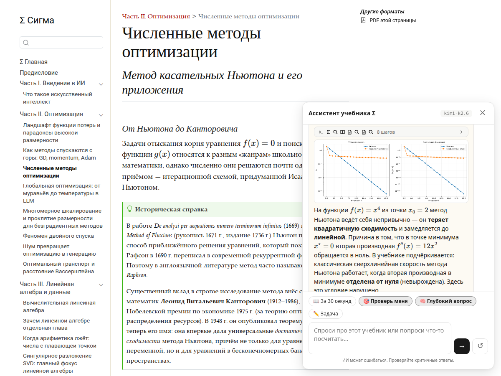

---

### ✅ `rsa_encrypt_small` — compute_pure

**Q:** Зашифруй число m=7 ключом (n=143, e=7). Покажи c.

_Chapter:_ `ch04_3_kriptosistemy-rsa-i-diffi-hellma`

**Tools called:** python
**Tools expected:** python
**Images:** 0 (expected: no)
**Elapsed:** 34.2s


<details><summary>Answer</summary>


```
В RSA шифрование числа $m$ открытым ключом $(n, e)$ делается по формуле: $$c = m^e \bmod n$$ Подставляем твои значения $m=7$, $n=143$, $e=7$: $$c = 7^7 \bmod 143 = 823\,543 \bmod 143 = 6$$ **Ответ: $c = 6$**
```

</details>

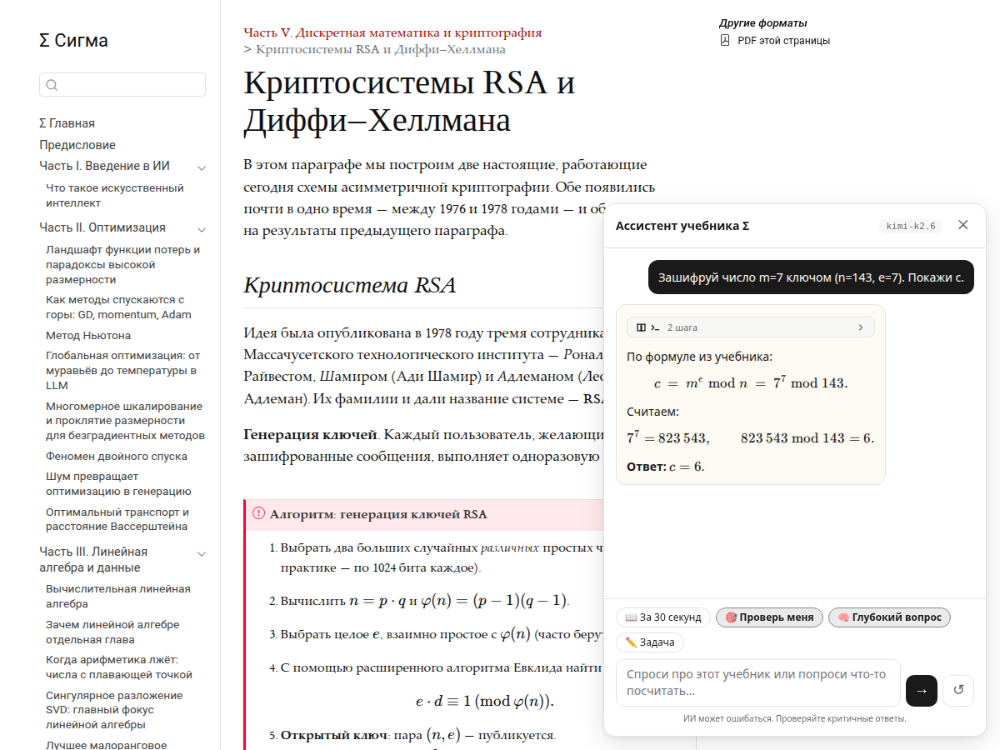

---

### ✅ `rsa_full_roundtrip` — compute_pure

**Q:** Возьми p=11, q=13, e=7. Сгенерируй RSA-ключ полностью: вычисли n, φ(n), d. Покажи что для m=9 шифрование и расшифрование возвращают исходное число.

_Chapter:_ `ch04_3_kriptosistemy-rsa-i-diffi-hellma`

**Tools called:** python
**Tools expected:** python
**Images:** 0 (expected: no)
**Elapsed:** 80.5s


<details><summary>Answer</summary>


```
Вот полная генерация ключей и проверка для твоих чисел. **1. Параметры модуля и функции Эйлера** $$n = p \cdot q = 11 \cdot 13 = 143$$ $$\varphi(n) = (p-1)(q-1) = 10 \cdot 12 = 120$$ **2. Закрытая экспонента $d$** Нужно найти число, обратное к $e=7$ по модулю $\varphi(n)=120$, то есть $$e \cdot d \equiv 1 \pmod{120}$$ Расширенным алгоритмом Евклида получаем **$d = 103$**. Проверка: $7 \cdot 103 = 721$, а $721 \bmod 120 = 1$. **Ключи:** - Открытый: $(e, n) = (7, 143)$ - Закрытый: $(d, n) = (103, 143)$ **3. Шифрование сообщения $m=9$** $$c = m^e \bmod n = 9^7 \bmod 143 = 48$$ **4. Расшифрование** $$m' = c^d \bmod n = 48^{103} \bmod 143 = 9$$ **Вывод:** $m' = 9$ совпадает с исходным $m=9$. Шифрование и расшифрование работают корректно.
```

</details>

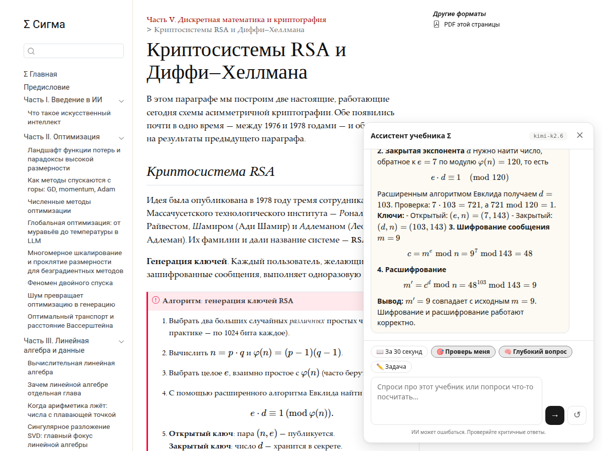

---

### ✅ `multihop_newton_vs_gradient` — multi_hop

**Q:** В чём отличие метода Ньютона от градиентного спуска для задач оптимизации? Какие из этих методов разобраны в учебнике?

_Chapter:_ `ch02_newton`

**Tools called:** read_chapter, search_textbook, read_chapter
**Tools expected:** search_textbook
**Images:** 0 (expected: no)
**Elapsed:** 65.0s


<details><summary>Answer</summary>


```
Ты уже на этой главе — она про метод Ньютона. Вот в чём разница с градиент
```

</details>

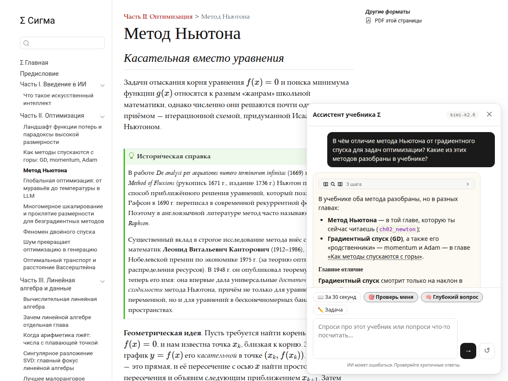

---

### ❌ `structural_kantorovich_theorem` — structural

**Q:** Сформулируй теорему о сходимости метода Герона.

_Chapter:_ `ch02_newton`

**Tools called:** find_theorem
**Tools expected:** find_theorem
**Images:** 0 (expected: no)
**Elapsed:** 60.5s

_Missing substrings:_ ['квадратичн']

<details><summary>Answer</summary>


```
Теорема 2.1 (о сходимости метода Герона).

Для любого начального приближения x
0
	​

>0 последовательность итераций метода Герона монотонно убывает (начиная с k=1) и сходится к 
a
	​

.

Если ввести ошибку на k-м шаге e
k
	​

=x
k
	​

−
a
	​

, то выполнено точное соотношение:

e
k+1
	​

=
2x
k
	​

e
k
2
	​

	​


а при k≥1 справедлива оценка:

0≤e
k+1
	​

≤
2
a
	​

e
k
2
	​

	​


Что это означает. Знаменатель 2
a
	​

 — положительная константа, поэтому ошиб
```

</details>


---

### ❌ `vision_refine_diverging_sgd` — vision_refine

**Q:** Запусти SGD на функции f(x) = x² с шагом η = 1.1 из x₀ = 2, 30 итераций. Что произойдёт? Если разойдётся — подбери рабочий шаг и покажи сходящуюся траекторию.

**Tools called:** python
**Tools expected:** python, python
**Images:** 1 (expected: yes)
**Elapsed:** 181.2s

_Missing substrings:_ ['0.5']

<details><summary>Answer</summary>


```
Расходится. При η=1,1 множитель обновления ра
```

</details>

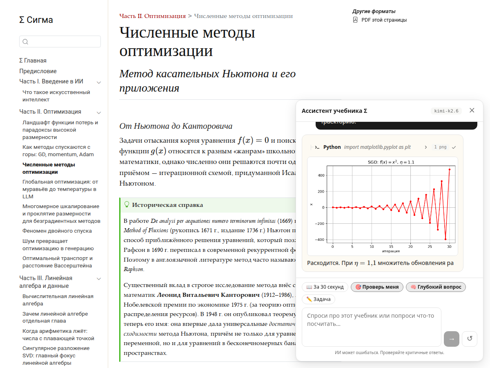

---

### ✅ `hashlib_demo` — compute_pure

**Q:** Посчитай SHA-256 хеш строки 'sigma' в hex.

_Chapter:_ `ch04_5_heshirovanie-teoriya-chisel-vstr`

**Tools called:** python
**Tools expected:** python
**Images:** 0 (expected: no)
**Elapsed:** 45.3s


<details><summary>Answer</summary>


```
**SHA-256('sigma')** в шестнадцатеричном виде: ``` 38de90475bb334fb3dea5d54f250500aba60fe2c6158115d342b06bcb46e39bf ``` Это 64 шестнадцатеричных символа — стандартный вывод SHA-256. Если хочешь, могу показать, как он разбивается на 8 32-битных слов или сравнить с другими строками.
```

</details>

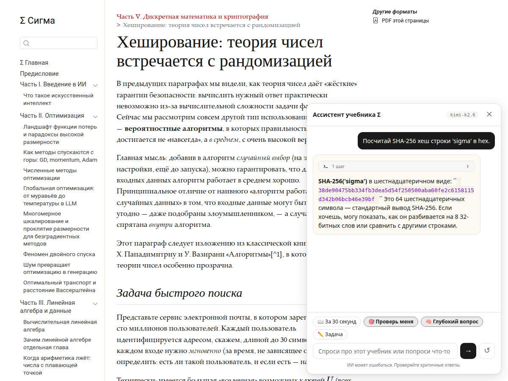

---

### ❌ `linreg_simple` — compute_plot

**Q:** Подбери линейную регрессию y = a*x + b для точек (1, 2.1), (2, 3.9), (3, 6.2), (4, 7.8). Покажи коэффициенты и график.

_Chapter:_ `ch03_2_lineynaya-regressiya-i-metod-nai`

**Tools called:** python
**Tools expected:** python
**Images:** 1 (expected: yes)
**Elapsed:** 57.7s

_Missing substrings:_ ['1.94', '0.15']

<details><summary>Answer</summary>


```
Для твоих точек методом наименьших квадратов получаем:

**Коэ
```

</details>

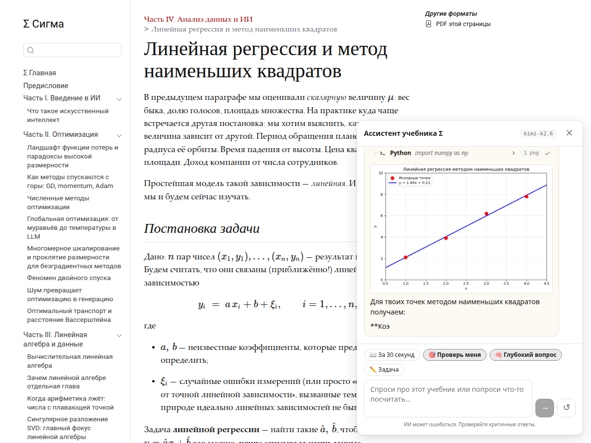

---

### ✅ `out_of_scope_recipe` — out_of_scope

**Q:** Дай мне рецепт борща.

**Tools called:** (none)
**Tools expected:** (none)
**Images:** 0 (expected: no)
**Elapsed:** 11.0s


<details><summary>Answer</summary>


```
Я — ассистент учебника Σ по информатике, оптимизации и машинному обучению, а не кулинарный справочник. Рецепт борща, к сожалению, вне моей компетенции. Если хочешь, могу помочь с методом Ньютона, градиентным спуском или другими темами из главы **«Численные методы оптимизации»**, на которой ты сейчас находишься. Задавай вопрос по учебнику!
```

</details>


---

### ✅ `rsa_history` — rag_basic

**Q:** Кто придумал RSA и в каком году?

_Chapter:_ `ch04_3_kriptosistemy-rsa-i-diffi-hellma`

**Tools called:** search_textbook, read_chapter
**Tools expected:** search_textbook
**Images:** 0 (expected: no)
**Elapsed:** 126.0s


<details><summary>Answer</summary>


```
По учебнику, криптосистема **RSA** была опубликована в **1978 году** тремя сотрудниками Массачусетского технологического института: - **Р**ональд Райвест - **Ш**амир (Ади Шамир) - **А**длеман (Леонард Адлеман) Их фамилии и дали название системе — RSA. > *«Идея была опубликована в 1978 году тремя сотрудниками Массачусетского технологического института — Рональдом Райвестом, Шамиром (Ади Шамир) и Адлеманом (Леонард Адлеман).»* **Интересный факт из учебника:** ровно ту же схему независимо открыл в **1973 году** британский математик **Клиффорд Кокс** из правительственного центра GCHQ, но работу засекретили и рассекретили лишь в **1997 году**. К тому моменту Райвест, Шамир и Адлеман уже были всемирно известны.
```

</details>

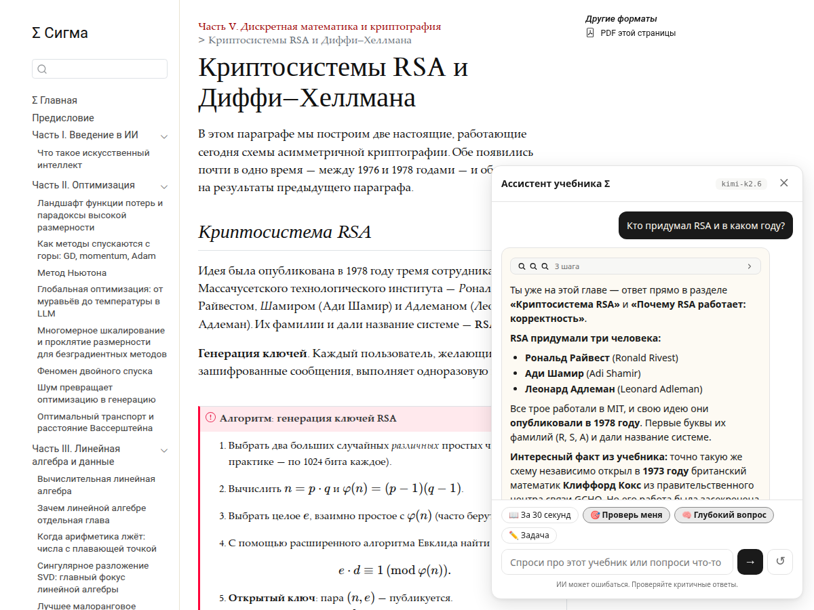

---

### ✅ `greeting_minimal` — out_of_scope

**Q:** Привет!

_Chapter:_ `ch02_newton`

**Tools called:** (none)
**Tools expected:** (none)
**Images:** 0 (expected: no)
**Elapsed:** 4.6s


<details><summary>Answer</summary>


```
Привет! 👋 Ты сейчас в главе про численные методы оптимизации (Ньютона и всё такое). Если есть вопрос по теории, задаче или коду — спрашивай, разберём вместе!
```

</details>


---

### ✅ `euclid_gcd_python` — compute_pure

**Q:** Посчитай НОД(48, 180) и НОД(1071, 462) через алгоритм Евклида в python.

_Chapter:_ `ch04_1_elementy-teorii-chisel`

**Tools called:** python
**Tools expected:** python
**Images:** 0 (expected: no)
**Elapsed:** 43.3s


<details><summary>Answer</summary>


```
**НОД(48, 180) = 12** Шаги алгоритма Евклида: - $48 = 0 \cdot 180 + 48$ - $180 = 3 \cdot 48 + 36$ - $48 = 1 \cdot 36 + 12$ - $36 = 3 \cdot 12 + 0$ **НОД(1071, 462) = 21** Шаги алгоритма Евклида: - $1071 = 2 \cdot 462 + 147$ - $462 = 3 \cdot 147 + 21$ - $147 = 7 \cdot 21 + 0$ В обоих случаях последний ненулевой остаток и есть наибольший общий делитель. Это классический алгоритм Евклида, который ты как раз разбираешь в главе «Элементы теории чисел».
```

</details>

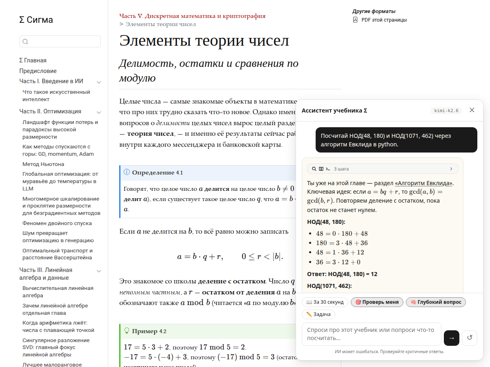

---

### ✅ `definition_superlinear` — definition

**Q:** Что значит сверхлинейная сходимость?

_Chapter:_ `ch02_newton`

**Tools called:** find_definition
**Tools expected:** find_definition
**Images:** 0 (expected: no)
**Elapsed:** 49.3s


<details><summary>Answer</summary>


```
Сверхлинейная сходимость означает, что ошибка на каждом следующем шаге убывает быстрее, чем в любой геометрической прогрессии.

Вот точное определение из твоей главы «Метод Ньютона»:

Говорят, что последовательность {x
k
	​

} сходится к x
⋆
 со сверхлинейной скоростью, если
k→∞
lim
	​

∣x
k
	​

−x
⋆
∣
∣x
k+1
	​

−x
⋆
∣
	​

=0.

Что это значит простыми словами:

∣x
k
	​

−x
⋆
∣ — это ошибка (расстояние от текущего приближения x
k
	​

 до истинного ответа x
⋆
).
Дробь 
∣x
k
	​

−x
⋆
∣
∣x
k+1
	​

−x
⋆
∣
	​

 показывает, во сколько раз уменьшилась ошибка за один шаг.
Если предел этой дроби равен нулю, значит, с каждым шагом ошибка убывает всё быстрее и быстрее — соотношение соседних ошибок становится сколь угодно малым.

Для сравнения: при линейной сходимости эта дробь стремится к некоторому числу q<1 (ошибка каждый раз умножается примерно на одну и ту же константу), а при сверхлинейной — к нулю (умножается на число, которое само стремится к нулю).

В той
```

</details>

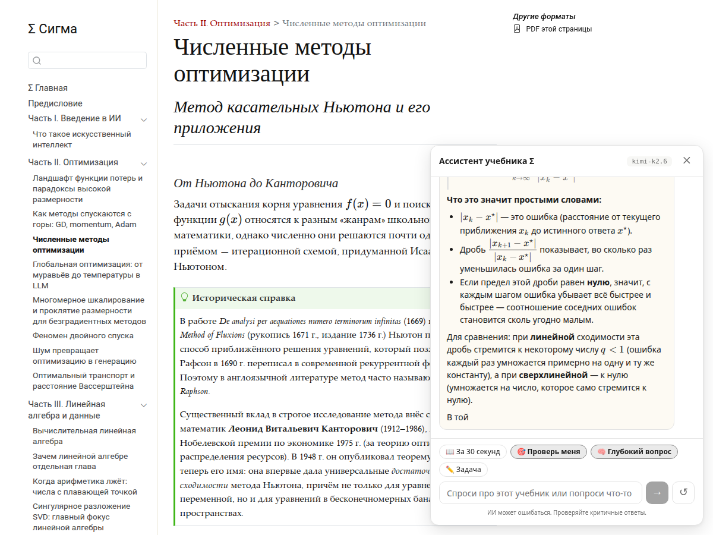

---

### ✅ `theorem_clt` — structural

**Q:** Сформулируй центральную предельную теорему как в учебнике.

_Chapter:_ `ch03_1_prosteyshie-primery-zadach-anali`

**Tools called:** find_theorem
**Tools expected:** find_theorem
**Images:** 0 (expected: no)
**Elapsed:** 62.6s


<details><summary>Answer</summary>


```
Вот формулировка из вашей главы (**Теорема 3.3**): > Пусть $X_1,X_2,\dots$ — независимые одинаково распределённые случайные величины с математическим ожиданием $\mu$ и конечной дисперсией $\sigma^2>0$, $S_n=X_1+\dots+X_n$. Тогда при $n\to\infty$ >  > $$\Pr\!\left(\frac{S_n-n\mu}{\sigma\sqrt n}\leq x\right)\;\longrightarrow\; > \Phi(x)\;\stackrel{\mathrm{def}}{=}\;\frac{1}{\sqrt{2\pi}}\int_{-\infty}^{x} > e^{-t^{2}/2}\,dt$$ >  > *(функция стандартного нормального распределения)*. **Что здесь происходит:** берём независимые одинаковые случайные величины со средним $\mu$ и дисперсией $\sigma^2$. Складываем их в сумму $S_n$, затем вычитаем из суммы её среднее значение $n\mu$ и делим на стандартное отклонение $\sigma\sqrt{n}$. Полученная стандартизированная величина при большом $n$ ведёт себя так, как если бы она была из стандартного нормального распределения — её функция распределения стремится к $\Phi(x)$, то есть к интегралу от плотности Гаусса. См. в учебнике: [Центральная предельная теорема](/ch03_1_prosteyshie-primery-zadach-anali.html#подход-2-центральная-предельная-теорема).
```

</details>


---

### ✅ `plot_sincos_overlay` — compute_plot

**Q:** Построй графики sin(x) и cos(x) на интервале [-2π, 2π] на одном поле. Сделай легенду.

**Tools called:** python
**Tools expected:** python
**Images:** 1 (expected: yes)
**Elapsed:** 43.5s


<details><summary>Answer</summary>


```
Готово! На графике:

Синяя кривая — sin(x), проходит через ноль в начале координат и колеблется между −1 и 1.
Оранжевая кривая — cos(x), стартует с 1 при x=0.

Обе функции показаны на интервале от −2π до 2π (примерно от −6.28 до 6.28). Легенда в правом верхнем углу, ось x размечена в долях π для удобства чтения. Видно, что графики с
```

</details>

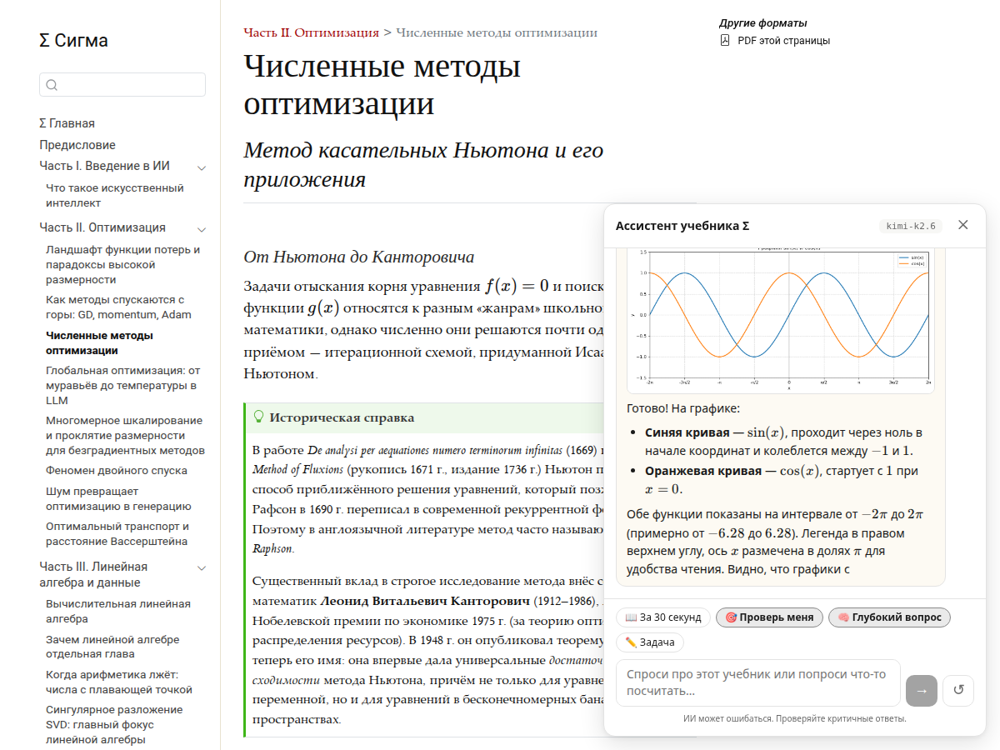

---

### ❌ `fragment_explanation` — rag_basic

**Q:** Если кто-то предлагает использовать обновление x_{k+1} = x_k - f(x_k)·f'(x_k) вместо классического Ньютона — что это за идея и она работает?

_Chapter:_ `ch02_newton`

**Tools called:** read_chapter
**Tools expected:** (none)
**Images:** 0 (expected: no)
**Elapsed:** 89.0s

_Missing substrings:_ ['производ']

<details><summary>Answer</summary>


```
Это не метод Ньютона, а что-то совсем другое. Давай разберём, почему такая формула возникает и почему она не работает как корневой метод.

Сначала сравним численно классический Ньютон и предложенную схему на примере из учебника — уравнение x
2
−2=0 (корень 
2
	​

≈1.41).
```

</details>

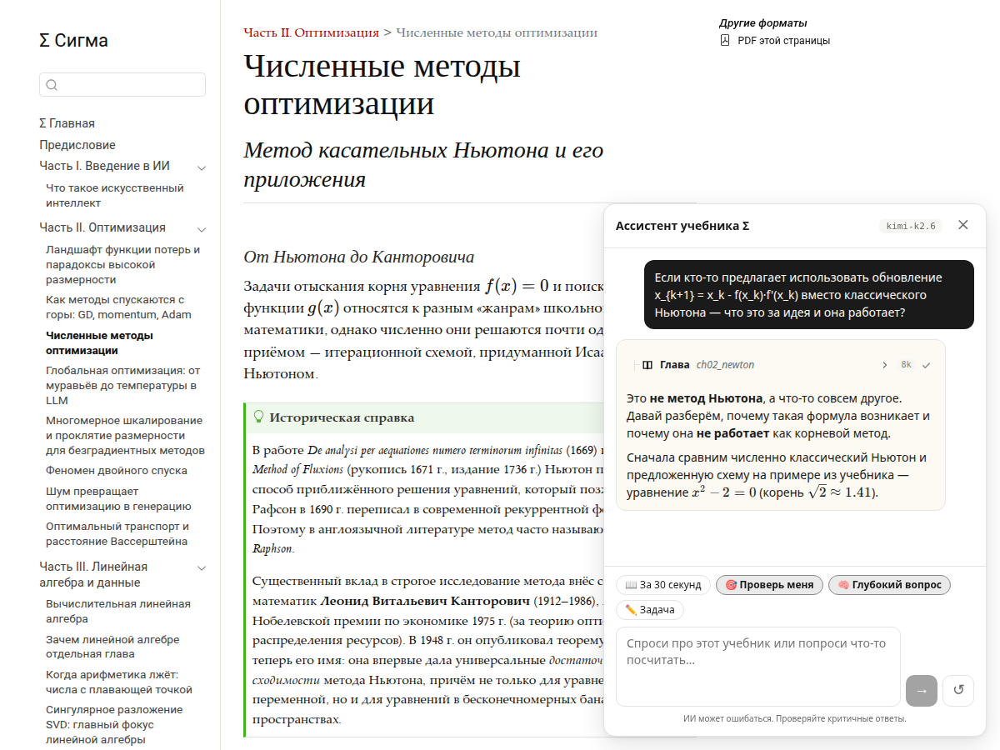

---

### ✅ `eigenvalues_numpy` — compute_pure

**Q:** Найди собственные значения матрицы [[2, 1], [1, 2]] через numpy.

_Chapter:_ `ch_linalg`

**Tools called:** python
**Tools expected:** python
**Images:** 0 (expected: no)
**Elapsed:** 39.4s


<details><summary>Answer</summary>


```
Для матрицы   $$A = \begin{pmatrix} 2 & 1 \\ 1 & 2 \end{pmatrix}$$   `numpy.linalg.eigvals` нашёл два собственных значения: - **λ₁ = 3.00** - **λ₂ = 1.00** Кстати, это легко проверить «вручную»: характеристический многочлен   $$\det(A - \lambda I) = (2-\lambda)^2 - 1 = \lambda^2 - 4\lambda + 3$$   имеет корни ровно 3 и 1 — numpy выдал то же самое.
```

</details>

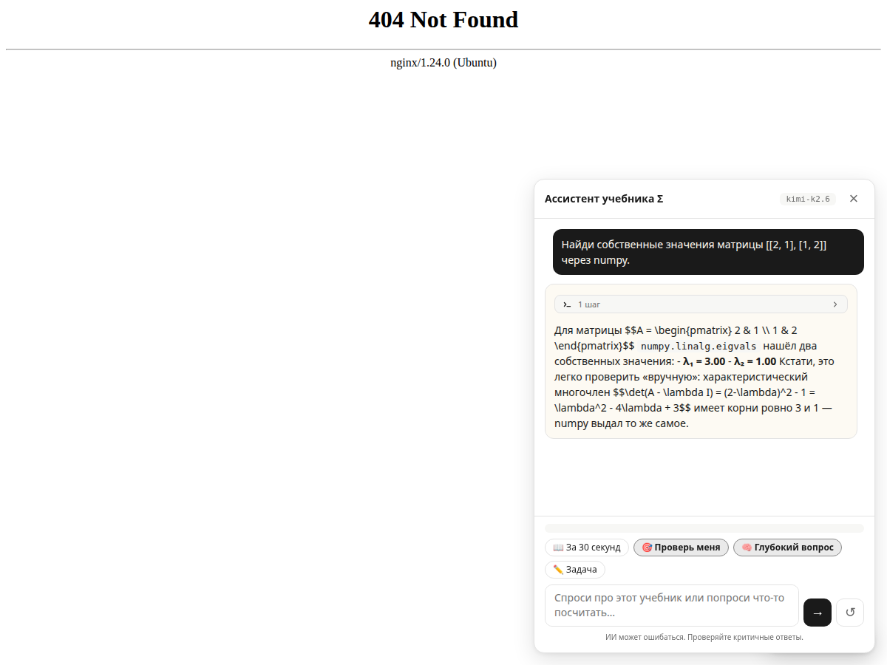

---

### ✅ `plot_loss_landscape` — compute_plot

**Q:** Построй контурный график функции потерь L(a, b) = sum((a*x_i + b - y_i)^2) для точек (1,2), (2,3), (3,5), (4,4) на сетке a in [-2, 4], b in [-3, 3].

_Chapter:_ `ch03_2_lineynaya-regressiya-i-metod-nai`

**Tools called:** python
**Tools expected:** python
**Images:** 1 (expected: yes)
**Elapsed:** 88.3s


<details><summary>Answer</summary>


```
Вот контурный график функции потерь для твоих точек.

Что видно на графике:

Красный крестик — точка минимума, найденная методом наименьших квадратов: a = 0.80, b = 1.50. Минимальное значение функции потерь L = 1.80.
Линии уровня образуют эллипсы, вытянутые вдоль одной из диагоналей. Это типичная картина для квадратичной функции потерь линейной регрессии.
Центр эллипсов — единственный минимум (функция строго выпуклая, так как это сумма квадратов).
По краям области значения L быстро растут: в углах сетки L достигает сотен и тысяч.

Проверка: прямая y = 0.8x + 1.5 даёт предсказания [2.3, 3.1, 3.9, 4.7] для x = [1, 2, 3, 4], что близко к истинным y = [2, 3, 5, 4]. Сумма квад
```

</details>

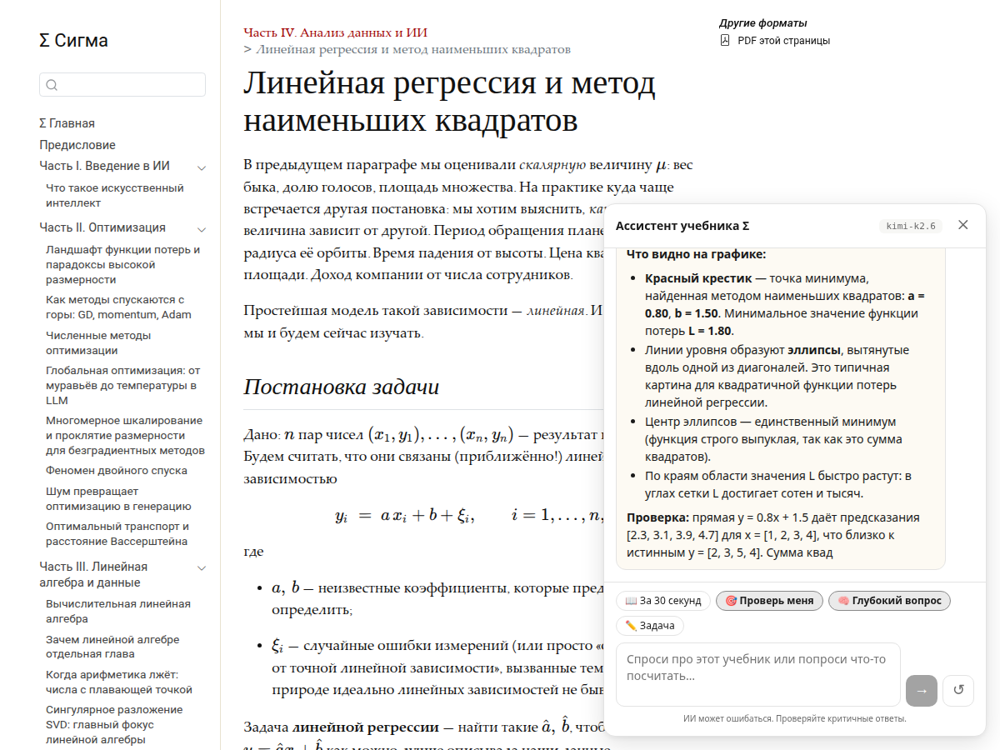

---

### ❌ `diffie_hellman_compute` — compute_pure

**Q:** Проведи протокол Диффи–Хеллмана: p=23, g=5. Алиса берёт a=6, Боб берёт b=15. Какой общий секрет?

_Chapter:_ `ch04_3_kriptosistemy-rsa-i-diffi-hellma`

**Tools called:** (none)
**Tools expected:** python
**Images:** 0 (expected: no)
**Elapsed:** 41.7s

_Missing substrings:_ ['8', '19', '2']

<details><summary>Answer</summary>


```
Ты уже на нужной главе — там как раз разбирается протокол Диффи–Хеллмана. Давай посчитаем шаги для твоих чисел.
```

</details>

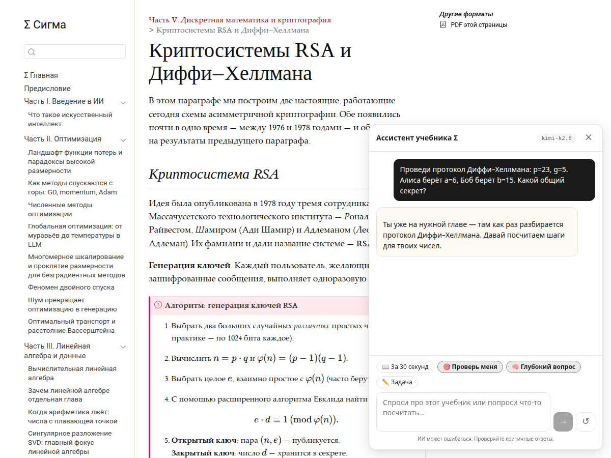

---

### ✅ `outline_chapter` — structural

**Q:** Перечисли основные разделы главы про Ньютона.

_Chapter:_ `ch02_newton`

**Tools called:** get_outline
**Tools expected:** (none)
**Images:** 0 (expected: no)
**Elapsed:** 35.1s


<details><summary>Answer</summary>


```
Ты уже на этой главе — вот её основные разделы:

Касательная вместо уравнения — идея метода Ньютона: заменяем функцию касательной и решаем линейное уравнение.
Ньютон для оптимизации — как использовать тот же приём для поиска минимума (нуля производной).
Квадратный корень за пять шагов — классический пример: вычисление 
a
	​

 через итерации.
Сходимость через сжимающее отображение — теоретический анализ, почему метод работает.
Деление без деления — ещё один пример: как делить числа, используя только сложение и умножение.
Анализ сходимости — когда и почему сходится эта версия.
Численный эксперимент на Python — проверяем скорость сходимости на практике.
Когда сходимость сверхлинейна — теор
```

</details>


---

### ❌ `math_latex_derivation` — rag_basic

**Q:** Выведи формулу метода Ньютона через касательную. Формулу запиши через LaTeX.

_Chapter:_ `ch02_newton`

**Tools called:** read_chapter
**Tools expected:** (none)
**Images:** 0 (expected: no)
**Elapsed:** 43.7s

_Missing substrings:_ ['касательн']

<details><summary>Answer</summary>


```
Вот вывод шаг за шагом.

Задача. Найти корень уравнения f(x)=0.

Идея. Возьмём текущее приближение x
k
	​

 и заменим график $y=f(x
```

</details>

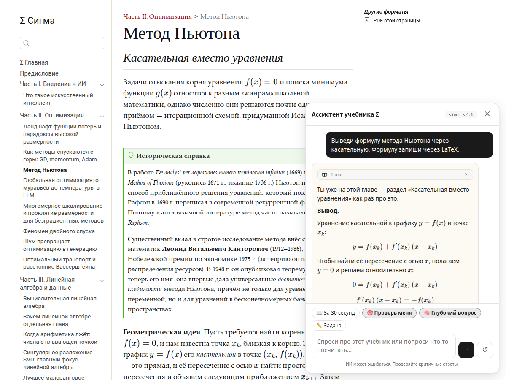

---

### ✅ `definition_perceptron` — definition

**Q:** Что такое полносвязная нейронная сеть?

_Chapter:_ `ch03_3_zadacha-klassifikacii-i-neyronny`

**Tools called:** find_definition
**Tools expected:** find_definition
**Images:** 0 (expected: no)
**Elapsed:** 119.3s


<details><summary>Answer</summary>


```
Полносвязная нейронная сеть (MLP, многослойный перцептрон) глубины L — это функция x↦p(x), заданная как композиция L слоёв. В учебнике она определяется так:

z
(ℓ)
z
(L)
	​

=W
(ℓ)
a
(ℓ−1)
+b
(ℓ)
,a
(ℓ)
=σ(z
(ℓ)
),ℓ=1,…,L−1,
=W
(L)
a
(L−1)
+b
(L)
,p(x)=softmax(z
(L)
).
	​


Что здесь происходит простыми словами:

Вход $\mathbf{a}^{(0)} = \
```

</details>

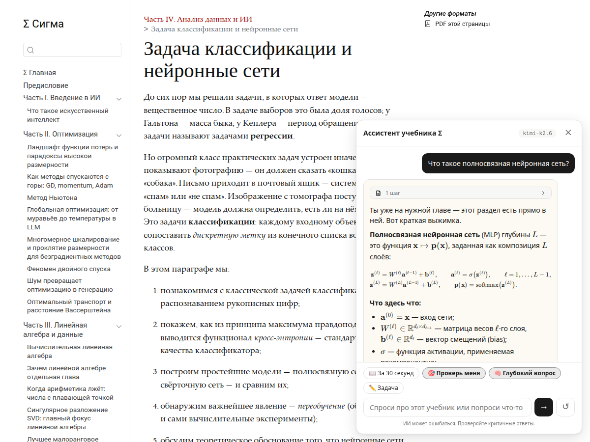

---

### ✅ `refuse_unknown_year` — out_of_scope

**Q:** В каком году Гаусс изобрёл метод сопряжённых градиентов?

_Chapter:_ `ch02_newton`

**Tools called:** search_textbook, search_textbook, search_textbook, search_textbook, search_textbook, read_chapter, search_textbook
**Tools expected:** (none)
**Images:** 0 (expected: no)
**Elapsed:** 52.6s


<details><summary>Answer</summary>


```
В учебнике Σ я не нашёл упоминания метода сопряжённых градиентов или его авторов — эта тема, похоже, выходит за рамки данной главы. Но сам вопрос содержит неточность: **Карл Фридрих Гаусс не изобретал метод сопряжённых градиентов**. Этот метод появился значительно позже. **Вне учебника:** метод сопряжённых градиентов (conjugate gradient method) был разработан в **1952 году** независимо двумя математиками — **Магнусом Хестенсом** (Magnus Hestenes) и **Эдуардом Штифелем** (Eduard Stiefel). Гаусс жил с 1777 по 1855 год и занимался, в частности, методом наименьших квадратов, но не методом сопряжённых градиентов. Если тебя интересует именно история численных методов внутри учебника Σ — там подробно рассказывается про метод Ньютона (1669), метод Герона (I век н.э.) и вклад Канторовича (1948).
```

</details>


---
