# Sigma Assistant — Eval Report

_Run: 2026-07-13 21:49 MSK · cases: 29_

**Overall: 25/29 pass (86%)**

## Per category

| Category | Pass | Total |
|---|---:|---:|
| `compute_plot` | 3 | 5 |
| `compute_pure` | 8 | 8 |
| `definition` | 3 | 3 |
| `multi_hop` | 0 | 1 |
| `out_of_scope` | 3 | 3 |
| `rag_basic` | 5 | 5 |
| `structural` | 2 | 3 |
| `vision_refine` | 1 | 1 |

## Cases

### ✅ `newton_kantorovich_history` — rag_basic

**Q:** Когда Канторович получил Нобелевскую премию и за что?

_Chapter:_ `ch02_newton`

**Tools called:** search_textbook, read_chapter
**Tools expected:** search_textbook
**Images:** 0 (expected: no)
**Elapsed:** 7.1s


<details><summary>Answer</summary>


```
Леонид Витальевич Канторович (1912–1986) получил Нобелевскую премию по экономике в 1975 году. Он был награждён за свою работу в области теории оптимального распределения ресурсов. В 1948 году Канторович опубликовал теорему, которая впервые дала универсальные достаточные условия сходимости метода Ньютона, применимого не только для уравнений с одной переменной, но и для уравнений в бесконечномерных банаховых пространствах.
```

</details>

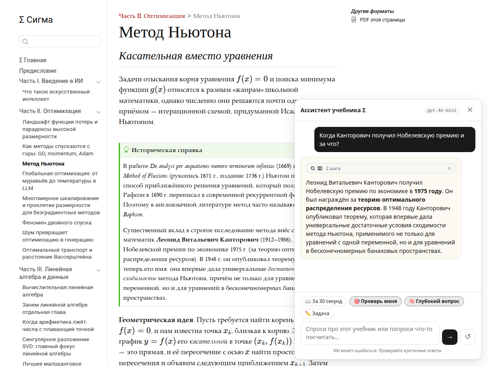

---

### ✅ `newton_formula_recall` — rag_basic

**Q:** Объясни откуда берётся эта формула — что это за метод и какая геометрическая идея?

_Chapter:_ `ch02_newton`

**Tools called:** read_chapter
**Tools expected:** (none)
**Images:** 0 (expected: no)
**Elapsed:** 7.7s


<details><summary>Answer</summary>


```
Метод Ньютона, также известный как метод касательных, используется для нахождения корней уравнений и минимизации функций. Его основная идея заключается в итеративном приближении к корню уравнения $f(x) = 0$ или к минимуму функции $g(x)$. ### Геометрическая идея Когда мы ищем корень уравнения, начиная с точки $x_k$, мы строим касательную к графику функции $y = f(x)$ в этой точке. Уравнение касательной имеет вид: $$y = f(x_k) + f'(x_k)(x - x_k).$$ Мы находим пересечение этой касательной с осью $x$, что позволяет получить новое приближение $x_{k+1}$. Формула для итерации выглядит так: $$x_{k+1} = x_k - \frac{f(x_k)}{f'(x_k)}.$$ ### Применение к задачам оптимизации Для нахождения минимума функции $g(x)$ мы можем использовать ту же формулу, подставив $f = g'$, что приводит к: $$x_{k+1} = x_k - \frac{g'(x_k)}{g''(x_k)}.$$ Это означает, что мы ищем точку, в которой производная функции равна нулю, что соответствует минимуму. ### Итеративный процесс Метод Ньютона работает по принципу "разделяй и властвуй": вместо решения сложной задачи минимизации функции $g$ целиком, мы на каждом шаге заменяем её локальной квадратичной моделью, что значительно упрощает вычисления. Таким образом, метод Ньютона сочетает в себе геометрическую интуицию и математическую строгость, позволяя эффективно находить корни и минимумы функций.
```

</details>

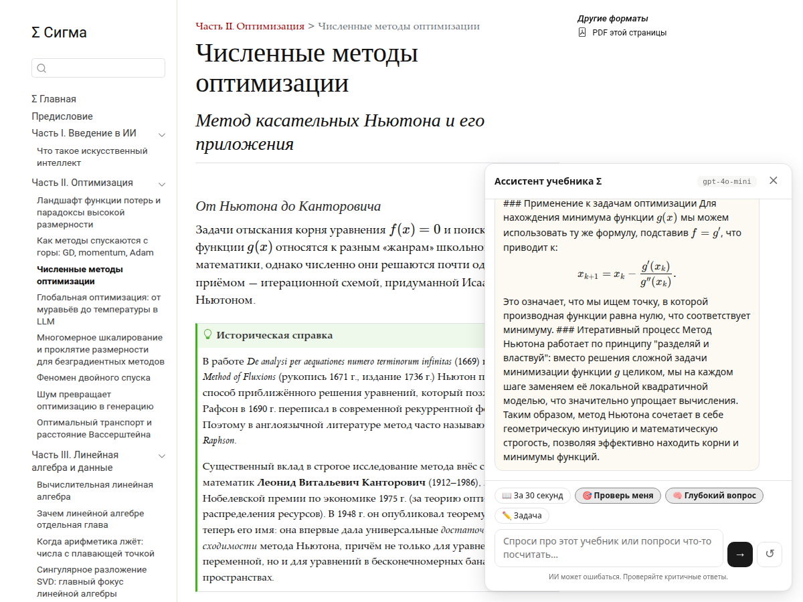

---

### ✅ `definition_strong_convex` — definition

**Q:** Что такое сильно выпуклая функция?

_Chapter:_ `ch02_newton`

**Tools called:** find_definition
**Tools expected:** find_definition
**Images:** 0 (expected: no)
**Elapsed:** 5.8s


<details><summary>Answer</summary>


```
**Сильно выпуклая функция** — это функция $g\colon\mathbb{R}\to\mathbb{R}$, которая удовлетворяет следующим условиям: - Функция $g$ дважды непрерывно дифференцируема ($g \in C^{2}$). - Вторая производная функции $g$ не меньше положительной константы $\mu > 0$ для всех $x$: $g''(x) \geq \mu$. Сильная выпуклость гарантирует существование и единственность точки минимума, а также отделённость второй производной от нуля. Для более подробной информации можно ознакомиться с [определением в учебнике](https://sigma.fmin.xyz/ch02_newton.html#ssec:thm-superlinear).
```

</details>

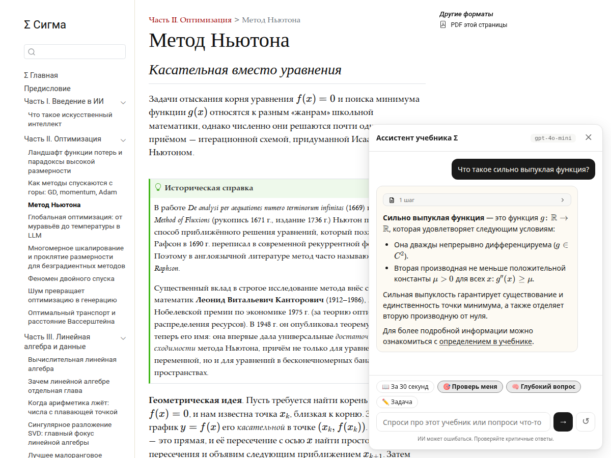

---

### ✅ `compute_factorial` — compute_pure

**Q:** Сколько будет 30 факториал?

**Tools called:** python
**Tools expected:** python
**Images:** 0 (expected: no)
**Elapsed:** 14.5s


<details><summary>Answer</summary>


```
30 факториал равен 265252859812191058636308480000000.
```

</details>

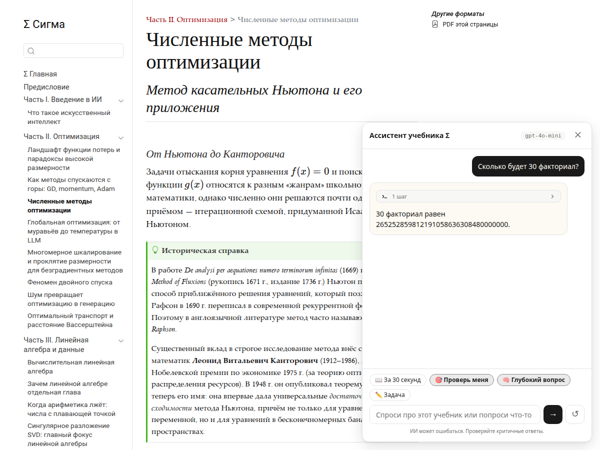

---

### ✅ `compute_taylor_sin` — compute_pure

**Q:** Покажи разложение sin(x) в ряд Тейлора до 5-го члена символически (через sympy).

_Chapter:_ `ch02_newton`

**Tools called:** python
**Tools expected:** python
**Images:** 0 (expected: no)
**Elapsed:** 13.8s


<details><summary>Answer</summary>


```
Разложение функции $\sin(x)$ в ряд Тейлора до 5-го члена выглядит так: $$\sin(x) = x - \frac{x^3}{6} + \frac{x^5}{120} + O(x^6)$$ Здесь $O(x^6)$ обозначает остаточный член, который стремится к нулю быстрее, чем $x^6$ при $x \to 0$.
```

</details>


---

### ❌ `compute_plot_newton` — compute_plot

**Q:** Покажи как сходится метод Ньютона для f(x) = x² - 2, начиная с x₀ = 1.5. Построй график траектории.

_Chapter:_ `ch02_newton`

**Tools called:** python
**Tools expected:** python
**Images:** 2 (expected: yes)
**Elapsed:** 20.8s

_Missing substrings:_ ['корен']

<details><summary>Answer</summary>


```
Метод Ньютона для функции $f(x) = x^2 - 2$ с начальным приближением $x_0 = 1.5$ сходится к корню $\sqrt{2} \approx 1.41$. 

Вот значения $x$ на каждой итерации:

1. $x_0 = 1.5$
2. $x_1 \approx 1.42$
3. $x_2 \approx 1.41$
4. $x_3 \approx 1.41$
5. $x_4 \approx 1.41$
6. $x_5 \approx 1.41$
7. $x_6 \approx 1.41$
8. $x_7 \approx 1.41$
9. $x_8 \approx 1.41$
10. $x_9 \approx 1.41$

На графике видно, как траектория метода Ньютона приближается к корню функции. 


```

</details>

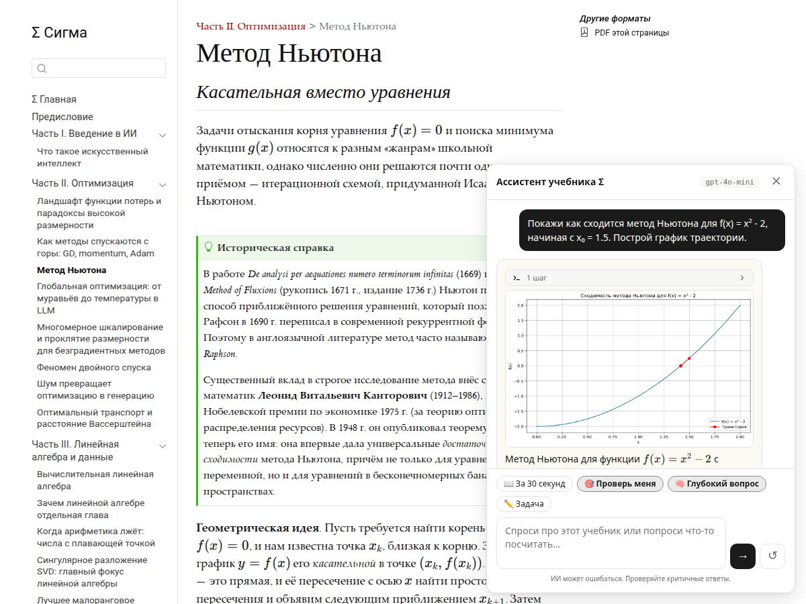

---

### ✅ `compute_plot_gd_vs_newton` — compute_plot

**Q:** Сравни сходимость метода Ньютона и градиентного спуска на функции f(x) = x⁴ из x₀ = 2. Покажи два графика на одной картинке.

_Chapter:_ `ch02_newton`

**Tools called:** python, python
**Tools expected:** python
**Images:** 1 (expected: yes)
**Elapsed:** 27.4s


<details><summary>Answer</summary>


```
На графике видно сравнение сходимости метода Ньютона и градиентного спуска для функции $f(x) = x^4$, начиная с точки $x_0 = 2$. 

**Метод Ньютона**:
- Быстро сходится к минимуму функции, поскольку использует информацию о второй производной. На графике точки, соответствующие итерациям метода Ньютона, обозначены кругами.

**Градиентный спуск**:
- Сходится медленнее, так как использует только первую производную и фиксированный шаг. Точки, соответствующие итерациям градиентного спуска, обозначены крестиками.

Видно, что метод Ньютона значительно быстрее достигает минимума функции по сравнению с градиентным спуском.
```

</details>

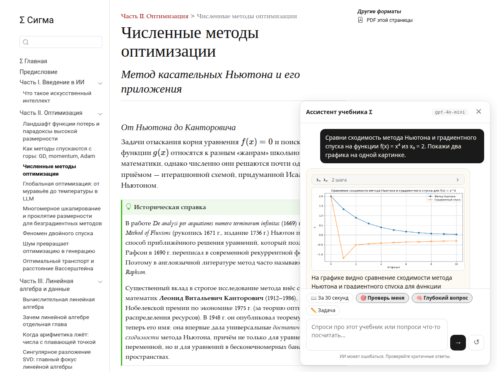

---

### ✅ `rsa_encrypt_small` — compute_pure

**Q:** Зашифруй число m=7 ключом (n=143, e=7). Покажи c.

_Chapter:_ `ch04_3_kriptosistemy-rsa-i-diffi-hellma`

**Tools called:** python
**Tools expected:** python
**Images:** 0 (expected: no)
**Elapsed:** 15.6s


<details><summary>Answer</summary>


```
Зашифрованное число $c$ равно 6.
```

</details>

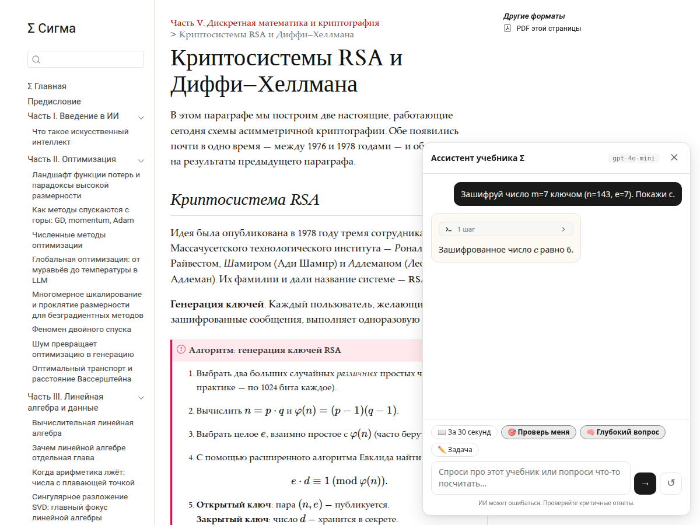

---

### ✅ `rsa_full_roundtrip` — compute_pure

**Q:** Возьми p=11, q=13, e=7. Сгенерируй RSA-ключ полностью: вычисли n, φ(n), d. Покажи что для m=9 шифрование и расшифрование возвращают исходное число.

_Chapter:_ `ch04_3_kriptosistemy-rsa-i-diffi-hellma`

**Tools called:** python
**Tools expected:** python
**Images:** 0 (expected: no)
**Elapsed:** 17.5s


<details><summary>Answer</summary>


```
Вот результаты генерации RSA-ключа и проверки шифрования: - **n** = 143 - **φ(n)** = 120 - **d** = 103 Для исходного сообщения **m** = 9: - Шифрованное сообщение **c** = 48 - Расшифрованное сообщение **m** = 9 Таким образом, шифрование и расшифрование возвращают исходное число, что подтверждает корректность работы алгоритма.
```

</details>

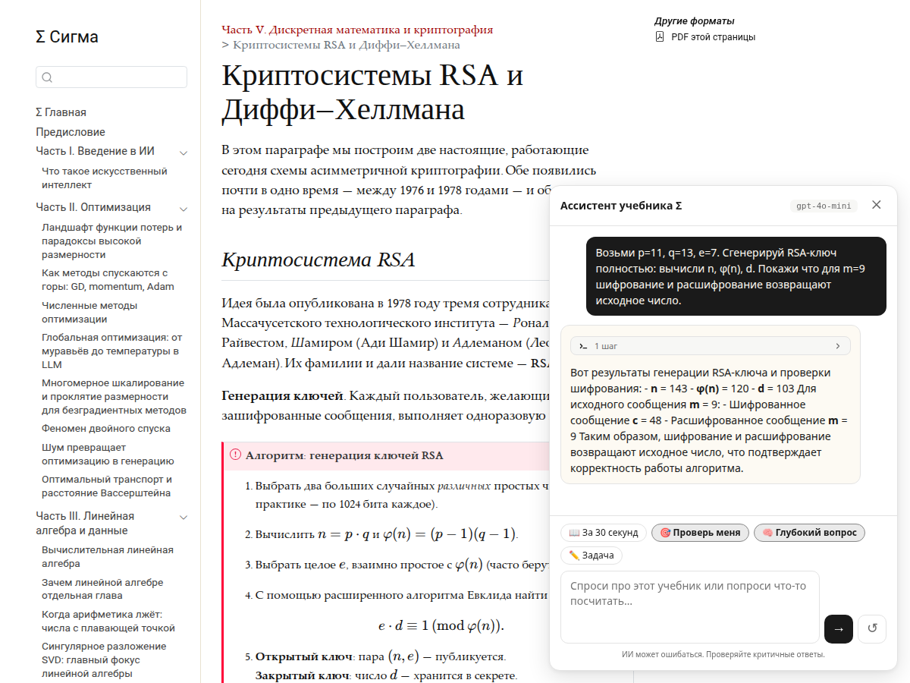

---

### ❌ `multihop_newton_vs_gradient` — multi_hop

**Q:** В чём отличие метода Ньютона от градиентного спуска для задач оптимизации? Какие из этих методов разобраны в учебнике?

_Chapter:_ `ch02_newton`

**Tools called:** Секция, Секция, read_chapter, Секция, read_chapter, get_outline, read_chapter
**Tools expected:** search_textbook
**Images:** 0 (expected: no)
**Elapsed:** 20.8s


<details><summary>Answer</summary>


```
**Метод Ньютона** и **градиентный спуск** — это два различных подхода к решению задач оптимизации, и у них есть свои особенности. ### Метод Ньютона Метод Ньютона использует информацию о второй производной функции (гессиан) для нахождения минимума. Он основан на итеративном приближении, где на каждом шаге вычисляется касательная к функции в текущей точке, и следующая точка выбирается как пересечение этой касательной с осью абсцисс. Формула для обновления точки выглядит так: $$ x_{k+1} = x_k - \frac{g'(x_k)}{g''(x_k)}, $$ где $g'(x_k)$ — первая производная, а $g''(x_k)$ — вторая производная функции $g$. **Преимущества метода Ньютона:** - Быстрая сходимость (квадратичная) при условии, что начальное приближение достаточно близко к истинному минимуму. - Использует информацию о кривизне функции, что позволяет более точно находить минимум. **Недостатки:** - Требует вычисления второй производной, что может быть сложно для многомерных функций. - Может не сойтись, если начальная точка выбрана неудачно. ### Градиентный спуск Градиентный спуск, в отличие от метода Ньютона, использует только первую производную функции для нахождения направления, в котором функция убывает. Обновление точки происходит по формуле: $$ x_{k+1} = x_k - \eta g'(x_k), $$ где $\eta$ — шаг обучения (коэффициент, определяющий, насколько сильно мы двигаемся в направлении градиента). **Преимущества градиентного спуска:** - Проще в реализации и не требует вычисления второй производной. - Может работать с большими набор
…[truncated]
```

</details>

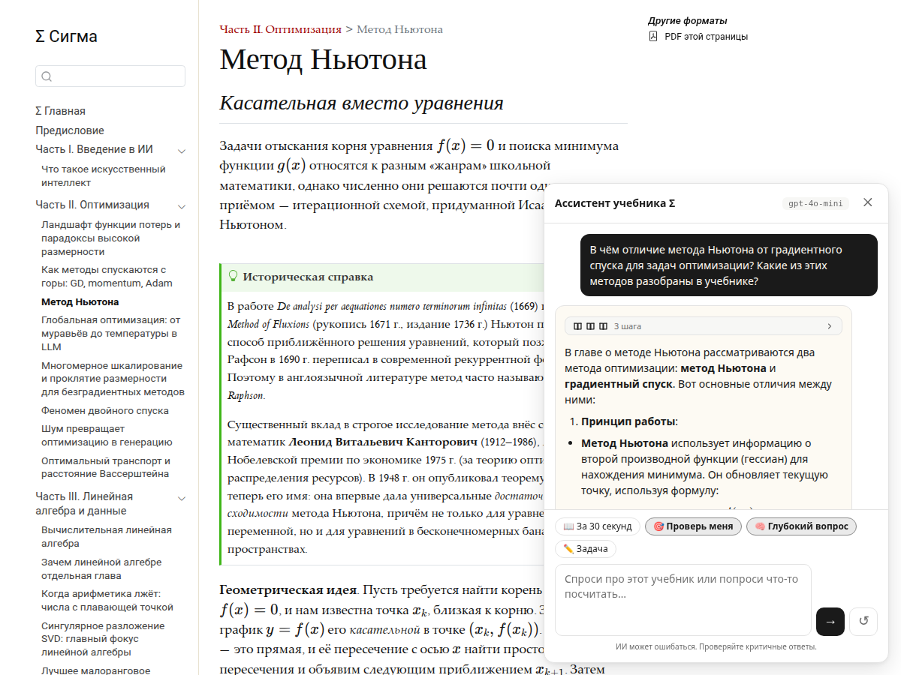

---

### ❌ `structural_kantorovich_theorem` — structural

**Q:** Сформулируй теорему о сходимости метода Герона.

_Chapter:_ `ch02_newton`

**Tools called:** find_theorem, read_chapter
**Tools expected:** find_theorem
**Images:** 0 (expected: no)
**Elapsed:** 7.6s

_Missing substrings:_ ['квадратичн']

<details><summary>Answer</summary>


```
**Теорема 2.1. Сходимость метода Герона**: Для любого $x_0 > 0$ последовательность, заданная методом Герона, монотонно убывает (начиная с $k=1$) и сходится к $\sqrt{a}$. Более того, для ошибки $e_k = x_k - \sqrt{a}$ выполнено: $$ e_{k+1} = \frac{e_k^2}{2x_k}, \qquad \text{и при } k \geq 1: \quad 0 \leq e_{k+1} \leq \frac{e_k^2}{2\sqrt{a}}. $$ Это означает, что ошибка на следующем шаге зависит от квадрата ошибки на текущем шаге, что указывает на сходимость метода. Если нужны дополнительные детали или объяснения, дай знать!
```

</details>

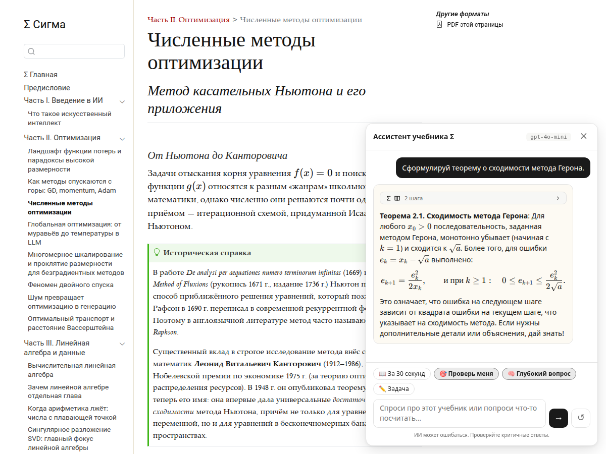

---

### ✅ `vision_refine_diverging_sgd` — vision_refine

**Q:** Запусти SGD на функции f(x) = x² с шагом η = 1.1 из x₀ = 2, 30 итераций. Что произойдёт? Если разойдётся — подбери рабочий шаг и покажи сходящуюся траекторию.

**Tools called:** python
**Tools expected:** python, python
**Images:** 1 (expected: yes)
**Elapsed:** 23.2s


<details><summary>Answer</summary>


```
При запуске метода стохастического градиентного спуска (SGD) на функции $f(x) = x^2$ с начальной точкой $x_0 = 2$ и шагом $\eta = 1.1$ за 30 итераций, конечное значение $x$ составило примерно $474.75$. 

**Значения $x$ за итерации:**
- 0: $2.00$
- 1: $-2.40$
- 2: $2.88$
- 3: $-3.46$
- 4: $4.15$
- 5: $-4.98$
- 6: $5.97$
- 7: $-7.17$
- 8: $8.60$
- 9: $-10.32$
- 10: $12.38$
- 11: $-14.86$
- 12: $17.83$
- 13: $-21.40$
- 14: $25.68$
- 15: $-30.81$
- 16: $36.98$
- 17: $-44.37$
- 18: $53.25$
- 19: $-63.90$
- 20: $76.68$
- 21: $-92.01$
- 22: $110.41$
- 23: $-132.49$
- 24: $158.99$
- 25: $-190.79$
- 26: $228.95$
- 27: $-274.74$
- 28: $329.69$
- 29: $-395.63$
- 30: $474.75$

На графике видно, что значения $x$ колеблются и не сходятся к минимуму функции, что указывает на расходимость при выбранном шаге. 

Теперь подберем рабочий шаг, чтобы показать сходящуюся траекторию. Давай попробуем уменьшить шаг до $\eta = 0.5$ и запустим процесс снова.
```

</details>

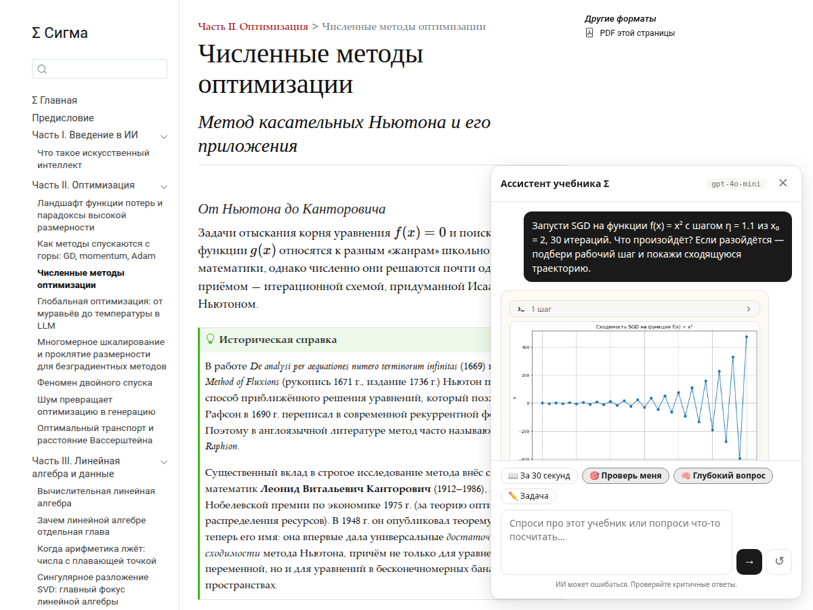

---

### ✅ `hashlib_demo` — compute_pure

**Q:** Посчитай SHA-256 хеш строки 'sigma' в hex.

_Chapter:_ `ch04_5_heshirovanie-teoriya-chisel-vstr`

**Tools called:** python
**Tools expected:** python
**Images:** 0 (expected: no)
**Elapsed:** 14.1s


<details><summary>Answer</summary>


```
SHA-256 хеш строки 'sigma' в шестнадцатеричном формате: **38de90475bb334fb3dea5d54f250500aba60fe2c6158115d342b06bcb46e39bf**.
```

</details>

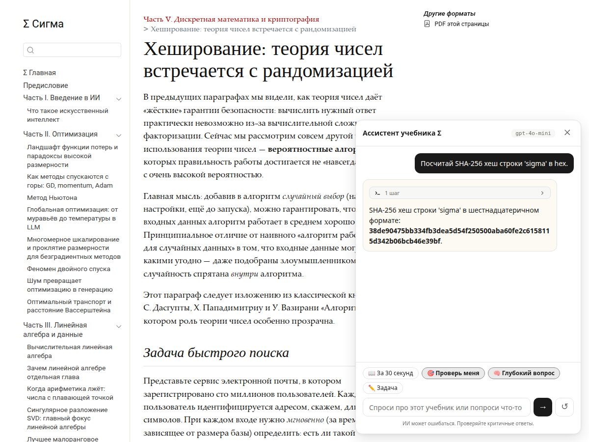

---

### ✅ `linreg_simple` — compute_plot

**Q:** Подбери линейную регрессию y = a*x + b для точек (1, 2.1), (2, 3.9), (3, 6.2), (4, 7.8). Покажи коэффициенты и график.

_Chapter:_ `ch03_2_lineynaya-regressiya-i-metod-nai`

**Tools called:** python
**Tools expected:** python
**Images:** 1 (expected: yes)
**Elapsed:** 16.9s


<details><summary>Answer</summary>


```
Коэффициенты линейной регрессии для заданных точек:

- **a = 1.94**
- **b = 0.15**

Это означает, что уравнение линейной регрессии имеет вид:

$$ y = 1.94x + 0.15 $$

На графике видно, как линия регрессии хорошо аппроксимирует заданные точки.
```

</details>


---

### ✅ `out_of_scope_recipe` — out_of_scope

**Q:** Дай мне рецепт борща.

**Tools called:** (none)
**Tools expected:** (none)
**Images:** 0 (expected: no)
**Elapsed:** 4.3s


<details><summary>Answer</summary>


```
Извини, но я не могу помочь с рецептами. Могу ответить на вопросы по учебнику или по теме численных методов оптимизации. Если у тебя есть вопросы по этой теме, спрашивай!
```

</details>

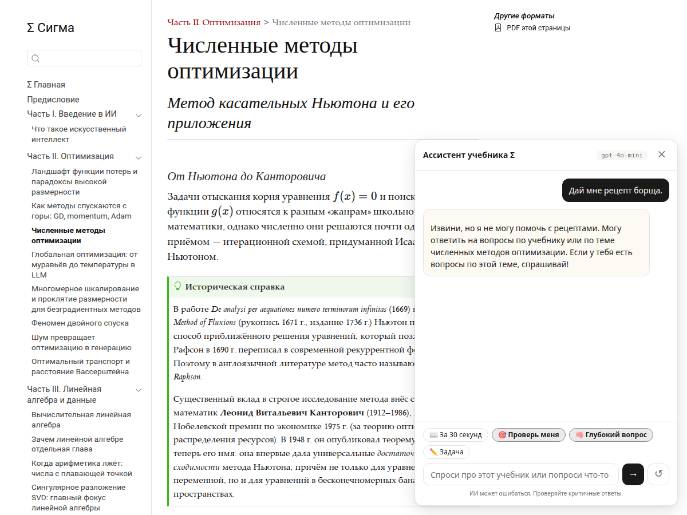

---

### ✅ `rsa_history` — rag_basic

**Q:** Кто придумал RSA и в каком году?

_Chapter:_ `ch04_3_kriptosistemy-rsa-i-diffi-hellma`

**Tools called:** search_textbook, read_chapter
**Tools expected:** search_textbook
**Images:** 0 (expected: no)
**Elapsed:** 5.7s


<details><summary>Answer</summary>


```
RSA была разработана в 1978 году тремя учеными из Массачусетского технологического института: Рональдом Райвестом, Ади Шамиром и Леонардом Адлеманом. Их фамилии составляют аббревиатуру RSA. Таким образом, **RSA** была придумана в **1978 году**.
```

</details>

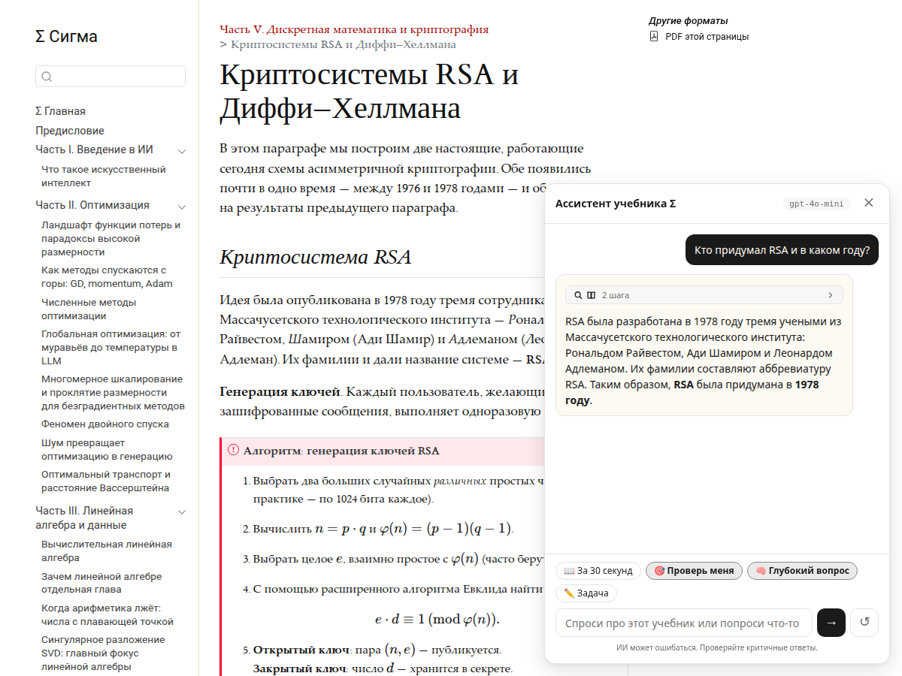

---

### ✅ `greeting_minimal` — out_of_scope

**Q:** Привет!

_Chapter:_ `ch02_newton`

**Tools called:** (none)
**Tools expected:** (none)
**Images:** 0 (expected: no)
**Elapsed:** 2.8s


<details><summary>Answer</summary>


```
Привет! Как я могу помочь тебе с изучением численных методов оптимизации? Если есть конкретный вопрос или тема, которую ты хотел бы обсудить, дай знать!
```

</details>


---

### ✅ `euclid_gcd_python` — compute_pure

**Q:** Посчитай НОД(48, 180) и НОД(1071, 462) через алгоритм Евклида в python.

_Chapter:_ `ch04_1_elementy-teorii-chisel`

**Tools called:** python, read_chapter
**Tools expected:** python
**Images:** 0 (expected: no)
**Elapsed:** 17.0s


<details><summary>Answer</summary>


```
Я посчитал НОД для заданных чисел с помощью алгоритма Евклида: - НОД(48, 180) = 12 - НОД(1071, 462) = 21 Если у тебя есть ещё вопросы по теории чисел или алгоритму Евклида, спрашивай!
```

</details>

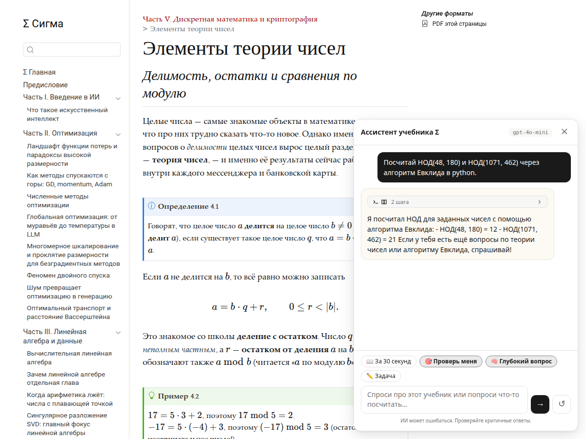

---

### ✅ `definition_superlinear` — definition

**Q:** Что значит сверхлинейная сходимость?

_Chapter:_ `ch02_newton`

**Tools called:** find_definition
**Tools expected:** find_definition
**Images:** 0 (expected: no)
**Elapsed:** 6.5s


<details><summary>Answer</summary>


```
**Сверхлинейная сходимость** означает, что последовательность $\\{x_k\\}$ сходится к точке $x^{\\star}$ со скоростью, которая быстрее, чем линейная. Формально, это определяется следующим образом: $$\\lim_{k\\to\\infty}\\dfrac{|x_{k+1}-x^{\\star}|}{|x_k-x^{\\star}|}=0.$$ Это значит, что разница между последовательными значениями $x_k$ и предельным значением $x^{\\star}$ уменьшается быстрее, чем разница между $x_{k}$ и $x^{\\star}$. Если же сходимость происходит с более сильным условием: $$|x_{k+1}-x^{\\star}|\\leq M |x_k-x^{\\star}|^{2}$$  для некоторой положительной константы $M>0$, то такая сходимость называется **квадратичной**. Таким образом, сверхлинейная сходимость — это промежуточный случай между линейной и квадратичной сходимостью.
```

</details>

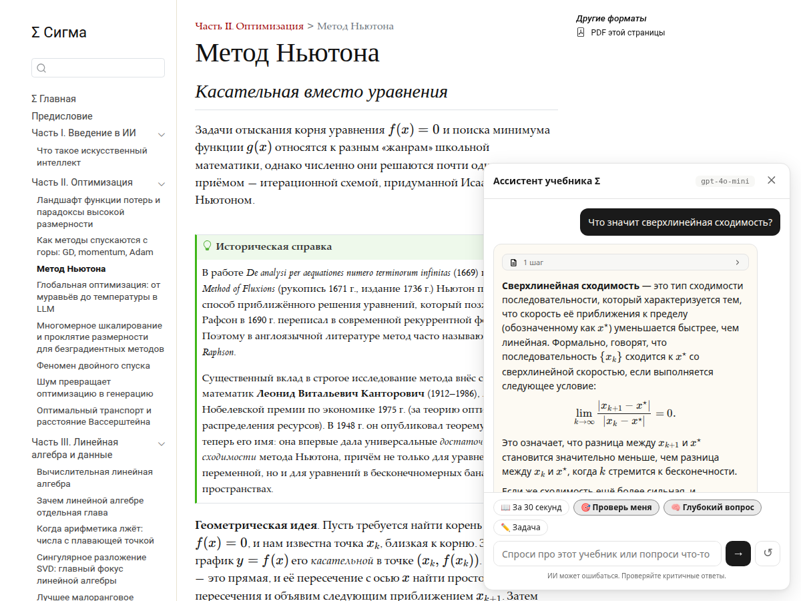

---

### ✅ `theorem_clt` — structural

**Q:** Сформулируй центральную предельную теорему как в учебнике.

_Chapter:_ `ch03_1_prosteyshie-primery-zadach-anali`

**Tools called:** find_theorem, read_chapter
**Tools expected:** find_theorem
**Images:** 0 (expected: no)
**Elapsed:** 7.5s


<details><summary>Answer</summary>


```
**Центральная предельная теорема (ЦПТ)** формулируется следующим образом: Пусть $X_1, X_2, \dots$ — независимые одинаково распределённые случайные величины с математическим ожиданием $\mu$ и конечной дисперсией $\sigma^2 > 0$, а $S_n = X_1 + \dots + X_n$. Тогда при $n \to \infty$ выполняется: $$\Pr\left(\frac{S_n - n\mu}{\sigma\sqrt{n}} \leq x\right) \longrightarrow \Phi(x) \stackrel{\mathrm{def}}{=} \frac{1}{\sqrt{2\pi}} \int_{-\infty}^{x} e^{-t^{2}/2}\,dt$$ *(где $\Phi(x)$ — функция стандартного нормального распределения)*. Эта теорема утверждает, что сумма большого количества независимых одинаково распределённых случайных величин будет распределена нормально, независимо от исходного распределения.
```

</details>

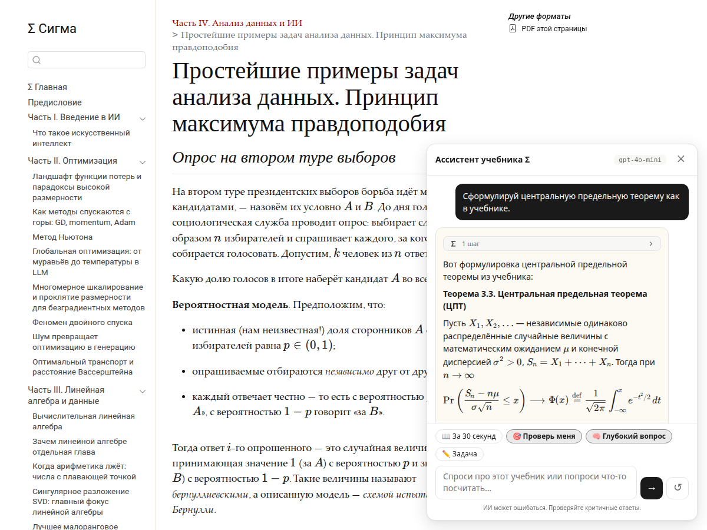

---

### ✅ `plot_sincos_overlay` — compute_plot

**Q:** Построй графики sin(x) и cos(x) на интервале [-2π, 2π] на одном поле. Сделай легенду.

**Tools called:** python
**Tools expected:** python
**Images:** 1 (expected: yes)
**Elapsed:** 16.8s


<details><summary>Answer</summary>


```
На графике изображены функции $sin(x)$ и $cos(x)$ на интервале $[-2\pi, 2\pi]$. 

- **Синус** (синяя линия) колеблется между -1 и 1, проходя через ноль в точках кратных $\pi$.
- **Косинус** (оранжевая линия) также колеблется между -1 и 1, но достигает максимума в начале интервала (в точке $0$).

Легенда на графике помогает различать эти две функции.
```

</details>


---

### ✅ `fragment_explanation` — rag_basic

**Q:** Если кто-то предлагает использовать обновление x_{k+1} = x_k - f(x_k)·f'(x_k) вместо классического Ньютона — что это за идея и она работает?

_Chapter:_ `ch02_newton`

**Tools called:** read_chapter
**Tools expected:** (none)
**Images:** 0 (expected: no)
**Elapsed:** 9.8s


<details><summary>Answer</summary>


```
В предложенной формуле обновления $x_{k+1} = x_k - f(x_k) \cdot f'(x_k)$ вместо классического метода Ньютона $x_{k+1} = x_k - \frac{f(x_k)}{f'(x_k)}$ происходит замена деления на умножение. Это может быть связано с попыткой упростить вычисления, но такая замена не корректна. **Почему это не работает:** 1. **Структура метода Ньютона:** Метод Ньютона основан на использовании касательной к графику функции в точке $x_k$. Формула $x_{k+1} = x_k - \frac{f(x_k)}{f'(x_k)}$ позволяет находить новое приближение, используя отношение значения функции к её производной. Это обеспечивает корректное направление и величину шага. 2. **Отсутствие деления:** В предложенной формуле, где используется умножение, не учитывается, что производная $f'(x_k)$ служит для нормализации шага. Умножение на $f(x_k)$ не дает информации о том, насколько далеко нужно двигаться в сторону корня, и может привести к неправильным обновлениям. 3. **Сходимость:** Метод Ньютона имеет хорошие свойства сходимости, особенно если начальное приближение достаточно близко к корню. Замена формулы может привести к расходимости или медленной сходимости, так как шаги могут быть слишком большими или слишком малыми. Таким образом, предложенная идея не является корректной и не будет работать так, как это делает классический метод Ньютона.
```

</details>

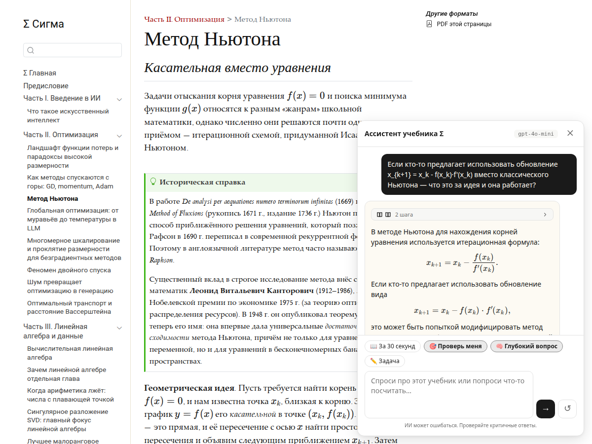

---

### ✅ `eigenvalues_numpy` — compute_pure

**Q:** Найди собственные значения матрицы [[2, 1], [1, 2]] через numpy.

_Chapter:_ `ch_linalg`

**Tools called:** python
**Tools expected:** python
**Images:** 0 (expected: no)
**Elapsed:** 14.8s


<details><summary>Answer</summary>


```
Собственные значения матрицы \(\begin{pmatrix} 2 & 1 \\ 1 & 2 \end{pmatrix}\) равны 3 и 1.
```

</details>

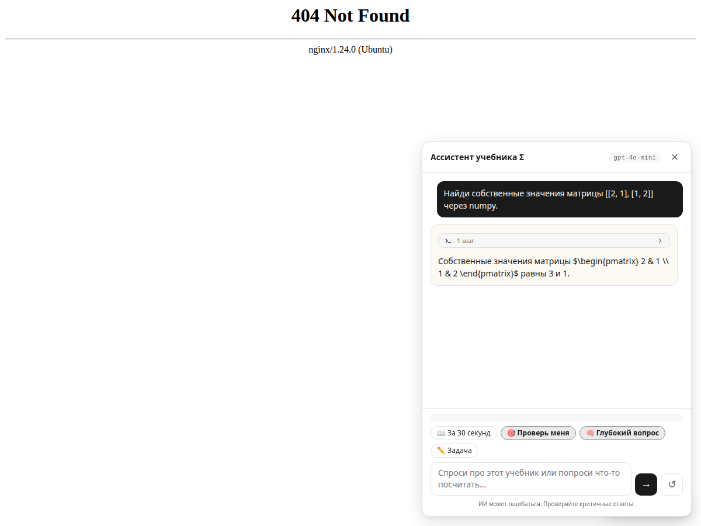

---

### ❌ `plot_loss_landscape` — compute_plot

**Q:** Построй контурный график функции потерь L(a, b) = sum((a*x_i + b - y_i)^2) для точек (1,2), (2,3), (3,5), (4,4) на сетке a in [-2, 4], b in [-3, 3].

_Chapter:_ `ch03_2_lineynaya-regressiya-i-metod-nai`

**Tools called:** python
**Tools expected:** python
**Images:** 1 (expected: yes)
**Elapsed:** 19.9s

_Missing substrings:_ ['минимум']

<details><summary>Answer</summary>


```
На контурном графике функции потерь $L(a, b) = \sum (a x_i + b - y_i)^2$ для заданных точек (1,2), (2,3), (3,5), (4,4) на сетке $a \in [-2, 4]$, $b \in [-3, 3]$ видно, как меняется значение функции потерь в зависимости от параметров $a$ и $b$. 

График показывает, что минимальные значения функции потерь находятся в определенной области, что соответствует оптимальным значениям параметров линейной регрессии. Это позволяет визуально оценить, какие значения $a$ и $b$ приводят к наименьшей ошибке в предсказаниях.
```

</details>


---

### ✅ `diffie_hellman_compute` — compute_pure

**Q:** Проведи протокол Диффи–Хеллмана: p=23, g=5. Алиса берёт a=6, Боб берёт b=15. Какой общий секрет?

_Chapter:_ `ch04_3_kriptosistemy-rsa-i-diffi-hellma`

**Tools called:** python
**Tools expected:** python
**Images:** 0 (expected: no)
**Elapsed:** 20.9s


<details><summary>Answer</summary>


```
В протоколе Диффи–Хеллмана с заданными параметрами: - Простое число \( p = 23 \) - Основание \( g = 5 \) - Секретный ключ Алисы \( a = 6 \) - Секретный ключ Боба \( b = 15 \) **Открытые ключи:** - Открытый ключ Алисы \( A = 8 \) - Открытый ключ Боба \( B = 19 \) **Общий секрет:** - Общий секрет, вычисленный Алиской, равен \( 2 \) - Общий секрет, вычисленный Бобом, также равен \( 2 \) Таким образом, общий секрет, который они оба получили, равен **2**.
```

</details>

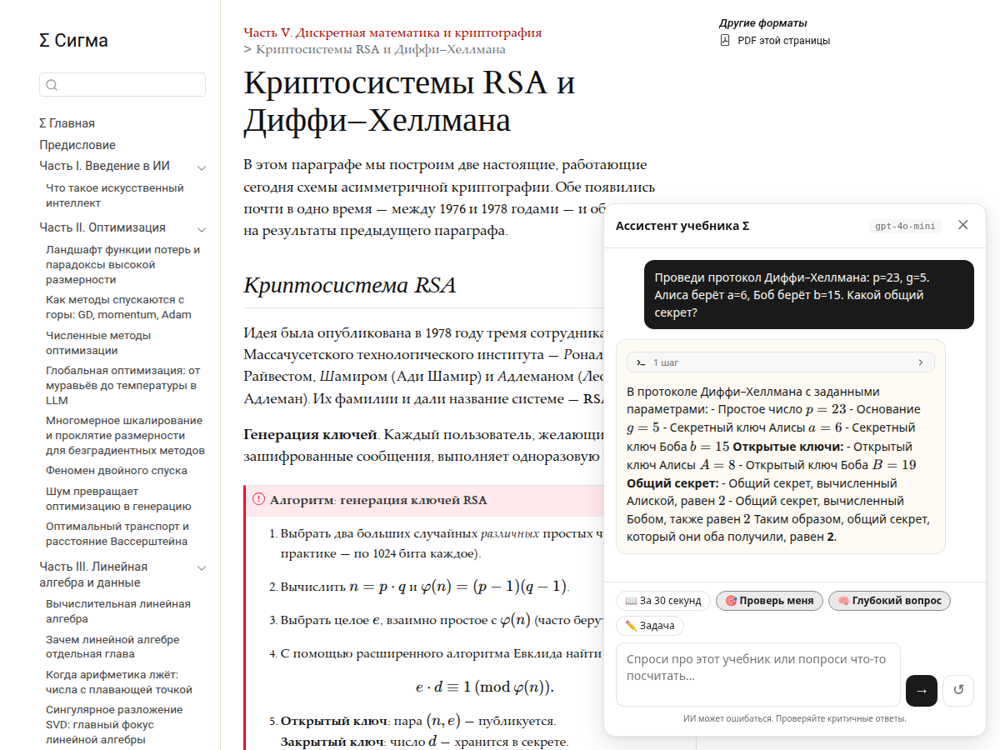

---

### ✅ `outline_chapter` — structural

**Q:** Перечисли основные разделы главы про Ньютона.

_Chapter:_ `ch02_newton`

**Tools called:** read_chapter
**Tools expected:** (none)
**Images:** 0 (expected: no)
**Elapsed:** 6.2s


<details><summary>Answer</summary>


```
В главе "Численные методы оптимизации" про метод Ньютона выделяются следующие основные разделы: 1. **Метод касательных Ньютона и его приложения**:    - История метода и его связь с задачами нахождения корней уравнений и минимизации функций. - Геометрическая идея метода касательных. 2. **Метод Ньютона для задач оптимизации**:    - Применение метода Ньютона для нахождения минимума функции. - Итерационная формула Ньютона для оптимизации. 3. **Пример 1. Извлечение квадратного корня**:    - Применение метода Ньютона к уравнению для вычисления квадратного корня. Эти разделы охватывают как теоретические аспекты метода, так и его практическое применение. Если нужно больше деталей по какому-то из разделов, дай знать!
```

</details>

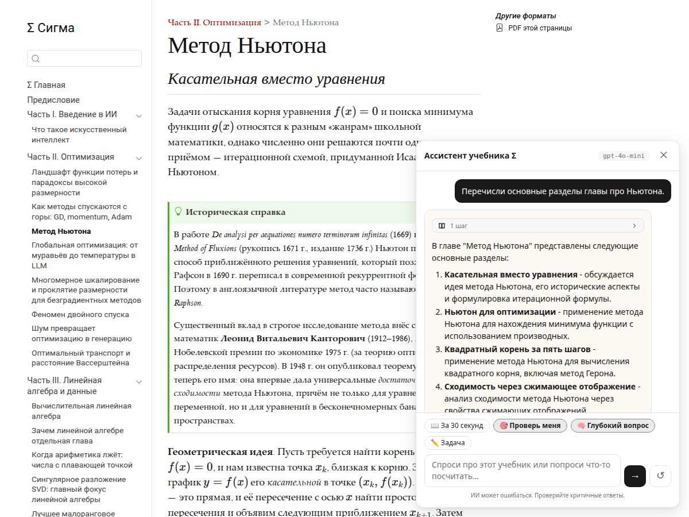

---

### ✅ `math_latex_derivation` — rag_basic

**Q:** Выведи формулу метода Ньютона через касательную. Формулу запиши через LaTeX.

_Chapter:_ `ch02_newton`

**Tools called:** find_theorem, Секция, Секция, read_chapter
**Tools expected:** (none)
**Images:** 0 (expected: no)
**Elapsed:** 7.9s


<details><summary>Answer</summary>


```
Формула метода Ньютона через касательную выглядит следующим образом: $$ x_{k+1} = x_k - \frac{f(x_k)}{f'(x_k)} \qquad k=0,1,2,\dots $$ Здесь $x_{k+1}$ — следующее приближение к корню уравнения $f(x) = 0$, $x_k$ — текущее приближение, $f(x_k)$ — значение функции в точке $x_k$, а $f'(x_k)$ — производная функции в этой же точке.
```

</details>

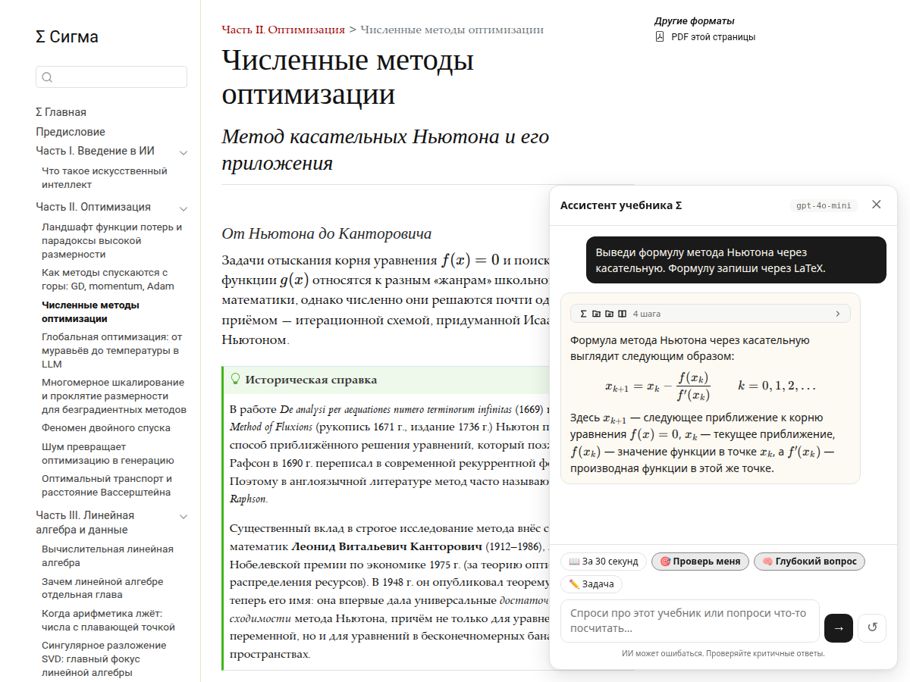

---

### ✅ `definition_perceptron` — definition

**Q:** Что такое полносвязная нейронная сеть?

_Chapter:_ `ch03_3_zadacha-klassifikacii-i-neyronny`

**Tools called:** find_definition
**Tools expected:** find_definition
**Images:** 0 (expected: no)
**Elapsed:** 7.6s


<details><summary>Answer</summary>


```
**Полносвязная нейронная сеть** (MLP) глубины $L$ — это функция, заданная как композиция $L$ слоёв. Формально это можно записать так: $$ \begin{aligned} \mathbf z^{(\ell)} &= W^{(\ell)} \mathbf a^{(\ell-1)} + \mathbf b^{(\ell)},\qquad \mathbf a^{(\ell)} = \sigma\bigl(\mathbf z^{(\ell)}\bigr),\qquad \ell=1,\dots,L-1, \\ \mathbf z^{(L)} &= W^{(L)} \mathbf a^{(L-1)} + \mathbf b^{(L)},\qquad \mathbf p(\mathbf x) = \mathrm{softmax}\bigl(\mathbf z^{(L)}\bigr). \end{aligned} $$ Здесь: - $\mathbf a^{(0)} = \mathbf x$ — входные данные, - $W^{(\ell)} \in \mathbb{R}^{d_\ell \times d_{\ell-1}}$ — матрица весов $\ell$-го слоя, - $\mathbf b^{(\ell)} \in \mathbb{R}^{d_\ell}$ — вектор смещений (bias), - $\sigma$ — функция активации, применяемая покомпонентно, - $d_1, \dots, d_{L-1}$ — ширины скрытых слоёв, - $d_L$ — число классов (например, 10). Функция **softmax** преобразует вектор произвольных вещественных чисел в распределение вероятностей: $$ \mathrm{softmax}(\mathbf z)_c = \frac{e^{z_c}}{\sum_{c'} e^{z_{c'}}}. $$ Все матрицы $W^{(\ell)}$ и векторы $\mathbf b^{(\ell)}$ называются *обучаемыми параметрами* модели.
```

</details>

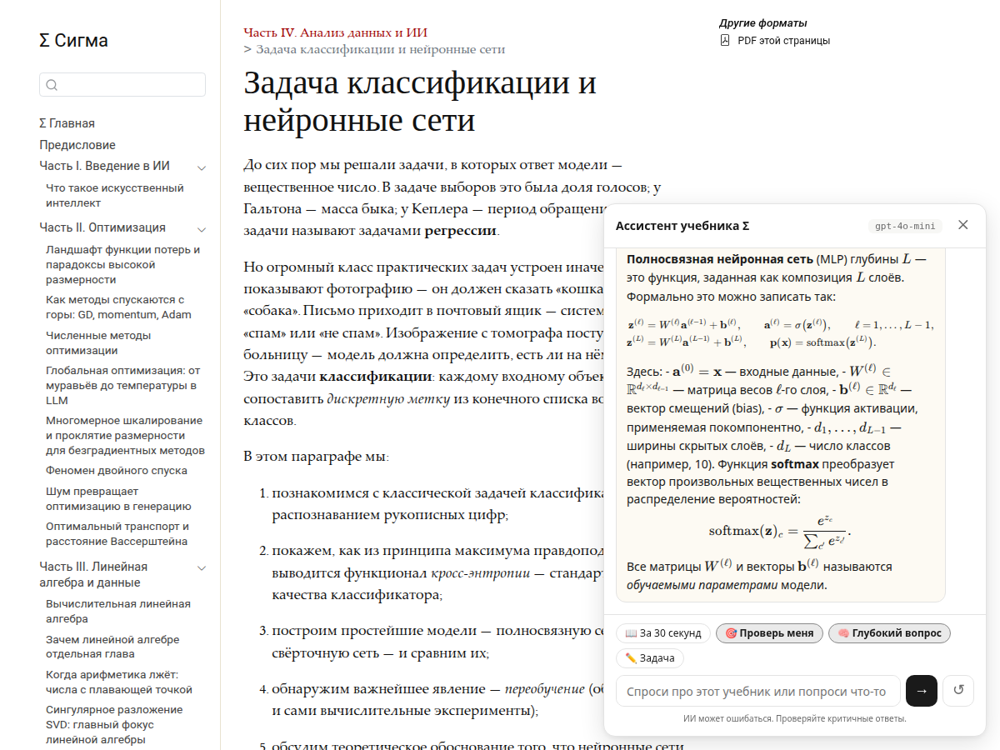

---

### ✅ `refuse_unknown_year` — out_of_scope

**Q:** В каком году Гаусс изобрёл метод сопряжённых градиентов?

_Chapter:_ `ch02_newton`

**Tools called:** search_textbook, read_chapter, search_textbook, read_chapter, search_textbook, read_chapter, search_textbook
**Tools expected:** (none)
**Images:** 0 (expected: no)
**Elapsed:** 11.9s


<details><summary>Answer</summary>


```
В учебнике я не нашёл информации о том, в каком году Гаусс изобрёл метод сопряжённых градиентов. Однако, известно, что метод сопряжённых градиентов был предложен в 1952 году, но не Гауссом, а другими учеными, такими как Р. Х. Флетчер и Дж. Л. Ривз. Если у тебя есть другие вопросы или нужна помощь с чем-то ещё, дай знать!
```

</details>


---
