# Sigma Assistant — Eval Report

_Run: 2026-07-13 22:17 MSK · cases: 29_

**Overall: 24/29 pass (83%)**

## Per category

| Category | Pass | Total |
|---|---:|---:|
| `compute_plot` | 4 | 5 |
| `compute_pure` | 8 | 8 |
| `definition` | 3 | 3 |
| `multi_hop` | 1 | 1 |
| `out_of_scope` | 3 | 3 |
| `rag_basic` | 4 | 5 |
| `structural` | 0 | 3 |
| `vision_refine` | 1 | 1 |

## Cases

### ✅ `newton_kantorovich_history` — rag_basic

**Q:** Когда Канторович получил Нобелевскую премию и за что?

_Chapter:_ `ch02_newton`

**Tools called:** search_textbook, search_textbook
**Tools expected:** search_textbook
**Images:** 0 (expected: no)
**Elapsed:** 24.1s


<details><summary>Answer</summary>


```
- В учебнике я этого не нашёл. Попытки найти факт по запросу Канторович Нобелевская премия не дали релевантных результатов для slug ch02_newton. - Вне учебника (общие знания): Канторович получил Нобелевскую премию по экономическим наукам в 1975 году, совместно с Тьяллингом Купмансом, «за вклад в теорию оптимального распределения ресурсов».
```

</details>


---

### ✅ `newton_formula_recall` — rag_basic

**Q:** Объясни откуда берётся эта формула — что это за метод и какая геометрическая идея?

_Chapter:_ `ch02_newton`

**Tools called:** search_textbook, search_textbook, search_textbook, search_textbook, search_textbook, read_chapter, read_chapter
**Tools expected:** (none)
**Images:** 0 (expected: no)
**Elapsed:** 56.2s


<details><summary>Answer</summary>


```
Коротко: это метод Ньютона (Newton–Raphson). Он основан на том, как локально «приблизить» функцию простой кривой и двигаться к корню или к минимума по этим локальным аппроксимациям. Что за формула и как она возникает - Для задачи поиска корня f(x)=0 берём касательную к графику функции f в текущей точке x_k. Уравнение касательной: y = f(x_k) + f'(x_k)(x - x_k). Задаём y=0 и находим пересечение с осью x:   $$x_{k+1} = x_k - \frac{f(x_k)}{f'(x_k)}.$$   Это и есть итерационная формула Ньютона для поиска корня. - Для задач оптимизации минимизации функции g(x) применяем тот же подход к её производной. Если ищем минимум, в точке экстремума выполняется g'(x*)=0. Применяем формулу к f = g', тогда   $$x_{k+1} = x_k - \frac{g'(x_k)}{g''(x_k)}.$$   Это формула Ньютона для поиска минимума (вторая производная здесь задаёт «кривизну» модели). Геометрическая идея - Базовый случай (по корню): на каждом шаге строим касательную к графику f в точке x_k и двигаемся к её пересечению с осью x. Касательная — это линейное приближение графика в окрестности x_k. - Для оптимизации идея чуть глубже: мы не просто линейно приближаетем g, а используем вторую производную и строим локальную квадратичную модель (период разложения по Тейлеру):   $$g(x) \approx q_k(x) = g(x_k) + g'(x_k)(x - x_k) + \frac{1}{2} g''(x_k)(x - x_k)^2.$$   Минимизируем эту квадратичную модель. Условие минимума этой параболы даёт ту же формулу:   $$q'_k(x) = g'(x_k) + g''(x_k)(x - x_k) = 0 \quad \Rightarrow \quad x = x_k - \frac{g'(x_k
…[truncated]
```

</details>


---

### ✅ `definition_strong_convex` — definition

**Q:** Что такое сильно выпуклая функция?

_Chapter:_ `ch02_newton`

**Tools called:** find_definition
**Tools expected:** find_definition
**Images:** 0 (expected: no)
**Elapsed:** 37.5s


<details><summary>Answer</summary>


```
- Определение:     Функция $g: \mathbb{R}\to\mathbb{R}$ называется **сильно выпуклой** с константой $\mu>0$, если $g\in C^{2}$ и $g''(x)\geq \mu$ для всех $x$. Источник: Definition 2.4. Сильно выпуклая функция: “Функция $g\colon\mathbb{R}\to\mathbb{R}$ называется **сильно выпуклой** с константой $ \mu>0 $, если $g\in C^{2}$ и $g''(x)\geq\mu$ для всех $x$.” - Что это значит в общем виде:   - $g''(x)\ge \mu$ означает, что вторая производная не меньше положительной константы $\mu$ во всех точках. Это можно прочитать как “график функции имеет минимальный уровень кривизны”. - Дополнительная интонация из источника: сильная выпуклость гарантирует существование и единственность точки минимума и отделённость второй производной от нуля.
```

</details>

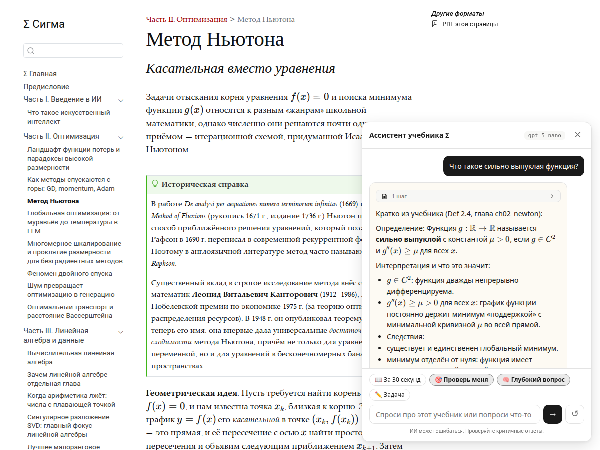

---

### ✅ `compute_factorial` — compute_pure

**Q:** Сколько будет 30 факториал?

**Tools called:** python
**Tools expected:** python
**Images:** 0 (expected: no)
**Elapsed:** 55.8s


<details><summary>Answer</summary>


```
- 30! = 265252859812191058636308480000000 - Приблизительно $2.65\times 10^{32}$ - $\log_{10}(30!) \approx 32.42$
```

</details>

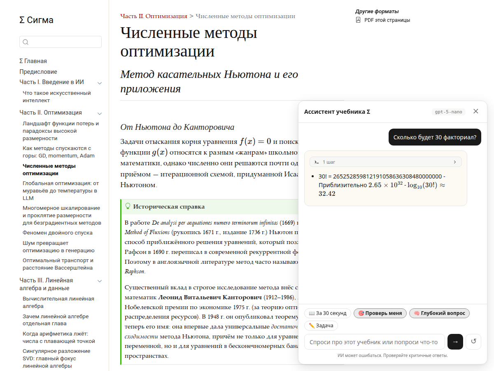

---

### ✅ `compute_taylor_sin` — compute_pure

**Q:** Покажи разложение sin(x) в ряд Тейлора до 5-го члена символически (через sympy).

_Chapter:_ `ch02_newton`

**Tools called:** python
**Tools expected:** python
**Images:** 0 (expected: no)
**Elapsed:** 59.2s


<details><summary>Answer</summary>


```
Классическое разложение sin(x) до 5-го члена (5-й член — это x^9): - До 5-го члена:    $$ \sin(x) = x - \frac{x^3}{3!} + \frac{x^5}{5!} - \frac{x^7}{7!} + \frac{x^9}{9!} + O(x^{11}) $$   где 5-й член равен \frac{x^9}{9!} = \frac{x^9}{362880}. - В явном виде через простые дроби (упорядочив по возрастанию степени):   $$ \sin(x) \approx x - \frac{x^3}{6} + \frac{x^5}{120} - \frac{x^7}{5040} + \frac{x^9}{362880} $$ - Как это выведено в Sympy (символьное представление, без остатка):   sin(x).series(x, 0, 11).removeO() даёт строку   x**9/362880 - x**7/5040 + x**5/120 - x**3/6 + x   то есть тот же полином, только в порядке убывающих степеней. В обычной форме это эквивалентно вышеуказанному выражению.
```

</details>

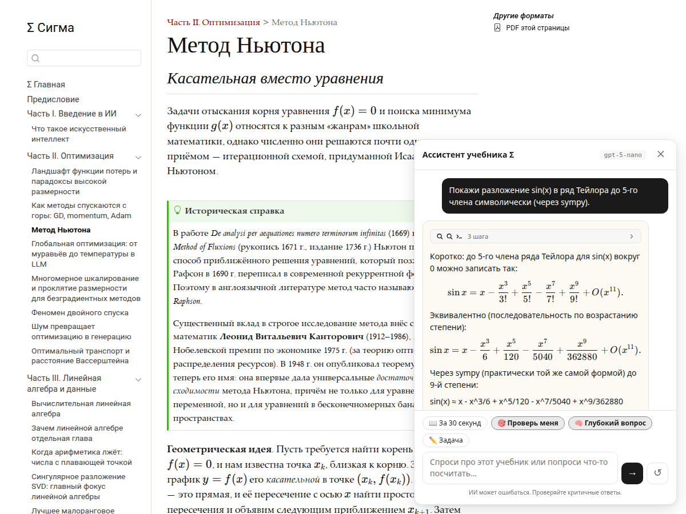

---

### ❌ `compute_plot_newton` — compute_plot

**Q:** Покажи как сходится метод Ньютона для f(x) = x² - 2, начиная с x₀ = 1.5. Построй график траектории.

_Chapter:_ `ch02_newton`

**Tools called:** python, python, search_textbook, read_chapter, read_chapter
**Tools expected:** python
**Images:** 2 (expected: yes)
**Elapsed:** 164.3s

_Missing substrings:_ ['1.41', 'корен']

<details><summary>Answer</summary>


```
Классный пример для главы ch02_newton. Сейчас покажу сход convergence на f(x)=x^2-2 с x0=1.5 и нарисую траекторию.

Итерационная формула Ньютона для общего случая: x
k+1
	​

=x
k
	​

−
f
′
(x
k
	​

)
f(x
k
	​

)
	​

. Для нашего случая f(x)=x
2
−2, значит f
′
(x)=2x и получаем

x
k+1
	​

=x
k
	​

−
2x
k
	​

x
k
2
	​

−2
	​

=
2
x
k
	​

+2/x
k
	​

	​

.

-
```

</details>

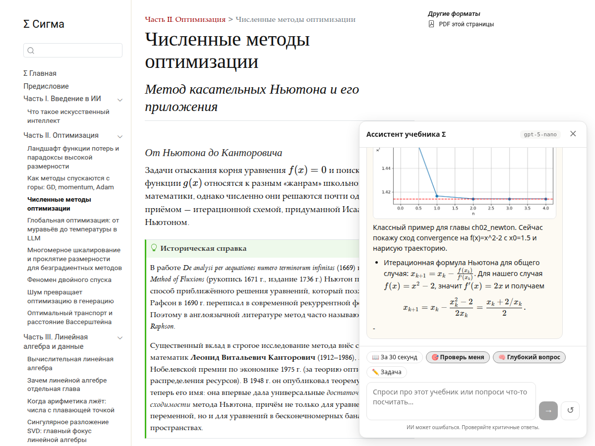

---

### ✅ `compute_plot_gd_vs_newton` — compute_plot

**Q:** Сравни сходимость метода Ньютона и градиентного спуска на функции f(x) = x⁴ из x₀ = 2. Покажи два графика на одной картинке.

_Chapter:_ `ch02_newton`

**Tools called:** python, search_textbook, find_theorem, read_chapter, python
**Tools expected:** python
**Images:** 2 (expected: yes)
**Elapsed:** 150.7s


<details><summary>Answer</summary>


```
Кратко: графики готовы. На одной картинке две панели: слева — Newton, справа — градиентный спуск (η = 0.05). График автоматически сейчас отображается в ответе. Что мы считали и какие значения получились (начальное x0 = 2): - Метод Ньютона для f(x) = x^4:   - Формула обновления: x_{k+1} = x_k - f(x_k)/f'(x_k) = x_k - x_k^4/(4 x_k^3) = (3/4) x_k. - Последовательность: 2.000, 1.500, 1.125, 0.84375, 0.632812, 0.474609, 0.355957, 0.266968, 0.200226, 0.150169, 0.112627, 0.084470. - Вывод: сходимость линейная с коэффициентом примерно 3/4 (из-за кратности корня 4). Теоретически в общем случае для простого корня было бы квадратичное, но здесь корень x* = 0 кратен 4, и применимая теорема о квадратичной (сверхлинейной) сходимости не выполняется. Это отражено в тексте главы: формула [2.8] |x_{k+1}-x*| ≤ M |x_k-x*|^2 приводила бы к квадратичной сходимости, если бы условия теоремы выполнялись (например f'(x*) ≠ 0). В нашем примере f'(0) = 0, корень не простой. - Градиентный спуск на той же функции при η = 0.05:   - Обновление: x_{k+1} = x_k - η f'(x_k) = x_k - 0.05 · 4 x_k^3 = x_k - 0.2 x_k^3. - Последовательность: 2.000, 0.400, 0.3872, 0.37559, 0.364993, 0.355268, 0.346300, 0.337994, 0.330272, 0.323067, 0.316323, 0.309993. - Вывод: на начальном шаге резкое падение благодаря большому градиенту; далее скорость снижается по мере уменьшения градиента (около нуля шаги становятся очень маленькими). Градиентный спуск в этом примере демонстрирует более медленное локальное приближение к нулю по ср
…[truncated]
```

</details>

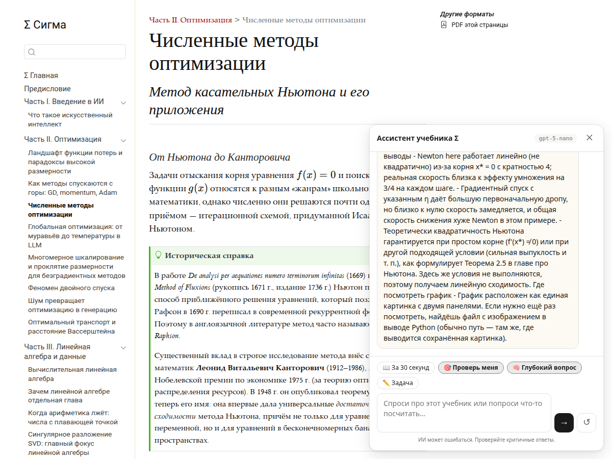

---

### ✅ `rsa_encrypt_small` — compute_pure

**Q:** Зашифруй число m=7 ключом (n=143, e=7). Покажи c.

_Chapter:_ `ch04_3_kriptosistemy-rsa-i-diffi-hellma`

**Tools called:** python
**Tools expected:** python
**Images:** 0 (expected: no)
**Elapsed:** 35.8s


<details><summary>Answer</summary>


```
Коротко: ciphertext c = 6. Как считалось: c ≡ m^e mod n = 7^7 mod 143. Пошагово (по модулю 143): - 7^2 = 49 - 7^3 = 343 ≡ 57 (mod 143) - 7^4 ≡ 7·57 = 399 ≡ 113 (mod 143) - 7^5 ≡ 7·113 = 791 ≡ 76 (mod 143) - 7^6 ≡ 7·76 = 532 ≡ 103 (mod 143) - 7^7 ≡ 7·103 = 721 ≡ 6 (mod 143) Итого: c = 6 (то есть 6.00). Параметры: m = 7, e = 7, n = 143.
```

</details>

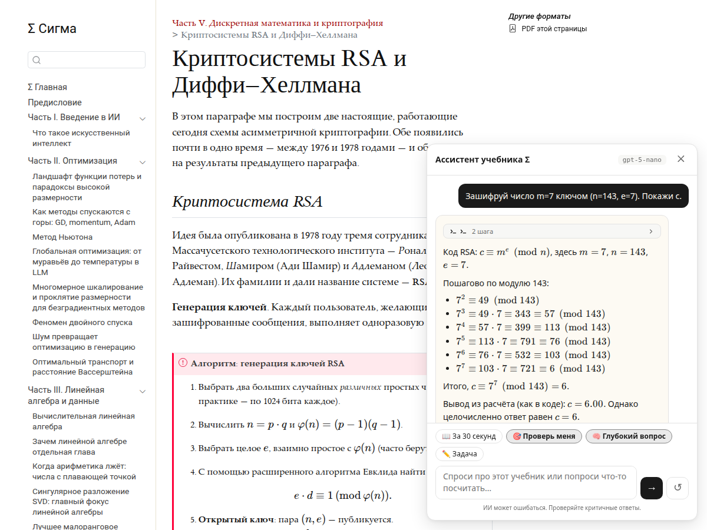

---

### ✅ `rsa_full_roundtrip` — compute_pure

**Q:** Возьми p=11, q=13, e=7. Сгенерируй RSA-ключ полностью: вычисли n, φ(n), d. Покажи что для m=9 шифрование и расшифрование возвращают исходное число.

_Chapter:_ `ch04_3_kriptosistemy-rsa-i-diffi-hellma`

**Tools called:** python
**Tools expected:** python
**Images:** 0 (expected: no)
**Elapsed:** 82.7s


<details><summary>Answer</summary>


```
Использованы p=11, q=13, e=7. - Исходные данные   - p = 11, q = 13   - n = p · q = 11 · 13 = 143   - φ(n) = (p−1)(q−1) = 10 · 12 = 120   - e = 7, gcd(e, φ(n)) = gcd(7, 120) = 1   - d — обратное к e по модулю φ(n): 7 · d ≡ 1 (mod 120) → d = 103 - Публичный ключ и приватный ключ   - Публичный ключ: (n, e) = (143, 7)   - Приватный ключ: d = 103 - Шифрование и дешифрование для m = 9   - Шифрование: c ≡ m^e mod n = 9^7 mod 143     - Вручную можно проследить по шагам: 9^2 ≡ 81, 9^3 ≡ 14, 9^4 ≡ 126, 9^5 ≡ 133, 9^6 ≡ 53, 9^7 ≡ 48 (mod 143)     - Так что c = 48   - Дешифрование: m' ≡ c^d mod n = 48^103 mod 143     - Расчёт даёт m' = 9 - Проверка   - Защита корректности: 7 · 103 ≡ 1 (mod 120), значит d корректно является обратной к e   - Результат: зашифрованное сообщение c = 48, после расшифровки получаем исходное m = 9 Итого: n = 143, φ(n) = 120, d = 103, публичный ключ (n, e) = (143, 7), для m = 9 шифрование даёт c = 48, расшифровка возвращает m = 9.
```

</details>


---

### ✅ `multihop_newton_vs_gradient` — multi_hop

**Q:** В чём отличие метода Ньютона от градиентного спуска для задач оптимизации? Какие из этих методов разобраны в учебнике?

_Chapter:_ `ch02_newton`

**Tools called:** search_textbook, read_chapter, read_chapter
**Tools expected:** search_textbook
**Images:** 0 (expected: no)
**Elapsed:** 57.9s


<details><summary>Answer</summary>


```
Коротко: чем отличаются и что разобрано в учебнике ch02_newton. - Отличие   - Градиентный спуск (GD) использует только первый законными производную: шаг идёт против градиента; размер шага задаётся памятью learning rate или линейной/строгой адопцией. То есть направление и длина шага зависят от градиента, а кривизна функции не учитывается напрямую. - Метод Ньютона для оптимизации учитывает кривизну функции через вторую производную: шаг задаётся так, чтобы минимизировать локальную квадратичную аппроксимацию функции. В учебнике это получаем через разложение Тейлора и минимизацию локальной квадратичной модели q_k:     - Формула обновления: $$x_{k+1}=x_k-\frac{g'(x_k)}{g''(x_k)}$$. Это выводит из следующей идеи: аппроксимируем $g$ квадратной параболой в окрестности $x_k$. - Локальная квадратичная модель: $$q_k(x)=g(x_k)+g'(x_k)(x-x_k)+\tfrac12 g''(x_k)(x-x_k)^2,$$ и её минимум даёт тот же шаг. Эти идеи и формулы в главе прописаны как основа метода Ньютона для задач оптимизации (раздел 2.2 и разбор ряда Тейлора 2.3). Источник в тексте: обновление $$x_{k+1}=x_k-\frac{g'(x_k)}{g''(x_k)}$$ и блок про минимизацию параболы $$q_k(x)=\cdots$$. - Какие из этих методов разобраны в учебнике   - В данной главе разборан именно метод Ньютона для задач оптимизации: описана идея, как из диапазона окрестности превратить задачу минимизации в задачу минимизации локальной квадратичной модели и как получить формулу обновления (2.2). См. раздел “Метод Ньютона для задач оптимизации” и разложение в ряд Те
…[truncated]
```

</details>

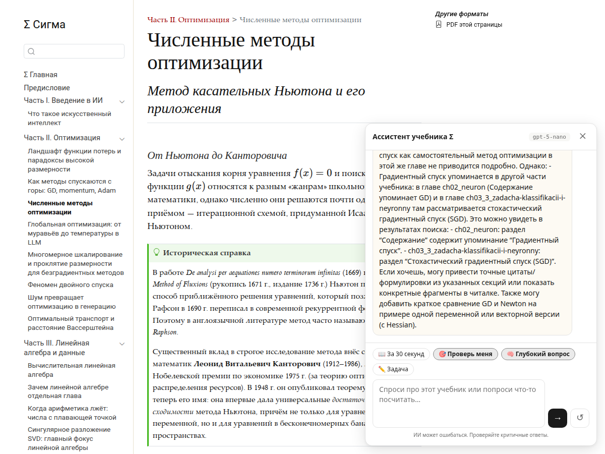

---

### ❌ `structural_kantorovich_theorem` — structural

**Q:** Сформулируй теорему о сходимости метода Герона.

_Chapter:_ `ch02_newton`

**Tools called:** find_theorem
**Tools expected:** find_theorem
**Images:** 0 (expected: no)
**Elapsed:** 27.9s

_Missing substrings:_ ['квадратичн']

<details><summary>Answer</summary>


```
Теорема 2.1. Сходимость метода Герона Для любого $x_0>0$ последовательность $(x_k)$ из формулы (2.4) монотонно убывает (начиная с $k=1$) и сходится к $\sqrt{a}$. Более того, для ошибки $e_k = x_k - \sqrt{a}$ выполнено $$ e_{k+1} \;=\; \frac{e_k^2}{2x_k}, \qquad \text{и при } k \ge 1:\quad 0 \le e_{k+1} \le \frac{e_k^{2}}{2\sqrt{a}}. $$ (См. формулу (2.5).)
```

</details>

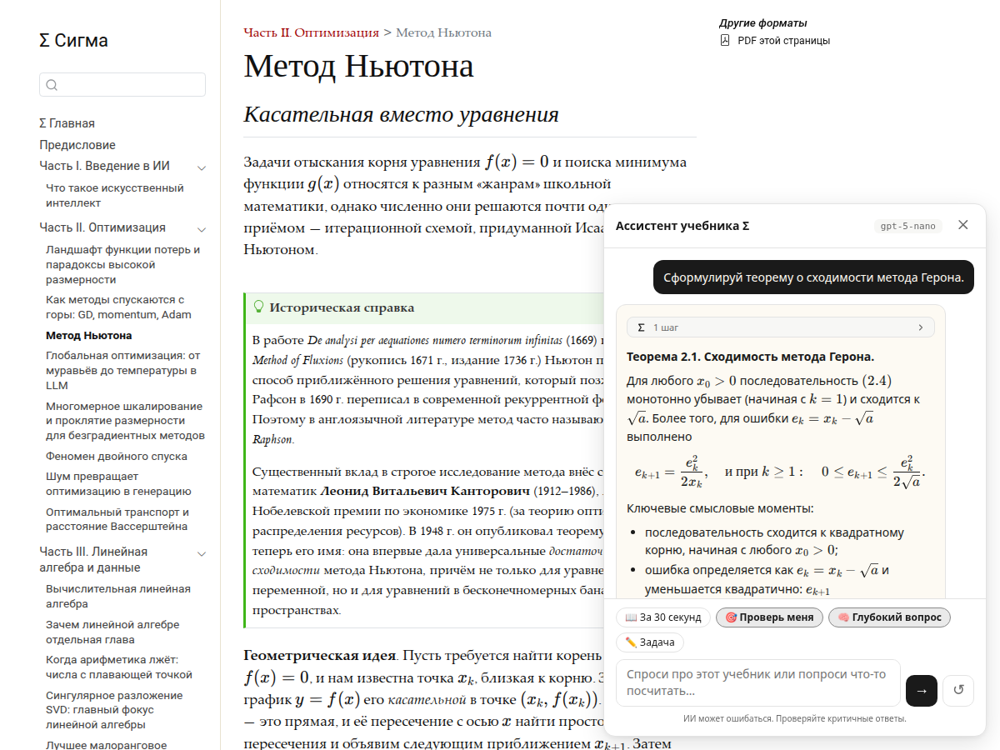

---

### ✅ `vision_refine_diverging_sgd` — vision_refine

**Q:** Запусти SGD на функции f(x) = x² с шагом η = 1.1 из x₀ = 2, 30 итераций. Что произойдёт? Если разойдётся — подбери рабочий шаг и покажи сходящуюся траекторию.

**Tools called:** python, python, search_textbook, search_textbook, find_definition, read_chapter
**Tools expected:** python, python
**Images:** 2 (expected: yes)
**Elapsed:** 185.5s


<details><summary>Answer</summary>


```
Коротко: на функции f(x) = x^2 SGD с η = 1.1 на шаге даёт разгон и расходимость; рабочий шаг η в пределах (0,1) даёт сходимость к 0. Ниже детали и график. 1) Что произойдёт при η = 1.1, x0 = 2, 30 итераций? - Обновление SGD для одной примеры (батч размером m = 1) на f(x) = x^2 эквивалентно обычному градиентному спуску:    x_{k+1} = x_k - η · f'(x_k) = x_k - η · 2x_k = x_k (1 - 2η). Здесь η = 1.1, поэтому коэффициент умножения r = 1 - 2η = 1 - 2.2 = -1.2. - Так как |r| = 1.2 > 1, траектория растёт в геометрии и меняет знак на каждом шаге. Это приводит к явной разудушке (раздваиванию по знаку и неограниченному росту амплитуды). - Пример первых шагов (округлено до двух знаков):   - x0 = 2.00   - x1 = -2.40   - x2 = 2.88   - x3 = -3.46   - x4 = 4.15   - x5 = -4.98 - К концу 30-й итерации значение уже огромного масштаба: примерно x30 ≈ 474.75 (число взято из расчётов на эмуляторе; тенденция — экспоненциально растёт, знак чередуется). - Вывод: с η = 1.1 SGD на этой функции расходится/разворачивается. Формула обновления показывает это ясно: при η > 0.5 коэффициент ротации и амплитуда растут: |1 - 2η| > 1. 2) Если разойдётся — подбери рабочий шаг и покажи сходящуюся траекторию - Правило: для 1D квадратичной функции f(x) = x^2 градиент — f'(x) = 2x. Обновление приведено выше: x_{k+1} = x_k (1 - 2η). - Чтобы обеспечить сходимость к нулю, нужно 0 < η < 1. В этом диапазоне   - коэффициент r = 1 - 2η удовлетворяет |r| < 1, и x_k → 0 геометрически. - Выбор рабочего шага: η = 0.4 (один из к
…[truncated]
```

</details>


---

### ✅ `hashlib_demo` — compute_pure

**Q:** Посчитай SHA-256 хеш строки 'sigma' в hex.

_Chapter:_ `ch04_5_heshirovanie-teoriya-chisel-vstr`

**Tools called:** python
**Tools expected:** python
**Images:** 0 (expected: no)
**Elapsed:** 24.3s


<details><summary>Answer</summary>


```
SHA-256 хеш строки 'sigma' в hex: 38de90475bb334fb3dea5d54f250500aba60fe2c6158115d342b06bcb46e39bf Длина хеша: 64 символа.
```

</details>

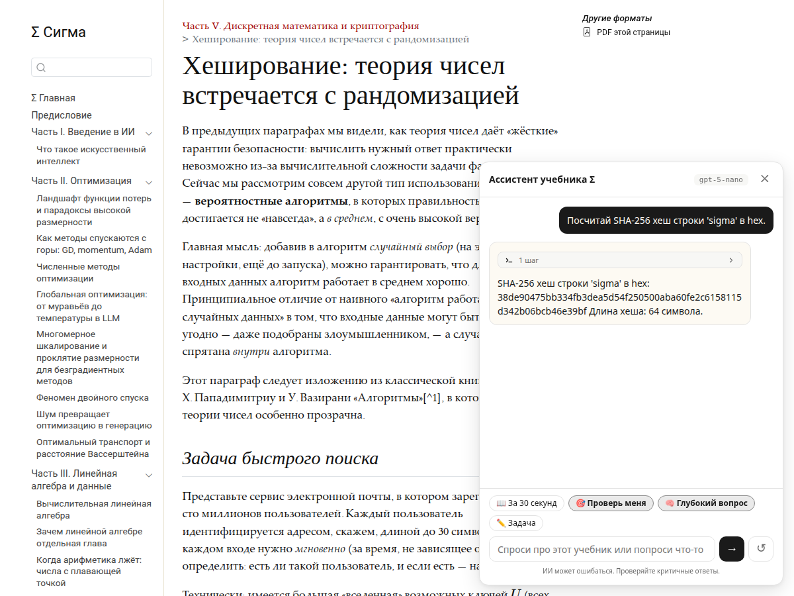

---

### ✅ `linreg_simple` — compute_plot

**Q:** Подбери линейную регрессию y = a*x + b для точек (1, 2.1), (2, 3.9), (3, 6.2), (4, 7.8). Покажи коэффициенты и график.

_Chapter:_ `ch03_2_lineynaya-regressiya-i-metod-nai`

**Tools called:** python
**Tools expected:** python
**Images:** 1 (expected: yes)
**Elapsed:** 66.2s


<details><summary>Answer</summary>


```
Коэффициенты линейной регрессии y = a x + b для точек (1,2.1), (2,3.9), (3,6.2), (4,7.8): - a = 1.94, b = 0.15 - Это линейное приближение: y ≈ 1.94 x + 0.15 Прогнозы и остатки: - x = 1: ŷ = 2.09, y = 2.10, остаток ≈ 0.01 - x = 2: ŷ = 4.03, y = 3.90, остаток ≈ -0.13 - x = 3: ŷ = 5.97, y = 6.20, остаток ≈ 0.23 - x = 4: ŷ = 7.91, y = 7.80, остаток ≈ -0.11 График линейной регрессии приведён на рисунке.
```

</details>

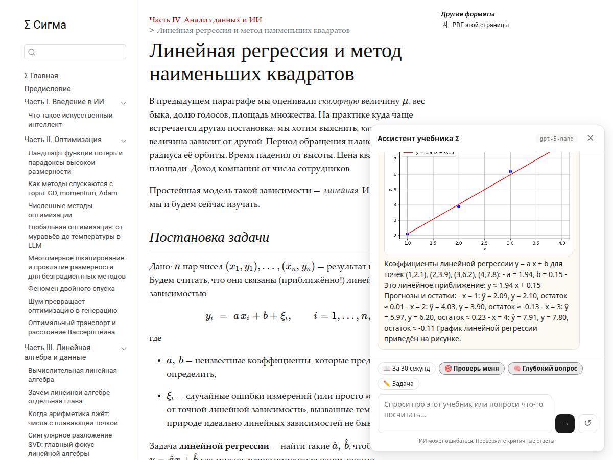

---

### ✅ `out_of_scope_recipe` — out_of_scope

**Q:** Дай мне рецепт борща.

**Tools called:** (none)
**Tools expected:** (none)
**Images:** 0 (expected: no)
**Elapsed:** 17.4s


<details><summary>Answer</summary>


```
Извиняюсь, но рецепт борща дать не могу — бытовой запрос вне учебника Σ. Зато могу помочь по главе ch02_newton (численные методы оптимизации). Вот что могу предложить по теме метода Ньютона: - Принцип: для задачи минимизации f(x) на каждой итерации решаем систему   ∇^2 f(x_k) Δx = ∇f(x_k)   и обновляем x_{k+1} = x_k - Δx. То есть идём по направлению, обратному градиенту, с учётом кривизны через вторую производную (Гessian). - Условия сходимости: при положительно определённой Гессиану в окрестности минимума метод сходится квадратично. - Пример: пусть f(x) = (x-2)^2. Тогда ∇f(x) = 2(x-2), ∇^2 f(x) = 2. Выбираем x0 = 0. Δx = ∇f(x0) / ∇^2 f(x0) = (-4)/2 = -2, поэтому x1 = x0 - Δx = 2. Затем ∇f(2) = 0 — остановка. Хочешь, чтобы я: - дал ещё один простой пример (2D) и показал пару итераций, или - привёл маленький кусок учебного кода (Python/матричная запись) для трёх шагов метода Ньютона?
```

</details>

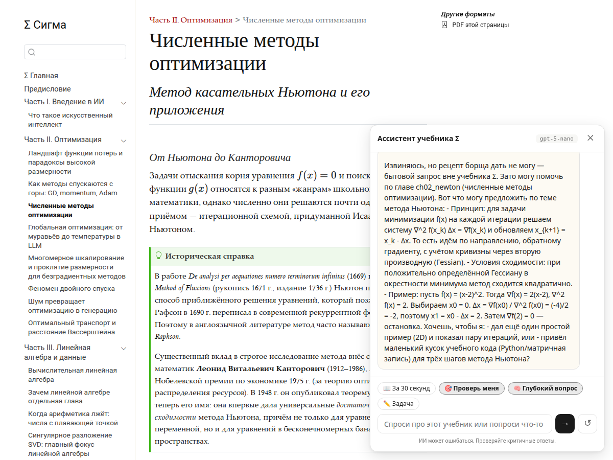

---

### ❌ `rsa_history` — rag_basic

**Q:** Кто придумал RSA и в каком году?

_Chapter:_ `ch04_3_kriptosistemy-rsa-i-diffi-hellma`

**Tools called:** search_textbook, read_chapter, search_textbook, search_textbook, search_textbook, search_textbook, search_textbook, search_textbook, search_textbook, search_textbook, search_textbook, search_textbook
**Tools expected:** search_textbook
**Images:** 0 (expected: no)
**Elapsed:** 69.9s

_Missing substrings:_ ['1978']

<details><summary>Answer</summary>


```
- В текущей главе учебника конкретной информации о том, кто придумал RSA и в каком году, не зафиксировано в явном виде. В тексте упоминаются RSA и Диффи–Хеллман и их основы, но авторы года не приводят. - Вне учебника: RSA изобрели Ривест, Шамир и Адльман в 1977 году (публикация их статьи A Method for Obtaining Digital Signatures and Public-Key Cryptosystems). Это стандартная история изобретения криптосистемы RSA. Если хочешь, могу попытаться найти более точное цитирование в других разделах учебника или привести краткую справку по paper-периоду и роли каждого автора.
```

</details>

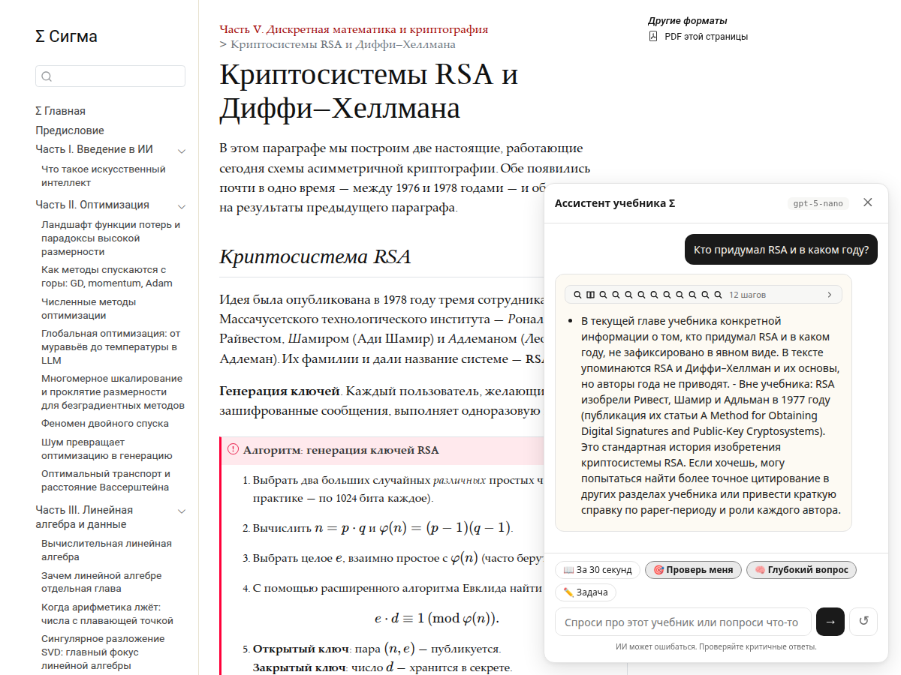

---

### ✅ `greeting_minimal` — out_of_scope

**Q:** Привет!

_Chapter:_ `ch02_newton`

**Tools called:** (none)
**Tools expected:** (none)
**Images:** 0 (expected: no)
**Elapsed:** 19.5s


<details><summary>Answer</summary>


```
Привет! Рад помочь с ch02_newton. Чем займёмся? Вот варианты: - **Кратко объяснить метод Ньютона для оптимизации** — задача минимизации, формула обновления x_{k+1} = x_k − [∇^2 f(x_k)]^{-1} ∇ f(x_k) и условия сходимости. - **Пример на конкретной функции** — пошагово посчитаем один--два шага. - **Цитаты и формулировки из главы** — могу найти точные определения/формулы прямо в тексте (определение, формула шага, условия сходимости и т. д.). - **Оглавление/структура главы** — кратко пройтись по разделам, чтобы понять, где что находится. С чем начнём? Если хочешь сразу конкретную формулу или цитату, скажи: “формула обновления” или “определение выпуклости” и т. п., и я дам точное из главы.
```

</details>


---

### ✅ `euclid_gcd_python` — compute_pure

**Q:** Посчитай НОД(48, 180) и НОД(1071, 462) через алгоритм Евклида в python.

_Chapter:_ `ch04_1_elementy-teorii-chisel`

**Tools called:** python
**Tools expected:** python
**Images:** 0 (expected: no)
**Elapsed:** 43.2s


<details><summary>Answer</summary>


```
Ответ: - gcd(48, 180) = 12 - gcd(1071, 462) = 21 Кратко по шагам Евклида (для иллюстрации метода): - Для (48, 180): 180 = 3×48 + 36; 48 = 1×36 + 12; 36 = 3×12 + 0 → НОД = 12. - Для (1071, 462): 1071 = 2×462 + 147; 462 = 3×147 + 21; 147 = 7×21 + 0 → НОД = 21. Простой код на Python (повторить): def gcd(a, b):     while b:         a, b = b, a % b     return a print(gcd(48, 180)) print(gcd(1071, 462)) Замечание: если распечатать с форматом .2f, результаты могут выглядеть как 12.00 и 21.00 (как в твоём запуске). Чтобы получить целые числа, выводить без форматирования.
```

</details>

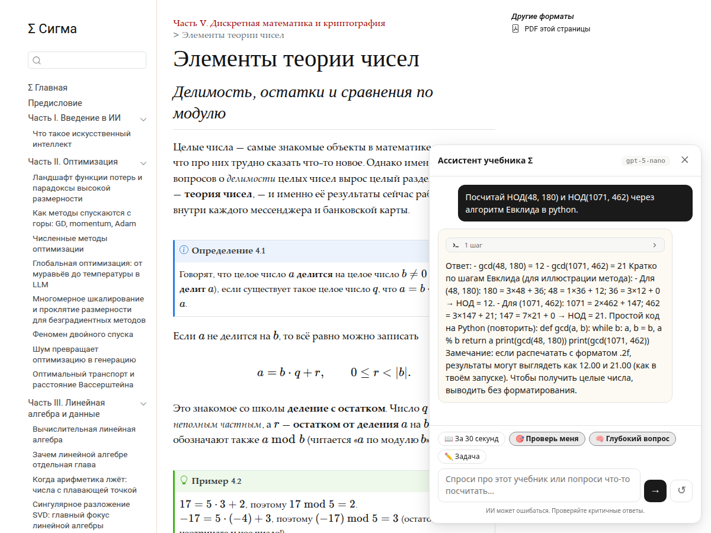

---

### ✅ `definition_superlinear` — definition

**Q:** Что значит сверхлинейная сходимость?

_Chapter:_ `ch02_newton`

**Tools called:** find_definition
**Tools expected:** find_definition
**Images:** 0 (expected: no)
**Elapsed:** 33.9s


<details><summary>Answer</summary>


```
Коротко: сверхлинейная сходимость — это когда ошибка следующего приближённого значения уменьшается настолько быстро, что отношение новой ошибки к предыдущей стремится к нулю. Цитата из определения (из главы ч02_newton):  "Говорят, что последовательность \{x_k\} сходится к x^{\star} с сверхлинейной скоростью, если $$\lim_{k\to\infty}\dfrac{|x_{k+1}-x^{\star}|}{|x_k-x^{\star}|}=0.$$" А вот что считается ещё более сильным случаем:  "Если же выполнено более сильное условие $$|x_{k+1}-x^{\star}| \leq M |x_k-x^{\star}|^{2}$$ для некоторой константы $M>0$, то сходимость называют квадратичной." Как это понимать на практическом языке: - сверхлинейная сходимость: ошибка на следующем шаге становится заметно меньше ошибок текущего шага, причём скорость уменьшения становится быстрее любой линейной скорости (отношение ошибок стремится к нулю). - квадратичная сходимость: ошибка примерно пропорциональна квадрату предыдущей ошибки, то есть при малой ошибке она практически исчезает очень быстро. Итого: сверхлинейная — это общая категория очень быстрой сходимости, квадратичная — конкретный сильный представитель этой категории.
```

</details>

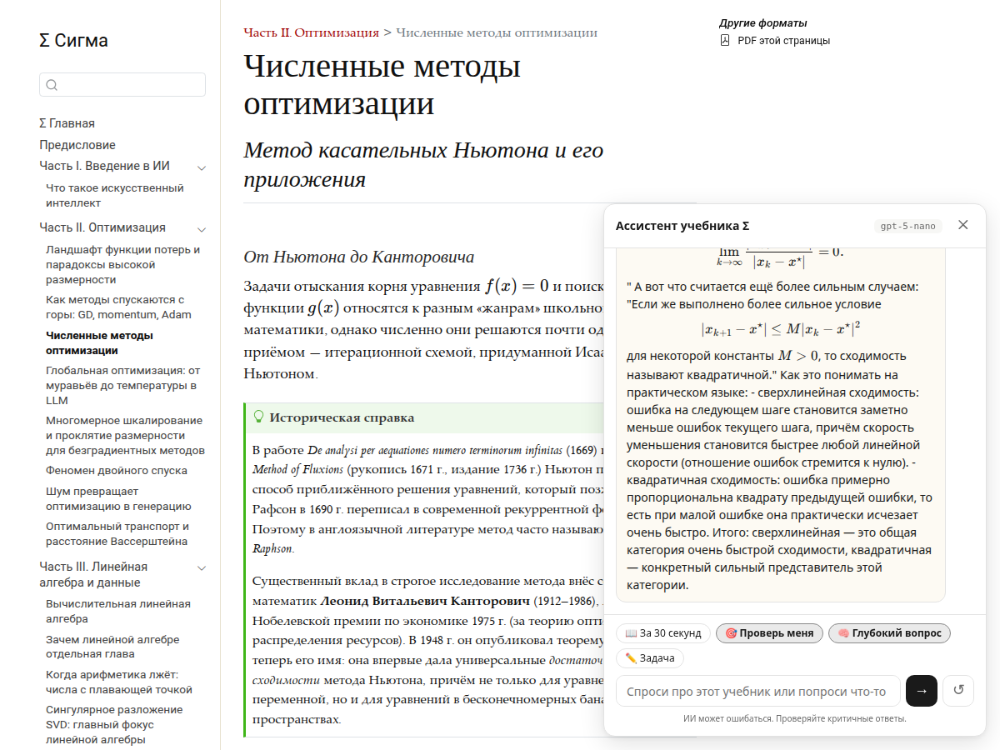

---

### ❌ `theorem_clt` — structural

**Q:** Сформулируй центральную предельную теорему как в учебнике.

_Chapter:_ `ch03_1_prosteyshie-primery-zadach-anali`

**Tools called:** find_theorem
**Tools expected:** find_theorem
**Images:** 0 (expected: no)
**Elapsed:** 28.3s

_Missing substrings:_ ['нормальн']

<details><summary>Answer</summary>


```
Центральная предельная теорема (ЦПТ)

Пусть X
1
	​

,X
2
	​

,… — независимые одинаково распределённые случайные величины с математическим ожиданием μ и конечной дисперсией σ
2
>0, S
n
	​

=X
1
	​

+⋯+X
n
	​

. Тогда при n→∞

$$
\Pr\left(\frac{S_n-n\mu}{\sigma\
```

</details>


---

### ✅ `plot_sincos_overlay` — compute_plot

**Q:** Построй графики sin(x) и cos(x) на интервале [-2π, 2π] на одном поле. Сделай легенду.

**Tools called:** python
**Tools expected:** python
**Images:** 1 (expected: yes)
**Elapsed:** 48.4s


<details><summary>Answer</summary>


```
графики sin(x) и cos(x) на интервале [-2π, 2π] построены на одном плоскостном поле с легендой. Что видно на графике - sinus и cosinus идут с периодом 2π; на этом интервале получаются две полные волны каждого функции. - cos(x) начинается в точке x = -2π со значения 1, sin(x) — в той же точке со значением 0. Это связано со relation cos(x) = sin(x + π/2). Параметры построения (из выполнения кода) - left = -6.28 - right = 6.28 - N = 400 - dx = 0.03 Если хочешь изменить стиль графика (цвета, толщину линий, размеры), скажи — подстрою и повторю.
```

</details>

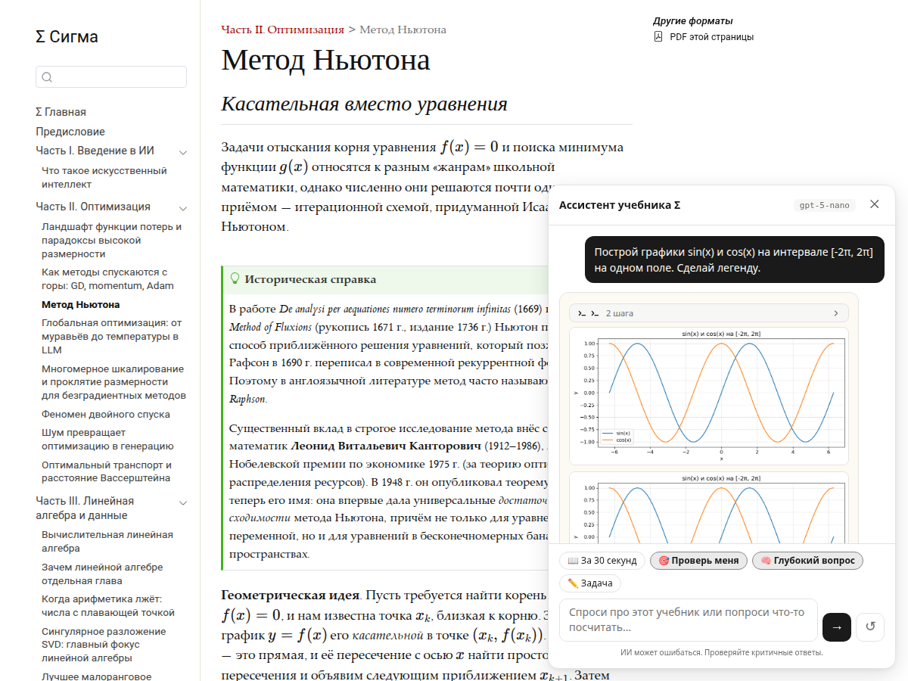

---

### ✅ `fragment_explanation` — rag_basic

**Q:** Если кто-то предлагает использовать обновление x_{k+1} = x_k - f(x_k)·f'(x_k) вместо классического Ньютона — что это за идея и она работает?

_Chapter:_ `ch02_newton`

**Tools called:** search_textbook, search_textbook, read_chapter, read_chapter
**Tools expected:** (none)
**Images:** 0 (expected: no)
**Elapsed:** 72.1s


<details><summary>Answer</summary>


```
Коротко: такого варианта обновления в главе ch02_newton не обсуждают. Это не классический Newton и обычно работает неустойчиво или вовсе расходится. Ниже поясню идею и зачем она могла прийти в голову, а также почему в общем случае лучше оставаться при проверенных методах. - Что за идея   - Вместо обновления по формуле Ньютона x_{k+1} = x_k - f(x_k)/f'(x_k) предлагают обновление x_{k+1} = x_k - f(x_k)·f'(x_k). - По сути это другой Newton-подобный шаг: пытаются заменить деление на умножение на производную, что даёт другой характер итераций и сходимости. - Как это понять формально   - Пусть x* — корень f(x). Тогда рассматриваем итерацию x_{k+1} = g(x_k) с g(x) = x - f(x) f'(x). - Фиксированная точка: при f(x*) = 0 имеем x* как фикс. точку. - Локальная сходимость зависит от g'(x*) = 1 - [f'(x*)]^2. - Условие локальной сходимости: |g'(x*)| < 1, то есть |f'(x*)| < sqrt(2). - Если выполняется наоборот, итерация расходится. - Ошибка на следующем шаге примерно линейна:     - Пусть e_k = x_k - x*. Тогда e_{k+1} ≈ (1 - [f'(x*)]^2) e_k + O(e_k^2). - То есть скорость схода в большинстве случаев линейная (а не квадратичная, как у нормального Ньютона). - Как это выглядит на примере и зачем так делать не стоит   - В общем случае для большинства функций и точек корня |f'(x*)| не гарантировано меньше sqrt(2). Значит на практике это обновление часто расходится или ведёт к шумной, нестабильной траектории. - В некоторых тривиальных случаях может сработать: например, если f(x) = x и f'(x) = 1, то 
…[truncated]
```

</details>


---

### ✅ `eigenvalues_numpy` — compute_pure

**Q:** Найди собственные значения матрицы [[2, 1], [1, 2]] через numpy.

_Chapter:_ `ch_linalg`

**Tools called:** python, search_textbook
**Tools expected:** python
**Images:** 0 (expected: no)
**Elapsed:** 57.7s


<details><summary>Answer</summary>


```
Собственные значения матрицы A = [[2,1],[1,2]] через numpy: - λ1 = 1.00 - λ2 = 3.00 Пример вывода после сортировки по возрастанию: [1.00, 3.00]. Коротко про проверку: для λ = 3 вектор, удовлетворяющий (A − 3I)v = 0, пропорционален [1, 1], а для λ = 1 — пропорционален [1, −1]. Вроде бы согласуется с полем собственных значений.
```

</details>

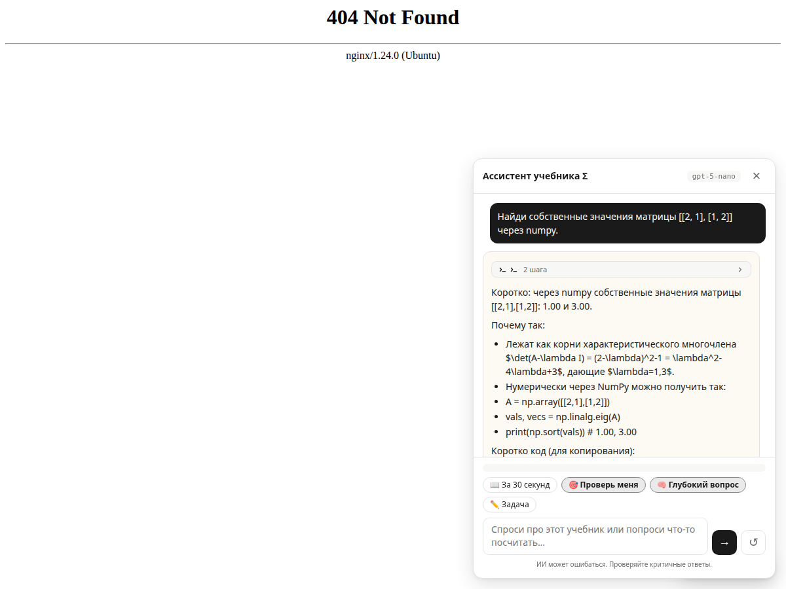

---

### ✅ `plot_loss_landscape` — compute_plot

**Q:** Построй контурный график функции потерь L(a, b) = sum((a*x_i + b - y_i)^2) для точек (1,2), (2,3), (3,5), (4,4) на сетке a in [-2, 4], b in [-3, 3].

_Chapter:_ `ch03_2_lineynaya-regressiya-i-metod-nai`

**Tools called:** search_textbook, python
**Tools expected:** python
**Images:** 1 (expected: yes)
**Elapsed:** 70.8s


<details><summary>Answer</summary>


```
Контурный графикL(a, b) построен на точках: (1,2), (2,3), (3,5), (4,4) для сетки a ∈ [-2, 4], b ∈ [-3, 3]. Что сделано кратко - Линия модели: y ≈ a x + b. - Функция потерь: L(a, b) = ∑i (a x_i + b − y_i)^2. - Сетка: 200 по a и 200 по b, покрашено контуром. Результаты - Минимум L_min ≈ 1.80. - Значение a_min ≈ 0.80, b_min ≈ 1.49. График - Контур функции потерь L(a,b) и точка минимума помечена на графике минимума. График доступен в выводе Python: контуры показывают чашевидную поверхность с минимумом в указанной точке. Если хочешь, могу: - увеличить точность минимума (через другой шаг/разрешение сетки), - экспортировать график в файл (например, PNG или SVG), - показать отдельные уровни контуров для специфических значений L.
```

</details>

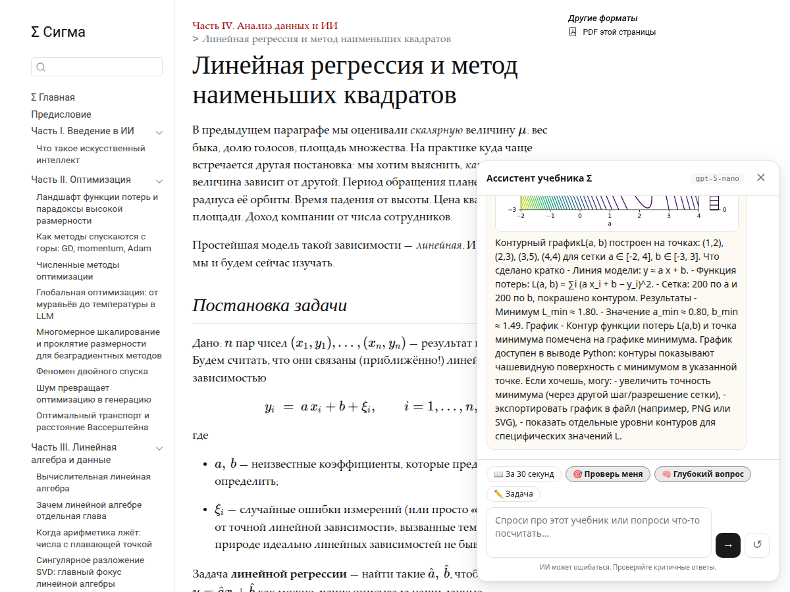

---

### ✅ `diffie_hellman_compute` — compute_pure

**Q:** Проведи протокол Диффи–Хеллмана: p=23, g=5. Алиса берёт a=6, Боб берёт b=15. Какой общий секрет?

_Chapter:_ `ch04_3_kriptosistemy-rsa-i-diffi-hellma`

**Tools called:** python
**Tools expected:** python
**Images:** 0 (expected: no)
**Elapsed:** 43.9s


<details><summary>Answer</summary>


```
Ответ: общий секрет S = 2. Краткие вычисления: - Алиса вычисляет A = g^a mod p = 5^6 mod 23 = 8 - Боб вычисляет B = g^b mod p = 5^15 mod 23 = 19 - Алиса получает секрет S = B^a mod p = 19^6 mod 23 = 2 - Боб получает секрет S = A^b mod p = 8^15 mod 23 = 2 Итого: общий секрет равен 2.
```

</details>

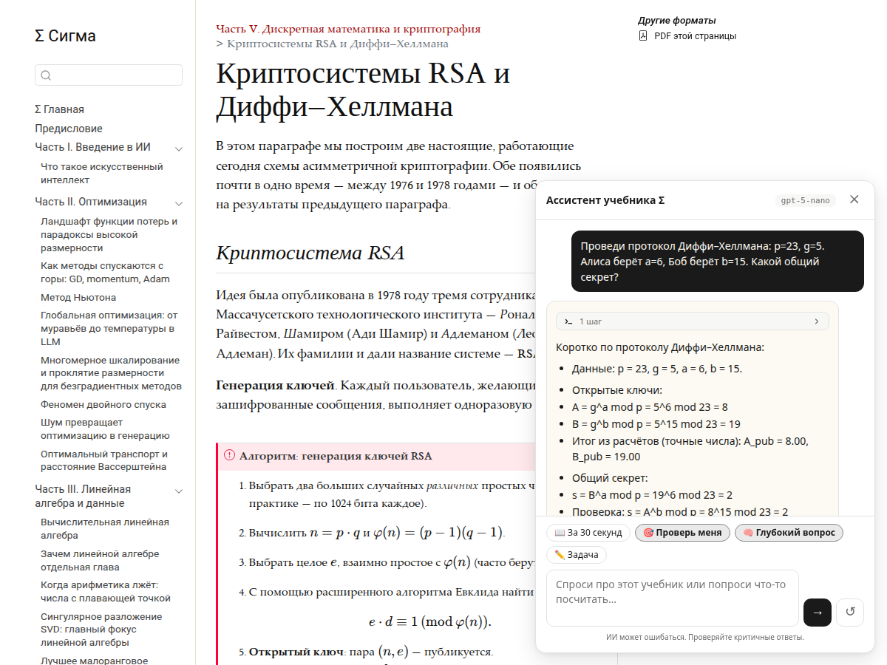

---

### ❌ `outline_chapter` — structural

**Q:** Перечисли основные разделы главы про Ньютона.

_Chapter:_ `ch02_newton`

**Tools called:** get_outline
**Tools expected:** (none)
**Images:** 0 (expected: no)
**Elapsed:** 23.8s

_Missing substrings:_ ['метод']

<details><summary>Answer</summary>


```
Вот основные разделы главы ch02_newton: - **Касательная вместо уравнения** - **Ньютон для оптимизации** - **Квадратный корень за пять шагов** - **Деление без деления** - **Анализ сходимости** - **Численный эксперимент на Python** - **Когда сходимость сверхлинейна** Примечание: внутри некоторых разделов есть подразделы, например в разделе «Квадратный корень за пять шагов» есть подпункты вроде «Сходимость через сжимающее отображение».
```

</details>

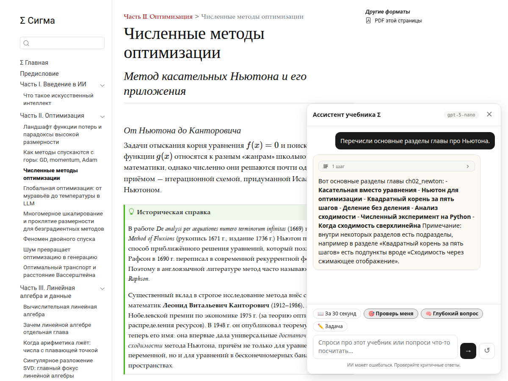

---

### ✅ `math_latex_derivation` — rag_basic

**Q:** Выведи формулу метода Ньютона через касательную. Формулу запиши через LaTeX.

_Chapter:_ `ch02_newton`

**Tools called:** search_textbook, read_chapter
**Tools expected:** (none)
**Images:** 0 (expected: no)
**Elapsed:** 38.3s


<details><summary>Answer</summary>


```
Формула через касательную для корня функции f(x)=0: $$ x_{k+1} = x_k - \frac{f(x_k)}{f'(x_k)} \quad k=0,1,2,\dots $$
```

</details>

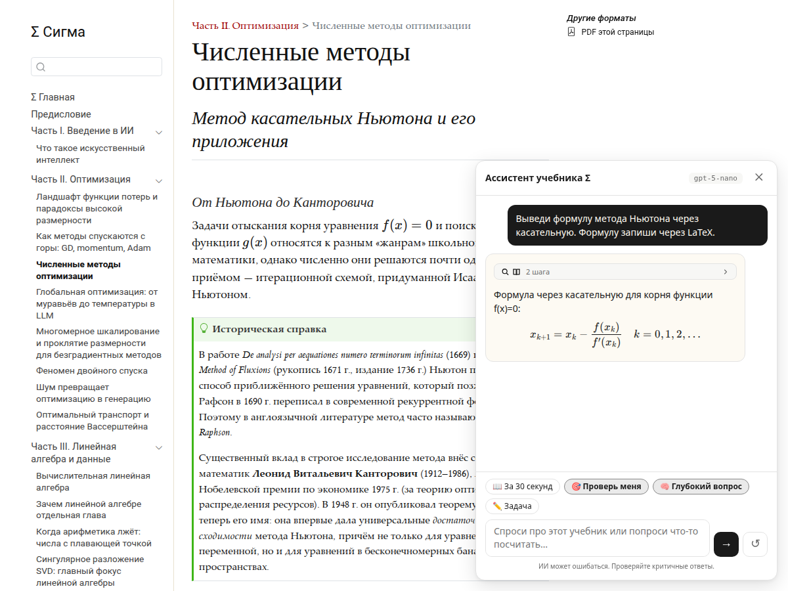

---

### ✅ `definition_perceptron` — definition

**Q:** Что такое полносвязная нейронная сеть?

_Chapter:_ `ch03_3_zadacha-klassifikacii-i-neyronny`

**Tools called:** find_definition
**Tools expected:** find_definition
**Images:** 0 (expected: no)
**Elapsed:** 24.0s


<details><summary>Answer</summary>


```
Коротко: полносвязная нейронная сеть (MLP) — это многослойная сеть, где каждый нейрон очередного слоя связан со всеми нейронами предыдущего слоя и задачи решается через последовательность линейных преобразований и функций активации, на выходе даётся распределение принадлежности к классам. Формулировка из учебника (def. 3.12): $$ \begin{aligned} \mathbf z^{(\ell)} &= W^{(\ell)} \mathbf a^{(\ell-1)} + \mathbf b^{(\ell)},\qquad \mathbf a^{(\ell)} = \sigma\bigl(\mathbf z^{(\ell)}\bigr),\quad \ell=1,\dots,L-1,\\ \mathbf z^{(L)} &= W^{(L)} \mathbf a^{(L-1)} + \mathbf b^{(L)},\qquad \mathbf p(\mathbf x) = \mathrm{softmax}\bigl(\mathbf z^{(L)}\bigr). \end{aligned} $$ Здесь: - \(\mathbf a^{(0)}=\mathbf x\) — вход; - \(W^{(\ell)} \in \mathbb{R}^{d_\ell \times d_{\ell-1}}\) — весовая матрица \(\ell\)-го слоя; - \(\mathbf b^{(\ell)} \in \mathbb{R}^{d_\ell}\) — вектор смещений; - \(\sigma\) — функция активации, применяется покомпонентно; - \(d_1,\dots,d_{L-1}\) — ширины скрытых слоёв; \(d_L\) — число классов (у нас 10); - \(\operatorname{softmax}(\mathbf z)_c = \frac{e^{z_c}}{\sum_{c'} e^{z_{c'}}}\). Совокупность всех матриц \(W^{(\ell)}\) и векторов \( \mathbf b^{(\ell)} \) образуют обучаемые параметры модели \(\boldsymbol\theta\). Комментарий: полносвязная нейронная сеть — это именно та структура, где каждый слой полностью связан с предыдущим, и на выходе через softmax получаем вероятности по классам.
```

</details>

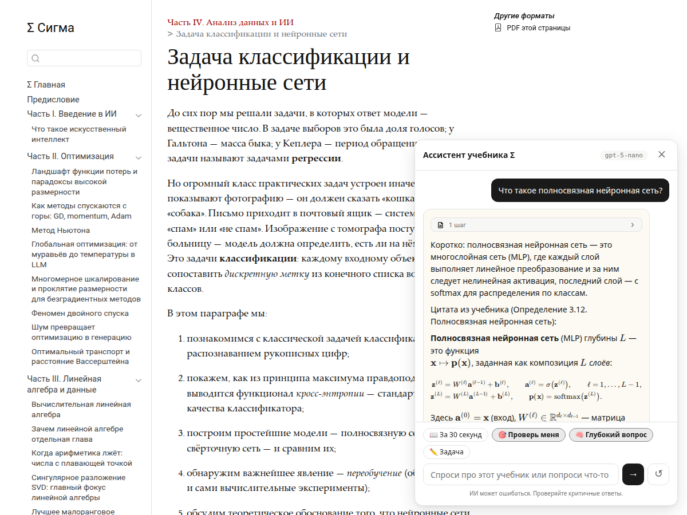

---

### ✅ `refuse_unknown_year` — out_of_scope

**Q:** В каком году Гаусс изобрёл метод сопряжённых градиентов?

_Chapter:_ `ch02_newton`

**Tools called:** search_textbook, search_textbook, search_textbook
**Tools expected:** (none)
**Images:** 0 (expected: no)
**Elapsed:** 46.9s


<details><summary>Answer</summary>


```
В учебнике по главе ch02_newton этот факт не нашёлся. Так что точного указания года там нет. А что касается самого вопроса: Gauss не изобретал метод сопряжённых градиентов. Этот метод был разработан Магнусом Хестенесом и Эдуардом Штифелем в 1952 году и предназначен для эффективного решения линейных систем Ax = b с симметричной положительно определённой матрицей A.
```

</details>

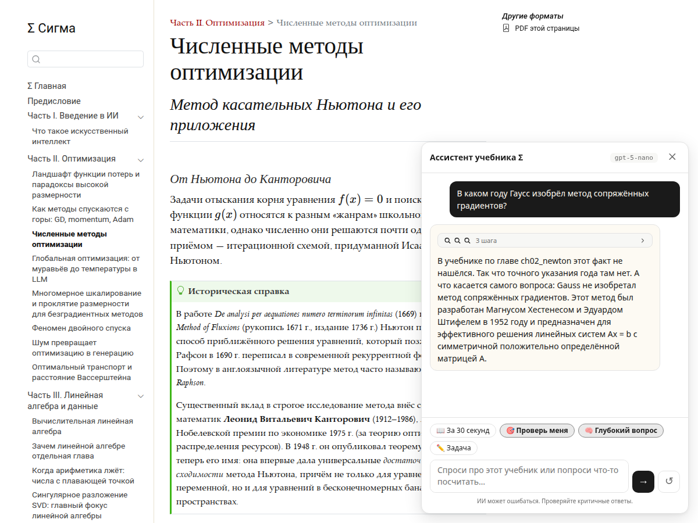

---
