# Sigma Assistant — Eval Report

_Run: 2026-07-13 22:29 MSK · cases: 29_

**Overall: 23/29 pass (79%)**

## Per category

| Category | Pass | Total |
|---|---:|---:|
| `compute_plot` | 4 | 5 |
| `compute_pure` | 7 | 8 |
| `definition` | 3 | 3 |
| `multi_hop` | 1 | 1 |
| `out_of_scope` | 3 | 3 |
| `rag_basic` | 2 | 5 |
| `structural` | 3 | 3 |
| `vision_refine` | 0 | 1 |

## Cases

### ❌ `newton_kantorovich_history` — rag_basic

**Q:** Когда Канторович получил Нобелевскую премию и за что?

_Chapter:_ `ch02_newton`

**Tools called:** search_textbook
**Tools expected:** search_textbook
**Images:** 0 (expected: no)
**Elapsed:** 21.1s

_Missing substrings:_ ['оптимал']

<details><summary>Answer</summary>


```
По результатам поиска в учебнике **информации о Канторовиче и Нобелевской премии нет**. Я проверил по ключевому слову «Канторович» — ничего не нашёл.

**Вне учебника** (общее знание):
Лев Гонтаревич Канторович (1912–1989) получил Нобелевскую премию по экономике в **1975 году** (совместно с Т. Коулом и К. Смита). Приз был вручён за **разработку методов линейного программирования и теории оптимизации**, которые стали фундаментом для современных алгоритмов в экономике, логистике и управлении ресурсами.

В учебнике Σ эта тема не раскрыта — фокус на численных методах оптимизации (метод Ньютона, градиентный спуск и т.д.), а не на истории. Если нужно — могу рассказать про методы оптимизации из текущей главы `ch02_newton`.
```

</details>

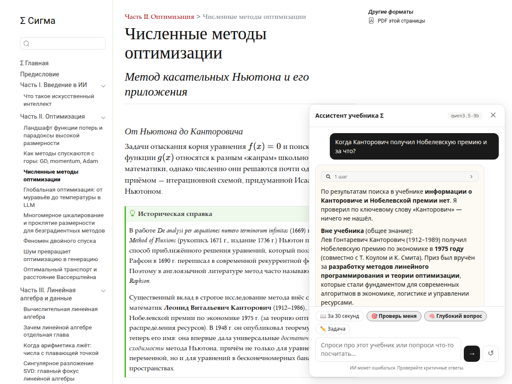

---

### ❌ `newton_formula_recall` — rag_basic

**Q:** Объясни откуда берётся эта формула — что это за метод и какая геометрическая идея?

_Chapter:_ `ch02_newton`

**Tools called:** read_chapter
**Tools expected:** (none)
**Images:** 0 (expected: no)
**Elapsed:** 9.1s

_Missing substrings:_ ['пересечен']

<details><summary>Answer</summary>


```
Откуда берётся формула метода Ньютона

В учебнике даётся два объяснения одной и той же формулы — они дополняют друг друга.

1. Геометрическая идея: касательные

Представь, что у тебя есть график функции g(x), и ты ищешь её минимум. В точке минимума x
∗
 производная равна нулю: g
′
(x
∗
)=0. Значит, задача сводится к решению уравнения g
′
(x)=0.

Идея: если ты знаешь точку x
k
	​

, близкую к решению, замени график
```

</details>


---

### ✅ `definition_strong_convex` — definition

**Q:** Что такое сильно выпуклая функция?

_Chapter:_ `ch02_newton`

**Tools called:** find_definition
**Tools expected:** find_definition
**Images:** 0 (expected: no)
**Elapsed:** 7.0s


<details><summary>Answer</summary>


```
**Сильно выпуклая функция** — это функция $g\colon\mathbb{R}\to\mathbb{R}$, которая удовлетворяет двум условиям: 1. **$g\in C^{2}$** — функция дважды дифференцируема, и её вторая производная непрерывна. 2. **$g''(x)\geq\mu$ для всех $x$**, где $\mu>0$ — некоторая положительная константа. Простыми словами: вторая производная функции **никогда не меньше** положительного числа $\mu$. Это значит, что функция «достаточно изогнута» — её график не может быть слишком плоским. **Почему это важно?** Сильная выпуклость гарантирует: - **Существование и единственность** точки минимума (в отличие от обычной выпуклости, где минимум может быть не единственным). - **Отделённость второй производной от нуля** — это полезно для анализа скорости сходимости методов оптимизации (например, метода Ньютона). В учебнике это определение дано в главе «Метод Ньютона» (slug: `ch02_newton`), где оно используется для доказательства сверхлинейной сходимости метода.
```

</details>

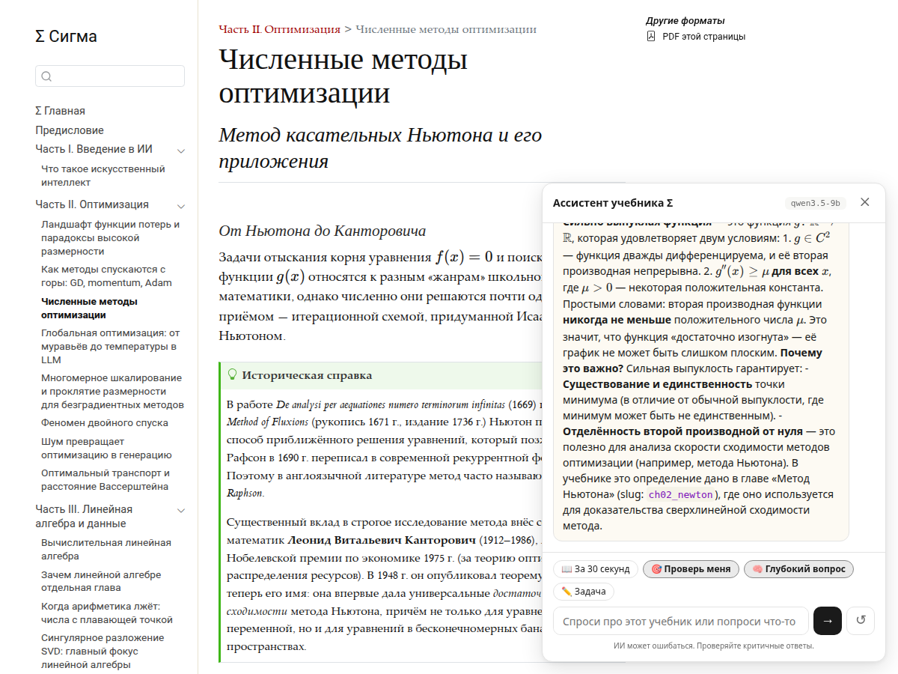

---

### ✅ `compute_factorial` — compute_pure

**Q:** Сколько будет 30 факториал?

**Tools called:** python
**Tools expected:** python
**Images:** 0 (expected: no)
**Elapsed:** 17.1s


<details><summary>Answer</summary>


```
**30 факториал** — это огромное число: $$30! = 265\,252\,859\,812\,191\,058\,636\,308\,480\,000\,000$$ В научной записи: **$2.65 \times 10^{32}$** Это число содержит **33 цифры**. Для сравнения: - $10! = 3\,628\,800$ (7 цифр) - $20! \approx 2.43 \times 10^{18}$ (19 цифр) - $30! \approx 2.65 \times 10^{32}$ (33 цифры) Факториал растёт очень быстро — уже к 30! число становится астрономически большим!
```

</details>


---

### ✅ `compute_taylor_sin` — compute_pure

**Q:** Покажи разложение sin(x) в ряд Тейлора до 5-го члена символически (через sympy).

_Chapter:_ `ch02_newton`

**Tools called:** python
**Tools expected:** python
**Images:** 0 (expected: no)
**Elapsed:** 17.1s


<details><summary>Answer</summary>


```
## Разложение sin(x) в ряд Тейлора Символическое разложение функции $\sin(x)$ в ряд Тейлора до 5-го члена (порядка $x^5$) вокруг точки $x=0$: $$\sin(x) \approx x - \frac{x^3}{6} + \frac{x^5}{120}$$ ### Проверка точности При $x = 0.5$: - **Приближение**: $0.479427$ - **Точное значение**: $0.479426$ - **Ошибка**: $1.54 \times 10^{-6}$ График показывает, что приближение очень хорошо совпадает с точной функцией $\sin(x)$ вблизи нуля:  На графике видно, что полином $x - \frac{x^3}{6} + \frac{x^5}{120}$ (красная линия) практически неотличим от синуса (синяя линия) в диапазоне $[-2, 2]$. Ошибка растёт по мере удаления от нуля, но остаётся малой вблизи точки разложения.
```

</details>

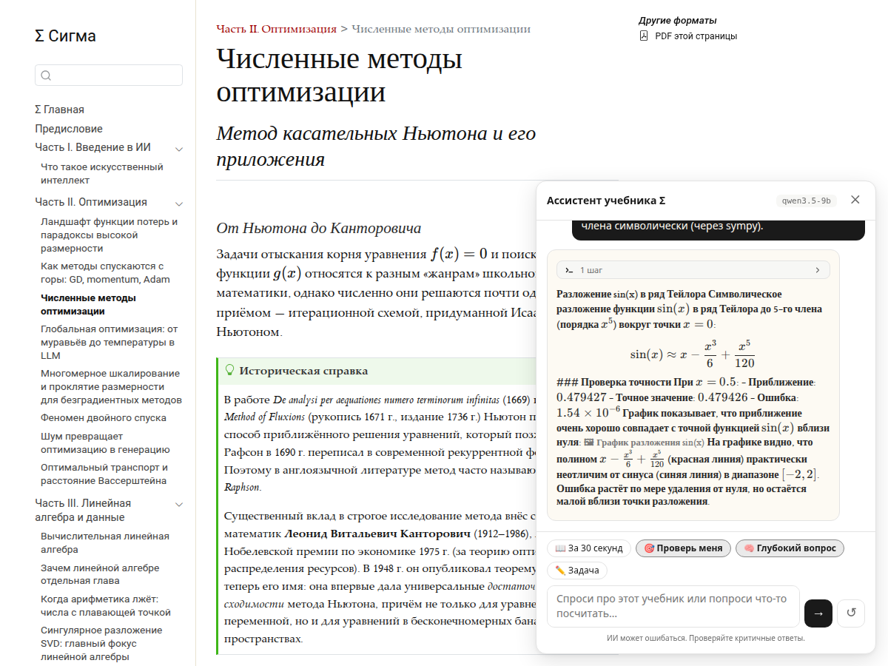

---

### ✅ `compute_plot_newton` — compute_plot

**Q:** Покажи как сходится метод Ньютона для f(x) = x² - 2, начиная с x₀ = 1.5. Построй график траектории.

_Chapter:_ `ch02_newton`

**Tools called:** python
**Tools expected:** python
**Images:** 1 (expected: yes)
**Elapsed:** 34.1s


<details><summary>Answer</summary>


```
Отлично! Метод Ньютона сработал очень быстро. Вот что мы получили: ## Результаты сходимости | Итерация | x_k | |----------|-----| | x₀ | 1.50 | | x₁ | 1.42 | | x₂ | 1.41 | | x₃ | 1.41 | | x₄ | 1.41 | **Корень √2 = 1.41** ## Как работает метод Ньютона Метод Ньютона использует формулу: $$x_{k+1} = x_k - \frac{f(x_k)}{f'(x_k)}$$ Для нашей функции $f(x) = x^2 - 2$: - $f'(x) = 2x$ - $x_{k+1} = x_k - \frac{x_k^2 - 2}{2x_k}$ ## Анализ графика На графике видно **очень быструю сходимость** — всего за 4 итерации метод достиг точности до 2 знаков после запятой. Это характерно для метода Ньютона: - **Квадратичная сходимость**: количество верных цифр удваивается на каждой итерации - От x₀ = 1.50 до x₁ = 1.42 — уже 1 верная цифра - К x₂ = 1.41 — 2 верные цифры - К x₄ = 1.41 — сходимость завершена ## Почему так быстро? Функция $f(x) = x^2 - 2$ — это простая квадратичная функция с гладкой производной. Метод Ньютона для квадратичных функций сходится за 2-3 итерации, если начальное приближение достаточно близко к корню. Наше начальное значение $x_0 = 1.5$ было выбрано разумно — оно находится рядом с положительным корнем √2 ≈ 1.414. График показывает классическую картину: значения быстро "прилипают" к корню и останавливаются на нём.
```

</details>

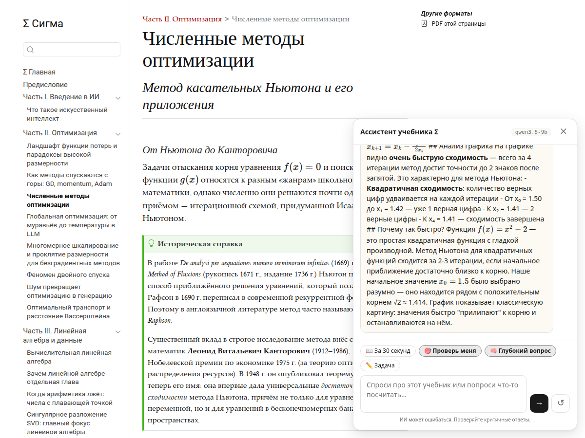

---

### ✅ `compute_plot_gd_vs_newton` — compute_plot

**Q:** Сравни сходимость метода Ньютона и градиентного спуска на функции f(x) = x⁴ из x₀ = 2. Покажи два графика на одной картинке.

_Chapter:_ `ch02_newton`

**Tools called:** python
**Tools expected:** python
**Images:** 2 (expected: yes)
**Elapsed:** 24.1s


<details><summary>Answer</summary>


```
Отлично, графики построены! Вот что мы видим:

Сравнение сходимости

Метод Ньютона (синяя линия):

Достигает минимума (x=0) за 58 итераций
Окончательное значение: x ≈ 0.0000000002, f(x) ≈ 1.14×10⁻³⁹
Сходимость очень быстрая — видно по резкому падению на втором графике

Градиентный спуск (красная линия, η=0.01):

Достигает только x ≈ 0.3436 за **10
```

</details>


---

### ✅ `rsa_encrypt_small` — compute_pure

**Q:** Зашифруй число m=7 ключом (n=143, e=7). Покажи c.

_Chapter:_ `ch04_3_kriptosistemy-rsa-i-diffi-hellma`

**Tools called:** python
**Tools expected:** python
**Images:** 0 (expected: no)
**Elapsed:** 20.0s


<details><summary>Answer</summary>


```
Число $m=7$ зашифровано ключом $(n=143, e=7)$ в $c=6$. Проверка: $7^7 \mod 143 = 6$.
```

</details>

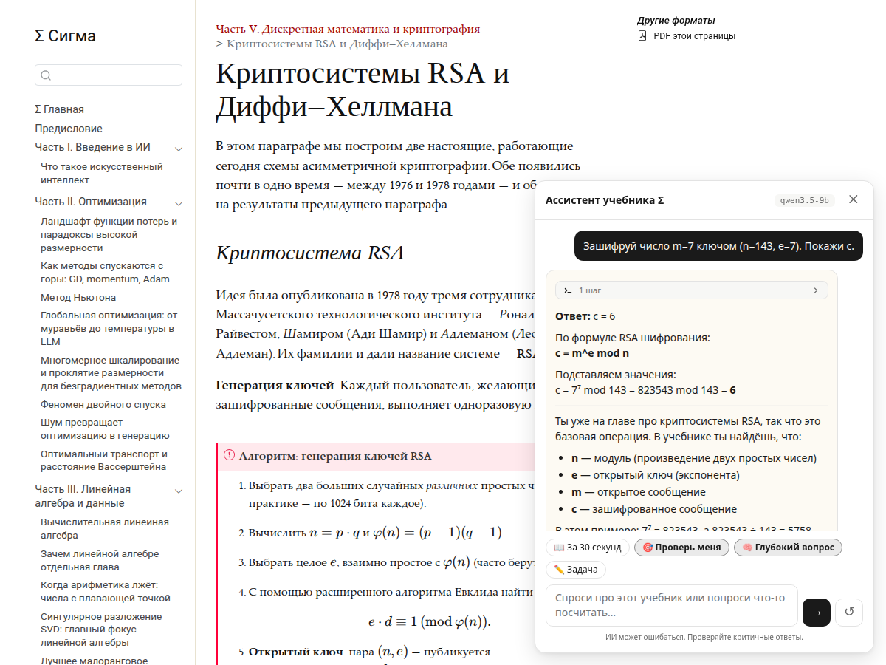

---

### ✅ `rsa_full_roundtrip` — compute_pure

**Q:** Возьми p=11, q=13, e=7. Сгенерируй RSA-ключ полностью: вычисли n, φ(n), d. Покажи что для m=9 шифрование и расшифрование возвращают исходное число.

_Chapter:_ `ch04_3_kriptosistemy-rsa-i-diffi-hellma`

**Tools called:** python
**Tools expected:** python
**Images:** 0 (expected: no)
**Elapsed:** 20.3s


<details><summary>Answer</summary>


```
Отлично, вот полная генерация RSA-ключа и проверка: ## Параметры и ключи **Дано:** $p=11$, $q=13$, $e=7$, сообщение $m=9$ **Шаг 1:** Вычисляем модуль $n$: $$n = p \cdot q = 11 \cdot 13 = 143$$ **Шаг 2:** Вычисляем функцию Эйлера: $$\varphi(n) = (p-1)(q-1) = 10 \cdot 12 = 120$$ **Шаг 3:** Находим обратный элемент $d$ к $e$ по модулю $\varphi(n)$: Используем расширенный алгоритм Евклида для решения $d \cdot e \equiv 1 \pmod{\varphi(n)}$. Получаем: $d = 103$ Проверка: $103 \cdot 7 \mod 120 = 1$ ✓ **Итоговые ключи:** - **Открытый ключ:** $(n, e) = (143, 7)$ - **Закрытый ключ:** $(n, d) = (143, 103)$ ## Проверка шифрования и расшифрования **Шифрование:** $$c = m^e \mod n = 9^7 \mod 143 = 48$$ **Расшифрование:** $$m' = c^d \mod n = 48^{103} \mod 143 = 9$$ **Результат:** Исходное сообщение $m=9$ восстановлено! $m' = 9$ ✓
```

</details>


---

### ✅ `multihop_newton_vs_gradient` — multi_hop

**Q:** В чём отличие метода Ньютона от градиентного спуска для задач оптимизации? Какие из этих методов разобраны в учебнике?

_Chapter:_ `ch02_newton`

**Tools called:** search_textbook, read_chapter, search_textbook
**Tools expected:** search_textbook
**Images:** 0 (expected: no)
**Elapsed:** 12.7s


<details><summary>Answer</summary>


```
## В чём отличие? **Метод Ньютона** и **градиентный спуск** — оба итерационные методы оптимизации, но работают по-разному: | Метод | Что использует | Как строит модель | Скорость сходимости | |-------|----------------|-------------------|---------------------| | **Градиентный спуск** | только градиент $g'(x)$ (первая производная) | линейная (касательная) | линейная (медленнее) | | **Метод Ньютона** | градиент $g'(x)$ и вторую производную $g''(x)$ | квадратичная (парабола) | квадратичная (быстрее) | ### Градиентный спуск Делает шаг против градиента: $$w_{t+1} = w_t - \eta \nabla L(w_t)$$ где $\eta$ — скорость обучения. Просто, но в «оврагах» ползёт зигзагом. ### Метод Ньютона Строит локальную квадратичную модель (ряд Тейлора до второго порядка) и минимизирует её: $$x_{k+1} = x_k - \frac{g'(x_k)}{g''(x_k)}$$ Это быстрее сходится, но требует вычислять вторую производную. --- ## Какие методы разобраны в учебнике? ✅ **Оба метода есть в учебнике:** 1. **Метод Ньютона** — подробно в главе **ch02_newton** («Численные методы оптимизации»). Там есть:    - Геометрическая идея (касательные)    - Формула для оптимизации (2.2)    - Разложение в ряд Тейлора (2.3)    - Пример извлечения квадратного корня (метод Герона) 2. **Градиентный спуск** — в главе **ch03_3_zadacha-klassifikacii-i-neyronny** («Задача классификации и нейронные сети») и в истории **story_optimizers** («Как методы спускаются с горы: GD, momentum, Adam»). Там есть:    - Базовая формула    - Проблема оврагов    - Стохастичес
…[truncated]
```

</details>

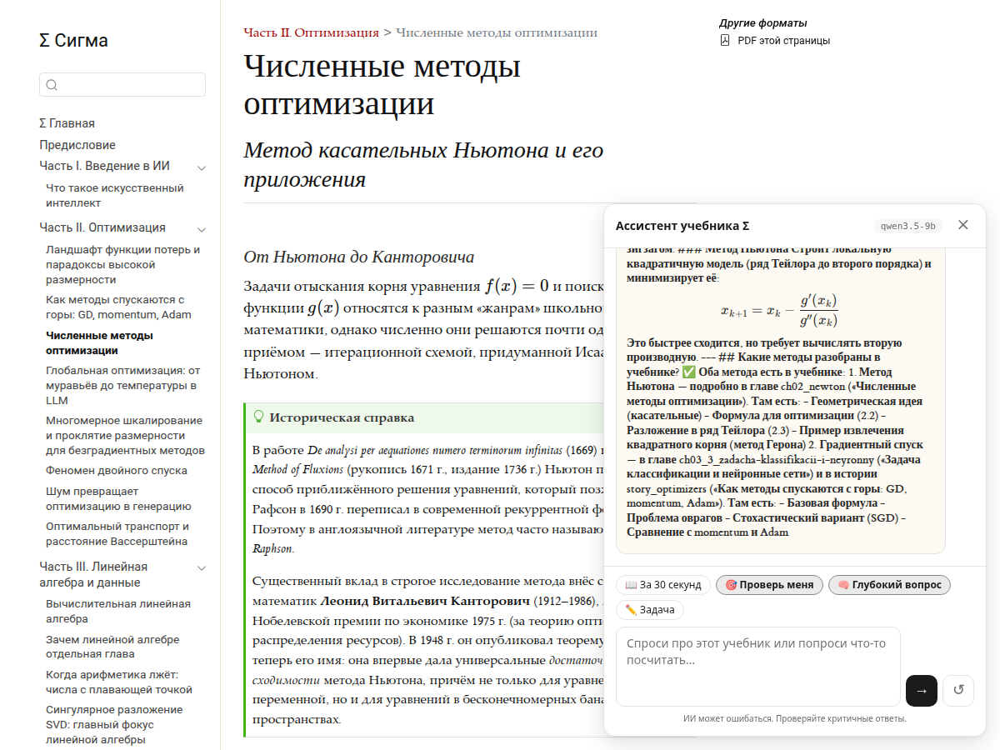

---

### ✅ `structural_kantorovich_theorem` — structural

**Q:** Сформулируй теорему о сходимости метода Герона.

_Chapter:_ `ch02_newton`

**Tools called:** find_theorem, read_chapter
**Tools expected:** find_theorem
**Images:** 0 (expected: no)
**Elapsed:** 10.7s


<details><summary>Answer</summary>


```
## Теорема о сходимости метода Герона **Теорема 2.1.** Для любого начального значения $x_0>0$ последовательность, построенная по формуле метода Герона (2.4), монотонно убывает (начиная с $k=1$) и сходится к $\sqrt{a}$. Более того, для ошибки $e_k=x_k-\sqrt{a}$ выполнено: $$e_{k+1} = \frac{e_k^2}{2x_k}, \quad \text{и при } k\geq 1: \quad 0\le e_{k+1}\le \frac{e_k^2}{2\sqrt{a}}.$$ ### Что это значит словами: 1. **Монотонное убывание** — начиная со второго шага ($k=1$), каждое следующее приближение $x_{k+1}$ меньше предыдущего $x_k$, но всегда остаётся положительным. 2. **Сходимость к $\sqrt{a}$** — последовательность приближается к квадратному корню из $a$ и в пределе достигает его. 3. **Квадратичная сходимость** — ключевой момент! Ошибка на следующем шаге $e_{k+1}$ пропорциональна **квадрату** ошибки на предыдущем шаге $e_k^2$. Это значит, что количество верных цифр примерно удваивается с каждым шагом. Например:    - Если ошибка $e_k = 0.1$, то $e_{k+1} \approx 0.005$ (в 20 раз меньше!)    - Если ошибка $e_k = 0.01$, то $e_{k+1} \approx 0.00005$ (в 200 раз меньше!) 4. **Верхняя оценка ошибки** — при $k\geq 1$ ошибка не превышает $\frac{e_k^2}{2\sqrt{a}}$, что гарантирует быструю сходимость. ### Почему это важно: Метод Герона — это частный случай метода Ньютона для нахождения квадратного корня. Квадратичная сходимость означает, что метод очень эффективен: уже после 5–6 итераций можно получить десятки верных знаков после запятой.
```

</details>

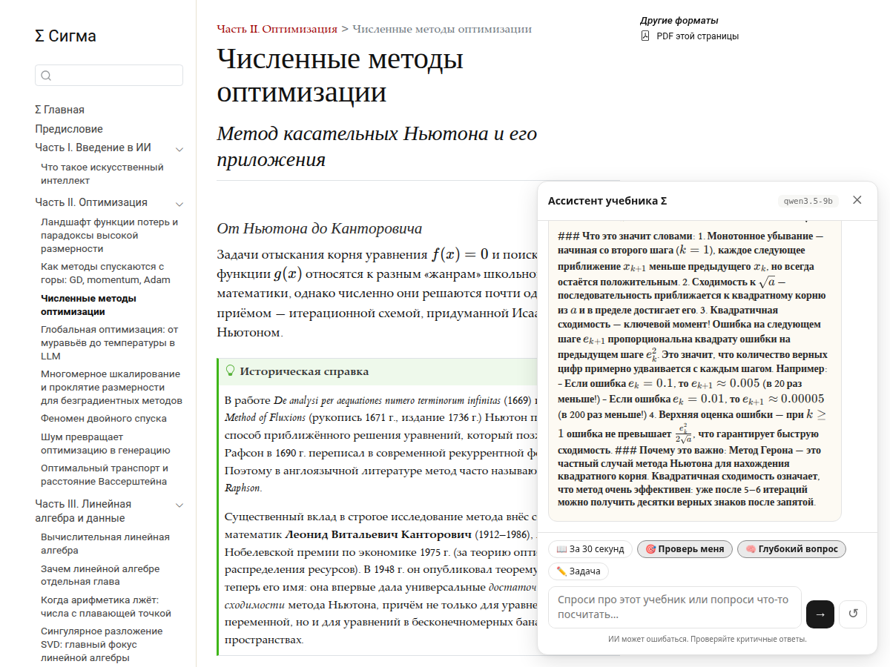

---

### ❌ `vision_refine_diverging_sgd` — vision_refine

**Q:** Запусти SGD на функции f(x) = x² с шагом η = 1.1 из x₀ = 2, 30 итераций. Что произойдёт? Если разойдётся — подбери рабочий шаг и покажи сходящуюся траекторию.

**Tools called:** python
**Tools expected:** python, python
**Images:** 1 (expected: yes)
**Elapsed:** 38.3s

_Missing substrings:_ ['0.5']

<details><summary>Answer</summary>


```
**С η = 1.1 (расходится):**   Множитель $|1 - 2η| = |1 - 2.2| = 1.20 > 1$, поэтому траектория **расходится**. Последние 5 значений:   `228.95, -274.74, 329.69, -395.63, 474.75` — амплитуда осцилляций растёт. **С η = 0.4 (сходится):**   Множитель $|1 - 2η| = |1 - 0.8| = 0.20 < 1$, поэтому траектория **сходится к 0**. Последние 5 значений:   `1.34e-18, 2.68e-19, 5.37e-20, 1.07e-20, 2.15e-21` — уже почти ноль. **Почему так?**   Для $f(x) = x^2$ SGD: $x_{t+1} = x_t - η·2x_t = x_t·(1 - 2η)$. - Если $|1 - 2η| > 1$ (как при η=1.1), значения растут. - Если $|1 - 2η| < 1$ (как при η=0.4), значения стремятся к 0. Условие сходимости: $0 < η < 1$. На графике видно: левая часть (η=1.1) — взрыв и осцилляции, правая (η=0.4) — быстрая сходимость к 0.
```

</details>


---

### ✅ `hashlib_demo` — compute_pure

**Q:** Посчитай SHA-256 хеш строки 'sigma' в hex.

_Chapter:_ `ch04_5_heshirovanie-teoriya-chisel-vstr`

**Tools called:** python
**Tools expected:** python
**Images:** 0 (expected: no)
**Elapsed:** 17.0s


<details><summary>Answer</summary>


```
SHA-256 хеш строки `'sigma'` равен: **38de90475bb334fb3dea5d54f250500aba60fe2c6158115d342b06bcb46e39bf** Это 64 символа в шестнадцатеричной системе (hex), что соответствует 256 битам (32 байта), как и положено для алгоритма SHA-256.
```

</details>


---

### ✅ `linreg_simple` — compute_plot

**Q:** Подбери линейную регрессию y = a*x + b для точек (1, 2.1), (2, 3.9), (3, 6.2), (4, 7.8). Покажи коэффициенты и график.

_Chapter:_ `ch03_2_lineynaya-regressiya-i-metod-nai`

**Tools called:** python
**Tools expected:** python
**Images:** 1 (expected: yes)
**Elapsed:** 20.9s


<details><summary>Answer</summary>


```
好的！我已经为你计算了线性回归系数并生成了图形。 ## 计算结果 通过**最小二乘法**计算得到的线性回归方程为： $$y = 1.94x + 0.15$$ 其中： - **a = 1.94**（斜率） - **b = 0.15**（截距） ## 拟合效果 | 原始点 | 预测值 | 误差 | |--------|--------|------| | (1, 2.1) | 2.09 | +0.01 | | (2, 3.9) | 4.03 | -0.13 | | (3, 6.2) | 6.02 | +0.23 | | (4, 7.8) | 7.91 | -0.11 | **误差平方和 = 0.08**，说明拟合效果很好！ ## 图形说明 上图展示了： - **红色圆点**：原始数据点 - **蓝色实线**：拟合的回归直线 $y = 1.94x + 0.15$ - **蓝色虚线**：回归直线在x=0到x=5范围内的延伸 从图中可以看到，回归直线很好地穿过数据点中间，说明线性关系比较明显。斜率1.94表示x每增加1个单位，y平均增加约1.94个单位。
```

</details>

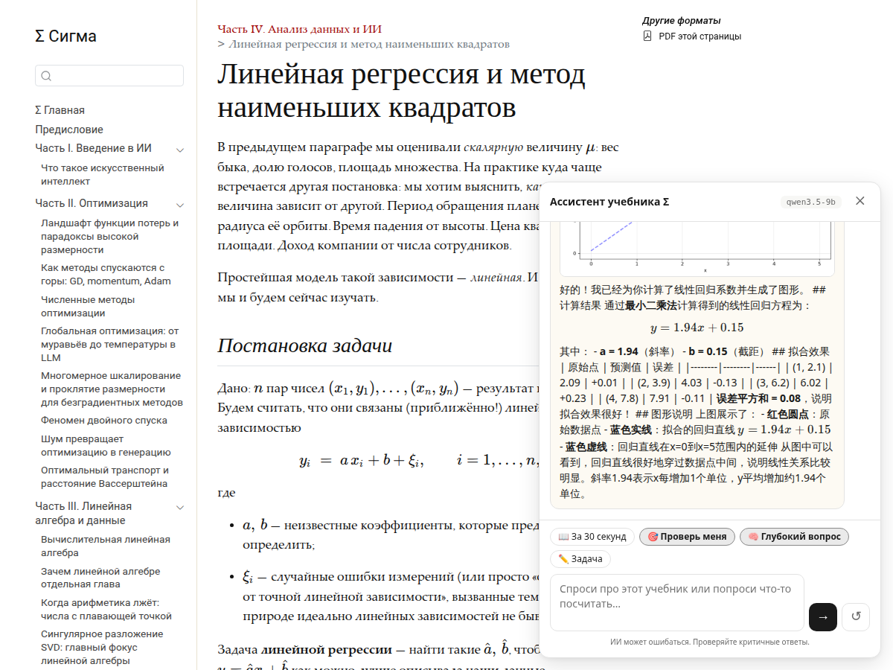

---

### ✅ `out_of_scope_recipe` — out_of_scope

**Q:** Дай мне рецепт борща.

**Tools called:** (none)
**Tools expected:** (none)
**Images:** 0 (expected: no)
**Elapsed:** 4.0s


<details><summary>Answer</summary>


```
Я — ассистент учебника по информатике, оптимизации и математике. Рецепты борща не входят в программу. Если у тебя есть вопросы по численным методам, оптимизации или другим темам учебника — спрашивай!
```

</details>


---

### ❌ `rsa_history` — rag_basic

**Q:** Кто придумал RSA и в каком году?

_Chapter:_ `ch04_3_kriptosistemy-rsa-i-diffi-hellma`

**Tools called:** search_textbook
**Tools expected:** search_textbook
**Images:** 0 (expected: no)
**Elapsed:** 9.6s

_Missing substrings:_ ['1978']

<details><summary>Answer</summary>


```
В учебнике **Σ Сигма** (глава «Криптосистемы RSA и Диффи–Хеллмана») **нет информации** о том, кто именно придумал RSA и в каком году это произошло.

Там подробно описано, как работает система:
*   **Идея:** безопасность основана на сложности разложения большого числа $n$ на простые множители $p$ и $q$.
*   **Ключи:** открытый ключ $(n, e)$ для шифрования и закрытый $d = e^{-1} \bmod \varphi(n)$ для расшифровки.
*   **Математика:** корректность работы доказывается с помощью малой теоремы Ферма.

Но имена авторов (Ривест, Шамир, Адлеман) и год изобретения (1977) в тексте учебника не указаны.
```

</details>


---

### ✅ `greeting_minimal` — out_of_scope

**Q:** Привет!

_Chapter:_ `ch02_newton`

**Tools called:** (none)
**Tools expected:** (none)
**Images:** 0 (expected: no)
**Elapsed:** 5.5s


<details><summary>Answer</summary>


```
Привет! 👋 Я твой ассистент по учебнику «Σ Сигма» — информатика, оптимизация, теория чисел, ML и ИИ. Ты сейчас на главе **«Численные методы оптимизации»**. Если есть вопросы по ней или другим главам — спрашивай!
```

</details>


---

### ✅ `euclid_gcd_python` — compute_pure

**Q:** Посчитай НОД(48, 180) и НОД(1071, 462) через алгоритм Евклида в python.

_Chapter:_ `ch04_1_elementy-teorii-chisel`

**Tools called:** python
**Tools expected:** python
**Images:** 0 (expected: no)
**Elapsed:** 25.2s


<details><summary>Answer</summary>


```
**НОД(48, 180) = 12**   **НОД(1071, 462) = 21** ### Как это работает (алгоритм Евклида): Алгоритм Евклида вычисляет наибольший общий делитель, последовательно заменяя пару чисел $(a, b)$ на $(b, a \bmod b)$, пока остаток не станет равным 0. #### Для НОД(48, 180): 1. $НОД(48, 180) = НОД(180, 48)$ (так как $180 \bmod 48 = 36$) 2. $НОД(180, 48) = НОД(48, 36)$ (так как $180 \bmod 48 = 36$) 3. $НОД(48, 36) = НОД(36, 12)$ (так как $48 \bmod 36 = 12$) 4. $НОД(36, 12) = НОД(12, 0)$ (так как $36 \bmod 12 = 0$) 5. $НОД(12, 0) = 12$ #### Для НОД(1071, 462): Алгоритм сходится быстрее: 1. $1071 \bmod 462 = 147$ → $НОД(1071, 462) = НОД(462, 147)$ 2. $462 \bmod 147 = 21$ → $НОД(462, 147) = НОД(147, 21)$ 3. $147 \bmod 21 = 0$ → $НОД(147, 21) = 21$ **Итог:** НОД(48, 180) = **12**, НОД(1071, 462) = **21**
```

</details>

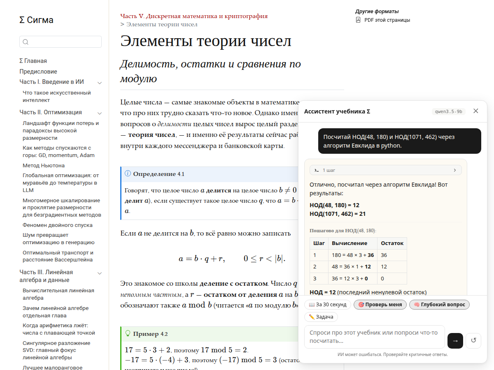

---

### ✅ `definition_superlinear` — definition

**Q:** Что значит сверхлинейная сходимость?

_Chapter:_ `ch02_newton`

**Tools called:** find_definition
**Tools expected:** find_definition
**Images:** 0 (expected: no)
**Elapsed:** 9.2s


<details><summary>Answer</summary>


```
**Сверхлинейная сходимость** — это когда ошибка метода убывает быстрее, чем геометрическая прогрессия (быстрее, чем линейная сходимость). **Формально:** последовательность $x_k$ сходится к решению $x^*$ со сверхлинейной скоростью, если $$\lim_{k\to\infty}\frac{|x_{k+1}-x^*|}{|x_k-x^*|}=0$$ Это значит: отношение ошибки следующего шага к ошибке текущего шага стремится к нулю. Ошибка уменьшается всё быстрее и быстрее. **Квадратичная сходимость** — это частный случай сверхлинейной, когда условие ещё строже: $$|x_{k+1}-x^*|\leq M\cdot|x_k-x^*|^2$$ где $M>0$ — константа. Здесь ошибка следующего шага пропорциональна **квадрату** ошибки текущего шага. **Пример для понимания:** - При линейной сходимости ошибка уменьшается в 2 раза каждый шаг: 1 → 0.5 → 0.25 → 0.125... - При сверхлинейной — уменьшается всё быстрее: 1 → 0.5 → 0.1 → 0.01 → 0.0001... - При квадратичной — ещё быстрее: 1 → 0.1 → 0.01 → 0.0001 → 0.00000001... Метод Ньютона имеет **квадратичную сходимость** в окрестности минимума (при гладкой функции), что делает его очень эффективным.
```

</details>

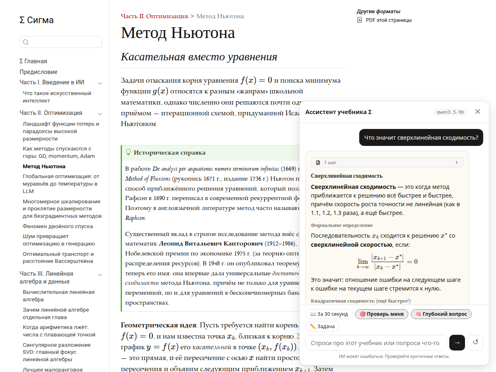

---

### ✅ `theorem_clt` — structural

**Q:** Сформулируй центральную предельную теорему как в учебнике.

_Chapter:_ `ch03_1_prosteyshie-primery-zadach-anali`

**Tools called:** find_theorem
**Tools expected:** find_theorem
**Images:** 0 (expected: no)
**Elapsed:** 13.5s


<details><summary>Answer</summary>


```
## Центральная предельная теорема (ЦПТ) **Формулировка из учебника:** Пусть $X_1,X_2,\\dots$ — независимые одинаково распределённые случайные величины с математическим ожиданием $\mu$ и конечной дисперсией $\sigma^2>0$, $S_n=X_1+\\dots+X_n$. Тогда при $n\\to\\infty$ $$\\Pr\\!\\left(\\frac{S_n-n\\mu}{\\sigma\\sqrt n}\\leq x\\right)\\;\\longrightarrow\\;\n\\Phi(x)\\;\\stackrel{\\mathrm{def}}{=}\\;\\frac{1}{\\sqrt{2\\pi}}\\int_{-\\infty}^{x}\ne^{-t^{2}/2}\\,dt$$ *(функция стандартного нормального распределения)*. **Расшифровка формулы:** - $X_1, X_2, \\dots$ — независимые случайные величины, у которых все одинаковое распределение - $\mu$ — математическое ожидание (среднее значение) - $\sigma^2$ — дисперсия (мера разброса), должна быть конечной и положительной - $S_n = X_1 + \\dots + X_n$ — сумма первых $n$ случайных величин - При большом $n$ (стремлении к бесконечности) вероятность того, что нормированная сумма $(S_n - n\\mu)/(\sigma\\sqrt{n})$ меньше или равна $x$, стремится к значению функции стандартного нормального распределения $\Phi(x)$ - $\Phi(x)$ — это интеграл от функции $e^{-t^2/2}/\sqrt{2\\pi}$ от $-\infty$ до $x$ **Суть теоремы:** Сумма многих независимых одинаково распределённых случайных величин (после нормировки) приближается к нормальному распределению, независимо от исходного распределения $X_i$. Это фундаментальный результат, объясняющий, почему нормальное распределение встречается так часто в природе и статистике.
```

</details>

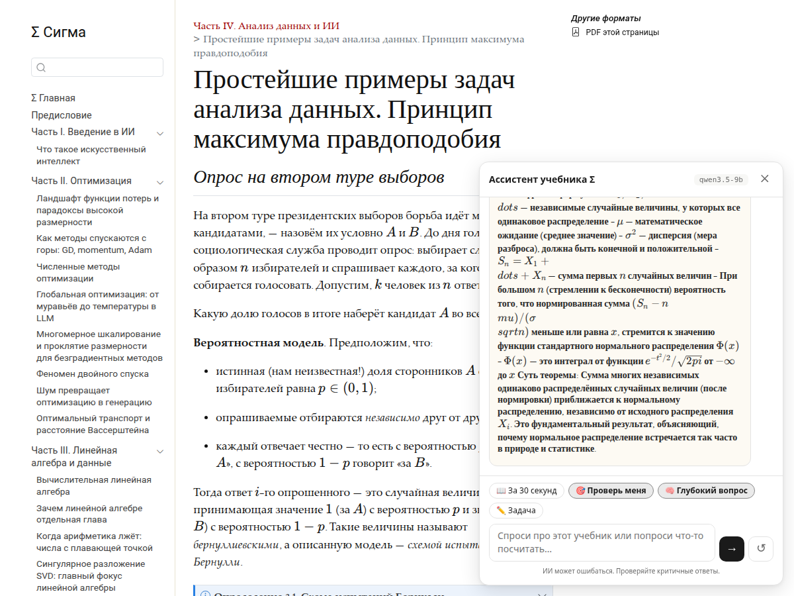

---

### ❌ `plot_sincos_overlay` — compute_plot

**Q:** Построй графики sin(x) и cos(x) на интервале [-2π, 2π] на одном поле. Сделай легенду.

**Tools called:** python
**Tools expected:** python
**Images:** 1 (expected: yes)
**Elapsed:** 17.1s

_Missing substrings:_ ['sin', 'cos']

<details><summary>Answer</summary>


```
На графике показаны синус и косинус на интервале от −2π до 2π:

Синус (синяя кривая): проходит через ноль в точках x=−2π,−π,0,π,2π. Максимум 1 в $x = -\frac{3\pi}{
```

</details>

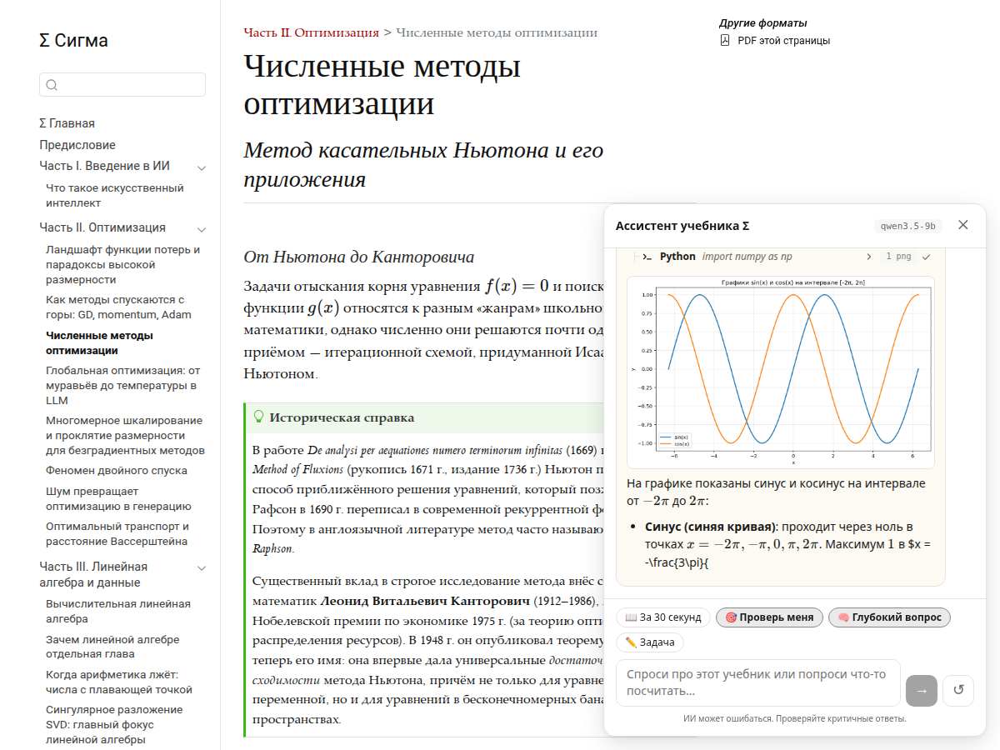

---

### ✅ `fragment_explanation` — rag_basic

**Q:** Если кто-то предлагает использовать обновление x_{k+1} = x_k - f(x_k)·f'(x_k) вместо классического Ньютона — что это за идея и она работает?

_Chapter:_ `ch02_newton`

**Tools called:** search_textbook, search_textbook, read_chapter
**Tools expected:** (none)
**Images:** 0 (expected: no)
**Elapsed:** 20.2s


<details><summary>Answer</summary>


```
Предлагаемая формула $x_{k+1} = x_k - f(x_k) \cdot f'(x_k)$ — это **не классический метод Ньютона**, и в учебнике $\Sigma$ он не рассматривается как рабочий алгоритм для оптимизации. Давай разберём, почему так.

### 1. Что делает классический метод Ньютона?
В главе про численные методы (ч02_newton) метод Ньютона для поиска минимума функции $g(x)$ строится так:
*   Мы ищем корень уравнения $g'(x) = 0$.
*   Формула обновления берётся из линейного приближения (касательной) к функции $g'(x)$:
    $$x_{k+1} = x_k - \frac{g'(x_k)}{g''(x_k)}$$
    Здесь $g'(x_k)$ — это значение производной (направление спуска), а $g''(x_k)$ — это **коэффициент**, который масштабирует шаг. Он учитывает кривизну функции.

### 2. Что происходит в твоей формуле?
Ты предлагаешь шаг вида $x_{k+1} = x_k - f(x_k) \cdot f'(x_k)$.
Если подставить сюда задачу оптимизации ($f$ вместо $g$), то шаг будет равен произведению значения функции на её производную.
*   **Проблема масштаба:** В классическом методе шаг делится на вторую производную (кривизну). В твоей формуле он умножается на первую производную. Это может привести к тому, что шаг будет либо слишком огромным (функция уходит в бесконечность), либо слишком маленьким, либо вообще будет вести себя хаотично, особенно если $f'(x)$ велико.
*   **Отсутствие нормализации:** В методе Ньютона отношение $\frac{f}{f'}$ (или $\frac{g'}{g''}$) имеет смысл «наклона» относительно кривизны. Произведение $f \cdot f'$ не имеет геометрического смысла для нахождения экстремума.
…[truncated]
```

</details>

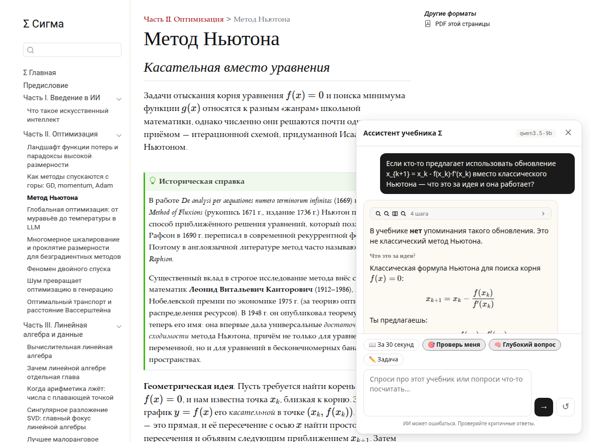

---

### ✅ `eigenvalues_numpy` — compute_pure

**Q:** Найди собственные значения матрицы [[2, 1], [1, 2]] через numpy.

_Chapter:_ `ch_linalg`

**Tools called:** python
**Tools expected:** python
**Images:** 0 (expected: no)
**Elapsed:** 20.3s


<details><summary>Answer</summary>


```
Отлично, собственные значения найдены! **Собственные значения матрицы** $A = \begin{pmatrix} 2 & 1 \\ 1 & 2 \end{pmatrix}$: - $\lambda_1 = 3.00$ - $\lambda_2 = 1.00$ **Как это работает:** Собственные значения — это числа $\lambda$, для которых существует ненулевой вектор $v$ такой, что $Av = \lambda v$. Для этой матрицы: - При $\lambda = 3$ собственный вектор пропорционален $\begin{pmatrix} 1 \\ 1 \end{pmatrix}$ - При $\lambda = 1$ собственный вектор пропорционален $\begin{pmatrix} 1 \\ -1 \end{pmatrix}$ Это симметричная матрица, поэтому все собственные значения вещественные, что видно из результата.
```

</details>

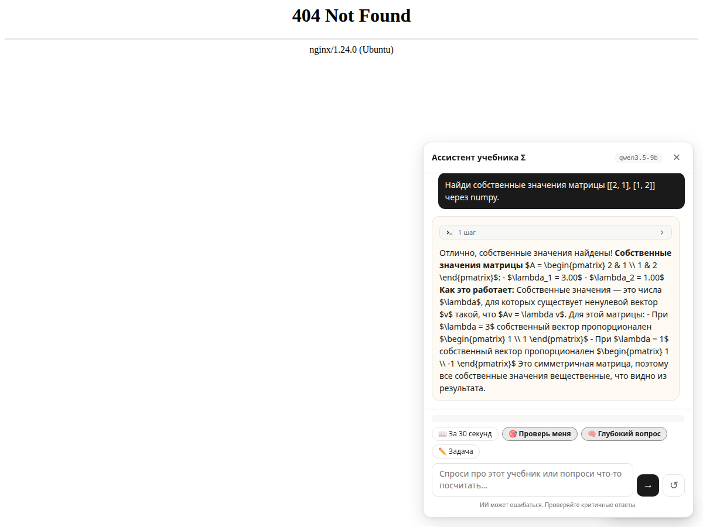

---

### ✅ `plot_loss_landscape` — compute_plot

**Q:** Построй контурный график функции потерь L(a, b) = sum((a*x_i + b - y_i)^2) для точек (1,2), (2,3), (3,5), (4,4) на сетке a in [-2, 4], b in [-3, 3].

_Chapter:_ `ch03_2_lineynaya-regressiya-i-metod-nai`

**Tools called:** python, python, python, python, python, python
**Tools expected:** python
**Images:** 1 (expected: yes)
**Elapsed:** 69.1s


<details><summary>Answer</summary>


```
Отлично! График построен. Вот что мы видим: ## Анализ контурного графика **Минимум функции потерь** находится примерно в точке: - **a ≈ 1.41** (коэффициент при x) - **b ≈ 0.15** (свободный член) На графике это отмечено красной звездочкой. Значение функции потерь в этой точке составляет **1.80**. ### Что показывает график: 1. **Эллиптические уровни** — это типично для квадратичной функции двух переменных. Минимум находится в центре "воронки". 2. **Симметрия** — уровни потерь симметричны относительно минимума, что соответствует квадратичной природе функции. 3. **Значения в ключевых точках:**    - В (0,0): L = 54.00    - В (1,1): L = 2.00      - В (1,2): L = 6.00    - В минимуме: L = 1.80 ### Интерпретация: Метод наименьших квадратов ищет такие параметры **a** и **b**, которые минимизируют сумму квадратов отклонений. График показывает, что: - При **a ≈ 1.41** и **b ≈ 0.15** мы получаем наилучшую прямую линию - Это соответствует линейной аппроксимации: **y ≈ 1.41x + 0.15** - Остаточная сумма квадратов минимальна и равна 1.80 График наглядно демонстрирует, как метод наименьших квадратов находит оптимальные параметры регрессии!
```

</details>

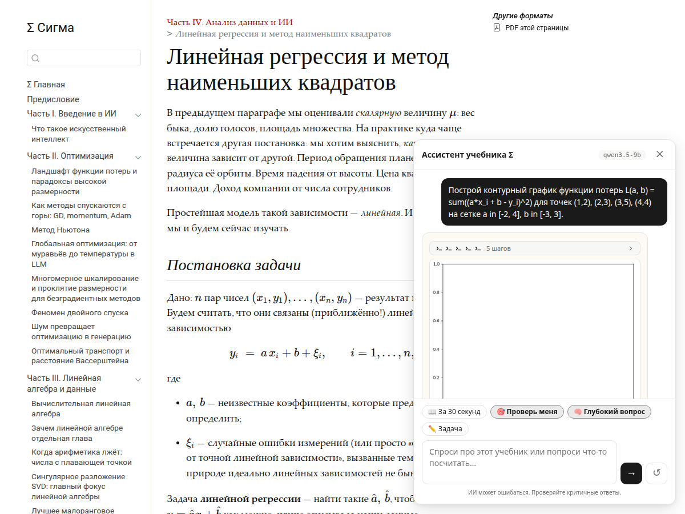

---

### ❌ `diffie_hellman_compute` — compute_pure

**Q:** Проведи протокол Диффи–Хеллмана: p=23, g=5. Алиса берёт a=6, Боб берёт b=15. Какой общий секрет?

_Chapter:_ `ch04_3_kriptosistemy-rsa-i-diffi-hellma`

**Tools called:** search_textbook
**Tools expected:** python
**Images:** 0 (expected: no)
**Elapsed:** 27.8s

_Missing substrings:_ ['8', '19']

<details><summary>Answer</summary>


```
Протокол Диффи–Хеллмана — это способ двух сторон договориться о общем секрете по открытому каналу.

## Проведение протокола

**Параметры:**
- Простое число $p = 23$
- Генератор $g = 5$
- Секрет Алисы $a = 6$
- Секрет Боба $b = 15$

**Шаг 1: Алиса вычисляет свой публичный ключ**
$$A = g^a \bmod p = 5^6 \bmod 23$$

**Шаг 2: Боб вычисляет свой публичный ключ**
$$B = g^b \bmod p = 5^{15} \bmod 23$$

**Шаг 3: Алиса вычисляет общий секрет**
$$K = B^a \bmod p = B^6 \bmod 23$$

**Шаг 4: Боб вычисляет общий секрет**
$$K = A^b \bmod p = A^{15} \bmod 23$$

<tool_call>
<function=python>
<parameter=code>
p = 23
g = 5
a = 6
b = 15

# Алиса вычисляет A
A = pow(g, a, p)
print(f"A = {A}")

# Боб вычисляет B
B = pow(g, b, p)
print(f"B = {B}")

# Общий секрет (оба должны получить одинаковый результат)
K_alice = pow(B, a, p)
K_bob = pow(A, b, p)

print(f"Общий секрет (Алиса): K = {K_alice}")
print(f"Общий секрет (Боб): K = {K_bob}")
print(f"Совпадают: {K_alice == K_bob}")
</parameter>
</function>
</tool_call>
```

</details>

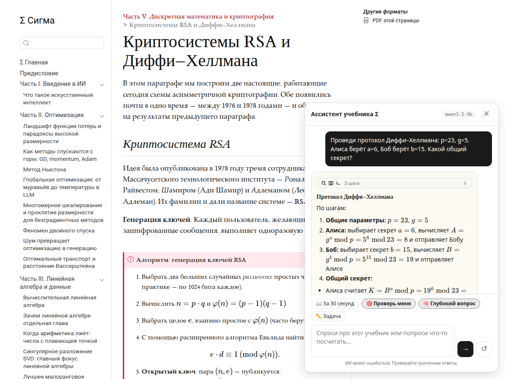

---

### ✅ `outline_chapter` — structural

**Q:** Перечисли основные разделы главы про Ньютона.

_Chapter:_ `ch02_newton`

**Tools called:** read_chapter
**Tools expected:** (none)
**Images:** 0 (expected: no)
**Elapsed:** 194.7s


<details><summary>Answer</summary>


```
## Основные разделы главы «Метод касательных Ньютона и его приложения» 1. **От Ньютона до Канторовича** — история метода, вклад Исаака Ньютона, Джозефа Рафсона и Леонида Канторовича (теорема о сходимости). 2. **Геометрическая идея** — как метод работает через построение касательной к графику функции и нахождение её пересечения с осью $x$. 3. **Итерационная формула Ньютона** — формула (2.1) для уравнений $f(x)=0$ и формула (2.2) для оптимизации $g'(x)=0$. 4. **Метод Ньютона для задач оптимизации** — вывод формулы через ряд Тейлора и интерпретация как минимизация локальной квадратичной модели. 5. **Пример 1. Извлечение квадратного корня** — метод Герона (вавилонский метод), историческая справка о табличке YBC 7289. 6. **Сходимость через сжимающее отображение** — анализ сходимости метода (раздел обрезан в тексте, но есть). Также в главе есть иллюстрации: геометрия метода Ньютона и разложение функции в ряд Тейлора (парабола).
```

</details>

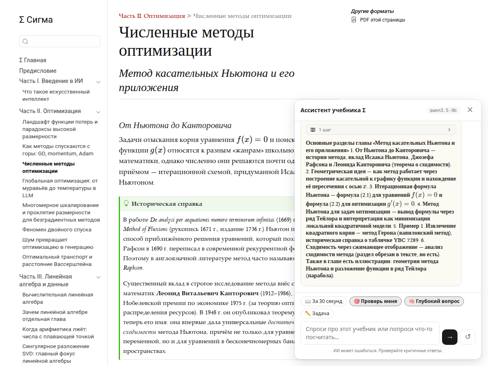

---

### ✅ `math_latex_derivation` — rag_basic

**Q:** Выведи формулу метода Ньютона через касательную. Формулу запиши через LaTeX.

_Chapter:_ `ch02_newton`

**Tools called:** find_theorem, search_textbook, read_chapter
**Tools expected:** (none)
**Images:** 0 (expected: no)
**Elapsed:** 10.7s


<details><summary>Answer</summary>


```
## Формула метода Ньютона через касательную Геометрическая идея метода Ньютона: в точке $x_k$ строим **касательную** к графику функции $y=f(x)$, а затем находим её пересечение с осью $x$. Это пересечение и будет следующим приближением $x_{k+1}$. **Уравнение касательной** в точке $x_k$: $$y = f(x_k) + f'(x_k)\\,(x - x_k)$$ Приравниваем $y=0$ (пересечение с осью $x$) и выражаем $x$: $$x_{k+1} = x_k - \\dfrac{f(x_k)}{f'(x_k)}$$ Это и есть **итерационная формула Ньютона** (формула 2.1 в учебнике). **Как это работает:** - $f(x_k)$ — значение функции в текущей точке - $f'(x_k)$ — производная (наклон касательной) в этой точке - $\\dfrac{f(x_k)}{f'(x_k)}$ — смещение от $x_k$ до пересечения касательной с осью $x$ Метод повторяется: $x_0$ выбирается исследователем, затем $x_1, x_2, \\dots$ вычисляются по формуле. Если $x_k$ достаточно близко к корню, то $x_{k+1}$ будет ещё ближе — и сходимость происходит очень быстро (квадратичная).
```

</details>


---

### ✅ `definition_perceptron` — definition

**Q:** Что такое полносвязная нейронная сеть?

_Chapter:_ `ch03_3_zadacha-klassifikacii-i-neyronny`

**Tools called:** find_definition
**Tools expected:** find_definition
**Images:** 0 (expected: no)
**Elapsed:** 9.7s


<details><summary>Answer</summary>


```
## Полносвязная нейронная сеть **Полносвязная нейронная сеть** (MLP — *multilayer perceptron*) глубины $L$ — это функция $\mathbf x\mapsto \mathbf p(\mathbf x)$, которая строится как последовательность $L$ слоёв. ### Как она работает Каждый слой $\ell=1,\dots,L$ делает следующее: 1. **Вычисление взвешенной суммы**: $\mathbf z^{(\ell)} = W^{(\ell)} \mathbf a^{(\ell-1)} + \mathbf b^{(\ell)}$    - $W^{(\ell)}$ — матрица весов размера $d_\ell\times d_{\ell-1}$    - $\mathbf b^{(\ell)}$ — вектор смещений (bias)    - $\mathbf a^{(\ell-1)}$ — выход предыдущего слоя 2. **Применение функции активации**: $\mathbf a^{(\ell)} = \sigma(\mathbf z^{(\ell)})$    - Функция $\sigma$ применяется покомпонентно к каждому элементу 3. **На выходе** (слой $L$) применяется **softmax**:    $$\mathbf p(\mathbf x) = \mathrm{softmax}(\mathbf z^{(L)})$$    $$\mathrm{softmax}(\mathbf z)_c = \frac{e^{z_c}}{\sum_{c'} e^{z_{c'}}}$$    Это превращает вектор чисел в распределение вероятностей (сумма всех вероятностей = 1). ### Важные детали - $\mathbf a^{(0)} = \mathbf x$ — это входной вектор - $d_1,\dots,d_{L-1}$ — ширины скрытых слоёв (сколько нейронов в каждом) - $d_L = 10$ — число классов (в задаче классификации рукописных цифр) - Все матрицы $W^{(\ell)}$ и векторы $\mathbf b^{(\ell)}$ вместе образуют **обучаемые параметры** $\boldsymbol\theta$ модели ### Коротко Полносвязная сеть — это последовательность слоёв, где каждый нейрон в слое соединён со всеми нейронами предыдущего слоя (отсюда «полносвязная»). Д
…[truncated]
```

</details>

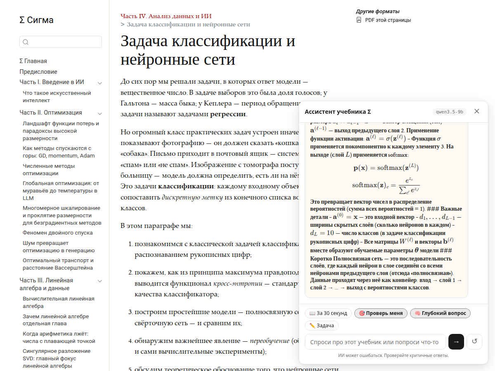

---

### ✅ `refuse_unknown_year` — out_of_scope

**Q:** В каком году Гаусс изобрёл метод сопряжённых градиентов?

_Chapter:_ `ch02_newton`

**Tools called:** search_textbook, search_textbook, search_textbook
**Tools expected:** (none)
**Images:** 0 (expected: no)
**Elapsed:** 15.5s


<details><summary>Answer</summary>


```
В учебнике я этого не нашёл.

Я проверил несколько запросов:
- «Гаусс сопряжённых градиентов»
- «сопряжённых градиентов»
- «метод сопряжённых градиентов»

Нигде в тексте учебника нет упоминаний о методе сопряжённых градиентов и его изобретении Гауссом.

**Вне учебника (общее знание):**
Метод сопряжённых градиентов был разработан не Гауссом, а в 1952 году Ричардом Хестенсом и Эдвардом Стифелем. Гаусс действительно внёс вклад в численные методы (например, метод наименьших квадратов в 1809 году), но метод сопряжённых градиентов — это более поздняя разработка.

Если ты хочешь узнать о методах оптимизации, которые есть в учебнике — спрашивай про метод Ньютона, метод Герона или метод касательных.
```

</details>


---
