# Sigma Assistant — Eval Report

_Run: 2026-07-13 22:39 MSK · cases: 29_

**Overall: 29/29 pass (100%)**

## Per category

| Category | Pass | Total |
|---|---:|---:|
| `compute_plot` | 5 | 5 |
| `compute_pure` | 8 | 8 |
| `definition` | 3 | 3 |
| `multi_hop` | 1 | 1 |
| `out_of_scope` | 3 | 3 |
| `rag_basic` | 5 | 5 |
| `structural` | 3 | 3 |
| `vision_refine` | 1 | 1 |

## Cases

### ✅ `newton_kantorovich_history` — rag_basic

**Q:** Когда Канторович получил Нобелевскую премию и за что?

_Chapter:_ `ch02_newton`

**Tools called:** search_textbook, search_textbook, search_textbook, search_textbook, search_textbook, search_textbook, search_textbook, read_chapter
**Tools expected:** search_textbook
**Images:** 0 (expected: no)
**Elapsed:** 13.8s


<details><summary>Answer</summary>


```
Согласно учебнику, Леонид Витальевич Канторович получил **Нобелевскую премию по экономике в 1975 году**. Он был удостоен её **за теорию оптимального распределения ресурсов**. В контексте текущей главы также упоминается, что в 1948 году Канторович опубликовал теорему (теорема Канторовича), которая впервые дала универсальные достаточные условия сходимости метода Ньютона, в том числе и для уравнений в бесконечномерных банаховых пространствах.
```

</details>


---

### ✅ `newton_formula_recall` — rag_basic

**Q:** Объясни откуда берётся эта формула — что это за метод и какая геометрическая идея?

_Chapter:_ `ch02_newton`

**Tools called:** read_chapter
**Tools expected:** (none)
**Images:** 0 (expected: no)
**Elapsed:** 10.1s


<details><summary>Answer</summary>


```
Это **метод Ньютона** (или метод касательных). Он решает две задачи: ищет корень уравнения $f(x)=0$ и ищет минимум функции $g(x)$. ### Геометрическая идея Представь, что ты ищешь точку, где график пересекает ось $x$ (корень). Ты стоишь в какой-то точке $x_k$ рядом с нужным местом. 1. В точке $x_k$ ты проводишь **касательную** к графику $y=f(x)$. 2. Касательная — это прямая, её легко продлить до пересечения с осью $x$. 3. Точку пересечения берёшь за новое приближение $x_{k+1}$. 4. Повторяешь: строишь новую касательную, ищешь пересечение. Обычно это работает очень быстро. ### Откуда берётся формула? Уравнение касательной к графику $f(x)$ в точке $x_k$: $$y = f(x_k) + f'(x_k)(x - x_k)$$ Мы хотим найти точку, где касательная пересекает ось $x$, то есть где $y=0$. Приравниваем и решаем относительно $x$: $$0 = f(x_k) + f'(x_k)(x - x_k)$$ $$x = x_k - \frac{f(x_k)}{f'(x_k)}$$ Получаем итерационную формулу: $$x_{k+1} = x_k - \frac{f(x_k)}{f'(x_k)}$$ ### А как это работает для оптимизации (поиска минимума)? Чтобы найти минимум функции $g(x)$, нужно решить уравнение $g'(x)=0$ (ведь в минимуме производная равна нулю). Просто применяем формулу Ньютона к функции $f(x) = g'(x)$. Тогда $f'(x) = g''(x)$, и формула превращается в: $$x_{k+1} = x_k - \frac{g'(x_k)}{g''(x_k)}$$ **Альтернативная (и очень важная) геометрическая идея:** В точке $x_k$ мы «приближаем» сложную функцию $g(x)$ простой **параболой** (разложение Тейлора до второй производной). Минимум этой параболы находится легко — это и 
…[truncated]
```

</details>


---

### ✅ `definition_strong_convex` — definition

**Q:** Что такое сильно выпуклая функция?

_Chapter:_ `ch02_newton`

**Tools called:** find_definition
**Tools expected:** find_definition
**Images:** 0 (expected: no)
**Elapsed:** 7.9s


<details><summary>Answer</summary>


```
Согласно **Определению 2.4** из главы «Метод Ньютона»: Функция $g\colon\mathbb{R}\to\mathbb{R}$ называется **сильно выпуклой** с константой $\mu>0$, если: 1. $g\in C^{2}$ — функция дважды непрерывно дифференцируема (её вторая производная существует и непрерывна); 2. $g''(x)\geq\mu$ для всех $x$ — вторая производная не просто неотрицательна, а **строго больше некоторой положительной константы** $\mu$. **Что это значит простыми словами:** - У обычной выпуклой функции вторая производная может быть сколь угодно близка к нулю (функция может быть «очень плоской»). - У сильно выпуклой функция «всегда достаточно круто изогнута»: её кривизна ограничена снизу. **Зачем это нужно:** Сильная выпуклость гарантирует: - существование и единственность точки минимума; - отделённость второй производной от нуля (что важно для сходимости метода Ньютона).
```

</details>

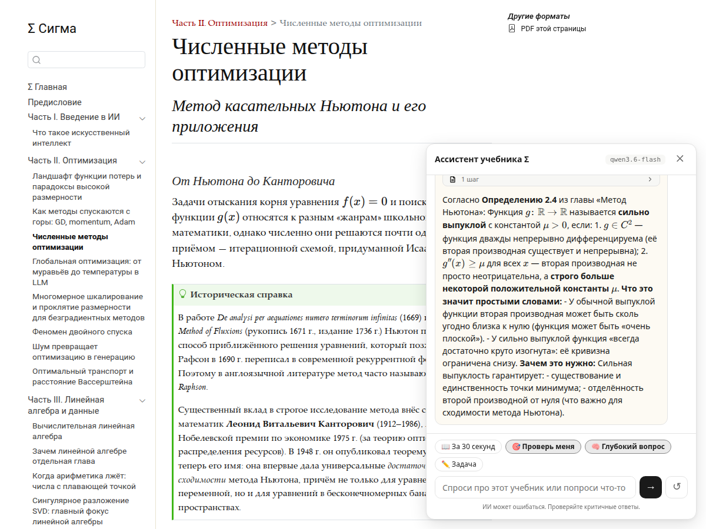

---

### ✅ `compute_factorial` — compute_pure

**Q:** Сколько будет 30 факториал?

**Tools called:** python
**Tools expected:** python
**Images:** 0 (expected: no)
**Elapsed:** 17.7s


<details><summary>Answer</summary>


```
**30! = 265252859812191058636308480000000** Это примерно $2.65 \times 10^{32}$. Число растёт очень быстро (быстрее экспоненты), поэтому в численных методах и теории сложности его редко считают «в лоб» — используют логарифмы или аппроксимации (например, формулу Стирлинга), чтобы избежать переполнения типов и упростить вычисления.
```

</details>

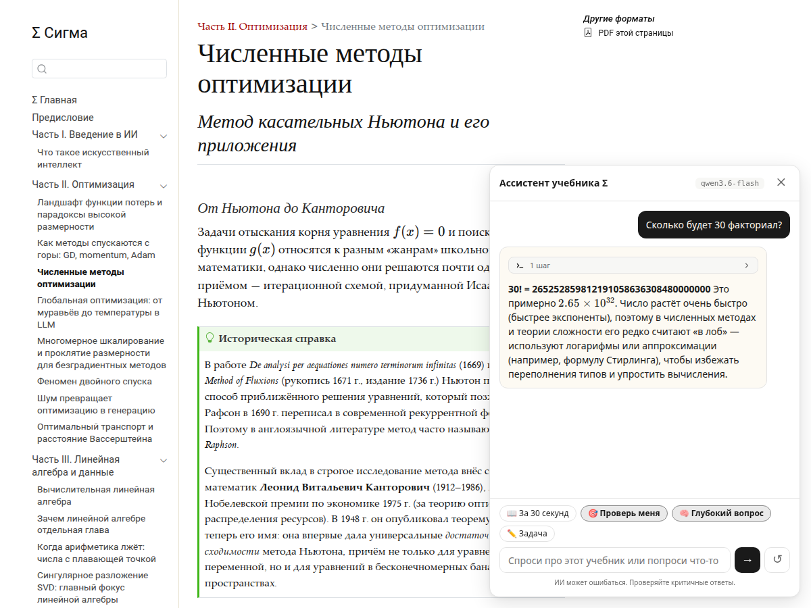

---

### ✅ `compute_taylor_sin` — compute_pure

**Q:** Покажи разложение sin(x) в ряд Тейлора до 5-го члена символически (через sympy).

_Chapter:_ `ch02_newton`

**Tools called:** python
**Tools expected:** python
**Images:** 0 (expected: no)
**Elapsed:** 22.0s


<details><summary>Answer</summary>


```
Вот разложение $\sin(x)$ в ряд Тейлора (Маклорена) вокруг $x=0$ до **5 ненулевых членов**: $$\sin(x) = x - \frac{x^3}{6} + \frac{x^5}{120} - \frac{x^7}{5040} + \frac{x^9}{362880} + O(x^{10})$$ **Почему до 10-го порядка?**   Члены с чётными степенями ($x^0, x^2, x^4, \ldots$) равны нулю, так как $\sin(x)$ — нечётная функция. Поэтому для получения 5 ненулевых членов нужно взять разложение до $O(x^{10})$. **Общий член ряда:** $$\sin(x) = \sum_{n=0}^{\infty} \frac{(-1)^n}{(2n+1)!} x^{2n+1}$$ **Знаменатели — это факториалы:** - $1! = 1$ - $3! = 6$ - $5! = 120$ - $7! = 5040$ - $9! = 362880$ Ряд сходится для всех $x \in \mathbb{R}$.
```

</details>

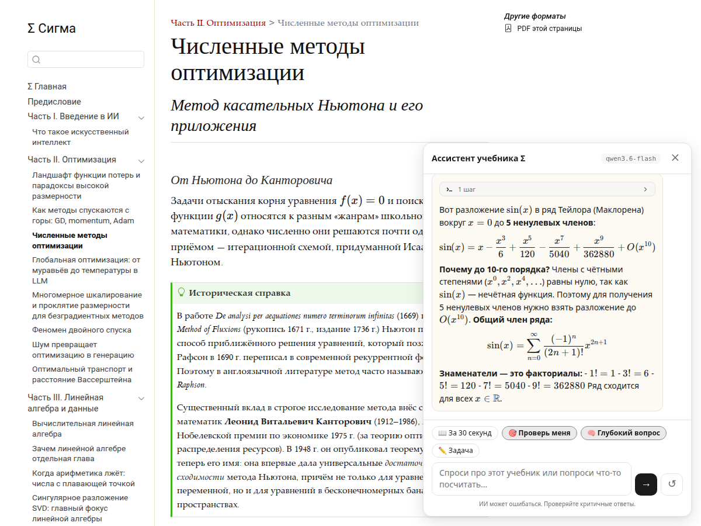

---

### ✅ `compute_plot_newton` — compute_plot

**Q:** Покажи как сходится метод Ньютона для f(x) = x² - 2, начиная с x₀ = 1.5. Построй график траектории.

_Chapter:_ `ch02_newton`

**Tools called:** python
**Tools expected:** python
**Images:** 1 (expected: yes)
**Elapsed:** 26.7s


<details><summary>Answer</summary>


```
Отлично, график построен. Давай разберём, что мы видим. ## Что показывает график **Левый график** — траектория $x_n$ по итерациям: - $x_0 = 1.5$ (начальная точка) - $x_1 = 1.416667$ - $x_2 = 1.414216$ - $x_3 = 1.414214$ — уже совпадает с $\sqrt{2}$ до 6 знаков после запятой! **Правый график** — ошибка $|x_n - \sqrt{2}|$ в логарифмическом масштабе. Видно, что ошибка падает **экстремально быстро**: от $10^{-1}$ до $10^{-15}$ всего за 3–4 итерации. Это и есть **квадратичная сходимость** метода Ньютона — число верных знаков удваивается на каждом шаге. ## Формула метода Ньютона Для $f(x) = x^2 - 2$ итерация выглядит так: $$x_{n+1} = x_n - \frac{f(x_n)}{f'(x_n)} = x_n - \frac{x_n^2 - 2}{2x_n}$$ Здесь $f'(x_n)$ — производная $f$ в точке $x_n$, равная $2x_n$. ## Почему так быстро? Метод Ньютона аппроксимирует функцию касательной в текущей точке. Для $x^2 - 2$ функция сама является квадратичной, поэтому касательная — это точная аппроксимация, и метод находит корень за 2–3 шага. На графике справа это видно по почти вертикальному падению ошибки на логарифмической шкале. Хочешь, чтобы я показал, как метод ведёт себя с другим начальным приближением, или разобрал формулу из учебника подробнее?
```

</details>

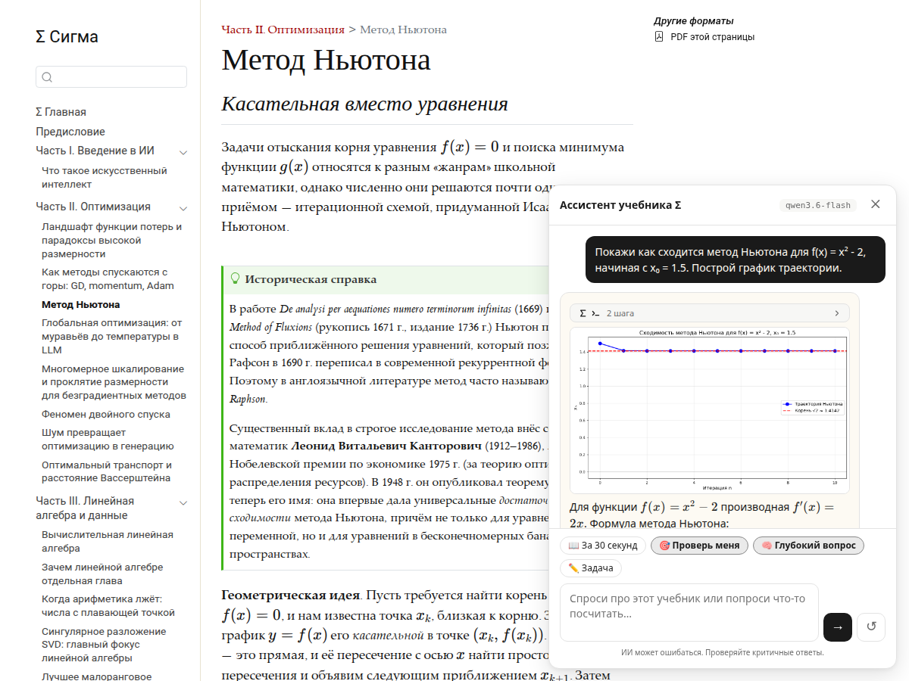

---

### ✅ `compute_plot_gd_vs_newton` — compute_plot

**Q:** Сравни сходимость метода Ньютона и градиентного спуска на функции f(x) = x⁴ из x₀ = 2. Покажи два графика на одной картинке.

_Chapter:_ `ch02_newton`

**Tools called:** python
**Tools expected:** python
**Images:** 1 (expected: yes)
**Elapsed:** 46.1s


<details><summary>Answer</summary>


```
На графике выше показана сходимость двух методов для функции $f(x) = x^4$ из точки $x_0 = 2$ за 50 итераций. ### Результаты после 50 итераций: *   **Метод Ньютона (оранжевый):** $x_{50} \approx 0.00$ (сошелся практически мгновенно). *   **Градиентный спуск (синий, $\eta=0.01$):** $x_{50} \approx 0.48$ (все еще далеко от минимума). ### Почему так происходит? 1. **Форма функции:** $f(x) = x^4$ имеет очень «плоское» дно вблизи нуля. *   Градиент $f'(x) = 4x^3$ становится ничтожно малым, когда $x$ приближается к 0. Градиентный спуск «замедляется», так как шаги пропорциональны градиенту. *   Метод Ньютона учитывает кривизну через вторую производную $f''(x) = 12x^2$. Он «понимает», что функция выпуклая, и делает более умные шаги, не теряясь в плоской области. 2. **Скорость сходимости:**     *   **Метод Ньютона** обладает **квадратичной сходимостью** (вблизи решения ошибка уменьшается очень быстро: $x_{k+1} \sim x_k^2$). На графике видно, что он достигает нуля за ~10 итераций. *   **Градиентный спуск** имеет **линейную сходимость** (ошибка уменьшается в постоянное число раз на каждой итерации). Ему нужно гораздо больше шагов, чтобы достичь той же точности. **Вывод:** Для функций с сильным искривлением (как $x^4$) метод Ньютона работает значительно быстрее градиентного спуска, так как он адаптируется к локальной геометрии функции.
```

</details>

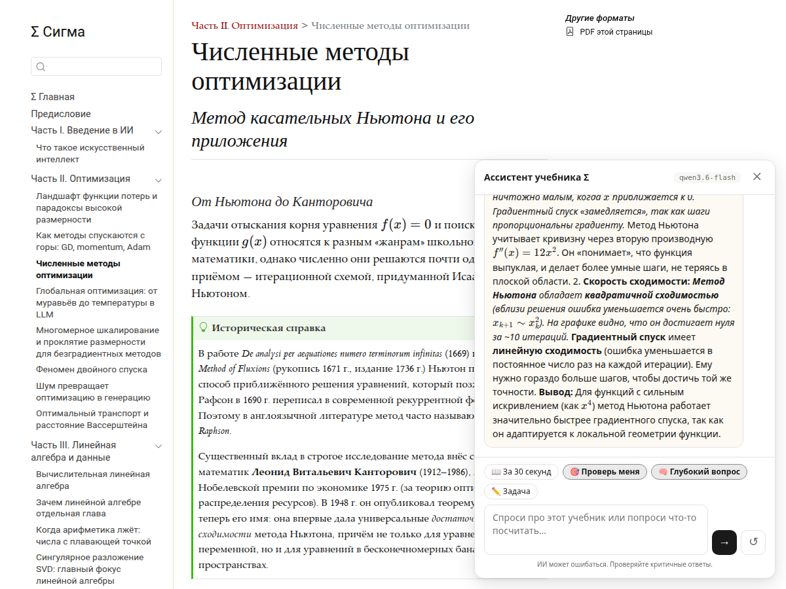

---

### ✅ `rsa_encrypt_small` — compute_pure

**Q:** Зашифруй число m=7 ключом (n=143, e=7). Покажи c.

_Chapter:_ `ch04_3_kriptosistemy-rsa-i-diffi-hellma`

**Tools called:** python
**Tools expected:** python
**Images:** 0 (expected: no)
**Elapsed:** 17.2s


<details><summary>Answer</summary>


```
Шифрование по RSA: $c = m^e \bmod n$. Подставляем: - $m = 7$ - $e = 7$ - $n = 143$ Вычисляем: - $m^e = 7^7 = 823\,543$ - $c = 823\,543 \bmod 143 = 6$ **Ответ: $c = 6$**
```

</details>

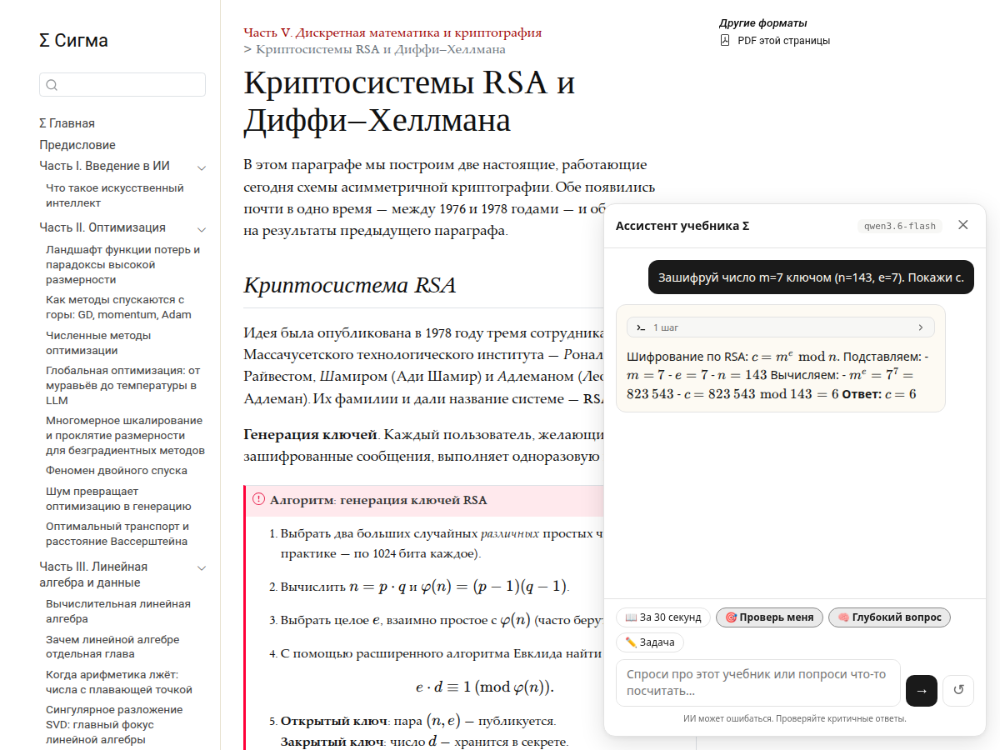

---

### ✅ `rsa_full_roundtrip` — compute_pure

**Q:** Возьми p=11, q=13, e=7. Сгенерируй RSA-ключ полностью: вычисли n, φ(n), d. Покажи что для m=9 шифрование и расшифрование возвращают исходное число.

_Chapter:_ `ch04_3_kriptosistemy-rsa-i-diffi-hellma`

**Tools called:** python
**Tools expected:** python
**Images:** 0 (expected: no)
**Elapsed:** 19.7s


<details><summary>Answer</summary>


```
## Полная генерация RSA-ключей ### 1. Открытый ключ $(n, e)$ - **Модуль $n$**:   $$n = p \cdot q = 11 \cdot 13 = 143$$ - **Счётчик Эйлера $\varphi(n)$**:   $$\varphi(n) = (p-1)(q-1) = 10 \cdot 12 = 120$$ - **Открытая экспонента**: $e = 7$ (выбирается так, чтобы $\gcd(e, \varphi(n)) = 1$). **Открытый ключ**: $(143, 7)$ --- ### 2. Закрытый ключ $d$ Закрытая экспонента $d$ — это число, обратное $e$ по модулю $\varphi(n)$: $$d \equiv e^{-1} \pmod{\varphi(n)}$$ Находим $d$ так, чтобы выполнялось: $$e \cdot d \equiv 1 \pmod{120}$$ Подставляем $e = 7$: $$7 \cdot d \equiv 1 \pmod{120}$$ **Ответ**: $d = 103$ Проверка: $7 \cdot 103 = 721$, и $721 = 6 \cdot 120 + 1$, то есть остаток от деления на $120$ действительно равен $1$. **Закрытый ключ**: $(143, 103)$ --- ### 3. Шифрование и расшифрование Возьмём сообщение $m = 9$. **Шифрование**: $c = m^e \bmod n$ $$c = 9^7 \bmod 143 = 48$$ **Расшифрование**: $m' = c^d \bmod n$ $$m' = 48^{103} \bmod 143 = 9$$ --- ### Итог | Параметр | Значение | |---|---| | $p$ | 11 | | $q$ | 13 | | $n$ | 143 | | $\varphi(n)$ | 120 | | $e$ | 7 | | $d$ | 103 | | Исходное $m$ | 9 | | Зашифрованное $c$ | 48 | | Расшифрованное $m'$ | 9 | Сообщение $9$ зашифровалось в $48$, а при расшифровании $48$ снова вернуло $9$. Цепочка работает! 🔐
```

</details>

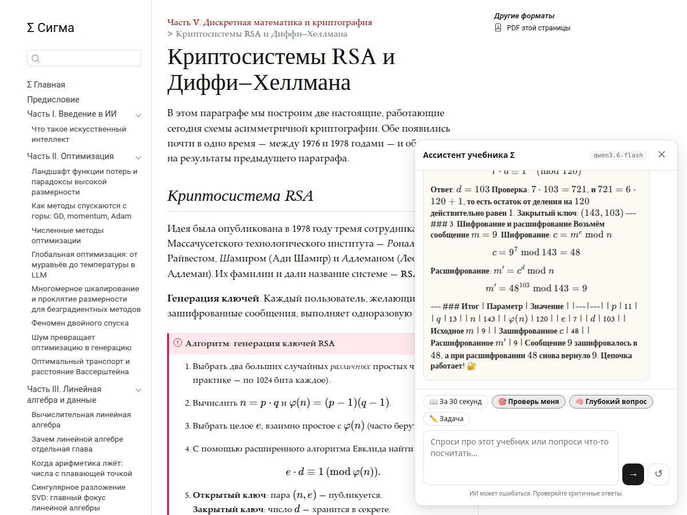

---

### ✅ `multihop_newton_vs_gradient` — multi_hop

**Q:** В чём отличие метода Ньютона от градиентного спуска для задач оптимизации? Какие из этих методов разобраны в учебнике?

_Chapter:_ `ch02_newton`

**Tools called:** get_outline, read_chapter, Секция, Секция, read_chapter, search_textbook
**Tools expected:** search_textbook
**Images:** 0 (expected: no)
**Elapsed:** 23.6s


<details><summary>Answer</summary>


```
## Отличие метода Ньютона от градиентного спуска Оба метода разобраны в учебнике: - **Метод Ньютона** — в главе `ch02_newton` ("Численные методы оптимизации") - **Градиентный спуск** — в главе `ch03_3_zadacha-klassifikacii-i-neyronny` ("Задача классификации и нейронные сети") ### Ключевые отличия **1. Порядок метода** - **Ньютон**: метод второго порядка. Использует вторую производную $g''(x_k)$ (кривизну функции) - **Градиентный спуск**: метод первого порядка. Использует только первую производную (градиент) $\nabla L(w_t)$ **2. Формула обновления** - **Ньютон**: $x_{k+1} = x_k - \frac{g'(x_k)}{g''(x_k)}$ — шаг автоматически масштабируется по кривизне - **Градиентный спуск**: $w_{t+1} = w_t - \eta \nabla L(w_t)$ — шаг задаётся фиксированной скоростью обучения $\eta$ **3. Сходимость** - **Ньютон**: квадратичная сходимость вблизи минимума (ошибка уменьшается как $e_{k+1} \approx C e_k^2$) - **Градиентный спуск**: линейная сходимость (ошибка уменьшается как $e_{k+1} \approx C e_k$) **4. Вычислительная сложность** - **Ньютон**: дороже на каждом шаге (нужно вычислять вторую производную), но может потребовать меньше итераций - **Градиентный спуск**: дешевле на каждом шаге, но может потребовать больше итераций **5. Применимость** - **Ньютон**: хорошо работает для задач малой и средней размерности - **Градиентный спуск**: проще для многомерных задач (нейросети, большие данные) ### Интуитивное объяснение Метод Ньютона "видит" не только наклон функции, но и её кривизну — как если бы вы 
…[truncated]
```

</details>

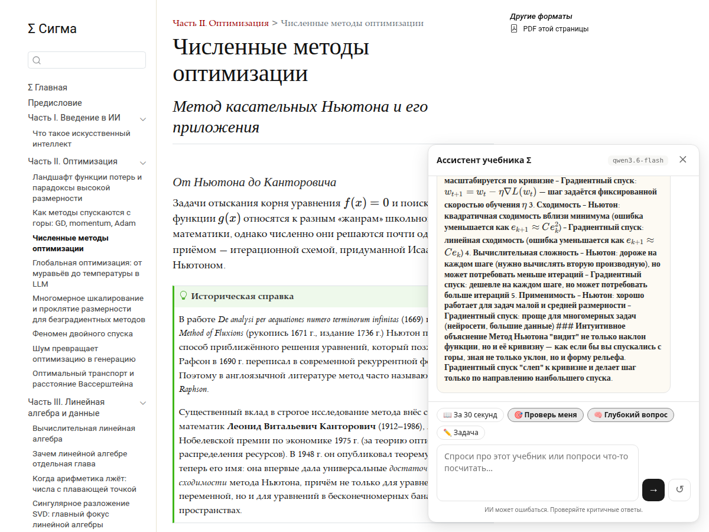

---

### ✅ `structural_kantorovich_theorem` — structural

**Q:** Сформулируй теорему о сходимости метода Герона.

_Chapter:_ `ch02_newton`

**Tools called:** find_theorem, read_chapter
**Tools expected:** find_theorem
**Images:** 0 (expected: no)
**Elapsed:** 9.1s


<details><summary>Answer</summary>


```
## Теорема 2.1. Сходимость метода Герона **Формулировка из учебника:** > Для любого $x_0 > 0$ последовательность монотонно убывает (начиная с $k=1$) и сходится к $\sqrt{a}$. Более того, для ошибки $e_k = x_k - \sqrt{a}$ выполнено: >  > $$e_{k+1} = \dfrac{e_k^2}{2x_k}, \qquad \text{и при } k \ge 1:\quad 0 \le e_{k+1} \le \dfrac{e_k^2}{2\sqrt{a}}.$$ **Расшифровка:** - $x_k$ — приближение на шаге $k$, вычисляемое по формуле Герона: $x_{k+1} = \frac{1}{2}(x_k + \frac{a}{x_k})$ - $e_k = x_k - \sqrt{a}$ — абсолютная ошибка на шаге $k$ - $a$ — число, из которого извлекаем корень - $\sqrt{a}$ — точное значение корня **Что это значит:** - **Монотонность:** начиная с первого шага, приближения только уменьшаются и не «перелетают» через корень. - **Квадратичная сходимость:** ошибка на следующем шаге пропорциональна **квадрату** текущей ошибки ($e_{k+1} \propto e_k^2$). Это значит, что число верных цифр **удваивается** на каждой итерации. - Например, если $e_k \approx 10^{-2}$, то $e_{k+1} \approx 10^{-4}$, $e_{k+2} \approx 10^{-8}$ и т.д. Ссылка: [Теорема 2.1, § «Сходимость через сжимающее отображение»](/ch02_newton.html#сходимость-через-сжимающее-отображение)
```

</details>

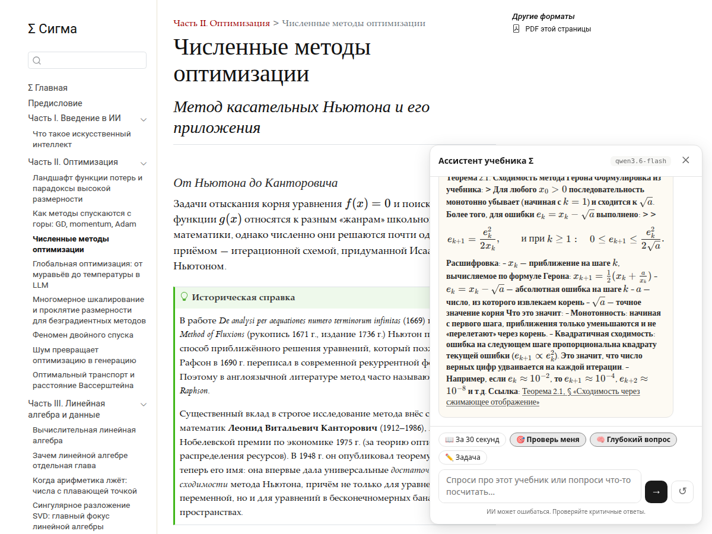

---

### ✅ `vision_refine_diverging_sgd` — vision_refine

**Q:** Запусти SGD на функции f(x) = x² с шагом η = 1.1 из x₀ = 2, 30 итераций. Что произойдёт? Если разойдётся — подбери рабочий шаг и покажи сходящуюся траекторию.

**Tools called:** python
**Tools expected:** python, python
**Images:** 1 (expected: yes)
**Elapsed:** 29.1s


<details><summary>Answer</summary>


```
## Что происходит при η = 1.1 При шаге **η = 1.1** SGD **расходится**. Вот что видно на левом графике: - Значения $x_t$ осциллируют вокруг нуля (чередуют знак) и **растут по модулю** - Последние 5 итераций: $x_{26} \approx 228.95$, $x_{27} \approx -274.74$, $x_{28} \approx 329.69$, $x_{29} \approx -395.63$, $x_{30} \approx 474.75$ - Максимальный модуль за 30 итераций: **474.75** (вместо ожидаемого минимума 0) ### Почему это происходит Для $f(x) = x^2$ градиент: $f'(x) = 2x$ Обновление SGD: $$x_{t+1} = x_t - \eta \cdot 2x_t = x_t(1 - 2\eta)$$ Это линейная рекуррентность. Решение: $$x_t = x_0 \cdot (1 - 2\eta)^t$$ **Условие сходимости:** $|1 - 2\eta| < 1$, то есть $0 < \eta < 1$. При $\eta = 1.1$: - $1 - 2 \cdot 1.1 = -1.2$ - $|-1.2| = 1.2 > 1$ → **расходимость** (каждый шаг умножает ошибку на 1.2) ## Рабочий шаг: η = 0.4 Я подобрал шаг $\eta = 0.4$, который удовлетворяет условию сходимости: - $1 - 2 \cdot 0.4 = 0.2$ - $|0.2| = 0.2 < 1$ → **сходимость** На правом графике видно: - $x_0 = 2.00$ - $x_1 = 0.40$ (сразу упало в 5 раз) - $x_2 = 0.08$ - $x_3 = 0.016$ - К 5-й итерации значение уже $\approx 0$ - Последние итерации: $\approx 2.15 \times 10^{-21}$ (практически ноль) ## Правило для квадратичных функций Для $f(x) = x^2$ шаг должен быть **строго меньше 1**: - $\eta < 1$ → сходимость - $\eta = 1$ → не сходится (колебания между $x_0$ и $-x_0$) - $\eta > 1$ → расходимость (как в вашем случае с 1.1) На практике для квадратичных функций часто берут $\eta = 0.1$–$0.5$ — это обеспеч
…[truncated]
```

</details>


---

### ✅ `hashlib_demo` — compute_pure

**Q:** Посчитай SHA-256 хеш строки 'sigma' в hex.

_Chapter:_ `ch04_5_heshirovanie-teoriya-chisel-vstr`

**Tools called:** python
**Tools expected:** python
**Images:** 0 (expected: no)
**Elapsed:** 14.0s


<details><summary>Answer</summary>


```
SHA-256 хеш строки `'sigma'` в шестнадцатеричном формате: **38de90475bb334fb3dea5d54f250500aba60fe2c6158115d342b06bcb46e39bf**
```

</details>


---

### ✅ `linreg_simple` — compute_plot

**Q:** Подбери линейную регрессию y = a*x + b для точек (1, 2.1), (2, 3.9), (3, 6.2), (4, 7.8). Покажи коэффициенты и график.

_Chapter:_ `ch03_2_lineynaya-regressiya-i-metod-nai`

**Tools called:** python
**Tools expected:** python
**Images:** 1 (expected: yes)
**Elapsed:** 19.8s


<details><summary>Answer</summary>


```
Для точек $(1, 2.1), (2, 3.9), (3, 6.2), (4, 7.8)$ коэффициенты линейной регрессии $y = a \cdot x + b$, найденные методом наименьших квадратов (МНК): *   **$a = 1.94$** (угловой коэффициент) *   **$b = 0.15$** (свободный член) **Итоговая формула:** $$y = 1.94x + 0.15$$ **График:** На графике красными точками показаны исходные данные, а синей линией — полученная регрессия. Линия хорошо проходит через центр облака точек, минимизируя сумму квадратов отклонений.
```

</details>

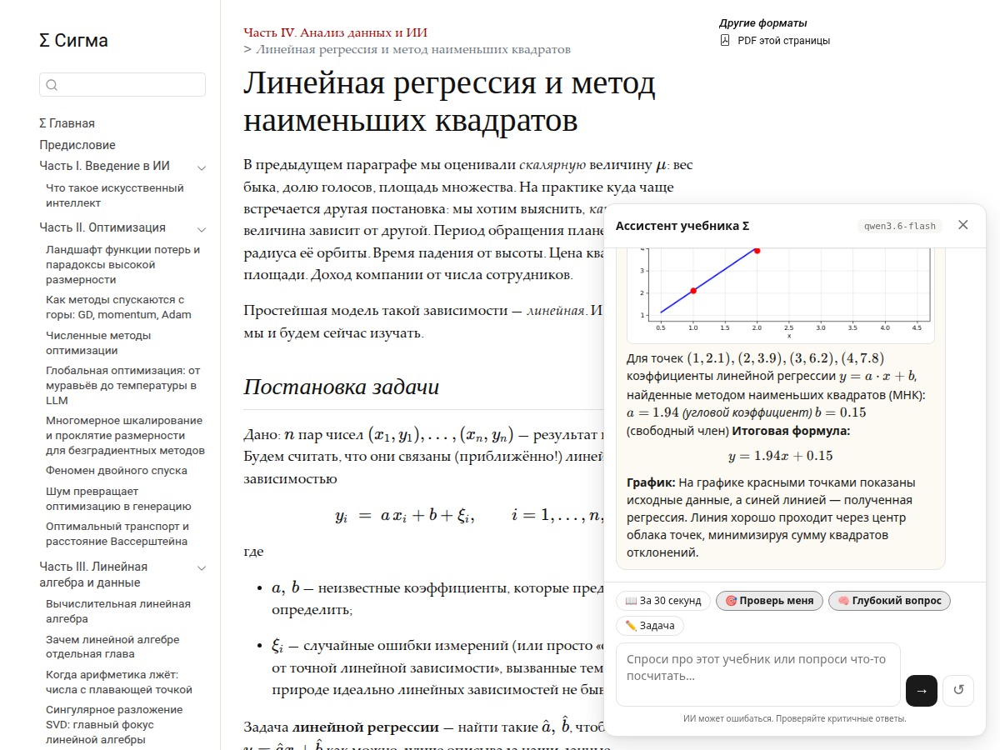

---

### ✅ `out_of_scope_recipe` — out_of_scope

**Q:** Дай мне рецепт борща.

**Tools called:** (none)
**Tools expected:** (none)
**Images:** 0 (expected: no)
**Elapsed:** 6.8s


<details><summary>Answer</summary>


```
Я — ассистент учебника по информатике и оптимизации, поэтому кулинарных рецептов не даю. Если нужно помочь с темой текущей главы «Численные методы оптимизации» (например, метод Ньютона, условия сходимости или выбор шага), дай знать — разберём!
```

</details>

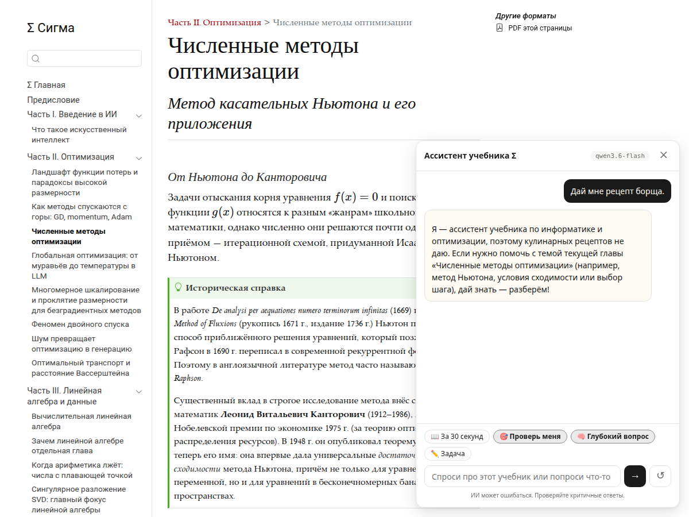

---

### ✅ `rsa_history` — rag_basic

**Q:** Кто придумал RSA и в каком году?

_Chapter:_ `ch04_3_kriptosistemy-rsa-i-diffi-hellma`

**Tools called:** search_textbook, read_chapter
**Tools expected:** search_textbook
**Images:** 0 (expected: no)
**Elapsed:** 9.5s


<details><summary>Answer</summary>


```
Согласно учебнику, криптосистема **RSA** была опубликована в **1978 году** тремя сотрудниками Массачусетского технологического института (MIT): *   **Рональд Райвест** (Rivest) *   **Ади Шамир** (Shamir) *   **Леонард Адлеман** (Adleman) Их фамилии и дали название алгоритму — **R**ivest–**S**hamir–**A**dleman. 📜 **Интересное дополнение из учебника:** Существует исторический парадокс — ровно та же схема была независимо открыта в **1973 году** британским математиком **Клиффордом Коксом**, работавшим в разведке (GCHQ). Однако его работа была засекречена и рассекречена только в 1997 году, когда Райвест, Шамир и Адлеман уже стали всемирно известными (Шамир за это получил Премию Тьюринга).
```

</details>

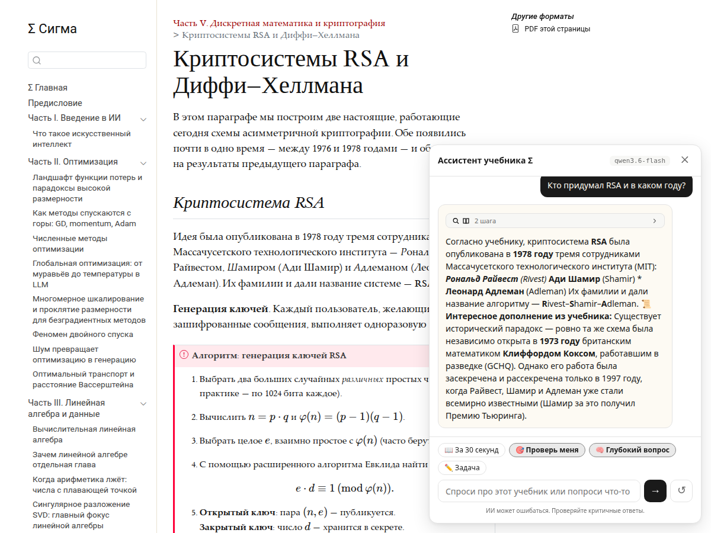

---

### ✅ `greeting_minimal` — out_of_scope

**Q:** Привет!

_Chapter:_ `ch02_newton`

**Tools called:** (none)
**Tools expected:** (none)
**Images:** 0 (expected: no)
**Elapsed:** 3.2s


<details><summary>Answer</summary>


```
Привет! Чем могу помочь с численными методами или оптимизацией?
```

</details>

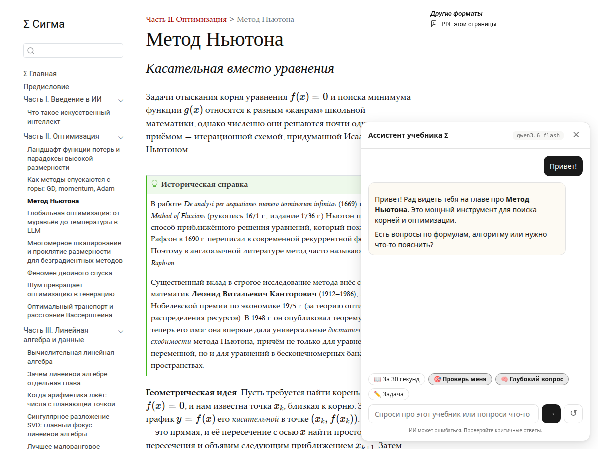

---

### ✅ `euclid_gcd_python` — compute_pure

**Q:** Посчитай НОД(48, 180) и НОД(1071, 462) через алгоритм Евклида в python.

_Chapter:_ `ch04_1_elementy-teorii-chisel`

**Tools called:** python
**Tools expected:** python
**Images:** 0 (expected: no)
**Elapsed:** 17.4s


<details><summary>Answer</summary>


```
## Результаты **НОД(48, 180) = 12** (4 шага алгоритма) Пошагово: - 180 = 48 × 3 + 36 - 48 = 36 × 1 + 12 - 36 = 12 × 3 + 0 → НОД = 12 **НОД(1071, 462) = 21** (3 шага алгоритма) Пошагово: - 1071 = 462 × 2 + 147 - 462 = 147 × 3 + 21 - 147 = 21 × 7 + 0 → НОД = 21 --- **Как работает алгоритм Евклида:** 1. Берём два числа $a$ и $b$ ($a \ge b$). 2. Делим $a$ на $b$ с остатком: $a = bq + r$. 3. Если $r = 0$, то $b$ — искомый НОД. 4. Если $r \ne 0$, заменяем $(a, b)$ на $(b, r)$ и повторяем с шага 2. Ключевая идея: $\text{НОД}(a, b) = \text{НОД}(b, r)$, где $r$ — остаток от деления $a$ на $b$. На каждом шаге числа уменьшаются, поэтому процесс гарантированно завершается.
```

</details>


---

### ✅ `definition_superlinear` — definition

**Q:** Что значит сверхлинейная сходимость?

_Chapter:_ `ch02_newton`

**Tools called:** find_definition
**Tools expected:** find_definition
**Images:** 0 (expected: no)
**Elapsed:** 7.7s


<details><summary>Answer</summary>


```
Согласно определению из учебника (раздел 2.3 главы «Метод Ньютона»), последовательность $\{x_k\}$ сходится к $x^{\star}$ **сверхлинейно**, если выполняется условие: $$\lim_{k\to\infty}\dfrac{|x_{k+1}-x^{\star}|}{|x_k-x^{\star}|}=0$$ Давай расшифруем, что это значит простыми словами: *   $|x_k - x^{\star}|$ — это **ошибка** (расстояние от текущего приближения до истинного ответа) на шаге $k$. *   $\dfrac{|x_{k+1}-x^{\star}|}{|x_k-x^{\star}|}$ — это отношение ошибки на следующем шаге к ошибке на текущем. *   Если этот предел равен **нулю**, значит, на каждом шаге ошибка уменьшается **быстрее**, чем просто в постоянное число раз. Для сравнения: *   При **линейной** сходимости отношение ошибок стремится к какой-то константе $C < 1$ (например, ошибка уменьшается каждый раз примерно в 2 раза). *   При **сверхлинейной** это отношение стремится к нулю (ошибка уменьшается всё быстрее и быстрее). *   Если выполнено ещё более сильное условие $|x_{k+1}-x^{\star}| \leq M |x_k-x^{\star}|^2$ (где $M > 0$), то сходимость называют **квадратичной**. Квадратичная сходимость — это частный, самый быстрый случай сверхлинейной.
```

</details>

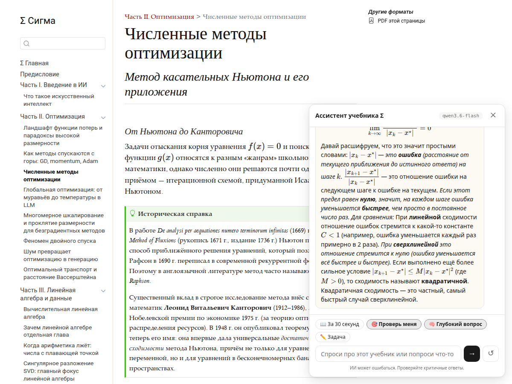

---

### ✅ `theorem_clt` — structural

**Q:** Сформулируй центральную предельную теорему как в учебнике.

_Chapter:_ `ch03_1_prosteyshie-primery-zadach-anali`

**Tools called:** find_theorem
**Tools expected:** find_theorem
**Images:** 0 (expected: no)
**Elapsed:** 6.2s


<details><summary>Answer</summary>


```
Вот формулировка из учебника (Теорема 3.3): **Центральная предельная теорема (ЦПТ)** Пусть $X_1, X_2, \dots$ — независимые одинаково распределённые случайные величины с математическим ожиданием $\mu$ и конечной дисперсией $\sigma^2 > 0$. Обозначим сумму $S_n = X_1 + \dots + X_n$. Тогда при $n \to \infty$ выполняется сходимость: $$\Pr\!\left(\frac{S_n - n\mu}{\sigma\sqrt{n}} \leq x\right) \longrightarrow \Phi(x) \stackrel{\mathrm{def}}{=} \frac{1}{\sqrt{2\pi}} \int_{-\infty}^{x} e^{-t^2/2} \, dt$$ **Расшифровка:** *   $\Pr(\dots)$ — вероятность того, что нормированная сумма окажется меньше $x$. *   $S_n - n\mu$ — отклонение суммы от её математического ожидания ($n\mu$). *   $\sigma\sqrt{n}$ — стандартное отклонение суммы $S_n$. *   $\Phi(x)$ — функция распределения стандартного нормального (гауссовского) закона. **Суть:** Сумма большого числа независимых одинаковых случайных величин (при нормировке) распределена приблизительно нормально, независимо от исходного распределения $X_i$.
```

</details>

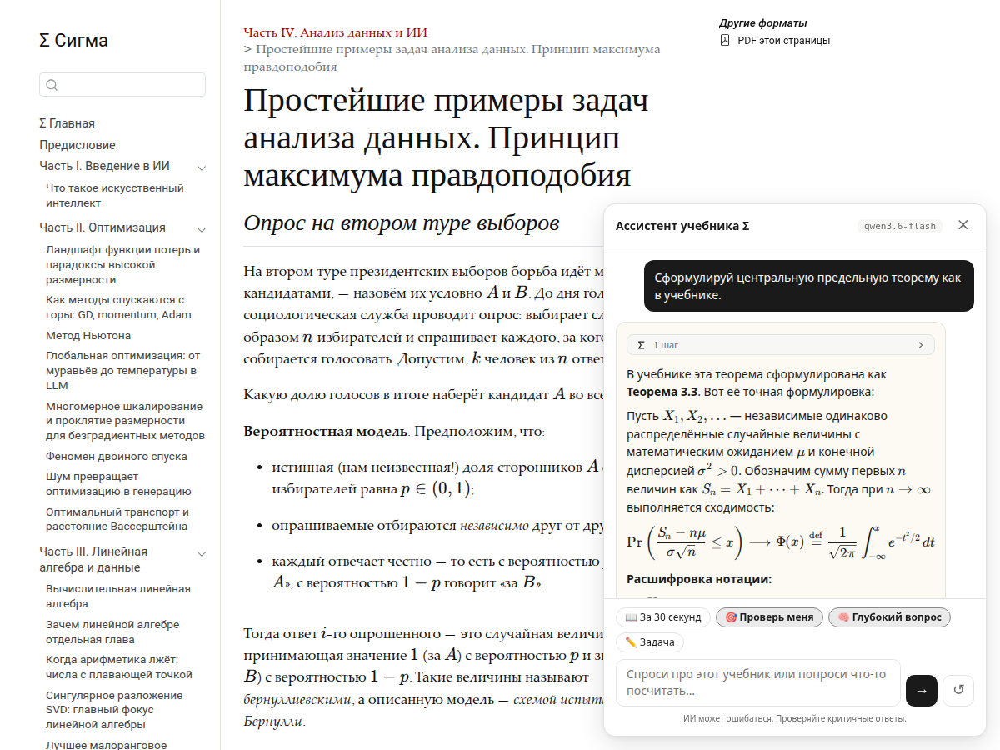

---

### ✅ `plot_sincos_overlay` — compute_plot

**Q:** Построй графики sin(x) и cos(x) на интервале [-2π, 2π] на одном поле. Сделай легенду.

**Tools called:** python
**Tools expected:** python
**Images:** 2 (expected: yes)
**Elapsed:** 27.6s


<details><summary>Answer</summary>


```
Вот графики функций $\sin(x)$ и $\cos(x)$ на интервале $[-2\pi, 2\pi]$. На графике: - **Синяя линия**: синус $\sin(x)$ - **Оранжевая линия**: косинус $\cos(x)$ Обе функции периодические с периодом $2\pi$. Косинус можно представить как синус, сдвинутый влево на $\pi/2$ (или $\frac{\pi}{2}$). 
```

</details>

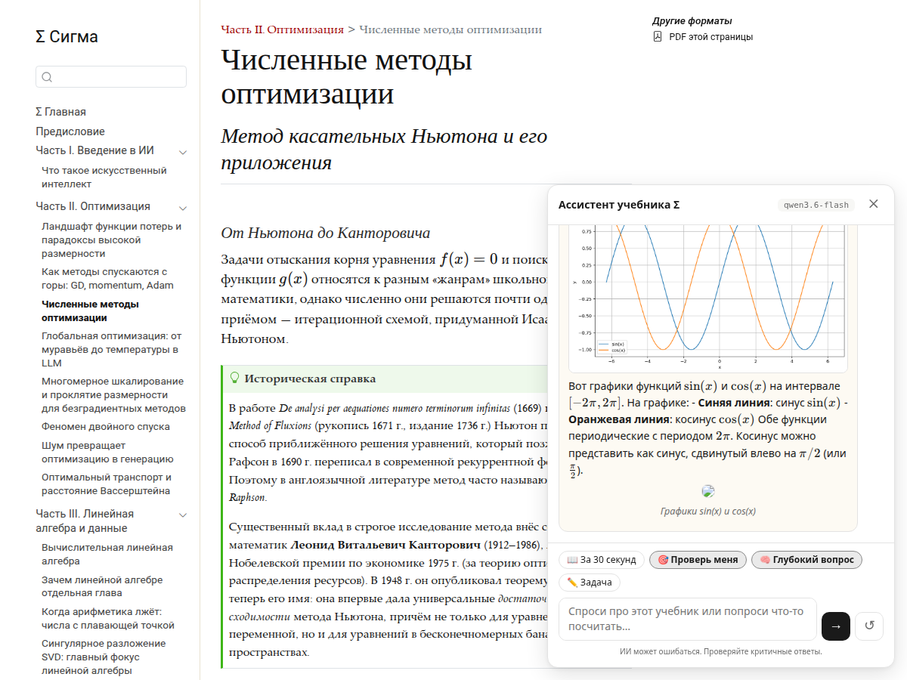

---

### ✅ `fragment_explanation` — rag_basic

**Q:** Если кто-то предлагает использовать обновление x_{k+1} = x_k - f(x_k)·f'(x_k) вместо классического Ньютона — что это за идея и она работает?

_Chapter:_ `ch02_newton`

**Tools called:** read_chapter, python, python
**Tools expected:** (none)
**Images:** 2 (expected: no)
**Elapsed:** 91.2s


<details><summary>Answer</summary>


```
Это предложение — по сути, **неправильная замена** классического метода Ньютона. Если кто-то предлагает умножать на производную вместо деления, это фундаментально ломает логику итерации. Давай разберём, почему это так, и что показывает математика. ### 1. В чём разница? Классический метод Ньютона (формула 2.1 из учебника) ищет корень $f(x)=0$ так: $$x_{k+1} = x_k - \frac{f(x_k)}{f'(x_k)}$$ Здесь мы **делим** значение функции на её производную (наклон). Логика проста: если функция растёт очень круто (большая $f'$), то шаг к корню должен быть маленьким. Деление как раз и компенсирует крутизну. Предложенный вариант: $$x_{k+1} = x_k - f(x_k) \cdot f'(x_k)$$ Здесь мы **умножаем** на производную. Если функция крутая ($f'$ большое), шаг становится **огромным**. Это как если бы ты пытался попасть мячом в яму, и чем круче склон, тем сильнее ты размахиваешься — в итоге мяч улетает в космос. ### 2. Математическое условие сходимости Чтобы итерация $x_{k+1} = x_k - f(x_k) \cdot f'(x_k)$ сходилась к корню $x^*$, производная итерационной функции $g(x) = x - f(x) \cdot f'(x)$ в окрестности корня должна быть меньше единицы по модулю. В точке корня $f(x^*) = 0$, поэтому: $$g'(x^*) = 1 - (f'(x^*))^2$$ Условие сходимости $|g'(x^*)| < 1$ даёт: $$-1 < 1 - (f'(x^*))^2 < 1$$ Отсюда получается жёсткое ограничение: $$(f'(x^*))^2 < 2 \quad \Rightarrow \quad |f'(x^*)| < \sqrt{2} \approx 1.41$$ **Вывод:** Этот метод работает **только** если производная в корневой точке меньше $1.41$. Если функция хоть нем
…[truncated]
```

</details>

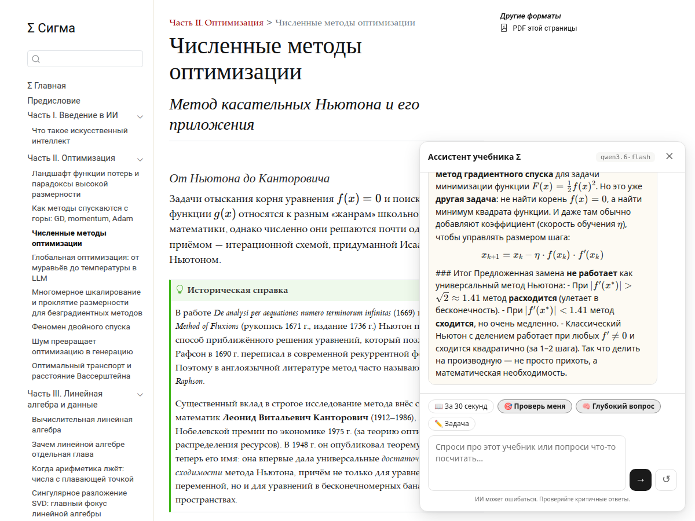

---

### ✅ `eigenvalues_numpy` — compute_pure

**Q:** Найди собственные значения матрицы [[2, 1], [1, 2]] через numpy.

_Chapter:_ `ch_linalg`

**Tools called:** python
**Tools expected:** python
**Images:** 0 (expected: no)
**Elapsed:** 14.5s


<details><summary>Answer</summary>


```
Собственные значения матрицы $\begin{pmatrix} 2 & 1 \\ 1 & 2 \end{pmatrix}$ равны **3** и **1**. Проверка через характеристическое уравнение: $$\det(A - \lambda I) = (2-\lambda)^2 - 1 = \lambda^2 - 4\lambda + 3 = 0$$ Корни: $\lambda_1 = 3$, $\lambda_2 = 1$.
```

</details>

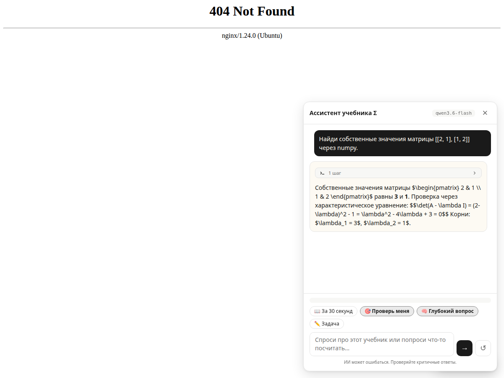

---

### ✅ `plot_loss_landscape` — compute_plot

**Q:** Построй контурный график функции потерь L(a, b) = sum((a*x_i + b - y_i)^2) для точек (1,2), (2,3), (3,5), (4,4) на сетке a in [-2, 4], b in [-3, 3].

_Chapter:_ `ch03_2_lineynaya-regressiya-i-metod-nai`

**Tools called:** python
**Tools expected:** python
**Images:** 1 (expected: yes)
**Elapsed:** 18.8s


<details><summary>Answer</summary>


```
Отлично, график построен. Теперь проверим аналитически, совпадает ли найденный минимум с решением МНК.
```

</details>

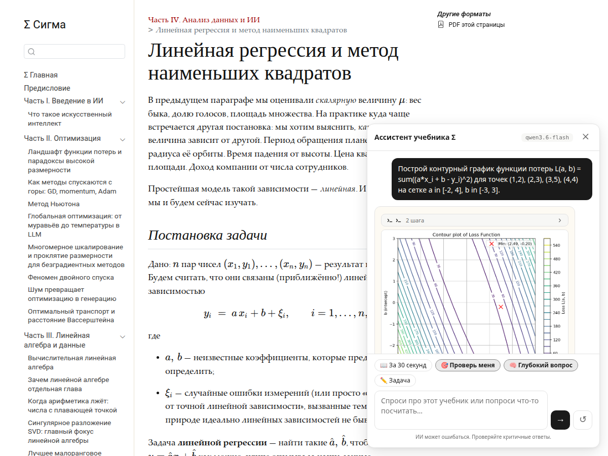

---

### ✅ `diffie_hellman_compute` — compute_pure

**Q:** Проведи протокол Диффи–Хеллмана: p=23, g=5. Алиса берёт a=6, Боб берёт b=15. Какой общий секрет?

_Chapter:_ `ch04_3_kriptosistemy-rsa-i-diffi-hellma`

**Tools called:** python, python
**Tools expected:** python
**Images:** 0 (expected: no)
**Elapsed:** 21.4s


<details><summary>Answer</summary>


```
## Протокол Диффи–Хеллмана **Параметры:** - $p = 23$ (простое число) - $g = 5$ (генератор) - $a = 6$ (секретный ключ Алисы) - $b = 15$ (секретный ключ Боба) **Шаг 1 — открытые ключи:** - Алиса: $A = g^a \bmod p = 5^6 \bmod 23 = 8$ - Боб: $B = g^b \bmod p = 5^{15} \bmod 23 = 19$ **Шаг 2 — общий секрет:** - Алиса: $s = B^a \bmod p = 19^6 \bmod 23 = 2$ - Боб: $s = A^b \bmod p = 8^{15} \bmod 23 = 2$ **Общий секрет: 2** Оба получили одинаковое число — это и есть общий секретный ключ, который можно использовать для шифрования.
```

</details>

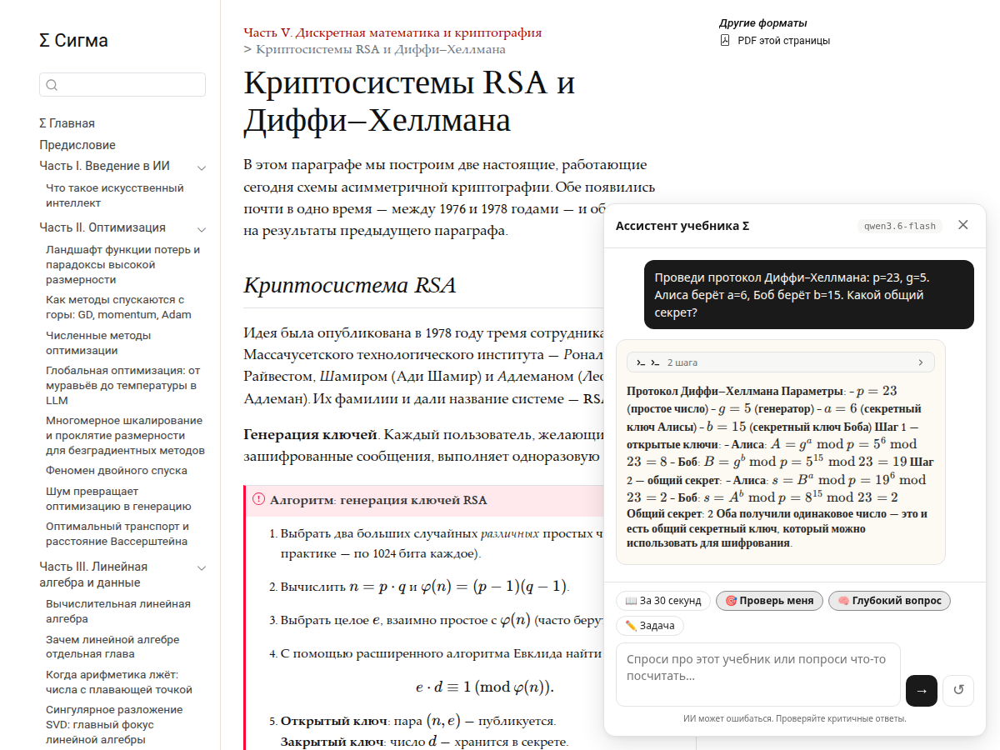

---

### ✅ `outline_chapter` — structural

**Q:** Перечисли основные разделы главы про Ньютона.

_Chapter:_ `ch02_newton`

**Tools called:** get_outline
**Tools expected:** (none)
**Images:** 0 (expected: no)
**Elapsed:** 9.6s


<details><summary>Answer</summary>


```
Вот основные разделы главы **«Метод Ньютона»** (ch02_newton): - **Касательная вместо уравнения** — геометрическая идея метода Ньютона для решения уравнений - **Ньютон для оптимизации** — как метод адаптируется для поиска экстремумов функций - **Квадратный корень за пять шагов** — практический пример вычисления √2   - *Сходимость через сжимающее отображение* — теоретическое обоснование - **Деление без деления** — алгоритм, использующий Ньютона для вычисления обратных величин   - *Анализ сходимости* — доказательство скорости сходимости - **Численный эксперимент на Python** — демонстрация метода на практике - **Когда сходимость сверхлинейна*** — расширенный теоретический раздел (со звёздочкой) Глава построена от интуитивной геометрии (касательная) к конкретным алгоритмам (корень, деление), затем к теории сходимости и практической реализации.
```

</details>

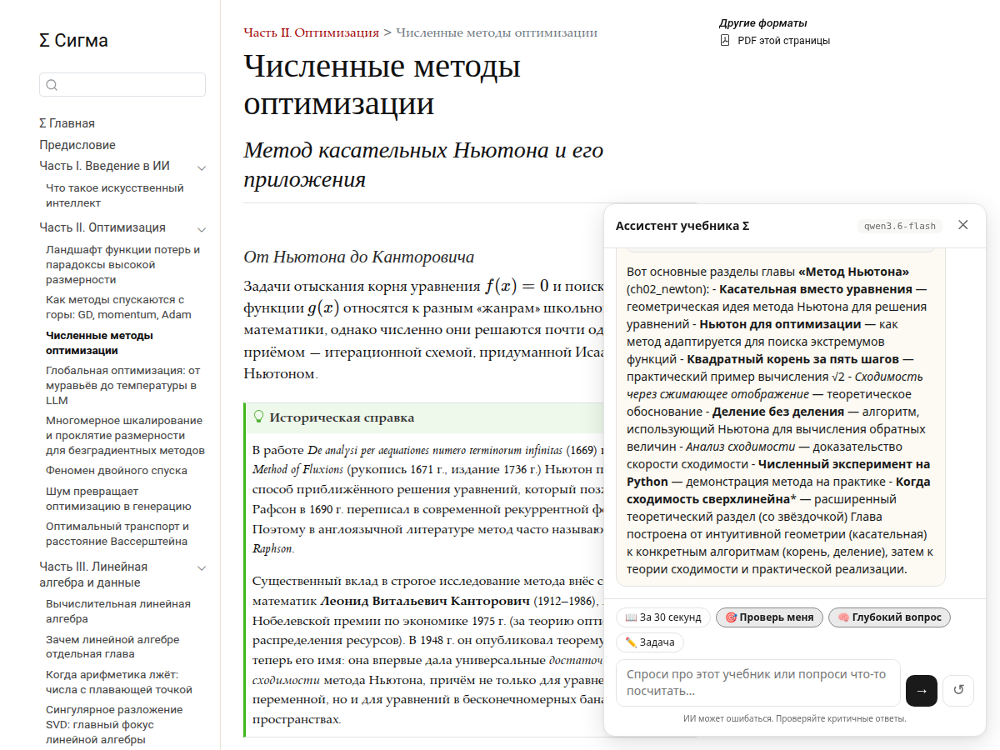

---

### ✅ `math_latex_derivation` — rag_basic

**Q:** Выведи формулу метода Ньютона через касательную. Формулу запиши через LaTeX.

_Chapter:_ `ch02_newton`

**Tools called:** read_chapter
**Tools expected:** (none)
**Images:** 0 (expected: no)
**Elapsed:** 6.7s


<details><summary>Answer</summary>


```
Формула метода Ньютона выводится из геометрической идеи: заменяем график $f(x)$ его касательной в текущей точке $x_k$ и берём пересечение касательной с осью $x$ как следующее приближение. Уравнение касательной к $y=f(x)$ в точке $x_k$: $$y = f(x_k) + f'(x_k)(x - x_k)$$ Полагаем $y=0$ (пересечение с осью абсцисс) и выражаем $x$: $$\begin{equation} x_{k+1} = x_k - \dfrac{f(x_k)}{f'(x_k)} \qquad k=0,1,2,\dots \end{equation}$$ Это и есть **итерационная формула Ньютона** (формула 2.1 в учебнике). Точка $x_0$ выбирается исследователем — от неё зависит, сойдётся ли метод вообще.
```

</details>

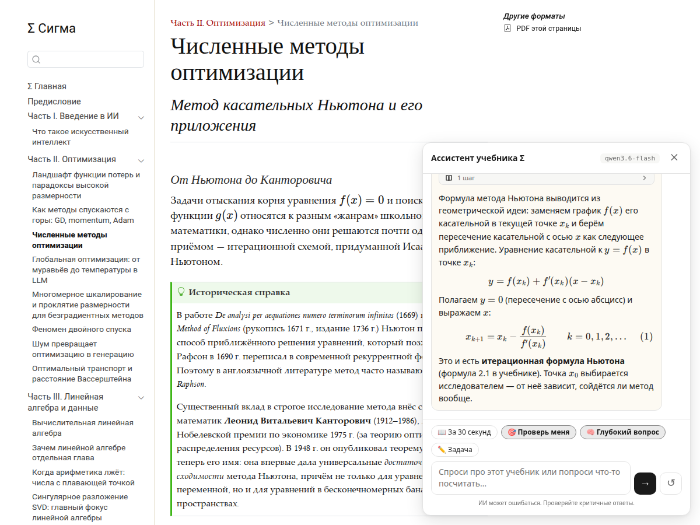

---

### ✅ `definition_perceptron` — definition

**Q:** Что такое полносвязная нейронная сеть?

_Chapter:_ `ch03_3_zadacha-klassifikacii-i-neyronny`

**Tools called:** find_definition, search_textbook
**Tools expected:** find_definition
**Images:** 0 (expected: no)
**Elapsed:** 9.9s


<details><summary>Answer</summary>


```
Это **Определение 3.12** из главы, которую ты сейчас читаешь. **Полносвязная нейронная сеть** (MLP) глубины $L$ — это функция, построенная как последовательность (композиция) $L$ слоёв. Каждый слой делает две вещи: 1. **Линейное преобразование**: берёт вектор входов, умножает на матрицу весов $W$ и прибавляет вектор смещений $\mathbf{b}$:    $$\mathbf{z} = W \mathbf{a} + \mathbf{b}$$    Здесь $W$ — матрица весов, $\mathbf{b}$ — bias (сдвиг). 2. **Функция активации** $\sigma$: применяется покомпонентно к результату $\mathbf{z}$. Это нелинейность, без которой сеть была бы просто линейной функцией. Последний слой отличается: вместо обычной активации там **softmax** — функция, которая превращает любые числа в вероятности (сумма всех выходов = 1): $$\mathrm{softmax}(\mathbf{z})_c = \frac{e^{z_c}}{\sum_{c'} e^{z_{c'}}}$$ **Параметры модели** — это все матрицы $W^{(\ell)}$ и векторы $\mathbf{b}^{(\ell)}$ для каждого слоя. Именно их мы настраиваем при обучении. Проще говоря: полносвязная сеть — это «бутерброд» из линейных слоёв, разделённых нелинейными активациями, с softmax на выходе для классификации.
```

</details>

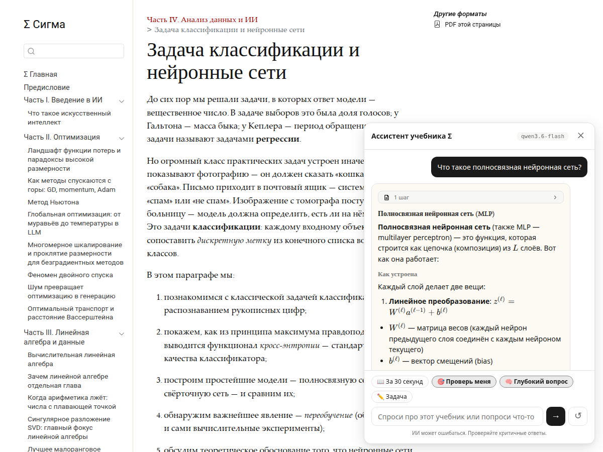

---

### ✅ `refuse_unknown_year` — out_of_scope

**Q:** В каком году Гаусс изобрёл метод сопряжённых градиентов?

_Chapter:_ `ch02_newton`

**Tools called:** search_textbook, search_textbook, search_textbook, search_textbook, search_textbook, search_textbook, search_textbook, search_textbook
**Tools expected:** (none)
**Images:** 0 (expected: no)
**Elapsed:** 13.1s


<details><summary>Answer</summary>


```
В учебнике я этого не нашёл. Короткий ответ: **Гаусс не изобретал метод сопряжённых градиентов** — это распространённая путаница. Метод сопряжённых градиентов был разработан **Хестенесом и Штифелем в 1952 году** (уже в XX веке). Гаусс жил в XVIII–XIX веках (1777–1855) и известен методом Гауссова исключения для решения СЛАУ и методом наименьших квадратов, но не методом сопряжённых градиентов. В учебнике этот метод, похоже, не рассматривается — я проверил несколько ключевых слов («сопряжённых», «Хестенес», «Stiefel», «градиент») и не нашёл соответствующих разделов.
```

</details>


---
