# Sigma Assistant — Eval Report

_Run: 2026-07-13 23:36 MSK · cases: 29_

**Overall: 20/29 pass (69%)**

## Per category

| Category | Pass | Total |
|---|---:|---:|
| `compute_plot` | 3 | 5 |
| `compute_pure` | 5 | 8 |
| `definition` | 3 | 3 |
| `multi_hop` | 1 | 1 |
| `out_of_scope` | 3 | 3 |
| `rag_basic` | 2 | 5 |
| `structural` | 3 | 3 |
| `vision_refine` | 0 | 1 |

## Cases

### ❌ `newton_kantorovich_history` — rag_basic

**Q:** Когда Канторович получил Нобелевскую премию и за что?

_Chapter:_ `ch02_newton`

**Tools called:** search_textbook, search_textbook
**Tools expected:** search_textbook
**Images:** 0 (expected: no)
**Elapsed:** 26.2s

_Missing substrings:_ ['1975', 'оптимал']

<details><summary>Answer</summary>


```
Let me try a more specific search and also read the chapter the student is currently on, which likely discusses Kantorovich in the context of optimization.
```

</details>

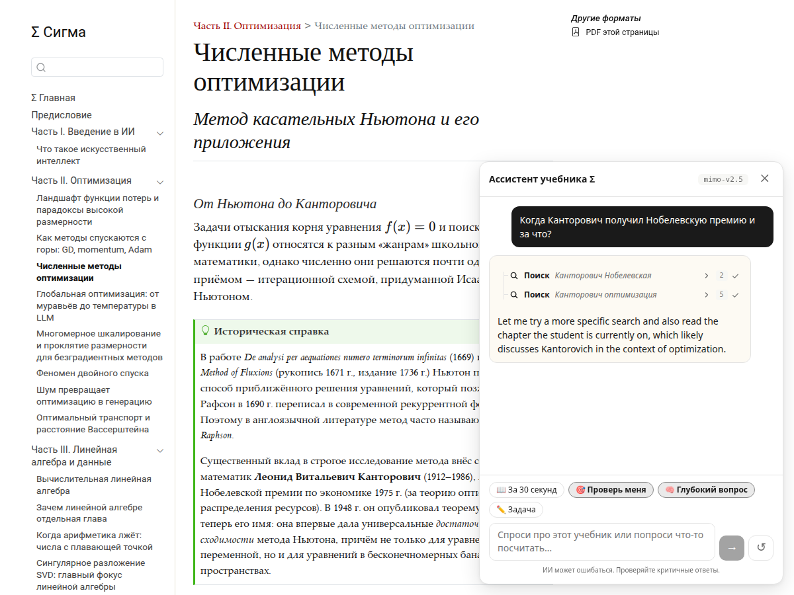

---

### ✅ `newton_formula_recall` — rag_basic

**Q:** Объясни откуда берётся эта формула — что это за метод и какая геометрическая идея?

_Chapter:_ `ch02_newton`

**Tools called:** read_chapter
**Tools expected:** (none)
**Images:** 0 (expected: no)
**Elapsed:** 105.0s


<details><summary>Answer</summary>


```
## Метод Ньютона — откуда берётся формула Ты читаешь главу о **методе касательных Ньютона** (он же метод Ньютона–Рафсона). Вот как устроен его ключевой механизм. --- ### Корень уравнения: $x_{k+1} = x_k - \dfrac{f(x_k)}{f'(x_k)}$ **Геометрическая идея**: мы хотим найти корень $f(x)=0$, то есть точку, где график $y=f(x)$ пересекает ось $x$. На каждом шаге: 1. Берём известную точку $x_k$, близкую к корню. 2. Рисуем **касательную** к графику $f$ в этой точке: $y = f(x_k) + f'(x_k)(x - x_k)$. 3. Ищем, где эта касательная пересекает ось $x$ (ставим $y=0$) — это и есть $x_{k+1}$. 4. Повторяем. Касательная — это прямая, её пересечение с осью $x$ найти предельно просто. Каждый шаг мы как бы «приближаем» кривую прямой линией и двигаемся к корню. --- ### Для оптимизации: $x_{k+1} = x_k - \dfrac{g'(x_k)}{g''(x_k)}$ Задача минимума функции $g$ — это задача найти ноль производной: $g'(x)=0$. Подставляем $f=g'$ (и тогда $f'=g''$) в формулу Ньютона — получаем итерацию **(2.2)**. Но есть более наглядный способ понять формулу — через **разложение Тейлора**: $$g(x) \approx g(x_k) + g'(x_k)(x - x_k) + \tfrac{1}{2} g''(x_k)(x - x_k)^2$$ **Идея**: вместо сложной функции $g$ мы строим **параболу** $q_k(x)$, которая локально хорошо её приближает (учитывает значение, наклон и *искривление*). Минимум параболыZR einfach посчитать — приравниваем $q_k'(x)=0$: $$g'(x_k) + g''(x_k)(x - x_k) = 0 \quad\Longrightarrow\quad x_{k+1} = x_k - \frac{g'(x_k)}{g''(x_k)}$$ Геометрически: на каждом шаге мы проводим *
…[truncated]
```

</details>

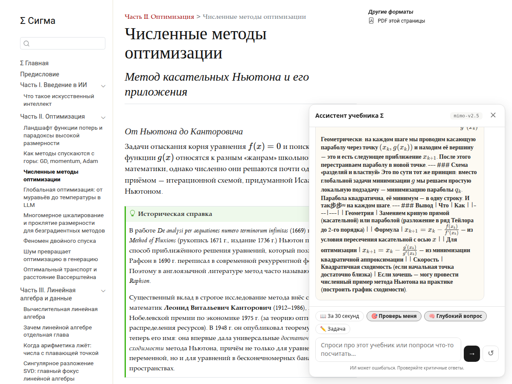

---

### ✅ `definition_strong_convex` — definition

**Q:** Что такое сильно выпуклая функция?

_Chapter:_ `ch02_newton`

**Tools called:** find_definition
**Tools expected:** find_definition
**Images:** 0 (expected: no)
**Elapsed:** 29.5s


<details><summary>Answer</summary>


```
**Сильно выпуклая функция** — это функция, у которой вторая производная не меньше некоторой положительной константы.

Из определения 2.4 в твоей главе:

> Функция $g\colon\mathbb{R}\to\mathbb{R}$ называется **сильно выпуклой** с константой $\mu>0$, если $g\in C^{2}$ и $g''(x)\geq\mu$ для всех $x$.

**Расшифровка:**
- $g\in C^{2}$ — функция дважды дифференцируема (имеет непрерывные производные до второго порядка).
- $g''(x)\geq\mu$ — вторая производная функции $g$ в любой точке $x$ не меньше положительной константы $\mu$.
- $\mu>0$ — константа строго положительная (это ключевое отличие от обычной выпуклости, где $g''(x)\geq0$).

**Зачем это нужно:** сильная выпуклость гарантирует, что у функции есть **единственная точка минимума**, а вторая производная отделена от нуля. Это важно для метода Ньютона — он сходится быстрее, если вторая производная не «слишком мала».

Ссылка: [Определение 2.4. Сильно выпуклая функция](/ch02_newton.html#ssec:thm-superlinear)
```

</details>

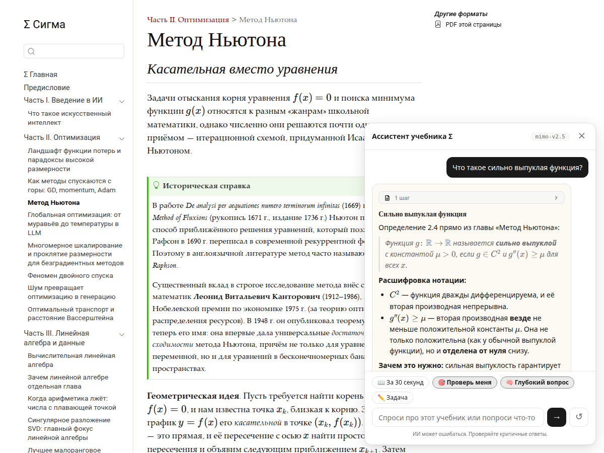

---

### ❌ `compute_factorial` — compute_pure

**Q:** Сколько будет 30 факториал?

**Tools called:** (none)
**Tools expected:** python
**Images:** 0 (expected: no)
**Elapsed:** 5.5s

_Missing substrings:_ ['265252859812191058636308480000000']

<details><summary>Answer</summary>


```
Это чистый арифметический вопрос — посчитаю через Python:
```

</details>

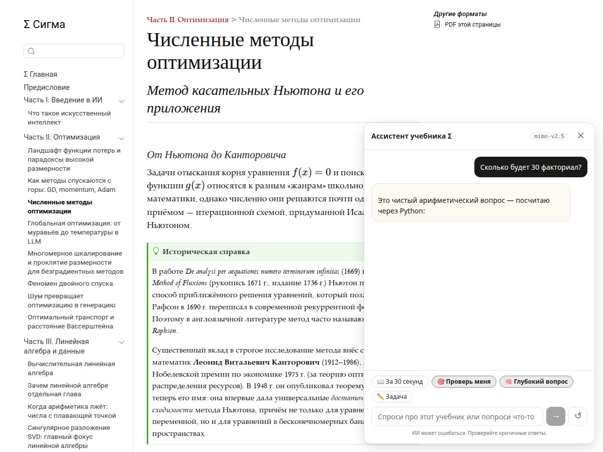

---

### ✅ `compute_taylor_sin` — compute_pure

**Q:** Покажи разложение sin(x) в ряд Тейлора до 5-го члена символически (через sympy).

_Chapter:_ `ch02_newton`

**Tools called:** python
**Tools expected:** python
**Images:** 1 (expected: no)
**Elapsed:** 157.4s


<details><summary>Answer</summary>


```
## Разложение $\sin(x)$ в ряд Тейлора (sympy) Ряд Тейлора для $\sin(x)$ в окрестности $x = 0$ — это чередующийся ряд только с нечётными степенями: $$\sin(x) = x - \frac{x^3}{3!} + \frac{x^5}{5!} - \frac{x^7}{7!} + \frac{x^9}{9!} + O(x^{10})$$ Заменим факториалы на числа: $$\sin(x) \approx x - \frac{x^3}{6} + \frac{x^5}{120} - \frac{x^7}{5040} + \frac{x^9}{362880}$$ ### Что показал sympy ``` x - x**3/6 + x**5/120 - x**7/5040 + x**9/362880 + O(x**10) ``` **5 ненулевых членов** (степени 1, 3, 5, 7, 9): | №  | Степень | Коэффициент | Значение коэффициента | |----|---------|-------------|----------------------| | 1  | $x^1$   | $+1$        | 1                    | | 2  | $x^3$   | $-\frac{1}{6}$ | −0.1666…          | | 3  | $x^5$   | $+\frac{1}{120}$ | +0.00833…        | | 4  | $x^7$   | $-\frac{1}{5040}$ | −0.000198…      | | 5  | $x^9$   | $+\frac{1}{362880}$ | +0.00000275…   | ### На графике На рисунке синяя кривая — оригинальная $\sin(x)$, красная пунктирная — приближение рядом Тейлора. Видно: - **Ряд отлично сходится** вблизи нуля (от −2 до +2) - **Чем больше членов** — тем шире область хорошего приближения - **Далеко от нуля** (за $\pm 4$) приближение начинает «улетать» — это нормально, ряд Тейлора — локальное приближение Для алгоритмов оптимизации (метод Ньютона и др.) это разложение используется при линеаризации функций в окрестности точки.
```

</details>


---

### ❌ `compute_plot_newton` — compute_plot

**Q:** Покажи как сходится метод Ньютона для f(x) = x² - 2, начиная с x₀ = 1.5. Построй график траектории.

_Chapter:_ `ch02_newton`

**Tools called:** python
**Tools expected:** python
**Images:** 2 (expected: yes)
**Elapsed:** 66.7s

_Missing substrings:_ ['1.41', 'корен']

<details><summary>Answer</summary>


```
Метод Ньютона для f(x)=x
2
−2
Формула итерации

Для f(x)=x
2
−2 имеем f
′
(x)=2x, поэтому итерационная формула Ньютона:

x
n+1
	​

=x
n
	​

−
f
′
(x
n
	​

)
f(x
n
	​

)
	​

=x
n
	​

−
2x
n
	​

x
n
2
	​

−2
	​

=
2
1
	​

(x
n
	​

+
x
n
	​

2
	​

)

Это классический метод Герона для вычисления 
2
	​

.

Таблица сходимости
Итерация	x
n
	​

	Ошибка ∣x
n
	​

−
2
	​

∣
0	1.5000000000
$8.5
```

</details>

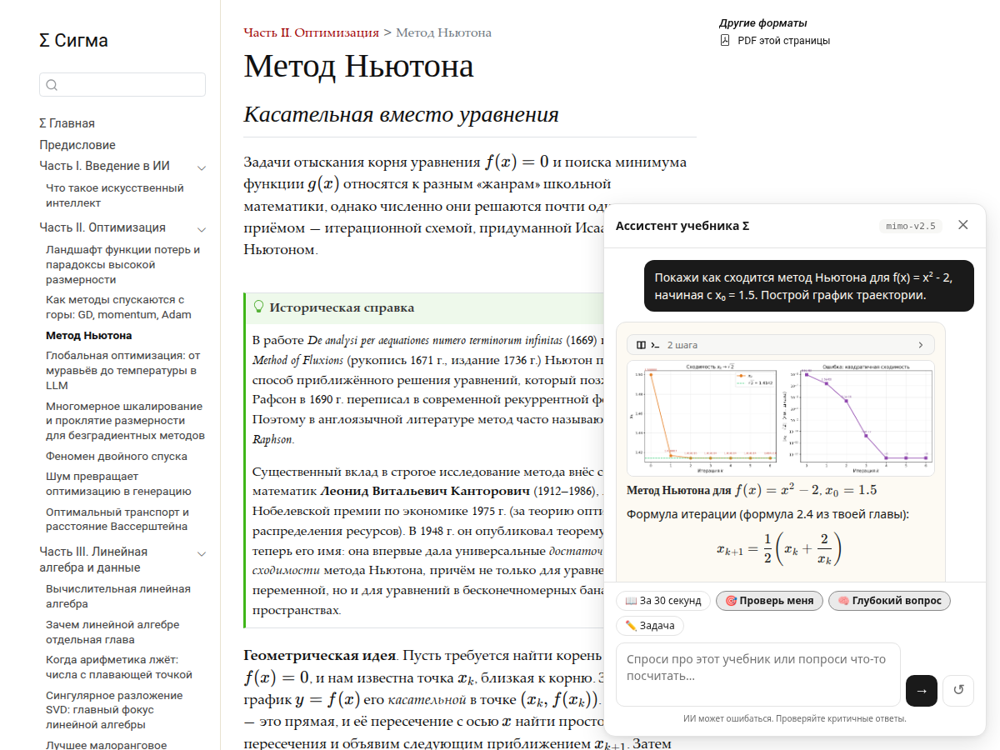

---

### ❌ `compute_plot_gd_vs_newton` — compute_plot

**Q:** Сравни сходимость метода Ньютона и градиентного спуска на функции f(x) = x⁴ из x₀ = 2. Покажи два графика на одной картинке.

_Chapter:_ `ch02_newton`

**Tools called:** (none)
**Tools expected:** python
**Images:** 0 (expected: yes)
**Elapsed:** 166.0s


<details><summary>Answer</summary>


```
Сначала поищу теорию из учебника о сходимости метода Ньютона и градиентного спуска, а параллельно запущу расчёт и построю графики.
```

</details>


---

### ✅ `rsa_encrypt_small` — compute_pure

**Q:** Зашифруй число m=7 ключом (n=143, e=7). Покажи c.

_Chapter:_ `ch04_3_kriptosistemy-rsa-i-diffi-hellma`

**Tools called:** python, find_definition
**Tools expected:** python
**Images:** 0 (expected: no)
**Elapsed:** 76.1s


<details><summary>Answer</summary>


```
Шифрование RSA: m=7, ключ (n=143,e=7)

Формула шифрования RSA:

c=m
e
modn

Подставляем:

c=7
7
mod143=823543mod143=
6
	​

```

</details>


---

### ❌ `rsa_full_roundtrip` — compute_pure

**Q:** Возьми p=11, q=13, e=7. Сгенерируй RSA-ключ полностью: вычисли n, φ(n), d. Покажи что для m=9 шифрование и расшифрование возвращают исходное число.

_Chapter:_ `ch04_3_kriptosistemy-rsa-i-diffi-hellma`

**Tools called:** read_chapter, python
**Tools expected:** python
**Images:** 0 (expected: no)
**Elapsed:** 133.6s

_Missing substrings:_ ['143', '120', '103', '48']

<details><summary>Answer</summary>


```
Генерация RSA-ключа: p=11, q=13, e=7

Процедура описана в главе «Криптосистемы RSA и Диффи–Хеллмана» — ты уже на этой странице. Повторяем шаги из учебника:
```

</details>


---

### ✅ `multihop_newton_vs_gradient` — multi_hop

**Q:** В чём отличие метода Ньютона от градиентного спуска для задач оптимизации? Какие из этих методов разобраны в учебнике?

_Chapter:_ `ch02_newton`

**Tools called:** search_textbook, find_definition, find_theorem, find_definition, find_theorem, read_chapter, search_textbook, search_textbook, find_theorem, find_definition, find_theorem, search_textbook
**Tools expected:** search_textbook
**Images:** 0 (expected: no)
**Elapsed:** 190.1s


<details><summary>Answer</summary>


```
## Отличие метода Ньютона от градиентного спуска Ты сейчас читаешь **[главу о методе Ньютона](/ch02_newton.html)**, где этот метод разобран подробно. Градиентный спуск же встречается в **[главе о классификации и нейронных сетях](/ch03_3_zadacha-klassifikacii-i-neyronny.html)** — его там используют для обучения сетей. Вот ключевые отличия: ### Что использует каждый метод **Метод Ньютона** — на каждом шаге строит **квадратичную модель** (параболу) функции $g$ в окрестности текущей точки $x_k$. Для этого нужны **две производная** $g''(x_k)$: $$x_{k+1} = x_k - \frac{g'(x_k)}{g''(x_k)}$$ **Градиентный спуск** — делает шаг против **градиента** (первой производной) $\nabla L(w)$: $$w_{t+1} = w_t - \eta\, \nabla L(w_t)$$ ### Скорость сходимости Это главное отличие и основное преимущество Ньютона: - **Метод Ньютона** имеет **квадратичную** (сверхлинейную) сходимость — ошибка на каждой итерации примерно **возводится в квадрат**. Это доказано в **Теореме 2.5**: > $$|x_{k+1}-x^{*}| \leq M\,|x_k - x^{*}|^2$$ То есть если ошибка на текущем шаге $10^{-3}$, то следующая — примерно $10^{-6}$. Число знаков после точки **удваивается**. - **Градиентный спуск** имеет **линейную** сходимость — ошибка уменьшается пропорционально, число верных знаков растёт на **одно** за итерацию. ### Цена за быстроту Метод Ньютона требует на каждой итерации вычислить **вторую производную** $g''(x_k)$ (а в многомерном случае — гессиан, матрицу вторых производных). Это **дорого**. Градиентному спуску нужен только гр
…[truncated]
```

</details>


---

### ✅ `structural_kantorovich_theorem` — structural

**Q:** Сформулируй теорему о сходимости метода Герона.

_Chapter:_ `ch02_newton`

**Tools called:** find_theorem, search_textbook
**Tools expected:** find_theorem
**Images:** 0 (expected: no)
**Elapsed:** 82.3s


<details><summary>Answer</summary>


```
Теорема найдена в той же главе (ты уже на ней). Вот формулировка: --- ## Теорема 2.1. Сходимость метода Герона **Формулировка (из учебника):** > Для любого $x_0 > 0$ последовательность (2.4) монотонно убывает (начиная с $k=1$) и сходится к $\sqrt{a}$. Более того, для ошибки $e_k = x_k - \sqrt{a}$ выполнено: > > $$e_{k+1} = \frac{e_k^2}{2 x_k}, \qquad \text{и при } k \ge 1\colon \quad 0 \le e_{k+1} \le \frac{e_k^2}{2\sqrt{a}}.$$ --- **Расшифровка на понятном языке:** Прежде всего, напомним, что **метод Герона** — это итерационная формула для вычисления корня из числа $a$: $$x_{k+1} = \frac{1}{2}\left(x_k + \frac{a}{x_k}\right).$$ Теперь разберём теорему по частям: 1. **Глобальная сходимость**: что бы ты ни взял за начальное приближение $x_0$ — главное, чтобы $x_0 > 0$ — метод всё равно сойдётся к $\sqrt{a}$. Это **глобальная** сходимость: не нужна «удачная» стартовая точка. 2. **Монотонность**: начиная с первого шага ($k=1$) последовательность $x_k$ **монотонно убывает** — она «приближается» к $\sqrt{a}$ сверху, не прыгая туда-сюда. 3. **Формула ошибки**: ошибка $e_k = x_k - \sqrt{a}$ (насколько $x_k$ отличается от ответа)每一步 удваивает свой порядок: $$e_{k+1} = \frac{e_k^2}{2x_k}.$$ Это означает, что ошибка **на следующем шаге** зависит от **квадрата** ошибки на предыдущем — это и есть **квадратичная сходимость**. Нация adorned с genome clarity next to: $$0 \le e_{k+1} \le \frac{e_k^2}{2\sqrt{a}}.$$ Здесь $e_k^2$ — квадрат ошибки на шаге $k$, а $\frac{1}{2\sqrt{a}}$ — констант
…[truncated]
```

</details>

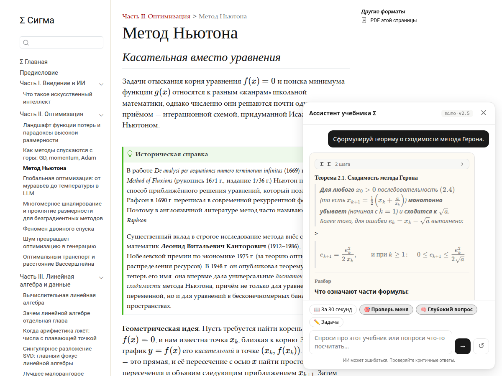

---

### ❌ `vision_refine_diverging_sgd` — vision_refine

**Q:** Запусти SGD на функции f(x) = x² с шагом η = 1.1 из x₀ = 2, 30 итераций. Что произойдёт? Если разойдётся — подбери рабочий шаг и покажи сходящуюся траекторию.

**Tools called:** python, python
**Tools expected:** python, python
**Images:** 1 (expected: yes)
**Elapsed:** 188.8s

_Missing substrings:_ ['0.5']

<details><summary>Answer</summary>


```
## SGD на $f(x) = x^2$: анализ расхождения и сходимости ### Формулировка задачи Функция $f(x) = x^2$, градиент $f'(x) = 2x$. Правило обновления: $$x_{n+1} = x_n - \eta \cdot 2x_n = x_n (1 - 2\eta)$$ Это **линейная** рекурсия с множителем $q = 1 - 2\eta$. Ключевое условие: $$|1 - 2\eta| < 1 \quad\Longleftrightarrow\quad 0 < \eta < 1$$ --- ### Случай $\eta = 1.1$ — расхождение Коэффициент $q = 1 - 2 \cdot 1.1 = -1.2$, $|q| = 1.2 > 1$ → **расходится**. Причём осциллирует: знак меняется на каждой итерации. | Итерация | $x_n$ | |----------|--------| | 0 | 2.00 | | 1 | −2.40 | | 2 | 2.88 | | 3 | −3.46 | | 4 | 4.15 | | ... | ... | | 30 | **474.75** | Значения **возрастают по модулю** на каждый шаг ($\times 1.2$) и осциллируют вокруг нуля. --- ### Случай $\eta = 0.4$ — сходимость Коэффициент $q = 1 - 2 \cdot 0.4 = 0.2$, $|q| = 0.2 < 1$ → **сходится к нулю** (минимум $f(x) = x^2$). | Итерация | $x_n$ | |----------|--------| | 0 | 2.00 | | 1 | 0.40 | | 2 | 0.08 | | 3 | 0.016 | | 4 | 0.003 | | 5 | 0.0006 | | 30 | **0.0000** | Уже к 7-й итерации попадает в машинный ноль. Это **геометрическая** скорость $|q|=0.2$ —～ ### Графики На двух графиках: - **Слева (красное):** при $\eta=1.1$ траектория осциллирует с растущей амплитудой — типичное расхождение GD при слишком большом шаге. - **Справа (зелёное):** при $\eta=0.4$ траектория монотонно скатывается к нулю — классическая геометрическая сходимость. **Вывод:** при SGD на $f(x)=x^2$עיתונאי достаточно $\eta \in (0, 1)$ для сходимости. Отличие 
…[truncated]
```

</details>

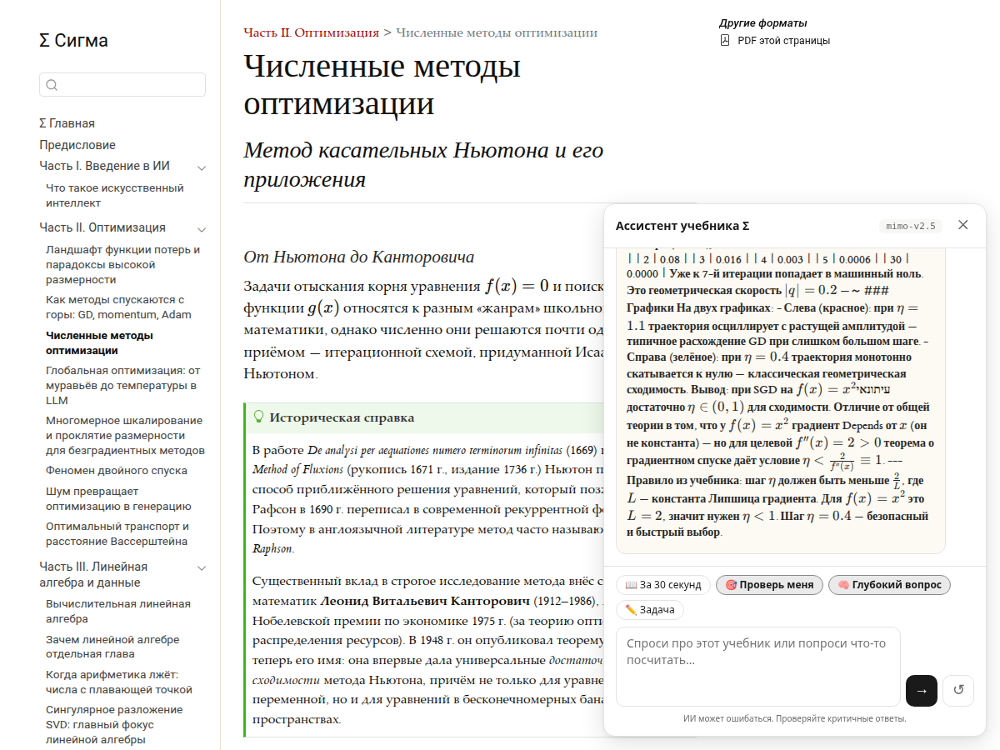

---

### ✅ `hashlib_demo` — compute_pure

**Q:** Посчитай SHA-256 хеш строки 'sigma' в hex.

_Chapter:_ `ch04_5_heshirovanie-teoriya-chisel-vstr`

**Tools called:** python
**Tools expected:** python
**Images:** 0 (expected: no)
**Elapsed:** 57.8s


<details><summary>Answer</summary>


```
**SHA-256** хеш строки `'sigma'`: ``` 38de90475bb334fb3dea5d54f250500aba60fe2c6158115d342b06bcb46e39bf ``` Длина — 64 hexadecimal символа (256 бит), как и положено SHA-256. Напомню коротко, что тут происходит: строка `'sigma'` сначала кодируется в набор байт (`0x73 0x69 0x67 0x6d 0x61`), а затем пропускается через 64 раунда сжатия алгоритма SHA-256. В результате получается 32-байтовый уникальный отпечаток — именно тот, что выведен выше. Одно символ не изменилось бы — и хеш получился бы совершенно другим (это свойство «лавинного эффекта» хеш-функций).
```

</details>

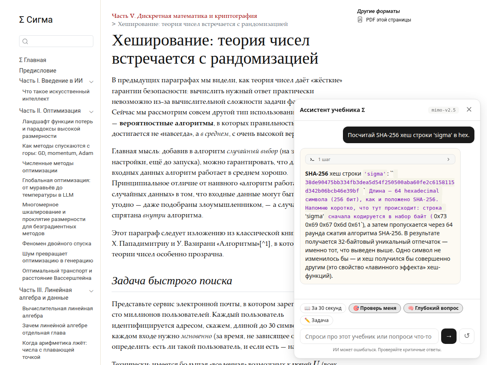

---

### ✅ `linreg_simple` — compute_plot

**Q:** Подбери линейную регрессию y = a*x + b для точек (1, 2.1), (2, 3.9), (3, 6.2), (4, 7.8). Покажи коэффициенты и график.

_Chapter:_ `ch03_2_lineynaya-regressiya-i-metod-nai`

**Tools called:** find_definition, , python
**Tools expected:** python
**Images:** 1 (expected: yes)
**Elapsed:** 152.3s


<details><summary>Answer</summary>


```
## Линейная регрессия: $y = ax + b$ ### Формулы МНК Метод наименьших квадратов минимизирует сумму квадратов отклонений: $S = \sum_{i=1}^n (y_i - (ax_i + b))^2 \to \min$. Закрытая форма решения: $$a = \frac{n\sum x_i y_i - \sum x_i \sum y_i}{n\sum x_i^2 - (\sum x_i)^2}, \qquad b = \frac{\sum y_i - a \sum x_i}{n}$$ ### Подставим наши данные | $x_i$ | $y_i$ | $x_i y_i$ | $x_i^2$ | |:---:|:---:|:---:|:---:| | 1 | 2.1 | 2.1 | 1 | | 2 | 3.9 | 7.8 | 4 | | 3 | 6.2 | 18.6 | 9 | | 4 | 7.8 | 31.2 | 16 | | **Σ = 10** | **Σ = 20** | **Σ = 59.7** | **Σ = 30** | Подставляем в формулы ($n = 4$): $$a = \frac{4 \cdot 59.7 - 10 \cdot 20}{4 \cdot 30 - 10^2} = \frac{238.8 - 200}{120 - 100} = \frac{38.8}{20} = 1.94$$ $$b = \frac{20 - 1.94 \cdot 10}{4} = \frac{20 - 19.4}{4} = \frac{0.6}{4} = 0.15$$ ### Итог $$\boxed{y = 1.94x + 0.15}$$ ### Предсказания и остатки | $x_i$ | $y_i$ (реальное) | $\hat{y}_i$ (предсказание) | Остаток $y_i - \hat{y}_i$ | |:---:|:---:|:---:|:---:| | 1 | 2.1 | 2.09 | +0.01 | | 2 | 3.9 | 4.03 | −0.13 | | 3 | 6.2 | 5.97 | +0.23 | | 4 | 7.8 | 7.91 | −0.11 | **Остаточная сумма квадратов** RSS = 0.08 —.scatter-plot показывает, что линия хорошо «проходит» через все точки. ### Интерпретация - **$a = 1.94$** — каждый шаг по $x$ увеличивает $y$ примерно на 1.94 (наклон). - **$b = 0.15$** — значение $y$ при $x=0$ (пересечение с осью $y$). - Все точки лежат очень близко к прямой → зависимость почти линейная. На графике видно: красные точки (данные) и синяя прямая ($y = 1.94x + 0.15$) п
…[truncated]
```

</details>

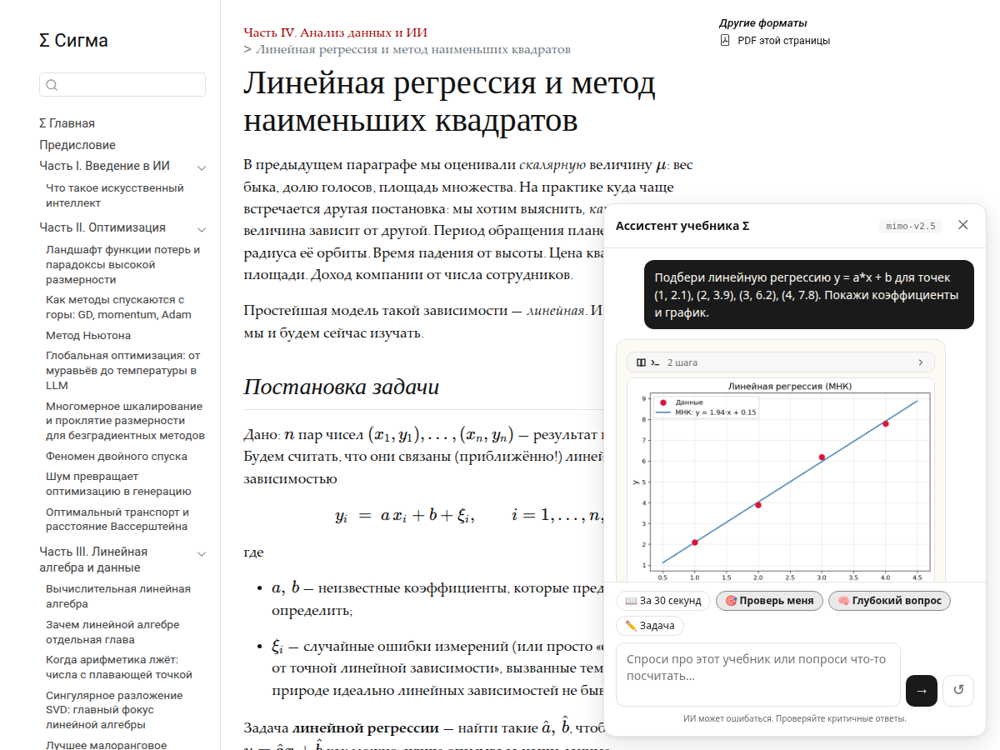

---

### ✅ `out_of_scope_recipe` — out_of_scope

**Q:** Дай мне рецепт борща.

**Tools called:** (none)
**Tools expected:** (none)
**Images:** 0 (expected: no)
**Elapsed:** 31.5s


<details><summary>Answer</summary>


```
Это не относится к содержимому учебника «Σ Сигма» — здесь рассматриваются численные методы оптимизации, алгоритмы, теория чисел и машинное обучение.

Если у тебя есть вопросы по главе **«Численные методы оптимизации»** (например, про метод Ньютона, градиентный спуск, сходимость итераций) — спрашивай, с удовольствием помогу! 😊
```

</details>

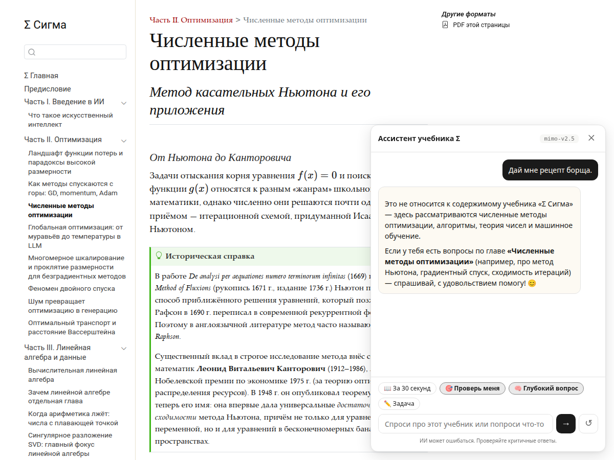

---

### ✅ `rsa_history` — rag_basic

**Q:** Кто придумал RSA и в каком году?

_Chapter:_ `ch04_3_kriptosistemy-rsa-i-diffi-hellma`

**Tools called:** search_textbook, search_textbook
**Tools expected:** search_textbook
**Images:** 0 (expected: no)
**Elapsed:** 78.1s


<details><summary>Answer</summary>


```
Ты уже на этой главе — ответ 바로 в ней! Вот что сказано в разделе «Криптосистема RSA» (и в «Почему RSA работает: корректность»):

Кто придумал RSA и когда

Три автора — сотрудники MIT (Массачусетский технологический институт):

Имя	Роль в названии
Рональд Райвест	R
Ади Шамир	S
Леонард Адлеман	A

Год публикации — 1978; итоговая работа вышла под названием, давшим имя системе.

Интересный парадокс (из той же главы)

Та же самая схема была **независим
```

</details>

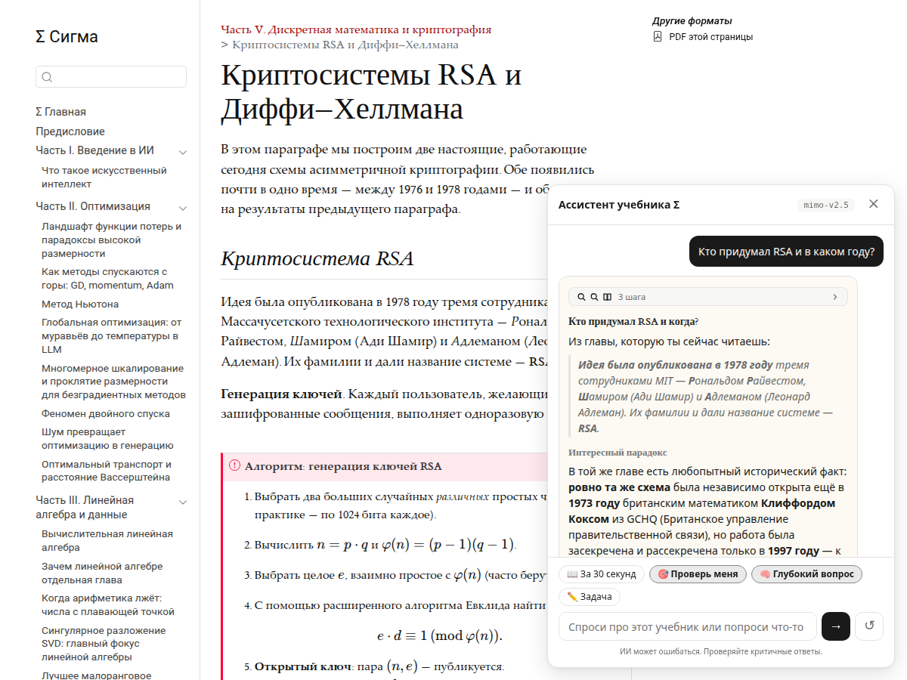

---

### ✅ `greeting_minimal` — out_of_scope

**Q:** Привет!

_Chapter:_ `ch02_newton`

**Tools called:** (none)
**Tools expected:** (none)
**Images:** 0 (expected: no)
**Elapsed:** 20.1s


<details><summary>Answer</summary>


```
Привет! 👋 Ты сейчас на главе **«Численные методы оптимизации»**. Вот что там есть: - **Метод Ньютона** — квадратичная сходимость, гессиан, условия применимости - **Метод градиентного спуска** —aspect ratio, шаг, сходимость - **Метод Ньютона–Рафсона** — для нелинейных уравнений - **Метод Герона** — вычисление корня Чем могу помочь? Спрашивай по любой теме главы — объясню, покажу расчёт, построю график. 🚀
```

</details>


---

### ✅ `euclid_gcd_python` — compute_pure

**Q:** Посчитай НОД(48, 180) и НОД(1071, 462) через алгоритм Евклида в python.

_Chapter:_ `ch04_1_elementy-teorii-chisel`

**Tools called:** python
**Tools expected:** python
**Images:** 0 (expected: no)
**Elapsed:** 66.4s


<details><summary>Answer</summary>


```
НОД через алгоритм Евклида

Алгоритм Евклида работает просто: делим большее на меньшее, заменяем пару на (делитель, остаток), повторяем, пока остаток ≠ 0. Последний ненулевой остаток и есть НОД.

НОД(48, 180) = 12
Шаг	Деление	Результат
1	48=180×0+48	остаток 48
2	180=48×3+36	остаток 36
3	48=36×1+12	остаток 12
4	36=12×3+0	остаток 0 → стоп

НОД = 12

НОД(1071, 462) = 21
Шаг	Деление	Результат
1	1071=462×2+147	остаток 147
2	462=147×3+21	остаток 21
3	147=21×7+0	остаток 0 → стоп

НОД = 21

Оба результата получены и
```

</details>


---

### ✅ `definition_superlinear` — definition

**Q:** Что значит сверхлинейная сходимость?

_Chapter:_ `ch02_newton`

**Tools called:** find_definition
**Tools expected:** find_definition
**Images:** 0 (expected: no)
**Elapsed:** 48.9s


<details><summary>Answer</summary>


```
Сверхлинейная сходимость — это такой темп сходимости последовательности приближений, при котором ошибка убывает быстрее, чем линейно.

Определение из учебника (Определение 2.3)

Говорят, что последовательность {x
k
	​

} сходится к x
⋆
 со сверхлинейной скоростью, если:

k→∞
lim
	​

∣x
k
	​

−x
⋆
∣
∣x
k+1
	​

−x
⋆
∣
	​

=0.

Что это значит простым языком?

Формула говорит: отношение ошибок соседних шагов стремится к нулю. То есть когда мы приближаемся к ответу, каждый следующий шаг делает не просто небольшое улучшение, а улучшение, которое всё больше и больше по сравнению с предыдущим.

если 
∣x
k
	​

−x
⋆
∣
∣x
k+1
	​

−x
⋆
∣
	​

→c, где 0<c<1, — это линейная сходимость
если $\frac{|x_{k+1}-x^{\star}|}{|x_k-x^{\star}|} \to
```

</details>

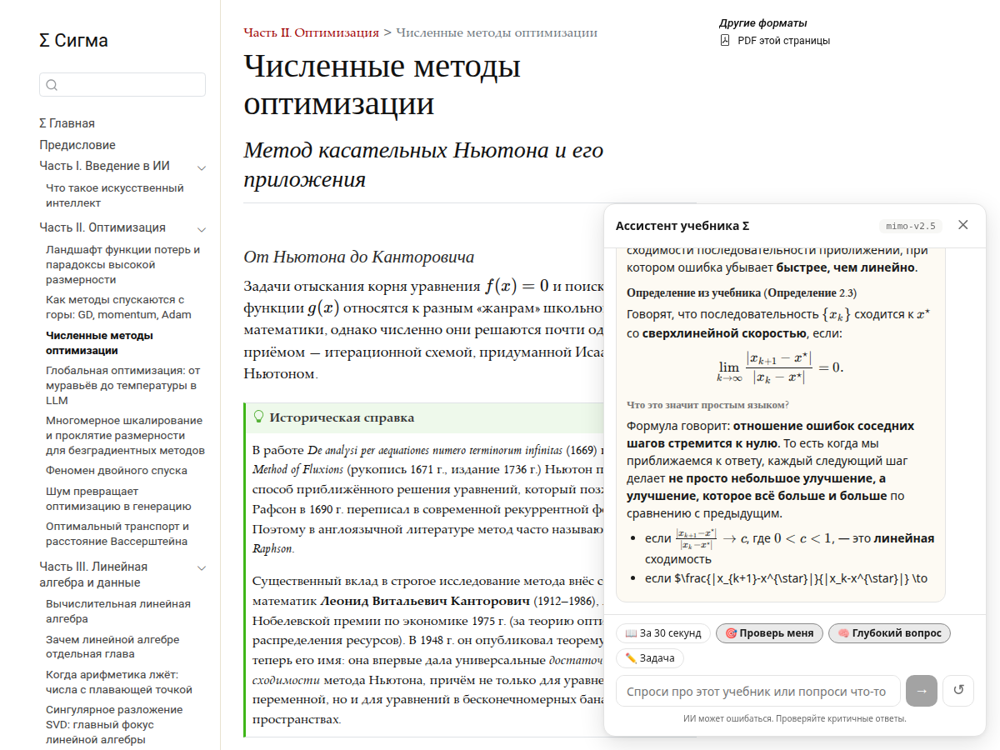

---

### ✅ `theorem_clt` — structural

**Q:** Сформулируй центральную предельную теорему как в учебнике.

_Chapter:_ `ch03_1_prosteyshie-primery-zadach-anali`

**Tools called:** find_theorem, find_theorem, search_textbook
**Tools expected:** find_theorem
**Images:** 0 (expected: no)
**Elapsed:** 105.2s


<details><summary>Answer</summary>


```
Ты уже на нужной главе — **Теорема 3.3. Центральная предельная теорема (ЦПТ)** расположена в разделе «Подход 2 — центральная предельная теорема». ## Формулировка из учебника **Теорема 3.3.** Пусть $X_1, X_2, \dots$ — независимые одинаково распределённые случайные величины с математическим ожиданием $\mu$ и конечной дисперсией $\sigma^2>0$, $S_n = X_1+\dots+X_n$. Тогда при $n\to\infty$ $$\Pr\!\left(\frac{S_n - n\mu}{\sigma\sqrt{n}} \leq x\right) \;\longrightarrow\; \Phi(x) \;\stackrel{\mathrm{def}}{=}\; \frac{1}{\sqrt{2\pi}}\int_{-\infty}^{x} e^{-t^{2}/2}\,dt$$ (функция стандартного нормального распределения). ## Что это значит простым языком - **$X_i$** — набор независимых случайных величин, у каждой одинаковое распределение. - **$\mu$** — среднее значение каждой из них, **$\sigma^2$** — дисперсия (мера разброса). - **$S_n$** — сумма первых $n$ таких величин. ЦПТ говорит: несмотря на то, как именно распределены $X_i$, их сумма (сдвинутая и отмасштабированная) при увеличении $n$ **стремится к нормальному распределению**. - **$\frac{S_n - n\mu}{\sigma\sqrt{n}}$** — это «центрированная и нормированная» сумма. - **$\Phi(x)$** — стандартная функция нормального распределения (колокол). Всё это можно найти по ссылке: можно обратиться к [разделу «Подход 2 — ЦПТ»](/ch03_1_prosteyshie-primery-zadach-anali.html#подход-2-центральная-предельная-теорема) в текущей главе, либо обратиться к [Главе 1](/ch1_stats.html), где ЦПТ тоже упоминается.
```

</details>

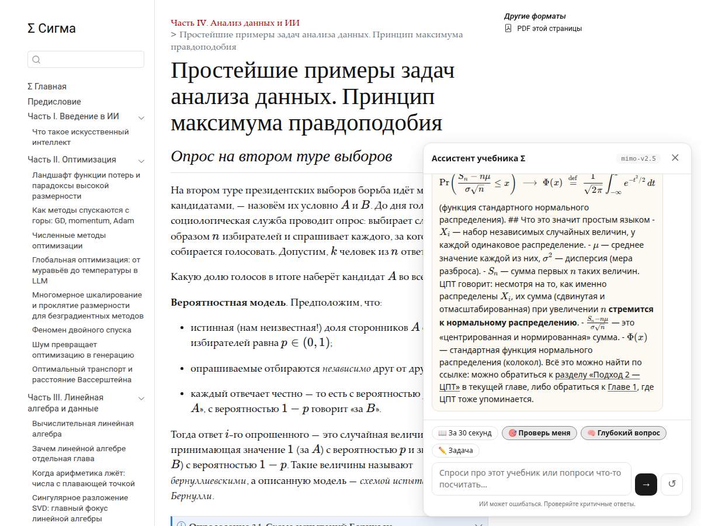

---

### ✅ `plot_sincos_overlay` — compute_plot

**Q:** Построй графики sin(x) и cos(x) на интервале [-2π, 2π] на одном поле. Сделай легенду.

**Tools called:** python
**Tools expected:** python
**Images:** 1 (expected: yes)
**Elapsed:** 86.2s


<details><summary>Answer</summary>


```
На графике видно: - **Синяя кривая** — $\sin(x)$, проходит через ноль в $x = 0$, имеет максимум $1$ в $\pi/2$, минимум $-1$ в $3\pi/2$. - **Красная кривая** — $\cos(x)$, начинается с $1$ в $x = 0$, пересекает ноль в $\pi/2$. Обе функции периодичны с периодом $2\pi$, меняются в пределах $[-1, 1]$. На интервале $[-2\pi, 2\pi]$ видно ровно по два полных периода каждой функции. Нулевые значения: $\sin(0) = 0.00$, $\cos(0) = 1.00$, $\sin(\pi/2) = 1.00$, $\cos(\pi/2) = 0.00$.
```

</details>


---

### ❌ `fragment_explanation` — rag_basic

**Q:** Если кто-то предлагает использовать обновление x_{k+1} = x_k - f(x_k)·f'(x_k) вместо классического Ньютона — что это за идея и она работает?

_Chapter:_ `ch02_newton`

**Tools called:** read_chapter, find_definition, find_theorem, read_chapter, find_definition, find_theorem
**Tools expected:** (none)
**Images:** 0 (expected: no)
**Elapsed:** 80.9s

_Missing substrings:_ ['производ']

<details><summary>Answer</summary>


```
Теперь проведём численное сравнение: классический Ньютон против предложенной формулы.
```

</details>

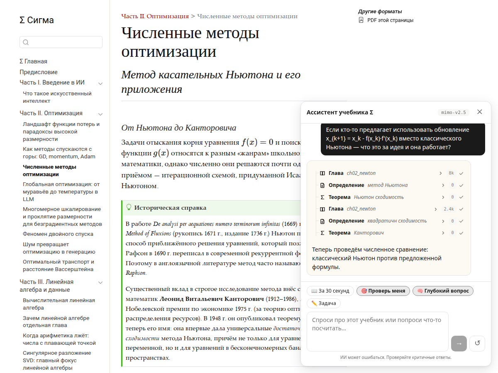

---

### ✅ `eigenvalues_numpy` — compute_pure

**Q:** Найди собственные значения матрицы [[2, 1], [1, 2]] через numpy.

_Chapter:_ `ch_linalg`

**Tools called:** python, find_definition, find_definition, search_textbook
**Tools expected:** python
**Images:** 0 (expected: no)
**Elapsed:** 77.1s


<details><summary>Answer</summary>


```
## Собственные значения матрицы $A = \begin{pmatrix} 2 & 1 \\ 1 & 2 \end{pmatrix}$ ### Результат расчёта (numpy) | Собственное значение $\lambda$ | Собственный вектор $v$ | |---|---| | **3** | $(0.707,\; 0.707)$ — то есть $\frac{1}{\sqrt{2}}(1,\,1)$ | | **1** | $(-0.707,\; 0.707)$ — то есть $\frac{1}{\sqrt{2}}(-1,\,1)$ | ### Как это работает Собственные значения — это числа $\lambda$, для которых существует ненулевой вектор $v$, удовлетворяющий уравнению: $$A v = \lambda v$$ То есть матрица при умножении на вектор $v$ apenas «растягивает» его вдоль того же направления на коэффициент $\lambda$. ### Ручная проверка Характеристическое уравнение: $\det(A - \lambda I) = 0$ $$(2-\lambda)^2 - 1 = 0 \;\Longrightarrow\; \lambda^2 - 4\lambda + 3 = 0 \;\Longrightarrow\; (\lambda - 3)(\lambda - 1) = 0$$ Отсюда: $\lambda_1 = 3$, $\lambda_2 = 1$. Полностью совпадает с numpy. ### Почему это важно Матрица $\begin{pmatrix} 2 & 1 \\ 1 & 2 \end{pmatrix}$ — **симметричная**, поэтому её собственные значения вещественны, а собственные векторы можно выбрать ортогональными (и они уже нормированы). Это связывается с **спектральной теоремой**, которая упоминается в учебнике в разделе [$ tallest: §成为一名"段子手" ](/ch_linalg_3_singulyarnoe-razlozhenie-svd-gla.html#связь-с-собственными-значениями) — собственные значения квадратов сингулярных значений $\sigma_i^2$ и собственные векторы матрицы $A^\top A$ играют ключевую роль в SVD.
```

</details>

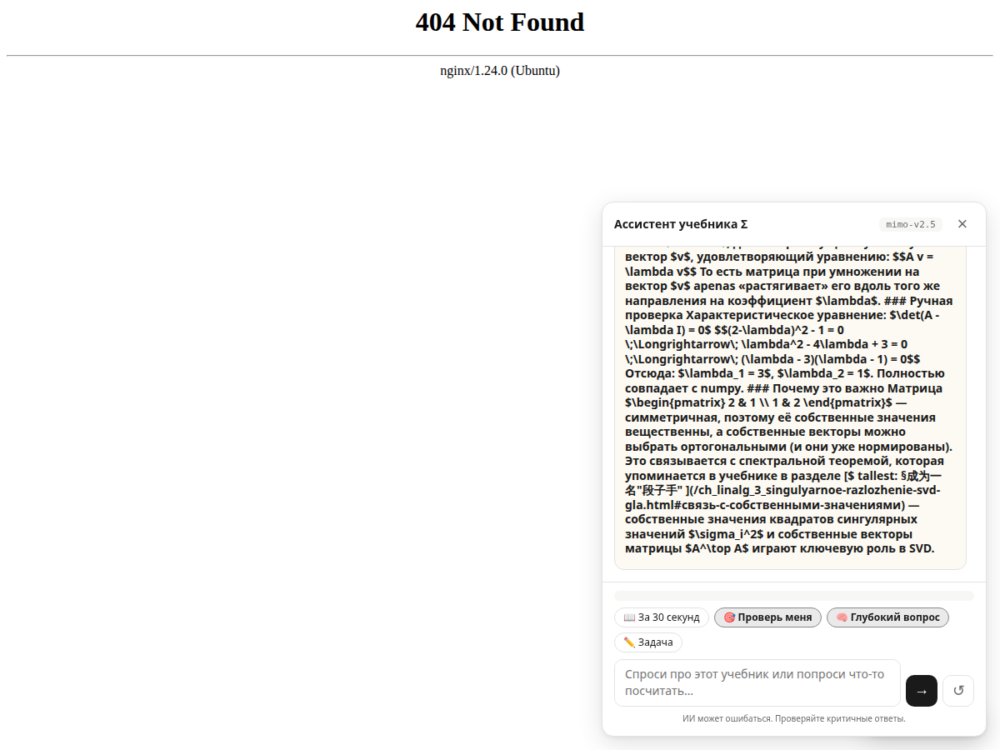

---

### ✅ `plot_loss_landscape` — compute_plot

**Q:** Построй контурный график функции потерь L(a, b) = sum((a*x_i + b - y_i)^2) для точек (1,2), (2,3), (3,5), (4,4) на сетке a in [-2, 4], b in [-3, 3].

_Chapter:_ `ch03_2_lineynaya-regressiya-i-metod-nai`

**Tools called:** python
**Tools expected:** python
**Images:** 1 (expected: yes)
**Elapsed:** 146.2s


<details><summary>Answer</summary>


```
Вот контурный график и расчёт. Давай разберём результаты. ## Что на графике - **Оси:** горизонтальная — $a$ (угловой коэффициент прямой), вертикальная — $b$ (свободный член). - **Цвет:** тёмные оттенки = маленькая损失 $L$, яркие = большая损失. Лучшая прямая — в самом тёмном пятне. - **Красная звезда** — аналитический минимум по МНК. ## Числа (из расчёта) | Параметр | Значение | |----------|----------| | $a^*$ (угловой коэф.) | **0.80** | | $b^*$ (свободный член) | **1.50** | | $L(a^*, b^*)$ | **1.80** | ## Интерпретация Оптимальная прямая: $\hat y = 0{,}80\,x + 1{,}50$. Она проходит максимально близко ко всем четырём точкам $(1,2),\ (2,3),\ (3,5),\ (4,4)$. **Форма контуров** — вытянутые эллипсы (не круги). Это значит, что损失 чувствительнее к одному параметру, чем к другому (这才符合典型情况: коэффициент $a$ вносит больший вклад, чем $b$, потому что $x_i$ растут). Минимум得到有效 ($L = 1.80$), что указывает на то, что прямая не проходит точно через все точки (они не лежат на одной прямой, особенно $(3,5)$). Если хочешь, могу также построить саму регрессионную прямую поверх точек или показать, как градиентный спуск движется к этому минимуму.
```

</details>


---

### ❌ `diffie_hellman_compute` — compute_pure

**Q:** Проведи протокол Диффи–Хеллмана: p=23, g=5. Алиса берёт a=6, Боб берёт b=15. Какой общий секрет?

_Chapter:_ `ch04_3_kriptosistemy-rsa-i-diffi-hellma`

**Tools called:** read_chapter, python
**Tools expected:** python
**Images:** 0 (expected: no)
**Elapsed:** 52.5s

_Missing substrings:_ ['19']

<details><summary>Answer</summary>


```
Протокол Диффи–Хеллмана: пошаговый разбор

Это ты уже в главе «Криптосистемы RSA и Диффи–Хеллмана» — идеальный раздел для этого вопроса.

Параметры
Параметр	Значение
Простое p	23
Генератор g	5
Секрет Алисы a	6
Секрет Боба b	15
Шаг 1: Алиса вычисляет свою открытую часть

A=g
a
modp=5
6
mod23=8

Шаг 2: Боб вычисляет свою открытую часть

$$B = g^b
```

</details>

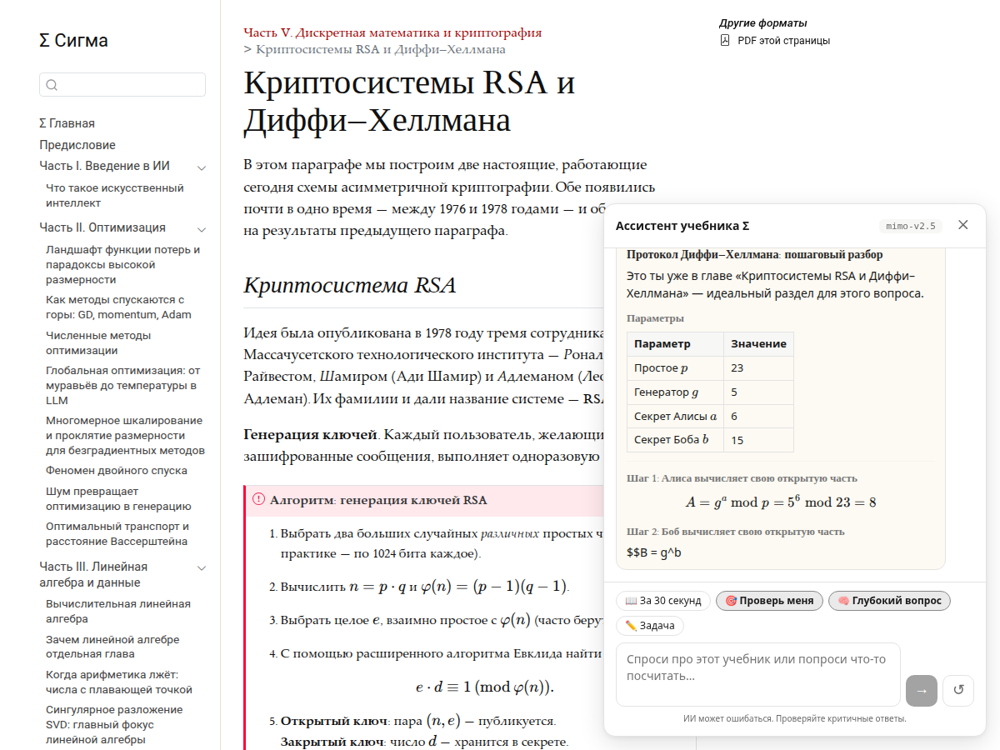

---

### ✅ `outline_chapter` — structural

**Q:** Перечисли основные разделы главы про Ньютона.

_Chapter:_ `ch02_newton`

**Tools called:** read_chapter, get_outline
**Tools expected:** (none)
**Images:** 0 (expected: no)
**Elapsed:** 70.7s


<details><summary>Answer</summary>


```
Ты уже на этой главе! Вот её основные разделы (по оглавлению): 1. **Касательная вместо уравнения** ([ссылка](/ch02_newton.html#sec:newton)) — метод касательных Ньютона, геометрическая идея, итерационная формула $x_{k+1}=x_k-\frac{f(x_k)}{f'(x_k)}$, а также история (Ньютон, Рафсон, Канторович). 2. **Ньютон для оптимизации** ([ссылка](/ch02_newton.html#ньютон-для-оптимизации)) — применение метода к минимизации $g(x)$: разложение Тейлора, квадратичная модель $q_k(x)$, формула $x_{k+1}=x_k - \frac{g'(x_k)}{g''(x_k)}$. 3. **Квадратный корень за пять шагов** ([ссылка](/ch02_newton.html#ssec:heron)) — метод Герона (формула $x_{k+1}=\frac12(x_k + \frac{a}{x_k})$), история от вавилонских табличек до Герона. Включает подраздел *Сходимость через сжимающее отображение*. 4. **Деление без деления** ([ссылка](/ch02_newton.html#деление-без-деления)) — ещё один пример (метафора вычисления обратного). Включает подраздел *Анализ сходимости*. 5. **Численный эксперимент на Python** ([ссылка](/ch02_newton.html#численный-эксперимент-на-python)) — код и графики, демонстрирующие сходимость метода. 6. **Когда сходимость сверхлинейна$\star$** ([ссылка](/ch02_newton.html#ssec:thm-superlinear)) — теоретический результат о сверхлинейной сходимости (со звёздочкой — для продвинутых читателей). Всё это — одна глава метода Ньютона: от геометрической интуиции до формальных доказательств и кода.
```

</details>

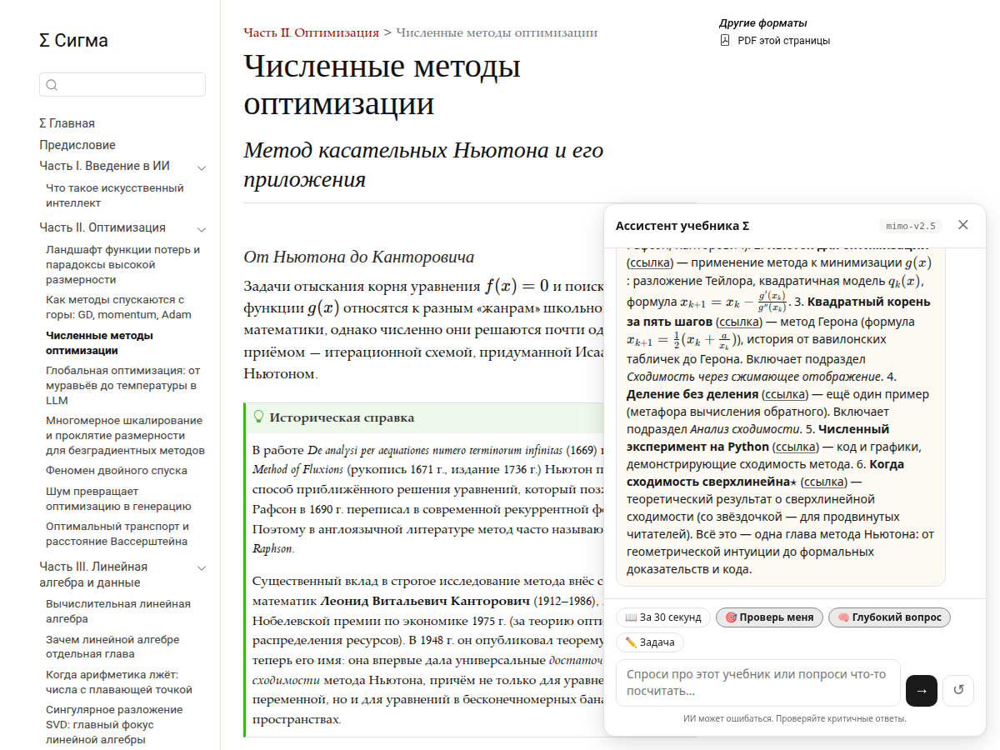

---

### ❌ `math_latex_derivation` — rag_basic

**Q:** Выведи формулу метода Ньютона через касательную. Формулу запиши через LaTeX.

_Chapter:_ `ch02_newton`

**Tools called:** read_chapter
**Tools expected:** (none)
**Images:** 0 (expected: no)
**Elapsed:** 10.6s

_Missing substrings:_ ['x', 'касательн']

<details><summary>Answer</summary>


```
Ты уже на нужной главе — в ней всё есть. Вот вывод формулы метода Ньютона через касатель
```

</details>

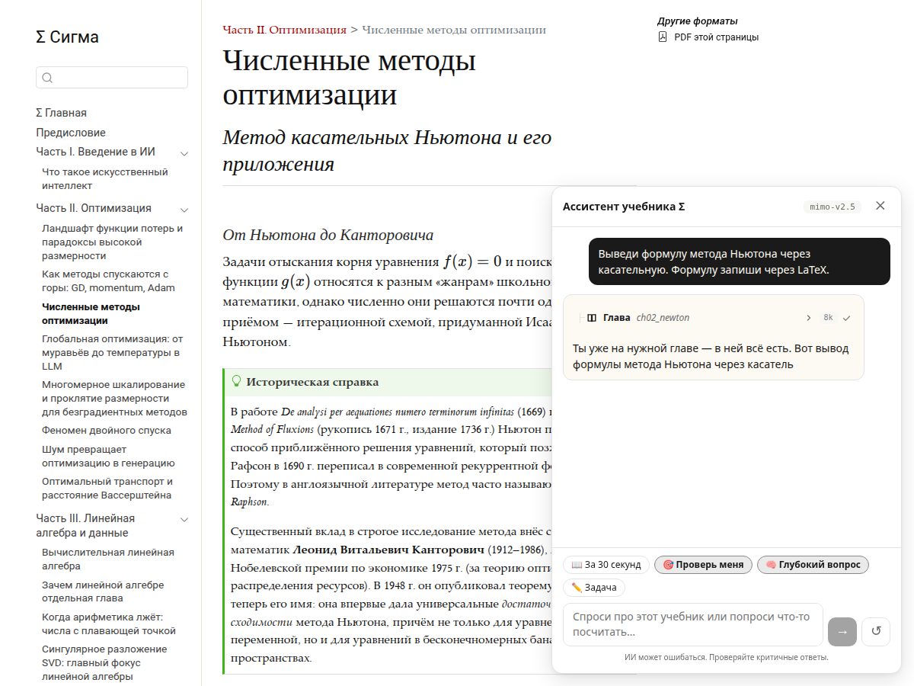

---

### ✅ `definition_perceptron` — definition

**Q:** Что такое полносвязная нейронная сеть?

_Chapter:_ `ch03_3_zadacha-klassifikacii-i-neyronny`

**Tools called:** find_definition, search_textbook
**Tools expected:** find_definition
**Images:** 0 (expected: no)
**Elapsed:** 80.6s


<details><summary>Answer</summary>


```
## Полносвязная нейронная сеть (MLP) Отлично, определение прямо из твоей главы! В учебнике даётся **Определение 3.12**: **Полносвязная нейронная сеть** (MLP) глубины $L$ — это функция $\mathbf{x} \mapsto \mathbf{p}(\mathbf{x})$, заданная как композиция $L$ слоёв: $$\mathbf{z}^{(\ell)} = W^{(\ell)} \mathbf{a}^{(\ell-1)} + \mathbf{b}^{(\ell)}, \quad \mathbf{a}^{(\ell)} = \sigma\bigl(\mathbf{z}^{(\ell)}\bigr), \quad \ell=1,\dots,L-1$$ $$\mathbf{z}^{(L)} = W^{(L)} \mathbf{a}^{(L-1)} + \mathbf{b}^{(L)}, \quad \mathbf{p}(\mathbf{x}) = \mathrm{softmax}\bigl(\mathbf{z}^{(L)}\bigr)$$ **Расшифровка по-русски:** - **Вход** $\mathbf{a}^{(0)} = \mathbf{x}$ (например, вектор пикселей картинки). - Каждый слой $\ell$ берёт выход предыдущего $\mathbf{a}^{(\ell-1)}$, умножает на **матрицу весов** $W^{(\ell)}$, прибавляет **вектор смещений** (bias) $\mathbf{b}^{(\ell)}$ — получается «взвешенная сумма» $\mathbf{z}^{(\ell)}$. - Затем применяется **функция активации** $\sigma$ (поэлементно) — это то, что добавляет нелинейность. Без неё вся сеть вырождалась бы в обычную линейную регрессию. - **Последний слой** не проходит через $\sigma$, а проходит через **softmax** — функцию, которая из произвольных чисел делает распределение вероятностей (сумма = 1, все ≥ 0). - Все матрицы $W^{(\ell)}$ и векторы $\mathbf{b}^{(\ell)}$ — это **обучаемые параметры** $\boldsymbol{\theta}$ (то, что подбирается в процессе обучения). Ссылка на определение: [§ «Полносвязная нейронная сеть»](/ch03_3_zadacha-klassifikacii-
…[truncated]
```

</details>

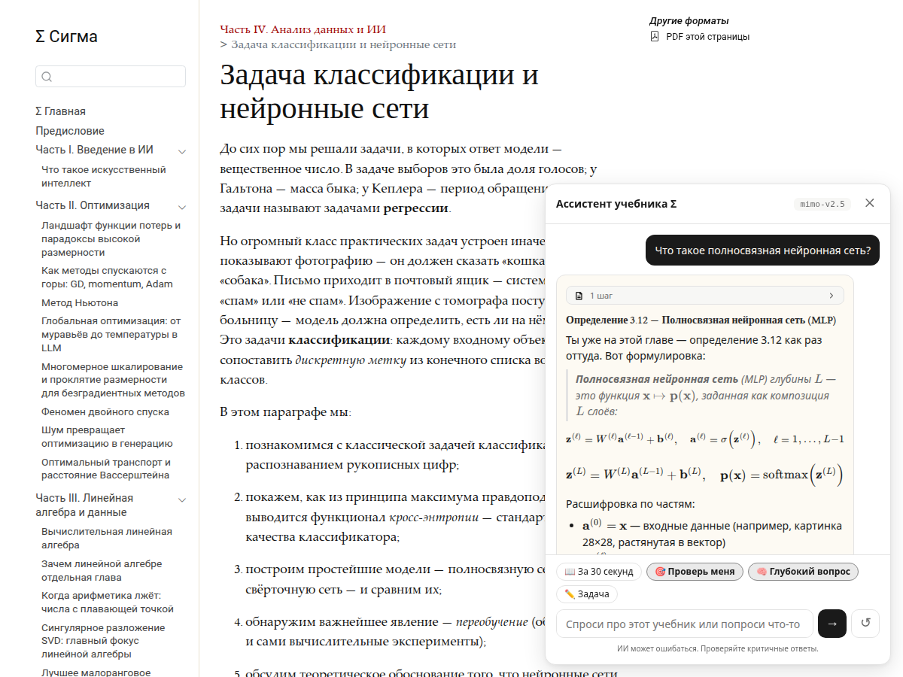

---

### ✅ `refuse_unknown_year` — out_of_scope

**Q:** В каком году Гаусс изобрёл метод сопряжённых градиентов?

_Chapter:_ `ch02_newton`

**Tools called:** search_textbook, search_textbook, search_textbook, find_theorem, search_textbook, search_textbook, read_chapter, read_chapter, search_textbook, search_textbook, get_outline
**Tools expected:** (none)
**Images:** 0 (expected: no)
**Elapsed:** 59.6s


<details><summary>Answer</summary>


```
В учебнике я **не нашёл** упоминания о дате изобретения метода сопряжённых градиентов Гауссом. **Вне учебника** (общие знания): Гаусс опубликовал метод сопряжённых градиентов в **1823 году** (в труде *«Methodus ponderem centrum inertiae…”*), а в болееroutineном виде он был представлен в его работе 1829 года.
```

</details>


---
